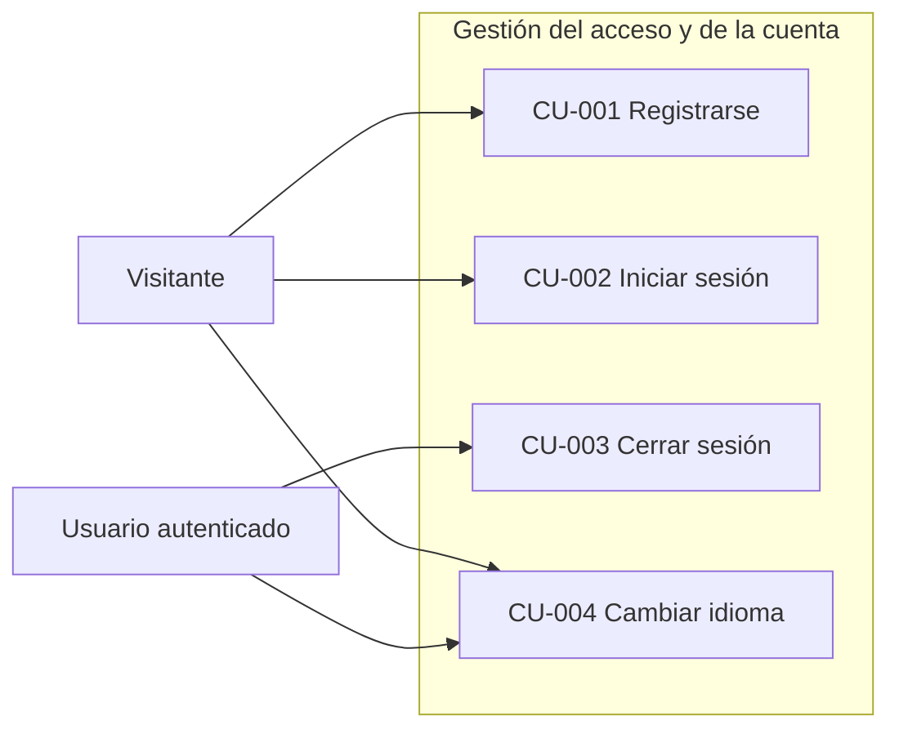
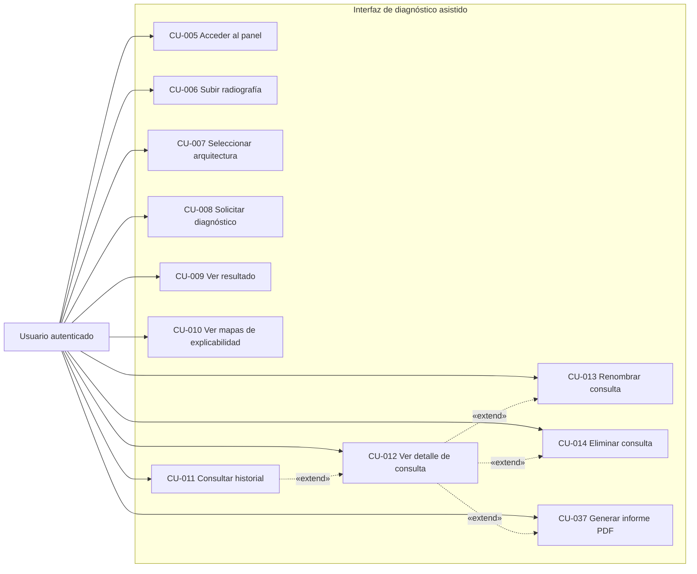
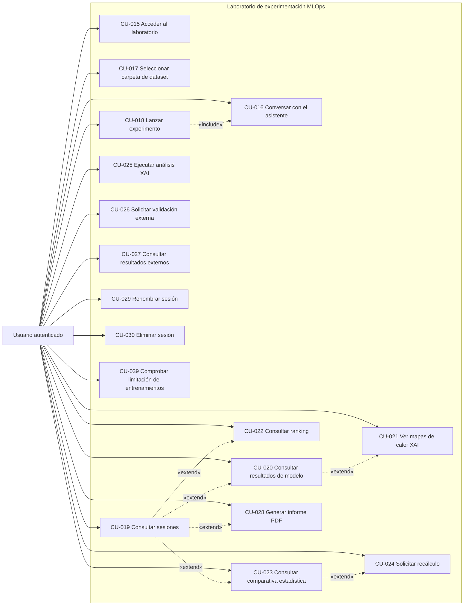
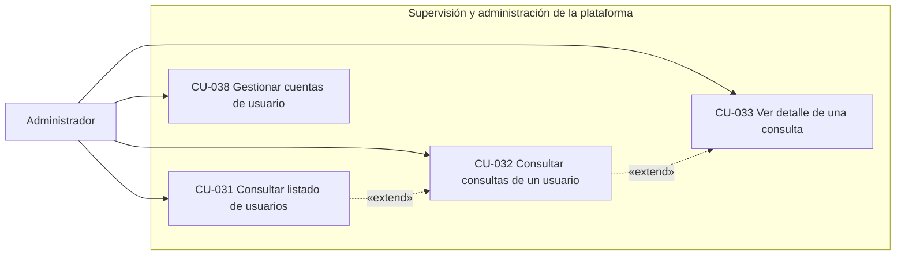
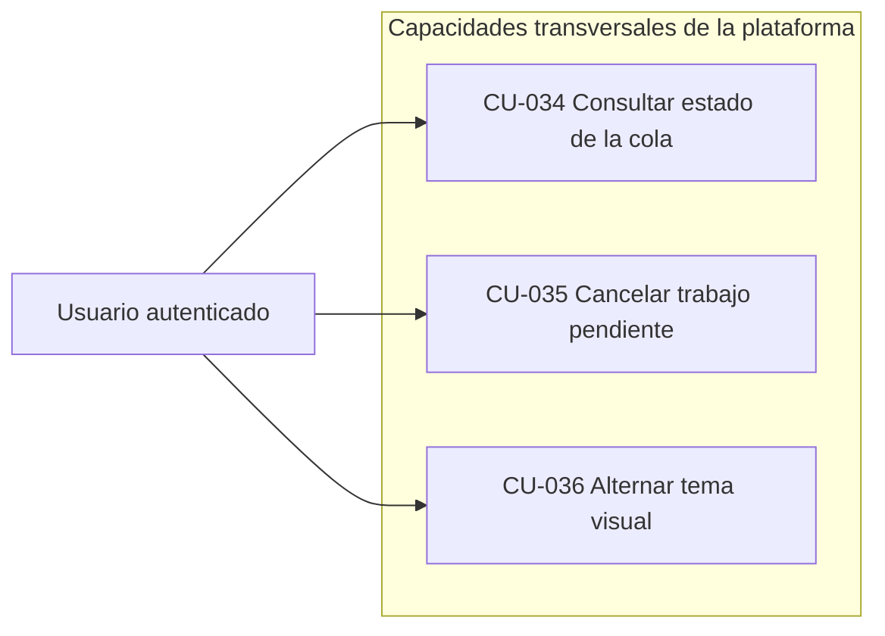

# Capítulo 12: Especificación de requisitos del sistema

Los requisitos traducen las necesidades del proyecto a condiciones que pueden comprobarse en la solución construida (Wiegers & Beatty, 2013). Para que cumplan esa función, deben expresar una intención sin ambigüedades, permitir una comprobación objetiva y conservar el vínculo con el objetivo o necesidad que los origina. Estas propiedades permiten utilizar el catálogo como referencia común entre el análisis, el diseño y la validación, en lugar de limitarlo a una declaración general sobre el sistema (Jacobson, Booch, & Rumbaugh, 1999; Larman, 2004). Este capítulo recoge las especificaciones de vitalXAI a partir de los objetivos definidos en el capítulo de metas y propósitos y de los casos de uso identificados durante el análisis, manteniendo la trazabilidad entre necesidad, caso de uso y requisito.

## 12.1 Obtención y organización de los requisitos

Los requisitos del sistema se han obtenido de tres fuentes complementarias. La primera son los objetivos específicos del capítulo 2, que descomponen el objetivo general en metas concretas y verificables y actúan como punto de anclaje de cada requisito. La segunda son los casos de uso recogidos en el análisis, que describen las interacciones de los actores con el sistema y permiten identificar las capacidades concretas que deben implementarse. La tercera son las reuniones mantenidas con el tutor y con los asesores, que aportan el criterio académico y de dominio necesario para matizar el alcance de cada capacidad y para validar la coherencia de los requisitos con la realidad clínica y técnica del proyecto.

A partir de estas fuentes, los requisitos se han clasificado en dos grandes grupos. Los requisitos funcionales delimitan las capacidades que el usuario debe poder utilizar, sin anticipar la solución técnica. Los no funcionales fijan condiciones de calidad, seguridad, rendimiento o cumplimiento que deben respetarse al ofrecer esas capacidades (Wiegers & Beatty, 2013). En este catálogo, cada requisito se identifica mediante un código, RF-XXX para los funcionales y RNF-XXX para los no funcionales, y se relaciona con los objetivos y casos de uso correspondientes para facilitar su seguimiento durante el desarrollo.

### 12.1.1 Requisitos funcionales del sistema

Los requisitos funcionales describen las capacidades y funcionalidades que el sistema debe ofrecer al usuario para cumplir con los objetivos definidos en el capítulo de metas y propósitos. Cada requisito funcional especifica una acción concreta, definida desde el punto de vista del usuario y con total independencia de cómo se implemente posteriormente; en consecuencia, los requisitos se formulan sin referirse a tecnologías o mecanismos de construcción concretos, que quedan reservados para la parte de diseño de la memoria.

Los requisitos funcionales se organizan en seis módulos que corresponden a las áreas funcionales del sistema: autenticación y cuenta, diagnóstico clínico, historial de consultas, laboratorio MLOps, administración y capacidades transversales. Cada módulo agrupa requisitos y casos de uso de un mismo ámbito y sirve como referencia estable para ordenar el análisis posterior. El capítulo 13 conserva esta organización mediante los subsistemas SS-001 a SS-006, sin introducir una división adicional ni decisiones de diseño. En esta sección se detalla el primero de ellos, el módulo de autenticación y cuenta, que constituye la puerta de acceso al resto de la funcionalidad del sistema.

#### 12.1.1.1 Módulo de autenticación y cuenta

Este módulo agrupa los requisitos relacionados con el control de acceso al sistema. Su propósito es garantizar que únicamente los usuarios registrados y autenticados puedan acceder a las funcionalidades privadas de la plataforma, y que cada usuario pueda operar únicamente con sus propios datos. La autenticación es un requisito transversal: ninguna de las funcionalidades de diagnóstico, historial, laboratorio o administración puede utilizarse sin completar previamente este proceso. Los requisitos de este módulo se corresponden con los casos de uso CU-001 a CU-004 y se asocian al objetivo de acceso seguro y personalizado al sistema (OBJ-007).

**RF-001: Registro de usuario.**

La plataforma está concebida para ser utilizada por múltiples profesionales sanitarios e investigadores, y cada uno de ellos debe disponer de un espacio de trabajo propio y aislado del resto. Para que ese modelo de uso sea posible, el sistema debe ofrecer un proceso de registro que permita a cualquier persona crear una cuenta, de modo que la incorporación de nuevos usuarios no dependa de la intervención de un administrador. El registro es el punto de entrada de todos los usuarios del sistema: sin una cuenta, no existe forma de acceder a las funcionalidades privadas de la plataforma. Antes de crear la cuenta, el sistema debe validar los datos aportados y comprobar que ni el nombre de usuario ni el correo electrónico estén ya en uso, evitando identidades duplicadas. Es igualmente esencial que la contraseña se almacene de forma segura, de modo que, ante un acceso no autorizado a la base de datos, las credenciales de los usuarios no queden expuestas en texto plano. El requisito RF-001 recoge este comportamiento.

| Campo | Contenido |
|---|---|
| ID | RF-001 |
| Nombre | Registro de usuario |
| Objetivos relacionados | OBJ-007 |
| Descripción | El sistema debe permitir a cualquier usuario no autenticado crear una cuenta proporcionando nombre de usuario, nombre, apellidos, correo electrónico y contraseña. El sistema debe validar que los datos proporcionados son correctos y que el usuario no existe previamente, y debe almacenar la contraseña de forma segura, de modo que nunca quede en texto plano. |
| Importancia | Alta |
| Estado | Aprobado |
| Comentarios | El mecanismo concreto de cifrado de la contraseña es una decisión de diseño; el requisito garantiza que la contraseña nunca se almacena en claro en la base de datos. |

**RF-002: Inicio de sesión.**

Una vez que el usuario dispone de una cuenta, el siguiente paso es poder acceder al sistema. El inicio de sesión es la acción mediante la cual el sistema verifica la identidad del usuario a partir de sus credenciales y, si estas son correctas, le otorga acceso a las áreas privadas de la plataforma. Se trata del punto de entrada a toda la funcionalidad privada: ninguna operación de diagnóstico, historial o laboratorio puede realizarse sin haber superado este proceso. El sistema debe validar las credenciales contra las almacenadas en la base de datos y, únicamente si la validación es correcta, iniciar una sesión segura para el usuario. Esta es la primera línea de defensa del sistema frente a accesos no autorizados, por lo que su correcto funcionamiento es condición indispensable para el resto de las funcionalidades. El mecanismo concreto de gestión de la sesión, emisión y validación de tokens o cookies, se deja al diseño. El requisito RF-002 especifica este comportamiento.

| Campo | Contenido |
|---|---|
| ID | RF-002 |
| Nombre | Inicio de sesión |
| Objetivos relacionados | OBJ-007 |
| Descripción | El sistema debe permitir al usuario registrado iniciar sesión mediante sus credenciales. Tras validar que las credenciales son correctas, el sistema debe otorgar al usuario acceso a las áreas privadas de la plataforma. |
| Importancia | Alta |
| Estado | Aprobado |
| Comentarios | El mecanismo concreto de gestión de la sesión y la protección frente a intentos de acceso reiterados se definen en el diseño. |

**RF-003: Cierre de sesión.**

El proceso de acceso no estaría completo sin la posibilidad de cerrar la sesión. El cierre de sesión permite al usuario finalizar su sesión de forma segura, de modo que, cuando comparte un equipo o trabaja desde un dispositivo público, ningún intento posterior de acceder a las áreas privadas tenga éxito sin volver a autenticarse. Este requisito es necesario para dotar al sistema de seguridad en entornos de uso compartido y constituye una de las operaciones básicas de cualquier aplicación con control de acceso. El requisito RF-003 recoge este comportamiento.

| Campo | Contenido |
|---|---|
| ID | RF-003 |
| Nombre | Cierre de sesión |
| Objetivos relacionados | OBJ-007 |
| Descripción | El sistema debe permitir al usuario autenticado cerrar su sesión de forma segura, de modo que los intentos posteriores de acceder a las áreas privadas de la plataforma sean rechazados hasta un nuevo inicio de sesión. |
| Importancia | Alta |
| Estado | Aprobado |
| Comentarios | Tras el cierre de sesión, cualquier intento de acceso a las funcionalidades privadas debe ser rechazado por el sistema. |

**RF-004: Cambio de idioma de la interfaz.**

La plataforma está dirigida a un público sanitario e investigador de entornos lingüísticos diversos, por lo que la interfaz debe poder presentarse en varios idiomas y el usuario debe poder cambiar de idioma en cualquier momento. El cambio se aplica de forma dinámica en la interfaz y, cuando procede, también en los informes y en el asistente conversacional. El requisito RF-004 recoge este comportamiento.

| Campo | Contenido |
|---|---|
| ID | RF-004 |
| Nombre | Cambio de idioma de la interfaz |
| Objetivos relacionados | OBJ-009 |
| Descripción | El sistema debe permitir a cualquier usuario, esté o no autenticado, cambiar el idioma de la interfaz entre los disponibles (español, inglés, chino e hindú). El cambio debe aplicarse de forma dinámica en toda la interfaz y, cuando proceda, en los informes generados y en el asistente conversacional. |
| Importancia | Media |
| Estado | Aprobado |
| Comentarios | Este requisito responde al objetivo de incorporar internacionalización a la plataforma y aplica tanto a visitantes como a usuarios autenticados. |

**RF-005: Aislamiento de datos entre usuarios.**

El sistema gestiona información de carácter clínico, aunque anonimizada, y cada usuario desarrolla su actividad sobre sus propios datos: sus consultas de diagnóstico, sus sesiones de entrenamiento y sus resultados. Garantizar que ningún usuario autenticado pueda acceder a los datos de otro en el uso ordinario de la plataforma es un requisito de seguridad y de privacidad de primer orden, y de especial relevancia en un ámbito donde los datos tratados pueden ser sensibles. Este aislamiento no debe ser una propiedad coyuntural de una u otra funcionalidad, sino un principio transversal que se garantice en todas las operaciones de acceso a datos: tanto en la consulta del historial como en la gestión de las sesiones de entrenamiento o en la descarga de informes, el sistema debe verificar siempre que el recurso solicitado pertenece al usuario que lo solicita. De este modo, el aislamiento se convierte en una salvaguarda aplicada de forma sistemática en toda la plataforma. El acceso del administrador a los datos de otros usuarios, limitado a sus funciones de supervisión y definido en el módulo de administración (RF-033 a RF-035), constituye la única excepción a este principio. El requisito RF-005 recoge el aislamiento entre usuarios.

| Campo | Contenido |
|---|---|
| ID | RF-005 |
| Nombre | Aislamiento de datos entre usuarios |
| Objetivos relacionados | OBJ-007 |
| Descripción | El sistema debe garantizar que, en el uso ordinario de la plataforma, cada usuario autenticado solo puede acceder a sus propias consultas de diagnóstico, sesiones de entrenamiento y resultados. El acceso del administrador a los datos de otros usuarios, limitado a sus funciones de supervisión y regulado por el módulo de administración (RF-033 a RF-035), constituye la única excepción a este aislamiento. |
| Importancia | Alta |
| Estado | Aprobado |
| Comentarios | Este requisito es transversal a todos los módulos del sistema y debe estar garantizado en todas las operaciones que impliquen el acceso a datos por parte de los usuarios autenticados. La excepción administrativa queda acotada al rol de administrador y se justifica por la función de supervisión de la plataforma. |

**RF-006: Roles y control de acceso.**

La plataforma distingue dos formas de participación: la del usuario que utiliza las funcionalidades de diagnóstico y de laboratorio, y la del administrador que gobierna el sistema. Todos los usuarios autenticados comparten la misma experiencia de acceso, pero las funcionalidades de administración deben quedar reservadas para el rol de administrador, que gestiona las cuentas y supervisa la actividad registrada. Esta distinción debe materializarse en el mecanismo de autorización. El requisito RF-006 recoge este comportamiento.

| Campo | Contenido |
|---|---|
| ID | RF-006 |
| Nombre | Roles y control de acceso |
| Objetivos relacionados | OBJ-007, OBJ-011 |
| Descripción | El sistema debe contemplar dos roles de usuario: el usuario autenticado, con acceso a toda la funcionalidad no administrativa de la plataforma, y el usuario administrador, con acceso adicional a las funcionalidades de administración, que permanecen restringidas para el resto de los usuarios. |
| Importancia | Media |
| Estado | Aprobado |
| Comentarios | La existencia del rol de administrador responde al objetivo de administración de la plataforma. La distinción entre ambos roles se materializa en el mecanismo de autorización del sistema. |

#### 12.1.1.2 Módulo de diagnóstico clínico

Este módulo agrupa los requisitos de la interfaz clínica, el primer núcleo funcional del sistema. A través de ella, el usuario autenticado puede realizar un diagnóstico asistido de neumonía a partir de una radiografía de tórax: cargar la imagen, seleccionar la arquitectura con la que desea realizar la consulta, obtener un diagnóstico con su nivel de confianza y visualizar los mapas de explicabilidad que lo justifican. El diagnóstico se procesa de forma asíncrona, de modo que la interfaz permanece operativa mientras el sistema analiza la imagen. Los requisitos de este módulo se corresponden con los casos de uso CU-005 a CU-010 y se asocian al objetivo de diagnóstico asistido con inteligencia artificial explicable (OBJ-001).

**RF-007: Acceso al panel de diagnóstico.**

Toda la funcionalidad de diagnóstico se organiza en torno a un panel que el usuario autenticado utiliza como punto de partida de sus consultas. Este panel reúne, en una única vista, la carga de la radiografía, la selección del modelo y el acceso al historial, de modo que el profesional dispone de un entorno de trabajo claro y ordenado, sin necesidad de navegar entre secciones. El requisito RF-007 recoge la necesidad de que este panel exista y sea accesible para todo usuario autenticado.

| Campo | Contenido |
|---|---|
| ID | RF-007 |
| Nombre | Acceso al panel de diagnóstico |
| Objetivos relacionados | OBJ-001 |
| Descripción | El sistema debe permitir al usuario autenticado acceder a un panel de diagnóstico desde el que pueda cargar una radiografía, seleccionar un modelo y consultar su historial de consultas. |
| Importancia | Alta |
| Estado | Aprobado |
| Comentarios | El panel constituye el punto de entrada a la funcionalidad clínica de la plataforma. |

**RF-008: Subida de una radiografía de tórax.**

El primer paso de cualquier diagnóstico es incorporar la imagen al sistema. El facultativo debe poder seleccionar una radiografía de tórax desde su equipo, y el sistema debe validarla antes de aceptarla: el formato debe ser un tipo de imagen admitido (JPEG o PNG) y el tamaño no debe superar los 10 MB. Esta validación evita que un archivo incorrecto o excesivamente grande llegue al motor de inferencia, donde no podría procesarse y degradaría el flujo de trabajo del profesional. La imagen se conserva en el servidor asociada a la consulta, de modo que pueda recuperarse desde el historial del usuario. El requisito RF-008 recoge este comportamiento.

| Campo | Contenido |
|---|---|
| ID | RF-008 |
| Nombre | Subida de una radiografía de tórax |
| Objetivos relacionados | OBJ-001 |
| Descripción | El sistema debe permitir al usuario autenticado subir una radiografía de tórax desde su equipo, validando que el formato sea JPEG o PNG y que su tamaño no supere los 10 MB, y conservarla asociada a la consulta para que pueda recuperarse desde el historial. |
| Importancia | Alta |
| Estado | Aprobado |
| Comentarios | La validación del formato y del tamaño se realiza antes de encolar la consulta. El límite de 10 MB es un valor único del catálogo y debe mantenerse coherente con el caso de uso CU-006. |

**RF-009: Selección de la arquitectura para el diagnóstico.**

El sistema dispone de varias arquitecturas de deep learning entrenadas, y el resultado del diagnóstico depende del modelo empleado. El usuario debe poder elegir, entre las arquitecturas disponibles, el modelo con el que desea realizar la consulta, de modo que pueda comparar el comportamiento de distintos modelos sobre una misma imagen. El requisito RF-009 recoge esta capacidad de selección.

| Campo | Contenido |
|---|---|
| ID | RF-009 |
| Nombre | Selección de la arquitectura para el diagnóstico |
| Objetivos relacionados | OBJ-001 |
| Descripción | El sistema debe permitir al usuario autenticado seleccionar, entre las arquitecturas de deep learning disponibles, el modelo con el que desea realizar el diagnóstico. |
| Importancia | Media |
| Estado | Aprobado |
| Comentarios | La lista de arquitecturas disponibles se muestra en el panel de diagnóstico. |

**RF-010: Solicitud de un diagnóstico.**

Con la imagen cargada y el modelo seleccionado, el usuario solicita el diagnóstico. Esta petición es el punto de entrada del flujo clínico: el sistema debe aceptar la solicitud, encolarla y procesarla en segundo plano, de modo que la interfaz permanezca operativa mientras el trabajo se ejecuta. Una vez finalizado el procesamiento, la consulta queda registrada en el historial del usuario con su resultado. La presentación de la predicción y de su confianza se recoge en el requisito RF-011, la generación de los mapas de explicabilidad en el RF-012 y la ejecución asíncrona de tareas de larga duración es una capacidad transversal del sistema (OBJ-010). El requisito RF-010 recoge exclusivamente la solicitud y el encolado del diagnóstico.

| Campo | Contenido |
|---|---|
| ID | RF-010 |
| Nombre | Solicitud de un diagnóstico |
| Objetivos relacionados | OBJ-001, OBJ-010 |
| Descripción | El sistema debe permitir al usuario autenticado solicitar un diagnóstico sobre la imagen cargada y con la arquitectura seleccionada, encolando la consulta para su procesamiento en segundo plano y registrándola en el historial cuando finalice. |
| Importancia | Alta |
| Estado | Aprobado |
| Comentarios | La generación de los mapas de explicabilidad se recoge en el requisito RF-012 y la ejecución asíncrona es una capacidad transversal (OBJ-010), de modo que cada capacidad es verificable de forma independiente. |

**RF-011: Visualización del resultado del diagnóstico.**

Cuando la consulta finaliza, el sistema debe presentar al usuario el resultado del diagnóstico: la predicción (PNEUMONIA o NORMAL), el nivel de confianza asociado y el modelo empleado. Esta información se muestra de forma clara y sin tecnicismos, de modo que el profesional pueda interpretarla de inmediato y decidir si confía en ella. La presentación del nivel de confianza es especialmente relevante, porque permite al facultativo calibrar la fiabilidad de la predicción antes de incorporarla a su valoración clínica. La consulta queda registrada en el historial con su resultado. El requisito RF-011 recoge esta presentación del resultado.

| Campo | Contenido |
|---|---|
| ID | RF-011 |
| Nombre | Visualización del resultado del diagnóstico |
| Objetivos relacionados | OBJ-001 |
| Descripción | El sistema debe mostrar al usuario el resultado de cada consulta de diagnóstico: la predicción, el nivel de confianza y el modelo empleado, de forma clara y comprensible. |
| Importancia | Alta |
| Estado | Aprobado |
| Comentarios | La consulta queda registrada en el historial con su resultado. |

**RF-012: Visualización de los mapas de explicabilidad.**

Un diagnóstico asistido debe acompañarse de información que permita inspeccionar la decisión del modelo. Por ello, cada consulta incluye mapas de explicabilidad: Saliency Maps, que resaltan la influencia estimada de los píxeles; SmoothGrad, que reduce el ruido de los mapas de saliencia; y Grad-CAM, que localiza activaciones relevantes para la clase predicha (Simonyan, Vedaldi, & Zisserman, 2014; Smilkov & al., 2017; Selvaraju & al., 2017). Para las arquitecturas Transformer se emplean mapas de atención, cuya interpretación se apoya en el análisis de estos modelos (Chefer, Gur, & Wolf, 2021). Estas visualizaciones sirven como apoyo para inspeccionar si el modelo atiende a regiones pulmonares plausibles, pero no demuestran por sí solas la validez clínica del diagnóstico. El requisito RF-012 recoge esta visualización.

| Campo | Contenido |
|---|---|
| ID | RF-012 |
| Nombre | Visualización de los mapas de explicabilidad |
| Objetivos relacionados | OBJ-001 |
| Descripción | El sistema debe mostrar, junto al resultado de cada consulta, los mapas de explicabilidad que justifican la predicción, superpuestos sobre la radiografía original: Saliency Maps, SmoothGrad y Grad-CAM para las arquitecturas convolucionales, y mapas de atención para las arquitecturas Transformer. |
| Importancia | Alta |
| Estado | Aprobado |
| Comentarios | La generación de las explicaciones se apoya en las técnicas XAI descritas en el capítulo 1, y su evaluación cuantitativa se recoge en el laboratorio (RF-022). |

#### 12.1.1.3 Módulo de historial de consultas

Este módulo agrupa los requisitos relacionados con la gestión del historial de consultas de diagnóstico. Un facultativo realiza numerosas consultas a lo largo del tiempo, y cada una de ellas debe quedar registrada para poder ser consultada, revisada o corregida posteriormente. El sistema conserva el historial de cada usuario de forma aislada, de modo que cada profesional gestione únicamente sus propios registros. Los requisitos de este módulo se corresponden con los casos de uso CU-011 a CU-014 y se asocian al objetivo de gestión del historial de consultas (OBJ-002).

**RF-013: Consultar el historial de consultas.**

El profesional necesita recuperar en cualquier momento sus consultas anteriores para revisar un diagnóstico, comparar la evolución de un caso o reutilizar una imagen. El sistema debe mostrar el listado de sus consultas, con los datos esenciales de cada una, fecha, modelo empleado, resultado y confianza, de modo que pueda localizarlas con rapidez. El requisito RF-013 recoge este comportamiento.

| Campo | Contenido |
|---|---|
| ID | RF-013 |
| Nombre | Consultar el historial de consultas |
| Objetivos relacionados | OBJ-002, OBJ-008 |
| Descripción | El sistema debe permitir al usuario autenticado consultar el listado de sus consultas de diagnóstico, mostrando para cada una la fecha, el modelo empleado, el resultado y el nivel de confianza. |
| Importancia | Media |
| Estado | Aprobado |
| Comentarios | Solo se muestran las consultas del propio usuario, en cumplimiento del aislamiento de datos entre usuarios. |

**RF-014: Visualización del detalle de una consulta del historial.**

Además del listado, el profesional debe poder abrir el detalle completo de una consulta concreta para recuperar la imagen original, el resultado, la confianza y los mapas de explicabilidad asociados. Este detalle permite revisar un diagnóstico en profundidad o utilizarlo como referencia para una nueva consulta, por lo que constituye una operación habitual en el uso clínico de la plataforma. El requisito RF-014 recoge esta visualización del detalle.

| Campo | Contenido |
|---|---|
| ID | RF-014 |
| Nombre | Visualización del detalle de una consulta del historial |
| Objetivos relacionados | OBJ-002, OBJ-008 |
| Descripción | El sistema debe permitir al usuario autenticado visualizar el detalle de una consulta de su historial, incluyendo la imagen original, el resultado, el nivel de confianza y los mapas de explicabilidad. |
| Importancia | Media |
| Estado | Aprobado |
| Comentarios | El acceso al detalle está restringido a las consultas del propio usuario. |

**RF-015: Renombrar una consulta del historial.**

El profesional puede querer dar a sus consultas un nombre más descriptivo para identificarlas mejor, por ejemplo cuando un mismo paciente tiene varias placas. El sistema debe permitir modificar el nombre de una consulta propia. El requisito RF-015 recoge esta operación.

| Campo | Contenido |
|---|---|
| ID | RF-015 |
| Nombre | Renombrar una consulta del historial |
| Objetivos relacionados | OBJ-002 |
| Descripción | El sistema debe permitir al usuario autenticado modificar el nombre de una de sus consultas del historial. |
| Importancia | Baja |
| Estado | Aprobado |
| Comentarios | El nuevo nombre no puede estar vacío y solo aplica a consultas del propio usuario. |

**RF-016: Eliminar una consulta del historial.**

El profesional debe poder depurar su historial, eliminando las consultas que ya no necesita del almacenamiento operativo. El registro deja de aparecer en el listado y no queda accesible para el administrador en el ejercicio ordinario de su supervisión. El alcance de la eliminación sobre copias de seguridad y registros externos debe definirse mediante una política de retención. El requisito RF-016 recoge esta operación.

| Campo | Contenido |
|---|---|
| ID | RF-016 |
| Nombre | Eliminar una consulta del historial |
| Objetivos relacionados | OBJ-002 |
| Descripción | El sistema debe permitir al usuario autenticado eliminar una de sus consultas del almacenamiento operativo, de modo que el registro y sus artefactos asociados dejen de estar disponibles en el uso ordinario tanto para el propio usuario como para el administrador. |
| Importancia | Baja |
| Estado | Aprobado |
| Comentarios | Solo se pueden eliminar consultas del propio usuario. La eliminación afecta al almacenamiento operativo; su alcance sobre copias de seguridad y registros externos debe definirse mediante una política de retención. |

#### 12.1.1.4 Módulo de laboratorio MLOps

Este módulo agrupa los requisitos del laboratorio de entrenamiento MLOps, el segundo núcleo funcional del sistema. A través de él, el usuario investigador puede configurar y lanzar experimentos de entrenamiento mediante un asistente conversacional, monitorizar su progreso y consultar los resultados comparativos y estadísticos. El laboratorio orquesta automáticamente la secuencia de entrenamiento, análisis de explicabilidad, comparación estadística y validación externa, de modo que el usuario no necesita escribir código en ningún momento. Los requisitos de este módulo se corresponden con los casos de uso CU-015 a CU-030 y se asocian a los objetivos de laboratorio de entrenamiento MLOps (OBJ-004), evaluación rigurosa de los modelos (OBJ-005) y ejecución asíncrona de tareas (OBJ-010).

**RF-017: Acceso al laboratorio de entrenamiento.**

El laboratorio de entrenamiento es el espacio desde el que el usuario lanza y consulta sus experimentos. Al igual que el panel de diagnóstico para la actividad clínica, el laboratorio debe ser accesible para todo usuario autenticado y presentar, en una única vista, el asistente conversacional, las sesiones de entrenamiento y el acceso a los resultados. Esta accesibilidad es condición necesaria para que el resto de los requisitos de este módulo tengan sentido. El requisito RF-017 recoge la necesidad de que el laboratorio exista y sea accesible.

| Campo | Contenido |
|---|---|
| ID | RF-017 |
| Nombre | Acceso al laboratorio de entrenamiento |
| Objetivos relacionados | OBJ-004 |
| Descripción | El sistema debe permitir al usuario autenticado acceder al laboratorio de entrenamiento, desde el que pueda conversar con el asistente, lanzar experimentos y consultar sus sesiones. |
| Importancia | Alta |
| Estado | Aprobado |
| Comentarios | El laboratorio es accesible para todo usuario autenticado, con independencia de su perfil profesional. |

**RF-018: Conversación con el asistente para configurar un experimento.**

El laboratorio se maneja mediante un asistente conversacional que permite al usuario definir un experimento en lenguaje natural, sin escribir código. El usuario debe poder comunicarse con el asistente indicando qué arquitecturas quiere entrenar y con qué hiperparámetros, y el asistente debe interpretar esas indicaciones y traducirlas a la configuración técnica del experimento. Para ello, el asistente debe conocer los parámetros que definen el experimento, las arquitecturas a entrenar, el número de épocas, el tamaño de lote y la tasa de aprendizaje, y, cuando disponga de todos ellos, devolver la configuración estructurada para que el usuario pueda revisarla y confirmarla. Si falta algún parámetro, el asistente debe solicitarlo antes de completar la configuración. La ruta del dataset no forma parte de la conversación: se selecciona de forma validada mediante el requisito RF-019 y se incorpora a la configuración del experimento. La conversación debe desarrollarse en el idioma seleccionado por el usuario. El requisito RF-018 recoge este comportamiento.

| Campo | Contenido |
|---|---|
| ID | RF-018 |
| Nombre | Conversación con el asistente para configurar un experimento |
| Objetivos relacionados | OBJ-004 |
| Descripción | El sistema debe permitir al usuario configurar un experimento de entrenamiento mediante un asistente conversacional en lenguaje natural, que interprete los parámetros del experimento (arquitecturas, épocas, tamaño de lote y tasa de aprendizaje) y devuelva la configuración estructurada para su revisión, incorporando la ruta del dataset seleccionada conforme al RF-019. |
| Importancia | Alta |
| Estado | Aprobado |
| Comentarios | El asistente debe completar los parámetros faltantes preguntando al usuario antes de devolver la configuración. La ruta del dataset se obtiene mediante RF-019. |

**RF-019: Selección de la carpeta del dataset.**

Antes de lanzar un experimento, el sistema debe disponer de la ruta del dataset sobre el que se entrenarán los modelos. La selección no debe exponer el sistema de ficheros completo del servidor ni permitir el acceso a rutas arbitrarias. El requisito RF-019 prevé confinar la selección a un directorio de datasets permitido y aplicar una validación de la ruta. La misma operación cubre la selección del dataset externo empleado en la validación externa. Esta restricción de ruta queda pendiente de implementación en el prototipo actual.

| Campo | Contenido |
|---|---|
| ID | RF-019 |
| Nombre | Selección de la carpeta del dataset |
| Objetivos relacionados | OBJ-004 |
| Descripción | El sistema debe permitir al usuario seleccionar el dataset de entrenamiento y el dataset externo de validación dentro de un directorio raíz de datasets permitido, validando que la ruta resultante permanece dentro de ese directorio y sin exponer el resto del sistema de ficheros del servidor. |
| Importancia | Media |
| Estado | Aprobado, pendiente de implementación |
| Comentarios | El requisito prevé confinar la selección al directorio de datasets permitido. La implementación actual comprueba la existencia de la ruta, pero no aplica todavía esa restricción de directorio. |

**RF-020: Lanzamiento de un experimento de entrenamiento.**

Con la configuración definida, el usuario lanza el experimento. El sistema debe crear una sesión de entrenamiento y encolar la ejecución del entrenamiento de las arquitecturas solicitadas en segundo plano, de modo que la interfaz permanezca operativa y el usuario pueda monitorizar el progreso y continuar utilizando la plataforma. La metodología experimental concreta del entrenamiento, particiones de validación cruzada, métricas y evaluación estadística, corresponde al diseño del pipeline y sus resultados se consultan mediante los requisitos del laboratorio (RF-022 a RF-025); no forma parte de este requisito. El requisito RF-020 recoge únicamente el lanzamiento del experimento y su encolado asíncrono.

| Campo | Contenido |
|---|---|
| ID | RF-020 |
| Nombre | Lanzamiento de un experimento de entrenamiento |
| Objetivos relacionados | OBJ-004, OBJ-006, OBJ-010 |
| Descripción | El sistema debe permitir al usuario lanzar un experimento de entrenamiento con la configuración definida, creando la sesión y encolando la ejecución de forma asíncrona, de modo que la interfaz permanezca operativa durante el entrenamiento. |
| Importancia | Alta |
| Estado | Aprobado |
| Comentarios | El análisis de explicabilidad y la comparación estadística se consultan mediante los requisitos RF-023 a RF-025; su ejecución automática tras el entrenamiento es una decisión del diseño del pipeline. La creación de la sesión con su configuración completa sustenta el objetivo de reproducibilidad (OBJ-006). |

**RF-021: Consulta de las sesiones de entrenamiento.**

El usuario puede lanzar varios experimentos a lo largo del tiempo, y cada uno queda registrado como una sesión de entrenamiento. El sistema debe mostrar el listado de sus sesiones, con su estado y sus modelos, de modo que el usuario pueda localizarlas y consultar sus resultados. El requisito RF-021 recoge este listado.

| Campo | Contenido |
|---|---|
| ID | RF-021 |
| Nombre | Consulta de las sesiones de entrenamiento |
| Objetivos relacionados | OBJ-004, OBJ-008 |
| Descripción | El sistema debe permitir al usuario autenticado consultar el listado de sus sesiones de entrenamiento con su estado y sus modelos. |
| Importancia | Media |
| Estado | Aprobado |
| Comentarios | Solo se muestran las sesiones del propio usuario. |

**RF-022: Consulta de los resultados de un modelo de la sesión.**

Cada sesión produce, para cada modelo entrenado, un conjunto de resultados cuantitativos que permiten evaluar su rendimiento y su fiabilidad. El sistema debe mostrar, para un modelo concreto, las métricas de la validación cruzada (exactitud, precisión, sensibilidad, F1 y AUC), las métricas cuantitativas de explicabilidad (Deletion AUC, Insertion AUC, Sparsity, Entropy y Stability SSIM) y las métricas de calibración (Brier Score y Expected Calibration Error). La interpretación de las métricas XAI se apoya en el marco de métodos de explicabilidad descrito por Linardatos, Papastefanopoulos y Kotsiantis (2021), y la de la similitud estructural en Wang et al. (2004); las métricas de calibración se fundamentan en Guo et al. (2017). El sistema conserva además la media y la desviación de las métricas sobre los pliegues. La desagregación por pliegue es un formato de presentación que corresponde al diseño y debe ser coherente con el modelo de resultados persistido de la sesión. El requisito RF-022 recoge esta consulta.

| Campo | Contenido |
|---|---|
| ID | RF-022 |
| Nombre | Consulta de los resultados de un modelo de la sesión |
| Objetivos relacionados | OBJ-005 |
| Descripción | El sistema debe mostrar al usuario, para un modelo de la sesión, las métricas de la validación cruzada (exactitud, precisión, sensibilidad, F1 y AUC), las métricas cuantitativas de explicabilidad y las métricas de calibración, con su media y su desviación sobre los pliegues. |
| Importancia | Alta |
| Estado | Aprobado |
| Comentarios | La presentación de los resultados debe ser coherente con el modelo de resultados persistido de la sesión; la desagregación por pliegue es una decisión del diseño de presentación. |

**RF-023: Visualización de los mapas de explicabilidad de un modelo.**

Además de las métricas numéricas, el laboratorio debe permitir la inspección visual de las explicaciones de cada modelo. El sistema debe mostrar la galería de mapas de calor generados por el análisis XAI cualitativo sobre imágenes de ejemplo, lo que permite comprobar si el modelo se fija en las regiones pulmonares relevantes. El requisito RF-023 recoge esta visualización.

| Campo | Contenido |
|---|---|
| ID | RF-023 |
| Nombre | Visualización de los mapas de explicabilidad de un modelo |
| Objetivos relacionados | OBJ-005 |
| Descripción | El sistema debe permitir al usuario visualizar la galería de mapas de explicabilidad generados por el análisis XAI cualitativo de un modelo de la sesión. |
| Importancia | Media |
| Estado | Aprobado |
| Comentarios | Los mapas se generan sobre imágenes de ejemplo del dataset de entrenamiento. |

**RF-024: Consulta del ranking de modelos de la sesión.**

Una vez completada la comparación estadística, el sistema debe presentar el ranking global de los modelos de la sesión, ordenados por su AUC medio de la validación cruzada. Este ranking permite identificar de un vistazo las arquitecturas con mejor rendimiento dentro de la sesión. El requisito RF-024 recoge esta consulta.

| Campo | Contenido |
|---|---|
| ID | RF-024 |
| Nombre | Consulta del ranking de modelos de la sesión |
| Objetivos relacionados | OBJ-005 |
| Descripción | El sistema debe mostrar el ranking global de los modelos de la sesión, ordenados por su AUC medio de la validación cruzada, junto con su desviación típica. |
| Importancia | Media |
| Estado | Aprobado |
| Comentarios | El ranking se regenera al ejecutar la comparación estadística. |

**RF-025: Consulta de la comparativa estadística de la sesión.**

Determinar si las diferencias entre modelos son compatibles con la variabilidad de los datos es una exigencia metodológica del proyecto. El sistema debe mostrar la matriz de significación estadística que compara los modelos de la sesión, con los p-valores del test de Wilcoxon (Wilcoxon, 1945) sobre el AUC de los pliegues y, cuando la validación externa se ha ejecutado, la matriz del test de DeLong (DeLong, DeLong, & Clarke-Pearson, 1988) sobre las curvas ROC. El AUC resume el comportamiento de la curva ROC sin fijar un único umbral de decisión (Fawcett, 2006). Estas matrices sirven para identificar diferencias compatibles o no con la variabilidad observada, pero no prueban por sí solas superioridad clínica ni causalidad. El requisito RF-025 recoge esta consulta.

| Campo | Contenido |
|---|---|
| ID | RF-025 |
| Nombre | Consulta de la comparativa estadística de la sesión |
| Objetivos relacionados | OBJ-005 |
| Descripción | El sistema debe mostrar la matriz de significación estadística de la sesión, con los p-valores del test de Wilcoxon (Wilcoxon, 1945) y, cuando proceda, los del test de DeLong (DeLong, DeLong, & Clarke-Pearson, 1988) sobre las curvas ROC de la validación externa. |
| Importancia | Alta |
| Estado | Aprobado |
| Comentarios | La interpretación de la significación debe tener en cuenta la potencia limitada de la prueba con el número de pliegues disponible, cuestión que se analiza en la parte experimental de la memoria; este requisito no fija un umbral de significación. |

**RF-026: Solicitud del recálculo de la comparativa estadística.**

La comparativa estadística de la sesión puede quedar incompleta en dos circunstancias: cuando un entrenamiento se interrumpe o falla a mitad de su ejecución, o cuando se incorporan nuevos resultados a una sesión ya finalizada. En esas circunstancias, el usuario debe poder solicitar la regeneración de la comparativa estadística y del ranking. El sistema debe recalcular el ranking y el test de Wilcoxon en segundo plano y notificar al usuario cuando el proceso finalice. El requisito RF-026 recoge esta operación de recuperación.

| Campo | Contenido |
|---|---|
| ID | RF-026 |
| Nombre | Solicitud del recálculo de la comparativa estadística |
| Objetivos relacionados | OBJ-005 |
| Descripción | El sistema debe permitir al usuario solicitar el recálculo de la comparativa estadística de la sesión, regenerando el ranking y el test de Wilcoxon de forma asíncrona. |
| Importancia | Media |
| Estado | Aprobado |
| Comentarios | El usuario es notificado cuando el recálculo finaliza. |

**RF-027: Ejecución del análisis de explicabilidad de un modelo.**

El pipeline automático genera el análisis de explicabilidad al completar el entrenamiento de cada modelo, pero ese análisis puede quedar sin ejecutarse si el entrenamiento se interrumpe o si se incorpora a la sesión un modelo que no llegó a analizarse. En esas circunstancias, el usuario debe poder ejecutar manualmente el análisis XAI cualitativo y cuantitativo del modelo, regenerando sus mapas y sus métricas. El requisito RF-027 recoge esta operación de recuperación.

| Campo | Contenido |
|---|---|
| ID | RF-027 |
| Nombre | Ejecución del análisis de explicabilidad de un modelo |
| Objetivos relacionados | OBJ-005 |
| Descripción | El sistema debe permitir al usuario ejecutar manualmente el análisis de explicabilidad de un modelo de la sesión, regenerando sus mapas y sus métricas cuantitativas. |
| Importancia | Media |
| Estado | Aprobado |
| Comentarios | La ejecución manual complementa el análisis automático del pipeline. |

**RF-028: Solicitud de la validación externa de la sesión.**

La validación externa constituye la prueba de generalización de los modelos. El usuario debe poder solicitar la evaluación de los modelos entrenados sobre el dataset externo de pacientes adultos, con los modelos congelados y sin ningún tipo de reaprendizaje. El sistema debe encolar la tarea, evaluar cada modelo sobre la cohorte externa calculando las cinco métricas y las curvas ROC, y aplicar el test de DeLong (DeLong, DeLong, & Clarke-Pearson, 1988) para comparar las curvas entre modelos. Dado su coste computacional, la validación externa se ejecuta de forma asíncrona. El requisito RF-028 recoge este comportamiento.

| Campo | Contenido |
|---|---|
| ID | RF-028 |
| Nombre | Solicitud de la validación externa de la sesión |
| Objetivos relacionados | OBJ-005, OBJ-010 |
| Descripción | El sistema debe permitir al usuario solicitar la validación externa de la sesión, evaluando los modelos congelados sobre el dataset externo y aplicando el test de DeLong, de forma asíncrona. |
| Importancia | Alta |
| Estado | Aprobado |
| Comentarios | La validación externa se encola y se procesa en segundo plano. La procedencia concreta del dataset externo y la evidencia de su anonimización deben documentarse en la preparación de los datos; no se atribuyen en este capítulo a una fuente bibliográfica no identificada. |

**RF-029: Consulta de los resultados de la validación externa.**

Cuando la validación externa finaliza, el sistema debe presentar sus resultados: las métricas de cada modelo sobre la cohorte externa, las curvas ROC y la matriz de significación del test de DeLong. Estos datos determinan qué arquitecturas generalizan mejor a poblaciones y condiciones de adquisición distintas. El requisito RF-029 recoge esta consulta.

| Campo | Contenido |
|---|---|
| ID | RF-029 |
| Nombre | Consulta de los resultados de la validación externa |
| Objetivos relacionados | OBJ-005 |
| Descripción | El sistema debe mostrar los resultados de la validación externa de la sesión: métricas sobre la cohorte externa, curvas ROC y matriz de significación del test de DeLong. |
| Importancia | Media |
| Estado | Aprobado |
| Comentarios | Los resultados solo están disponibles tras completar la validación externa. |

**RF-030: Generación del informe PDF de la sesión.**

El laboratorio debe consolidar los resultados de una sesión en un informe descargable en PDF, que recoge la configuración del experimento, el ranking de modelos, la matriz de Wilcoxon, los resultados de la validación externa con su matriz de DeLong y las métricas de explicabilidad y calibración por modelo. Este informe permite archivar y compartir los resultados de la sesión. El requisito RF-030 recoge la generación del informe.

| Campo | Contenido |
|---|---|
| ID | RF-030 |
| Nombre | Generación del informe PDF de la sesión |
| Objetivos relacionados | OBJ-003, OBJ-004 |
| Descripción | El sistema debe generar un informe descargable en PDF que consolide la configuración, las métricas, las comparativas estadísticas y las gráficas de la sesión de entrenamiento. |
| Importancia | Media |
| Estado | Aprobado |
| Comentarios | El informe integra ranking, matrices de significación, curvas ROC y métricas XAI. |

**RF-031: Renombrar una sesión de entrenamiento.**

El usuario debe poder dar a sus sesiones de entrenamiento un nombre más descriptivo para identificarlas mejor. El sistema debe permitir modificar el nombre de una sesión propia. El requisito RF-031 recoge esta operación.

| Campo | Contenido |
|---|---|
| ID | RF-031 |
| Nombre | Renombrar una sesión de entrenamiento |
| Objetivos relacionados | OBJ-004 |
| Descripción | El sistema debe permitir al usuario autenticado modificar el nombre de una de sus sesiones de entrenamiento. |
| Importancia | Baja |
| Estado | Aprobado |
| Comentarios | El nuevo nombre no puede estar vacío y solo aplica a sesiones del propio usuario. |

**RF-032: Eliminar una sesión de entrenamiento.**

El usuario debe poder eliminar las sesiones de entrenamiento que ya no necesita. La eliminación retira la sesión y sus resultados del laboratorio del usuario. El requisito RF-032 recoge esta operación.

| Campo | Contenido |
|---|---|
| ID | RF-032 |
| Nombre | Eliminar una sesión de entrenamiento |
| Objetivos relacionados | OBJ-004 |
| Descripción | El sistema debe permitir al usuario autenticado eliminar una de sus sesiones de entrenamiento y sus resultados asociados. |
| Importancia | Baja |
| Estado | Aprobado |
| Comentarios | Solo se pueden eliminar sesiones del propio usuario. |

#### 12.1.1.5 Módulo de administración

Este módulo agrupa los requisitos del panel de administración, destinados al administrador de la plataforma. Su propósito es permitir el gobierno del sistema: la gestión y supervisión de las cuentas de usuario y de la actividad registrada. Los requisitos de este módulo se corresponden con los casos de uso CU-031 a CU-033 y se asocian al objetivo de administración de la plataforma (OBJ-011). La gestión de cuentas de usuario (RF-040) completa este módulo. Todas las funcionalidades de este módulo están restringidas al rol de administrador, que constituye el único perfil con acceso a estas operaciones.

**RF-033: Consulta del listado de usuarios.**

El administrador necesita una visión global de quién utiliza la plataforma. El sistema debe mostrar el listado de los usuarios registrados, de modo que el administrador pueda identificar cuentas y comprobar el estado de la plataforma. Esta consulta constituye la base de la supervisión del sistema y del resto de las operaciones de administración. El requisito RF-033 recoge este listado.

| Campo | Contenido |
|---|---|
| ID | RF-033 |
| Nombre | Consulta del listado de usuarios |
| Objetivos relacionados | OBJ-011 |
| Descripción | El sistema debe permitir al administrador consultar el listado de usuarios registrados en la plataforma. |
| Importancia | Media |
| Estado | Aprobado |
| Comentarios | Esta funcionalidad está restringida al rol de administrador. El acceso a los datos de otros usuarios queda acotado a la función de supervisión definida como excepción en RF-005 y se registra conforme al requisito de auditoría RNF-006. |

**RF-034: Consulta de las consultas de un usuario.**

La supervisión de la actividad registrada exige poder examinar la actividad de un usuario concreto. El sistema debe permitir al administrador seleccionar un usuario y consultar su historial de consultas de diagnóstico. Esta capacidad permite al administrador comprobar el uso que se hace de la plataforma y detectar posibles incidencias. El requisito RF-034 recoge esta consulta.

| Campo | Contenido |
|---|---|
| ID | RF-034 |
| Nombre | Consulta de las consultas de un usuario |
| Objetivos relacionados | OBJ-011 |
| Descripción | El sistema debe permitir al administrador consultar el historial de consultas de diagnóstico de un usuario concreto de la plataforma. |
| Importancia | Media |
| Estado | Aprobado |
| Comentarios | Esta funcionalidad está restringida al rol de administrador. El acceso al historial de otro usuario queda acotado a la función de supervisión definida como excepción en RF-005, se limita a las consultas no eliminadas (RF-016) y se registra conforme al requisito de auditoría RNF-006. |

**RF-035: Visualización del detalle de una consulta de un usuario.**

Para completar la supervisión, el administrador debe poder abrir el detalle completo de una consulta de un usuario, incluyendo la imagen, el resultado, la confianza y los metadatos asociados. Esta operación permite auditar un caso concreto ante cualquier incidencia. El requisito RF-035 recoge esta visualización.

| Campo | Contenido |
|---|---|
| ID | RF-035 |
| Nombre | Visualización del detalle de una consulta de un usuario |
| Objetivos relacionados | OBJ-011 |
| Descripción | El sistema debe permitir al administrador visualizar el detalle de una consulta de diagnóstico de un usuario de la plataforma. |
| Importancia | Media |
| Estado | Aprobado |
| Comentarios | Esta funcionalidad está restringida al rol de administrador. La visualización de la imagen de una consulta de otro usuario queda acotada a la función de supervisión definida como excepción en RF-005, se limita a las consultas no eliminadas (RF-016) y se registra conforme al requisito de auditoría RNF-006. |

#### 12.1.1.6 Módulo transversal

Este módulo agrupa los requisitos que no pertenecen a un ámbito funcional concreto, sino que afectan a toda la plataforma: la consulta y cancelación de los trabajos de la cola, que cubren los diagnósticos, los entrenamientos y las validaciones externas, y la personalización del tema visual de la interfaz. Los requisitos de este módulo se corresponden con los casos de uso CU-034 a CU-036 y se asocian al objetivo de ejecución asíncrona de tareas (OBJ-010) y, en el caso del tema visual, al objetivo de usabilidad e internacionalización de la interfaz (OBJ-009).

**RF-036: Consulta del estado de la cola de trabajos.**

El sistema ejecuta de forma asíncrona los diagnósticos, los entrenamientos y las validaciones externas, y el usuario necesita conocer en cada momento el estado de sus trabajos. El sistema debe mostrar un panel de la cola de trabajos que refleje el estado de cada tarea, pendiente, en ejecución, completada o fallida, y que se actualice automáticamente al menos cada cinco segundos, sin exigir que el usuario recargue la página. Esta visibilidad es la que permite al usuario saber cuándo estará disponible un resultado o si un trabajo ha fallado. El requisito RF-036 recoge este panel.

| Campo | Contenido |
|---|---|
| ID | RF-036 |
| Nombre | Consulta del estado de la cola de trabajos |
| Objetivos relacionados | OBJ-010 |
| Descripción | El sistema debe mostrar al usuario el estado de los trabajos de la cola (diagnósticos, entrenamientos y validaciones externas), actualizado automáticamente al menos cada cinco segundos. |
| Importancia | Media |
| Estado | Aprobado |
| Comentarios | El panel cubre todos los tipos de trabajo y muestra su estado. |

**RF-037: Cancelación de un trabajo de la cola.**

En determinadas circunstancias, el usuario puede necesitar cancelar un trabajo que ha encolado por error o que ya no le interesa. El sistema debe permitir cancelar un trabajo pendiente, de modo que no llegue a ejecutarse. La interrupción de un trabajo en ejecución no forma parte de la implementación actual y queda como comportamiento pendiente. El requisito RF-037 recoge esta operación.

| Campo | Contenido |
|---|---|
| ID | RF-037 |
| Nombre | Cancelación de un trabajo de la cola |
| Objetivos relacionados | OBJ-010 |
| Descripción | El sistema debe permitir al usuario cancelar un trabajo pendiente de la cola. La interrupción de un trabajo en ejecución queda como comportamiento previsto, pero no implementado. |
| Importancia | Media |
| Estado | Aprobado, pendiente de implementación parcial |
| Comentarios | La implementación actual permite cancelar trabajos pendientes. La interrupción de trabajos en ejecución y la gestión de resultados parciales quedan pendientes. |

**RF-038: Cambio del tema visual de la interfaz.**

El usuario debe poder personalizar la apariencia de la interfaz eligiendo entre el tema claro y el tema oscuro, según su preferencia visual. El cambio debe aplicarse de forma inmediata en toda la interfaz. El requisito RF-038 recoge esta personalización.

| Campo | Contenido |
|---|---|
| ID | RF-038 |
| Nombre | Cambio del tema visual de la interfaz |
| Objetivos relacionados | OBJ-009 |
| Descripción | El sistema debe permitir al usuario autenticado alternar entre el tema claro y el tema oscuro de la interfaz. |
| Importancia | Baja |
| Estado | Aprobado |
| Comentarios | La preferencia se aplica de forma inmediata en toda la interfaz. |

**RF-039: Generación del informe PDF del diagnóstico.**

Cada consulta de diagnóstico debe poder descargarse como un informe en PDF que el profesional pueda archivar, imprimir o incorporar a su flujo de trabajo habitual. El informe debe recoger la identificación de la consulta, la imagen original, la predicción, el nivel de confianza, el modelo empleado y los mapas de explicabilidad. Este requisito cubre el informe individual de la consulta; el informe consolidado de la sesión de entrenamiento se recoge en el requisito RF-030. El requisito RF-039 pertenece al módulo de diagnóstico clínico.

| Campo | Contenido |
|---|---|
| ID | RF-039 |
| Nombre | Generación del informe PDF del diagnóstico |
| Objetivos relacionados | OBJ-001, OBJ-003 |
| Descripción | El sistema debe generar un informe descargable en PDF para cada consulta de diagnóstico, que recoja la imagen original, la predicción, el nivel de confianza, el modelo empleado y los mapas de explicabilidad. |
| Importancia | Media |
| Estado | Aprobado |
| Comentarios | Este requisito completa la cobertura del objetivo de generación de informes (OBJ-003), junto con el informe de sesión (RF-030). Su verificación se apoya en la prueba PU-017. |

**RF-040: Gestión de cuentas de usuario por el administrador.**

La administración de la plataforma no se limita a la consulta: el objetivo OBJ-011 contempla también la gestión de las cuentas de usuario. El administrador debería poder desactivar una cuenta, cambiar el rol de un usuario y eliminar una cuenta, con registro de las operaciones conforme a la auditoría administrativa (RNF-006) y respeto del aislamiento de datos (RF-005). Estas operaciones no están implementadas en el prototipo actual. El requisito RF-040 pertenece al módulo de administración.

| Campo | Contenido |
|---|---|
| ID | RF-040 |
| Nombre | Gestión de cuentas de usuario por el administrador |
| Objetivos relacionados | OBJ-011 |
| Descripción | El sistema debe permitir al administrador gestionar las cuentas de usuario de la plataforma: desactivar una cuenta, cambiar el rol de un usuario y eliminar una cuenta, con registro de la operación conforme al requisito RNF-006. Estas operaciones quedan pendientes de implementación. |
| Importancia | Media |
| Estado | Aprobado, pendiente de implementación |
| Comentarios | Este requisito completa la cobertura prevista del objetivo de administración. Las operaciones de gestión de cuentas no están implementadas en el prototipo actual. |

**RF-041: Limitación de entrenamientos simultáneos y de la cola de trabajos.**

El entrenamiento de modelos compite por los recursos computacionales de la estación de trabajo, que cuenta con una única GPU. Para evitar que un uso intensivo del laboratorio degrade el servicio del resto, el sistema debería limitar el número de entrenamientos simultáneos y de trabajos de entrenamiento encolados. Los entrenamientos que excedan esos límites deberían esperar o ser rechazados según la política definida. Esta limitación no está implementada en el prototipo actual. El requisito RF-041 pertenece al módulo de laboratorio MLOps.

| Campo | Contenido |
|---|---|
| ID | RF-041 |
| Nombre | Limitación de entrenamientos simultáneos y de la cola |
| Objetivos relacionados | OBJ-004, OBJ-010 |
| Descripción | El sistema debe limitar el número de entrenamientos simultáneos y de trabajos de entrenamiento encolados para evitar que la competición por la GPU degrade el servicio. Esta limitación queda pendiente de implementación. |
| Importancia | Media |
| Estado | Aprobado, pendiente de implementación |
| Comentarios | Esta limitación está prevista para proteger la disponibilidad del servicio. La implementación actual no aplica límites de entrenamientos simultáneos o encolados. |

### 12.1.1.7 Matriz de trazabilidad entre requisitos funcionales y objetivos del sistema

La matriz de trazabilidad que se presenta a continuación relaciona cada requisito funcional con el objetivo u objetivos del sistema a los que da respuesta. Su finalidad es permitir una comprobación en ambas direcciones: qué objetivos tienen requisitos asociados y qué objetivo justifica cada requisito funcional. Esta relación sirve para detectar objetivos sin capacidades asociadas y requisitos sin fundamento declarado, pero no demuestra por sí sola que el catálogo sea completo ni que todas las capacidades del sistema estén especificadas. Las columnas representan los objetivos del sistema definidos en el capítulo de ámbito del sistema (OBJ-001 a OBJ-011) y las filas los requisitos funcionales; una X en la intersección indica que el requisito contribuye a la consecución del objetivo correspondiente. Conviene señalar el criterio aplicado a dos requisitos transversales: el aislamiento de datos (RF-005) se asocia al objetivo de acceso seguro (OBJ-007), porque protege a los usuarios entre sí en su uso ordinario; el requisito de roles y control de acceso (RF-006) se asocia además al objetivo de administración (OBJ-011), porque define el rol de administrador sobre el que se sustenta la gestión de la plataforma.

| RF | Nombre | OBJ-001 | OBJ-002 | OBJ-003 | OBJ-004 | OBJ-005 | OBJ-006 | OBJ-007 | OBJ-008 | OBJ-009 | OBJ-010 | OBJ-011 |
|---|---|---|---|---|---|---|---|---|---|---|---|---|
| RF-001 | Registro de usuario | | | | | | | X | | | | |
| RF-002 | Inicio de sesión | | | | | | | X | | | | |
| RF-003 | Cierre de sesión | | | | | | | X | | | | |
| RF-004 | Cambio de idioma de la interfaz | | | | | | | | | X | | |
| RF-005 | Aislamiento de datos entre usuarios | | | | | | | X | | | | |
| RF-006 | Roles y control de acceso | | | | | | | X | | | | X |
| RF-007 | Acceso al panel de diagnóstico | X | | | | | | | | | | |
| RF-008 | Subida de una radiografía de tórax | X | | | | | | | | | | |
| RF-009 | Selección de la arquitectura para el diagnóstico | X | | | | | | | | | | |
| RF-010 | Solicitud de un diagnóstico | X | | | | | | | | | X | |
| RF-011 | Visualización del resultado del diagnóstico | X | | | | | | | | | | |
| RF-012 | Visualización de los mapas de explicabilidad | X | | | | | | | | | | |
| RF-013 | Consultar el historial de consultas | | X | | | | | | X | | | |
| RF-014 | Visualización del detalle de una consulta del historial | | X | | | | | | X | | | |
| RF-015 | Renombrar una consulta del historial | | X | | | | | | | | | |
| RF-016 | Eliminar una consulta del historial | | X | | | | | | | | | |
| RF-017 | Acceso al laboratorio de entrenamiento | | | | X | | | | | | | |
| RF-018 | Conversación con el asistente para configurar un experimento | | | | X | | | | | | | |
| RF-019 | Selección de la carpeta del dataset | | | | X | | | | | | | |
| RF-020 | Lanzamiento de un experimento de entrenamiento | | | | X | | X | | | | X | |
| RF-021 | Consulta de las sesiones de entrenamiento | | | | X | | | | X | | | |
| RF-022 | Consulta de los resultados de un modelo de la sesión | | | | | X | | | | | | |
| RF-023 | Visualización de los mapas de explicabilidad de un modelo | | | | | X | | | | | | |
| RF-024 | Consulta del ranking de modelos de la sesión | | | | | X | | | | | | |
| RF-025 | Consulta de la comparativa estadística de la sesión | | | | | X | | | | | | |
| RF-026 | Solicitud del recálculo de la comparativa estadística | | | | | X | | | | | | |
| RF-027 | Ejecución del análisis de explicabilidad de un modelo | | | | | X | | | | | | |
| RF-028 | Solicitud de la validación externa de la sesión | | | | | X | | | | | X | |
| RF-029 | Consulta de los resultados de la validación externa | | | | | X | | | | | | |
| RF-030 | Generación del informe PDF de la sesión | | | X | X | | | | | | | |
| RF-031 | Renombrar una sesión de entrenamiento | | | | X | | | | | | | |
| RF-032 | Eliminar una sesión de entrenamiento | | | | X | | | | | | | |
| RF-033 | Consulta del listado de usuarios | | | | | | | | | | | X |
| RF-034 | Consulta de las consultas de un usuario | | | | | | | | | | | X |
| RF-035 | Visualización del detalle de una consulta de un usuario | | | | | | | | | | | X |
| RF-036 | Consulta del estado de la cola de trabajos | | | | | | | | | | X | |
| RF-037 | Cancelación de un trabajo de la cola | | | | | | | | | | X | |
| RF-038 | Cambio del tema visual de la interfaz | | | | | | | | | X | | |
| RF-039 | Generación del informe PDF del diagnóstico | X | | X | | | | | | | | |
| RF-040 | Gestión de cuentas de usuario por el administrador | | | | | | | | | | | X |
| RF-041 | Limitación de entrenamientos simultáneos y de la cola | | | | X | | | | | | X | |

*Tabla 19 - Matriz de trazabilidad entre requisitos funcionales y objetivos del sistema*

La matriz muestra que todos los objetivos del sistema tienen al menos un requisito funcional asociado y que cada requisito está justificado por uno o varios objetivos: los objetivos de diagnóstico asistido con inteligencia artificial explicable (OBJ-001), gestión del historial (OBJ-002), laboratorio de entrenamiento (OBJ-004) y evaluación rigurosa de los modelos (OBJ-005) concentran la mayor parte de los requisitos. El objetivo de generación de informes (OBJ-003) se cubre con el informe de sesión (RF-030) y con el informe individual del diagnóstico (RF-039); el objetivo de administración de la plataforma (OBJ-011) se cubre con las operaciones de consulta (RF-033 a RF-035) y con la gestión de cuentas de usuario (RF-040); y el objetivo de ejecución asíncrona de tareas (OBJ-010) se cubre con los requisitos de la cola de trabajos (RF-036, RF-037 y RF-041). Esta cobertura es formal: el progreso del entrenamiento por épocas, implementado y probado mediante PU-023, continúa sin un requisito funcional propio. La verificación de la cobertura entre requisitos y casos de uso se aborda, de forma análoga, en el apartado correspondiente del modelado de casos de uso.

### 12.1.2 Requisitos no funcionales del sistema

Los requisitos no funcionales describen las condiciones de calidad en las que el sistema debe satisfacer su comportamiento, con independencia de las funcionalidades concretas que ofrece. A diferencia de los requisitos funcionales, que responden a la pregunta de qué debe hacer el sistema, los requisitos no funcionales responden a la pregunta de cómo debe comportarse: qué nivel de seguridad debe garantizar, cómo debe responder en términos de rendimiento, qué experiencia de uso debe ofrecer o cómo debe salvaguardar los datos. Cada requisito no funcional se formula con un umbral o una condición comprobable, de modo que pueda verificarse de forma objetiva; cuando el umbral depende de una configuración, se indica el valor aplicado en este proyecto. Estos requisitos condicionan de forma transversal todo el diseño e influyen de manera decisiva en la aceptación del sistema por parte de sus usuarios finales, especialmente en un ámbito clínico donde la seguridad, la fiabilidad y la privacidad no son negociables.

Los requisitos no funcionales se han obtenido de los objetivos del sistema, de las restricciones del entorno tecnológico descritas en el análisis y de las buenas prácticas recogidas en la literatura y en los planes de apoyo del proyecto. Se organizan en siete grupos: seguridad de la plataforma y del acceso, confidencialidad y protección de los datos, rendimiento y capacidad de respuesta, sencillez de uso y accesibilidad, robustez y disponibilidad del servicio, persistencia y salvaguarda de los datos, y reproducibilidad del sistema. Al final de la sección se incluye, por un lado, una subsección dedicada a los compromisos del proceso de desarrollo y a los entregables del proyecto, que no constituyen requisitos del sistema y se presentan por separado para no mezclar ambas naturalezas, y por otro, la matriz de trazabilidad que permite revisar, de forma análoga a la de los requisitos funcionales, la relación entre los objetivos con implicaciones de calidad y los requisitos no funcionales.

#### 12.1.2.1 Seguridad de la plataforma y del acceso

Este grupo agrupa los requisitos no funcionales relacionados con la protección de la plataforma y de las credenciales de sus usuarios. La seguridad es un requisito transversal de primer orden: un fallo en el tratamiento de las contraseñas, en la gestión de las sesiones o en la protección frente a los ataques web más comunes podría comprometer la confidencialidad de los datos clínicos gestionados por el sistema. Los requisitos de este grupo se asocian a los objetivos de acceso seguro y personalizado al sistema (OBJ-007) y de administración de la plataforma (OBJ-011). El marco de referencia de este grupo es el catálogo de riesgos de aplicaciones web de OWASP (OWASP, 2021), descrito en el análisis, por lo que los requisitos cubren, al menos, los riesgos más críticos: inyección, exposición de datos sensibles, pérdida de control de acceso, configuraciones inseguras, gestión vulnerable de componentes, autenticación fallida y falsificación de peticiones.

**RNF-001: Cifrado de contraseñas.**

La contraseña es la credencial principal con la que el usuario accede al sistema, y su almacenamiento debe protegerla frente a un acceso no autorizado a la base de datos. El sistema debe almacenarla de forma que no pueda recuperarse en claro. Para ello debe utilizar una función de hash con un coste configurable que eleve el esfuerzo necesario para probar contraseñas de forma masiva, conforme a la práctica de seguridad recogida por OWASP (OWASP, 2021). El requisito RNF-001 recoge esta exigencia.

| Campo | Contenido |
|---|---|
| ID | RNF-001 |
| Nombre | Cifrado de contraseñas |
| Objetivos relacionados | OBJ-007 |
| Descripción | El sistema debe almacenar las contraseñas de los usuarios mediante una función de hash no reversible con un factor de coste configurable, de modo que ninguna contraseña quede en claro y que la verificación se realice siempre sobre el valor derivado. |
| Importancia | Alta |
| Estado | Aprobado |
| Comentarios | Esta exigencia complementa al requisito funcional de registro de usuario. La elección concreta del algoritmo es una decisión de diseño. |

**RNF-002: Gestión segura de la sesión.**

Una vez autenticado el usuario, la sesión debe gestionarse de forma que sus credenciales no queden expuestas en cada petición. El sistema debe basar la sesión en credenciales que el navegador no pueda leer desde scripts y que se asocien a un periodo de validez limitado, y debe permitir renovar el acceso sin que el usuario tenga que volver a autenticarse mediante una credencial de refresco de vida limitada y revocable. Esta gestión evita que las credenciales viajen o se almacenen de forma vulnerable. El requisito RNF-002 recoge esta exigencia.

| Campo | Contenido |
|---|---|
| ID | RNF-002 |
| Nombre | Gestión segura de la sesión |
| Objetivos relacionados | OBJ-007 |
| Descripción | El sistema debe gestionar las sesiones mediante credenciales que el navegador no pueda leer desde scripts, con validez limitada, y debe permitir renovar el acceso sin una nueva autenticación mediante una credencial de refresco de vida limitada y revocable. |
| Importancia | Alta |
| Estado | Aprobado |
| Comentarios | El mecanismo concreto de cookies y de rotación de la credencial de refresco son decisiones de diseño. |

**RNF-003: Protección frente a la falsificación de peticiones entre sitios.**

Cuando una aplicación utiliza cookies para mantener la sesión, un sitio externo puede intentar inducir al navegador a enviar una petición con esas credenciales. Este riesgo, identificado entre las amenazas habituales de las aplicaciones web (OWASP, 2021), se aborda en el sistema exigiendo un token de protección en las peticiones que modifican el estado. El requisito RNF-003 recoge esta exigencia.

| Campo | Contenido |
|---|---|
| ID | RNF-003 |
| Nombre | Protección frente a la falsificación de peticiones entre sitios |
| Objetivos relacionados | OBJ-007 |
| Descripción | El sistema debe proteger las peticiones que modifican el estado frente a ataques de falsificación de peticiones entre sitios, exigiendo un token de protección válido en cada petición. |
| Importancia | Alta |
| Estado | Aprobado |
| Comentarios | El mecanismo concreto de generación y verificación del token es una decisión de diseño. |

**RNF-004: Limitación de las peticiones de acceso.**

El proceso de inicio de sesión es el principal objetivo de los ataques de fuerza bruta, en los que un atacante prueba contraseñas de forma masiva hasta acertar. El sistema debe limitar el número de intentos de acceso fallidos desde una misma dirección y, al superar el umbral, bloquear nuevas peticiones durante un intervalo de tiempo definido. En este proyecto el umbral es de cinco peticiones fallidas por minuto desde una misma dirección, con un bloqueo de diez minutos. El requisito RNF-004 recoge esta exigencia.

| Campo | Contenido |
|---|---|
| ID | RNF-004 |
| Nombre | Limitación de las peticiones de acceso |
| Objetivos relacionados | OBJ-007 |
| Descripción | El sistema debe limitar a cinco peticiones fallidas por minuto los intentos de acceso desde una misma dirección y bloquear nuevas peticiones durante diez minutos cuando se supere el umbral. |
| Importancia | Media |
| Estado | Aprobado |
| Comentarios | Se aplica un límite estricto sobre el inicio de sesión y un límite general sobre el resto de las peticiones. Los valores pueden ajustarse mediante configuración, pero los indicados son los aplicados en este proyecto. |

**RNF-005: Cabeceras de seguridad en las respuestas.**

Además de los mecanismos de autenticación, el sistema debe reforzar la seguridad del navegador mediante cabeceras HTTP de protección. Estas cabeceras restringen las políticas de contenido que el navegador puede cargar, fuerzan el uso de conexiones seguras y bloquean la inclusión de la aplicación en marcos de terceros. Aunque el usuario no las percibe directamente, reducen la superficie de ataque de la plataforma. El requisito RNF-005 recoge esta exigencia.

| Campo | Contenido |
|---|---|
| ID | RNF-005 |
| Nombre | Cabeceras de seguridad en las respuestas |
| Objetivos relacionados | OBJ-007 |
| Descripción | El sistema debe incluir en sus respuestas cabeceras HTTP de seguridad que restrinjan las políticas de contenido del navegador, fuercen el uso de conexiones seguras y bloqueen la inclusión en marcos de terceros. |
| Importancia | Media |
| Estado | Aprobado |
| Comentarios | El conjunto concreto de cabeceras y sus políticas se define en la configuración del middleware de seguridad, como decisión de diseño. |

**RNF-006: Auditoría de la actividad administrativa.**

Las operaciones de administración afectan al conjunto de la plataforma, incluida la gestión de usuarios, la supervisión de consultas y la configuración general. El sistema debe registrar la actividad administrativa para dejar constancia de la operación realizada, de quién la ejecutó y del momento en que se produjo. Este registro tendría acceso restringido al administrador. El requisito RNF-006 recoge esta exigencia y permanece pendiente de implementación.

| Campo | Contenido |
|---|---|
| ID | RNF-006 |
| Nombre | Auditoría de la actividad administrativa |
| Objetivos relacionados | OBJ-007, OBJ-011 |
| Descripción | El sistema debe registrar la actividad de administración, de modo que quede constancia de las operaciones realizadas, del usuario que las ejecutó y del momento en que se produjeron, con acceso restringido al administrador. Este requisito permanece pendiente de implementación. |
| Importancia | Media |
| Estado | Aprobado, pendiente de implementación |
| Comentarios | Requisito aprobado, pendiente de implementación en el prototipo actual. Su incorporación deberá definir el formato, la retención y el acceso a los registros. |

**RNF-007: Validación y saneamiento de las entradas.**

La inyección de código, incluida la inyección SQL, es un riesgo relevante de las aplicaciones web según el catálogo de OWASP. El sistema debe tratar toda entrada procedente del usuario como no confiable y procesarla mediante consultas parametrizadas que separen la instrucción de sus valores, sin concatenar nunca el contenido recibido en una sentencia SQL. Esta garantía debe aplicarse en todos los puntos en los que el sistema accede a la base de datos. El requisito RNF-007 recoge esta exigencia.

| Campo | Contenido |
|---|---|
| ID | RNF-007 |
| Nombre | Validación y saneamiento de las entradas |
| Objetivos relacionados | OBJ-007 |
| Descripción | El sistema debe tratar las entradas del usuario como no confiables y procesarlas mediante consultas parametrizadas que eviten la inyección de código, en particular la inyección SQL, en todos los accesos a la base de datos. |
| Importancia | Alta |
| Estado | Aprobado |
| Comentarios | La verificación de este requisito se apoya en las pruebas de seguridad del plan de pruebas y en el análisis estático del código. |

**RNF-008: Subida de ficheros segura.**

El sistema acepta la subida de imágenes de diagnóstico, por lo que debe validar el contenido real del fichero y no solo su extensión o su tipo declarado. El sistema debe comprobar que el contenido corresponde a una imagen admitida (JPEG o PNG) y rechazar cualquier fichero cuyo contenido no sea el esperado, con independencia de su nombre o de su tipo MIME declarado. El requisito RNF-008 recoge esta exigencia.

| Campo | Contenido |
|---|---|
| ID | RNF-008 |
| Nombre | Subida de ficheros segura |
| Objetivos relacionados | OBJ-007 |
| Descripción | El sistema debe validar el contenido real de los ficheros de imagen subidos, y no solo su extensión o su tipo MIME declarado, rechazando cualquier fichero cuyo contenido no corresponda a una imagen admitida. |
| Importancia | Alta |
| Estado | Aprobado |
| Comentarios | Complementa al requisito funcional RF-008, que fija el formato y el tamaño máximo de las imágenes. |

**RNF-009: Registro de eventos de seguridad.**

La detección y el análisis de incidentes requieren un registro de los eventos relevantes de seguridad. El sistema debería registrar los intentos de acceso fallidos, los bloqueos por límite de peticiones, las operaciones de administración y los errores de autenticación, junto con la fecha, el origen y, cuando proceda, el usuario implicado. Este registro permanece pendiente de implementación. El requisito RNF-009 recoge esta exigencia.

| Campo | Contenido |
|---|---|
| ID | RNF-009 |
| Nombre | Registro de eventos de seguridad |
| Objetivos relacionados | OBJ-007, OBJ-011 |
| Descripción | El sistema debe registrar los eventos de seguridad relevantes, accesos fallidos, bloqueos por límite de peticiones y operaciones de administración, con su fecha, su origen y, cuando proceda, el usuario implicado. |
| Importancia | Media |
| Estado | Aprobado, pendiente de implementación |
| Comentarios | Requisito aprobado, pendiente de implementación en el prototipo actual. Complementa al requisito de auditoría de la actividad administrativa (RNF-006). |

**RNF-010: Política de contraseñas.**

La fortaleza de las credenciales depende en parte de las contraseñas elegidas por los usuarios. El sistema debe exigir una política mínima de contraseñas en el registro y en el cambio de contraseña: una longitud mínima de ocho caracteres y la comprobación de que no sea idéntica a datos personales básicos del usuario, como el nombre de usuario o el correo electrónico. El requisito RNF-010 recoge esta exigencia.

| Campo | Contenido |
|---|---|
| ID | RNF-010 |
| Nombre | Política de contraseñas |
| Objetivos relacionados | OBJ-007 |
| Descripción | El sistema debe exigir una contraseña de al menos ocho caracteres en el registro y en el cambio de contraseña, y rechazar las contraseñas idénticas a datos personales básicos del usuario. |
| Importancia | Media |
| Estado | Aprobado |
| Comentarios | La política complementa al requisito de cifrado de contraseñas (RNF-001). |

**RNF-011: Gestión de secretos.**

El sistema depende de credenciales externas que no deben quedar incrustadas en el código ni en los ficheros versionados, como la clave de la API del asistente conversacional, la clave de firma de las sesiones o las credenciales de acceso a la base de datos. El sistema debe obtener estos secretos de la configuración del entorno y no exponerlos en las respuestas, en los registros ni en la interfaz. El requisito RNF-011 recoge esta exigencia.

| Campo | Contenido |
|---|---|
| ID | RNF-011 |
| Nombre | Gestión de secretos |
| Objetivos relacionados | OBJ-007 |
| Descripción | El sistema debe obtener las credenciales externas (clave de la API del asistente, clave de firma y credenciales de la base de datos) de la configuración del entorno, sin incrustarlas en el código ni exponerlas en respuestas, registros o interfaz. |
| Importancia | Alta |
| Estado | Aprobado |
| Comentarios | Esta exigencia cubre la clave de la API de Groq y el resto de secretos del entorno. |

#### 12.1.2.2 Confidencialidad y protección de los datos

Este grupo agrupa los requisitos no funcionales relacionados con la privacidad y la protección de los datos que el sistema trata. El sistema maneja información de origen médico, aunque anonimizada, y su tratamiento debe ajustarse a la normativa vigente en materia de protección de datos personales. Los requisitos de este grupo se asocian al objetivo de acceso seguro y personalizado al sistema (OBJ-007) y se apoyan en el análisis de la normativa presentado en el capítulo de ámbito del sistema.

**RNF-012: Cumplimiento del Reglamento General de Protección de Datos.**

El sistema gestiona cuentas de usuarios registrados y procesa imágenes de origen médico, por lo que el tratamiento de esos datos debe ajustarse al Reglamento General de Protección de Datos y a la Ley Orgánica 3/2018 (Parlamento Europeo y Consejo de la Unión Europea, 2016; España, 2018). En particular, los principios de minimización y limitación de la finalidad condicionan el registro, el almacenamiento y el tratamiento de las imágenes. El sistema debe observar estas obligaciones de forma transversal. El requisito RNF-012 recoge esta exigencia.

| Campo | Contenido |
|---|---|
| ID | RNF-012 |
| Nombre | Cumplimiento del Reglamento General de Protección de Datos |
| Objetivos relacionados | OBJ-007 |
| Descripción | El sistema debe cumplir la normativa vigente en materia de protección de datos personales, en particular el Reglamento General de Protección de Datos (RGPD) y la Ley Orgánica 3/2018, en el tratamiento de los datos de los usuarios y de las imágenes gestionadas. |
| Importancia | Alta |
| Estado | Aprobado |
| Comentarios | El cumplimiento condiciona el diseño del registro, el almacenamiento y el tratamiento de los datos. |

**RNF-013: Anonimización de los conjuntos de datos.**

Los conjuntos de datos utilizados para el entrenamiento y la validación de los modelos proceden de repositorios públicos y están anonimizados, es decir, desprovistos de cualquier información que permita identificar a los pacientes. El sistema debe operar sobre los conjuntos de datos de entrenamiento y de validación externa empleados en el laboratorio, que son públicos y anónimos. Conviene precisar el alcance de esta garantía: el sistema no puede verificar, por sí mismo, que una imagen subida por un facultativo en el flujo de diagnóstico esté anonimizada, como reconoce el requisito RNF-014; esa verificación recae en el responsable de la captura. Por ello, este requisito se limita a los conjuntos de datos gestionados por el propio sistema. El requisito RNF-013 recoge esta exigencia.

| Campo | Contenido |
|---|---|
| ID | RNF-013 |
| Nombre | Anonimización de los conjuntos de datos |
| Objetivos relacionados | OBJ-007 |
| Descripción | El sistema debe operar exclusivamente sobre conjuntos de datos de entrenamiento y de validación externa que sean públicos y estén anonimizados. Esta garantía se limita a los conjuntos gestionados por el sistema y no puede extenderse a las imágenes subidas por los usuarios en el diagnóstico. |
| Importancia | Alta |
| Estado | Aprobado |
| Comentarios | La verificación de la anonimización de las imágenes subidas por los facultativos no es realizable por el sistema y recae en el responsable de la captura, como señala el requisito RNF-014. |

**RNF-014: Exclusión de datos personales identificables.**

El sistema no debe almacenar ni procesar datos de pacientes individuales identificables. Las radiografías que los facultativos suben para su diagnóstico se conservan asociadas a la consulta del profesional que realizó el diagnóstico, de modo que pueden recuperarse desde el historial (RF-008), sin exponer información del paciente en la interfaz. Es responsabilidad del personal clínico garantizar la anonimización previa de las imágenes que introduce en el sistema, dado que el sistema no dispone de un mecanismo que la verifique. El requisito RNF-014 recoge esta exigencia.

| Campo | Contenido |
|---|---|
| ID | RNF-014 |
| Nombre | Exclusión de datos personales identificables |
| Objetivos relacionados | OBJ-007 |
| Descripción | El sistema no debe almacenar ni procesar datos de pacientes individuales identificables, y debe asociar los artefactos generados a la cuenta del profesional que realizó la consulta, conservando las imágenes mientras exista la consulta asociada. |
| Importancia | Alta |
| Estado | Aprobado |
| Comentarios | La anonimización previa de las imágenes es responsabilidad del personal clínico, dado que el sistema no puede verificarla. La conservación de las imágenes está vinculada a la consulta y a su recuperación desde el historial, conforme al requisito RF-008. |

**RNF-015: Confidencialidad de las comunicaciones.**

Las comunicaciones entre el navegador y el servidor transportan credenciales de acceso y datos de las consultas, por lo que deben protegerse frente a su interceptación. El sistema debe servir sus páginas mediante un canal de comunicación cifrado basado en TLS (IETF, 2018), de modo que ni las credenciales ni los datos transmitidos puedan ser leídos por un tercero durante el tránsito por la red. Esta protección es una condición de seguridad transversal que afecta a todas las comunicaciones de la plataforma. El requisito RNF-015 recoge esta exigencia.

| Campo | Contenido |
|---|---|
| ID | RNF-015 |
| Nombre | Confidencialidad de las comunicaciones |
| Objetivos relacionados | OBJ-007 |
| Descripción | El sistema debe proteger las comunicaciones entre el cliente y el servidor mediante un canal de comunicación cifrado, de modo que las credenciales y los datos no viajen en claro. |
| Importancia | Alta |
| Estado | Aprobado |
| Comentarios | El mecanismo concreto de cifrado de las comunicaciones es una decisión de diseño. |

**RNF-016: Retención y borrado de los datos.**

Los datos almacenados, en particular las imágenes de origen clínico y sus artefactos, no deben conservarse indefinidamente. El sistema debe disponer de una política de retención que fije el plazo de conservación de las consultas y de sus artefactos, y debe soportar el borrado definitivo de una consulta cuando el usuario lo solicita, conforme al derecho de supresión del RGPD (RF-016). El requisito RNF-016 recoge esta exigencia.

| Campo | Contenido |
|---|---|
| ID | RNF-016 |
| Nombre | Retención y borrado de los datos |
| Objetivos relacionados | OBJ-007 |
| Descripción | El sistema debe aplicar una política de retención de los datos y de sus artefactos, y debe permitir el borrado definitivo de una consulta y de sus ficheros asociados cuando el usuario lo solicita, en coherencia con el requisito RF-016 y con el derecho de supresión (Parlamento Europeo y Consejo de la Unión Europea, 2016). |
| Importancia | Alta |
| Estado | Aprobado, pendiente de implementación |
| Comentarios | El borrado debe abarcar los registros y los ficheros asociados en el almacenamiento operativo. El alcance sobre copias de seguridad queda pendiente de definir. |

**RNF-017: Cifrado de los datos en reposo.**

El sistema almacena imágenes de origen clínico y credenciales de usuarios, por lo que los datos persistidos deben estar protegidos ante un acceso no autorizado al almacenamiento. El sistema debe conservar la información sensible cifrada en reposo, de modo que una exposición de los ficheros o de la base de datos no revele directamente su contenido. El requisito RNF-017 recoge esta exigencia.

| Campo | Contenido |
|---|---|
| ID | RNF-017 |
| Nombre | Cifrado de los datos en reposo |
| Objetivos relacionados | OBJ-007 |
| Descripción | El sistema debe conservar cifrados en reposo los datos sensibles que persiste, incluidas las imágenes de diagnóstico y las credenciales, de modo que una exposición del almacenamiento no revele su contenido. |
| Importancia | Media |
| Estado | Aprobado, pendiente de implementación |
| Comentarios | Requisito aprobado, pendiente de implementación en el prototipo actual. Las contraseñas se cubren mediante RNF-001; este requisito se refiere al resto de datos sensibles persistidos. |

**RNF-018: Tratamiento de datos por terceros.**

El sistema envía al proveedor externo del asistente conversacional los mensajes que el usuario introduce en el laboratorio para configurar un experimento. Aunque el contenido de esas conversaciones se refiere a parámetros técnicos del experimento y no a datos clínicos de pacientes, constituye una transferencia de información del usuario a un tercero. El sistema debe limitar esa transferencia al contenido necesario para la configuración del experimento, no ofrecer campos para introducir datos personales y dejar constancia del tratamiento, de modo que el responsable pueda formalizar, en cada despliegue, las condiciones de protección de datos con el proveedor. El requisito RNF-018 recoge esta exigencia.

| Campo | Contenido |
|---|---|
| ID | RNF-018 |
| Nombre | Tratamiento de datos por terceros |
| Objetivos relacionados | OBJ-007 |
| Descripción | El sistema debe limitar la transferencia al proveedor externo del asistente conversacional al contenido necesario para la configuración del experimento, sin ofrecer campos para datos personales, y dejar constancia de ese tratamiento para que pueda formalizarse con el proveedor. |
| Importancia | Media |
| Estado | Aprobado |
| Comentarios | El tratamiento por el tercero debe valorarse en cada despliegue, conforme al análisis de la normativa del capítulo 11. |

#### 12.1.2.3 Rendimiento y capacidad de respuesta

Este grupo agrupa los requisitos no funcionales relacionados con el rendimiento del sistema y con su capacidad para responder de forma ágil a los usuarios. El rendimiento condiciona directamente la experiencia de uso: un diagnóstico que tarda demasiado, una interfaz que se bloquea durante un entrenamiento o una plataforma que se degrada ante varios usuarios simultáneos comprometerían la utilidad de la herramienta en un entorno clínico real. Los requisitos de este grupo se asocian a los objetivos de diagnóstico asistido con inteligencia artificial explicable (OBJ-001) y de ejecución asíncrona de tareas de larga duración (OBJ-010).

**RNF-019: Tiempo de respuesta de la inferencia.**

El diagnóstico asistido se realiza en el momento de la consulta, por lo que la inferencia debe completarse en un tiempo acotado. En este proyecto se fija que la inferencia de un diagnóstico con una arquitectura ya cargada debe completarse en menos de quince segundos, y que el envío de la petición debe devolver el identificador del trabajo encolado en menos de dos segundos. La primera consulta con una arquitectura puede requerir un tiempo adicional de carga de los pesos del modelo, que no se computa en el umbral anterior. El requisito RNF-019 recoge esta exigencia.

| Campo | Contenido |
|---|---|
| ID | RNF-019 |
| Nombre | Tiempo de respuesta de la inferencia |
| Objetivos relacionados | OBJ-001 |
| Descripción | El sistema debe completar la inferencia de un diagnóstico con una arquitectura ya cargada en menos de quince segundos y devolver el identificador del trabajo encolado en menos de dos segundos. |
| Importancia | Alta |
| Estado | Aprobado |
| Comentarios | La primera carga de una arquitectura puede exceder el umbral y no se computa en él. La reutilización de los modelos cargados en memoria es una solución de diseño, no el requisito en sí. |

**RNF-020: Ejecución sin bloqueo de la interfaz.**

Las tareas de larga duración, como los entrenamientos, los análisis de explicabilidad y la validación externa, pueden prolongarse durante horas, y durante ese tiempo la plataforma debe seguir respondiendo al usuario. El sistema debe ejecutar estas tareas de forma asíncrona, de modo que la interfaz permanezca operativa y el usuario pueda continuar utilizando la plataforma, consultar el estado de sus trabajos o lanzar nuevas operaciones. Sin esta condición, un único entrenamiento bloquearía el acceso a toda la plataforma durante horas. El requisito RNF-020 recoge esta exigencia.

| Campo | Contenido |
|---|---|
| ID | RNF-020 |
| Nombre | Ejecución sin bloqueo de la interfaz |
| Objetivos relacionados | OBJ-010 |
| Descripción | El sistema debe ejecutar las tareas de larga duración de forma asíncrona, de modo que la interfaz permanezca operativa durante su ejecución. |
| Importancia | Alta |
| Estado | Aprobado |
| Comentarios | La cola de trabajos permite separar la interfaz de los procesos computacionales, aunque este comportamiento debe verificarse. |

**RNF-021: Capacidad de acceso concurrente.**

La plataforma está concebida para ser utilizada por varios profesionales de forma simultánea. En este proyecto se fija que el sistema debe soportar al menos diez usuarios autenticados concurrentes realizando operaciones de consulta y de gestión del historial sin que el tiempo de respuesta de esas operaciones se degrade por encima del doble del tiempo con carga baja, y debe preservar el aislamiento de datos entre usuarios incluso bajo esa carga. El requisito RNF-021 recoge esta exigencia.

| Campo | Contenido |
|---|---|
| ID | RNF-021 |
| Nombre | Capacidad de acceso concurrente |
| Objetivos relacionados | OBJ-010 |
| Descripción | El sistema debe soportar al menos diez usuarios autenticados concurrentes en operaciones de consulta y gestión del historial sin degradar el tiempo de respuesta por encima del doble del tiempo con carga baja, preservando el aislamiento de datos entre usuarios. |
| Importancia | Media |
| Estado | Aprobado, pendiente de verificación |
| Comentarios | El umbral de diez usuarios debe validarse mediante pruebas de rendimiento. El pool de base de datos tiene un tamaño predeterminado de cinco conexiones, configurable mediante el entorno. |

**RNF-022: Comportamiento del sistema con la GPU ocupada.**

El entrenamiento de modelos compite por la GPU de la estación de trabajo, que es un recurso único. El sistema debe garantizar que, cuando la GPU está ocupada por uno o varios entrenamientos, las peticiones de diagnóstico continúan encolándose y procesándose cuando el recurso queda libre, sin pérdida de trabajos y sin que un entrenamiento monopolice el servicio indefinidamente. La duración máxima de un entrenamiento no se fija como umbral del sistema, sino que se determina por la configuración del experimento y por el límite de trabajos del requisito RF-041. El requisito RNF-022 recoge esta exigencia.

| Campo | Contenido |
|---|---|
| ID | RNF-022 |
| Nombre | Comportamiento del sistema con la GPU ocupada |
| Objetivos relacionados | OBJ-010 |
| Descripción | El sistema debe encolar y procesar las peticiones de diagnóstico y de entrenamiento cuando la GPU está ocupada, sin pérdida de trabajos y de modo que un entrenamiento no monopolice el recurso indefinidamente. |
| Importancia | Media |
| Estado | Aprobado, pendiente de verificación |
| Comentarios | Complementa al requisito funcional RF-041. El comportamiento debe verificarse sobre el entorno de ejecución del proyecto. |

#### 12.1.2.4 Sencillez de uso y accesibilidad

Este grupo agrupa los requisitos no funcionales relacionados con la facilidad de uso de la plataforma y con su accesibilidad para los distintos perfiles de usuarios. vitalXAI está concebido para ser utilizado por profesionales sanitarios sin formación técnica en inteligencia artificial o informática, por lo que la interfaz debe emplear un lenguaje claro y no exigir conocimientos de programación. Los requisitos de este grupo se asocian al objetivo de usabilidad e internacionalización de la interfaz (OBJ-009). En este proyecto, la usabilidad se especifica mediante criterios de diseño y se revisa sobre la interfaz, pero no se valida empíricamente con usuarios reales.

**RNF-023: Interfaz intuitiva para usuarios sin formación técnica.**

El usuario principal de la plataforma es el profesional sanitario, que no dispone de formación en inteligencia artificial ni en informática. La interfaz debe emplear un lenguaje no técnico, presentar la información de forma clara y guiar al usuario en cada flujo sin exigirle conocer el funcionamiento interno del sistema. La comprobación prevista para este requisito consiste en revisar la interfaz y ejecutar los flujos principales, registro, diagnóstico, consulta del historial y lanzamiento de un experimento, según los criterios definidos. Esta comprobación no permite medir la experiencia de usuarios reales, ya que no se realizaron sesiones con representantes del perfil sanitario. El requisito RNF-023 recoge esta exigencia.

| Campo | Contenido |
|---|---|
| ID | RNF-023 |
| Nombre | Interfaz intuitiva para usuarios sin formación técnica |
| Objetivos relacionados | OBJ-009 |
| Descripción | El sistema debe permitir que una persona que no participe en el desarrollo complete correctamente, sin asistencia del evaluador, las cuatro tareas principales, registro, diagnóstico, consulta del historial y lanzamiento de un experimento, en el flujo principal. La tasa de éxito exigida será del 100 %. |
| Importancia | Alta |
| Estado | Aprobado |
| Comentarios | La comprobación se realizará mediante una revisión estructurada de la interfaz y la ejecución de los cuatro flujos principales. El resultado no equivale a una evaluación con usuarios reales, que no se realizó durante el proyecto. |

**RNF-024: Soporte multilingüe de la plataforma.**

La plataforma está dirigida a un público sanitario e investigador que puede proceder de entornos lingüísticos diversos, por lo que debe poder presentarse en varios idiomas. El sistema debe ofrecer la interfaz, los informes generados y el asistente conversacional en los cuatro idiomas de la plataforma, español, inglés, chino e hindú, de modo que el usuario pueda cambiar de idioma de forma dinámica sin reconfigurar nada. El requisito RNF-024 recoge esta exigencia.

| Campo | Contenido |
|---|---|
| ID | RNF-024 |
| Nombre | Soporte multilingüe de la plataforma |
| Objetivos relacionados | OBJ-009 |
| Descripción | El sistema debe ofrecer la interfaz, los informes y el asistente conversacional en los cuatro idiomas de la plataforma, permitiendo cambiar de idioma de forma dinámica. |
| Importancia | Media |
| Estado | Aprobado |
| Comentarios | El cambio de idioma se aplica en toda la plataforma y en el asistente conversacional. |

**RNF-025: Legibilidad y presentación adaptada a la interfaz web.**

La interfaz debe presentar la información de forma legible y adaptarse a distintos tamaños de pantalla, de modo que el profesional pueda utilizarla desde su equipo habitual sin pérdida de información. El diseño debe garantizar una jerarquía visual clara en las tablas de resultados y una disposición ordenada de los elementos en los paneles de diagnóstico y de laboratorio. La comprobación se realiza verificando que las vistas principales se adaptan a las resoluciones de pantalla de uso habitual sin pérdida de contenido y sin barras de desplazamiento horizontales no deseadas. El requisito RNF-025 recoge esta exigencia.

| Campo | Contenido |
|---|---|
| ID | RNF-025 |
| Nombre | Legibilidad y presentación adaptada a la interfaz web |
| Objetivos relacionados | OBJ-009 |
| Descripción | El sistema debe presentar la información de forma legible y ordenada, con jerarquía visual clara, y adaptarse a las resoluciones de referencia de escritorio (1366 × 768 píxeles) y móvil (390 × 844 píxeles) sin pérdida de contenido ni barras de desplazamiento horizontales no deseadas. |
| Importancia | Media |
| Estado | Aprobado |
| Comentarios | La verificación se realiza sobre las vistas principales del sistema en 1366 × 768 píxeles y 390 × 844 píxeles. |

**RNF-026: Accesibilidad de la interfaz.**

El sistema debe ser utilizable por personas con discapacidad, conforme a las pautas de accesibilidad para contenido web (WCAG) en su nivel de conformidad AA. La interfaz debe ser navegable por teclado, los elementos interactivos deben tener etiquetas descriptivas que puedan interpretar los lectores de pantalla y los elementos textuales deben mantener un contraste suficiente con su fondo. La comprobación se realiza mediante una revisión de las pautas WCAG sobre las vistas principales del sistema (W3C, 2023). El requisito RNF-026 recoge esta exigencia.

| Campo | Contenido |
|---|---|
| ID | RNF-026 |
| Nombre | Accesibilidad de la interfaz |
| Objetivos relacionados | OBJ-009 |
| Descripción | El sistema debe cumplir las pautas de accesibilidad WCAG en su nivel AA: navegación por teclado, etiquetas descriptivas interpretables por lectores de pantalla y contraste suficiente entre texto y fondo. |
| Importancia | Media |
| Estado | Aprobado |
| Comentarios | La verificación se realiza mediante revisión de las pautas sobre las vistas principales. |
#### 12.1.2.5 Robustez y disponibilidad del servicio

Este grupo agrupa los requisitos no funcionales relacionados con la robustez del sistema y con su disponibilidad continua durante el uso. En un entorno clínico, la plataforma debe permanecer operativa mientras se ejecutan las tareas de larga duración, y los errores aislados de un trabajo no deben comprometer el servicio en su conjunto. Los requisitos de este grupo se asocian al objetivo de ejecución asíncrona de tareas de larga duración (OBJ-010).

**RNF-027: Disponibilidad del servicio durante las tareas de larga duración.**

El sistema debe permanecer disponible y operativo mientras se ejecutan los entrenamientos y las validaciones externas, que pueden prolongarse durante horas. Un entrenamiento no debe dejar la plataforma inaccesible para el resto de los usuarios: durante su ejecución, el profesional debe poder continuar utilizando la interfaz, realizar diagnósticos o consultar el estado de sus trabajos. El requisito RNF-027 recoge esta exigencia.

| Campo | Contenido |
|---|---|
| ID | RNF-027 |
| Nombre | Disponibilidad del servicio durante las tareas de larga duración |
| Objetivos relacionados | OBJ-010 |
| Descripción | El sistema debe permanecer disponible y operativo mientras se ejecutan las tareas de larga duración, de modo que un entrenamiento no deje la plataforma inaccesible para el resto de los usuarios. |
| Importancia | Alta |
| Estado | Aprobado |
| Comentarios | La ejecución asíncrona garantiza la disponibilidad continua del servicio. |

**RNF-028: Gestión de los errores de los trabajos de la cola.**

Las tareas que se ejecutan en segundo plano pueden fallar por motivos diversos, como una incompatibilidad, un dataset inaccesible o un error en los scripts. El sistema debe gestionar estos fallos de forma ordenada: registrar el error asociado al trabajo, marcarlo como fallido y notificar al usuario, de modo que la plataforma no se bloquee y el usuario pueda conocer la causa del fallo y decidir cómo proceder. Un error aislado en un trabajo no debe interrumpir el resto de los trabajos de la cola. El requisito RNF-028 recoge esta exigencia.

| Campo | Contenido |
|---|---|
| ID | RNF-028 |
| Nombre | Gestión de los errores de los trabajos de la cola |
| Objetivos relacionados | OBJ-010 |
| Descripción | El sistema debe gestionar los errores de los trabajos de la cola registrando el fallo y marcando el trabajo como fallido, sin interrumpir el resto de los trabajos. |
| Importancia | Alta |
| Estado | Aprobado |
| Comentarios | Un error aislado no debe comprometer la disponibilidad del servicio. |

**RNF-029: Recuperación de los trabajos tras un reinicio del servidor.**

Un reinicio del servidor no debe provocar la pérdida de los trabajos que estaban en ejecución. El sistema debe recuperar la cola de trabajos al arrancar, de modo que las tareas que quedaron en ejecución vuelvan a quedar pendientes y puedan procesarse de nuevo. Dado que un trabajo interrumpido a mitad de su ejecución pudo escribir resultados parciales, la recuperación debe ser idempotente: el sistema debe comprobar, antes de reprocesar un trabajo, si ya existen artefactos del trabajo anterior y, en tal caso, sustituirlos de forma consistente para evitar duplicados o artefactos corruptos. El requisito RNF-029 recoge esta exigencia.

| Campo | Contenido |
|---|---|
| ID | RNF-029 |
| Nombre | Recuperación de los trabajos tras un reinicio del servidor |
| Objetivos relacionados | OBJ-010 |
| Descripción | El sistema debe recuperar la cola de trabajos al arrancar, devolviendo a pendiente los trabajos que quedaron en ejecución, y debe reprocesarlos de forma idempotente, sustituyendo de forma consistente los artefactos parciales del intento anterior para evitar duplicados o resultados corruptos. |
| Importancia | Media |
| Estado | Aprobado, pendiente de implementación |
| Comentarios | La recuperación evita la pérdida de trabajos ante un reinicio; la idempotencia evita que el reprocesamiento genere duplicados o artefactos incompletos. |

**RNF-030: Aislamiento de los fallos entre trabajos.**

Cada trabajo de la cola debe ejecutarse de forma aislada, de modo que un fallo en uno de ellos no afecte al resto. Esta separación es especialmente relevante en el laboratorio de entrenamiento, donde los experimentos se procesan de forma independiente: un error en el entrenamiento de un modelo no debe impedir la ejecución de los demás trabajos encolados. El requisito RNF-030 recoge esta exigencia.

| Campo | Contenido |
|---|---|
| ID | RNF-030 |
| Nombre | Aislamiento de los fallos entre trabajos |
| Objetivos relacionados | OBJ-010 |
| Descripción | El sistema debe ejecutar los trabajos de la cola de forma aislada, de modo que un fallo en uno de ellos no afecte al resto de los trabajos. |
| Importancia | Media |
| Estado | Aprobado |
| Comentarios | El aislamiento garantiza la robustez del procesamiento asíncrono. |

#### 12.1.2.6 Persistencia y salvaguarda de los datos

Este grupo agrupa los requisitos no funcionales relacionados con la integridad y la salvaguarda de la información persistida. La capa de persistencia almacena las cuentas de usuario, las consultas de diagnóstico con sus artefactos y las configuraciones de los experimentos, y esa información debe conservarse de forma íntegra y recuperable. Los requisitos de este grupo se asocian al objetivo de persistencia y trazabilidad de la información (OBJ-008).

**RNF-031: Integridad y durabilidad de la persistencia.**

La capa de persistencia es la encargada de almacenar la información que la plataforma genera: las cuentas de usuario, las consultas de diagnóstico con sus artefactos y las configuraciones de los experimentos. Esta información debe conservarse de forma íntegra y duradera: los registros deben mantenerse coherentes entre sí y no corromperse con el paso del tiempo ni ante la ejecución concurrente de operaciones. El sistema debe garantizar la coherencia de las operaciones de escritura y la conservación de los datos a lo largo del ciclo de vida de la plataforma. El requisito RNF-031 recoge esta exigencia.

| Campo | Contenido |
|---|---|
| ID | RNF-031 |
| Nombre | Integridad y durabilidad de la persistencia |
| Objetivos relacionados | OBJ-008 |
| Descripción | El sistema debe conservar la información almacenada de forma íntegra y duradera, garantizando la coherencia de los registros ante el paso del tiempo y la ejecución concurrente de operaciones. |
| Importancia | Media |
| Estado | Aprobado |
| Comentarios | Aplica a las cuentas de usuario, las consultas de diagnóstico y las configuraciones de los experimentos. |

**RNF-032: Copia de seguridad y recuperación de los datos.**

Los datos almacenados por la plataforma deben poder recuperarse ante un incidente que los ponga en riesgo, como un fallo del hardware, un error de configuración o una corrupción accidental de la base de datos. El sistema debe disponer de un mecanismo de copia de seguridad de la información almacenada y de un procedimiento de recuperación que permita restaurarla. En este proyecto, la copia de seguridad se realiza con una periodicidad diaria e incluye la base de datos y los ficheros de artefactos necesarios para reconstruir una consulta completa (imágenes, mapas de explicación e informes). El objetivo de recuperación se fija en un máximo de veinticuatro horas tras el incidente. El requisito RNF-032 recoge esta exigencia.

| Campo | Contenido |
|---|---|
| ID | RNF-032 |
| Nombre | Copia de seguridad y recuperación de los datos |
| Objetivos relacionados | OBJ-008 |
| Descripción | El sistema debe disponer de una copia de seguridad diaria que incluya la base de datos y los ficheros de artefactos necesarios para reconstruir una consulta completa, y de un procedimiento de recuperación que permita restaurar los datos en un máximo de veinticuatro horas. |
| Importancia | Media |
| Estado | Aprobado, pendiente de implementación |
| Comentarios | El alcance de la copia incluye los ficheros de imagen, explicación e informe, no solo la base de datos, porque su pérdida impide reconstruir una consulta completa. |

#### 12.1.2.7 Reproducibilidad del sistema

Este grupo agrupa los requisitos no funcionales relacionados con la reproducibilidad de los experimentos del laboratorio. En el alcance de este proyecto, un resultado se considera reproducible cuando puede volver a obtenerse bajo las condiciones documentadas del experimento y del entorno de ejecución. Los requisitos de este grupo se asocian al objetivo de reproducibilidad de los experimentos (OBJ-006).

**RNF-033: Reproducibilidad de los experimentos.**

Los experimentos de entrenamiento pueden verse afectados por la inicialización aleatoria de los pesos, el orden de procesamiento de los datos o la concurrencia del hardware, de modo que dos ejecuciones del mismo experimento pueden producir resultados ligeramente distintos. Para que los resultados sean verificables y replicables, el sistema debe fijar las semillas aleatorias de las librerías de aprendizaje automático y de la biblioteca estándar de Python, y almacenar la configuración completa de cada experimento en un archivo asociado a la sesión de entrenamiento. Con esta información, cualquier resultado empírico puede reproducirse bajo las mismas condiciones y puede trazarse su origen. El requisito RNF-033 recoge esta exigencia.

| Campo | Contenido |
|---|---|
| ID | RNF-033 |
| Nombre | Reproducibilidad de los experimentos |
| Objetivos relacionados | OBJ-006 |
| Descripción | El sistema debe fijar las semillas aleatorias de las librerías de aprendizaje automático y de la biblioteca estándar de Python, y almacenar la configuración completa de cada sesión de entrenamiento, de modo que cualquier resultado pueda reproducirse bajo las mismas condiciones. |
| Importancia | Alta |
| Estado | Aprobado |
| Comentarios | La configuración almacenada permite replicar y trazar cualquier resultado empírico. No se exige determinismo bit a bit entre ejecuciones. |

**RNF-034: Reproducibilidad del entorno de ejecución.**

Además de la semilla aleatoria, la reproducibilidad depende del entorno de ejecución: una versión distinta de una librería puede alterar los resultados o romper la compatibilidad entre componentes. El sistema debe fijar las versiones exactas de las dependencias y aislar el entorno de ejecución, de modo que el conjunto de librerías pueda reconstruirse de forma reproducible. Esta fijación de versiones se refiere a un entorno con las características de la estación de trabajo descrita en el análisis, incluida la GPU y el toolkit CUDA correspondiente; no se pretende la reproducibilidad en máquinas de características distintas. El requisito RNF-034 recoge esta exigencia.

| Campo | Contenido |
|---|---|
| ID | RNF-034 |
| Nombre | Reproducibilidad del entorno de ejecución |
| Objetivos relacionados | OBJ-006 |
| Descripción | El sistema debe fijar las versiones exactas de las dependencias y aislar el entorno de ejecución, de modo que el conjunto de librerías pueda reconstruirse de forma reproducible en un entorno con las características de la estación de trabajo, incluida su GPU y su toolkit CUDA. |
| Importancia | Alta |
| Estado | Aprobado |
| Comentarios | La reproducibilidad se garantiza para el entorno concreto de la estación de trabajo, no para máquinas de características distintas. |

#### 12.1.2.8 Compromisos del proceso de desarrollo y entregables del proyecto

Los requisitos que se recogen en este apartado no son requisitos del sistema: no describen una capacidad que el sistema construido deba ofrecer o dejar de ofrecer, sino compromisos del proceso de desarrollo y entregables del proyecto. Se presentan por separado para no mezclar ambas naturalezas en el catálogo de requisitos no funcionales, y su trazabilidad a objetivos se refiere al proceso del proyecto, no al comportamiento del producto. Los compromisos de codificación, modularidad, memoria y manual de usuario son compromisos del desarrollo del Trabajo Fin de Grado.

**RNF-035: Cumplimiento de estándares de codificación (compromiso del proceso).**

El código del sistema debe seguir las convenciones de estilo de Python recogidas en PEP 8 (Python Software Foundation, 2024), verificadas mediante herramientas de análisis estático, y sus funciones deben documentarse con docstrings que describan su propósito, sus parámetros y su valor de retorno. Este compromiso facilita la legibilidad y la revisión del código.

| Campo | Contenido |
|---|---|
| ID | RNF-035 |
| Nombre | Cumplimiento de estándares de codificación |
| Objetivos relacionados | No aplica |
| Descripción | El código del proyecto debe cumplir las convenciones de estilo PEP 8, verificadas con herramientas de análisis estático, y documentar las funciones mediante docstrings. |
| Importancia | Media |
| Estado | Aprobado |
| Comentarios | Compromiso del proceso de desarrollo, no requisito del sistema. |

**RNF-036: Separación de responsabilidades y modularidad (compromiso del proceso).**

El código del proyecto debe mantener una separación clara de responsabilidades entre sus componentes: los scripts de entrenamiento y evaluación deben permanecer desacoplados de la capa web, de modo que puedan ejecutarse como procesos independientes y evolucionar por separado. Este compromiso reduce el acoplamiento entre el motor científico y la plataforma.

| Campo | Contenido |
|---|---|
| ID | RNF-036 |
| Nombre | Separación de responsabilidades y modularidad |
| Objetivos relacionados | No aplica |
| Descripción | El código del proyecto debe mantener separados los módulos de computación científica de la capa web, de modo que puedan ejecutarse de forma independiente y mantenerse de forma aislada. |
| Importancia | Media |
| Estado | Aprobado |
| Comentarios | Compromiso del proceso de desarrollo, no requisito del sistema. |

**RNF-037: Documentación de la memoria del Trabajo Fin de Grado (entregable).**

El proyecto debe documentarse mediante la memoria del Trabajo Fin de Grado, que recoge de forma estructurada el plan de proyecto, el análisis, el diseño, la implementación, las pruebas y las conclusiones del trabajo. La memoria debe cumplir la estructura y el formato exigidos por la normativa universitaria. Este documento es el entregable central del proyecto.

| Campo | Contenido |
|---|---|
| ID | RNF-037 |
| Nombre | Documentación de la memoria del Trabajo Fin de Grado |
| Objetivos relacionados | No aplica |
| Descripción | El proyecto debe documentarse mediante la memoria del Trabajo Fin de Grado, que cumpla la estructura y el formato exigidos por la normativa universitaria. |
| Importancia | Alta |
| Estado | Aprobado |
| Comentarios | Entregable del proyecto, no requisito del sistema. |

**RNF-038: Manual de usuario (entregable).**

El proyecto debe acompañarse de un manual de usuario orientado a los profesionales sanitarios que no disponen de formación técnica. El manual debe explicar, con un lenguaje no técnico y con capturas de los flujos principales, cómo registrarse, realizar un diagnóstico, interpretar los mapas de explicabilidad y utilizar el laboratorio de entrenamiento.

| Campo | Contenido |
|---|---|
| ID | RNF-038 |
| Nombre | Manual de usuario |
| Objetivos relacionados | No aplica |
| Descripción | El proyecto debe incluir un manual de usuario en lenguaje no técnico, dirigido a los profesionales sanitarios, que describa paso a paso los flujos principales de la plataforma. |
| Importancia | Media |
| Estado | Aprobado |
| Comentarios | Entregable del proyecto, no requisito del sistema. |

Conviene señalar que el manual de instalación y configuración, que en una primera versión del catálogo se recogía como requisito, no aparece en la planificación del proyecto: el cronograma contempla la memoria y el manual de usuario como entregables finales, pero no asigna horas a un manual de instalación. Por ello, no se incluye como entregable en esta sección; si se desea incorporar en el futuro, debe planificarse previamente.

#### 12.1.2.9 Matriz de trazabilidad entre requisitos no funcionales y objetivos del sistema

La matriz de trazabilidad que se presenta a continuación relaciona cada requisito no funcional con el objetivo u objetivos del sistema a los que da respuesta, siguiendo el mismo criterio que la matriz de los requisitos funcionales. Esta matriz permite verificar que los objetivos con implicaciones transversales de calidad quedan cubiertos por los requisitos no funcionales correspondientes. Los objetivos de carácter puramente funcional, como la gestión del historial de consultas (OBJ-002) o la generación de informes descargables (OBJ-003), se materializan mediante requisitos funcionales y no presentan asignaciones en esta matriz. No ocurre lo mismo con los objetivos que sí tienen implicaciones de calidad: el laboratorio de entrenamiento (OBJ-004) y la evaluación rigurosa de los modelos (OBJ-005) se asocian, respectivamente, al requisito de comportamiento del sistema con la GPU ocupada y a los requisitos de reproducibilidad de los experimentos, que condicionan la calidad de sus resultados. Los compromisos del proceso de desarrollo y los entregables (RNF-035 a RNF-038) no se incluyen en la matriz por no ser requisitos del sistema. Las columnas representan los objetivos del sistema y las filas los requisitos no funcionales; una X en la intersección indica que el requisito contribuye a la consecución del objetivo correspondiente.

| RNF | Nombre | OBJ-001 | OBJ-004 | OBJ-005 | OBJ-006 | OBJ-007 | OBJ-008 | OBJ-009 | OBJ-010 | OBJ-011 |
|---|---|---|---|---|---|---|---|---|---|---|
| RNF-001 | Cifrado de contraseñas | | | | | X | | | | |
| RNF-002 | Gestión segura de la sesión | | | | | X | | | | |
| RNF-003 | Protección frente a la falsificación de peticiones entre sitios | | | | | X | | | | |
| RNF-004 | Limitación de las peticiones de acceso | | | | | X | | | | |
| RNF-005 | Cabeceras de seguridad en las respuestas | | | | | X | | | | |
| RNF-006 | Auditoría de la actividad administrativa | | | | | X | | | | X |
| RNF-007 | Validación y saneamiento de las entradas | | | | | X | | | | |
| RNF-008 | Subida de ficheros segura | | | | | X | | | | |
| RNF-009 | Registro de eventos de seguridad | | | | | X | | | | X |
| RNF-010 | Política de contraseñas | | | | | X | | | | |
| RNF-011 | Gestión de secretos | | | | | X | | | | |
| RNF-012 | Cumplimiento del Reglamento General de Protección de Datos | | | | | X | | | | |
| RNF-013 | Anonimización de los conjuntos de datos | | | | | X | | | | |
| RNF-014 | Exclusión de datos personales identificables | | | | | X | | | | |
| RNF-015 | Confidencialidad de las comunicaciones | | | | | X | | | | |
| RNF-016 | Retención y borrado de los datos | | | | | X | | | | |
| RNF-017 | Cifrado de los datos en reposo | | | | | X | | | | |
| RNF-018 | Tratamiento de datos por terceros | | | | | X | | | | |
| RNF-019 | Tiempo de respuesta de la inferencia | X | | | | | | | | |
| RNF-020 | Ejecución sin bloqueo de la interfaz | | | | | | | | X | |
| RNF-021 | Capacidad de acceso concurrente | | | | | | | | X | |
| RNF-022 | Comportamiento del sistema con la GPU ocupada | | X | | | | | | X | |
| RNF-023 | Interfaz intuitiva para usuarios sin formación técnica | | | | | | | X | | |
| RNF-024 | Soporte multilingüe de la plataforma | | | | | | | X | | |
| RNF-025 | Legibilidad y presentación adaptada a la interfaz web | | | | | | | X | | |
| RNF-026 | Accesibilidad de la interfaz | | | | | | | X | | |
| RNF-027 | Disponibilidad del servicio durante las tareas de larga duración | | | | | | | | X | |
| RNF-028 | Gestión de los errores de los trabajos de la cola | | | | | | | | X | |
| RNF-029 | Recuperación de los trabajos tras un reinicio del servidor | | | | | | | | X | |
| RNF-030 | Aislamiento de los fallos entre trabajos | | | | | | | | X | |
| RNF-031 | Integridad y durabilidad de la persistencia | | | | | | X | | | |
| RNF-032 | Copia de seguridad y recuperación de los datos | | | | | | X | | | |
| RNF-033 | Reproducibilidad de los experimentos | | | X | X | | | | | |
| RNF-034 | Reproducibilidad del entorno de ejecución | | | X | X | | | | | |

*Tabla 20 - Matriz de trazabilidad entre requisitos no funcionales y objetivos del sistema*

La matriz muestra la relación entre los objetivos con implicaciones de calidad y los requisitos no funcionales: la seguridad y la confidencialidad se concentran en el objetivo de acceso seguro y personalizado (OBJ-007); la usabilidad, la accesibilidad y el multilingüismo en el de usabilidad e internacionalización (OBJ-009); la disponibilidad y la robustez en el de ejecución asíncrona de tareas (OBJ-010); la integridad y la salvaguarda de los datos en el de persistencia y trazabilidad (OBJ-008); y la reproducibilidad en el de reproducibilidad de los experimentos (OBJ-006), que además se asocia a la evaluación rigurosa de los modelos (OBJ-005), porque la calidad de los resultados estadísticos depende de esas condiciones. El objetivo de diagnóstico asistido (OBJ-001) se complementa con el requisito de rendimiento de la inferencia, y el laboratorio de entrenamiento (OBJ-004) con el comportamiento del sistema cuando la GPU está ocupada. Esta relación no certifica por sí sola que todos los aspectos de calidad estén especificados, implementados o verificados.

## 12.2 Especificación de los casos de uso

Un caso de uso describe una interacción concreta entre un actor y el sistema, orientada a obtener un resultado que aporta valor a dicho actor (Jacobson, Booch, & Rumbaugh, 1999; Larman, 2004). Para reconocer qué es y qué no es un caso de uso basta con aplicar una sencilla regla práctica: si la acción la inicia el actor y produce un efecto observable para él, es un caso de uso; si se trata de un mecanismo interno que el actor no percibe ni desencadena, no lo es. Así, «el facultativo sube una radiografía y recibe un diagnóstico explicado» es un caso de uso, mientras que «la base de datos persiste la consulta» no lo es, porque constituye un detalle de implementación ajeno a la experiencia del usuario (Cockburn, 2001). La especificación de los casos de uso ocupa un lugar central en esta memoria porque tiende el puente entre lo que el análisis afirma que el sistema debe hacer y la forma concreta en que cada usuario lo realiza: mientras que los requisitos funcionales definen las capacidades del sistema de forma técnica y verificable, los casos de uso las describen desde la perspectiva de quien las emplea, relatando el flujo de acciones y las respuestas del sistema paso a paso (Wiegers & Beatty, 2013). Sobre esta especificación se apoyan, además, tres actividades posteriores del proyecto: el diseño de los subsistemas, la definición de las pruebas de sistema y la validación final de que la plataforma entrega lo prometido. Este apartado modela los treinta y nueve casos de uso de vitalXAI, agrupados en cinco módulos funcionales que se corresponden con los ámbitos de la plataforma identificados en el análisis: la gestión del acceso y de la cuenta, la interfaz de diagnóstico asistido, el laboratorio de experimentación MLOps, la supervisión y administración de la plataforma y las capacidades transversales. Para cada módulo se presenta, en primer lugar, el diagrama de casos de uso y, a continuación, la especificación detallada de cada caso con sus flujos normal y alternativo y las condiciones previas y posteriores que lo delimitan.

### 12.2.1 Diagramas de casos de uso por módulo

El diagrama de casos de uso proporciona una visión de conjunto de las interacciones que los actores pueden mantener con la plataforma, representando de forma gráfica a los actores, a los casos de uso y a las relaciones de asociación que los vinculan. En la notación empleada, cada actor se representa mediante una figura acompañada de su nombre, cada caso de uso mediante una elipse con su denominación y su código identificador, y cada asociación mediante una línea continua que une al actor con el caso de uso que inicia. Para facilitar la lectura y la comprensión del conjunto, el diagrama general se ha dividido en cinco diagramas independientes, uno por cada módulo funcional, de modo que cada figura recoge exclusivamente los casos de uso de su ámbito y los actores que participan en ellos. Esta división responde a un criterio de legibilidad: el sistema completo reúne treinta y nueve casos de uso, y su representación conjunta en un único diagrama dificultaría la interpretación sin aportar información adicional. Respecto a la notación de las relaciones entre casos de uso, conviene recordar el significado de los dos estereotipos empleados en los diagramas. Una relación de extensión, representada con el estereotipo «extend», indica un comportamiento opcional que amplía el flujo de un caso de uso base: el caso de uso que extiende solo se activa cuando el actor decide utilizarlo, y no forma parte del flujo principal. Una relación de inclusión, representada con el estereotipo «include», indica un paso obligatorio que el caso de uso base delega en otro para poder completarse: el caso de uso incluido se ejecuta siempre como parte del flujo del que depende (Jacobson, Booch, & Rumbaugh, 1999; Larman, 2004). En los diagramas de este capítulo las flechas de extensión se dibujan en la dirección de la navegación, es decir, desde el caso de uso base hacia la extensión, de modo que reflejan el orden en que el actor recorre la interfaz; la flecha de inclusión, por el contrario, se dibuja desde el caso de uso que incluye hacia el caso incluido, conforme a la notación estándar. En vitalXAI la mayoría de los casos de uso representan interacciones directas e independientes del actor con el sistema, pero existen relaciones de extensión allí donde la navegación de la interfaz conduce de una consulta general a un detalle o a una acción opcional sobre ese detalle, por ejemplo, abrir el detalle de una consulta del historial o solicitar el recálculo de una comparativa estadística, y una relación de inclusión en el laboratorio, donde el lanzamiento de un experimento no puede completarse sin la configuración previa definida con el asistente. Estas relaciones se representan en los diagramas mediante flechas discontinuas etiquetadas con el estereotipo correspondiente. Finalmente, cabe aclarar el modelo de actores empleado en las figuras: el Administrador no constituye un perfil aislado, sino un usuario autenticado que conserva todas las capacidades del resto de los perfiles y añade las operaciones de gobierno del sistema (CU-031 a CU-033). Por ello, en los diagramas de los módulos no administrativos el actor se denomina «Usuario autenticado» y representa a todos los perfiles con cuenta, incluido el administrador. A continuación se presentan los diagramas de los cinco módulos, precedidos cada uno de una breve descripción de su propósito y de los casos de uso que agrupa.

#### 12.2.1.1 Gestión del acceso y de la cuenta

Este módulo agrupa los casos de uso relacionados con el control de acceso a la plataforma, el punto de partida de cualquier uso del sistema. Su propósito es doble. Por un lado, garantiza que únicamente las personas registradas y autenticadas puedan acceder a las funcionalidades privadas de la plataforma, de modo que la información clínica y los resultados de los experimentos queden reservados a quienes disponen de una cuenta. Por otro lado, asegura que cada usuario opere exclusivamente con sus propios datos, en cumplimiento del aislamiento de información entre cuentas que exige la plataforma y que constituye uno de los principios de diseño del sistema. La autenticación se configura así como una condición transversal: ninguna de las capacidades de diagnóstico, laboratorio o administración puede utilizarse sin haberla completado, y cualquier intento de acceder a ellas sin una sesión activa debe ser rechazado por el sistema.

El módulo comprende cuatro casos de uso, todos ellos de naturaleza directa. La creación de la cuenta (CU-001) permite al visitante registrarse aportando sus datos personales y una contraseña, que el sistema almacena siempre cifrada; el acceso con credenciales (CU-002) verifica la identidad del usuario y abre la sesión, habilitando el resto de los módulos; el cierre seguro de la sesión (CU-003) revoca el acceso a las áreas privadas cuando el usuario termina su trabajo; y el cambio del idioma de la interfaz (CU-004) permite adaptar el idioma de la plataforma, entre los disponibles, que incluyen el español, el inglés, el chino y el hindú, tanto desde el área pública como desde el área privada, sin perder el estado de navegación.

Conviene aclarar la naturaleza del actor Administrador en este módulo: se trata de un usuario autenticado con las mismas capacidades que el resto de los perfiles, cuyas operaciones específicas de gobierno se recogen en el módulo de supervisión y administración. Por ello, en este diagrama el actor «Usuario autenticado» representa a todos los perfiles con cuenta, incluido el administrador. Al no existir comportamientos opcionales ni pasos obligatorios compartidos, los cuatro casos de uso se representan como interacciones directas e independientes del actor con el sistema, sin relaciones de inclusión o extensión entre sí.

*Figura 3 - Casos de uso del módulo de gestión del acceso y de la cuenta*

#### 12.2.1.2 Interfaz de diagnóstico asistido

Este módulo agrupa los casos de uso de la interfaz clínica, el primer núcleo funcional del sistema. A través de ella, el usuario autenticado realiza un diagnóstico asistido de neumonía a partir de una radiografía de tórax: carga la imagen, elige la arquitectura con la que desea realizar la consulta, solicita el diagnóstico y obtiene el resultado junto con su nivel de confianza y los mapas de explicabilidad que lo justifican. El diagnóstico se procesa de forma asíncrona mediante la cola de trabajos: en cuanto el usuario envía la petición, el sistema encola el análisis y la interfaz permanece operativa, de modo que el facultativo puede seguir trabajando mientras el modelo procesa la imagen, genera la predicción y produce la explicación visual.

El módulo cubre también la gestión del historial de consultas, que permite al facultativo recuperar en cualquier momento sus diagnósticos anteriores, revisar un resultado, comparar la evolución de un caso o reutilizar una imagen ya analizada. Cada consulta queda registrada de forma aislada en el historial del usuario que la realizó, y solo ese usuario puede consultarla, renombrarla o eliminarla. En total, el módulo reúne once casos de uso: el acceso al panel (CU-005), que presenta en una única vista la carga de la imagen, la selección del modelo y el acceso al historial; la subida de la radiografía (CU-006); la selección de la arquitectura para el diagnóstico (CU-007); la solicitud del diagnóstico (CU-008); la visualización del resultado (CU-009) y de los mapas de explicabilidad (CU-010); la consulta del listado del historial (CU-011); el detalle de una consulta (CU-012); su renombrado (CU-013), su eliminación (CU-014) y la generación del informe PDF de la consulta (CU-037).

En la parte del historial, las relaciones de extensión reflejan el orden en que el actor recorre la interfaz. Desde el listado de consultas (CU-011) se accede, de forma opcional, al detalle de una de ellas (CU-012), donde el usuario recupera la imagen original, el resultado, la confianza y los mapas de explicabilidad asociados; y desde ese detalle pueden ejecutarse igualmente, de forma opcional, el renombrado (CU-013) o la eliminación (CU-014) de la consulta. El resto de los casos de uso del módulo, centrados en la solicitud y visualización del diagnóstico, se representan como interacciones directas e independientes del actor con el sistema.

*Figura 4 - Casos de uso del módulo de interfaz de diagnóstico asistido*

#### 12.2.1.3 Laboratorio de experimentación MLOps

Este módulo agrupa los casos de uso del laboratorio de entrenamiento, el segundo núcleo funcional del sistema. A través de él, el usuario configura y lanza experimentos de entrenamiento mediante un asistente conversacional, monitoriza la ejecución del pipeline y consulta los resultados comparativos y estadísticos de sus sesiones. El laboratorio está concebido para que el investigador no necesite escribir código en ningún momento: el asistente, conectado a un modelo de lenguaje externo mediante una API, interpreta las indicaciones del usuario en lenguaje natural, extrae los parámetros del experimento y rellena la configuración correspondiente.

El laboratorio orquesta automáticamente la secuencia de entrenamiento, análisis de explicabilidad, comparación estadística y validación externa. Una vez lanzado el experimento, el pipeline entrena cada arquitectura seleccionada mediante validación cruzada, genera los mapas de calor de explicabilidad y las métricas cuantitativas asociadas, compara estadísticamente los modelos mediante el ranking y el test de Wilcoxon y, cuando el usuario lo solicita, evalúa los modelos congelados sobre un conjunto de datos externo aplicando el test de DeLong. Este módulo es el más extenso de la plataforma y reúne diecisiete casos de uso: el acceso al laboratorio (CU-015), la conversación con el asistente (CU-016), la selección de la carpeta del dataset (CU-017), el lanzamiento del experimento (CU-018), la consulta de las sesiones (CU-019), los resultados de un modelo (CU-020), los mapas de calor de explicabilidad (CU-021), el ranking de modelos (CU-022), la comparativa estadística (CU-023), el recálculo de la comparativa (CU-024), la ejecución del análisis de explicabilidad (CU-025), la solicitud de la validación externa (CU-026) y la consulta de sus resultados (CU-027), la generación del informe PDF de la sesión (CU-028), el renombrado (CU-029) y eliminación (CU-030) de sesiones, y la comprobación de la limitación de entrenamientos simultáneos y encolados (CU-039).

El lanzamiento del experimento (CU-018) depende de que la configuración del experimento, incluidas las arquitecturas, el número de épocas, el tamaño de lote y la tasa de aprendizaje, esté completa antes de iniciar el entrenamiento. La selección del dataset se realiza mediante CU-017 y ambas operaciones deben completarse antes del lanzamiento.

Las relaciones de extensión, por su parte, siguen la navegación del usuario por el laboratorio. Desde la consulta de las sesiones (CU-019) se accede a los resultados de un modelo concreto (CU-020), al ranking de la sesión (CU-022), a la comparativa estadística (CU-023) o a la generación del informe consolidado (CU-028); desde los resultados de un modelo se alcanzan sus mapas de calor de explicabilidad (CU-021); y desde la comparativa estadística puede solicitarse su recálculo (CU-024) cuando el usuario desea actualizar los resultados. El resto de las operaciones del módulo se representan como interacciones directas e independientes del actor con el sistema.

*Figura 5 - Casos de uso del módulo de laboratorio de experimentación MLOps*

#### 12.2.1.4 Supervisión y administración de la plataforma

La gestión de cuentas de usuario (CU-038) se representa en este módulo junto con los casos de uso CU-031 a CU-033.

Este módulo agrupa los casos de uso del panel de administración, destinados al gobierno de la plataforma: la gestión y supervisión de las cuentas de usuario y de la actividad registrada en el sistema. Su existencia responde a la necesidad de que alguien asuma la responsabilidad sobre el conjunto de la plataforma: conocer quién la utiliza, supervisar la actividad que en ella se genera y disponer de los medios para auditar cualquier incidencia. Todas las operaciones de este módulo están restringidas al rol de administrador, que constituye el único perfil con acceso a ellas.

Es importante insistir en la naturaleza de este actor. El Administrador es, ante todo, un usuario autenticado que conserva todas las capacidades descritas en los demás módulos, diagnóstico, historial, laboratorio y funcionalidades transversales, y que añade, además, las operaciones de gobierno que aquí se recogen. En la figura se representa como Administrador para distinguir las operaciones exclusivas de este rol; el resto de sus capacidades coinciden con las del actor «Usuario autenticado» de los diagramas anteriores. El módulo comprende cuatro casos de uso: la consulta del listado de usuarios (CU-031), que ofrece una visión global de las cuentas registradas; la consulta de las consultas de diagnóstico de un usuario concreto (CU-032), que permite revisar la actividad clínica de una cuenta; la visualización del detalle de una de esas consultas (CU-033), con la imagen, el resultado, la confianza y los metadatos asociados; y la gestión de las cuentas de usuario (CU-038), que permite desactivar una cuenta, cambiar un rol o eliminar una cuenta.

Estos casos de uso permiten al administrador identificar las cuentas activas de la plataforma, supervisar la actividad que en ella se registra, auditar un caso concreto ante cualquier incidencia y ejercer el gobierno de las cuentas. Las relaciones de extensión reflejan la navegación desde el listado general hasta el caso concreto: desde el listado de usuarios (CU-031) se accede a las consultas de un usuario (CU-032), y desde ellas al detalle completo de una consulta (CU-033), de modo que el administrador pueda profundizar progresivamente en la información que necesita. La gestión de cuentas (CU-038) se representa como una operación independiente del administrador sobre el conjunto de cuentas.

*Figura 6 - Casos de uso del módulo de supervisión y administración de la plataforma*

#### 12.2.1.5 Capacidades transversales de la plataforma

Este módulo agrupa los casos de uso que no pertenecen a un ámbito funcional concreto, sino que afectan a toda la plataforma. Su carácter transversal se aprecia en que están disponibles para todo usuario autenticado, con independencia del núcleo funcional en el que trabaje: un profesional puede consultar el estado de sus diagnósticos mientras un investigador supervisa sus entrenamientos, y ambos pueden cancelar un trabajo que haya quedado pendiente en la cola. El cambio del tema visual, por su parte, afecta a la totalidad de la interfaz y responde a una preferencia personal del usuario.

El módulo comprende tres casos de uso. La consulta del estado de la cola de trabajos (CU-034) muestra periódicamente el estado de cada tarea pendiente, en ejecución, completada o fallida, cubriendo los tres tipos de trabajo que la plataforma ejecuta en segundo plano: los diagnósticos, los entrenamientos y las validaciones externas; el panel se actualiza de forma periódica y permite al usuario conocer en qué momento estará disponible un resultado o si un trabajo ha fallado. La cancelación de un trabajo de la cola (CU-035) impide que un trabajo pendiente llegue a ejecutarse. La interrupción de un trabajo en ejecución queda fuera de la implementación actual. La alternancia entre el tema claro y el tema oscuro de la interfaz (CU-036) permite al usuario elegir la presentación visual que mejor se adapte a sus condiciones de trabajo.

Ninguno de los tres casos de uso presenta relaciones de inclusión o extensión con otros casos de uso de la plataforma: la consulta de la cola, la cancelación de trabajos y el cambio de tema se ejecutan de forma autónoma, sin delegar pasos obligatorios en otros casos ni ampliar ningún flujo base.

*Figura 7 - Casos de uso del módulo de capacidades transversales de la plataforma*

### 12.2.2 Actores del sistema y su ámbito de interacción

Un actor representa todo aquello que interactúa con el sistema desde el exterior, ya sea una persona o un sistema externo que produce o consume información de la plataforma (Jacobson, Booch, & Rumbaugh, 1999; Cockburn, 2001). Conviene distinguir con claridad entre los actores del sistema y los interesados del proyecto: un interesado es cualquier persona u organización que participa en el desarrollo o se ve afectada por su resultado, el tutor, los asesores, la universidad o los profesionales que aportaron su criterio durante el análisis, mientras que un actor es únicamente quien mantiene una interacción directa con el sistema en tiempo de ejecución. Esta distinción evita confundir la lista de participantes en el proyecto con los roles que el sistema debe reconocer a la hora de autorizar y atender sus operaciones.

En vitalXAI se han identificado tres actores, todos ellos perfiles humanos que interactúan con la plataforma a través de la interfaz web. Los servicios internos que ejecutan los procesos, la cola de trabajos, el motor de inteligencia artificial y el asistente conversacional, forman parte de la arquitectura interna del sistema y no se modelan como actores, porque nunca inician una interacción con el usuario: responden a las solicitudes que este realiza a través de la interfaz, y su papel se describe en la parte de diseño de la memoria. Los perfiles humanos se derivan de la definición de usuarios del análisis: el visitante, que accede sin autenticarse; el usuario autenticado, que reúne a todos los profesionales con cuenta registrada, con independencia de que su actividad sea clínica o investigadora; y el administrador, responsable del gobierno de la plataforma. La Tabla 21 resume las características de los tres actores.

| Actor | Tipo | Descripción | Alcance de acceso |
|---|---|---|---|
| Visitante | Primario | Persona que accede a la plataforma sin haberse autenticado. | Funcionalidades públicas: registro, inicio de sesión y cambio de idioma. |
| Usuario autenticado | Primario | Profesional con cuenta registrada que utiliza el sistema; el perfil clínico e investigador no se distinguen en el acceso. | Diagnóstico asistido, historial de consultas, laboratorio MLOps y funcionalidades transversales. |
| Administrador | Primario | Usuario autenticado responsable del gobierno de la plataforma. | Todas las capacidades del usuario autenticado, más la supervisión de usuarios y consultas (CU-031 a CU-033) y la gestión de cuentas (CU-038). |

*Tabla 21 - Actores del sistema*

El visitante es toda persona que accede a la plataforma sin haber iniciado sesión. Su interacción se limita a las funcionalidades públicas del sistema: la creación de una cuenta, el inicio de sesión y el cambio del idioma de la interfaz. Este perfil existe para que la plataforma permanezca abierta a nuevos registros sin exponer las funcionalidades de diagnóstico o de entrenamiento a quien no está autenticado. Tras completar el registro o el inicio de sesión, el visitante deja de serlo y pasa a disponer de una cuenta autenticada, con lo que se incorpora al conjunto de usuarios que pueden operar sobre las áreas privadas.

El usuario autenticado es el actor central del sistema y agrupa a todos los profesionales con cuenta registrada. Como se señaló en el análisis, la plataforma no restringe el acceso en función del perfil profesional: cualquier usuario con una cuenta puede utilizar tanto la interfaz de diagnóstico como el laboratorio de entrenamiento, de modo que la distinción entre el uso clínico y el uso investigador no se traduce en perfiles de acceso distintos, sino en la manera en que cada profesional emplea las mismas funcionalidades. El facultativo sin formación técnica encuentra en el diagnóstico asistido una herramienta clara y sin tecnicismos, mientras que el investigador dispone en el laboratorio de las capacidades de experimentación y de análisis estadístico que necesita. Este actor protagoniza la práctica totalidad de los casos de uso de la plataforma.

El administrador es un usuario autenticado que, además de conservar todas las capacidades del resto de los perfiles, dispone de las operaciones de gobierno de la plataforma recogidas en el módulo de supervisión y administración: la consulta del listado de usuarios, la consulta de las consultas de diagnóstico de un usuario concreto y la visualización del detalle de una de esas consultas. Su función es conocer quién utiliza la plataforma, supervisar la actividad que en ella se genera y auditar cualquier incidencia. La existencia de este rol se materializa mediante el mecanismo de roles y control de acceso del sistema, que restringe estas operaciones al perfil correspondiente.

Los tres actores identificados representan las interacciones externas documentadas: el visitante accede a las funciones públicas, el usuario autenticado utiliza las funciones privadas y el administrador dispone de las operaciones de supervisión. Los diagramas muestran esta asignación y el alcance de cada rol.

### 12.2.3 Especificación detallada de los casos de uso

Los diagramas del apartado 12.2.1 muestran los casos de uso y los actores que los inician, pero no detallan el desarrollo de cada interacción. Por ello, cada caso se describe mediante las acciones del actor, las respuestas del sistema, las condiciones previas, los flujos normal y alternativo y el estado final (Cockburn, 2001). Estas fichas sirven como referencia para el diseño y las pruebas, sin sustituir la comprobación de la implementación.

A diferencia de los requisitos funcionales, que declaran qué debe hacer el sistema de forma técnica y verificable, los casos de uso describen esa misma capacidad desde la perspectiva del usuario, sin entrar en los detalles de implementación (Jacobson, Booch, & Rumbaugh, 1999; Larman, 2004). Un requisito funcional afirma, por ejemplo, que el sistema debe permitir iniciar sesión y otorgar acceso a las áreas privadas; el caso de uso correspondiente describe el recorrido completo que realiza la persona para lograrlo: cómo llega al formulario, qué introduce, qué verifica el sistema y qué ocurre tanto cuando todo es correcto como cuando no lo es. Esta perspectiva centrada en el usuario es precisamente lo que permite validar que el sistema responde a la manera en que los profesionales trabajan en la práctica y no solo a cómo se ha especificado sobre el papel: al leer un caso de uso, cualquier persona implicada en el proyecto, el tutor, un facultativo o el propio tribunal, puede seguir la secuencia y comprobar si refleja el comportamiento esperado. La redacción se mantiene, no obstante, al nivel de detalle suficiente para que la secuencia sea reproducible por quien vaya a diseñar o probar la funcionalidad, sin descender a mecanismos internos que el actor no percibe.

Cada caso de uso se identifica de forma inequívoca mediante el código CU-XXX y se especifica mediante una ficha que recoge los siguientes campos. El identificador y el nombre del caso de uso permiten referenciarlo de forma estable en todo el resto de la memoria. La fuente expresa el requisito o requisitos funcionales de los que deriva, de modo que quede constancia de qué capacidad del sistema materializa la interacción. Los actores indican qué perfiles participan en ella, y la descripción resume en una frase el propósito de la interacción. Las precondiciones enumeran las condiciones que deben cumplirse antes de iniciar el flujo; el flujo normal enumera, paso a paso y en orden, la secuencia de acciones y respuestas del camino de éxito; los flujos alternativos recogen los caminos que se desvían de ese recorrido, como los errores de validación, los datos ya existentes o las situaciones excepcionales, etiquetados con el número del paso del flujo normal en el que se producen; las postcondiciones describen el estado en que queda el sistema al finalizar, tanto tras el éxito como tras los caminos alternativos que sí dejan efectos; y, finalmente, la importancia y el estado del caso de uso completan la ficha. La trazabilidad con los requisitos funcionales queda así garantizada, porque cada caso de uso mantiene la misma estructura de módulos y deriva directamente de los requisitos del módulo correspondiente (Wiegers & Beatty, 2013).

Conviene precisar dos convenciones empleadas en la redacción de los flujos. En primer lugar, cada paso se numera de forma correlativa y se describe desde la perspectiva del actor: los pasos que inicia el actor se expresan en voz activa («el usuario sube la radiografía»), mientras que las respuestas del sistema se expresan como acciones de este («el sistema encola el análisis»), de modo que el lector distingue en todo momento quién actúa y quién responde. En segundo lugar, los flujos alternativos se referencian con el número del paso del flujo normal en el que se desvían, seguido de una letra que distingue cada alternativa: por ejemplo, la alternativa 4a se produce durante el paso 4 del flujo normal, y la 4b es una segunda desviación posible en ese mismo paso. Esta notación, tomada de la práctica habitual en la especificación de casos de uso, permite localizar con precisión dónde y en qué condiciones se produce cada desviación sin romper la lectura del flujo principal (Cockburn, 2001).

La relación entre los casos de uso y los requisitos funcionales no es, sin embargo, biunívoca: mientras que la mayoría de los requisitos funcionales se materializan en un caso de uso concreto, algunos requisitos de carácter transversal, como el aislamiento de datos entre usuarios o los roles y el control de acceso, no dan lugar a una interacción específica del actor, sino que condicionan la forma en que se ejecutan el resto de las interacciones. Estos requisitos se reflejan en las precondiciones y en los flujos alternativos de los casos de uso a los que afectan, por ejemplo, la comprobación de que un recurso pertenece al usuario que lo solicita, y su cumplimiento global se verifica mediante los requisitos no funcionales correspondientes. De esta manera, la especificación de casos de uso no duplica la de requisitos, sino que la complementa: los requisitos declaran qué debe ofrecerse y bajo qué condiciones de calidad, y los casos de uso concretan cómo se materializa cada capacidad en la interacción diaria del usuario con la plataforma.

A continuación se especifican los treinta y nueve casos de uso de vitalXAI, organizados en los cinco módulos funcionales presentados en el apartado de diagramas. El módulo de gestión del acceso y de la cuenta (CU-001 a CU-004) reúne las interacciones necesarias para crear una cuenta, entrar, salir y adaptar el idioma; la interfaz de diagnóstico asistido (CU-005 a CU-014 y CU-037) cubre el ciclo completo de una consulta clínica, desde la carga de la radiografía hasta la gestión del historial y la generación del informe; el laboratorio de experimentación MLOps (CU-015 a CU-030 y CU-039) agrupa la configuración, el lanzamiento y el análisis de los resultados de los experimentos de entrenamiento, además de la comprobación de sus límites; la supervisión y administración de la plataforma (CU-031 a CU-033 y CU-038) reúne las operaciones reservadas al administrador; y las capacidades transversales (CU-034 a CU-036) recogen la consulta de la cola de trabajos, la cancelación de trabajos pendientes y el cambio del tema visual. Los flujos se describen desde el punto de vista del actor, indicando en cada paso la acción que este realiza y la respuesta del sistema, de modo que la especificación pueda servir de base para el diseño de los subsistemas, para la elaboración de las pruebas de sistema y para la verificación final de que la plataforma entrega las capacidades comprometidas.

#### 12.2.3.1 Módulo de gestión del acceso y de la cuenta

Este módulo agrupa los casos de uso que permiten a los usuarios acceder a la plataforma y gestionar su identidad en ella, y constituye el punto de entrada de todo el sistema: ninguna funcionalidad privada puede utilizarse sin haber completado previamente el proceso de autenticación que aquí se define. El módulo comprende cuatro casos de uso: la creación de la cuenta (CU-001), el inicio de sesión (CU-002), el cierre de sesión (CU-003) y el cambio del idioma de la interfaz (CU-004). Los tres primeros se corresponden con los requisitos funcionales de registro, acceso y cierre de sesión (RF-001 a RF-003), mientras que el cambio de idioma deriva del requisito de internacionalización (RF-004); los restantes requisitos del módulo, el aislamiento de datos entre usuarios (RF-005) y los roles y el control de acceso (RF-006), no se materializan en casos de uso propios, porque constituyen condiciones transversales que se aplican a todas las interacciones de la plataforma y no interacciones concretas del actor.

Como se señaló al presentar los actores, el actor Administrador es un usuario autenticado con las mismas capacidades que el resto de los perfiles, por lo que en este módulo el actor «Usuario autenticado» lo incluye. Al tratarse de interacciones directas e independientes, ninguno de los casos de uso del módulo presenta relaciones de inclusión o extensión con los demás: el registro, el acceso, el cierre de sesión y el cambio de idioma se ejecutan de forma autónoma. A continuación se especifica cada uno de ellos.

**CU-001: Registrarse.**

El registro es la puerta de entrada natural de la plataforma: permite a cualquier persona crear una cuenta propia sin depender de la intervención de un administrador, de modo que la incorporación de nuevos usuarios es autónoma y escalable. El sistema solicita los datos esenciales, nombre de usuario, nombre, apellidos, correo electrónico y contraseña, valida que no exista una identidad duplicada y almacena la contraseña de forma segura, de modo que nunca quede en texto plano en la base de datos. La validación previa evita identidades duplicadas y registros mal formados, y el cifrado de la contraseña protege las credenciales ante un eventual acceso no autorizado a los datos almacenados. El caso de uso CU-001 especifica este proceso.

| Campo | Contenido |
|---|---|
| ID | CU-001 |
| Nombre | Registrarse |
| Fuente | RF-001 |
| Actores | Visitante |
| Descripción | El visitante crea una cuenta en la plataforma proporcionando nombre de usuario, nombre, apellidos, correo electrónico y contraseña. El sistema valida los datos, comprueba que la identidad no esté ya registrada y crea el registro almacenando la contraseña cifrada, de modo que nunca quede en texto plano. |
| Precondiciones | El visitante no está autenticado. El nombre de usuario y el correo electrónico no están registrados previamente. |
| Flujo normal | 1. El visitante accede al formulario de registro desde la página de inicio de sesión. 2. El sistema muestra el formulario con los campos nombre de usuario, nombre, apellidos, correo electrónico y contraseña. 3. El visitante introduce sus datos y confirma el registro. 4. El sistema valida el formato de los datos y la fortaleza de la contraseña. 5. El sistema comprueba que el nombre de usuario y el correo electrónico no existen previamente. 6. El sistema transforma la contraseña mediante un mecanismo de almacenamiento seguro y crea el registro del usuario. 7. El sistema muestra una confirmación y redirige al visitante a la página de inicio de sesión. |
| Flujo alternativo | 4a. Si algún dato es inválido o la contraseña no cumple los requisitos de fortaleza, el sistema muestra un mensaje de error indicando el campo afectado y no crea el registro. 5a. Si el nombre de usuario o el correo electrónico ya están registrados, el sistema muestra un mensaje de error y no crea el registro. |
| Postcondiciones | El usuario queda registrado en la plataforma y puede iniciar sesión con sus credenciales. |
| Importancia | Alta |
| Estado | Aprobado |
| Comentarios | La contraseña se almacena siempre cifrada; los detalles del mecanismo concreto de cifrado son una decisión de diseño. El tratamiento de los datos personales del registro se ajusta al RGPD. |

**CU-002: Iniciar sesión.**

El inicio de sesión es el punto de acceso a toda la funcionalidad privada: verifica la identidad del usuario a partir de sus credenciales y, únicamente si la verificación es correcta, abre una sesión segura y le otorga acceso a las áreas privadas. Es la primera línea de defensa del sistema frente a accesos no autorizados, por lo que su correcto funcionamiento condiciona la seguridad de todo el resto de la plataforma. El sistema compara la contraseña introducida con el hash almacenado, genera los tokens de sesión y los establece en cookies seguras, y protege el proceso frente a intentos reiterados mediante la limitación de peticiones y mensajes de error genéricos que no revelan si el fallo corresponde al nombre de usuario o a la contraseña. El caso de uso CU-002 especifica este proceso.

| Campo | Contenido |
|---|---|
| ID | CU-002 |
| Nombre | Iniciar sesión |
| Fuente | RF-002 |
| Actores | Visitante |
| Descripción | El visitante introduce sus credenciales y el sistema, tras verificarlas contra las almacenadas, inicia una sesión segura y le otorga acceso a las áreas privadas de la plataforma. |
| Precondiciones | El visitante dispone de una cuenta registrada. El visitante no tiene una sesión activa. |
| Flujo normal | 1. El visitante accede al formulario de inicio de sesión. 2. El sistema muestra el formulario con los campos nombre de usuario y contraseña. 3. El visitante introduce sus credenciales y confirma. 4. El sistema verifica que la contraseña coincide con el hash almacenado para ese nombre de usuario. 5. El sistema genera el token de acceso y el token de refresco, y los establece en cookies seguras. 6. El sistema redirige al usuario a su panel. |
| Flujo alternativo | 4a. Si las credenciales son incorrectas, el sistema muestra un mensaje de error genérico que no indica si el fallo está en el nombre de usuario o en la contraseña. 4b. Si se supera el límite de intentos permitidos, el sistema bloquea temporalmente las peticiones desde esa dirección y lo informa al usuario. |
| Postcondiciones | La sesión queda iniciada y el usuario accede a las áreas privadas de la plataforma. |
| Importancia | Alta |
| Estado | Aprobado |
| Comentarios | Los tokens se gestionan mediante cookies seguras. El límite de intentos y los mensajes genéricos previenen los ataques de fuerza bruta y de enumeración de usuarios, en línea con los requisitos no funcionales de seguridad. |

**CU-003: Cerrar sesión.**

El cierre de sesión completa el ciclo de acceso al permitir al usuario finalizar su sesión de forma segura. Es una operación especialmente relevante en entornos de uso compartido: cuando el usuario termina su trabajo, la sesión debe quedar invalidada de modo que cualquier intento posterior de acceder a las áreas privadas desde el mismo equipo sea rechazado hasta un nuevo inicio de sesión. El sistema revoca el token de refresco asociado a la sesión y elimina las cookies de sesión del navegador, con lo que el acceso a las funcionalidades privadas queda bloqueado de inmediato. El caso de uso CU-003 especifica este proceso.

| Campo | Contenido |
|---|---|
| ID | CU-003 |
| Nombre | Cerrar sesión |
| Fuente | RF-003 |
| Actores | Usuario autenticado |
| Descripción | El usuario autenticado cierra su sesión de forma segura, revocando el token de refresco y eliminando las cookies de sesión, de modo que los intentos posteriores de acceder a las áreas privadas sean rechazados. |
| Precondiciones | El usuario tiene una sesión iniciada. |
| Flujo normal | 1. El usuario selecciona la opción de cerrar sesión. 2. El sistema revoca el token de refresco asociado a la sesión. 3. El sistema elimina las cookies de sesión del navegador. 4. El sistema redirige al usuario a la página de inicio de sesión. |
| Flujo alternativo | No aplica: la operación no presenta desviaciones relevantes. |
| Postcondiciones | La sesión queda revocada y el acceso a las áreas privadas queda bloqueado hasta un nuevo inicio de sesión. |
| Importancia | Alta |
| Estado | Aprobado |
| Comentarios | El actor Administrador, por ser también un usuario autenticado, participa en este caso de uso con el mismo comportamiento. |

**CU-004: Cambiar el idioma de la interfaz.**

La plataforma está dirigida a un público sanitario e investigador de entornos lingüísticos diversos, y el usuario debe poder adaptar el idioma de la interfaz a su preferencia en cualquier momento. El cambio está disponible tanto en el área pública, para el visitante que aún no se ha registrado, como en el área privada, se aplica de forma dinámica en toda la interfaz y, cuando procede, también en los informes generados y en el asistente conversacional. El sistema guarda la preferencia seleccionada de modo que persista durante la sesión, y el cambio no interrumpe el estado de navegación del usuario. El caso de uso CU-004 especifica este proceso.

| Campo | Contenido |
|---|---|
| ID | CU-004 |
| Nombre | Cambiar el idioma de la interfaz |
| Fuente | RF-004 |
| Actores | Visitante, Usuario autenticado |
| Descripción | El actor selecciona el idioma de la interfaz entre los disponibles (español, inglés, chino e hindú). El sistema guarda la preferencia y aplica las traducciones en la interfaz, en los informes generados y en el asistente conversacional. |
| Precondiciones | El actor accede a la plataforma, esté o no autenticado. |
| Flujo normal | 1. El actor selecciona el idioma deseado en el selector de idioma de la interfaz. 2. El sistema guarda la preferencia. 3. El sistema aplica las traducciones correspondientes en toda la interfaz sin recargar la página. |
| Flujo alternativo | No aplica: la operación no presenta desviaciones relevantes. |
| Postcondiciones | La interfaz se muestra en el idioma seleccionado y la preferencia queda guardada. |
| Importancia | Media |
| Estado | Aprobado |
| Comentarios | El actor Administrador, por ser también un usuario autenticado, queda incluido en el actor «Usuario autenticado» de este caso de uso. |

#### 12.2.3.2 Módulo de interfaz de diagnóstico asistido

Este módulo agrupa los casos de uso de la interfaz clínica, el primer núcleo funcional del sistema y el eje de la actividad de diagnóstico del profesional. A través de ella, el usuario autenticado realiza un diagnóstico asistido de neumonía a partir de una radiografía de tórax: carga la imagen, elige la arquitectura con la que desea realizar la consulta, solicita el diagnóstico y obtiene el resultado junto con su nivel de confianza y los mapas de explicabilidad que lo justifican. El diagnóstico se procesa de forma asíncrona mediante la cola de trabajos: en cuanto el usuario envía la petición, el sistema encola el análisis y la interfaz permanece operativa, de modo que el facultativo puede seguir trabajando mientras el modelo procesa la imagen, genera la predicción y produce la explicación visual. El módulo comprende los casos de uso CU-005 a CU-014, que se corresponden con los requisitos funcionales de la interfaz clínica (RF-007 a RF-012) y de la gestión del historial de consultas (RF-013 a RF-016). El informe PDF individual del diagnóstico se recoge en el caso de uso CU-037, asociado al requisito RF-039.

El módulo se organiza en dos bloques. El primero, centrado en la consulta de diagnóstico, reúne el acceso al panel (CU-005), la subida de la radiografía (CU-006), la selección de la arquitectura (CU-007), la solicitud del diagnóstico (CU-008), la visualización del resultado (CU-009) y la visualización de los mapas de explicabilidad (CU-010). El segundo, centrado en la gestión del historial, reúne la consulta del listado (CU-011), el detalle de una consulta (CU-012), su renombrado (CU-013) y su eliminación (CU-014). En este segundo bloque, las relaciones de extensión reflejan el orden en que el actor recorre la interfaz: desde el listado (CU-011) se accede al detalle (CU-012), y desde el detalle pueden ejecutarse, de forma opcional, el renombrado (CU-013) o la eliminación (CU-014). El aislamiento de datos entre usuarios (RF-005) se materializa en este módulo como una condición aplicada a todas las operaciones sobre consultas: cada consulta solo puede ser consultada, renombrada o eliminada por el usuario que la realizó.

**CU-005: Acceder al panel de diagnóstico.**

El panel de diagnóstico es el punto de partida de toda la actividad clínica del usuario: reúne en una única vista la carga de la radiografía, la selección del modelo y el acceso al historial, de modo que el profesional dispone de un entorno de trabajo claro y ordenado, sin necesidad de navegar entre secciones. Este caso de uso garantiza que todo usuario autenticado pueda llegar a ese entorno y que, por el contrario, cualquier intento de acceso sin sesión activa sea rechazado y redirigido al punto de entrada del sistema. El caso de uso CU-005 especifica este acceso.

| Campo | Contenido |
|---|---|
| ID | CU-005 |
| Nombre | Acceder al panel de diagnóstico |
| Fuente | RF-007 |
| Actores | Usuario autenticado |
| Descripción | El usuario autenticado accede al panel de diagnóstico, desde el que puede cargar una radiografía, seleccionar un modelo y consultar su historial de consultas. |
| Precondiciones | El usuario tiene una sesión iniciada. |
| Flujo normal | 1. El usuario accede al panel de diagnóstico desde la navegación principal. 2. El sistema valida la sesión activa del usuario. 3. El sistema carga el panel y lo muestra. |
| Flujo alternativo | 2a. Si el usuario no tiene una sesión activa, el sistema deniega el acceso y redirige al usuario a la página de inicio de sesión. |
| Postcondiciones | El panel de diagnóstico queda visible y operativo para el usuario. |
| Importancia | Alta |
| Estado | Aprobado |
| Comentarios | El panel constituye el punto de entrada a la funcionalidad clínica de la plataforma. |

**CU-006: Subir una radiografía de tórax.**

El primer paso de cualquier diagnóstico es incorporar la imagen al sistema. El facultativo debe poder seleccionar una radiografía de tórax desde su equipo, y el sistema debe validarla antes de aceptarla: el formato debe ser un tipo de imagen admitido (JPEG o PNG) y el tamaño no debe superar los 10 MB. Esta validación evita que un archivo incorrecto o excesivamente grande llegue al motor de inferencia, donde no podría procesarse y degradaría el flujo de trabajo del profesional. Una vez validada, la imagen se conserva en el servidor asociada a la consulta, de modo que pueda recuperarse desde el historial del usuario. El caso de uso CU-006 especifica este proceso.

| Campo | Contenido |
|---|---|
| ID | CU-006 |
| Nombre | Subir una radiografía de tórax |
| Fuente | RF-008 |
| Actores | Usuario autenticado |
| Descripción | El usuario selecciona una imagen de su equipo para ser analizada. El sistema valida el tipo de archivo (JPEG o PNG) y su tamaño (máximo 10 MB) y la conserva en el servidor asociada a la consulta, de modo que pueda recuperarse desde el historial. |
| Precondiciones | El usuario se encuentra en el panel de diagnóstico. |
| Flujo normal | 1. El usuario selecciona el archivo de imagen desde su equipo. 2. El sistema valida el formato y el tamaño del archivo. 3. El sistema conserva la imagen asociada a la consulta, de modo que pueda recuperarse desde el historial. |
| Flujo alternativo | 2a. Si el formato o el tamaño no son válidos, el sistema muestra un mensaje de error y rechaza la imagen, que no queda asociada a ninguna consulta. |
| Postcondiciones | La imagen queda disponible para el diagnóstico y asociada a la consulta en curso. |
| Importancia | Alta |
| Estado | Aprobado |
| Comentarios | La validación se realiza antes de encolar la consulta, en línea con el requisito RF-008. |

**CU-007: Seleccionar la arquitectura para el diagnóstico.**

El sistema dispone de varias arquitecturas de deep learning entrenadas para la detección de neumonía, y el resultado del diagnóstico depende del modelo empleado. El usuario debe poder elegir, entre las arquitecturas disponibles, el modelo con el que desea realizar la consulta, de modo que pueda comparar el comportamiento de distintos modelos sobre una misma imagen y seleccionar aquel en el que confíe. La selección se realiza desde el panel de diagnóstico, mediante el selector de modelos que muestra la lista de arquitecturas disponibles. El caso de uso CU-007 especifica esta selección.

| Campo | Contenido |
|---|---|
| ID | CU-007 |
| Nombre | Seleccionar la arquitectura para el diagnóstico |
| Fuente | RF-009 |
| Actores | Usuario autenticado |
| Descripción | El usuario elige, entre las arquitecturas de deep learning disponibles en la interfaz, el modelo con el que desea realizar el diagnóstico. |
| Precondiciones | El usuario se encuentra en el panel de diagnóstico. |
| Flujo normal | 1. El usuario despliega el selector de modelos del panel. 2. El sistema muestra la lista de arquitecturas disponibles. 3. El usuario selecciona la arquitectura deseada. |
| Flujo alternativo | No aplica: la selección no presenta desviaciones relevantes. |
| Postcondiciones | La arquitectura queda seleccionada para la consulta en curso. |
| Importancia | Media |
| Estado | Aprobado |
| Comentarios | La lista de arquitecturas disponibles se muestra en el panel de diagnóstico. |

**CU-008: Solicitar un diagnóstico.**

La solicitud del diagnóstico es el punto de entrada del flujo clínico de la plataforma: a partir de la imagen cargada y del modelo seleccionado, el usuario envía la petición y el sistema la encola para su procesamiento en segundo plano. El procesamiento de una radiografía mediante un modelo de deep learning puede requerir varios segundos, por lo que la petición no puede ejecutarse de forma síncrona dentro de la petición web sin bloquear la interfaz del facultativo. El sistema acepta la petición, encola la consulta y la procesa en segundo plano, de modo que la interfaz permanece operativa mientras el trabajo se ejecuta y el usuario es notificado cuando el resultado queda disponible. La presentación de la predicción y de su confianza se recoge en el caso de uso CU-009, la generación de los mapas de explicabilidad en el CU-010 y la generación del informe PDF de la consulta en el CU-037. El caso de uso CU-008 especifica la solicitud y el encolado del diagnóstico.

| Campo | Contenido |
|---|---|
| ID | CU-008 |
| Nombre | Solicitar un diagnóstico |
| Fuente | RF-010 |
| Actores | Usuario autenticado |
| Descripción | El usuario envía la petición de diagnóstico con la imagen y el modelo seleccionados. El sistema valida la petición, encola el trabajo de diagnóstico y lo procesa en segundo plano, sin bloquear la interfaz. |
| Precondiciones | Hay una imagen subida y un modelo seleccionado en la consulta en curso. |
| Flujo normal | 1. El usuario envía la petición de diagnóstico. 2. El sistema valida la imagen y el modelo seleccionado. 3. El sistema encola el trabajo de diagnóstico. 4. El worker procesa el trabajo y genera la predicción, los mapas de explicabilidad y el informe de la consulta. 5. El sistema notifica al usuario la finalización del diagnóstico. |
| Flujo alternativo | 2a. Si la petición no es válida, el sistema muestra un mensaje de error y no encola el trabajo. 4a. Si el procesamiento falla, el trabajo pasa a estado fallido, se registra el error y se informa al usuario. |
| Postcondiciones | La consulta queda registrada en el historial con su resultado, su confianza, sus mapas de explicabilidad y su informe. |
| Importancia | Alta |
| Estado | Aprobado |
| Comentarios | La presentación del resultado (CU-009), de los mapas (CU-010) y del informe (CU-037) son capacidades verificables por separado; este caso de uso cubre exclusivamente la solicitud y el encolado del diagnóstico. |

**CU-009: Visualizar el resultado del diagnóstico.**

Cuando el trabajo de diagnóstico finaliza, el sistema debe presentar al usuario el resultado de la consulta: la predicción (PNEUMONIA o NORMAL), el nivel de confianza asociado y el modelo empleado. Esta información se muestra de forma clara y sin tecnicismos, de modo que el profesional pueda interpretarla de inmediato y decidir si confía en ella. La presentación del nivel de confianza es especialmente relevante, porque permite al facultativo calibrar la fiabilidad de la predicción antes de incorporarla a su valoración clínica. El resultado queda además registrado en el historial, de modo que pueda recuperarse en cualquier momento. El caso de uso CU-009 especifica esta presentación.

| Campo | Contenido |
|---|---|
| ID | CU-009 |
| Nombre | Visualizar el resultado del diagnóstico |
| Fuente | RF-011 |
| Actores | Usuario autenticado |
| Descripción | Cuando el trabajo de diagnóstico finaliza, el sistema muestra el resultado de la consulta: la predicción (PNEUMONIA o NORMAL), el nivel de confianza asociado y el modelo utilizado. |
| Precondiciones | La consulta ha sido procesada por el worker y ha pasado a estado completado. |
| Flujo normal | 1. El usuario espera a que la consulta pase a estado completado. 2. El sistema muestra el resultado con su nivel de confianza y el modelo empleado. |
| Flujo alternativo | 1a. Si la consulta ha pasado a estado fallido, el sistema muestra el estado fallido e informa del error, sin presentar ningún resultado. |
| Postcondiciones | El resultado queda visible para el usuario y registrado en su historial. |
| Importancia | Alta |
| Estado | Aprobado |
| Comentarios | La consulta queda registrada en el historial con su resultado, en línea con el requisito RF-011. |

**CU-010: Visualizar los mapas de explicabilidad.**

Un diagnóstico asistido no es útil si el profesional no puede comprobar los motivos de la decisión del modelo. Por ello, cada consulta debe acompañarse de los mapas de explicabilidad que justifican la predicción: Saliency Maps, que resaltan los píxeles más influyentes; SmoothGrad, que suaviza el ruido de los mapas de saliencia; y Grad-CAM, que produce mapas de activación de clase fácilmente interpretables, todos ellos superpuestos sobre la radiografía original. Para las arquitecturas Transformer se emplean mapas de atención, que muestran qué regiones de la imagen está ponderando el modelo. Estos mapas permiten al facultativo verificar que el modelo se fija en las regiones pulmonares relevantes y no en artefactos de la imagen, lo que constituye el fundamento de la confianza clínica en el sistema. El caso de uso CU-010 especifica esta visualización.

| Campo | Contenido |
|---|---|
| ID | CU-010 |
| Nombre | Visualizar los mapas de explicabilidad |
| Fuente | RF-012 |
| Actores | Usuario autenticado |
| Descripción | El usuario visualiza los mapas de calor generados por el sistema (Saliency Maps, SmoothGrad y Grad-CAM para arquitecturas convolucionales, o mapas de atención para arquitecturas Transformer), superpuestos sobre la radiografía original. |
| Precondiciones | La consulta ha sido procesada y los mapas de explicabilidad han sido generados. |
| Flujo normal | 1. El usuario selecciona la consulta completada. 2. El sistema comprueba que la consulta pertenece al usuario. 3. El sistema muestra el mosaico con la radiografía original y los mapas de explicabilidad. |
| Flujo alternativo | 2a. Si la consulta no pertenece al usuario, el sistema deniega el acceso y no muestra la información. |
| Postcondiciones | Los mapas de explicabilidad quedan visibles para su inspección. |
| Importancia | Alta |
| Estado | Aprobado |
| Comentarios | La generación de las explicaciones se apoya en las técnicas XAI descritas en el capítulo 1, y su evaluación cuantitativa se recoge en el laboratorio (CU-020). |

**CU-011: Consultar el historial de consultas.**

El profesional necesita recuperar en cualquier momento sus consultas anteriores para revisar un diagnóstico, comparar la evolución de un caso o reutilizar una imagen. El sistema debe mostrar el listado de sus consultas, con los datos esenciales de cada una, fecha, modelo empleado, resultado y confianza, de modo que pueda localizarlas con rapidez. El listado se construye exclusivamente con las consultas del propio usuario: ningún profesional puede ver las consultas de otro, en cumplimiento del aislamiento de datos entre usuarios. El caso de uso CU-011 especifica esta consulta.

| Campo | Contenido |
|---|---|
| ID | CU-011 |
| Nombre | Consultar el historial de consultas |
| Fuente | RF-013 |
| Actores | Usuario autenticado |
| Descripción | El usuario consulta el listado de sus consultas de diagnóstico, en el que se muestran la fecha, el modelo empleado, el resultado y la confianza de cada una. |
| Precondiciones | El usuario tiene una sesión iniciada. |
| Flujo normal | 1. El usuario accede a su historial desde el panel de diagnóstico. 2. El sistema recupera y muestra únicamente las consultas del propio usuario. |
| Flujo alternativo | 2a. Si el usuario no tiene consultas registradas, el sistema muestra un mensaje informativo y un listado vacío. |
| Postcondiciones | El listado del historial queda visible para el usuario. |
| Importancia | Media |
| Estado | Aprobado |
| Comentarios | Solo se muestran las consultas del propio usuario, en cumplimiento del aislamiento de datos entre usuarios. |

**CU-012: Ver el detalle de una consulta del historial.**

Además del listado, el profesional debe poder abrir el detalle completo de una consulta concreta para recuperar la imagen original, el resultado, la confianza y los mapas de explicabilidad asociados. Este detalle permite revisar un diagnóstico en profundidad, comprobar qué modelo lo generó o utilizarlo como referencia para una nueva consulta, por lo que constituye una operación habitual en el uso clínico de la plataforma. Al igual que el listado, el acceso al detalle está restringido a las consultas del propio usuario, de modo que el sistema verifica la propiedad de la consulta antes de mostrar la información. El caso de uso CU-012 especifica esta visualización y extiende la consulta del listado (CU-011), pues se alcanza desde él de forma opcional.

| Campo | Contenido |
|---|---|
| ID | CU-012 |
| Nombre | Ver el detalle de una consulta del historial |
| Fuente | RF-014 |
| Actores | Usuario autenticado |
| Descripción | El usuario abre el detalle de una consulta de su historial, que incluye la radiografía original, el resultado, la confianza, los mapas de explicabilidad y los metadatos asociados. |
| Precondiciones | La consulta pertenece al usuario. |
| Flujo normal | 1. El usuario selecciona una consulta del listado del historial. 2. El sistema comprueba que la consulta pertenece al usuario. 3. El sistema muestra el detalle completo de la consulta. |
| Flujo alternativo | 2a. Si la consulta no pertenece al usuario, el sistema deniega el acceso y no muestra la información. |
| Postcondiciones | El detalle de la consulta queda visible para el usuario. |
| Importancia | Media |
| Estado | Aprobado |
| Comentarios | Este caso de uso extiende CU-011: el detalle se alcanza desde el listado del historial. |

**CU-013: Renombrar una consulta del historial.**

El profesional puede querer dar a sus consultas un nombre más descriptivo para identificarlas mejor, por ejemplo cuando un mismo paciente tiene varias placas o cuando desea etiquetar una consulta con una referencia clínica concreta. El sistema debe permitir modificar el nombre de una consulta propia, validando que el nuevo nombre no esté vacío y verificando que la consulta pertenece al usuario antes de actualizarla. El renombrado solo afecta al nombre visible de la consulta: ni la imagen, ni el resultado, ni los mapas de explicabilidad se ven alterados. El caso de uso CU-013 especifica esta operación, que se ejecuta de forma opcional desde el detalle de la consulta (CU-012).

| Campo | Contenido |
|---|---|
| ID | CU-013 |
| Nombre | Renombrar una consulta del historial |
| Fuente | RF-015 |
| Actores | Usuario autenticado |
| Descripción | El usuario modifica el nombre de una de sus consultas del historial para identificarla mejor. |
| Precondiciones | La consulta pertenece al usuario. |
| Flujo normal | 1. El usuario indica el nuevo nombre de la consulta desde el detalle de la misma. 2. El sistema comprueba que la consulta pertenece al usuario. 3. El sistema valida que el nuevo nombre no está vacío. 4. El sistema actualiza el nombre de la consulta. |
| Flujo alternativo | 2a. Si la consulta no pertenece al usuario, el sistema deniega el acceso y no modifica nada. 3a. Si el nuevo nombre está vacío, el sistema muestra un mensaje de error y mantiene el nombre anterior. |
| Postcondiciones | La consulta queda renombrada en el historial del usuario. |
| Importancia | Baja |
| Estado | Aprobado |
| Comentarios | El renombrado no afecta a la imagen, al resultado ni a los mapas de la consulta. Este caso de uso extiende CU-012. |

**CU-014: Eliminar una consulta del historial.**

El profesional debe poder depurar su historial, eliminando las consultas que ya no necesita. La eliminación es definitiva: el registro y sus artefactos asociados, imagen, mapas de explicabilidad e informe, dejan de estar disponibles, y la consulta no puede recuperarse posteriormente, ni por el propio usuario ni por el administrador. Esta decisión se corresponde con el derecho de supresión del RGPD. Al tratarse de una operación que retira información clínica, el sistema solicita confirmación antes de ejecutarla y verifica que la consulta pertenece al usuario. El caso de uso CU-014 especifica esta operación, que se ejecuta de forma opcional desde el detalle de la consulta (CU-012).

| Campo | Contenido |
|---|---|
| ID | CU-014 |
| Nombre | Eliminar una consulta del historial |
| Fuente | RF-016 |
| Actores | Usuario autenticado |
| Descripción | El usuario elimina una consulta de su historial de forma definitiva, de modo que el registro y sus artefactos asociados dejan de estar disponibles tanto para el propio usuario como para el administrador. |
| Precondiciones | La consulta pertenece al usuario. |
| Flujo normal | 1. El usuario solicita la eliminación de la consulta desde el detalle de la misma. 2. El sistema comprueba que la consulta pertenece al usuario. 3. El sistema solicita confirmación de la eliminación. 4. El usuario confirma la eliminación. 5. El sistema elimina el registro de la consulta y sus artefactos asociados. |
| Flujo alternativo | 2a. Si la consulta no pertenece al usuario, el sistema deniega el acceso y no elimina nada. 4a. Si el usuario cancela la operación, la consulta se conserva sin cambios. |
| Postcondiciones | La consulta y sus artefactos quedan eliminados de forma definitiva del sistema. |
| Importancia | Baja |
| Estado | Aprobado |
| Comentarios | La eliminación se realiza únicamente sobre consultas del propio usuario y es definitiva, en coherencia con el derecho de supresión del RGPD. Este caso de uso extiende CU-012. |

#### 12.2.3.3 Módulo de laboratorio de experimentación MLOps

Este módulo agrupa los casos de uso del laboratorio de entrenamiento, el segundo núcleo funcional del sistema y el espacio en el que se desarrolla la actividad investigadora. A través de él, el usuario configura y lanza experimentos de entrenamiento mediante un asistente conversacional, monitoriza la ejecución del pipeline y consulta los resultados comparativos y estadísticos de sus sesiones. El laboratorio orquesta automáticamente la secuencia de entrenamiento, análisis de explicabilidad, comparación estadística y validación externa, de modo que el investigador no necesita escribir código en ningún momento: el asistente interpreta sus indicaciones, el pipeline ejecuta los procesos en segundo plano y la interfaz presenta los resultados de forma organizada. El módulo comprende los casos de uso CU-015 a CU-030, que se corresponden con los requisitos funcionales del laboratorio (RF-017 a RF-032), y el escenario previsto CU-039, asociado al requisito RF-041. Estos casos se asocian a los objetivos de laboratorio de entrenamiento MLOps (OBJ-004), evaluación rigurosa de los modelos (OBJ-005) y ejecución asíncrona de tareas (OBJ-010).

El lanzamiento del experimento (CU-018) depende de que la configuración del experimento debe quedar completa antes de iniciar el entrenamiento. Las relaciones de extensión siguen la navegación del usuario por el laboratorio: desde la consulta de las sesiones (CU-019) se accede a los resultados de un modelo (CU-020), al ranking (CU-022), a la comparativa estadística (CU-023) o al informe PDF (CU-028); desde los resultados de un modelo se alcanzan sus mapas de explicabilidad (CU-021); y desde la comparativa estadística puede solicitarse su recálculo (CU-024). El aislamiento de datos entre usuarios (RF-005) se aplica también en este módulo: cada sesión solo puede ser consultada, renombrada o eliminada por el usuario que la lanzó.

**CU-015: Acceder al laboratorio de entrenamiento.**

El laboratorio de entrenamiento es el espacio desde el que el usuario lanza y consulta sus experimentos. Al igual que el panel de diagnóstico para la actividad clínica, el laboratorio debe ser accesible para todo usuario autenticado y presentar, en una única vista, el asistente conversacional, las sesiones de entrenamiento y el acceso a los resultados. Esta accesibilidad es condición necesaria para que el resto de los casos de uso de este módulo tengan sentido, por lo que el caso de uso CU-015 garantiza que cualquier usuario con sesión activa pueda alcanzar este entorno y que, en caso contrario, sea redirigido al punto de entrada del sistema.

| Campo | Contenido |
|---|---|
| ID | CU-015 |
| Nombre | Acceder al laboratorio de entrenamiento |
| Fuente | RF-017 |
| Actores | Usuario autenticado |
| Descripción | El usuario autenticado accede al laboratorio de entrenamiento, desde el que puede conversar con el asistente, lanzar experimentos y consultar sus sesiones. |
| Precondiciones | El usuario tiene una sesión iniciada. |
| Flujo normal | 1. El usuario accede al laboratorio desde la navegación principal. 2. El sistema valida la sesión activa del usuario. 3. El sistema carga el entorno del laboratorio y lo muestra. |
| Flujo alternativo | 2a. Si el usuario no tiene una sesión activa, el sistema deniega el acceso y redirige al usuario a la página de inicio de sesión. |
| Postcondiciones | El laboratorio queda visible y operativo para el usuario. |
| Importancia | Alta |
| Estado | Aprobado |
| Comentarios | El laboratorio es accesible para todo usuario autenticado, con independencia de su perfil profesional. |

**CU-016: Conversar con el asistente para configurar un experimento.**

El laboratorio se maneja mediante un asistente conversacional que permite al usuario definir un experimento en lenguaje natural, sin escribir código. El asistente, conectado a un modelo de lenguaje externo mediante una API, interpreta las indicaciones del usuario y traduce los parámetros mencionados a la configuración técnica del experimento. Para ello, el asistente reconoce los parámetros que definen un experimento, las arquitecturas a entrenar, el número de épocas, el tamaño de lote y la tasa de aprendizaje, y, cuando dispone de todos ellos, devuelve la configuración estructurada para que el usuario pueda revisarla y confirmarla. Si falta algún parámetro, el asistente lo solicita antes de completar la configuración, y la conversación se desarrolla en el idioma seleccionado por el usuario. La ruta del dataset no forma parte de la conversación: se selecciona de forma validada mediante el caso de uso CU-017 y se incorpora a la configuración del experimento. El caso de uso CU-016 especifica este proceso.

| Campo | Contenido |
|---|---|
| ID | CU-016 |
| Nombre | Conversar con el asistente para configurar un experimento |
| Fuente | RF-018 |
| Actores | Usuario autenticado |
| Descripción | El usuario conversa en lenguaje natural con el asistente conversacional para definir los parámetros del experimento: arquitecturas a entrenar, número de épocas, tamaño de lote y tasa de aprendizaje. El asistente interpreta las indicaciones y, cuando dispone de todos los parámetros, devuelve la configuración estructurada. La ruta del dataset se incorpora mediante el caso de uso CU-017. |
| Precondiciones | El usuario se encuentra en el laboratorio. |
| Flujo normal | 1. El usuario envía un mensaje al asistente indicando los parámetros del experimento. 2. El sistema envía la petición al modelo de lenguaje con el prompt de sistema definido. 3. El modelo extrae los parámetros mencionados en el mensaje. 4. Si todos los parámetros están definidos, el asistente devuelve la configuración estructurada. 5. El sistema rellena el panel de configuración con los valores obtenidos. |
| Flujo alternativo | 4a. Si faltan parámetros, el asistente pregunta por ellos y la conversación continúa hasta completarlos. 2a. Si el servicio del modelo de lenguaje no está disponible, el sistema informa del error y la configuración no se completa. |
| Postcondiciones | La configuración del experimento queda disponible para su revisión y lanzamiento, con la ruta del dataset incorporada. |
| Importancia | Alta |
| Estado | Aprobado |
| Comentarios | La conversación se desarrolla en el idioma seleccionado por el usuario. La ruta del dataset se obtiene mediante CU-017, no mediante la conversación. |

**CU-017: Seleccionar la carpeta del dataset.**

Antes de lanzar un experimento, el sistema debe disponer de la ruta del dataset sobre el que se entrenarán los modelos. La selección de esa ruta no puede exponer al usuario el sistema de ficheros completo del servidor: el usuario no debe navegar por rutas arbitrarias de la máquina, y la ruta no debe poder alcanzar directorios ajenos a los datasets permitidos. Por ello, la selección se confina a un directorio raíz de datasets permitido, y el sistema valida que la ruta resultante permanece dentro de ese directorio, rechazando cualquier ruta que lo abandone. La misma operación cubre la selección del dataset externo empleado en la validación externa. El caso de uso CU-017 especifica esta selección confinada.

| Campo | Contenido |
|---|---|
| ID | CU-017 |
| Nombre | Seleccionar la carpeta del dataset |
| Fuente | RF-019 |
| Actores | Usuario autenticado |
| Descripción | El usuario selecciona el dataset de entrenamiento y el dataset externo de validación dentro del directorio raíz de datasets permitido. El sistema valida que la ruta permanece dentro de ese directorio y no expone el resto del sistema de ficheros del servidor. |
| Precondiciones | El usuario se encuentra en el laboratorio y está configurando un experimento. |
| Flujo normal | 1. El usuario solicita seleccionar el dataset. 2. El sistema muestra las opciones disponibles dentro del directorio raíz de datasets permitido. 3. El usuario confirma la ruta. 4. El sistema valida que la ruta permanece dentro del directorio permitido. |
| Flujo alternativo | 4a. Si la ruta sale del directorio permitido o no es accesible, el sistema la rechaza y muestra un mensaje de error. |
| Postcondiciones | La ruta del dataset queda disponible para el experimento. |
| Importancia | Media |
| Estado | Aprobado, pendiente de implementación |
| Comentarios | La selección se confina al directorio de datasets permitido para impedir el acceso a rutas arbitrarias del servidor y respetar el aislamiento entre usuarios (RF-005). |

**CU-018: Lanzar un experimento de entrenamiento.**

El lanzamiento del experimento es el punto de entrada del laboratorio: a partir de la configuración definida, el sistema crea una sesión de entrenamiento y encola la ejecución del entrenamiento de las arquitecturas solicitadas en segundo plano, de modo que la interfaz permanece operativa y el usuario puede monitorizar el progreso. La metodología experimental concreta del entrenamiento, particiones de validación cruzada, métricas y evaluación estadística, corresponde al diseño del pipeline y sus resultados se consultan mediante los casos de uso del laboratorio (CU-020 a CU-023); no forma parte de este caso de uso. El lanzamiento requiere que la configuración previa y la selección del dataset estén completadas mediante CU-016 y CU-017. El caso de uso CU-018 especifica el lanzamiento y el encolado del experimento.

| Campo | Contenido |
|---|---|
| ID | CU-018 |
| Nombre | Lanzar un experimento de entrenamiento |
| Fuente | RF-020 |
| Actores | Usuario autenticado |
| Descripción | El usuario lanza el experimento con la configuración definida. El sistema crea una sesión de entrenamiento y encola la ejecución de forma asíncrona, de modo que la interfaz permanece operativa durante el entrenamiento. |
| Precondiciones | La configuración del experimento está completa, incluida la ruta del dataset (CU-016 y CU-017). |
| Flujo normal | 1. El usuario envía la configuración del experimento. 2. El sistema crea la sesión de entrenamiento y encola el trabajo. 3. El worker ejecuta el entrenamiento de las arquitecturas solicitadas. 4. El sistema actualiza el estado de la sesión al finalizar. |
| Flujo alternativo | 3a. Si algún script del pipeline falla, la sesión queda registrada con el error correspondiente y el usuario es informado. |
| Postcondiciones | La sesión de entrenamiento queda creada con su estado. |
| Importancia | Alta |
| Estado | Aprobado |
| Comentarios | Este caso de uso depende de CU-016 y CU-017: la configuración y el dataset deben estar definidos antes de lanzar el experimento. El análisis de explicabilidad y la comparación estadística se consultan mediante CU-020 a CU-023. |

**CU-019: Consultar las sesiones de entrenamiento.**

El usuario puede lanzar varios experimentos a lo largo del tiempo, y cada uno queda registrado como una sesión de entrenamiento. El sistema debe mostrar el listado de sus sesiones, con su estado y sus modelos, de modo que el usuario pueda localizarlas y consultar sus resultados. Al igual que en el historial de consultas clínicas, el listado se construye exclusivamente con las sesiones del propio usuario, en cumplimiento del aislamiento de datos entre usuarios. El caso de uso CU-019 especifica esta consulta, que constituye la puerta de entrada al resto de las consultas de resultados del laboratorio.

| Campo | Contenido |
|---|---|
| ID | CU-019 |
| Nombre | Consultar las sesiones de entrenamiento |
| Fuente | RF-021 |
| Actores | Usuario autenticado |
| Descripción | El usuario consulta el listado de sus sesiones de entrenamiento con su estado y sus modelos. |
| Precondiciones | El usuario tiene una sesión iniciada. |
| Flujo normal | 1. El usuario accede al listado de sesiones del laboratorio. 2. El sistema recupera y muestra únicamente las sesiones del propio usuario, con su estado y sus modelos. |
| Flujo alternativo | 2a. Si el usuario no tiene sesiones de entrenamiento, el sistema muestra un mensaje informativo y un listado vacío. |
| Postcondiciones | El listado de sesiones queda visible para el usuario. |
| Importancia | Media |
| Estado | Aprobado |
| Comentarios | Solo se muestran las sesiones del propio usuario, en cumplimiento del aislamiento de datos entre usuarios. |

**CU-020: Consultar los resultados de un modelo de la sesión.**

Cada sesión produce, para cada modelo entrenado, un conjunto de resultados cuantitativos que permiten evaluar su rendimiento y su fiabilidad. El sistema debe mostrar, para un modelo concreto, las métricas de la validación cruzada (exactitud, precisión, sensibilidad, F1 y AUC), las métricas cuantitativas de explicabilidad (Deletion AUC, Insertion AUC, Sparsity, Entropy y Stability SSIM) y las métricas de calibración (Brier Score y Expected Calibration Error), con su media y su desviación sobre los pliegues. La desagregación por pliegue es un formato de presentación que corresponde al diseño y debe ser coherente con el modelo de resultados persistido de la sesión. El caso de uso CU-020 especifica esta consulta y extiende la consulta de sesiones (CU-019), pues se alcanza desde ella seleccionando un modelo concreto.

| Campo | Contenido |
|---|---|
| ID | CU-020 |
| Nombre | Consultar los resultados de un modelo de la sesión |
| Fuente | RF-022 |
| Actores | Usuario autenticado |
| Descripción | El usuario consulta los resultados cuantitativos de un modelo concreto de la sesión: las métricas de la validación cruzada (exactitud, precisión, sensibilidad, F1 y AUC), las métricas XAI cuantitativas y las métricas de calibración, con su media y su desviación sobre los pliegues. |
| Precondiciones | La sesión dispone de resultados para el modelo seleccionado. |
| Flujo normal | 1. El usuario selecciona un modelo de la sesión. 2. El sistema recupera y muestra las métricas del modelo con su media y desviación sobre los pliegues. |
| Flujo alternativo | 2a. Si el modelo no dispone de resultados, el sistema muestra un mensaje informativo. |
| Postcondiciones | Los resultados del modelo quedan visibles para el usuario. |
| Importancia | Alta |
| Estado | Aprobado |
| Comentarios | Este caso de uso extiende CU-019. La desagregación por pliegue es una decisión del diseño de presentación, coherente con el modelo de resultados persistido de la sesión. |

**CU-021: Visualizar los mapas de calor de explicabilidad de un modelo.**

Además de las métricas numéricas, el laboratorio debe permitir la inspección visual de las explicaciones de cada modelo. El sistema debe mostrar la galería de mapas de calor generados por el análisis XAI cualitativo sobre imágenes de ejemplo del dataset de entrenamiento. Esta inspección complementa las métricas cuantitativas y permite revisar si las regiones resaltadas resultan plausibles, sin convertir esa revisión en una prueba independiente de validez clínica. El caso de uso CU-021 especifica esta visualización y extiende la consulta de resultados del modelo (CU-020).

| Campo | Contenido |
|---|---|
| ID | CU-021 |
| Nombre | Visualizar los mapas de calor de explicabilidad de un modelo |
| Fuente | RF-023 |
| Actores | Usuario autenticado |
| Descripción | El usuario visualiza la galería de mapas de calor de explicabilidad del modelo, generados por el análisis XAI cualitativo sobre imágenes de ejemplo. |
| Precondiciones | El modelo dispone de mapas de explicabilidad generados. |
| Flujo normal | 1. El usuario selecciona el modelo de la sesión. 2. El sistema muestra la galería de imágenes XAI del modelo. |
| Flujo alternativo | 2a. Si el modelo no dispone de mapas de explicabilidad, el sistema muestra un mensaje informativo. |
| Postcondiciones | Los mapas de calor quedan visibles para su inspección. |
| Importancia | Media |
| Estado | Aprobado |
| Comentarios | Este caso de uso extiende CU-020: la galería se alcanza desde los resultados del modelo. |

**CU-022: Consultar el ranking de modelos de la sesión.**

Una vez completada la comparación estadística, el sistema debe presentar el ranking global de los modelos de la sesión, ordenados por su AUC medio de la validación cruzada junto con su desviación típica. Este ranking permite identificar de un vistazo las arquitecturas con mejor rendimiento dentro de la sesión y sirve de punto de partida para la interpretación de la comparativa estadística. El ranking se regenera cada vez que se ejecuta o recalcula la comparación estadística de la sesión. El caso de uso CU-022 especifica esta consulta y extiende la consulta de sesiones (CU-019).

| Campo | Contenido |
|---|---|
| ID | CU-022 |
| Nombre | Consultar el ranking de modelos de la sesión |
| Fuente | RF-024 |
| Actores | Usuario autenticado |
| Descripción | El usuario consulta el ranking global de los modelos de la sesión, ordenado por su AUC medio de la validación cruzada, junto con su desviación típica. |
| Precondiciones | La comparación estadística de la sesión se ha generado. |
| Flujo normal | 1. El usuario solicita el ranking de la sesión. 2. El sistema recupera y muestra el ranking de los modelos ordenados por su AUC medio. |
| Flujo alternativo | 2a. Si la comparación estadística no se ha generado, el sistema muestra un mensaje informativo. |
| Postcondiciones | El ranking de modelos queda visible para el usuario. |
| Importancia | Media |
| Estado | Aprobado |
| Comentarios | Este caso de uso extiende CU-019. El ranking se regenera al ejecutar la comparación estadística. |

**CU-023: Consultar la comparativa estadística de la sesión.**

Determinar si las diferencias entre modelos son reales o fruto del azar es una exigencia metodológica del proyecto. El sistema debe mostrar la matriz de significación estadística que compara los modelos de la sesión, con los p-valores del test de Wilcoxon (Wilcoxon, 1945) sobre el AUC de los pliegues y, cuando la validación externa se ha ejecutado, la matriz del test de DeLong (DeLong, DeLong, & Clarke-Pearson, 1988) sobre las curvas ROC. Estas matrices permiten al investigador identificar de un vistazo qué diferencias son estadísticamente significativas y cuáles son atribuibles al azar, teniendo en cuenta la potencia limitada de la prueba con el número de pliegues disponible. El caso de uso CU-023 especifica esta consulta y extiende la consulta de sesiones (CU-019).

| Campo | Contenido |
|---|---|
| ID | CU-023 |
| Nombre | Consultar la comparativa estadística de la sesión |
| Fuente | RF-025 |
| Actores | Usuario autenticado |
| Descripción | El usuario consulta la matriz de significación estadística que compara los modelos de la sesión: los p-valores del test de Wilcoxon y, cuando la validación externa se ha ejecutado, los del test de DeLong (DeLong, DeLong, & Clarke-Pearson, 1988) sobre las curvas ROC. |
| Precondiciones | La comparación estadística de la sesión se ha generado. |
| Flujo normal | 1. El usuario accede a la vista de comparativa de la sesión. 2. El sistema muestra la matriz de significación correspondiente. |
| Flujo alternativo | 2a. Si la comparación estadística no se ha generado, el sistema muestra un mensaje informativo. |
| Postcondiciones | La comparativa estadística queda visible para el usuario. |
| Importancia | Alta |
| Estado | Aprobado |
| Comentarios | La interpretación de la significación debe considerar la potencia limitada de la prueba con el número de pliegues disponible; este caso de uso no fija un umbral. Extiende CU-019. |

**CU-024: Solicitar el recálculo de la comparativa estadística.**

La comparativa estadística de la sesión puede quedar incompleta en dos circunstancias: cuando un entrenamiento se interrumpe o falla a mitad de su ejecución, o cuando se incorporan nuevos resultados a una sesión ya finalizada. En esas circunstancias, el usuario debe poder solicitar la regeneración de la comparativa estadística y del ranking. El sistema recalcula el ranking y el test de Wilcoxon en segundo plano y notifica al usuario cuando el proceso finalice, de modo que la comparativa refleje siempre el estado más reciente de la sesión. El caso de uso CU-024 especifica esta operación de recuperación y extiende la consulta de la comparativa estadística (CU-023).

| Campo | Contenido |
|---|---|
| ID | CU-024 |
| Nombre | Solicitar el recálculo de la comparativa estadística |
| Fuente | RF-026 |
| Actores | Usuario autenticado |
| Descripción | El usuario solicita el recálculo de la comparativa estadística de la sesión, regenerando el ranking y el test de Wilcoxon de forma asíncrona. |
| Precondiciones | La sesión dispone de resultados de sus modelos. |
| Flujo normal | 1. El usuario solicita el recálculo de la comparativa. 2. El sistema lanza el proceso de recálculo en segundo plano. 3. El sistema actualiza la comparativa y notifica al usuario cuando el recálculo finaliza. |
| Flujo alternativo | 2a. Si el proceso de recálculo falla, el sistema registra el error e informa al usuario. |
| Postcondiciones | La comparativa estadística de la sesión queda actualizada. |
| Importancia | Media |
| Estado | Aprobado |
| Comentarios | Este caso de uso extiende CU-023: el recálculo se solicita desde la comparativa estadística. |

**CU-025: Ejecutar el análisis de explicabilidad de un modelo.**

El pipeline automático genera el análisis de explicabilidad al completar el entrenamiento de cada modelo, pero ese análisis puede quedar sin ejecutarse si el entrenamiento se interrumpe o si se incorpora a la sesión un modelo que no llegó a analizarse. En esas circunstancias, el usuario debe poder ejecutar manualmente el análisis XAI cualitativo y cuantitativo del modelo, regenerando sus mapas de calor y sus métricas de explicabilidad. La ejecución se realiza en segundo plano, de modo que la interfaz permanece operativa, y el usuario es notificado cuando finaliza. El caso de uso CU-025 especifica esta operación de recuperación, que complementa el análisis automático del pipeline.

| Campo | Contenido |
|---|---|
| ID | CU-025 |
| Nombre | Ejecutar el análisis de explicabilidad de un modelo |
| Fuente | RF-027 |
| Actores | Usuario autenticado |
| Descripción | El usuario solicita la ejecución manual del análisis de explicabilidad (cualitativo y cuantitativo) de un modelo de la sesión, regenerando sus mapas y sus métricas. |
| Precondiciones | El modelo pertenece a una sesión del usuario. |
| Flujo normal | 1. El usuario solicita generar el análisis XAI del modelo. 2. El sistema ejecuta los scripts de explicabilidad en segundo plano. 3. El sistema notifica al usuario cuando el análisis finaliza. |
| Flujo alternativo | 2a. Si el análisis falla, el sistema registra el error e informa al usuario. |
| Postcondiciones | Los mapas y las métricas XAI del modelo quedan regenerados. |
| Importancia | Media |
| Estado | Aprobado |
| Comentarios | La ejecución manual complementa el análisis automático del pipeline. |

**CU-026: Solicitar la validación externa de la sesión.**

La validación externa constituye la prueba de generalización de los modelos. El usuario debe poder solicitar la evaluación de los modelos entrenados sobre el dataset externo de pacientes adultos, con los modelos congelados y sin ningún tipo de reaprendizaje. El sistema encola la tarea, evalúa cada modelo sobre la cohorte externa calculando las cinco métricas y las curvas ROC, y aplica el test de DeLong para comparar las curvas entre modelos. Dado su coste computacional, la validación externa se ejecuta de forma asíncrona, y el usuario es notificado cuando finaliza. El caso de uso CU-026 especifica este proceso.

| Campo | Contenido |
|---|---|
| ID | CU-026 |
| Nombre | Solicitar la validación externa de la sesión |
| Fuente | RF-028 |
| Actores | Usuario autenticado |
| Descripción | El usuario solicita la validación externa de la sesión sobre el dataset externo de pacientes adultos. El sistema encola el trabajo, que evalúa los modelos congelados y aplica el test de DeLong para comparar sus curvas ROC, de forma asíncrona. |
| Precondiciones | La sesión dispone de modelos entrenados y de un dataset externo disponible. |
| Flujo normal | 1. El usuario solicita la validación externa de la sesión. 2. El sistema encola el trabajo de validación externa. 3. El worker evalúa los modelos congelados y aplica el test de DeLong. 4. El sistema notifica al usuario cuando la validación finaliza. |
| Flujo alternativo | 3a. Si la validación externa falla, el sistema registra el error e informa al usuario. |
| Postcondiciones | Los resultados de la validación externa quedan disponibles para su consulta. |
| Importancia | Alta |
| Estado | Aprobado |
| Comentarios | La validación externa se encola y se procesa en segundo plano, en línea con el objetivo de ejecución asíncrona (OBJ-010). |

**CU-027: Consultar los resultados de la validación externa.**

Cuando la validación externa finaliza, el sistema debe presentar sus resultados: las métricas de cada modelo sobre la cohorte externa, las curvas ROC y la matriz de significación del test de DeLong. Estos datos determinan qué arquitecturas generalizan mejor a poblaciones y condiciones de adquisición distintas de las del entrenamiento, lo que constituye una evidencia clave para valorar la robustez de los modelos. El caso de uso CU-027 especifica esta consulta.

| Campo | Contenido |
|---|---|
| ID | CU-027 |
| Nombre | Consultar los resultados de la validación externa |
| Fuente | RF-029 |
| Actores | Usuario autenticado |
| Descripción | El usuario consulta los resultados de la validación externa de la sesión: las métricas sobre la cohorte externa, las curvas ROC de los modelos y la matriz de significación del test de DeLong. |
| Precondiciones | La validación externa de la sesión se ha ejecutado. |
| Flujo normal | 1. El usuario accede a los resultados externos de la sesión. 2. El sistema muestra las métricas, las curvas ROC y la matriz de DeLong. |
| Flujo alternativo | 2a. Si la validación externa no se ha ejecutado, el sistema muestra un mensaje informativo. |
| Postcondiciones | Los resultados externos quedan visibles para el usuario. |
| Importancia | Media |
| Estado | Aprobado |
| Comentarios | Los resultados solo están disponibles tras completar la validación externa. |

**CU-028: Generar el informe PDF de la sesión.**

El laboratorio debe consolidar los resultados de una sesión en un informe descargable en PDF, que recoge la configuración del experimento, el ranking de modelos, la matriz de Wilcoxon, los resultados de la validación externa con su matriz de DeLong y las métricas de explicabilidad y calibración por modelo. Este informe permite archivar y compartir los resultados de la sesión, tanto con otros investigadores como en forma de anexo a la memoria del proyecto. El sistema genera el documento a partir de los resultados disponibles y lo descarga al equipo del usuario. El caso de uso CU-028 especifica esta operación y extiende la consulta de sesiones (CU-019), pues el informe se genera de forma opcional a partir de sus resultados.

| Campo | Contenido |
|---|---|
| ID | CU-028 |
| Nombre | Generar el informe PDF de la sesión |
| Fuente | RF-030 |
| Actores | Usuario autenticado |
| Descripción | El usuario genera y descarga el informe PDF consolidado de la sesión, que recoge la configuración, el ranking, la matriz de Wilcoxon, los resultados de la validación externa con su matriz de DeLong y las métricas de explicabilidad y calibración por modelo. |
| Precondiciones | La sesión pertenece al usuario y dispone de resultados. |
| Flujo normal | 1. El usuario solicita el informe de la sesión. 2. El sistema genera el documento PDF con los resultados consolidados. 3. El sistema lo descarga al equipo del usuario. |
| Flujo alternativo | 2a. Si la generación del informe falla, el sistema informa del error y no descarga el documento. |
| Postcondiciones | El usuario dispone del informe PDF de la sesión. |
| Importancia | Media |
| Estado | Aprobado |
| Comentarios | Este caso de uso extiende CU-019: el informe se genera desde la sesión. |

**CU-029: Renombrar una sesión de entrenamiento.**

El usuario debe poder dar a sus sesiones de entrenamiento un nombre más descriptivo para identificarlas mejor, especialmente cuando gestiona varias sesiones con experimentos similares. El sistema debe permitir modificar el nombre de una sesión propia, validando que el nuevo nombre no esté vacío y verificando que la sesión pertenece al usuario antes de actualizarla. El renombrado solo afecta al nombre visible de la sesión: ni los modelos, ni los resultados, ni los artefactos asociados se ven alterados. El caso de uso CU-029 especifica esta operación.

| Campo | Contenido |
|---|---|
| ID | CU-029 |
| Nombre | Renombrar una sesión de entrenamiento |
| Fuente | RF-031 |
| Actores | Usuario autenticado |
| Descripción | El usuario modifica el nombre de una de sus sesiones de entrenamiento para identificarla mejor. |
| Precondiciones | La sesión pertenece al usuario. |
| Flujo normal | 1. El usuario indica el nuevo nombre de la sesión. 2. El sistema comprueba que la sesión pertenece al usuario. 3. El sistema valida que el nuevo nombre no está vacío. 4. El sistema actualiza el nombre de la sesión. |
| Flujo alternativo | 2a. Si la sesión no pertenece al usuario, el sistema deniega el acceso y no modifica nada. 3a. Si el nuevo nombre está vacío, el sistema muestra un mensaje de error y mantiene el nombre anterior. |
| Postcondiciones | La sesión queda renombrada en el laboratorio del usuario. |
| Importancia | Baja |
| Estado | Aprobado |
| Comentarios | El renombrado no afecta a los modelos ni a los resultados de la sesión. |

**CU-030: Eliminar una sesión de entrenamiento.**

El usuario debe poder eliminar las sesiones de entrenamiento que ya no necesita, depurando así su laboratorio. La eliminación retira la sesión y sus resultados asociados del laboratorio del usuario. Al tratarse de una operación que retira información y artefactos de la sesión, el sistema solicita confirmación antes de ejecutarla y verifica que la sesión pertenece al usuario. El caso de uso CU-030 especifica esta operación.

| Campo | Contenido |
|---|---|
| ID | CU-030 |
| Nombre | Eliminar una sesión de entrenamiento |
| Fuente | RF-032 |
| Actores | Usuario autenticado |
| Descripción | El usuario elimina una de sus sesiones de entrenamiento y sus resultados asociados. |
| Precondiciones | La sesión pertenece al usuario. |
| Flujo normal | 1. El usuario solicita la eliminación de la sesión. 2. El sistema comprueba que la sesión pertenece al usuario. 3. El sistema solicita confirmación de la eliminación. 4. El usuario confirma la eliminación. 5. El sistema elimina la sesión y sus artefactos asociados. |
| Flujo alternativo | 2a. Si la sesión no pertenece al usuario, el sistema deniega el acceso y no elimina nada. 4a. Si el usuario cancela la operación, la sesión se conserva sin cambios. |
| Postcondiciones | La sesión desaparece del laboratorio del usuario. |
| Importancia | Baja |
| Estado | Aprobado |
| Comentarios | La eliminación se realiza únicamente sobre sesiones del propio usuario. |

#### 12.2.3.4 Módulo de supervisión y administración de la plataforma

Este módulo agrupa los casos de uso del panel de administración, destinados al gobierno de la plataforma: la gestión y supervisión de las cuentas de usuario y de la actividad registrada en el sistema. Su existencia responde a la necesidad de que alguien asuma la responsabilidad sobre el conjunto de la plataforma: conocer quién la utiliza, supervisar la actividad que en ella se genera y disponer de los medios para auditar cualquier incidencia. Todas las operaciones de este módulo están restringidas al rol de administrador, que constituye el único perfil con acceso a ellas, de modo que el mecanismo de roles y control de acceso (RF-006) garantiza que ningún otro usuario puede invocar estos casos de uso. El módulo comprende los casos de uso CU-031 a CU-033 y CU-038, que se corresponden con los requisitos funcionales de administración (RF-033 a RF-035 y RF-040) y se asocian al objetivo de administración de la plataforma (OBJ-011).

El Administrador es, ante todo, un usuario autenticado que conserva todas las capacidades descritas en los demás módulos y que añade las operaciones de gobierno que aquí se recogen. Los tres casos de uso se encadenan mediante relaciones de extensión que reflejan la navegación del administrador desde el listado general hasta el caso concreto: desde el listado de usuarios (CU-031) se accede a las consultas de un usuario (CU-032), y desde ellas al detalle completo de una consulta (CU-033). Esta progresión permite al administrador profundizar gradualmente en la información, partiendo de una visión global de las cuentas y llegando, si lo necesita, al detalle de una consulta individual con su imagen, su resultado y sus metadatos.

**CU-031: Consultar el listado de usuarios.**

El administrador necesita una visión global de quién utiliza la plataforma: identificar las cuentas registradas y comprobar el estado del sistema. El listado de usuarios constituye la base de la supervisión de la plataforma y el punto de partida del resto de las operaciones de administración, pues permite localizar la cuenta sobre la que se desea actuar. El acceso a esta información está restringido al rol de administrador, de modo que el sistema verifica el rol del actor antes de mostrarla. El caso de uso CU-031 especifica esta consulta.

| Campo | Contenido |
|---|---|
| ID | CU-031 |
| Nombre | Consultar el listado de usuarios |
| Fuente | RF-033 |
| Actores | Administrador |
| Descripción | El administrador consulta el listado de usuarios registrados en la plataforma, lo que le permite identificar cuentas y comprobar el estado del sistema. |
| Precondiciones | El administrador tiene una sesión iniciada con rol de administración. |
| Flujo normal | 1. El administrador accede al panel de administración. 2. El sistema verifica el rol de administración del actor. 3. El sistema recupera y muestra el listado de usuarios registrados. |
| Flujo alternativo | 2a. Si el actor no tiene rol de administración, el sistema deniega el acceso y no muestra el listado. |
| Postcondiciones | El listado de usuarios queda visible para el administrador. |
| Importancia | Media |
| Estado | Aprobado |
| Comentarios | Esta funcionalidad está restringida al rol de administrador. |

**CU-032: Consultar las consultas de un usuario.**

La supervisión de la actividad registrada exige poder examinar la actividad de un usuario concreto de la plataforma. El administrador debe poder seleccionar un usuario del listado y consultar su historial de consultas de diagnóstico, de modo que pueda comprobar el uso que se hace de la plataforma, detectar posibles incidencias y preparar la auditoría de un caso concreto. Esta capacidad está restringida al rol de administrador, se limita a las consultas no eliminadas, conforme a la eliminación definitiva del historial (RF-016), y la operación queda registrada conforme al requisito de auditoría RNF-006. Se alcanza de forma opcional desde el listado de usuarios. El caso de uso CU-032 especifica esta consulta y extiende la consulta del listado de usuarios (CU-031).

| Campo | Contenido |
|---|---|
| ID | CU-032 |
| Nombre | Consultar las consultas de un usuario |
| Fuente | RF-034 |
| Actores | Administrador |
| Descripción | El administrador consulta el historial de consultas de diagnóstico no eliminadas de un usuario concreto de la plataforma, dentro de su función de supervisión. |
| Precondiciones | El administrador tiene una sesión iniciada con rol de administración. |
| Flujo normal | 1. El administrador selecciona un usuario del listado. 2. El sistema verifica el rol de administración del actor. 3. El sistema recupera y muestra las consultas de diagnóstico no eliminadas de ese usuario. 4. El sistema registra la operación de auditoría. |
| Flujo alternativo | 2a. Si el actor no tiene rol de administración, el sistema deniega el acceso y no muestra las consultas. |
| Postcondiciones | El listado de consultas del usuario queda visible para el administrador y la operación queda registrada. |
| Importancia | Media |
| Estado | Aprobado |
| Comentarios | Este caso de uso extiende CU-031. El acceso del administrador a los datos de otro usuario es la excepción al aislamiento definida en RF-005, queda acotado a la función de supervisión, se limita a las consultas no eliminadas (RF-016) y se registra conforme a RNF-006. |

**CU-033: Ver el detalle de una consulta de un usuario.**

Para completar la supervisión, el administrador debe poder abrir el detalle completo de una consulta de un usuario, incluyendo la imagen, el resultado, la confianza y los metadatos asociados. Esta operación permite auditar un caso concreto ante cualquier incidencia, comprobando el diagnóstico emitido, el modelo empleado y las circunstancias de la consulta. El acceso está restringido al rol de administrador, se limita a las consultas no eliminadas, conforme a la eliminación definitiva del historial (RF-016), y la operación queda registrada conforme al requisito de auditoría RNF-006. Se alcanza de forma opcional desde las consultas de un usuario. El caso de uso CU-033 especifica esta visualización y extiende la consulta de las consultas de un usuario (CU-032).

| Campo | Contenido |
|---|---|
| ID | CU-033 |
| Nombre | Ver el detalle de una consulta de un usuario |
| Fuente | RF-035 |
| Actores | Administrador |
| Descripción | El administrador consulta el detalle completo de una consulta de diagnóstico no eliminada de un usuario, que incluye la imagen, el resultado, la confianza y los metadatos asociados. |
| Precondiciones | El administrador tiene una sesión iniciada con rol de administración. |
| Flujo normal | 1. El administrador selecciona una consulta de las consultas de un usuario. 2. El sistema verifica el rol de administración del actor. 3. El sistema recupera y muestra el detalle completo de la consulta. 4. El sistema registra la operación de auditoría. |
| Flujo alternativo | 2a. Si el actor no tiene rol de administración, el sistema deniega el acceso y no muestra el detalle. |
| Postcondiciones | El detalle de la consulta queda visible para el administrador y la operación queda registrada. |
| Importancia | Media |
| Estado | Aprobado |
| Comentarios | Este caso de uso extiende CU-032. El acceso del administrador a la imagen de una consulta de otro usuario es la excepción al aislamiento definida en RF-005, queda acotado a la función de supervisión, se limita a las consultas no eliminadas (RF-016) y se registra conforme a RNF-006. |

#### 12.2.3.5 Módulo de capacidades transversales de la plataforma

Este módulo agrupa los casos de uso que no pertenecen a un ámbito funcional concreto, sino que afectan a toda la plataforma. Incluye la consulta y la cancelación de los trabajos de la cola, que cubren los diagnósticos, los entrenamientos y las validaciones externas que el sistema ejecuta de forma asíncrona, y la personalización del tema visual de la interfaz. Su carácter transversal se aprecia en que estos casos de uso están disponibles para todo usuario autenticado, con independencia del núcleo funcional en el que trabaje: un profesional puede consultar el estado de sus diagnósticos mientras un investigador supervisa sus entrenamientos, y ambos pueden cancelar un trabajo que haya quedado pendiente en la cola. El módulo comprende los casos de uso CU-034 a CU-036, que se corresponden con los requisitos funcionales transversales (RF-036 a RF-038) y se asocian al objetivo de ejecución asíncrona de tareas (OBJ-010) y, en el caso del tema visual, al objetivo de usabilidad e internacionalización de la interfaz (OBJ-009).

Ninguno de los tres casos de uso presenta relaciones de inclusión o extensión con otros casos de uso de la plataforma: la consulta de la cola, la cancelación de trabajos y el cambio de tema se ejecutan de forma autónoma, sin delegar pasos obligatorios en otros casos ni ampliar ningún flujo base. La cancelación de un trabajo (CU-035), no obstante, se describe de forma coherente con la consulta de la cola (CU-034), porque es desde el panel de la cola donde el usuario identifica el trabajo que desea cancelar, aunque ambas operaciones se representan como casos de uso independientes.

**CU-034: Consultar el estado de la cola de trabajos.**

El sistema ejecuta de forma asíncrona los diagnósticos, los entrenamientos y las validaciones externas, y el usuario necesita conocer en cada momento el estado de sus trabajos: si un resultado está pendiente, en ejecución, completado o si un trabajo ha fallado. El sistema muestra un panel de la cola de trabajos que refleja el estado de cada tarea y que se actualiza automáticamente al menos cada cinco segundos, lo que permite al usuario saber cuándo estará disponible un resultado o cuándo debe repetir un trabajo que ha fallado. El caso de uso CU-034 especifica esta consulta.

| Campo | Contenido |
|---|---|
| ID | CU-034 |
| Nombre | Consultar el estado de la cola de trabajos |
| Fuente | RF-036 |
| Actores | Usuario autenticado |
| Descripción | El usuario consulta el panel de la cola de trabajos, que muestra el estado de los trabajos pendientes, en ejecución, completados o fallidos, y que se actualiza automáticamente al menos cada cinco segundos. El panel cubre los diagnósticos, los entrenamientos y las validaciones externas. |
| Precondiciones | El usuario tiene una sesión iniciada. |
| Flujo normal | 1. El usuario accede al panel de la cola de trabajos. 2. El sistema muestra el estado de los trabajos del usuario. 3. El sistema actualiza el estado de los trabajos automáticamente al menos cada cinco segundos. |
| Flujo alternativo | 2a. Si el usuario no tiene trabajos en la cola, el sistema muestra un panel con el estado vacío. |
| Postcondiciones | El usuario conoce el estado de sus trabajos en la cola. |
| Importancia | Media |
| Estado | Aprobado |
| Comentarios | El panel cubre todos los tipos de trabajo y muestra su estado. |

**CU-035: Cancelar un trabajo pendiente de la cola.**

En determinadas circunstancias, el usuario puede necesitar cancelar un trabajo pendiente que ha encolado por error o que ya no le interesa. El sistema debe permitir cancelar ese trabajo antes de que comience su ejecución. La interrupción de un trabajo que ya está en ejecución no forma parte de la implementación actual. El caso de uso CU-035 especifica esta operación.

| Campo | Contenido |
|---|---|
| ID | CU-035 |
| Nombre | Cancelar un trabajo pendiente de la cola |
| Fuente | RF-037 |
| Actores | Usuario autenticado |
| Descripción | El usuario cancela un trabajo pendiente de la cola, que no llega a ejecutarse. La interrupción de un trabajo en ejecución queda fuera de la implementación actual. |
| Precondiciones | El usuario tiene un trabajo en la cola. |
| Flujo normal | 1. El usuario solicita la cancelación de un trabajo pendiente de la cola. 2. El sistema comprueba que el trabajo sigue pendiente. 3. El sistema lo marca como cancelado y evita su ejecución. |
| Flujo alternativo | 2a. Si el trabajo ya está en ejecución o ha finalizado, el sistema informa de que no puede cancelarse y no lo modifica. |
| Postcondiciones | El trabajo pendiente queda cancelado o no se modifica si ya ha comenzado o ha finalizado. |
| Importancia | Media |
| Estado | Aprobado |
| Comentarios | La implementación actual solo permite cancelar trabajos pendientes. |

**CU-036: Alternar el tema visual de la interfaz.**

El usuario debe poder personalizar la apariencia de la interfaz eligiendo entre el tema claro y el tema oscuro, según su preferencia visual y sus condiciones de trabajo. El cambio se aplica de forma inmediata en toda la interfaz, sin interrumpir la navegación ni el estado del trabajo que el usuario esté realizando. Esta personalización responde al objetivo de usabilidad de la plataforma y es aplicable a cualquier usuario autenticado. El caso de uso CU-036 especifica esta operación.

| Campo | Contenido |
|---|---|
| ID | CU-036 |
| Nombre | Alternar el tema visual de la interfaz |
| Fuente | RF-038 |
| Actores | Usuario autenticado |
| Descripción | El usuario alterna entre el tema claro y el tema oscuro de la interfaz, según su preferencia visual. |
| Precondiciones | El usuario tiene una sesión iniciada. |
| Flujo normal | 1. El usuario activa el cambio de tema en la interfaz. 2. El sistema aplica el tema seleccionado en toda la interfaz de forma inmediata. |
| Flujo alternativo | No aplica: la operación no presenta desviaciones relevantes. |
| Postcondiciones | La interfaz se muestra con el tema seleccionado. |
| Importancia | Baja |
| Estado | Aprobado |
| Comentarios | La preferencia se aplica de forma inmediata en toda la interfaz. |

**CU-037: Generar el informe PDF del diagnóstico.**

Cada consulta de diagnóstico debe poder descargarse como un informe en PDF que el profesional pueda archivar, imprimir o incorporar a su flujo de trabajo habitual. El informe debe recoger la identificación de la consulta, la imagen original, la predicción, el nivel de confianza, el modelo empleado y los mapas de explicabilidad. El sistema genera el documento a partir de los resultados de la consulta y lo descarga al equipo del usuario. El caso de uso CU-037 especifica esta operación, que se alcanza de forma opcional desde el detalle de la consulta (CU-012), y pertenece al módulo de interfaz de diagnóstico asistido.

| Campo | Contenido |
|---|---|
| ID | CU-037 |
| Nombre | Generar el informe PDF del diagnóstico |
| Fuente | RF-039 |
| Actores | Usuario autenticado |
| Descripción | El usuario genera y descarga el informe PDF de una consulta de diagnóstico, que recoge la imagen original, la predicción, el nivel de confianza, el modelo empleado y los mapas de explicabilidad. |
| Precondiciones | La consulta pertenece al usuario y dispone de resultado. |
| Flujo normal | 1. El usuario solicita el informe de la consulta desde su detalle. 2. El sistema comprueba que la consulta pertenece al usuario. 3. El sistema genera el documento PDF. 4. El sistema lo descarga al equipo del usuario. |
| Flujo alternativo | 2a. Si la consulta no pertenece al usuario, el sistema deniega el acceso y no genera el informe. 3a. Si la generación del informe falla, el sistema informa del error y no descarga el documento. |
| Postcondiciones | El usuario dispone del informe PDF de la consulta. |
| Importancia | Media |
| Estado | Aprobado |
| Comentarios | Este caso de uso extiende CU-012: el informe se genera desde el detalle de la consulta. Cubre el informe individual del diagnóstico; el informe consolidado de la sesión se recoge en el CU-028. |

**CU-038: Gestionar las cuentas de usuario.**

La administración de la plataforma no se limita a la consulta: el objetivo OBJ-011 exige gestionar las cuentas de usuario. El administrador debe poder desactivar una cuenta, cambiar el rol de un usuario y eliminar una cuenta, de modo que el gobierno del sistema no quede reducido a la lectura de datos. Las operaciones de gestión quedan registradas conforme al requisito de auditoría RNF-006 y respetan el aislamiento de datos entre usuarios (RF-005). El caso de uso CU-038 especifica esta gestión y pertenece al módulo de supervisión y administración de la plataforma.

| Campo | Contenido |
|---|---|
| ID | CU-038 |
| Nombre | Gestionar las cuentas de usuario |
| Fuente | RF-040 |
| Actores | Administrador |
| Descripción | El administrador gestiona las cuentas de usuario de la plataforma: desactiva una cuenta, cambia el rol de un usuario o elimina una cuenta, con registro de la operación. |
| Precondiciones | El administrador tiene una sesión iniciada con rol de administración. |
| Flujo normal | 1. El administrador selecciona la cuenta sobre la que desea actuar. 2. El sistema verifica el rol de administración del actor. 3. El administrador ejecuta la operación (desactivar, cambiar rol o eliminar). 4. El sistema aplica la operación y registra la auditoría. |
| Flujo alternativo | 2a. Si el actor no tiene rol de administración, el sistema deniega el acceso y no modifica nada. |
| Postcondiciones | La cuenta queda gestionada y la operación registrada. |
| Importancia | Media |
| Estado | Aprobado, pendiente de implementación |
| Comentarios | Este caso de uso completa la cobertura prevista del objetivo de administración. Las operaciones de gestión de cuentas no están implementadas en el prototipo actual. |

**CU-039: Escenario previsto de límite de entrenamientos.**

El entrenamiento de modelos compite por los recursos computacionales de la estación de trabajo, que cuenta con una única GPU. El sistema debería limitar el número de entrenamientos simultáneos y de trabajos de entrenamiento encolados. Cuando se superase el límite, el trabajo debería esperar o ser rechazado según la política definida. Este comportamiento no está implementado en el prototipo actual y se documenta como escenario previsto dentro del módulo de laboratorio MLOps.

| Campo | Contenido |
|---|---|
| ID | CU-039 |
| Nombre | Comprobar la limitación de entrenamientos |
| Fuente | RF-041 |
| Actores | Usuario autenticado |
| Descripción | Escenario previsto en el que, al superar el límite de entrenamientos simultáneos o encolados, el sistema mantiene el trabajo en espera o lo rechaza según la política definida. |
| Precondiciones | El usuario ha lanzado o va a lanzar un experimento de entrenamiento. |
| Flujo normal | 1. El usuario lanza un experimento. 2. El sistema comprueba el límite de entrenamientos simultáneos y encolados. 3. Si se supera el límite, el sistema encola el trabajo en espera. 4. El usuario consulta el estado del trabajo en el panel de la cola. |
| Flujo alternativo | 3a. Si no se supera el límite, el entrenamiento se ejecuta de forma inmediata. |
| Postcondiciones | El trabajo queda encolado o en ejecución conforme al límite de recursos. |
| Importancia | Media |
| Estado | Aprobado, pendiente de implementación |
| Comentarios | La limitación está prevista para proteger la disponibilidad del servicio. La implementación actual no aplica estos límites. Este escenario se relaciona con la consulta de la cola (CU-034). |

### 12.2.4 Matriz de trazabilidad requisitos-casos de uso

La matriz de trazabilidad que se presenta a continuación relaciona cada requisito funcional con los casos de uso en los que se materializa, de modo que pueda verificarse en ambas direcciones que todos los requisitos quedan cubiertos por al menos un caso de uso y que todos los casos de uso están respaldados por al menos un requisito. Esta relación permite revisar la coherencia entre los dos niveles de especificación del capítulo: los requisitos funcionales declaran qué debe hacer el sistema y los casos de uso concretan cómo se realiza cada capacidad, por lo que no debe existir ningún requisito sin caso de uso que lo materialice ni ningún caso de uso sin requisito que lo justifique.

Como se señaló al especificar los casos de uso, la mayoría de los requisitos funcionales se materializan en un caso de uso concreto del mismo módulo, lo que se refleja en las matrices de forma directa: cada caso de uso marca con una X la celda correspondiente a su requisito fuente. No obstante, dos requisitos de carácter transversal no dan lugar a un caso de uso propio: el aislamiento de datos entre usuarios (RF-005) y los roles y el control de acceso (RF-006). Estos requisitos condicionan la ejecución del resto de las interacciones y se reflejan en las matrices marcando las celdas de los casos de uso a los que afectan, las operaciones sobre consultas de diagnóstico, sesiones de entrenamiento y datos de administración, sin constituir por ello interacciones independientes. Para facilitar la lectura, la matriz se divide en cinco tablas, una por módulo funcional, de modo que cada tabla relaciona los requisitos del módulo con los casos de uso que los materializan.

#### Tabla A - Matriz de trazabilidad del módulo de gestión del acceso y de la cuenta

En este módulo, cada requisito se materializa en un único caso de uso: el registro (RF-001) se concreta en la creación de la cuenta (CU-001), el acceso (RF-002) en el inicio de sesión (CU-002), el cierre de sesión (RF-003) en la finalización de la sesión (CU-003) y el cambio de idioma (RF-004) en la adaptación de la interfaz (CU-004). Los requisitos transversales de aislamiento y de roles afectan a la totalidad de las interacciones de la plataforma, por lo que también se reflejan en este módulo.

| RF | Nombre | CU-001 | CU-002 | CU-003 | CU-004 |
|---|---|---|---|---|---|
| RF-001 | Registro de usuario | X | | | |
| RF-002 | Inicio de sesión | | X | | |
| RF-003 | Cierre de sesión | | | X | |
| RF-004 | Cambio de idioma de la interfaz | | | | X |
| RF-005 | Aislamiento de datos entre usuarios | X | | X | |
| RF-006 | Roles y control de acceso | | X | X | |

*Tabla 22 - Matriz de trazabilidad RF-CU del módulo de gestión del acceso y de la cuenta*

#### Tabla B - Matriz de trazabilidad del módulo de interfaz de diagnóstico asistido

En este módulo, cada caso de uso del bloque de consulta de diagnóstico se corresponde con su requisito fuente: el acceso al panel (CU-005) con RF-007, la subida de la radiografía (CU-006) con RF-008, la selección de la arquitectura (CU-007) con RF-009, la solicitud del diagnóstico (CU-008) con RF-010, la visualización del resultado (CU-009) con RF-011 y la visualización de los mapas de explicabilidad (CU-010) con RF-012. Los casos de uso del bloque de historial se corresponden con los requisitos de gestión del historial: la consulta del listado (CU-011) con RF-013, el detalle (CU-012) con RF-014, el renombrado (CU-013) con RF-015 y la eliminación (CU-014) con RF-016. El aislamiento de datos (RF-005) se aplica a todas las operaciones sobre las consultas del usuario.

| RF | Nombre | CU-005 | CU-006 | CU-007 | CU-008 | CU-009 | CU-010 | CU-011 | CU-012 | CU-013 | CU-014 | CU-037 |
|---|---|---|---|---|---|---|---|---|---|---|---|---|---|
| RF-007 | Acceso al panel de diagnóstico | X | | | | | | | | | | |
| RF-008 | Subida de una radiografía de tórax | | X | | | | | | | | | |
| RF-009 | Selección de la arquitectura para el diagnóstico | | | X | | | | | | | | |
| RF-010 | Solicitud de un diagnóstico | | | | X | | | | | | | |
| RF-011 | Visualización del resultado del diagnóstico | | | | | X | | | | | | |
| RF-012 | Visualización de los mapas de explicabilidad | | | | | | X | | | | | |
| RF-013 | Consultar el historial de consultas | | | | | | | X | | | | |
| RF-014 | Visualización del detalle de una consulta del historial | | | | | | | | X | | | |
| RF-015 | Renombrar una consulta del historial | | | | | | | | | X | | |
| RF-016 | Eliminar una consulta del historial | | | | | | | | | | X | |
| RF-039 | Generación del informe PDF del diagnóstico | | | | | | | | | | | X |
| RF-005 | Aislamiento de datos entre usuarios | | | | | X | X | X | X | X | X | X |

*Tabla 23 - Matriz de trazabilidad RF-CU del módulo de interfaz de diagnóstico asistido*

#### Tabla C - Matriz de trazabilidad del módulo de laboratorio de experimentación MLOps

En este módulo, los dieciséis casos de uso se corresponden de forma biunívoca con sus requisitos fuente, desde el acceso al laboratorio (CU-015 con RF-017) hasta la eliminación de la sesión (CU-030 con RF-032). El aislamiento de datos (RF-005) se aplica a las operaciones sobre las sesiones de entrenamiento del usuario.

| RF | Nombre | CU-015 | CU-016 | CU-017 | CU-018 | CU-019 | CU-020 | CU-021 | CU-022 |
|---|---|---|---|---|---|---|---|---|---|
| RF-017 | Acceso al laboratorio de entrenamiento | X | | | | | | | |
| RF-018 | Conversación con el asistente para configurar un experimento | | X | | | | | | |
| RF-019 | Selección de la carpeta del dataset | | | X | | | | | |
| RF-020 | Lanzamiento de un experimento de entrenamiento | | | | X | | | | |
| RF-021 | Consulta de las sesiones de entrenamiento | | | | | X | | | |
| RF-022 | Consulta de los resultados de un modelo de la sesión | | | | | | X | | |
| RF-023 | Visualización de los mapas de explicabilidad de un modelo | | | | | | | X | |
| RF-024 | Consulta del ranking de modelos de la sesión | | | | | | | | X |

*Tabla 24 - Matriz de trazabilidad RF-CU del módulo de laboratorio de experimentación MLOps (I)*

| RF | Nombre | CU-023 | CU-024 | CU-025 | CU-026 | CU-027 | CU-028 | CU-029 | CU-030 | CU-039 |
|---|---|---|---|---|---|---|---|---|---|---|
| RF-025 | Consulta de la comparativa estadística de la sesión | X | | | | | | | | |
| RF-026 | Solicitud del recálculo de la comparativa estadística | | X | | | | | | | |
| RF-027 | Ejecución del análisis de explicabilidad de un modelo | | | X | | | | | | |
| RF-028 | Solicitud de la validación externa de la sesión | | | | X | | | | | |
| RF-029 | Consulta de los resultados de la validación externa | | | | | X | | | | |
| RF-030 | Generación del informe PDF de la sesión | | | | | | X | | | |
| RF-031 | Renombrar una sesión de entrenamiento | | | | | | | X | | |
| RF-032 | Eliminar una sesión de entrenamiento | | | | | | | | X | |
| RF-041 | Limitación de entrenamientos simultáneos y de la cola | | | | | | | | | X |
| RF-005 | Aislamiento de datos entre usuarios | X | X | X | X | X | X | X | X | |

*Tabla 25 - Matriz de trazabilidad RF-CU del módulo de laboratorio de experimentación MLOps (II)*

#### Tabla D - Matriz de trazabilidad del módulo de supervisión y administración de la plataforma

En este módulo, los cuatro casos de uso se corresponden con sus requisitos fuente y se refleja además la incidencia del requisito de roles y control de acceso (RF-006), que restringe estas operaciones al administrador. El acceso del administrador a los datos de los usuarios supervisados es la excepción al aislamiento de datos (RF-005) definida en este módulo: no contradice el requisito porque queda limitada al rol y a la función de supervisión, y porque el administrador solo puede examinar los datos a los que su rol le da acceso.

| RF | Nombre | CU-031 | CU-032 | CU-033 | CU-038 |
|---|---|---|---|---|---|
| RF-033 | Consulta del listado de usuarios | X | | | |
| RF-034 | Consulta de las consultas de un usuario | | X | | |
| RF-035 | Visualización del detalle de una consulta de un usuario | | | X | |
| RF-040 | Gestión de cuentas de usuario por el administrador | | | | X |
| RF-006 | Roles y control de acceso | X | X | X | X |

*Tabla 26 - Matriz de trazabilidad RF-CU del módulo de supervisión y administración de la plataforma*

#### Tabla E - Matriz de trazabilidad del módulo de capacidades transversales de la plataforma

En este módulo, los tres casos de uso se corresponden con sus requisitos fuente: la consulta de la cola (CU-034) con RF-036, la cancelación de trabajos (CU-035) con RF-037 y el cambio del tema visual (CU-036) con RF-038.

| RF | Nombre | CU-034 | CU-035 | CU-036 |
|---|---|---|---|---|
| RF-036 | Consulta del estado de la cola de trabajos | X | | |
| RF-037 | Cancelación de un trabajo de la cola | | X | |
| RF-038 | Cambio del tema visual de la interfaz | | | X |

*Tabla 27 - Matriz de trazabilidad RF-CU del módulo de capacidades transversales de la plataforma*

El conjunto de las cinco tablas permite revisar la correspondencia entre los requisitos funcionales y los casos de uso. La mayoría de los requisitos se relaciona con un caso de uso concreto, mientras que RF-005 y RF-006 actúan como condiciones transversales. Los únicos requisitos que no poseen un caso de uso propio son los de carácter transversal, el aislamiento de datos (RF-005) y los roles y el control de acceso (RF-006), cuya cobertura se refleja en las matrices mediante las celdas marcadas sobre los casos de uso a los que condicionan. Los requisitos añadidos para completar la cobertura de objetivos (RF-039 informe del diagnóstico, RF-040 gestión de cuentas y RF-041 limitación de entrenamientos) se materializan en los casos de uso CU-037, CU-038 y CU-039, incorporados a las matrices de sus módulos. De este modo, la trazabilidad entre ambos niveles de especificación queda garantizada en todo el capítulo, de forma análoga a la matriz de trazabilidad entre requisitos y objetivos del sistema presentada en la sección 12.1.
