# Capítulo 14: Modelo de dominio y entidades del sistema

En este capítulo se identifican las entidades que intervienen en vitalXAI, la información que representan y las relaciones que mantienen. El resultado es un modelo conceptual, no una descripción de las tablas o ficheros que se utilizan en la implementación. El modelo de clases complementa los casos de uso del capítulo 12 y los subsistemas del capítulo 13: aquellos describen las interacciones, estos agrupan responsabilidades y el modelo de dominio organiza las entidades sobre las que se apoyan (Larman, 2004).

El modelado del dominio se organiza en dos secciones complementarias. La primera, dedicada a la estructura estática, presenta las entidades del negocio, sus atributos y sus relaciones. La segunda recoge el comportamiento dinámico mediante secuencias de interacción vinculadas a los casos de uso del capítulo 12. Estas secuencias no amplían el modelo de entidades: muestran cómo el actor utiliza el sistema y cómo este responde. La separación permite distinguir el modelo conceptual de los flujos de comportamiento sin perder la relación entre ambos.

## 14.1 Estructura estática de las entidades del sistema

El diagrama de clases del sistema recoge las once clases de negocio identificadas durante el análisis del dominio de vitalXAI: Usuario, ConsultaDiagnostico, MapaXAI, SesionExperimentacion, ModeloEntrenado, ResultadoModelo, ResultadoPliegue, ValidacionExterna, ResultadoValidacionExterna, ComparacionModelos y TrabajoCola. Estas clases representan las entidades centrales que la plataforma debe gestionar a lo largo de su ciclo de vida. Las nuevas clases de resultados hacen explícita la diferencia entre los valores agregados de un modelo, sus métricas por pliegue, los resultados individuales de una validación externa y las comparaciones estadísticas entre dos modelos.

A nivel de modelado se han adoptado dos simplificaciones. En primer lugar, las arquitecturas y los hiperparámetros del experimento, el número de épocas, el tamaño de lote y la tasa de aprendizaje, se asocian en el modelo conceptual a ModeloEntrenado, aunque la configuración se guarda realmente en los ficheros de la sesión. Esta decisión evita introducir una clase separada para una configuración que, en el flujo del proyecto, termina vinculada a cada modelo entrenado. La ruta del dataset se asocia a SesionExperimentacion, porque una sesión agrupa los modelos entrenados sobre un mismo conjunto de datos y la ruta se obtiene mediante CU-017. En segundo lugar, Usuario actúa como raíz conceptual: las entidades se relacionan con un propietario de forma directa o a través de la sesión o consulta correspondiente. En la implementación actual, las sesiones y los resultados del laboratorio se conservan como carpetas sin `user_id`, por lo que esa propiedad conceptual no tiene el mismo respaldo físico en todas las entidades.

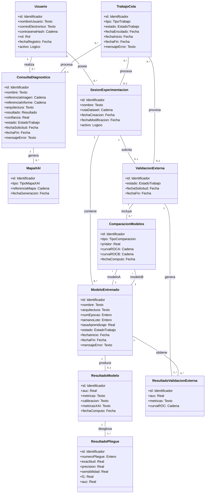
```mermaid
classDiagram
    class Usuario {
        +id: Identificador
        +nombreUsuario: Texto
        +correoElectronico: Texto
        +contrasenaHash: Cadena
        +rol: Rol
        +fechaRegistro: Fecha
        +activo: Logico
    }
    class ConsultaDiagnostico {
        +id: Identificador
        +nombre: Texto
        +referenciaImagen: Cadena
        +referenciaInforme: Cadena
        +arquitectura: Texto
        +resultado: Resultado
        +confianza: Real
        +estado: EstadoTrabajo
        +fechaSolicitud: Fecha
        +fechaFin: Fecha
        +mensajeError: Texto
    }
    class MapaXAI {
        +id: Identificador
        +tipo: TipoMapaXAI
        +referenciaMapa: Cadena
        +fechaGeneracion: Fecha
    }
    class SesionExperimentacion {
        +id: Identificador
        +nombre: Texto
        +rutaDataset: Cadena
        +fechaCreacion: Fecha
        +fechaModificacion: Fecha
        +activo: Logico
    }
    class ModeloEntrenado {
        +id: Identificador
        +nombre: Texto
        +arquitectura: Texto
        +numEpocas: Entero
        +tamanoLote: Entero
        +tasaAprendizaje: Real
        +estado: EstadoTrabajo
        +fechaInicio: Fecha
        +fechaFin: Fecha
        +mensajeError: Texto
    }
    class ResultadoModelo {
        +id: Identificador
        +auc: Real
        +metricas: Texto
        +calibracion: Texto
        +metricasXAI: Texto
        +fechaComputo: Fecha
    }
    class ResultadoPliegue {
        +id: Identificador
        +numeroPliegue: Entero
        +exactitud: Real
        +precision: Real
        +sensibilidad: Real
        +f1: Real
        +auc: Real
    }
    class ValidacionExterna {
        +id: Identificador
        +estado: EstadoTrabajo
        +fechaSolicitud: Fecha
        +fechaFin: Fecha
    }
    class ResultadoValidacionExterna {
        +id: Identificador
        +auc: Real
        +metricas: Texto
        +curvaROC: Cadena
    }
    class ComparacionModelos {
        +id: Identificador
        +tipo: TipoComparacion
        +pValor: Real
        +curvaROCA: Cadena
        +curvaROCB: Cadena
        +fechaComputo: Fecha
    }
    class TrabajoCola {
        +id: Identificador
        +tipo: TipoTrabajo
        +estado: EstadoTrabajo
        +fechaEncolado: Fecha
        +fechaInicio: Fecha
        +fechaFin: Fecha
        +mensajeError: Texto
    }
    Usuario "1" -- "0..*" ConsultaDiagnostico : realiza
    Usuario "1" -- "0..*" SesionExperimentacion : posee
    ConsultaDiagnostico "1" -- "0..*" MapaXAI : genera
    SesionExperimentacion "1" -- "0..*" ModeloEntrenado : contiene
    ModeloEntrenado "1" -- "0..1" ResultadoModelo : produce
    ResultadoModelo "1" -- "1..*" ResultadoPliegue : desglosa
    SesionExperimentacion "1" -- "0..1" ValidacionExterna : solicita
    ValidacionExterna "1" -- "1..*" ResultadoValidacionExterna : genera
    ModeloEntrenado "1" -- "0..*" ResultadoValidacionExterna : obtiene
    ValidacionExterna "1" -- "0..*" ComparacionModelos : incluye
    ComparacionModelos "*" -- "1" ModeloEntrenado : modeloA
    ComparacionModelos "*" -- "1" ModeloEntrenado : modeloB
    TrabajoCola "0..*" -- "0..1" ConsultaDiagnostico : procesa
    TrabajoCola "0..*" -- "0..1" SesionExperimentacion : procesa
    TrabajoCola "0..*" -- "0..1" ValidacionExterna : procesa
```

*Figura 8 - Diagrama de clases del sistema*

La clase Usuario representa la identidad de cada cuenta, incluido su nombre de usuario, correo electrónico, hash de contraseña, rol y, en el modelo conceptual, su estado y fechas relevantes. En la persistencia actual no todos esos atributos tienen una columna propia, como se detalla en el capítulo 19. Un usuario puede realizar múltiples consultas de diagnóstico, representadas por ConsultaDiagnostico, que reúne la referencia a la imagen, el informe PDF, la arquitectura seleccionada, el resultado, la confianza y el estado del trabajo. Cada consulta puede generar mapas de explicabilidad, representados por MapaXAI, cuyo atributo tipo distingue el método empleado.

Por otra parte, un usuario puede poseer múltiples sesiones de experimentación, representadas por SesionExperimentacion, que agrupa los modelos entrenados sobre un mismo dataset. ModeloEntrenado representa cada modelo de la sesión, con su arquitectura, sus hiperparámetros, su estado y sus fechas de ejecución. Cuando finaliza el entrenamiento, el modelo produce un ResultadoModelo con los valores agregados de rendimiento, calibración y explicabilidad. Los valores de validación cruzada de cada pliegue se representan mediante ResultadoPliegue, asociado al resultado del modelo y con las cinco métricas exigidas por RF-022. La validación cruzada y sus posibles sesgos de estimación se tratan como decisiones metodológicas del proyecto, no como una garantía de generalización (Varma & Simon, 2006).

ValidacionExterna representa una ejecución de evaluación sobre una cohorte independiente. Sus resultados se desglosan por modelo mediante ResultadoValidacionExterna, que reúne las métricas y la curva ROC de cada modelo. Las comparaciones entre dos modelos se representan mediante ComparacionModelos. Esta entidad recoge el tipo de contraste, las curvas comparadas y el p-valor correspondiente, incluido el del test de DeLong cuando se comparan curvas ROC (DeLong, DeLong, & Clarke-Pearson, 1988). De este modo, el p-valor se asocia a la comparación entre dos modelos dentro de una misma ejecución y no a la validación considerada de forma aislada.

Finalmente, TrabajoCola representa los trabajos asíncronos de diagnóstico, entrenamiento y validación externa, que se procesan sin bloquear la interfaz conforme al requisito RF-036.

El modelo de relaciones expresa el aislamiento de datos previsto en RF-005: todas las entidades de negocio parten conceptualmente de Usuario, de modo que cada consulta, sesión, modelo y resultado quedan asociados a un propietario en el modelo. Las relaciones entre SesionExperimentacion, ModeloEntrenado y ResultadoModelo reflejan el ciclo de vida de los experimentos. ResultadoPliegue depende de ResultadoModelo, mientras que ResultadoValidacionExterna depende de una ejecución de ValidacionExterna y se asocia al modelo evaluado. ComparacionModelos se vincula con los dos modelos que intervienen en el contraste y con la ejecución de validación externa cuando el contraste corresponde al test de DeLong. En la persistencia real, sin embargo, las sesiones y sus resultados se almacenan en carpetas sin una relación física con `users`; esta diferencia entre propiedad conceptual y garantía implementada queda documentada en el capítulo 19.

El diagrama de clases presentado en la figura 8 constituye el modelo estático de dominio de vitalXAI. Las secuencias de la sección 14.2 lo complementan desde la perspectiva del comportamiento, mostrando cómo el actor utiliza el sistema en los casos de uso del capítulo 12.

## 14.2 Comportamiento dinámico del sistema

El modelo estático no basta para describir el desarrollo de las interacciones. Por ello, la sección 14.2 utiliza secuencias asociadas a los casos de uso del capítulo 12. Estas secuencias complementan el modelo de entidades y muestran el intercambio observable entre el actor y el sistema, sin convertir los mecanismos internos en participantes externos (Larman, 2004).

En la mayoría de las secuencias intervienen dos participantes: el actor que inicia la acción y el sistema en su conjunto. Los mensajes del actor representan acciones sobre la interfaz, mientras que el sistema procesa la información y devuelve una respuesta. Cuando el flujo requiere una tarea asíncrona, el encolado, el procesamiento del trabajo y la actualización del resultado se representan como operaciones internas del sistema. El worker no aparece como participante porque forma parte de ese sistema y no es un actor externo. La secuencia de configuración del experimento incorpora además el modelo de lenguaje como participante externo de la integración conversacional.

Las secuencias se presentan organizadas por subsistemas, siguiendo la estructura definida en el capítulo 13, de forma que resulte sencillo localizar el comportamiento de la plataforma para cada funcionalidad. Para mantener la claridad de la presentación, cada diagrama recoge únicamente el flujo habitual de la acción, es decir, el camino que sigue la interacción cuando todo funciona de forma correcta. Los comportamientos alternativos, como los mensajes de error o la cancelación de una operación, se describen en la especificación detallada de cada caso de uso del capítulo 12 (sección 12.2.3), donde se documentan los flujos normal y alternativo de cada caso.

### 14.2.1 SS-001: Subsistema de Acceso y Gestión de Cuentas

Este subapartado recoge las secuencias de interacción correspondientes a los casos de uso del subsistema de acceso y gestión de cuentas, descrito en el capítulo 13. Todos ellos tienen como actor al visitante o al usuario autenticado según corresponda, e interactúan con el sistema para gestionar la identidad y el acceso a la plataforma: el registro de una nueva cuenta (CU-001), el inicio de sesión (CU-002), el cierre de sesión (CU-003) y el cambio del idioma de la interfaz (CU-004). Se presentan a continuación, precedidos cada uno de una breve descripción de la interacción que modelan.

#### 14.2.1.1 Secuencia CU-001: Registrarse

El registro es la puerta de entrada de la plataforma y la primera interacción que un visitante mantiene con ella. El visitante accede al formulario de registro desde la página de inicio de sesión, introduce su nombre de usuario, nombre, apellidos, correo electrónico y contraseña, y los envía al sistema. Este valida el formato de los datos recibidos y la fortaleza de la contraseña, comprueba que no exista ninguna cuenta previa con el mismo nombre de usuario o correo electrónico y, si todo es correcto, aplica un hash a la contraseña y crea el registro del nuevo usuario. Finalmente, el sistema confirma el alta y redirige al visitante a la página de inicio de sesión. La figura 9 muestra esta secuencia.

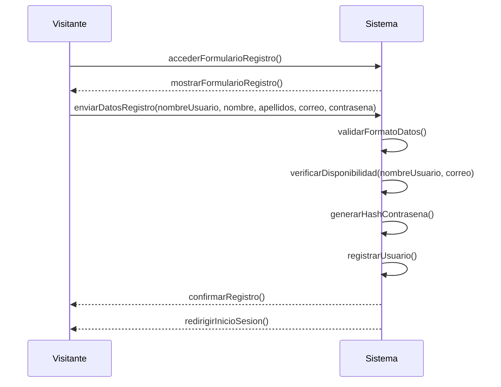
```mermaid
sequenceDiagram
    participant V as Visitante
    participant S as Sistema
    V->>S: accederFormularioRegistro()
    S-->>V: mostrarFormularioRegistro()
    V->>S: enviarDatosRegistro(nombreUsuario, nombre, apellidos, correo, contrasena)
    S->>S: validarFormatoDatos()
    S->>S: verificarDisponibilidad(nombreUsuario, correo)
    S->>S: generarHashContrasena()
    S->>S: registrarUsuario()
    S-->>V: confirmarRegistro()
    S-->>V: redirigirInicioSesion()
```

*Figura 9 - Secuencia de interacción del registro de una cuenta (CU-001)*

#### 14.2.1.2 Secuencia CU-002: Iniciar sesión

El inicio de sesión es el punto de acceso a toda la funcionalidad privada de la plataforma. El visitante accede al formulario de inicio de sesión, introduce su nombre de usuario y contraseña y las envía al sistema. Este verifica que la contraseña introducida coincida con el hash almacenado para ese nombre de usuario y, si la verificación es correcta, genera el token de acceso y el token de refresco, los establece en cookies seguras y redirige al usuario a su panel, concediéndole acceso a las áreas privadas. La figura 10 muestra esta secuencia.

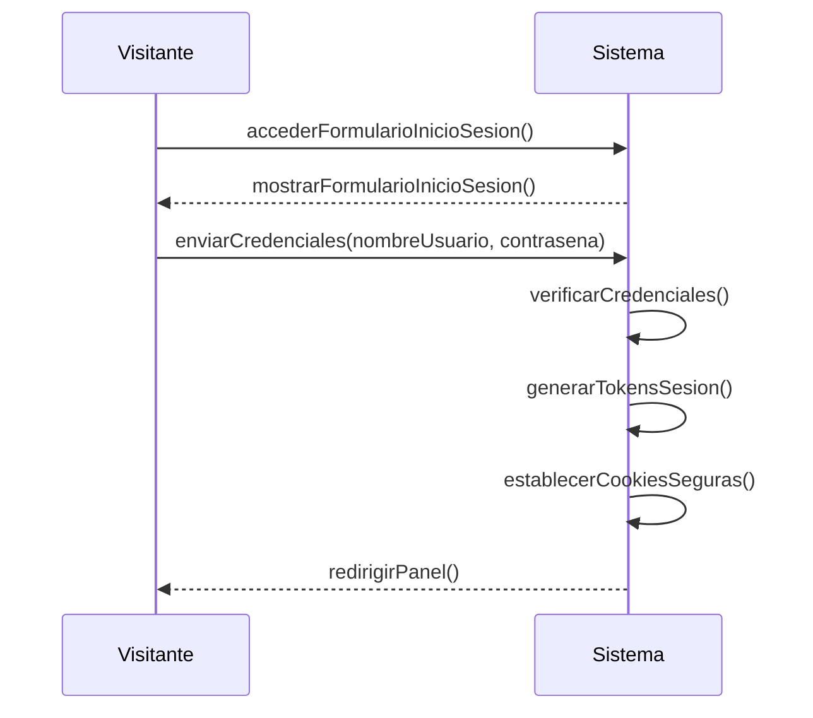
```mermaid
sequenceDiagram
    participant V as Visitante
    participant S as Sistema
    V->>S: accederFormularioInicioSesion()
    S-->>V: mostrarFormularioInicioSesion()
    V->>S: enviarCredenciales(nombreUsuario, contrasena)
    S->>S: verificarCredenciales()
    S->>S: generarTokensSesion()
    S->>S: establecerCookiesSeguras()
    S-->>V: redirigirPanel()
```

*Figura 10 - Secuencia de interacción del inicio de sesión (CU-002)*

#### 14.2.1.3 Secuencia CU-003: Cerrar sesión

El cierre de sesión completa el ciclo de acceso y es especialmente relevante en entornos de uso compartido. El usuario autenticado selecciona la opción de cerrar sesión y el sistema revoca el token de refresco asociado a su sesión, elimina las cookies de sesión del navegador y redirige al usuario a la página de inicio de sesión. A partir de ese momento, cualquier intento de acceder a las áreas privadas desde el mismo equipo es rechazado hasta que se vuelva a autenticar. La figura 11 muestra esta secuencia.

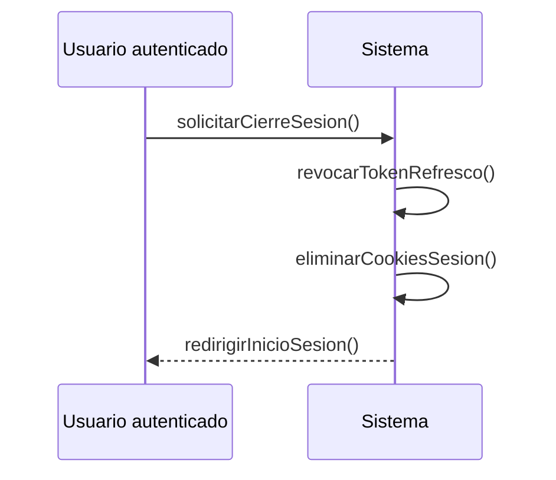
```mermaid
sequenceDiagram
    participant U as Usuario autenticado
    participant S as Sistema
    U->>S: solicitarCierreSesion()
    S->>S: revocarTokenRefresco()
    S->>S: eliminarCookiesSesion()
    S-->>U: redirigirInicioSesion()
```

*Figura 11 - Secuencia de interacción del cierre de sesión (CU-003)*

#### 14.2.1.4 Secuencia CU-004: Cambiar el idioma de la interfaz

El cambio de idioma es una interacción transversal disponible tanto para el visitante en el área pública como para el usuario autenticado en el área privada. El actor selecciona el idioma deseado en el selector de idioma de la interfaz y el sistema guarda la preferencia seleccionada, de modo que persista durante la sesión, y aplica las traducciones correspondientes en toda la interfaz sin necesidad de recargar la página, sin interrumpir el estado de navegación y, cuando procede, también en los informes generados y en el asistente conversacional. La figura 12 muestra esta secuencia.

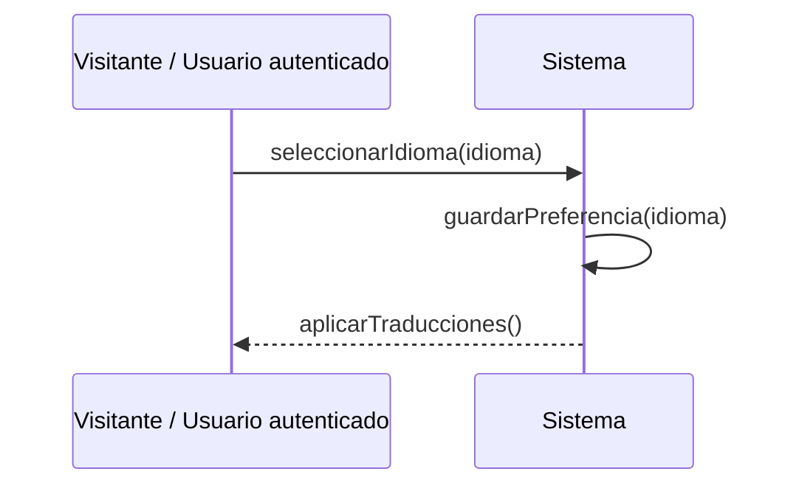
```mermaid
sequenceDiagram
    participant A as Visitante / Usuario autenticado
    participant S as Sistema
    A->>S: seleccionarIdioma(idioma)
    S->>S: guardarPreferencia(idioma)
    S-->>A: aplicarTraducciones()
```

*Figura 12 - Secuencia de interacción del cambio de idioma (CU-004)*

### 14.2.2 SS-002: Subsistema de Diagnóstico Asistido

Este subapartado recoge las secuencias de interacción correspondientes a los casos de uso del subsistema de diagnóstico asistido, descrito en el capítulo 13. Este subsistema agrupa el flujo clínico de la plataforma: el acceso al panel de diagnóstico (CU-005), la subida de una radiografía de tórax (CU-006), la selección de la arquitectura del modelo (CU-007), la solicitud del diagnóstico (CU-008), la visualización del resultado (CU-009) y la visualización de los mapas de explicabilidad (CU-010). Todos ellos tienen como actor al usuario autenticado, que opera sobre su propia consulta en curso. Las tres primeras secuencias preparan la consulta sobre la que se ejecutará el diagnóstico, mientras que las tres últimas completan el flujo clínico desde la solicitud hasta la presentación de los resultados. Se presentan a continuación, precedidos cada uno de una breve descripción de la interacción que modelan.

#### 14.2.2.1 Secuencia CU-005: Acceder al panel de diagnóstico

El panel de diagnóstico es el punto de partida de toda la actividad clínica del usuario y el acceso a él constituye el primer contacto del usuario autenticado con la funcionalidad clínica de la plataforma. El usuario accede al panel desde la navegación principal y el sistema valida que su sesión se encuentra activa. Si la sesión es válida, el sistema carga el panel de diagnóstico y lo muestra, quedando disponibles la carga de la radiografía, el selector de modelos y el acceso al historial. La figura 13 muestra esta secuencia.

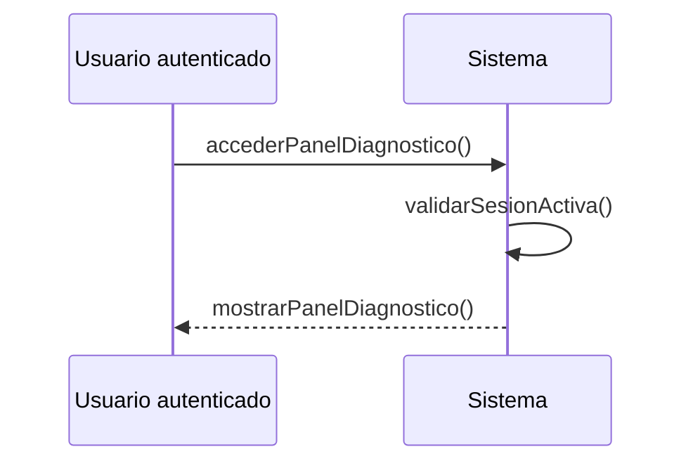
```mermaid
sequenceDiagram
    participant U as Usuario autenticado
    participant S as Sistema
    U->>S: accederPanelDiagnostico()
    S->>S: validarSesionActiva()
    S-->>U: mostrarPanelDiagnostico()
```

*Figura 13 - Secuencia de interacción del acceso al panel de diagnóstico (CU-005)*

#### 14.2.2.2 Secuencia CU-006: Subir una radiografía de tórax

El primer paso de cualquier diagnóstico es incorporar la imagen al sistema. El usuario selecciona el archivo de la radiografía desde su equipo y el sistema valida que el formato sea un tipo de imagen admitido (JPEG o PNG) y que el tamaño no supere el límite máximo fijado. Una vez validada, la imagen se almacena de forma temporal en el servidor y queda asociada a la consulta en curso, de modo que el usuario puede continuar con la selección del modelo. La figura 14 muestra esta secuencia.

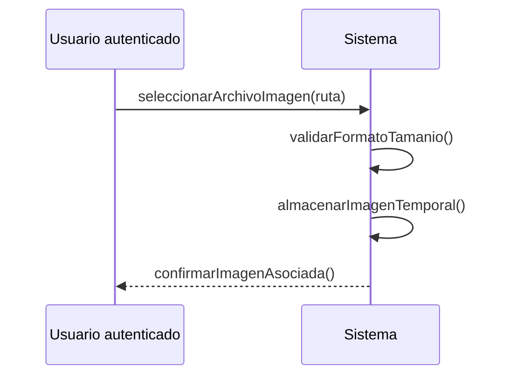
```mermaid
sequenceDiagram
    participant U as Usuario autenticado
    participant S as Sistema
    U->>S: seleccionarArchivoImagen(ruta)
    S->>S: validarFormatoTamanio()
    S->>S: almacenarImagenTemporal()
    S-->>U: confirmarImagenAsociada()
```

*Figura 14 - Secuencia de interacción de la subida de una radiografía (CU-006)*

#### 14.2.2.3 Secuencia CU-007: Seleccionar la arquitectura para el diagnóstico

El resultado del diagnóstico depende del modelo empleado, por lo que el usuario debe poder elegir la arquitectura con la que desea realizar la consulta. El usuario despliega el selector de modelos del panel y el sistema muestra la lista de arquitecturas de deep learning disponibles. El usuario selecciona la arquitectura deseada y esta queda asociada a la consulta en curso. La figura 15 muestra esta secuencia.

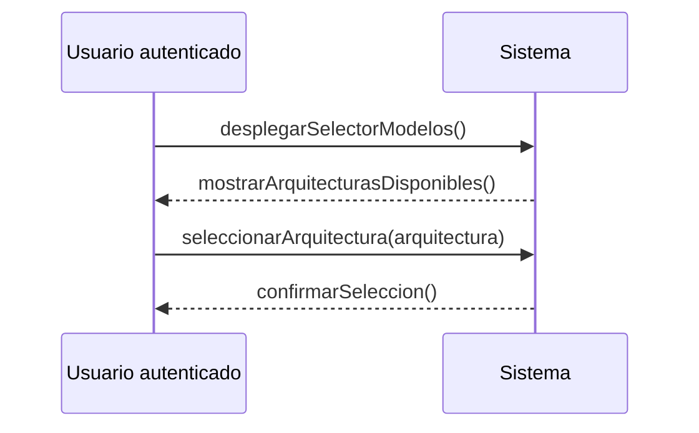
```mermaid
sequenceDiagram
    participant U as Usuario autenticado
    participant S as Sistema
    U->>S: desplegarSelectorModelos()
    S-->>U: mostrarArquitecturasDisponibles()
    U->>S: seleccionarArquitectura(arquitectura)
    S-->>U: confirmarSeleccion()
```

*Figura 15 - Secuencia de interacción de la selección de la arquitectura (CU-007)*

#### 14.2.2.4 Secuencia CU-008: Solicitar un diagnóstico

La solicitud del diagnóstico es el punto de entrada del flujo clínico. El usuario envía la petición con la imagen cargada y el modelo seleccionado, y el sistema valida que la petición sea correcta. Para evitar bloquear la interfaz durante el procesamiento, el sistema encola el trabajo de diagnóstico y lo procesa en segundo plano: el worker realiza la predicción, genera los mapas de explicabilidad, genera el informe de la consulta y guarda la consulta. Cuando el trabajo finaliza, el sistema notifica al usuario la disponibilidad del resultado. La presentación del resultado, de los mapas y del informe se describe en las secuencias CU-009, CU-010 y CU-037. La figura 16 muestra esta secuencia.

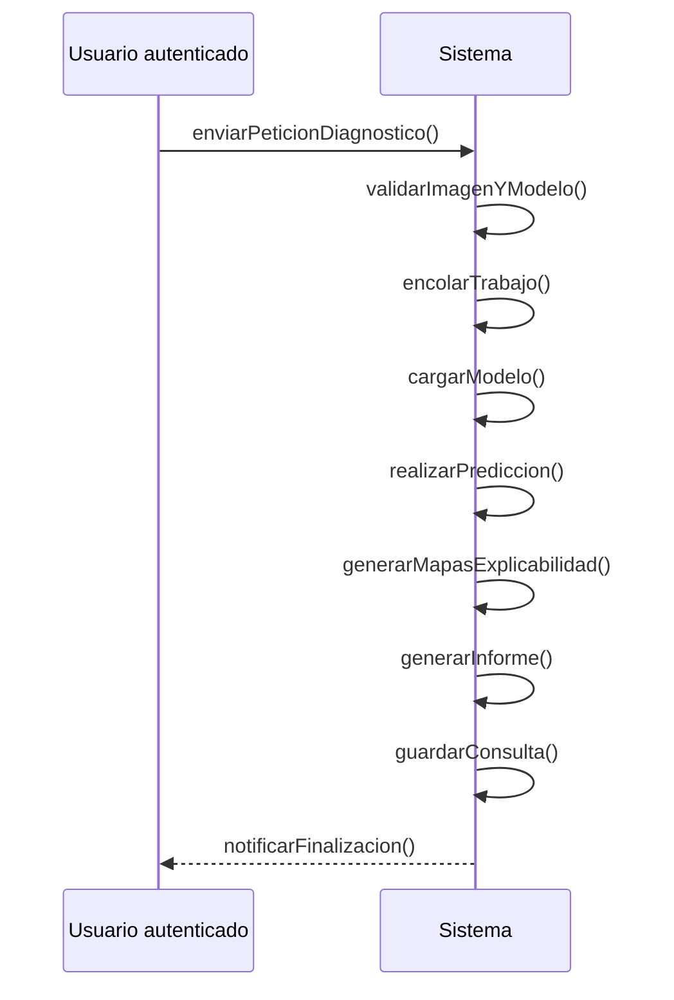
```mermaid
sequenceDiagram
    participant U as Usuario autenticado
    participant S as Sistema
    U->>S: enviarPeticionDiagnostico()
    S->>S: validarImagenYModelo()
    S->>S: encolarTrabajo()
    S->>S: cargarModelo()
    S->>S: realizarPrediccion()
    S->>S: generarMapasExplicabilidad()
    S->>S: generarInforme()
    S->>S: guardarConsulta()
    S-->>U: notificarFinalizacion()
```

*Figura 16 - Secuencia de interacción de la solicitud de un diagnóstico (CU-008)*

#### 14.2.2.5 Secuencia CU-009: Visualizar el resultado del diagnóstico

Cuando el trabajo de diagnóstico finaliza, el usuario consulta el estado de su consulta y el sistema comprueba que ha pasado a estado completado. Si es así, el sistema muestra el resultado de la consulta: la predicción (PNEUMONIA o NORMAL), el nivel de confianza asociado y el modelo empleado, presentados de forma clara y sin tecnicismos. El resultado queda registrado en el historial, de modo que pueda recuperarse en cualquier momento. La figura 17 muestra esta secuencia.

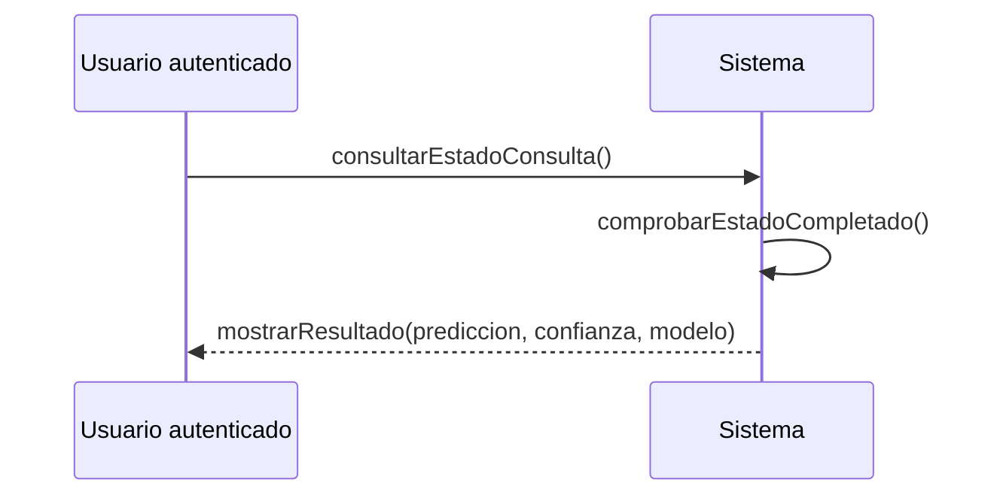
```mermaid
sequenceDiagram
    participant U as Usuario autenticado
    participant S as Sistema
    U->>S: consultarEstadoConsulta()
    S->>S: comprobarEstadoCompletado()
    S-->>U: mostrarResultado(prediccion, confianza, modelo)
```

*Figura 17 - Secuencia de interacción de la visualización del resultado (CU-009)*

#### 14.2.2.6 Secuencia CU-010: Visualizar los mapas de explicabilidad

Cuando la consulta está completada, el usuario la selecciona para inspeccionar sus explicaciones y el sistema comprueba que la consulta pertenece al usuario. El sistema muestra entonces el mosaico con la radiografía original y los mapas de explicabilidad generados: Saliency Maps, SmoothGrad y Grad-CAM para las arquitecturas convolucionales, o mapas de atención para las arquitecturas Transformer (Simonyan, Vedaldi, & Zisserman, 2014; Smilkov & al., 2017; Selvaraju & al., 2017; Chefer, Gur, & Wolf, 2021). Estas visualizaciones sirven para inspeccionar las regiones resaltadas, pero no prueban por sí solas la validez clínica de la predicción. La figura 18 muestra esta secuencia.

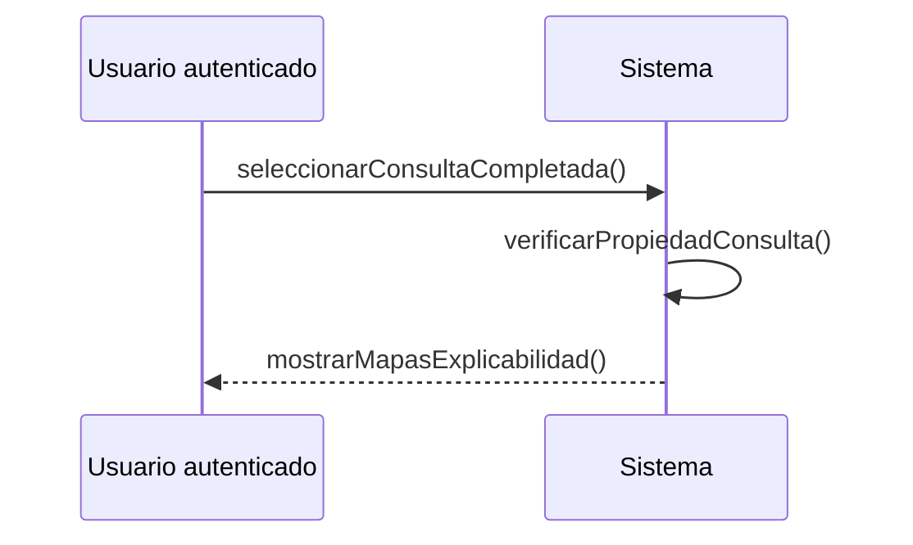
```mermaid
sequenceDiagram
    participant U as Usuario autenticado
    participant S as Sistema
    U->>S: seleccionarConsultaCompletada()
    S->>S: verificarPropiedadConsulta()
    S-->>U: mostrarMapasExplicabilidad()
```

*Figura 18 - Secuencia de interacción de la visualización de los mapas de explicabilidad (CU-010)*

#### 14.2.2.7 Secuencia CU-037: Generar el informe PDF del diagnóstico

Cada consulta de diagnóstico puede descargarse como un informe en PDF que el profesional puede archivar o incorporar a su flujo de trabajo habitual. El usuario solicita el informe de una consulta desde su detalle y el sistema comprueba que la consulta le pertenece. A continuación, el sistema genera el documento PDF con la imagen, la predicción, la confianza, el modelo empleado y los mapas de explicabilidad, y lo descarga al equipo del usuario. La figura 19 muestra esta secuencia.

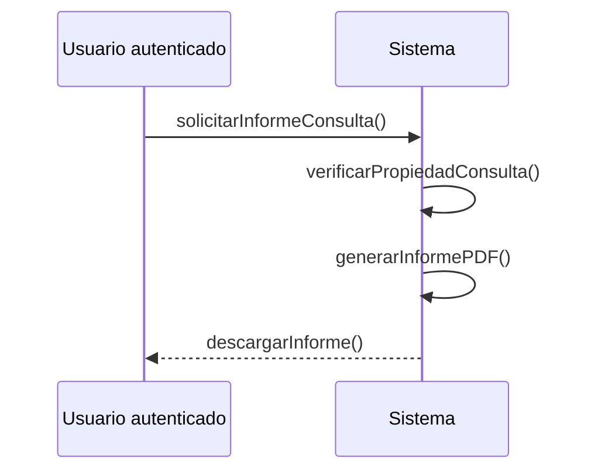
```mermaid
sequenceDiagram
    participant U as Usuario autenticado
    participant S as Sistema
    U->>S: solicitarInformeConsulta()
    S->>S: verificarPropiedadConsulta()
    S->>S: generarInformePDF()
    S-->>U: descargarInforme()
```

*Figura 19 - Secuencia de interacción de la generación del informe PDF del diagnóstico (CU-037)*

### 14.2.3 SS-003: Subsistema de Gestión del Historial

Este subapartado recoge las secuencias de interacción correspondientes a los casos de uso del subsistema de gestión del historial, descrito en el capítulo 13. Este subsistema agrupa la recuperación y la gestión de las consultas de diagnóstico ya realizadas: la consulta del listado del historial (CU-011), la visualización del detalle de una consulta (CU-012), el renombrado de una consulta (CU-013) y su eliminación (CU-014). Todos ellos tienen como actor al usuario autenticado y operan exclusivamente sobre las consultas del propio usuario, en cumplimiento del aislamiento de datos entre usuarios: antes de mostrar o modificar cualquier información, el sistema verifica que la consulta pertenece al usuario que la solicita. La secuencia de CU-011 constituye el punto de entrada del subsistema, desde el que se alcanzan opcionalmente el detalle (CU-012) y, desde este, el renombrado (CU-013) y la eliminación (CU-014). Se presentan a continuación, precedidos cada uno de una breve descripción de la interacción que modelan.

#### 14.2.3.1 Secuencia CU-011: Consultar el historial de consultas

El profesional recupera sus consultas anteriores para revisar un diagnóstico, comparar la evolución de un caso o reutilizar una imagen. El usuario accede a su historial desde el panel de diagnóstico y el sistema recupera únicamente las consultas del propio usuario, mostrando el listado con los datos esenciales de cada una: fecha, modelo empleado, resultado y confianza. La figura 20 muestra esta secuencia.

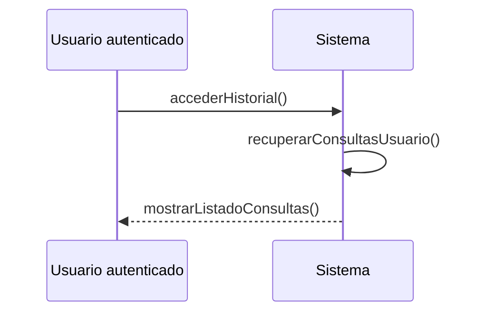
```mermaid
sequenceDiagram
    participant U as Usuario autenticado
    participant S as Sistema
    U->>S: accederHistorial()
    S->>S: recuperarConsultasUsuario()
    S-->>U: mostrarListadoConsultas()
```

*Figura 20 - Secuencia de interacción de la consulta del historial (CU-011)*

#### 14.2.3.2 Secuencia CU-012: Ver el detalle de una consulta del historial

El usuario abre el detalle completo de una consulta concreta para recuperar la imagen original, el resultado, la confianza y los mapas de explicabilidad asociados. El usuario selecciona una consulta del listado del historial y el sistema comprueba que la consulta pertenece al usuario. Si la verificación es correcta, el sistema muestra el detalle completo de la consulta, incluyendo los metadatos asociados. La figura 21 muestra esta secuencia.

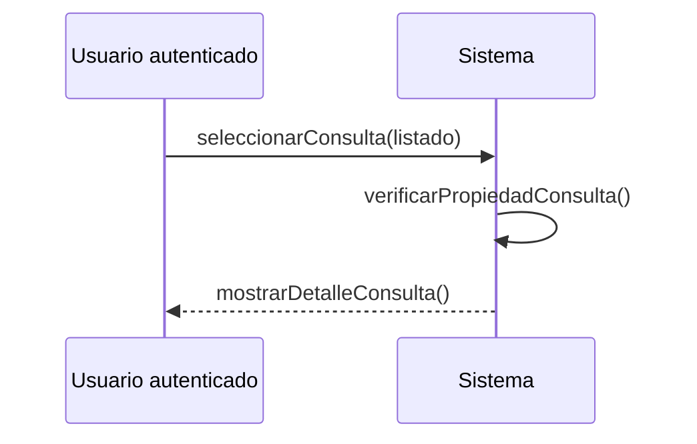
```mermaid
sequenceDiagram
    participant U as Usuario autenticado
    participant S as Sistema
    U->>S: seleccionarConsulta(listado)
    S->>S: verificarPropiedadConsulta()
    S-->>U: mostrarDetalleConsulta()
```

*Figura 21 - Secuencia de interacción de la visualización del detalle (CU-012)*

#### 14.2.3.3 Secuencia CU-013: Renombrar una consulta del historial

El usuario modifica el nombre de una de sus consultas para identificarla mejor, por ejemplo cuando un mismo paciente tiene varias placas. El usuario indica el nuevo nombre desde el detalle de la consulta, el sistema comprueba que la consulta pertenece al usuario y valida que el nuevo nombre no esté vacío. Si la validación es correcta, el sistema actualiza el nombre de la consulta, sin alterar la imagen, el resultado ni los mapas de explicabilidad. La figura 22 muestra esta secuencia.

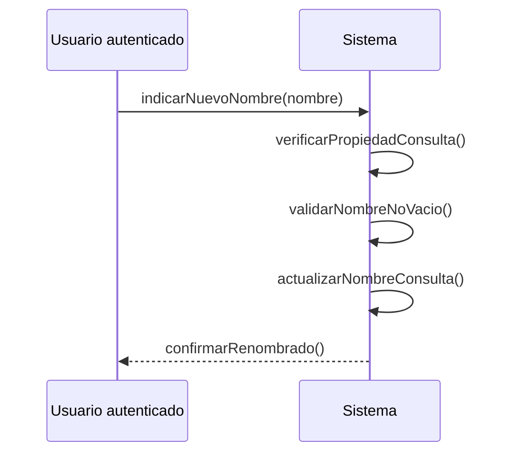
```mermaid
sequenceDiagram
    participant U as Usuario autenticado
    participant S as Sistema
    U->>S: indicarNuevoNombre(nombre)
    S->>S: verificarPropiedadConsulta()
    S->>S: validarNombreNoVacio()
    S->>S: actualizarNombreConsulta()
    S-->>U: confirmarRenombrado()
```

*Figura 22 - Secuencia de interacción del renombrado de una consulta (CU-013)*

#### 14.2.3.4 Secuencia CU-014: Eliminar una consulta del historial

El usuario depura su historial eliminando las consultas que ya no necesita. Al tratarse de una operación que retira información clínica, el sistema comprueba primero que la consulta pertenece al usuario y solicita confirmación antes de ejecutarla. El usuario confirma la eliminación y el sistema retira el registro de la consulta, que deja de aparecer en su listado activo. La figura 23 muestra esta secuencia.

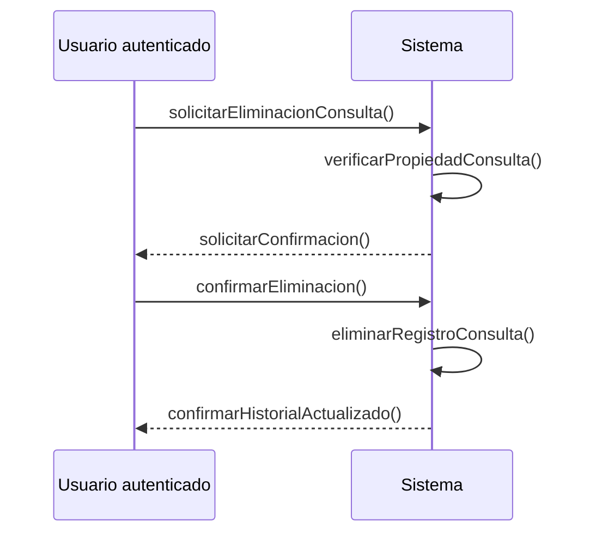
```mermaid
sequenceDiagram
    participant U as Usuario autenticado
    participant S as Sistema
    U->>S: solicitarEliminacionConsulta()
    S->>S: verificarPropiedadConsulta()
    S-->>U: solicitarConfirmacion()
    U->>S: confirmarEliminacion()
    S->>S: eliminarRegistroConsulta()
    S-->>U: confirmarHistorialActualizado()
```

*Figura 23 - Secuencia de interacción de la eliminación de una consulta (CU-014)*

### 14.2.4 SS-004: Subsistema de Laboratorio MLOps

Este subapartado recoge las secuencias de interacción correspondientes a los casos de uso del subsistema de laboratorio MLOps, descrito en el capítulo 13. Este subsistema agrupa la actividad investigadora de la plataforma: el acceso al laboratorio (CU-015), la conversación con el asistente para configurar un experimento (CU-016), la selección de la carpeta del dataset (CU-017), el lanzamiento del experimento (CU-018), la consulta de las sesiones (CU-019), la consulta de los resultados de un modelo (CU-020), la visualización de sus mapas de explicabilidad (CU-021), la consulta del ranking (CU-022), la comparativa estadística (CU-023) y su recálculo (CU-024), el análisis de explicabilidad (CU-025), la validación externa (CU-026) y su consulta (CU-027), la generación del informe PDF (CU-028), el renombrado y la eliminación de sesiones (CU-029 y CU-030) y la comprobación de la limitación de entrenamientos simultáneos y encolados (CU-039). Todos ellos tienen como actor al usuario autenticado, que opera exclusivamente sobre sus propias sesiones en cumplimiento del aislamiento de datos entre usuarios. Las secuencias se presentan siguiendo el orden natural de la actividad del laboratorio, desde la configuración del experimento hasta la consulta y gestión de los resultados. Se presentan a continuación, precedidos cada uno de una breve descripción de la interacción que modelan.

#### 14.2.4.1 Secuencia CU-015: Acceder al laboratorio de entrenamiento

El laboratorio de entrenamiento es el espacio en el que se desarrolla la actividad investigadora de la plataforma. El usuario accede al laboratorio desde la navegación principal y el sistema valida que su sesión se encuentra activa. Si la sesión es válida, el sistema carga el entorno del laboratorio y lo muestra, quedando disponibles el asistente conversacional, el listado de sesiones y el resto de las funcionalidades del módulo. La figura 24 muestra esta secuencia.

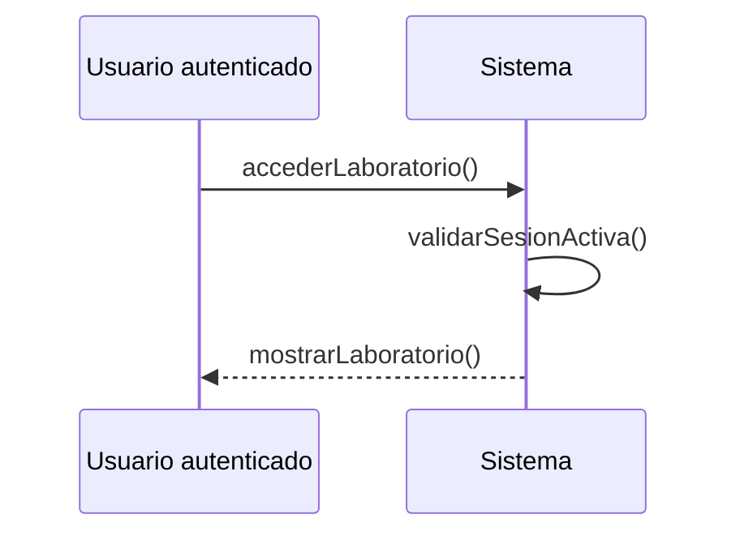
```mermaid
sequenceDiagram
    participant U as Usuario autenticado
    participant S as Sistema
    U->>S: accederLaboratorio()
    S->>S: validarSesionActiva()
    S-->>U: mostrarLaboratorio()
```

*Figura 24 - Secuencia de interacción del acceso al laboratorio (CU-015)*

#### 14.2.4.2 Secuencia CU-016: Conversar con el asistente para configurar un experimento

El asistente conversacional es la interfaz principal de configuración del experimento y su interacción es un diálogo bidireccional: el usuario no entrega la configuración completa de una sola vez, sino que mantiene un intercambio con el asistente hasta que todos los parámetros quedan definidos. El usuario envía un mensaje en lenguaje natural indicando los parámetros que desea y el sistema prepara el prompt de sistema definido y envía la petición al modelo de lenguaje. El modelo extrae los parámetros mencionados en el mensaje y, si falta alguno de los parámetros que definen el experimento, como las arquitecturas, el número de épocas, el tamaño de lote o la tasa de aprendizaje, el asistente pregunta por el parámetro faltante y la conversación continúa hasta completarlo. La ruta del dataset no forma parte de la conversación: se selecciona de forma validada mediante el caso de uso CU-017 y se incorpora a la configuración. Cuando el asistente dispone de todos los parámetros, devuelve la configuración estructurada, el sistema rellena el panel de configuración con los valores obtenidos y el usuario la revisa y confirma. La figura 25 muestra esta secuencia.

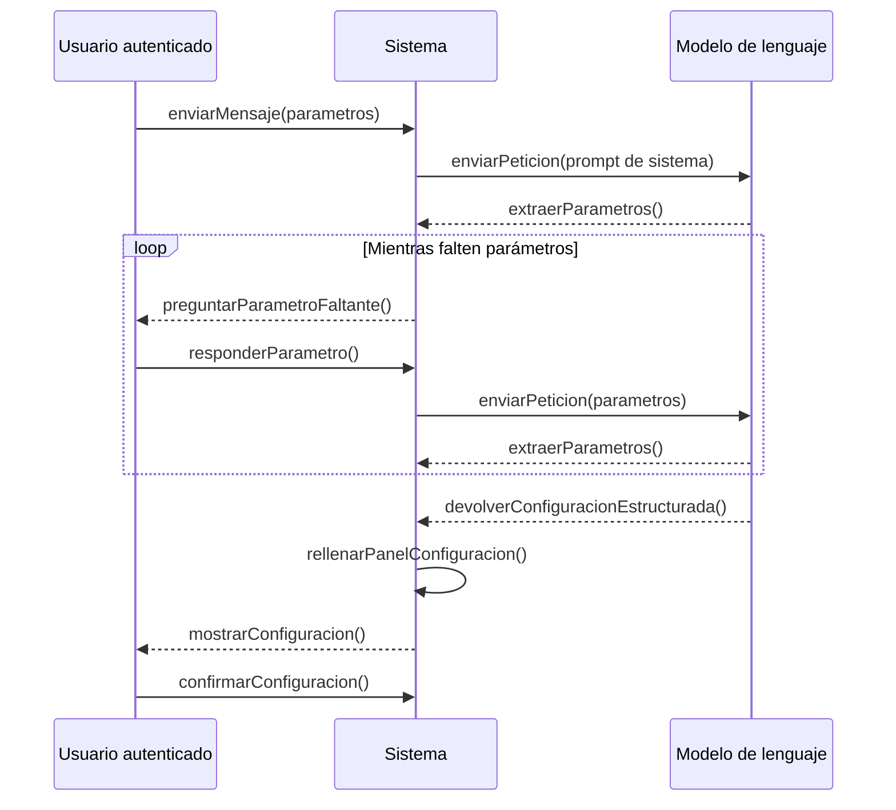
```mermaid
sequenceDiagram
    participant U as Usuario autenticado
    participant S as Sistema
    participant M as Modelo de lenguaje
    U->>S: enviarMensaje(parametros)
    S->>M: enviarPeticion(prompt de sistema)
    M-->>S: extraerParametros()
    loop Mientras falten parámetros
        S-->>U: preguntarParametroFaltante()
        U->>S: responderParametro()
        S->>M: enviarPeticion(parametros)
        M-->>S: extraerParametros()
    end
    M-->>S: devolverConfiguracionEstructurada()
    S->>S: rellenarPanelConfiguracion()
    S-->>U: mostrarConfiguracion()
    U->>S: confirmarConfiguracion()
```

*Figura 25 - Secuencia de interacción de la conversación con el asistente (CU-016)*

#### 14.2.4.3 Secuencia CU-017: Seleccionar la carpeta del dataset

Antes de lanzar el experimento, el usuario debe indicar la carpeta del conjunto de datos sobre el que se entrenará el modelo. El usuario solicita explorar la carpeta y el sistema devuelve la ruta, preconfigurada en el entorno o seleccionada por el propio usuario. El usuario confirma la ruta y esta queda asociada a la configuración del experimento. La restricción que debe impedir el acceso a rutas fuera del directorio permitido permanece pendiente de implementación, como se indica en el capítulo 12. La figura 26 muestra esta secuencia.

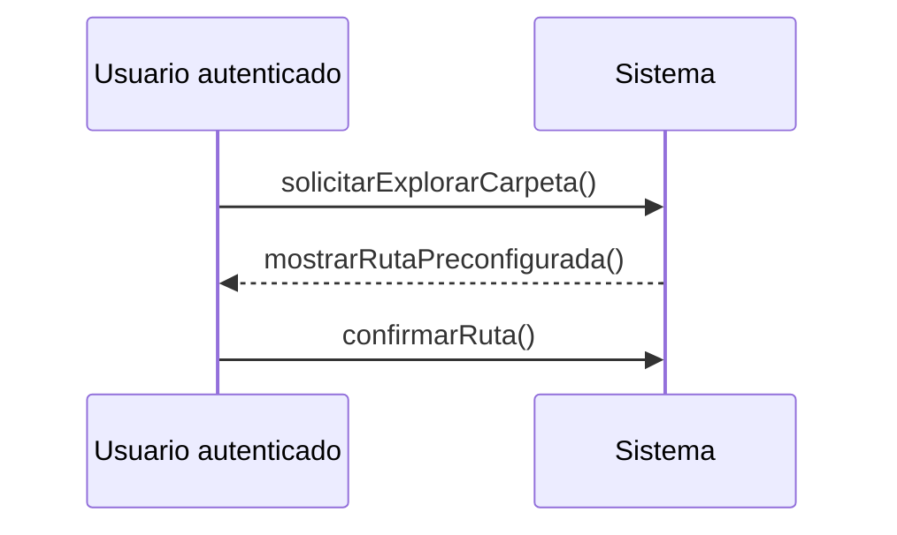
```mermaid
sequenceDiagram
    participant U as Usuario autenticado
    participant S as Sistema
    U->>S: solicitarExplorarCarpeta()
    S-->>U: mostrarRutaPreconfigurada()
    U->>S: confirmarRuta()
```

*Figura 26 - Secuencia de interacción de la selección de la carpeta del dataset (CU-017)*

#### 14.2.4.4 Secuencia CU-018: Lanzar un experimento de entrenamiento

El lanzamiento del experimento inicia el proceso de entrenamiento. El usuario envía la configuración del experimento, ya completada mediante la conversación con el asistente, y el sistema crea la sesión de entrenamiento y encola el trabajo de ejecución. El worker procesa el trabajo en segundo plano: ejecuta el entrenamiento con validación cruzada, el análisis de explicabilidad y la comparación estadística. Al finalizar, el sistema actualiza el estado de la sesión y notifica al usuario. La figura 27 muestra esta secuencia.

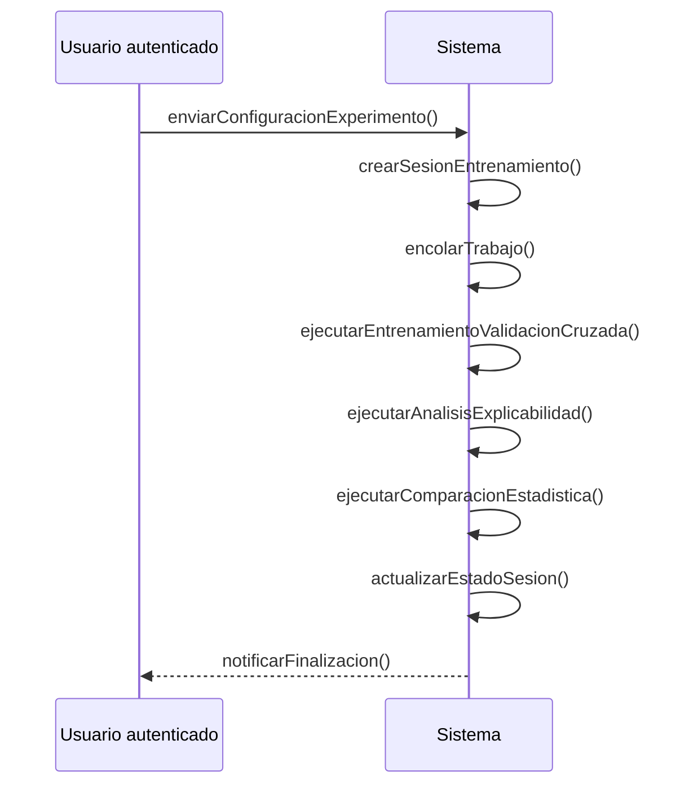
```mermaid
sequenceDiagram
    participant U as Usuario autenticado
    participant S as Sistema
    U->>S: enviarConfiguracionExperimento()
    S->>S: crearSesionEntrenamiento()
    S->>S: encolarTrabajo()
    S->>S: ejecutarEntrenamientoValidacionCruzada()
    S->>S: ejecutarAnalisisExplicabilidad()
    S->>S: ejecutarComparacionEstadistica()
    S->>S: actualizarEstadoSesion()
    S-->>U: notificarFinalizacion()
```

*Figura 27 - Secuencia de interacción del lanzamiento de un experimento (CU-018)*

#### 14.2.4.5 Secuencia CU-019: Consultar las sesiones de entrenamiento

El investigador necesita recuperar sus sesiones de entrenamiento para revisar su estado y sus resultados. El usuario accede al listado de sesiones del laboratorio y el sistema recupera únicamente las sesiones del propio usuario, mostrando para cada una su estado y los modelos generados. La figura 28 muestra esta secuencia.

```mermaid
sequenceDiagram
    participant U as Usuario autenticado
    participant S as Sistema
    U->>S: accederListadoSesiones()
    S->>S: recuperarSesionesUsuario()
    S-->>U: mostrarSesiones()
```

*Figura 28 - Secuencia de interacción de la consulta de las sesiones (CU-019)*

#### 14.2.4.6 Secuencia CU-020: Consultar los resultados de un modelo de la sesión

El usuario selecciona un modelo de la sesión para inspeccionar sus resultados. El sistema recupera y muestra las métricas del modelo, con su media y desviación sobre los pliegues de la validación cruzada, junto con los artefactos asociados. Esta información permite al investigador evaluar el rendimiento del modelo antes de decidir sobre su uso. La figura 29 muestra esta secuencia.

```mermaid
sequenceDiagram
    participant U as Usuario autenticado
    participant S as Sistema
    U->>S: seleccionarModelo(sesion)
    S->>S: recuperarMetricasModelo()
    S-->>U: mostrarMetricas(media, desviacion)
```

*Figura 29 - Secuencia de interacción de la consulta de los resultados de un modelo (CU-020)*

#### 14.2.4.7 Secuencia CU-021: Visualizar los mapas de calor de explicabilidad de un modelo

La explicabilidad de los modelos es uno de los pilares de la plataforma. El usuario selecciona un modelo de la sesión y el sistema recupera las imágenes XAI generadas durante el análisis de explicabilidad, mostrándolas en una galería. De este modo, el investigador puede inspeccionar visualmente qué regiones de las imágenes pondera cada modelo antes de tomar decisiones. La figura 30 muestra esta secuencia.

```mermaid
sequenceDiagram
    participant U as Usuario autenticado
    participant S as Sistema
    U->>S: seleccionarModelo(sesion)
    S->>S: recuperarImagenesXAI()
    S-->>U: mostrarGaleriaXAI()
```

*Figura 30 - Secuencia de interacción de la visualización de los mapas de explicabilidad (CU-021)*

#### 14.2.4.8 Secuencia CU-022: Consultar el ranking de modelos de la sesión

Para comparar rápidamente los modelos generados, el usuario puede consultar el ranking de la sesión. El usuario solicita el ranking y el sistema recupera y muestra los modelos ordenados por su AUC medio, una medida habitual del rendimiento discriminativo basada en la curva ROC (Fawcett, 2006). La figura 31 muestra esta secuencia.

```mermaid
sequenceDiagram
    participant U as Usuario autenticado
    participant S as Sistema
    U->>S: solicitarRanking(sesion)
    S->>S: ordenarModelosPorAUC()
    S-->>U: mostrarRanking()
```

*Figura 31 - Secuencia de interacción de la consulta del ranking (CU-022)*

#### 14.2.4.9 Secuencia CU-023: Consultar la comparativa estadística de la sesión

La comparativa estadística complementa el ranking con el resultado de los contrastes entre modelos. El usuario accede a la vista de comparativa de la sesión y el sistema muestra la matriz de significación correspondiente, calculada mediante el test de Wilcoxon sobre los valores disponibles (Wilcoxon, 1945). La matriz informa sobre la compatibilidad de las diferencias observadas con la variabilidad de los datos, pero no establece por sí sola superioridad clínica. La figura 32 muestra esta secuencia.

```mermaid
sequenceDiagram
    participant U as Usuario autenticado
    participant S as Sistema
    U->>S: accederComparativa(sesion)
    S->>S: recuperarMatrizSignificacion()
    S-->>U: mostrarMatrizSignificacion()
```

*Figura 32 - Secuencia de interacción de la consulta de la comparativa estadística (CU-023)*

#### 14.2.4.10 Secuencia CU-024: Solicitar el recálculo de la comparativa estadística

Si el investigador modifica las condiciones del análisis, puede solicitar que la comparativa estadística se recalcule. El usuario solicita el recálculo y el sistema lanza el proceso en segundo plano, de modo que la interfaz permanece operativa. Cuando el recálculo finaliza, el sistema actualiza la comparativa y notifica al usuario la disponibilidad de los nuevos resultados. La figura 33 muestra esta secuencia.

```mermaid
sequenceDiagram
    participant U as Usuario autenticado
    participant S as Sistema
    U->>S: solicitarRecalculo(sesion)
    S->>S: lanzarProcesoRecalculo()
    S->>S: actualizarComparativa()
    S-->>U: notificarRecalculoFinalizado()
```

*Figura 33 - Secuencia de interacción del recálculo de la comparativa (CU-024)*

#### 14.2.4.11 Secuencia CU-025: Ejecutar el análisis de explicabilidad de un modelo

El análisis de explicabilidad puede ejecutarse de forma independiente sobre un modelo concreto de la sesión. El usuario solicita generar el análisis XAI del modelo y el sistema ejecuta los scripts de explicabilidad en segundo plano. Cuando el análisis finaliza, el sistema notifica al usuario, que puede consultar las imágenes XAI generadas. Las técnicas utilizadas se describen en la bibliografía específica de Saliency Maps, SmoothGrad, Grad-CAM y mapas de atención (Simonyan, Vedaldi, & Zisserman, 2014; Smilkov & al., 2017; Selvaraju & al., 2017; Chefer, Gur, & Wolf, 2021). La figura 34 muestra esta secuencia.

```mermaid
sequenceDiagram
    participant U as Usuario autenticado
    participant S as Sistema
    U->>S: solicitarAnalisisXAI(modelo)
    S->>S: ejecutarScriptsExplicabilidad()
    S-->>U: notificarAnalisisFinalizado()
```

*Figura 34 - Secuencia de interacción de la ejecución del análisis de explicabilidad (CU-025)*

#### 14.2.4.12 Secuencia CU-026: Solicitar la validación externa de la sesión

La validación externa aporta información adicional sobre el rendimiento de los modelos en datos independientes. El usuario solicita la validación externa de la sesión y el sistema encola el trabajo de validación. El worker evalúa los modelos congelados sobre el conjunto externo y aplica el test de DeLong para comparar sus curvas ROC (DeLong, DeLong, & Clarke-Pearson, 1988). Cuando la validación finaliza, el sistema notifica al usuario. La figura 35 muestra esta secuencia.

```mermaid
sequenceDiagram
    participant U as Usuario autenticado
    participant S as Sistema
    U->>S: solicitarValidacionExterna(sesion)
    S->>S: encolarTrabajoValidacion()
    S->>S: evaluarModelosCongelados()
    S->>S: aplicarTestDeLong()
    S-->>U: notificarValidacionFinalizada()
```

*Figura 35 - Secuencia de interacción de la solicitud de la validación externa (CU-026)*

#### 14.2.4.13 Secuencia CU-027: Consultar los resultados de la validación externa

Una vez finalizada la validación externa, el usuario consulta sus resultados. El usuario accede a los resultados externos de la sesión y el sistema muestra las métricas de los modelos sobre el conjunto externo, las curvas ROC y la matriz de DeLong resultante del test estadístico. La figura 36 muestra esta secuencia.

```mermaid
sequenceDiagram
    participant U as Usuario autenticado
    participant S as Sistema
    U->>S: accederResultadosExternos(sesion)
    S->>S: recuperarResultadosValidacion()
    S-->>U: mostrarMetricasROCyDeLong()
```

*Figura 36 - Secuencia de interacción de la consulta de la validación externa (CU-027)*

#### 14.2.4.14 Secuencia CU-028: Generar el informe PDF de la sesión

El informe PDF consolida los resultados de la sesión para su difusión o conservación. El usuario solicita el informe de la sesión y el sistema genera el documento PDF con los resultados consolidados, incluyendo las métricas, los mapas de explicabilidad y la comparativa. Finalmente, el sistema inicia la descarga del documento al equipo del usuario. La figura 37 muestra esta secuencia.

```mermaid
sequenceDiagram
    participant U as Usuario autenticado
    participant S as Sistema
    U->>S: solicitarInforme(sesion)
    S->>S: generarDocumentoPDF()
    S-->>U: descargarInforme()
```

*Figura 37 - Secuencia de interacción de la generación del informe PDF (CU-028)*

#### 14.2.4.15 Secuencia CU-029: Renombrar una sesión de entrenamiento

El investigador puede dar a sus sesiones un nombre más descriptivo para identificarlas mejor. El usuario indica el nuevo nombre de la sesión y el sistema comprueba que la sesión pertenece al usuario y valida que el nuevo nombre no esté vacío. Si la validación es correcta, el sistema actualiza el nombre de la sesión, sin alterar los modelos ni los artefactos asociados. La figura 38 muestra esta secuencia.

```mermaid
sequenceDiagram
    participant U as Usuario autenticado
    participant S as Sistema
    U->>S: indicarNuevoNombre(nombre)
    S->>S: verificarPropiedadSesion()
    S->>S: validarNombreNoVacio()
    S->>S: actualizarNombreSesion()
    S-->>U: confirmarRenombrado()
```

*Figura 38 - Secuencia de interacción del renombrado de una sesión (CU-029)*

#### 14.2.4.16 Secuencia CU-030: Eliminar una sesión de entrenamiento

El investigador puede eliminar las sesiones que ya no necesita. Al tratarse de una operación que retira artefactos de entrenamiento, el sistema comprueba primero que la sesión pertenece al usuario y solicita confirmación antes de ejecutarla. El usuario confirma la eliminación y el sistema retira la sesión junto con sus artefactos asociados. La figura 39 muestra esta secuencia.

```mermaid
sequenceDiagram
    participant U as Usuario autenticado
    participant S as Sistema
    U->>S: solicitarEliminacionSesion()
    S->>S: verificarPropiedadSesion()
    S-->>U: solicitarConfirmacion()
    U->>S: confirmarEliminacion()
    S->>S: eliminarSesionYArtefactos()
    S-->>U: confirmarLaboratorioActualizado()
```

*Figura 39 - Secuencia de interacción de la eliminación de una sesión (CU-030)*

#### 14.2.4.17 Secuencia CU-039: Comprobar la limitación de entrenamientos

La limitación de entrenamientos es una capacidad prevista para evitar que la competición por la GPU degrade el servicio para el resto de los usuarios. Cuando el usuario lance un experimento y se supere el límite de entrenamientos simultáneos o encolados, el trabajo debería permanecer en espera o ser rechazado según la política definida. Esta capacidad permanece pendiente de implementación en el prototipo actual. La figura 40 muestra el escenario previsto.

```mermaid
sequenceDiagram
    participant U as Usuario autenticado
    participant S as Sistema
    U->>S: lanzarExperimento()
    S->>S: comprobarLimiteEntrenamientos()
    alt Limite superado
        S->>S: gestionarTrabajoExcedente()
    else Dentro del limite
        S->>S: ejecutarEntrenamiento()
    end
    U->>S: consultarEstadoTrabajo()
    S-->>U: mostrarEstadoEnCola()
```

*Figura 40 - Secuencia de interacción de la limitación de entrenamientos (CU-039)*

### 14.2.5 SS-005: Subsistema de Supervisión y Administración

Este subapartado recoge las secuencias de interacción correspondientes a los casos de uso del subsistema de supervisión y administración, descrito en el capítulo 13. Este subsistema agrupa las operaciones de supervisión de la plataforma: la consulta del listado de usuarios (CU-031), la consulta de las consultas de diagnóstico de un usuario concreto (CU-032), la visualización del detalle de una de esas consultas (CU-033) y la gestión prevista de cuentas (CU-038). Todos ellos tienen como actor al administrador y están restringidos a su rol: en cada operación el sistema verifica el rol del actor antes de mostrar información o aplicar una operación. Las secuencias de supervisión siguen la navegación desde la visión global del listado hasta el detalle de una consulta concreta; la gestión de cuentas se describe como una operación independiente. Se presentan a continuación, precedidos cada uno de una breve descripción de la interacción que modelan.

#### 14.2.5.1 Secuencia CU-031: Consultar el listado de usuarios

El listado de usuarios constituye la base de la supervisión de la plataforma. El administrador accede al panel de administración y el sistema verifica que el actor dispone del rol de administración. Si la verificación es correcta, el sistema recupera y muestra el listado de usuarios registrados, permitiendo al administrador identificar cuentas y comprobar el estado del sistema. La figura 41 muestra esta secuencia.

```mermaid
sequenceDiagram
    participant A as Administrador
    participant S as Sistema
    A->>S: accederPanelAdministracion()
    S->>S: verificarRolAdministrador()
    S->>S: recuperarUsuariosRegistrados()
    S-->>A: mostrarListadoUsuarios()
```

*Figura 41 - Secuencia de interacción de la consulta del listado de usuarios (CU-031)*

#### 14.2.5.2 Secuencia CU-032: Consultar las consultas de un usuario

La supervisión de la actividad registrada exige poder examinar la actividad de un usuario concreto. El administrador selecciona un usuario del listado y el sistema verifica de nuevo el rol de administración del actor. Si la verificación es correcta, el sistema recupera y muestra las consultas de diagnóstico de ese usuario, permitiendo comprobar el uso que se hace de la plataforma y detectar posibles incidencias. La figura 42 muestra esta secuencia.

```mermaid
sequenceDiagram
    participant A as Administrador
    participant S as Sistema
    A->>S: seleccionarUsuario(listado)
    S->>S: verificarRolAdministrador()
    S->>S: recuperarConsultasUsuario()
    S-->>A: mostrarConsultasUsuario()
```

*Figura 42 - Secuencia de interacción de la consulta de las consultas de un usuario (CU-032)*

#### 14.2.5.3 Secuencia CU-033: Ver el detalle de una consulta de un usuario

Para completar la supervisión, el administrador puede abrir el detalle completo de una consulta de un usuario para auditarla ante una incidencia. El administrador selecciona una consulta del listado y el sistema verifica su rol. Si la verificación es correcta, el sistema recupera y muestra el detalle de la consulta, incluida la imagen, el resultado, la confianza y los metadatos asociados. La figura 43 muestra esta secuencia.

```mermaid
sequenceDiagram
    participant A as Administrador
    participant S as Sistema
    A->>S: seleccionarConsulta(usuario)
    S->>S: verificarRolAdministrador()
    S->>S: recuperarDetalleConsulta()
    S-->>A: mostrarDetalleConsulta()
```

*Figura 43 - Secuencia de interacción de la visualización del detalle de una consulta (CU-033)*

#### 14.2.5.4 Secuencia CU-038: Gestionar las cuentas de usuario

La administración de la plataforma no se limita a la consulta: el objetivo OBJ-011 contempla también la gestión de las cuentas de usuario. En el escenario previsto, el administrador selecciona una cuenta, el sistema verifica su rol y el administrador solicita desactivarla, cambiar su rol o eliminarla. El sistema aplicaría la operación y registraría la auditoría. Esta capacidad permanece pendiente de implementación en el prototipo actual. La figura 44 muestra el escenario previsto.

```mermaid
sequenceDiagram
    participant A as Administrador
    participant S as Sistema
    A->>S: seleccionarCuenta()
    S->>S: verificarRolAdministrador()
    A->>S: ejecutarOperacionCuenta()
    S->>S: aplicarOperacion()
    S->>S: registrarAuditoria()
    S-->>A: confirmarGestion()
```

*Figura 44 - Secuencia de interacción de la gestión de las cuentas de usuario (CU-038)*

### 14.2.6 SS-006: Subsistema de Capacidades Transversales

Este subapartado recoge las secuencias de interacción correspondientes a los casos de uso del subsistema de capacidades transversales, descrito en el capítulo 13. Este subsistema agrupa las funcionalidades que no pertenecen a un ámbito funcional concreto, sino que afectan a toda la plataforma y están disponibles para todo usuario autenticado: la consulta del estado de la cola de trabajos (CU-034), la cancelación de un trabajo pendiente (CU-035) y el cambio del tema visual de la interfaz (CU-036). Las dos primeras están vinculadas a la ejecución asíncrona de los diagnósticos, los entrenamientos y las validaciones externas, mientras que la tercera responde a la personalización de la interfaz. A diferencia del resto de subsistemas, ninguna de estas secuencias verifica la propiedad de un recurso concreto del usuario ni un rol específico, puesto que sus operaciones son de carácter general sobre la propia sesión. Se presentan a continuación, precedidos cada uno de una breve descripción de la interacción que modelan.

#### 14.2.6.1 Secuencia CU-034: Consultar el estado de la cola de trabajos

El sistema ejecuta de forma asíncrona los diagnósticos, los entrenamientos y las validaciones externas, y el usuario necesita conocer en cada momento el estado de sus trabajos. El usuario accede al panel de la cola de trabajos y el sistema muestra el estado de los trabajos del usuario: pendientes, en ejecución, completados o fallidos. La interfaz consulta periódicamente ese estado, de modo que el usuario sabe cuándo estará disponible un resultado o cuándo debe repetir un trabajo que ha fallado. La figura 45 muestra esta secuencia.

```mermaid
sequenceDiagram
    participant U as Usuario autenticado
    participant S as Sistema
    U->>S: accederPanelCola()
    S->>S: recuperarTrabajosUsuario()
    S-->>U: mostrarEstadoTrabajos()
    S->>S: actualizarEstadoPeriodicamente()
    S-->>U: mostrarActualizacion()
```

*Figura 45 - Secuencia de interacción de la consulta del estado de la cola (CU-034)*

#### 14.2.6.2 Secuencia CU-035: Cancelar un trabajo pendiente de la cola

El usuario puede necesitar cancelar un trabajo pendiente que ha encolado por error o que ya no le interesa. El usuario solicita la cancelación y el sistema comprueba que el trabajo todavía no ha comenzado. Si sigue pendiente, el sistema lo marca como cancelado y evita su ejecución. La interrupción de un trabajo en ejecución no forma parte de la implementación actual. La figura 46 muestra esta secuencia.

```mermaid
sequenceDiagram
    participant U as Usuario autenticado
    participant S as Sistema
    U->>S: solicitarCancelacionTrabajo()
    S->>S: comprobarEstadoTrabajo()
    alt Trabajo pendiente
        S->>S: cancelarYEvitarEjecucion()
    else Trabajo en ejecución o finalizado
        S-->>U: informarNoCancelable()
    end
    S-->>U: informarResultadoCancelacion()
```

*Figura 46 - Secuencia de interacción de la cancelación de un trabajo de la cola (CU-035)*

#### 14.2.6.3 Secuencia CU-036: Alternar el tema visual de la interfaz

El usuario personaliza la apariencia de la interfaz eligiendo entre el tema claro y el tema oscuro, según su preferencia visual y sus condiciones de trabajo. El usuario activa el cambio de tema en la interfaz y el sistema aplica el tema seleccionado en toda la interfaz de forma inmediata, sin interrumpir la navegación ni el estado del trabajo que el usuario esté realizando. La figura 47 muestra esta secuencia.

```mermaid
sequenceDiagram
    participant U as Usuario autenticado
    participant S as Sistema
    U->>S: activarCambioTema(tema)
    S->>S: aplicarTemaEnTodaLaInterfaz()
    S-->>U: confirmarTemaAplicado()
```

*Figura 47 - Secuencia de interacción del cambio del tema visual (CU-036)*
