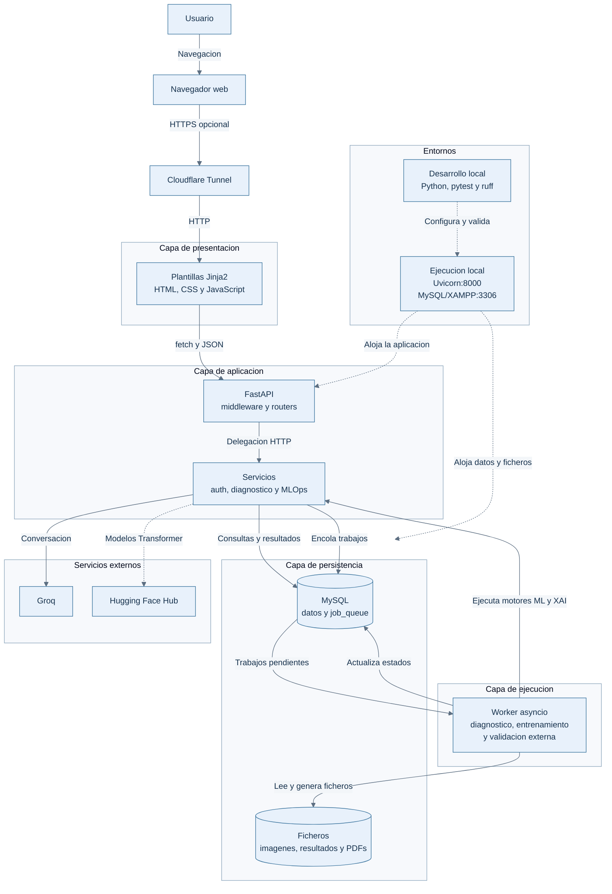

# Capítulo 17: Diseño y arquitectura de vitalXAI

El presente capítulo inicia la parte de diseño de vitalXAI y transforma las decisiones funcionales establecidas durante el análisis en una organización técnica concreta. Mientras que los capítulos anteriores describen qué debe hacer la plataforma, qué actores intervienen y qué requisitos debe satisfacer, el diseño determina cómo se estructuran los componentes que permiten ofrecer esas capacidades. Esta transición se realiza manteniendo la trazabilidad con los objetivos, requisitos, casos de uso y subsistemas definidos en los capítulos 11 a 14.

El diseño se apoya en una aplicación web de servidor desarrollada con Python y FastAPI. La solución proporciona al usuario una interfaz accesible desde el navegador, expone los servicios funcionales mediante rutas HTTP, persiste la información operativa en MySQL y delega los trabajos de mayor duración en un worker interno de ejecución asíncrona. Sobre esta estructura se integran el motor de inferencia de imágenes, los módulos de explicabilidad, el laboratorio de experimentación MLOps, el asistente conversacional conectado con Groq y los generadores de informes PDF.

La organización técnica no reproduce de forma literal la distribución de los subsistemas de análisis. Estos subsistemas continúan siendo la referencia funcional para garantizar la trazabilidad, pero en el diseño se agrupan los elementos según sus responsabilidades de ejecución: presentación, entrada HTTP, lógica de aplicación y aprendizaje automático, persistencia y procesamiento asíncrono. Esta separación permite que la interfaz no tenga que conocer los detalles del motor de inferencia o de la base de datos, y que las tareas computacionalmente costosas puedan continuar sin mantener bloqueada la petición que las originó (Larman, 2004).

La arquitectura descrita en este capítulo corresponde a la implementación actual del sistema. Por este motivo, se documentan FastAPI, las plantillas Jinja2, los scripts JavaScript, MySQL, el pool de conexiones, la cola persistida en la base de datos y el worker basado en `asyncio`, sin sustituirlos por tecnologías previstas en versiones anteriores de la documentación o por componentes que no forman parte del código ejecutable. La correspondencia entre esta solución y los subsistemas de análisis se desarrolla en los apartados posteriores del documento de diseño.

## 17.1 Organización arquitectónica de la solución

La solución adopta una arquitectura cliente-servidor organizada en capas lógicas y servicios internos especializados. El cliente es el navegador del usuario, que recibe las páginas HTML renderizadas mediante Jinja2 y ejecuta los recursos JavaScript y CSS de la interfaz. El servidor concentra la lógica de negocio, la validación de las peticiones, la gestión de la identidad, el acceso a los datos y la coordinación de los trabajos de inteligencia artificial. La base de datos MySQL proporciona la persistencia estructurada, mientras que la cola de trabajos y el worker interno desacoplan las operaciones de larga duración del ciclo de petición HTTP.

Esta decisión responde a dos características esenciales de vitalXAI. La primera es que la complejidad computacional debe permanecer en el servidor: el navegador envía una imagen, una configuración o una solicitud de consulta, pero no carga los modelos de aprendizaje profundo ni ejecuta los entrenamientos. La segunda es que algunas operaciones no pueden resolverse de manera fiable dentro del tiempo de una petición ordinaria. La inferencia, la generación de mapas de explicabilidad, el entrenamiento y la validación externa pueden requerir un tiempo considerable; por ello, se registran como trabajos en `job_queue` y se procesan posteriormente mediante el worker de la aplicación.

### 17.1.1 Capa de presentación y acceso desde el navegador

La capa de presentación está formada por las plantillas HTML del directorio `templates`, los recursos estáticos del directorio `static` y el navegador del usuario. La aplicación no utiliza una SPA independiente: las páginas se generan en el servidor mediante Jinja2 y se sirven como respuestas HTML desde las rutas correspondientes. Entre las vistas principales se encuentran las páginas de inicio de sesión y registro, el panel de diagnóstico, el laboratorio de entrenamiento y la interfaz de administración.

Los scripts JavaScript asociados a las páginas complementan este renderizado con interacciones asíncronas. Por medio de `fetch`, el navegador puede enviar formularios, cargar imágenes, consultar estados de trabajos, recuperar resultados y actualizar partes de la interfaz sin tener que reconstruir toda la página en cada operación. Los recursos `dashboard.js`, `training.js`, `admin.js` e `i18n.js` concentran la lógica de interacción propia de las vistas, mientras que los estilos y las imágenes se sirven como recursos estáticos.

La capa de presentación no constituye una frontera de seguridad suficiente por sí misma. Su función es mostrar la información y recoger las acciones del usuario, pero la autenticación, la autorización, la validación definitiva de los datos y el aislamiento entre usuarios se vuelven a comprobar en el servidor. Esta decisión evita que una modificación de las peticiones desde el navegador permita acceder a consultas, sesiones de entrenamiento o funciones administrativas que no correspondan al usuario autenticado.

### 17.1.2 Capa HTTP y coordinación de los subsistemas funcionales

FastAPI constituye la entrada principal al servidor. La instancia se crea en `main.py`, donde se registra el ciclo de vida de la aplicación, se montan los recursos estáticos y se incorporan los routers funcionales. La organización por routers mantiene separadas las responsabilidades de acceso y evita concentrar todos los endpoints en un único módulo. La aplicación incorpora los routers de autenticación, diagnóstico, historial, cola de trabajos, laboratorio MLOps y administración.

Cada router recibe la petición HTTP, valida sus parámetros, obtiene la identidad del usuario cuando es necesario y delega la operación en el componente especializado. Así, `auth.py` coordina el registro, el inicio y el cierre de sesión; `inference.py` inicia las consultas de diagnóstico; `history.py` gestiona el historial; `trainer.py` coordina el laboratorio MLOps; `queue.py` expone el estado y la cancelación de trabajos; y `admin.py` restringe las operaciones de supervisión al rol de administrador. Esta distribución mantiene la relación entre las rutas de la API y los casos de uso sin convertir cada router en el responsable de la persistencia o del cálculo científico.

La instancia de FastAPI también concentra los elementos transversales que deben aplicarse a todas o a gran parte de las peticiones. `CSRFMiddleware` comprueba el token de protección en las operaciones que modifican el estado, `SecurityHeadersMiddleware` añade las cabeceras de seguridad configuradas y el limitador basado en `slowapi` controla la frecuencia de las operaciones sensibles, especialmente el acceso. Estos mecanismos se registran en el punto de creación de la aplicación para que no dependan de que cada router los aplique manualmente.

### 17.1.3 Servicios de aplicación y motores de inteligencia artificial

La lógica que no pertenece directamente al protocolo HTTP se organiza en el directorio `services`. Esta capa contiene servicios de aplicación y motores especializados que son invocados por los routers o por el worker de la cola. La separación es especialmente importante en vitalXAI porque las operaciones de una consulta clínica no se limitan a producir una etiqueta: también pueden generar un mapa de explicabilidad, crear un informe PDF y persistir el resultado asociado al usuario.

El servicio de autenticación encapsula la creación y comprobación de credenciales, el hash de contraseñas mediante `bcrypt`, la generación de tokens y la gestión de su renovación y revocación. `ml_engine.py` prepara la imagen, carga las arquitecturas disponibles y ejecuta la inferencia mediante TensorFlow/Keras o mediante modelos de Transformers. Las arquitecturas basadas en atención se obtienen a través de la configuración de Hugging Face utilizada por el proyecto. `xai_generator.py` produce los mapas de explicabilidad correspondientes a la arquitectura seleccionada, y `pdf_generator.py` transforma el resultado de una consulta en un informe descargable.

El laboratorio de experimentación se divide en servicios que reflejan sus distintas responsabilidades. `chatbot_service.py` encapsula la comunicación con la API de Groq y permite que el asistente interprete los parámetros del experimento; `trainer_engine.py` prepara los datos y ejecuta el entrenamiento; `mlops_engine.py` gestiona las sesiones, los modelos y los resultados; y `pdf_generator_mlops.py` genera los informes de las sesiones de experimentación. Esta división permite que el router del laboratorio coordine el flujo sin contener la implementación completa del entrenamiento o de la comunicación con el servicio externo.

Los servicios externos se tratan como fronteras de integración. La API de Groq se utiliza únicamente desde el servicio conversacional y requiere la variable de entorno `GROQ_API_KEY`. Los modelos de Transformers se resuelven desde Hugging Face cuando corresponde y se cargan en el motor de aprendizaje automático. Las respuestas o fallos de estos servicios no se exponen directamente al usuario como excepciones internas: la capa de aplicación los convierte en estados o mensajes que la interfaz puede mostrar y que el worker puede registrar como trabajos fallidos.

### 17.1.4 Persistencia relacional y ejecución asíncrona

La persistencia se implementa mediante MySQL y el conector oficial `mysql-connector-python`. El módulo `database.py` proporciona un `MySQLConnectionPool` reutilizable, obtiene los parámetros de conexión desde variables de entorno y expone la función que entrega conexiones a los routers y servicios que necesitan consultar o modificar datos. La inicialización de la aplicación verifica la existencia de las tablas principales: `users`, `consultations`, `training_jobs`, `job_queue` y `refresh_tokens`.

Las relaciones de propiedad se mantienen en la base de datos mediante las claves ajenas que vinculan los trabajos y las consultas con los usuarios. De este modo, la identidad obtenida durante la autenticación puede utilizarse para filtrar el historial, las sesiones de entrenamiento y los trabajos de cada cuenta. El diseño también permite persistir el resultado de una operación larga después de que la petición HTTP inicial haya finalizado: el cliente conserva el identificador del trabajo y consulta posteriormente su estado y su resultado.

La ejecución asíncrona no depende de un broker externo. `queue.py` ofrece las operaciones de consulta y cancelación, mientras que `queue_worker.py` implementa el consumidor interno. Durante el ciclo de vida de FastAPI, `start_worker` restablece los trabajos que quedaron en ejecución tras una interrupción y crea una tarea `asyncio` que inspecciona periódicamente la tabla `job_queue`. El worker selecciona el siguiente trabajo pendiente, intenta reclamarlo de forma condicional y ejecuta el diagnóstico, el entrenamiento o la validación externa según el tipo registrado.

El procesamiento pesado se ejecuta mediante `run_in_executor`, evitando que el cálculo bloquee el bucle de eventos de la aplicación. Una vez terminada la operación, el worker almacena el resultado y marca el trabajo como completado; si se produce una excepción, registra el error y lo marca como fallido. Esta máquina de estados —`queued`, `running`, `completed` y `failed`— permite que la interfaz informe del progreso sin mantener abierta la petición que creó el trabajo. La cancelación se limita a los trabajos que aún están pendientes, lo que evita interrumpir de forma inconsistente una operación que ya ha comenzado.

### 17.1.5 Vista global de la arquitectura

La figura 45 resume las relaciones entre los elementos principales de la solución. El navegador consume las páginas y recursos de presentación y se comunica con FastAPI mediante peticiones HTTP. FastAPI dirige cada operación hacia el router y el servicio correspondiente, utiliza MySQL para la información persistente y registra en `job_queue` las operaciones que deben ejecutarse fuera del ciclo inmediato de la petición. El worker recupera esos trabajos y utiliza los motores de inferencia, explicabilidad, entrenamiento y generación de informes antes de persistir sus resultados.

*Figura 45 - Organización arquitectónica de vitalXAI*

La arquitectura resultante conserva una separación clara entre la interacción del usuario, la coordinación HTTP, la lógica especializada, la persistencia y la ejecución de trabajos. La aplicación sigue siendo desplegable como una única solución, pero sus responsabilidades internas están suficientemente delimitadas para que una modificación en la interfaz no obligue a reescribir el motor de inferencia, que una nueva arquitectura de modelo se incorpore dentro de los servicios de aprendizaje automático y que los cambios en la presentación no alteren el mecanismo de cola. Esta organización materializa las dependencias identificadas en el análisis: los subsistemas de diagnóstico y laboratorio dependen de la identidad y la persistencia, y ambos utilizan el mecanismo transversal de trabajos asíncronos para ejecutar las operaciones de larga duración.

## 17.2 Condiciones de calidad, normativa y restricciones del diseño

La arquitectura definida en el apartado anterior no constituye una elección aislada de tecnologías. Cada una de sus decisiones responde a los requisitos no funcionales, a las normas aplicables al dominio sanitario y a las limitaciones del entorno en el que se construye y ejecuta vitalXAI. En consecuencia, este apartado relaciona las condiciones de calidad del capítulo 12 con las decisiones técnicas que las materializan, distingue los estándares que deben observarse durante el desarrollo y delimita las restricciones que condicionan la solución.

### 17.2.1 Requisitos no funcionales y respuesta arquitectónica

Los requisitos no funcionales se han agrupado en el análisis en siete dimensiones: seguridad y acceso, confidencialidad de los datos, rendimiento, sencillez de uso, robustez, reproducibilidad y documentación. En la fase de diseño no todos ellos se traducen en una clase o un módulo independiente. Algunos se materializan mediante middleware, configuración o separación de responsabilidades; otros corresponden a procedimientos del entorno de ejecución y a los documentos que acompañan al software. La tabla 46 resume la relación entre cada grupo y la respuesta adoptada en la implementación actual.

| Grupo de requisitos | Requisitos relacionados | Decisión de diseño y mecanismo aplicado |
|---|---|---|
| Seguridad del acceso | RNF-001 a RNF-011 | Hash de contraseñas con `bcrypt`, tokens de acceso y refresco, cookies `HttpOnly` con `SameSite=Lax`, middleware CSRF, limitación de acceso mediante `slowapi` y cabeceras de seguridad. Las operaciones administrativas se protegen mediante el rol del usuario. |
| Confidencialidad de los datos | RNF-012 a RNF-018 | Separación de los datos por `user_id`, comprobación de propiedad en las rutas privadas, uso de datasets anonimizados y exposición del servicio mediante HTTPS cuando se accede desde el exterior. |
| Rendimiento y respuesta | RNF-019 a RNF-022 | Reutilización de modelos cargados, pool de conexiones MySQL, ejecución de trabajos mediante `job_queue` y worker `asyncio`, y delegación del cálculo pesado en `run_in_executor`. |
| Usabilidad y accesibilidad | RNF-023 a RNF-026 | Interfaz HTML/Jinja2 con JavaScript vanilla, asistencia conversacional para configurar experimentos, servicio de traducciones, cambio de tema visual y diseño adaptable de las vistas. |
| Robustez y disponibilidad | RNF-027 a RNF-032 | Estados persistentes de los trabajos, registro de errores, recuperación de trabajos que quedaron en ejecución al reiniciar el servidor y claves ajenas en MySQL. Las copias de seguridad dependen del procedimiento operativo del entorno MySQL. |
| Reproducibilidad del sistema | RNF-033 a RNF-034 | Versiones fijadas en `requirements.txt`, entorno virtual de Python, separación entre routers, servicios y persistencia, y ejecución de comprobaciones automatizadas mediante pytest y ruff. |
| Documentación y entregables | RNF-037 a RNF-038 | Memoria estructurada por fases, guía de despliegue y documentación de configuración, instalación y uso de la plataforma. |

*Tabla 46 - Relación entre los requisitos no funcionales y las decisiones de diseño*

#### Seguridad, identidad y control del acceso

La identidad del usuario constituye la primera condición de seguridad de la plataforma. El servicio de autenticación no almacena contraseñas originales, sino valores generados mediante `bcrypt`, y la tabla `users` conserva únicamente el campo `password_hash`. La sesión se articula mediante un token de acceso y un token de refresco. Ambos se entregan mediante cookies protegidas frente al acceso de JavaScript mediante el atributo `HttpOnly`, mientras que el token de refresco limita además su ruta de envío al endpoint de renovación. La rotación y revocación de los tokens se apoya en la tabla `refresh_tokens`, que conserva su hash, su fecha de expiración y su estado de revocación.

El diseño incorpora una protección adicional frente a peticiones CSRF. El middleware genera una cookie `csrf_token` accesible desde el código de la interfaz y exige que las peticiones que modifican el estado incluyan el mismo valor en la cabecera `X-CSRF-Token`. Las operaciones de lectura permanecen fuera de esta comprobación y la ruta de inicio de sesión se trata como excepción específica para permitir el acceso inicial. La comparación se realiza en el servidor antes de entregar la petición al router correspondiente.

La limitación de frecuencia se aplica especialmente al inicio de sesión, que se encuentra limitado a cinco peticiones por minuto mediante `slowapi`. Esta medida reduce la viabilidad de ataques automatizados de fuerza bruta sin tener que incorporar la lógica de limitación dentro del router de autenticación. A este mecanismo se suman las cabeceras emitidas por `SecurityHeadersMiddleware`, entre ellas `Content-Security-Policy`, `X-Content-Type-Options`, `X-Frame-Options`, `Strict-Transport-Security` y `Referrer-Policy`.

El control de roles se aplica en el router de administración. El usuario administrador puede consultar el listado de usuarios y supervisar las consultas de una cuenta, mientras que un usuario ordinario no puede invocar esas operaciones. El aislamiento de datos se comprueba de forma independiente en cada operación que recupera o modifica una consulta, una sesión de entrenamiento o un trabajo. Esta comprobación no se delega en la interfaz, ya que el navegador puede ser manipulado por el usuario que realiza la petición.

Debe distinguirse entre el control de acceso administrativo y la auditoría formal de la actividad administrativa. La implementación actual restringe las rutas de administración mediante el rol, pero no introduce una tabla independiente de trazas con el detalle histórico de cada operación. Por ello, RNF-006 se mantiene como condición de calidad y de gobierno del sistema, mientras que el mecanismo de autorización sí forma parte de la arquitectura implementada. Esta precisión evita presentar como existente un componente de auditoría que no aparece en el código actual.

#### Confidencialidad y tratamiento de la información

La aplicación trabaja con cuentas de usuario, radiografías y resultados de diagnóstico. El diseño relacional vincula las consultas, los trabajos y los entrenamientos con el identificador del usuario propietario, y las rutas utilizan esa relación para limitar los resultados. Esta regla se aplica tanto al historial clínico como a las sesiones del laboratorio MLOps y a los trabajos almacenados en `job_queue`.

El cumplimiento de los requisitos de privacidad no se resuelve únicamente con una configuración de software. Los datasets de entrenamiento y validación deben estar anonimizados antes de incorporarse al proyecto, y el personal que sube una imagen debe garantizar que no contiene información identificable del paciente. La plataforma almacena rutas de ficheros y resultados asociados al usuario profesional, pero no incorpora un módulo de identificación del paciente ni debe utilizarse para introducir datos personales que no sean necesarios para la consulta.

La confidencialidad durante el tránsito depende del entorno de exposición. En el uso local, Uvicorn atiende la aplicación en el puerto 8000; cuando se publica el sistema mediante el túnel configurado para la demostración, el acceso exterior se realiza mediante HTTPS. Las cookies de sesión incorporan actualmente `HttpOnly` y `SameSite=Lax`; la protección del canal debe mantenerse como condición obligatoria del entorno de despliegue para evitar que las credenciales y los datos viajen sin cifrar.

#### Rendimiento, concurrencia y ejecución sin bloqueo

El requisito de rendimiento más relevante no consiste únicamente en reducir el tiempo de una función concreta, sino en impedir que una operación de aprendizaje automático monopolice el ciclo de petición. Por este motivo, el diagnóstico, el entrenamiento y la validación externa se registran primero como trabajos en la tabla `job_queue`. La petición HTTP puede devolver el identificador y el estado inicial del trabajo, mientras que el worker continúa el procesamiento de forma independiente.

El worker se inicia durante el ciclo de vida de FastAPI y consulta periódicamente los trabajos pendientes. Para evitar que el cálculo de TensorFlow, la generación de mapas XAI o la ejecución del entrenamiento bloqueen el bucle de eventos, el trabajo se envía a `run_in_executor`. El resultado o el mensaje de error se almacena después en MySQL. Así, el usuario puede consultar la cola mientras el procesamiento continúa y la plataforma puede atender otras peticiones.

La concurrencia de acceso a la persistencia se aborda mediante `MySQLConnectionPool`. El tamaño del pool se configura con `DB_POOL_SIZE`, mientras que los restantes datos de conexión se obtienen mediante variables de entorno. Esta decisión evita crear una conexión nueva de forma indiscriminada para cada operación y permite controlar el número de conexiones simultáneas en función del entorno disponible. La concurrencia no elimina la necesidad de validar la propiedad de cada registro: el rendimiento y el aislamiento de datos son condiciones simultáneas.

#### Usabilidad, internacionalización y presentación

La elección de plantillas Jinja2 y JavaScript vanilla reduce la complejidad del cliente y evita introducir una cadena de compilación independiente. Las páginas se entregan directamente desde el servidor y los scripts añaden únicamente las interacciones necesarias para cargar imágenes, consultar estados, mostrar resultados y actualizar el laboratorio. La arquitectura facilita que la interfaz pueda funcionar desde un navegador sin instalar software adicional.

El servicio `lang.py` centraliza la recuperación de textos traducidos y permite seleccionar el idioma mediante la cookie correspondiente. Esta capacidad se utiliza desde las vistas de autenticación, el panel de diagnóstico y el laboratorio. El cambio de tema visual se realiza en el cliente y se conserva como preferencia de la interfaz. La presentación de los resultados se organiza alrededor de las necesidades del usuario: diagnóstico y confianza, mapas de explicabilidad, histórico de consultas, progreso de trabajos y resultados del laboratorio.

#### Robustez, persistencia y recuperación

La tabla `job_queue` actúa como soporte persistente de la ejecución asíncrona. A diferencia de una cola exclusivamente residente en memoria, permite conservar el estado de un trabajo y recuperarlo después de reiniciar la aplicación. Al iniciar el worker, `_reset_running_jobs()` devuelve al estado `queued` los trabajos que quedaron en `running`, de modo que no permanezcan bloqueados indefinidamente. Cada ejecución puede terminar en `completed` o `failed`, y en el segundo caso se conserva un mensaje de error limitado en longitud.

Las claves ajenas de las tablas `consultations`, `training_jobs`, `job_queue` y `refresh_tokens` apuntan a `users`. Esta relación refuerza la integridad del modelo y permite eliminar los datos dependientes de un usuario cuando la operación está configurada con `ON DELETE CASCADE`. Las escrituras se confirman explícitamente mediante `commit` y las conexiones se cierran al finalizar cada operación.

La copia de seguridad periódica y la restauración de MySQL pertenecen al entorno operativo, no a un servicio interno de la aplicación. El diseño identifica esta dependencia para que el despliegue no confunda la persistencia local con una estrategia de recuperación completa. La guía de despliegue debe conservar, por tanto, las instrucciones necesarias para iniciar MySQL y verificar la disponibilidad de la base de datos antes de ejecutar la plataforma.

### 17.2.2 Estándares y normas aplicables

El sistema se desarrolla bajo normas legales y técnicas que afectan a distintos niveles de la solución. En materia de privacidad se aplica el Reglamento General de Protección de Datos, Reglamento (UE) 2016/679, junto con la Ley Orgánica 3/2018 de protección de datos personales y garantía de los derechos digitales. Estas normas condicionan la minimización de la información recogida, la anonimización de las imágenes, la asociación de los datos a una cuenta y la forma en que se documenta el tratamiento de la información sanitaria (Parlamento Europeo y Consejo de la Unión Europea, 2016; España, 2018).

Para la protección de las comunicaciones se adopta HTTPS apoyado en TLS. El túnel utilizado para exponer la aplicación debe proporcionar el canal cifrado entre el navegador y el entorno local, y las cabeceras de seguridad del servidor complementan esa protección. La existencia de HTTPS no sustituye a la autenticación, a la autorización ni a la protección CSRF; son mecanismos que operan en capas distintas y deben mantenerse conjuntamente (IETF, 2018).

El código Python sigue las convenciones de PEP 8. La aplicación utiliza `ruff` como comprobación automatizada de estilo y mantiene un fichero `requirements.txt` con versiones fijadas de sus dependencias principales. La documentación de la memoria y los manuales se elaboran conforme a la normativa del Trabajo Fin de Grado de la Escuela Politécnica Superior de la Universidad Pablo de Olavide, que constituye el marco formal de los entregables del proyecto (van Rossum, Warsaw, & Coghlan, 2001; Universidad Pablo de Olavide, 2014).

La tabla 47 resume el ámbito de aplicación de las normas anteriores.

| Norma o estándar | Aplicación en vitalXAI |
|---|---|
| RGPD, Reglamento (UE) 2016/679 | Tratamiento de cuentas, imágenes médicas anonimizadas y resultados asociados. |
| Ley Orgánica 3/2018 | Aplicación nacional de las garantías de protección de datos personales. |
| HTTPS / TLS | Protección del canal entre el navegador y el servidor cuando la aplicación se expone externamente. |
| PEP 8 | Convenciones de estilo y organización del código Python, verificadas con `ruff`. |
| Normativa TFG EPS-UPO | Estructura, formato y documentación de los entregables académicos. |

*Tabla 47 - Normas y estándares aplicables al diseño*

### 17.2.3 Restricciones técnicas y límites del entorno

La primera restricción técnica es el ecosistema de aprendizaje automático. La aplicación se ejecuta sobre Python 3.11 y depende de TensorFlow, Keras, OpenCV, scikit-learn y Transformers. Esta combinación condiciona la versión del intérprete, el sistema operativo y la disponibilidad de recursos de memoria. Los modelos convolucionales y Transformer no se consideran componentes ligeros del servidor: sus pesos deben cargarse en memoria y los entrenamientos pueden requerir una GPU compatible con el entorno de TensorFlow.

La segunda restricción es la capacidad de cómputo local. El entrenamiento y la validación de las arquitecturas demandan más recursos que una consulta web ordinaria, por lo que el entorno de desarrollo debe disponer de hardware suficiente, especialmente durante la ejecución del laboratorio MLOps. La interfaz y los routers no deben asumir que el resultado está disponible de forma inmediata; esta condición es precisamente la que justifica el diseño basado en trabajos persistidos y worker interno.

La tercera restricción es la disponibilidad de MySQL. La aplicación depende de una instancia accesible mediante los parámetros `DB_HOST`, `DB_USER`, `DB_PASSWORD`, `DB_NAME` y `DB_POOL_SIZE`. En el entorno de demostración, MySQL se ejecuta mediante XAMPP. Si el servicio no está iniciado o las credenciales no son válidas, la inicialización de la base de datos no puede completarse, aunque el ciclo de vida de FastAPI informa del problema y continúa hasta iniciar el worker.

La cuarta restricción procede de los servicios externos. El asistente conversacional requiere `GROQ_API_KEY` y conectividad con la API de Groq. La carga de los modelos Transformer puede requerir acceso a Hugging Face, salvo que los modelos ya estén disponibles localmente. Estas dependencias introducen límites de disponibilidad y latencia que el sistema debe tratar como fallos de integración, no como errores de lógica interna. Por este motivo, las pruebas unitarias sustituyen los servicios externos por mocks y la ejecución de producción debe conservar las variables de entorno fuera del código fuente.

Finalmente, la exposición remota mediante el túnel no convierte el entorno local en una infraestructura distribuida. La aplicación, el worker, los ficheros y la base de datos continúan alojados en la máquina de ejecución. El túnel únicamente proporciona el canal de acceso desde el navegador externo. Esta decisión simplifica la demostración y mantiene bajo control las versiones del entorno, pero limita la escalabilidad, la tolerancia a fallos hardware y la disponibilidad de la plataforma si la máquina anfitriona se apaga o pierde conectividad.

En conjunto, estas restricciones explican por qué el diseño prioriza una aplicación servidor sencilla, una persistencia relacional accesible, un mecanismo de trabajos basado en MySQL y una separación clara entre la petición web y la computación científica. No se introducen colas, bases de datos o servicios de despliegue adicionales que no sean necesarios para la implementación actual. La arquitectura conserva así una relación directa entre los requisitos del análisis, las condiciones de calidad, el entorno disponible y los componentes que realmente ejecuta vitalXAI.

## 17.3 Subsistemas de diseño de la plataforma

Los subsistemas de diseño son la traducción técnica de los seis subsistemas de análisis definidos en el capítulo 13. La correspondencia se mantiene de forma directa: cada subsistema `SS` conserva sus responsabilidades funcionales y recibe un identificador `SD` que agrupa los componentes de implementación que las realizan. Esta decisión permite recorrer la trazabilidad desde los requisitos y casos de uso hasta los routers, servicios, mecanismos de persistencia y procesos que intervienen en la ejecución.

La correspondencia no implica que cada subsistema de diseño sea una aplicación independiente. Todos forman parte de la misma aplicación FastAPI y comparten la base de datos, la autenticación, la capa de presentación y el worker de trabajos. La separación se realiza por responsabilidades y límites funcionales, no mediante despliegues separados. De esta manera, el código mantiene una organización modular sin introducir una complejidad distribuida que no exige el entorno actual.

| Subsistema de diseño | Subsistema de análisis | Responsabilidad principal | Componentes de implementación |
|---|---|---|---|
| SD-001 | SS-001 | Gestionar la identidad, las sesiones y el acceso a la plataforma. | `routers/auth.py`, `services/auth_service.py`, `users`, `refresh_tokens` y middleware de seguridad. |
| SD-002 | SS-002 | Recibir una radiografía, solicitar el diagnóstico y producir sus artefactos. | `routers/inference.py`, `services/ml_engine.py`, `services/xai_generator.py`, `services/pdf_generator.py` y `job_queue`. |
| SD-003 | SS-003 | Consultar y administrar el historial de diagnósticos del usuario. | `routers/history.py`, tabla `consultations`, ficheros de resultados y `dashboard.js`. |
| SD-004 | SS-004 | Configurar, ejecutar y consultar experimentos MLOps. | `routers/trainer.py`, `chatbot_service.py`, `trainer_engine.py`, `mlops_engine.py` y `pdf_generator_mlops.py`. |
| SD-005 | SS-005 | Supervisar usuarios, consultas y sesiones desde el ámbito administrativo. | `routers/admin.py`, consultas MySQL y funciones de consulta de `mlops_engine.py`. |
| SD-006 | SS-006 | Coordinar trabajos asíncronos y capacidades transversales de la interfaz. | `routers/queue.py`, `services/queue_worker.py`, `services/lang.py`, middleware global y recursos estáticos. |

*Tabla 48 - Correspondencia entre subsistemas de análisis y subsistemas de diseño*

### 17.3.1 SD-001: Acceso, identidad y gestión de sesiones

El subsistema SD-001 materializa el subsistema de análisis SS-001 y cubre el registro, el inicio y el cierre de sesión, la renovación de credenciales y la identificación del usuario en las áreas privadas. Su responsabilidad no se limita a validar el formulario de acceso: establece la identidad que utilizarán los demás subsistemas para aplicar el aislamiento de datos y las comprobaciones de rol.

El punto de entrada del subsistema es `routers/auth.py`. El router sirve las páginas de inicio de sesión y registro y procesa los formularios recibidos desde la interfaz. Antes de crear una cuenta valida el formato del nombre de usuario, la longitud mínima de la contraseña y la presencia de los datos personales básicos. A continuación, consulta MySQL para comprobar que el usuario no existe, genera el hash de la contraseña y almacena la cuenta en la tabla `users`. La contraseña original no se transmite a ningún componente de persistencia después de completar el proceso de hash.

La lógica criptográfica y la gestión del ciclo de vida de los tokens se concentra en `services/auth_service.py`. El token de acceso se firma con JWT y contiene el identificador del usuario y su fecha de expiración. El token de refresco se genera como un valor aleatorio, pero en la base de datos solo se conserva su hash SHA-256 junto con el usuario, la fecha de expiración y el indicador de revocación. Esta diferencia permite renovar la sesión sin guardar una credencial reutilizable en texto plano.

El cierre de sesión revoca el token de refresco y elimina las cookies de la respuesta. La rotación genera un token nuevo y revoca el anterior; si se detecta el uso de un token revocado fuera del periodo de gracia configurado, el servicio invalida todos los tokens del usuario. El mecanismo está diseñado para tolerar peticiones concurrentes de renovación durante un intervalo corto sin interpretar automáticamente cada repetición como un robo de sesión.

El subsistema se apoya también en los mecanismos transversales registrados en `main.py`. `CSRFMiddleware` protege las peticiones que modifican el estado, `SecurityHeadersMiddleware` refuerza las respuestas dirigidas al navegador y `slowapi` limita el endpoint de inicio de sesión. La sesión se almacena en cookies `HttpOnly` y con alcance `SameSite=Lax`, mientras que el resto de routers utiliza `get_user_id_from_token()` para obtener la identidad antes de realizar operaciones privadas. SD-001 es, por tanto, un subsistema transversal: SD-002, SD-003, SD-004, SD-005 y SD-006 dependen de la identidad que establece.

Desde el punto de vista de la trazabilidad, SD-001 realiza principalmente los casos de uso CU-001 a CU-004. CU-001 se materializa en la combinación de validación de los campos, consulta de unicidad, generación del hash e inserción en `users`; CU-002 añade la verificación de la contraseña y la creación de las dos cookies de sesión; CU-003 revoca el token de refresco y elimina las cookies; y CU-004 utiliza el servicio de idioma para adaptar la presentación. Los casos de uso de otros subsistemas no necesitan conocer cómo se firma un token: solo reciben la identidad resuelta o una respuesta de acceso no autorizado.

La configuración sensible permanece fuera del código. `JWT_SECRET_KEY`, `JWT_ACCESS_EXPIRE_MINUTES`, `JWT_REFRESH_EXPIRE_DAYS` y `REFRESH_ROTATION_GRACE_SECONDS` se obtienen del entorno, al igual que los parámetros de MySQL. Esta decisión evita que la clave criptográfica o la duración de las credenciales queden ligadas al repositorio. El servicio emite además una advertencia cuando se utiliza la clave de desarrollo por defecto, lo que convierte una configuración insegura en una condición visible durante el arranque.

El subsistema establece contratos sencillos con sus consumidores. Un componente que necesita identificar al usuario entrega el token de acceso a `get_user_id_from_token()` y recibe un identificador entero o `None`; no interpreta directamente el payload JWT ni duplica la lógica de expiración. Los routers, a su vez, traducen la ausencia de identidad en una respuesta HTTP 401. La comprobación del rol se realiza únicamente en las operaciones administrativas, por lo que la existencia de una sesión válida no equivale a disponer de privilegios elevados.

La principal decisión de SD-001 es conservar el token de acceso en la cookie y el token de refresco en una cookie con ruta restringida, en lugar de enviar las credenciales en el cuerpo de cada petición. Esto simplifica la interacción de las plantillas y los scripts del navegador y reduce la exposición accidental de los tokens en el almacenamiento de la interfaz. La protección efectiva depende además de que el entorno de publicación utilice HTTPS y de que la clave secreta de producción esté configurada correctamente.

### 17.3.2 SD-002: Diagnóstico asistido y generación de resultados

El subsistema SD-002 corresponde a SS-002 y concentra el flujo clínico de la plataforma. Su función es recibir una imagen válida, asociarla al usuario autenticado, registrar una solicitud de diagnóstico, ejecutar la inferencia con la arquitectura seleccionada y conservar los artefactos que permiten consultar y justificar el resultado.

`routers/inference.py` actúa como fachada HTTP del subsistema. La ruta `/predict` comprueba la existencia de una sesión válida y valida el tipo MIME de la imagen. Solo se aceptan imágenes JPEG y PNG, y se aplica un límite de 10 MB antes de escribir el fichero en `static/uploads`. Esta validación se realiza antes de encolar el trabajo, de modo que una petición inválida no ocupa una posición en la cola ni genera un registro de procesamiento incompleto.

Una vez almacenada temporalmente la imagen, el router crea un registro en `job_queue` con el tipo `diagnosis`, el identificador del usuario y un payload JSON que incluye la arquitectura, la ruta de la imagen y el idioma. La respuesta HTTP informa de que el trabajo ha quedado encolado, devuelve su identificador y calcula su posición. El router no carga el modelo ni ejecuta la predicción, ya que esas operaciones pertenecen al worker y a la capa de servicios.

El worker dirige el trabajo de diagnóstico hacia `services/ml_engine.py`, que prepara la imagen, carga o reutiliza el modelo y produce la etiqueta y la confianza de la predicción. La implementación combina arquitecturas convolucionales gestionadas mediante TensorFlow/Keras y arquitecturas basadas en Transformers. Después de la inferencia, `services/xai_generator.py` genera el mapa de explicabilidad adecuado para el modelo utilizado. Finalmente, `services/pdf_generator.py` genera el informe descargable con la imagen original, el resultado, la confianza y el artefacto XAI.

El resultado se registra en la tabla `consultations`, donde quedan asociados el usuario, el modelo utilizado, las rutas de los ficheros, la etiqueta de predicción, la confianza y el informe PDF. Esta persistencia permite que el historial y la interfaz administrativa consulten el resultado sin repetir la inferencia. Si cualquier fase falla, el worker marca el trabajo como `failed` y conserva el mensaje de error en `job_queue`, evitando que la petición original quede abierta indefinidamente.

El flujo interno de SD-002 se divide en cinco pasos. Primero, el router autentica al usuario y valida el fichero recibido. Segundo, conserva la imagen original en el área de cargas y crea el payload serializable del trabajo. Tercero, el worker reclama el registro y ejecuta la inferencia. Cuarto, genera los artefactos derivados, que son el mapa XAI y el informe PDF. Quinto, persiste la consulta y actualiza el estado de la cola. La división evita que una ruta HTTP tenga que mantener referencias abiertas a un fichero o a un modelo durante toda la operación.

El payload de un trabajo de diagnóstico contiene únicamente la información necesaria para repetir el procesamiento: `model_name`, `image_path` y `lang`, además del identificador del usuario almacenado en la propia fila de la cola. No se serializa el objeto del modelo ni la imagen completa dentro de MySQL. Los datos voluminosos se mantienen en el sistema de ficheros y la base de datos conserva sus rutas, de manera que la cola sigue siendo ligera y puede consultarse con rapidez.

La separación entre `ml_engine`, `xai_generator` y `pdf_generator` también delimita los fallos. Una arquitectura no reconocida debe fallar antes de producir un resultado ambiguo; una imagen no válida no debe alcanzar el motor; y un error al construir el informe no debe transformarse en una consulta marcada como completada. El worker agrupa el flujo completo dentro del procesamiento del trabajo y utiliza la transición a `failed` como contrato común para que la interfaz pueda mostrar que la operación terminó con error.

La reutilización de modelos cargados responde al RNF-019. El coste de la primera consulta puede incluir la lectura de los pesos y la construcción del modelo, mientras que las consultas posteriores pueden aprovechar el modelo disponible en memoria. Esta optimización pertenece al motor de aprendizaje automático y no al router, por lo que la capa HTTP permanece independiente de si la arquitectura seleccionada es convolucional o Transformer.

SD-002 también actúa como frontera de validación de ficheros. El tipo MIME y el tamaño se comprueban antes de escribir en disco, pero la validez científica de la imagen y la interpretación clínica del resultado siguen siendo responsabilidades distintas. El sistema ofrece una clasificación asistida, una confianza y explicaciones visuales; no sustituye la valoración del profesional sanitario. Esta separación de responsabilidades es importante para no convertir el diseño técnico del subsistema en una afirmación clínica que la implementación no puede garantizar.

### 17.3.3 SD-003: Historial y gestión de consultas

El subsistema SD-003 materializa SS-003 y proporciona la recuperación y gestión de las consultas ya realizadas. Su entidad persistente principal es `consultations`, que almacena las rutas de los artefactos, la arquitectura utilizada, la predicción, la confianza, el nombre mostrado al usuario y la fecha de la operación.

`routers/history.py` expone la consulta del listado y las operaciones de actualización y eliminación. La consulta del historial filtra siempre por el `user_id` obtenido de la cookie de acceso y ordena los resultados por fecha descendente. Antes de modificar o eliminar una consulta, `_check_consultation_ownership()` comprueba que el registro existe y que pertenece al usuario solicitante. La misma función contempla la excepción controlada del administrador, que puede supervisar consultas desde SD-005.

El subsistema no vuelve a ejecutar el modelo para mostrar una consulta anterior. Recupera desde MySQL los metadatos y devuelve las rutas de la imagen original, el mapa XAI y el informe PDF para que la interfaz pueda presentarlos o descargarlos. Esta decisión reduce el coste de acceso al historial y conserva la separación entre una consulta nueva y la visualización de un resultado ya calculado.

La interfaz del historial se integra en el panel de diagnóstico y utiliza JavaScript para mostrar los resultados, cambiar el nombre visible de una consulta y solicitar su eliminación. El router devuelve códigos diferenciados para la falta de autenticación, la consulta inexistente y la ausencia de permisos. Esta distinción permite que la capa de presentación informe al usuario de la situación sin exponer detalles internos de la base de datos.

La relación entre SD-003 y SD-002 es de productor-consumidor de resultados. SD-002 crea el registro de `consultations` cuando finaliza un diagnóstico; SD-003 no modifica la predicción ni sus artefactos, sino que proporciona operaciones de consulta y organización. El nombre mostrado al usuario se actualiza sobre `patient_name`, que funciona como etiqueta de organización de la consulta y no como identificación clínica del paciente. Esta decisión mantiene separados los metadatos de presentación de los datos técnicos de la inferencia.

El listado devuelve los campos necesarios para construir las tarjetas o filas del historial: identificador, fecha, modelo, rutas de imágenes, etiqueta, confianza, nombre y PDF. Las fechas se convierten a una representación textual antes de formar la respuesta JSON, de modo que el navegador no necesita conocer el tipo específico de fecha de MySQL. Los artefactos se sirven mediante las rutas estáticas configuradas en la aplicación y no mediante una nueva ruta de cálculo.

La eliminación se implementa actualmente como una eliminación física de la fila de consulta. Por esa razón, el diseño no debe describir SD-003 como un subsistema de borrado lógico ni afirmar que conserva automáticamente una auditoría de cada eliminación. La integridad de la operación depende de que se compruebe la propiedad antes de ejecutar el `DELETE`, y de que la transacción se confirme solo después de que la actualización haya sido aceptada por MySQL. La decisión se documenta aquí porque afecta a la interpretación del historial y a futuras ampliaciones del modelo de persistencia.

El administrador constituye una excepción controlada al aislamiento ordinario. `_check_consultation_ownership()` permite continuar cuando el usuario tiene rol `admin`, pero el acceso administrativo se comprueba en el servidor y no se infiere de un parámetro enviado por el navegador. En todos los demás casos, una consulta de otro usuario produce una respuesta 403. Así, SD-003 mantiene una política única de propiedad y permite que SD-005 la utilice sin duplicar una segunda consulta de autorización.

### 17.3.4 SD-004: Laboratorio de experimentación MLOps

El subsistema SD-004 corresponde a SS-004 y constituye el bloque de mayor complejidad funcional. Gestiona la configuración conversacional del experimento, la selección del dataset, el entrenamiento de modelos, la ejecución de los análisis de explicabilidad, la comparación estadística, la validación externa, la consulta de resultados y la generación de informes.

`routers/trainer.py` se ha diseñado como una fachada ligera. Sus rutas comprueban la autenticación, validan que la sesión de experimentación pertenece al usuario y delegan las operaciones especializadas en `mlops_engine.py` o en los servicios correspondientes. Entre sus operaciones se encuentran la conversación con el asistente, la exploración de carpetas, el inicio de entrenamientos, la consulta de logs, la recuperación de sesiones, la consulta de resultados, el ranking, el recálculo de la comparativa, la validación externa y la generación de informes.

La configuración conversacional se encapsula en `services/chatbot_service.py`, que se comunica con Groq y devuelve una configuración estructurada cuando se han proporcionado los parámetros necesarios. El router no incorpora la lógica del modelo de lenguaje: únicamente valida la sesión y entrega el mensaje al servicio. Esta separación permite que la comunicación con Groq se trate como una frontera externa y que los errores del proveedor no se confundan con errores de persistencia o de entrenamiento.

`services/mlops_engine.py` organiza las sesiones del laboratorio y resuelve la lectura y escritura de los resultados en `training_results`. `trainer_engine.py` contiene la lógica de preparación del dataset, construcción de modelos, entrenamiento, cálculo del progreso y actualización del estado. Los resultados generados por el pipeline incluyen las métricas de rendimiento, los artefactos de explicabilidad, los datos de comparación y la información necesaria para la validación externa. Los informes finales se generan mediante `pdf_generator_mlops.py`.

El inicio de un entrenamiento crea la sesión, comprueba que la ruta del dataset existe y registra en `job_queue` un trabajo de tipo `training` con los modelos e hiperparámetros solicitados. La validación externa sigue el mismo mecanismo con un trabajo de tipo `external_validation`. El worker ejecuta ambos tipos fuera del ciclo de petición y actualiza el estado de la cola al finalizar. Esta decisión permite que el laboratorio conserve una interfaz interactiva aunque el entrenamiento tarde mucho más que una petición HTTP normal.

La propiedad de las sesiones es una regla central del subsistema. Antes de mostrar resultados, eliminar o renombrar una sesión, el router invoca la comprobación de propiedad de `mlops_engine`; el administrador puede acceder a estas operaciones de supervisión cuando la ruta lo permite. Así, la configuración, los resultados y los artefactos de una experimentación permanecen asociados a la cuenta que la creó.

La configuración de una sesión contiene los parámetros que necesita el pipeline: ruta del dataset, modelos seleccionados, número de épocas, tamaño de lote y tasa de aprendizaje. El asistente conversacional permite completar esa información mediante mensajes, pero la ejecución no comienza hasta que el router dispone de una configuración completa y válida. La conversación y el entrenamiento son responsabilidades distintas: Groq ayuda a interpretar la intención del usuario, mientras que `mlops_engine` y `trainer_engine` validan y ejecutan la configuración.

El lanzamiento de un entrenamiento sigue una secuencia concreta. La ruta comprueba la autenticación, verifica que existe la ruta del dataset, crea la sesión de entrenamiento y registra en `job_queue` un payload con la lista de modelos y los hiperparámetros. El identificador de la sesión se conserva tanto en la fila del trabajo como en el directorio de resultados. Esta doble referencia permite consultar el estado desde MySQL y recuperar los artefactos experimentales desde el sistema de ficheros.

La información de una sesión no se reduce a un único valor de rendimiento. El pipeline genera resultados por arquitectura y por pliegue, métricas agregadas, artefactos de explicabilidad, configuraciones y datos de comparación estadística. `get_model_results_data()` y `get_session_ranking_data()` transforman esos ficheros en estructuras que el frontend puede mostrar. Esta decisión evita trasladar al navegador la responsabilidad de recorrer todos los artefactos o de repetir los cálculos del ranking.

La comparación estadística tiene un flujo diferenciado del entrenamiento. La ruta de comparación comprueba la propiedad y programa `run_statistical_comparison` mediante `BackgroundTasks`, mientras que el entrenamiento y la validación externa se insertan explícitamente en `job_queue` para ser procesados por `queue_worker.py`. Esta diferencia es una característica de la implementación actual: ambos mecanismos permiten devolver pronto la respuesta, pero no deben documentarse como si fueran el mismo canal de ejecución. El estado del recálculo se consulta mediante una ruta específica de la sesión.

La validación externa también mantiene la separación entre entrenamiento y evaluación. La ruta verifica que el dataset externo existe y que el usuario tiene acceso a la sesión; después encola un trabajo con el identificador de la sesión y la ruta del dataset. El worker ejecuta la validación sobre los modelos disponibles sin modificar la configuración original del entrenamiento. Los resultados se almacenan como artefactos de la sesión y quedan disponibles para su consulta posterior.

El informe de MLOps se genera en una fase posterior, cuando la sesión dispone de los datos necesarios. `pdf_generator_mlops.py` recibe la información preparada por el motor y produce un documento descargable, evitando que el router conozca el formato interno del informe. De este modo, el laboratorio puede cambiar la estructura visual del PDF sin cambiar el contrato de las rutas que consultan los resultados.

Desde la perspectiva de los errores, SD-004 debe diferenciar una configuración inválida, un dataset inexistente, una sesión ajena y un fallo del entrenamiento. Las dos primeras situaciones se rechazan antes de crear o encolar el trabajo; la tercera devuelve 403; y la cuarta se registra durante el procesamiento y cambia el estado del trabajo. Esta clasificación permite que la interfaz muestre una corrección de datos, una falta de permisos o un fallo computacional sin confundirlos.

### 17.3.5 SD-005: Supervisión y administración

El subsistema SD-005 deriva de SS-005 y reúne las operaciones que solo puede realizar un usuario con rol de administrador. Su objetivo es proporcionar una visión supervisada del uso de la plataforma sin mezclar las operaciones administrativas con las rutas que utiliza un usuario ordinario.

`routers/admin.py` centraliza la comprobación de permisos mediante `_require_admin()`. La función obtiene primero la identidad desde el token de acceso y consulta el rol en la tabla `users`. El router diferencia entre una petición no autenticada, una petición autenticada sin permisos y una petición administrativa válida, devolviendo códigos HTTP diferentes en cada caso.

La consulta del listado administrativo combina la información de `users` con el número de consultas de `consultations` y obtiene también el número de sesiones de laboratorio a partir de la información disponible en `training_results`. Las rutas específicas permiten consultar las consultas de un usuario y visualizar el detalle de una consulta concreta. En la segunda operación se incluyen también las sesiones de entrenamiento recuperadas por `mlops_engine`.

SD-005 no duplica la lógica de propiedad del historial ni la del laboratorio. Su responsabilidad es establecer la autorización administrativa y coordinar las consultas globales; la lectura de los datos sigue utilizando las mismas tablas y servicios que el resto de la aplicación. Esta decisión reduce la duplicación y mantiene una frontera clara entre el control de permisos y la representación de la información.

El flujo administrativo comienza siempre por `_require_admin()`. La función identifica al solicitante, consulta su rol y devuelve un resultado ternario en la práctica: no hay identidad, existe identidad sin privilegios o existe identidad con rol de administrador. Cada endpoint interpreta ese resultado antes de abrir la consulta global correspondiente. Esta secuencia evita que una ruta administrativa ejecute una consulta de usuarios o de consultas antes de haber comprobado el permiso.

La vista global combina dos fuentes de información. Los usuarios y el número de diagnósticos se obtienen mediante una consulta agregada sobre `users` y `consultations`; el número de sesiones del laboratorio se calcula inspeccionando las configuraciones disponibles en `training_results`. Esta decisión refleja la persistencia híbrida actual de la plataforma: la información relacional se consulta en MySQL, mientras que parte de los artefactos de las sesiones se conserva en el sistema de ficheros.

Las rutas de supervisión mantienen la granularidad necesaria para la interfaz administrativa. Una ruta devuelve el listado de usuarios, otra recupera las consultas y sesiones asociadas a un usuario concreto y una tercera muestra el detalle de una consulta. El administrador puede acceder a la información de otros usuarios por su rol, pero el sistema no convierte esas rutas en operaciones de modificación general: su responsabilidad actual es de consulta y supervisión.

La protección del subsistema se completa con las medidas de SD-001 y SD-006. El router administrativo no implementa una segunda autenticación ni una segunda gestión de tokens; reutiliza la identidad de la sesión y consulta el rol en la base de datos. Tampoco escribe una traza de auditoría independiente en cada operación, por lo que el requisito de auditoría administrativa debe considerarse una condición pendiente del modelo operativo y no una tabla o servicio que ya exista.

### 17.3.6 SD-006: Cola de trabajos y capacidades transversales

El subsistema SD-006 materializa SS-006 y reúne las capacidades que sirven de apoyo a varios flujos funcionales. Su núcleo es la cola persistente de trabajos, utilizada por los diagnósticos, los entrenamientos y las validaciones externas. También incluye la consulta de idioma, la personalización de la interfaz y los mecanismos transversales que se aplican desde la configuración principal de FastAPI.

`routers/queue.py` expone la consulta del estado de los trabajos y la cancelación de un trabajo pendiente. La ruta de estado filtra por el usuario autenticado, devuelve los trabajos recientes y calcula la posición de los que permanecen en `queued`. También interpreta el payload según el tipo de trabajo para mostrar el nombre del modelo o el identificador de la sesión sin enviar al navegador el contenido interno completo del payload.

La cancelación se realiza mediante una actualización condicional: solo puede cambiar a `cancelled` un trabajo que pertenezca al usuario y que continúe en estado `queued`. Si el worker ya lo ha reclamado, la operación no lo interrumpe de forma abrupta. Esta restricción evita inconsistencias entre el estado persistido y el cálculo que ya se está ejecutando.

`services/queue_worker.py` es el consumidor de la cola. Al iniciar la aplicación restablece los trabajos que quedaron en estado `running`, selecciona el siguiente trabajo pendiente y lo reclama mediante una actualización que exige que siga en estado `queued`. Después ejecuta el flujo correspondiente en el executor y marca el resultado como completado o fallido. El worker comparte la persistencia con los routers, pero no comparte con ellos el ciclo de petición: esta es la frontera que permite mantener disponible la interfaz durante las tareas de larga duración.

La parte de internacionalización se concentra en `services/lang.py`, que obtiene el idioma seleccionado y devuelve los textos de la interfaz y de los mensajes de respuesta. Los recursos JavaScript aplican el idioma y el tema visual en el navegador. Estas capacidades no necesitan un servicio externo ni una nueva base de datos, por lo que permanecen como mecanismos transversales de presentación y aplicación.

La tabla de responsabilidades concluye la descomposición del diseño. SD-001 establece la identidad; SD-002 produce el diagnóstico; SD-003 conserva y recupera sus consultas; SD-004 gestiona la experimentación; SD-005 supervisa la plataforma; y SD-006 proporciona la ejecución asíncrona y las capacidades comunes. La dependencia entre ellos es deliberada y coincide con la verificación de consistencia del capítulo 15: los subsistemas funcionales necesitan la identidad de SD-001, los trabajos de SD-002 y SD-004 pasan por SD-006, y SD-003 y SD-005 acceden a la persistencia respetando reglas diferentes de propiedad y administración.

La cola aplica además una política de ordenación que prioriza los trabajos de diagnóstico frente a los de entrenamiento. En `_next_job()`, los trabajos de tipo `training` reciben una prioridad posterior, mientras que los diagnósticos y las validaciones externas pueden ser seleccionados antes cuando comparten el estado `queued`. Esta decisión intenta proteger la respuesta del flujo clínico sin eliminar la posibilidad de que los entrenamientos se ejecuten. La posición que observa el usuario se calcula desde el router de cola y se adapta al tipo de trabajo.

El mecanismo de reclamación evita que dos iteraciones del worker procesen el mismo registro. Primero se selecciona una fila pendiente y después `_claim_job()` ejecuta una actualización condicionada a que el estado siga siendo `queued`. Solo si la actualización afecta a una fila se considera que el worker ha adquirido el trabajo. Aunque la configuración actual inicia un worker interno, esta comprobación introduce una garantía de consistencia útil si el proceso evoluciona hacia una ejecución con más de un consumidor.

La máquina de estados de SD-006 es compartida por los subsistemas que generan trabajos. `queued` indica que la petición ha sido aceptada y espera procesamiento; `running` indica que el worker la ha reclamado; `completed` conserva un resultado; `failed` conserva el error; y `cancelled` identifica una cancelación solicitada por el usuario antes del inicio. No todos los estados se pueden alcanzar desde todas las rutas: la cancelación solo opera sobre `queued`, y un trabajo `running` no se interrumpe mediante una actualización administrativa.

El reinicio de la aplicación se trata como un evento de recuperación. Durante el `lifespan` de FastAPI se inicializa la base de datos y se llama a `start_worker()`. Este método restablece los trabajos `running` y crea la tarea de `worker_loop()`. La recuperación no pretende reconstruir el estado intermedio de un entrenamiento parcialmente ejecutado; vuelve a poner el trabajo en condición de ser procesado, por lo que los motores deben tolerar que una tarea se reinicie desde la información disponible en su payload y en sus artefactos.

El subsistema también resuelve aspectos que no deben mezclarse con la cola. `lang.py` proporciona textos traducidos para los routers y la interfaz, mientras que los scripts JavaScript gestionan el tema visual y la presentación de los estados. El middleware CSRF y el middleware de cabeceras se registran globalmente en `main.py`, aunque funcionalmente apoyan a todos los subsistemas. Se incluyen en la visión transversal de SD-006 por su alcance común, pero sus responsabilidades de seguridad no sustituyen las comprobaciones de propiedad específicas de SD-003 y SD-004.

El límite principal de SD-006 es que la cola está implementada sobre MySQL y el worker se ejecuta dentro del mismo proceso de la aplicación. Esta solución es suficiente para el entorno actual y evita introducir Redis, Celery o un sistema distribuido que no forma parte del código. A cambio, el diseño depende de la disponibilidad del proceso y de la base de datos local, y no proporciona por sí mismo escalado horizontal de workers ni una garantía independiente de disponibilidad. Esta limitación queda recogida para que las futuras decisiones de soporte no confundan la ejecución asíncrona actual con una arquitectura distribuida.

La descomposición de SD-006 permite finalmente que los demás subsistemas compartan un contrato común para las operaciones largas. SD-002 entrega un trabajo de diagnóstico; SD-004 entrega trabajos de entrenamiento y validación; SD-006 los procesa, actualiza sus estados y devuelve la información a los routers de consulta. El usuario observa siempre una misma idea de funcionamiento —petición aceptada, trabajo pendiente, procesamiento y resultado— aunque los motores internos sean diferentes. Esta uniformidad es la principal aportación arquitectónica del subsistema transversal.

### 17.3.7 Relaciones de integración entre los subsistemas de diseño

La separación anterior permite identificar qué subsistemas inician una operación, cuáles la ejecutan y cuáles presentan sus resultados. SD-001 constituye el punto de entrada común porque proporciona la identidad y el rol. SD-002 y SD-004 son los productores de los trabajos de mayor coste; SD-006 se encarga de procesarlos; SD-003 y SD-005 consumen la información persistida desde perspectivas diferentes. Esta organización evita que el flujo observable de un caso de uso dependa de una llamada directa desde la interfaz a cada motor interno.

En el flujo de diagnóstico, el navegador envía la imagen y la arquitectura a SD-002. El router obtiene el identificador del usuario desde SD-001, valida la carga y registra un trabajo en SD-006. El worker ejecuta el motor de SD-002, produce sus ficheros y escribe la consulta final en MySQL. Cuando el usuario abre el historial, SD-003 recupera la fila de `consultations` y entrega las rutas de los artefactos ya generados. Si el usuario dispone del rol adecuado, SD-005 puede recuperar una consulta desde la perspectiva administrativa, pero no altera el modo en que SD-002 calculó el resultado.

El flujo del laboratorio es más amplio. El usuario comienza una conversación que SD-004 dirige hacia Groq; después, la configuración devuelta se valida antes de crear una sesión. El lanzamiento registra los parámetros en los artefactos del laboratorio y en el payload de SD-006. El worker invoca a los motores de entrenamiento y evaluación, y los resultados se almacenan en el directorio de la sesión. Las rutas posteriores de SD-004 consultan esos artefactos, calculan o recuperan el ranking, solicitan comparativas y generan el informe. SD-005 puede contabilizar y consultar las sesiones asociadas a un usuario, pero la gestión detallada de los resultados sigue perteneciendo a SD-004.

Las dependencias de persistencia son deliberadamente asimétricas. SD-001 escribe usuarios y tokens; SD-002 escribe trabajos y consultas; SD-003 modifica únicamente los datos organizativos de las consultas; SD-004 combina MySQL para la cola y el sistema de ficheros para los resultados de entrenamiento; SD-005 realiza consultas globales; y SD-006 actualiza los estados operativos de los trabajos. Ningún subsistema debe acceder a los datos de otro sin aplicar la regla de propiedad o la autorización administrativa que corresponda.

La aplicación mantiene también una separación entre datos estructurados y artefactos. Las cuentas, las consultas, los tokens y los estados de la cola se guardan en MySQL porque necesitan filtros, relaciones y actualizaciones transaccionales. Las imágenes, los mapas XAI, los informes PDF, los logs y las configuraciones de entrenamiento se guardan en el sistema de ficheros porque son archivos o estructuras generadas por los motores. Las tablas conservan referencias a los artefactos, pero no incorporan el contenido binario completo en cada registro.

La gestión de errores sigue el límite del subsistema que los origina. Un error de autenticación se resuelve en SD-001 con una respuesta de acceso no autorizado; un fichero que no cumple las restricciones se rechaza en SD-002 antes de generar un trabajo; una consulta ajena se bloquea en SD-003; una configuración de entrenamiento inválida se rechaza en SD-004; un usuario sin rol recibe 403 en SD-005; y un fallo durante una tarea se registra mediante SD-006 como trabajo fallido. Esta distribución evita que los routers tengan que conocer detalles internos de todos los componentes para construir mensajes de error.

La extensibilidad del diseño se apoya en los puntos donde la variación es real. Añadir una nueva arquitectura de inferencia afecta principalmente a `ml_engine` y a las funciones XAI compatibles; añadir un nuevo tipo de tarea requiere ampliar la selección de `_execute_job()` y los datos que presenta `queue.py`; incorporar una nueva operación administrativa se restringe a SD-005; y ampliar los idiomas se concentra en los recursos gestionados por `lang.py` y los scripts de interfaz. Estas extensiones no exigen modificar el mecanismo general de autenticación ni reconstruir la persistencia completa.

El criterio de diseño adoptado es, por tanto, la cohesión funcional con dependencias explícitas. Los componentes de un subsistema colaboran porque comparten una responsabilidad y no únicamente porque estén escritos en Python. Los routers conocen los contratos HTTP; los servicios conocen la lógica de aplicación; el worker conoce la ejecución prolongada; MySQL conoce el estado estructurado; y el navegador conoce la representación y la interacción. Esta distribución hace posible comparar cada subsistema con los casos de uso del capítulo 12 y comprobar, durante las pruebas, si el fallo pertenece a la entrada, a la coordinación, al cálculo o a la persistencia.

La tabla 49 resume las relaciones de integración más importantes y cierra la trazabilidad del capítulo.

| Flujo de integración | Subsistema iniciador | Subsistema coordinador | Resultado persistido o presentado |
|---|---|---|---|
| Registro e inicio de sesión | SD-001 | SD-001 y middleware global | Cookies de sesión y registro en `users` y `refresh_tokens`. |
| Diagnóstico asistido | SD-002 | SD-006 mediante `job_queue` | Predicción, confianza, mapas XAI, PDF y fila en `consultations`. |
| Consulta del historial | SD-003 | SD-001 para identidad | Listado de consultas y acceso a sus artefactos. |
| Entrenamiento MLOps | SD-004 | SD-006 mediante `job_queue` | Sesión, modelos, métricas, artefactos y logs. |
| Validación externa | SD-004 | SD-006 mediante `job_queue` | Resultados de validación asociados a la sesión. |
| Supervisión administrativa | SD-005 | SD-001 para autenticación y rol | Listado de usuarios, consultas y sesiones supervisadas. |
| Consulta y cancelación de trabajos | SD-006 | SD-001 para identidad | Estado, posición, error o cancelación del trabajo. |

*Tabla 49 - Relaciones de integración entre subsistemas de diseño*

La correspondencia mostrada confirma que los subsistemas no son compartimentos aislados. SD-001 aporta la identidad que limita el acceso; SD-006 aporta el mecanismo común para las tareas largas; MySQL y el sistema de ficheros actúan como soporte compartido; y SD-003 y SD-005 ofrecen dos vistas distintas de los datos generados por SD-002 y SD-004. Esta estructura completa la traducción del análisis al diseño sin introducir componentes ajenos a la implementación actual.

## 17.4 Operación segura y controles de protección

La operación de vitalXAI debe conservar las garantías de confidencialidad, integridad y disponibilidad definidas durante el análisis. Estas garantías no dependen de una única función, sino de la combinación de controles distribuidos entre la sesión, los routers, los servicios, la base de datos, el sistema de ficheros y el entorno de publicación. El propósito de este apartado es describir cómo debe funcionar la plataforma de forma segura cuando se inicia, recibe peticiones, procesa trabajos y se detiene, manteniendo la correspondencia con los requisitos RNF-001 a RNF-034 y con los casos de uso que implican autenticación, datos sanitarios o ejecución asíncrona.

La operación segura se organiza en seis ámbitos: control de identidad y permisos, protección de datos y ficheros, comunicaciones y secretos, seguridad de las tareas asíncronas, persistencia y recuperación y condiciones del despliegue. La tabla 50 resume los controles principales y su punto de aplicación.

| Ámbito operativo | Controles principales | Componentes implicados |
|---|---|---|
| Identidad y sesión | Hash de contraseñas, JWT con expiración, refresh tokens, rotación, revocación y cookies protegidas. | `auth.py`, `auth_service.py`, tabla `refresh_tokens`. |
| Autorización | Comprobación de autenticación, propiedad de los recursos y rol de administrador. | Routers `history`, `trainer`, `queue` y `admin`. |
| Protección web | CSRF, cabeceras de seguridad y limitación de peticiones. | `CSRFMiddleware`, `SecurityHeadersMiddleware` y `slowapi`. |
| Datos y ficheros | Datasets anonimizados, validación de imágenes, asociación por usuario y control de rutas. | MySQL, `inference.py`, `consultations` y directorios de resultados. |
| Trabajos asíncronos | Estados persistentes, reclamación condicional, aislamiento de errores y recuperación al reiniciar. | `job_queue` y `queue_worker.py`. |
| Operación y recuperación | Variables de entorno, MySQL/XAMPP, HTTPS mediante el túnel y copias operativas de la base de datos. | `main.py`, `.env`, Uvicorn, XAMPP y Cloudflare Tunnel. |

*Tabla 50 - Controles de operación segura de vitalXAI*

### 17.4.1 Control de identidad, sesión y autorización

El acceso a las funciones privadas comienza con la identificación del usuario a partir de la cookie `access_token`. El token contiene el identificador de la cuenta y una fecha de expiración, y se firma mediante HS256 con la clave configurada en `JWT_SECRET_KEY`. El servidor no confía en un identificador recibido como un campo ordinario de la petición: cada router obtiene el usuario desde la credencial de sesión y utiliza ese valor para realizar sus consultas.

Durante el registro, `auth.py` valida los campos recibidos y comprueba la unicidad del nombre de usuario antes de insertar la cuenta. La contraseña se transforma mediante `bcrypt` y solo el resultado se almacena en `password_hash`. Durante el inicio de sesión se recupera el hash de la cuenta y se compara con la contraseña recibida; si la comparación falla, no se crean las cookies de sesión. Este comportamiento evita que una petición con credenciales inválidas genere una identidad parcial o un token utilizable.

La sesión utiliza dos credenciales con funciones distintas. El token de acceso se emplea para identificar las peticiones ordinarias y tiene una duración configurable. El token de refresco se utiliza exclusivamente en `/api/token/refresh`, se registra mediante un hash en `refresh_tokens` y permite crear un nuevo acceso sin repetir el formulario de inicio de sesión. La rotación revoca el token anterior y genera otro valor aleatorio. Si se detecta el uso de una credencial revocada fuera del intervalo de tolerancia, el servicio revoca el conjunto de tokens asociado al usuario.

El cierre de sesión debe revocar el refresh token y eliminar las cookies desde la respuesta. La revocación se realiza en la base de datos, por lo que no depende de que el navegador elimine correctamente sus datos locales. El token de acceso puede seguir presente hasta su expiración natural, pero las operaciones de renovación quedan bloqueadas por el estado persistido del token de refresco. Esta diferencia debe considerarse al operar el sistema: cerrar la sesión evita la renovación, pero la protección del canal y la duración razonable del token de acceso siguen siendo necesarias.

La autorización se aplica después de la autenticación. En el historial, las consultas deben pertenecer al usuario salvo cuando la operación se realiza desde el ámbito administrativo. En el laboratorio, las sesiones y sus resultados se comprueban mediante `_verify_session_ownership()` antes de ser consultados, renombrados o eliminados. En la cola, tanto la consulta del estado como la cancelación filtran por `user_id`. En administración, `_require_admin()` consulta el rol en `users` y bloquea al usuario autenticado que no tenga el valor `admin`.

Este diseño evita dos errores habituales. El primero es confundir que un usuario esté autenticado con que pueda acceder a cualquier registro; la sesión solo proporciona identidad, mientras que la propiedad decide el alcance. El segundo es dejar la autorización en el cliente; aunque la interfaz oculte el panel administrativo a un usuario ordinario, el servidor vuelve a comprobar el rol cuando recibe la petición.

La protección CSRF se aplica a las operaciones que cambian el estado. El middleware genera una cookie de token y exige que el navegador copie el mismo valor en la cabecera `X-CSRF-Token`. Las peticiones de lectura no necesitan esta comprobación y el inicio de sesión se excluye para permitir que un visitante obtenga su primera sesión. Esta excepción no convierte el resto de las rutas públicas en operaciones sin protección: cada petición que modifica datos debe incluir el token correspondiente.

### 17.4.2 Protección de los datos y de los artefactos

La plataforma debe operar exclusivamente con imágenes y datasets anonimizados. La arquitectura no incorpora un componente que identifique o elimine automáticamente los datos personales que puedan aparecer dentro de una radiografía; por tanto, la anonimización previa de los ficheros es una condición del procedimiento de uso. La interfaz no debe utilizarse para introducir nombres, identificadores sanitarios u otros metadatos que no sean necesarios para el diagnóstico asistido.

La ruta de diagnóstico aplica controles básicos antes de escribir una imagen: restringe el tipo MIME a JPEG y PNG y limita el tamaño a 10 MB. Después genera un nombre basado en la fecha y conserva el fichero en `static/uploads`. El trabajo encolado contiene la ruta de la imagen y la arquitectura solicitada, mientras que la fila final de `consultations` conserva las rutas de los artefactos asociados. Las rutas no deben construirse a partir de concatenaciones posteriores de datos no validados, y el entorno debe restringir los permisos de escritura de los directorios de cargas y resultados al proceso que ejecuta la aplicación.

La asociación por usuario es el control principal de confidencialidad lógica. `consultations`, `training_jobs`, `job_queue` y `refresh_tokens` contienen un `user_id` que permite aplicar filtros explícitos. Las consultas de historial y de cola usan ese filtro directamente; las operaciones del laboratorio validan la propiedad de la sesión; y las operaciones administrativas se separan mediante el rol. Esta estrategia no sustituye a los permisos del sistema operativo sobre los directorios, pero evita que un usuario autenticado acceda a los metadatos de otra cuenta a través de las rutas funcionales.

Los ficheros generados por el diagnóstico incluyen la imagen original, el mapa de explicabilidad y el informe PDF. El informe puede contener el resultado, la confianza, el modelo utilizado y la imagen, por lo que debe considerarse parte de la información protegida aunque se sirva como un documento descargable. El sistema conserva las rutas y la interfaz muestra los artefactos dentro del flujo autorizado de la consulta. La configuración del servidor debe impedir que el directorio de resultados se convierta en un repositorio de ficheros accesible sin control cuando la aplicación se publique fuera del entorno local.

El acceso a MySQL se realiza mediante consultas parametrizadas y conexiones procedentes del pool. Las operaciones de lectura y escritura cierran la conexión al terminar, y las actualizaciones importantes ejecutan `commit()` de forma explícita. Las claves ajenas vinculan los registros dependientes con `users`, lo que evita mantener consultas huérfanas cuando se elimina una cuenta con las reglas configuradas en el esquema.

La protección lógica de los datos debe complementarse con una política de retención. La implementación actual permite eliminar una consulta de forma física desde el historial y no incorpora un subsistema de archivado o borrado lógico para las consultas. Por tanto, el operador debe conocer que la eliminación no equivale a una copia de seguridad ni a una auditoría histórica. Las copias de la base de datos y de los directorios de resultados deben gestionarse por separado si se necesita recuperar una operación eliminada.

### 17.4.3 Comunicaciones, configuración y secretos

En el entorno local, Uvicorn atiende la aplicación en el puerto 8000 y MySQL se ejecuta normalmente mediante XAMPP en el puerto 3306. Para permitir el acceso desde un navegador externo se utiliza el túnel configurado para la demostración. El túnel actúa como punto de publicación y debe proporcionar HTTPS hacia el exterior; el backend no debe exponerse directamente abriendo puertos de la base de datos a Internet.

La comunicación entre el navegador y las rutas de FastAPI transporta credenciales, imágenes y resultados. Por ello, el acceso remoto debe realizarse siempre mediante HTTPS basado en TLS. Las cabeceras añadidas por `SecurityHeadersMiddleware` complementan el cifrado del canal: `Content-Security-Policy` restringe los orígenes de recursos, `X-Frame-Options` evita la inclusión en marcos, `X-Content-Type-Options` bloquea la interpretación MIME indebida, `Strict-Transport-Security` comunica la preferencia por HTTPS y `Referrer-Policy` limita la información que se comparte entre páginas.

La aplicación utiliza variables de entorno para los valores que no deben formar parte del código fuente. Entre ellas se encuentran la clave JWT, las credenciales de MySQL, el tamaño del pool, las duraciones de los tokens y `GROQ_API_KEY`. El fichero `.env`, cuando se utiliza en desarrollo, debe quedar fuera del control de versiones y sus permisos deben limitarse al usuario que ejecuta la aplicación. La clave por defecto de desarrollo que `auth_service.py` detecta mediante una advertencia no es una configuración válida para producción.

La integración con Groq exige controlar tanto la disponibilidad como el secreto de acceso. `chatbot_service.py` es el único componente que necesita la clave de la API y traduce la respuesta del servicio externo al flujo conversacional del laboratorio. Los routers no deben incluir la clave en las respuestas JSON ni en los logs. Si Groq no está disponible, la conversación debe informar del error sin revelar la configuración del entorno ni interrumpir la disponibilidad del resto de la plataforma.

La integración con Hugging Face presenta una restricción diferente: puede requerir conectividad durante la descarga inicial de los modelos Transformer y memoria suficiente para mantenerlos cargados. Una vez disponibles, el motor puede reutilizar los modelos según su configuración. La operación debe distinguir entre un fallo de red durante la carga y una predicción inválida, registrando el trabajo como fallido cuando no pueda completarse y evitando devolver al usuario una salida parcial.

La configuración de desarrollo se debe validar antes de publicar el servicio. El operador debe comprobar que Python y las dependencias coinciden con `requirements.txt`, que MySQL está iniciado, que las variables de entorno están definidas, que existe la estructura de directorios necesaria y que el acceso al túnel funciona mediante HTTPS. Esta verificación se complementa con la ejecución de las pruebas automatizadas y evita que un fallo de configuración se interprete como un error del modelo o de la lógica de negocio.

### 17.4.4 Seguridad de la ejecución asíncrona

Los trabajos largos se consideran recursos operativos que requieren control de ciclo de vida. La petición que los crea no ejecuta el cálculo directamente: primero valida la identidad, registra el tipo de trabajo, asocia el payload al usuario y devuelve su identificador. El worker recupera la información desde MySQL y no debe aceptar órdenes procedentes directamente del navegador para ejecutar una función arbitraria. El tipo `job_type` determina si se llama al flujo de diagnóstico, entrenamiento o validación externa.

El payload contiene rutas y parámetros que deben haber sido validados por el router que creó el trabajo. El worker vuelve a interpretar el JSON antes de utilizarlo y falla de forma controlada si faltan claves obligatorias. Esta doble frontera es necesaria porque la fila podría conservar datos antiguos o haber sido alterada por un fallo de operación. El worker nunca debe tratar el contenido de un payload como código ejecutable ni utilizarlo para seleccionar un módulo fuera de los tipos explícitamente soportados.

La reclamación condicional del trabajo protege frente a duplicados. `_claim_job()` solo cambia el estado si sigue siendo `queued`; por tanto, un trabajo cancelado o reclamado por otro consumidor no se ejecuta de nuevo desde esa iteración. Después, `_finish_job()` guarda el resultado serializado y `_fail_job()` limita el mensaje de error a 500 caracteres. Este límite reduce el riesgo de llenar la base de datos con trazas descontroladas, aunque los diagnósticos detallados deben consultarse en los logs del entorno cuando sean necesarios.

El aislamiento de errores se basa en el tratamiento individual de cada trabajo. Una excepción durante la inferencia, la generación XAI o el entrenamiento se captura en el bloque de procesamiento y cambia la fila a `failed`. El bucle principal continúa con el siguiente trabajo y, si se produce un error externo al procesamiento, espera antes de volver a consultar la cola. Así, un dataset defectuoso o una arquitectura incompatible no detiene por completo el servicio.

La recuperación tras un reinicio es deliberadamente conservadora. `start_worker()` restablece los trabajos que quedaron en `running` a `queued`, porque no existe un registro externo que garantice en qué punto exacto del cálculo se encontraba el proceso. Esta estrategia puede provocar que una tarea vuelva a comenzar, pero evita dejarla invisible para el usuario. El diseño debe asumir que las operaciones de entrenamiento y validación pueden repetirse después de una interrupción y que los artefactos parciales no deben considerarse resultados válidos hasta que el trabajo se marque como completado.

La cancelación está restringida al estado `queued`. No se intenta finalizar abruptamente un hilo o un cálculo que ya está en `run_in_executor`, porque esa interrupción podría dejar ficheros incompletos, sesiones en un estado ambiguo o conexiones abiertas. El usuario recibe una respuesta de recurso no encontrado cuando el trabajo no existe, no le pertenece o ya ha comenzado. Este comportamiento prioriza la integridad del procesamiento frente a una cancelación inmediata sin garantías.

### 17.4.5 Persistencia, arranque y recuperación operativa

El arranque de la aplicación se concentra en la función `lifespan` de `main.py`. Primero se carga la configuración del entorno, después se ejecuta `init_db()` para comprobar o crear las tablas principales y, finalmente, se inicia el worker. Si MySQL no está disponible, la aplicación informa de la incidencia con un mensaje destinado al operador. Esta información no debe considerarse una sustitución de la recuperación: la plataforma necesita que el servicio de base de datos esté operativo para autenticar usuarios, consultar trabajos y persistir resultados.

El pool de conexiones se crea de forma diferida cuando se solicita la primera conexión. Esta decisión evita abrir conexiones innecesarias al importar el módulo y permite que los parámetros se obtengan del entorno ya cargado. El tamaño por defecto es cinco, pero puede modificarse con `DB_POOL_SIZE` según la capacidad real del servidor. El operador debe evitar configurar un pool superior al número de conexiones que MySQL puede atender con estabilidad.

Las tablas principales cumplen funciones diferentes. `users` y `refresh_tokens` sostienen la identidad; `consultations` conserva el historial clínico; `training_jobs` conserva información de entrenamientos; y `job_queue` permite coordinar los trabajos del diagnóstico, el entrenamiento y la validación externa. La persistencia de los artefactos se completa con `static/uploads`, `static/results` y `training_results`. Un procedimiento de copia completo debe incluir tanto el contenido relacional como los directorios de ficheros, ya que restaurar solo MySQL dejaría rutas sin sus documentos asociados.

La recuperación operativa debe contemplar tres fallos distintos. Ante un fallo de MySQL, no se pueden resolver las operaciones que dependen de la cuenta o de la cola; ante un fallo del sistema de ficheros, los registros pueden conservar rutas cuyos documentos no existen; y ante un fallo del worker, los trabajos `running` pueden volver a quedar encolados durante el siguiente arranque. La guía de despliegue debe permitir identificar cuál de estos componentes ha fallado antes de reiniciar indiscriminadamente toda la aplicación.

La integridad de los resultados requiere una comprobación adicional durante la operación. Una consulta marcada como `completed` debe disponer de sus artefactos esperados y de la fila de consulta correspondiente. Un trabajo `failed` debe conservar un mensaje suficiente para distinguir un error del modelo, del dataset, de la API externa o de la persistencia. El sistema actual registra estos estados, pero no incorpora un servicio separado de observabilidad; por ello, el operador debe revisar la salida del proceso y los logs disponibles cuando se investigue una incidencia.

### 17.4.6 Límites actuales y responsabilidades del operador

La solución actual está diseñada para un entorno local o de demostración controlada. La aplicación, MySQL, los ficheros y el worker pueden residir en la misma máquina, y el túnel proporciona el acceso remoto sin convertir el sistema en una plataforma distribuida. Esta decisión reduce la complejidad, pero implica que la disponibilidad depende del equipo anfitrión, de XAMPP, de la conectividad y de la cuota de Groq cuando se utiliza el asistente.

El operador debe iniciar MySQL antes de ejecutar la aplicación, verificar las variables de entorno, evitar el uso de la clave JWT de desarrollo, conservar las dependencias del entorno virtual y comprobar que el directorio de resultados tiene espacio suficiente. También debe controlar los datasets que se cargan, confirmar que están anonimizados y no exponer directamente los puertos 3306 ni otros servicios internos a Internet. La URL pública del túnel debe compartirse solo con los usuarios autorizados durante la demostración.

La implementación actual no proporciona alta disponibilidad, balanceo de workers, almacenamiento de secretos dedicado, cifrado de ficheros en reposo ni un sistema formal de auditoría administrativa. Estas ausencias no se ocultan detrás de nombres arquitectónicos: son límites operativos que deben tenerse en cuenta al valorar la plataforma. Los controles implementados —hashes, tokens, CSRF, cabeceras, rate limiting, filtros de propiedad, estados de cola y recuperación de trabajos— aportan una base de seguridad, pero no equivalen por sí solos a una certificación clínica ni a un entorno de producción de alta disponibilidad.

En consecuencia, el uso de vitalXAI debe mantenerse dentro del alcance declarado en el proyecto. La plataforma ofrece apoyo al diagnóstico y experimentación de modelos, pero la decisión clínica corresponde al profesional. Los datos de pacientes deben anonimizarse antes de la carga, los resultados deben interpretarse junto con los mapas de explicabilidad y los informes no deben considerarse una autorización para automatizar decisiones médicas sin supervisión. La operación segura incluye tanto las medidas técnicas como estas reglas de uso.

La combinación de controles de software y responsabilidades operativas completa el diseño de seguridad. SD-001 protege la identidad; SD-002 limita y procesa las entradas de diagnóstico; SD-003 y SD-004 restringen el acceso a los datos propios; SD-005 separa la supervisión administrativa; SD-006 controla los trabajos y sus estados; y el entorno mantiene MySQL, los ficheros, las claves y el canal HTTPS bajo condiciones conocidas. Esta distribución permite verificar cada requisito de operación en el punto donde realmente se aplica y evita atribuir a una única capa garantías que dependen del sistema completo.

---

## Referencias del capítulo

Larman, C. (2004). *Applying UML and Patterns: An Introduction to Object-Oriented Analysis and Design and Iterative Development* (3rd ed.). Prentice Hall.

IETF. (2018). *RFC 8446 – The Transport Layer Security (TLS) Protocol Version 1.3*. Obtenido de https://datatracker.ietf.org/doc/html/rfc8446

Parlamento Europeo y Consejo de la Unión Europea. (2016). Reglamento (UE) 2016/679 relativo a la protección de las personas físicas en lo que respecta al tratamiento de los datos personales y a la libre circulación de estos datos (RGPD). *Diario Oficial de la Unión Europea*, L119, 1-88.

España. (2018). Ley Orgánica 3/2018, de 5 de diciembre, de Protección de Datos Personales y garantía de los derechos digitales. *Boletín Oficial del Estado*, 294, 119788-119857.

Universidad Pablo de Olavide. (2014). *Guía técnica para la realización del Trabajo Fin de Grado en Ingeniería Informática en Sistemas de Información*. Escuela Politécnica Superior.

van Rossum, G., Warsaw, B., & Coghlan, N. (2001). *PEP 8 – Style Guide for Python Code*. Obtenido de https://peps.python.org/pep-0008/
