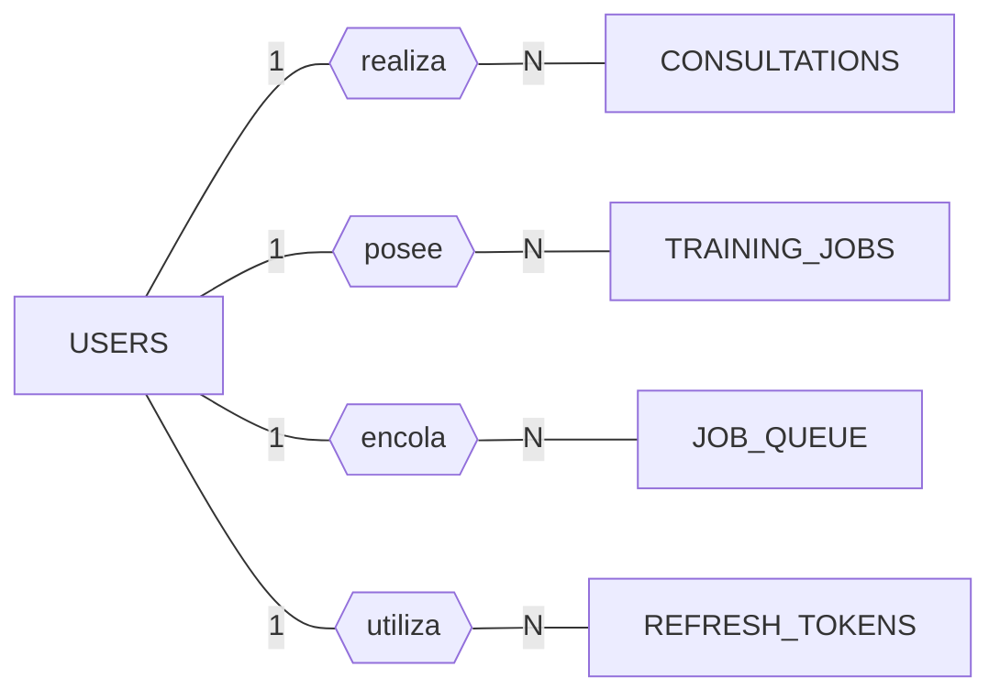
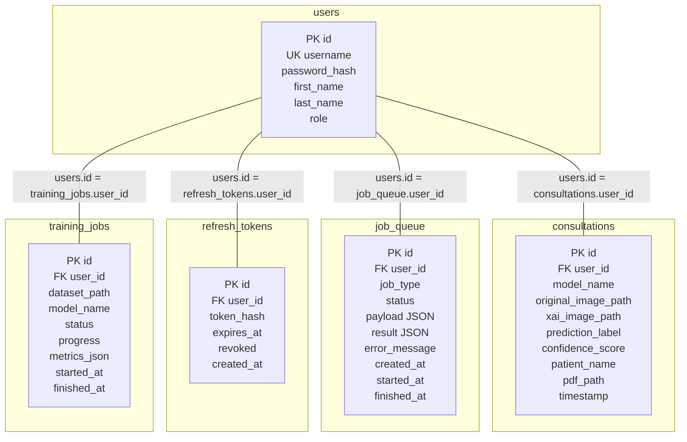

# Capítulo 19: Persistencia relacional y esquema de datos de vitalXAI

Este capítulo describe cómo vitalXAI conserva la información que produce y utiliza. El análisis del capítulo 14 identificó las entidades y relaciones desde una perspectiva conceptual, mientras que el diseño de los capítulos 17 y 18 fijó la arquitectura y los mecanismos de soporte. Aquí se concreta su representación física: tablas, columnas, tipos de datos, claves y restricciones. El objetivo es que el esquema pueda reproducirse, verificarse y evolucionar sin ambigüedades durante el proyecto.

La definición física también permite comprobar decisiones que, en el modelo conceptual, solo se expresan de forma abstracta. Las claves, restricciones y campos obligatorios muestran si las relaciones de propiedad y la integridad de los datos tienen respaldo en la base de datos. En vitalXAI esta comprobación debe considerar además los artefactos que se conservan fuera de las tablas.

El motor sobre el que se sustenta esta persistencia es MySQL, accedido desde la aplicación mediante `mysql-connector-python` y un pool de conexiones `MySQLConnectionPool` (Oracle, 2024). La definición efectiva del esquema se realiza con sentencias `CREATE TABLE IF NOT EXISTS` que la función `init_db()` ejecuta durante el arranque; no se emplea un ORM ni un sistema de migraciones versionadas. El archivo `agents/db/schema.sql` contiene una representación documental incompleta, ya que no incluye la tabla `job_queue`; por tanto, `database.py` es actualmente la fuente que crea el esquema utilizado por la aplicación. Esta forma de trabajar simplifica la puesta en marcha local, pero cualquier cambio posterior sobre las tablas deberá planificarse y comprobarse de forma independiente.

Conviene destacar, además, que el almacenamiento de vitalXAI no se limita a las tablas de MySQL. El sistema conserva en el sistema de ficheros los artefactos de mayor tamaño o de estructura variable, como las imágenes radiológicas, los mapas de explicabilidad, los informes en PDF y los resultados del laboratorio de entrenamiento, y las tablas guardan únicamente las rutas o referencias que permiten localizarlos. Esta separación entre datos relacionales y artefactos por fichero es una decisión de diseño deliberada, coherente con el subsistema de soporte SSOP-002 del capítulo 18, y condiciona de forma directa el procedimiento de copia y recuperación de la información. Una copia de seguridad que incluya solo la base de datos dejaría referencias a ficheros inexistentes; una que incluya solo los ficheros perdería la asociación con los usuarios y las consultas. El esquema físico debe entenderse, por tanto, como la parte relacional de un modelo de almacenamiento híbrido.

El presente capítulo se limita al esquema de persistencia y a su uso. El apartado 19.1 presenta los criterios de diseño que rigen el esquema, los diagramas que lo representan y la descripción detallada de cada una de las cinco tablas que lo componen, mediante fichas que recogen sus atributos, sus claves y sus restricciones. El apartado 19.2 describe cómo acceden los componentes del sistema a esa capa de persistencia, qué operaciones realiza cada uno y qué consideraciones de rendimiento y de concurrencia deben tenerse en cuenta. El acceso a los datos en su vertiente de infraestructura, incluida la configuración del pool, el ciclo de vida de las conexiones y la inicialización del esquema, se documenta en el capítulo 18 dentro del subsistema de soporte SSOP-001 y, por tanto, no se repite aquí más allá de lo necesario para contextualizar este capítulo.

## 19.1 Diseño del esquema de persistencia

No todas las entidades identificadas en el capítulo 14 se convierten en tablas. El almacenamiento de vitalXAI es híbrido: las cuentas, consultas, cola y tokens se conservan en MySQL, mientras que los resultados variables del laboratorio se guardan principalmente en el sistema de ficheros. El esquema contiene cinco tablas: `users`, `consultations`, `job_queue`, `refresh_tokens` y `training_jobs`. La diferencia con las once entidades conceptuales se debe a esta separación entre información estructurada y artefactos.

Antes de describir cada tabla, se fijan los criterios comunes del esquema. Estos criterios permiten interpretar las columnas y restricciones como decisiones relacionadas, no como reglas aisladas.

- **Identificadores enteros autoincrementales.** Cada tabla define su clave primaria como una columna `id` de tipo `INT` con la propiedad `AUTO_INCREMENT`, de modo que MySQL asigna el identificador al insertar una nueva fila (Oracle, 2024). En este proyecto se evita así generar identificadores desde la aplicación. La asignación automática impide valores repetidos dentro de una misma tabla, aunque no implica que la secuencia sea continua.

- **La cuenta de usuario como eje de propiedad relacional.** Las cuatro tablas dependientes de `users` incorporan una clave ajena `user_id` que apunta a `users.id`. Esta clave protege la propiedad de las consultas, los trabajos, los tokens y los entrenamientos representados en esas tablas. La base de datos garantiza la existencia de la cuenta referenciada, y la aplicación complementa esa garantía con las comprobaciones de propiedad y de rol que aplica en sus rutas. Las sesiones del laboratorio se conservan como carpetas y guardan el `user_id` en su configuración, pero no tienen una relación física con `users`.

- **Tipos de datos ajustados al contenido.** Las cadenas acotadas se declaran con `VARCHAR`, los valores numéricos con `INT` o `FLOAT`, las marcas temporales con `DATETIME` y los contenidos variables con `JSON` o `TEXT` (Oracle, 2024). En este proyecto, `FLOAT` se considera suficiente para los valores de confianza y progreso. El uso de `DATETIME` responde al alcance local del sistema y no pretende resolver las necesidades de un despliegue distribuido con zonas horarias.

- **Borrado de cuentas y datos dependientes.** Las relaciones de `job_queue`, `refresh_tokens` y `training_jobs` con `users` declaran `ON DELETE CASCADE`, pero la relación de `consultations` con `users` no define una acción de borrado. Por tanto, el borrado de una cuenta que todavía tiene consultas puede ser rechazado por la restricción de clave ajena. Esta decisión no debe justificarse por el flujo de eliminación de una consulta: la clave ajena determina qué ocurre cuando se elimina la cuenta propietaria. Además, los artefactos de consultas y las carpetas del laboratorio no se eliminan automáticamente mediante la base de datos. El comportamiento actual debe considerarse una limitación pendiente: cualquier evolución del borrado de cuentas deberá coordinar las filas relacionales con los ficheros y las carpetas asociadas.

- **Persistencia relacional y artefactos por fichero.** El esquema no pretende guardar en columnas los datos binarios ni la información variable del laboratorio. Las imágenes, los mapas, los informes y los resultados de entrenamiento se escriben en directorios del sistema de ficheros, y las tablas conservan las rutas que los referencian. Esta decisión mantiene las tablas ligeras y evita que el crecimiento de los artefactos degrade el rendimiento de las consultas, además de permitir que los artefactos se gestionen con las herramientas del sistema operativo. La contrapartida es que la reconstrucción completa de una consulta o de una sesión exige disponer tanto de la fila como de los ficheros referenciados, una dependencia que el procedimiento de copia de seguridad debe respetar.

- **Creación y evolución del esquema sin migraciones versionadas.** Las tablas se crean mediante `CREATE TABLE IF NOT EXISTS` durante el arranque. El código Python actúa, por tanto, como fuente efectiva de definición del esquema. Esta estrategia permite levantar una instalación nueva sin pasos manuales, pero no modifica tablas existentes; la evolución del esquema deberá gestionarse como un cambio de base de datos planificado y probado, sin atribuir a las sentencias de creación una capacidad de migración que no tienen. Este punto es especialmente relevante si se compara con otros proyectos que incorporan herramientas de migración desde el inicio: aquí esa complejidad se ha diferido deliberadamente, a la espera de que el volumen de datos o la frecuencia de los cambios lo justifiquen.

En cuanto a los índices, el esquema no declara índices adicionales explícitos. MySQL/InnoDB crea índices asociados a las claves primarias, las restricciones de unicidad y las claves ajenas (Oracle, 2024). En el volumen actual, estos índices cubren las consultas habituales, aunque no se ha documentado una medición mediante `EXPLAIN`. Si el volumen creciera, deberían valorarse índices sobre las columnas de fecha del historial o sobre el estado y tipo de los trabajos; estas optimizaciones quedan fuera de la implementación actual.

La correspondencia entre el modelo conceptual y el esquema físico merece una precisión adicional, porque es aquí donde se materializa la naturaleza híbrida del almacenamiento. De las once entidades del capítulo 14, Usuario se materializa en `users`; ConsultaDiagnostico en `consultations`; y TrabajoCola en `job_queue`. Los mapas de explicabilidad (MapaXAI) no tienen una tabla propia: se representan mediante la columna `xai_image_path` de `consultations`, que apunta al fichero generado, y su tipo de mapa no se almacena en una columna independiente. Las entidades del laboratorio, incluidas SesionExperimentacion, ModeloEntrenado, ResultadoModelo, ResultadoPliegue, ValidacionExterna, ResultadoValidacionExterna y ComparacionModelos, se conservan en el directorio `training_results`, organizadas por un identificador de sesión con formato `RUN_AAAAMMDD_HHMMSS`. Cada sesión se materializa como una carpeta que contiene la configuración del experimento, los modelos entrenados, sus métricas por pliegue y agregadas, sus análisis de explicabilidad, los resultados individuales de la validación externa y las comparaciones estadísticas cuando se han solicitado. La configuración de la sesión incluye el `user_id`, aunque la carpeta no tiene una clave ajena ni una relación física con `users`.

Esta decisión se justifica por la estructura variable de los artefactos experimentales. Un entrenamiento produce, para cada modelo y cada pliegue, métricas de validación cruzada, métricas de calibración, métricas de explicabilidad, curvas y mapas, cuya normalización en tablas exigiría un esquema mucho más complejo y rígido, desproporcionado para el alcance del proyecto. La persistencia por ficheros permite, en cambio, que cada nuevo resultado se almacene sin modificar el esquema, y que el laboratorio se gestione con las herramientas habituales del sistema de ficheros. El capítulo 14 describe las once entidades desde el punto de vista conceptual, y este capítulo describe las cinco tablas desde el punto de vista físico; ambos deben leerse de forma complementaria: el primero expresa el modelo de negocio y el segundo su materialización, con la salvedad explícita de que parte de ese modelo vive en los ficheros y no en la base de datos.

El diagrama entidad-relación de la figura 46 representa el esquema en notación Chen. Esta notación, propuesta por Peter Chen en su trabajo fundacional sobre el modelo entidad-relación, distingue visualmente los tres elementos fundamentales del modelo: las entidades se dibujan como rectángulos, las relaciones como rombos y los atributos como elipses, mientras que las cardinalidades se indican sobre las aristas que conectan las entidades con las relaciones (Chen, 1976; Elmasri & Navathe, 2016). La notación Chen resulta especialmente adecuada para presentar el modelo físico porque obliga a nombrar explícitamente las relaciones entre entidades, algo que otras notaciones más esquemáticas omiten en favor de la simple conexión entre tablas.

En el diagrama, la entidad `USERS` se sitúa como raíz del modelo y participa en cuatro relaciones de tipo uno a muchos con las tablas relacionales representadas. Un usuario puede realizar cero o muchas consultas de diagnóstico, poseer cero o muchos trabajos de entrenamiento, encolar cero o muchos trabajos asíncronos y disponer de cero o muchos tokens de refresco. Cada relación se materializa mediante la clave ajena `user_id` que incluyen las tablas correspondientes. Las sesiones y los resultados del laboratorio quedan fuera de este diagrama relacional porque se conservan como carpetas y artefactos del sistema de ficheros.

*Figura 46 - Diagrama entidad-relación del esquema de persistencia en notación Chen*

Conviene añadir una observación sobre el significado de estas cardinalidades en el contexto del sistema. Que un usuario «pueda» realizar muchas consultas o «pueda» poseer muchos trabajos no implica que deba tenerlos: el cero del extremo izquierdo de la cardinalidad indica que una cuenta puede existir sin consultas, sin trabajos, sin tokens o sin entrenamientos. Esta lectura es coherente con el flujo real de la plataforma, donde una cuenta recién registrada no tiene todavía actividad, y donde un usuario clínico puede limitarse a la interfaz de diagnóstico sin tocar nunca el laboratorio de entrenamiento. La flexibilidad que representan estas cardinalidades es, por tanto, una propiedad deseada del modelo y no una imprecisión.

El diagrama relacional de la figura 47 representa el esquema desde la perspectiva de las tablas y sus claves. A diferencia del anterior, que se centra en las entidades y sus relaciones conceptuales, el diagrama relacional destaca las columnas que actúan como clave primaria y como clave ajena, y la forma en que las tablas se conectan entre sí. Este diagrama es el que más se aproxima a la implementación real: cada caja corresponde a una tabla de MySQL y cada columna de la caja a una columna de esa tabla. Las entidades del laboratorio que se almacenan como ficheros no aparecen como tablas ni como relaciones físicas con `users`.

*Figura 47 - Diagrama relacional de tablas y claves de vitalXAI*

Una lectura detenida del diagrama relacional revela dos características que conviene resaltar. La primera es que `users` actúa como tabla raíz de las relaciones físicas: todas las conexiones de clave ajena parten de ella y ninguna tabla dependiente se conecta con otra distinta de `users`. Esta estructura radial refleja el principio de propiedad centralizada descrito en el apartado anterior. La segunda es que la cola de trabajos no mantiene conexiones físicas con las tablas de consultas ni con las sesiones de entrenamiento: su relación con esos procesos es lógica y se expresa mediante el `job_type` y el contenido del `payload`, no mediante una clave ajena. Esta distinción entre relaciones físicas y relaciones lógicas es fundamental para no atribuir a la base de datos restricciones que en realidad se aplican desde los servicios y el worker.

A continuación se describen, mediante una ficha por tabla, la estructura y las restricciones de cada una de las cinco tablas del esquema. Cada ficha indica el nombre, la descripción, los atributos con su tipo y su nulabilidad, la clave primaria, las claves ajenas, las claves únicas y las restricciones que le aplican. Los identificadores como `users_pkey` o `consultations_user_id_fkey` se utilizan aquí como etiquetas documentales: las sentencias actuales no declaran nombres explícitos para todas las restricciones y el nombre efectivo puede depender del motor. Tras cada ficha se incluye una breve discusión de las decisiones que la motivan y de las implicaciones de su uso en el sistema.

Nombre users

Descripción Almacena los datos de identidad de las cuentas registradas. Es la entidad central del modelo y el origen de las relaciones de propiedad del resto de tablas.

Atributos

| Campo | Tipo | Obligatorio | Descripción |
|---|---|---|---|
| Id | INT | S | Identificador interno de la cuenta. Clave primaria autoincremental. |
| Username | VARCHAR(255) | S | Identificador de acceso, validado como correo electrónico. |
| Password_hash | VARCHAR(255) | S | Hash de la contraseña generado con bcrypt. Nunca se almacena la contraseña en claro. |
| First_name | VARCHAR(255) | S | Nombre mostrado del usuario. |
| Last_name | VARCHAR(255) | S | Apellidos mostrados del usuario. |
| Role | VARCHAR(255) | S | Perfil de autorización de la cuenta (ordinario o admin). |

Clave primaria

| Nombre | Columnas | Secuencia |
|---|---|---|
| users_pkey | Id | Auto incremental de MySQL (AUTO_INCREMENT) |

Claves ajenas

| Nombre | Destino | Columnas |
|---|---|---|
| N/A | N/A | N/A |

Claves únicas

| Nombre | Columnas |
|---|---|
| users_username_key | Username |

Restricciones

| Nombre | Columnas | Restricción |
|---|---|---|
| users_username_unique | Username | Valor único: impide que dos cuentas compartan el mismo identificador de acceso. |
| users_role_check | Role | La aplicación debería restringir el rol a los valores ordinario y admin; el esquema no define un CHECK y el registro actual acepta el valor recibido del cliente. |

Tabla 52 - TB-01: users

La tabla `users` es la primera que se crea durante la inicialización del esquema, porque las restantes dependen de ella. La unicidad de `username` se aplica a nivel de base de datos y constituye la última barrera frente a cuentas duplicadas, incluso cuando dos peticiones de registro llegan de forma concurrente y la comprobación previa de disponibilidad realizada en la aplicación no es suficiente para descartar la colisión. Antes de insertar la cuenta, el router de autenticación valida el formato del identificador, que debe ser un correo electrónico, y comprueba que no existe ya una fila con ese valor; la restricción `UNIQUE` del esquema garantiza que, aun así, no se pueda crear una cuenta duplicada.

La columna `password_hash` conserva el resultado de aplicar la función de hash bcrypt a la contraseña, de modo que la contraseña original nunca queda almacenada, en coherencia con el requisito RNF-001. Esta decisión tiene una consecuencia operativa: la verificación de credenciales en el inicio de sesión se realiza siempre comparando el hash de la contraseña recibida con el hash almacenado, nunca recuperando una contraseña en claro. La columna `role` es interpretada por la aplicación al proteger las rutas administrativas mediante la comprobación `_require_admin()` descrita en el capítulo 17. Sin embargo, el endpoint de registro actual acepta el rol enviado por el cliente, por lo que la asignación inicial del perfil no queda restringida de forma segura. El esquema no introduce una tabla separada de roles ni una relación de muchos a muchos entre usuarios y permisos, decisión suficiente para el alcance actual, aunque un sistema con una matriz de permisos más compleja requeriría normalizarlos en tablas propias. La tabla tampoco incluye una columna de borrado lógico: la baja de una cuenta no forma parte del flujo funcional actual, y su posible incorporación futura debería plantearse de forma coordinada con el resto del esquema.

Nombre consultations

Descripción Almacena el historial de consultas de diagnóstico de los usuarios. Cada fila representa una consulta completada y las rutas de sus artefactos asociados.

Atributos

| Campo | Tipo | Obligatorio | Descripción |
|---|---|---|---|
| Id | INT | S | Identificador interno de la consulta. Clave primaria autoincremental. |
| User_id | INT | S | Cuenta propietaria de la consulta. Clave ajena a users. |
| Model_name | VARCHAR(100) | N | Arquitectura utilizada en el diagnóstico. |
| Original_image_path | VARCHAR(500) | N | Ruta de la imagen radiológica original. |
| Xai_image_path | VARCHAR(500) | N | Ruta del mapa de explicabilidad generado. |
| Prediction_label | VARCHAR(50) | N | Clasificación devuelta (PNEUMONIA o NORMAL). |
| Confidence_score | FLOAT | N | Confianza asociada a la predicción. |
| Patient_name | VARCHAR(255) | N | Nombre visible de organización de la consulta. |
| Pdf_path | VARCHAR(500) | N | Ruta del informe PDF generado. |
| Timestamp | DATETIME | N | Fecha y hora del registro, con valor por defecto CURRENT_TIMESTAMP. |

Clave primaria

| Nombre | Columnas | Secuencia |
|---|---|---|
| consultations_pkey | Id | Auto incremental de MySQL (AUTO_INCREMENT) |

Claves ajenas

| Nombre | Destino | Columnas |
|---|---|---|
| consultations_user_id_fkey | users | User_id |

Claves únicas

| Nombre | Columnas |
|---|---|
| N/A | N/A |

Restricciones

| Nombre | Columnas | Restricción |
|---|---|---|
| consultations_user_id_not_null | User_id | Valor no nulo: toda consulta debe asociarse a una cuenta válida. |
| consultations_prediction_label_check | Prediction_label | La aplicación restringe la etiqueta a PNEUMONIA o NORMAL; el esquema no define un CHECK. |

Tabla 53 - TB-02: consultations

Esta tabla se alimenta desde el worker de la cola cuando un diagnóstico termina: una vez obtenida la predicción y generados los artefactos de explicabilidad y el informe, el worker registra la consulta con sus metadatos y las rutas de los ficheros. De este modo, la presencia de una fila en `consultations` no significa que una imagen se haya subido, sino que el procesamiento asíncrono ha producido un resultado completo y persistente, listo para mostrarse en el historial. Esta distinción es esencial para interpretar correctamente el flujo de diagnóstico descrito en el capítulo 12: la consulta no se crea al subir la imagen, sino al finalizar el procesamiento.

Las columnas de rutas apuntan a los ficheros conservados en el sistema de ficheros, no a su contenido. Esto implica que reconstruir una consulta completa exige disponer tanto de la fila como de los ficheros referenciados: una copia de seguridad de MySQL sin los directorios correspondientes restauraría referencias incompletas. La separación entre metadatos y artefactos, ya anunciada como principio del esquema, encuentra aquí su aplicación más clara, porque cada consulta agrupa tres ficheros de naturaleza distinta: la imagen original, el mapa de explicabilidad y el informe PDF. La columna `confidence_score` se define como `FLOAT` para conservar la precisión del valor devuelto por el motor de inferencia, y `prediction_label` almacena la clasificación en texto.

La columna `patient_name` actúa como una etiqueta visible que el usuario puede renombrar para organizar su historial, y debe tratarse como un dato de presentación, no como una autorización para guardar identificadores personales del paciente. Esta distinción es coherente con el análisis de la normativa del capítulo 11, que exige trabajar con imágenes anonimizadas y asume que la verificación de la anonimización corresponde al responsable de la captura. El estado operativo del diagnóstico no reside en esta tabla: se conserva en `job_queue`, y la presencia de una fila aquí indica que el diagnóstico alcanzó la fase de persistencia del resultado. Esta separación de responsabilidades entre la cola y el historial evita duplicar el estado en dos tablas y mantiene cada una con una finalidad clara.

Nombre job_queue

Descripción Almacena los trabajos asíncronos de la plataforma, diagnósticos, entrenamientos y validaciones externas, con su tipo, su estado, sus parámetros y su resultado.

Atributos

| Campo | Tipo | Obligatorio | Descripción |
|---|---|---|---|
| Id | INT | S | Identificador interno del trabajo. Clave primaria autoincremental. |
| User_id | INT | S | Cuenta propietaria del trabajo. Clave ajena a users. |
| Job_type | VARCHAR(20) | S | Tipo de trabajo: diagnosis, training o external_validation. |
| Status | VARCHAR(20) | N | Estado del ciclo de vida, con valor por defecto queued. |
| Payload | JSON | N | Parámetros necesarios para ejecutar la tarea. |
| Result | JSON | N | Resultado serializado del trabajo. |
| Error_message | TEXT | N | Motivo de un fallo, si lo hubo. |
| Created_at | DATETIME | N | Fecha de encolado, con valor por defecto CURRENT_TIMESTAMP. |
| Started_at | DATETIME | N | Fecha de inicio de la ejecución. |
| Finished_at | DATETIME | N | Fecha de finalización o cancelación. |

Clave primaria

| Nombre | Columnas | Secuencia |
|---|---|---|
| job_queue_pkey | Id | Auto incremental de MySQL (AUTO_INCREMENT) |

Claves ajenas

| Nombre | Destino | Columnas |
|---|---|---|
| job_queue_user_id_fkey | users | User_id |

Claves únicas

| Nombre | Columnas |
|---|---|
| N/A | N/A |

Restricciones

| Nombre | Columnas | Restricción |
|---|---|---|
| job_queue_user_id_not_null | User_id | Valor no nulo: todo trabajo debe asociarse a una cuenta válida. |
| job_queue_job_type_check | Job_type | La aplicación restringe el tipo a diagnosis, training o external_validation; el esquema no define un CHECK. |
| job_queue_status_check | Status | La aplicación restringe el estado a queued, running, completed, failed o cancelled; el esquema no define un CHECK. |

Tabla 54 - TB-03: job_queue

La tabla `job_queue` es el soporte persistente de la ejecución asíncrona. Permite que el worker reclame y ejecute los trabajos, que el usuario consulte su progreso o los cancele, y que un reinicio del servidor vuelva a encolar las tareas que quedaron en marcha. A diferencia de una cola residente exclusivamente en memoria, esta tabla conserva el estado observable por el worker y por el usuario a través del router de cola; no garantiza por sí sola la recuperación idempotente ni la limpieza de artefactos parciales.

Las columnas de fecha reconstruyen la evolución temporal de cada trabajo: `created_at` indica cuándo se encoló, `started_at` cuándo comenzó la ejecución y `finished_at` cuándo terminó o se canceló. Esta trazabilidad temporal es útil para diagnosticar retrasos o fallos, y constituye la base sobre la que se describe el ciclo de vida de los trabajos en los capítulos 17 y 18. Las columnas `payload` y `result`, de tipo `JSON`, permiten guardar parámetros heterogéneos sin crear una columna por cada valor posible: el payload de un diagnóstico contiene la ruta de la imagen y la arquitectura; el de un entrenamiento, la sesión y los hiperparámetros; el de una validación externa, la sesión y el dataset externo. A cambio, su contenido debe validarse en la aplicación, ya que MySQL no conoce la estructura interna del documento.

La tabla se asocia al usuario mediante `user_id`, lo que permite que la consulta y la cancelación de trabajos se filtren por propietario. No obstante, no mantiene claves ajenas hacia `consultations` ni hacia las sesiones de entrenamiento: la relación entre un trabajo y su resultado es lógica y se expresa mediante el `job_type` y el contenido del `payload`. Esta decisión reduce el número de relaciones rígidas del esquema y evita acoplar la cola a las entidades que procesa, pero traslada al worker la responsabilidad de interpretar correctamente el contenido del payload y de coordinarse con la persistencia de los resultados.

Nombre refresh_tokens

Descripción Almacena las credenciales de refresco de las sesiones, con su hash, su expiración y su estado de revocación.

Atributos

| Campo | Tipo | Obligatorio | Descripción |
|---|---|---|---|
| Id | INT | S | Identificador interno del registro. Clave primaria autoincremental. |
| User_id | INT | S | Cuenta asociada al token. Clave ajena a users. |
| Token_hash | VARCHAR(255) | S | Hash del valor aleatorio del token. |
| Expires_at | DATETIME | S | Fecha y hora de caducidad del token. |
| Revoked | BOOLEAN | N | Indica si la credencial ha sido invalidada, con valor por defecto false. |
| Created_at | DATETIME | N | Fecha de creación, con valor por defecto CURRENT_TIMESTAMP. |

Clave primaria

| Nombre | Columnas | Secuencia |
|---|---|---|
| refresh_tokens_pkey | Id | Auto incremental de MySQL (AUTO_INCREMENT) |

Claves ajenas

| Nombre | Destino | Columnas |
|---|---|---|
| refresh_tokens_user_id_fkey | users | User_id |

Claves únicas

| Nombre | Columnas |
|---|---|
| N/A | N/A |

Restricciones

| Nombre | Columnas | Restricción |
|---|---|---|
| refresh_tokens_user_id_not_null | User_id | Valor no nulo: todo token debe asociarse a una cuenta válida. |
| refresh_tokens_token_hash_not_null | Token_hash | Valor no nulo: solo se persiste el hash del token, nunca su valor original. |
| refresh_tokens_expires_at_not_null | Expires_at | Valor no nulo: todo token debe declarar su fecha de caducidad. |

Tabla 55 - TB-04: refresh_tokens

La tabla `refresh_tokens` participa en el mecanismo de autenticación descrito en los capítulos 17 y 18, que articula la sesión mediante un token de acceso con expiración y un token de refresco de mayor duración. El valor original del token de refresco nunca llega a la base de datos; solo se conserva su hash, de modo que una exposición de los datos no comprometa directamente las sesiones. Esta decisión es coherente con el tratamiento que se da a las contraseñas en `users`: en ambos casos, el sistema persiste un valor derivado y no el secreto original.

Durante una renovación, el servicio de autenticación calcula el hash del valor recibido y busca una fila que coincida, no esté revocada y no haya caducado. La rotación del token invalida la fila anterior y crea una nueva con otro valor aleatorio, de modo que un mismo token de refresco no puede reutilizarse indefinidamente. Si se detecta el uso de un token revocado fuera del periodo de tolerancia, el servicio interpreta que la sesión puede haber sido comprometida y revoca todos los tokens del usuario, limitando el impacto de una posible exposición. La relación con `users` declara `ON DELETE CASCADE`, de modo que al eliminar la cuenta desaparecen sus credenciales de refresco, sin sustituir la revocación explícita que realiza el flujo de cierre de sesión.

Nombre training_jobs

Descripción Representación estructurada prevista de los trabajos de entrenamiento de modelos. Definida en el esquema como parte de la inicialización de la base de datos.

Atributos

| Campo | Tipo | Obligatorio | Descripción |
|---|---|---|---|
| Id | INT | S | Identificador interno del entrenamiento. Clave primaria autoincremental. |
| User_id | INT | S | Cuenta propietaria del entrenamiento. Clave ajena a users. |
| Dataset_path | VARCHAR(500) | N | Ruta del dataset utilizado. |
| Model_name | VARCHAR(100) | N | Arquitectura entrenada. |
| Status | VARCHAR(50) | N | Estado del entrenamiento, con valor por defecto In Progress. |
| Progress | FLOAT | N | Porcentaje de progreso, con valor por defecto 0.0. |
| Metrics_json | TEXT | N | Métricas serializadas del entrenamiento. |
| Started_at | DATETIME | N | Fecha de inicio, con valor por defecto CURRENT_TIMESTAMP. |
| Finished_at | DATETIME | N | Fecha de finalización. |

Clave primaria

| Nombre | Columnas | Secuencia |
|---|---|---|
| training_jobs_pkey | Id | Auto incremental de MySQL (AUTO_INCREMENT) |

Claves ajenas

| Nombre | Destino | Columnas |
|---|---|---|
| training_jobs_user_id_fkey | users | User_id |

Claves únicas

| Nombre | Columnas |
|---|---|
| N/A | N/A |

Restricciones

| Nombre | Columnas | Restricción |
|---|---|---|
| training_jobs_user_id_not_null | User_id | Valor no nulo: todo entrenamiento debe asociarse a una cuenta válida. |

Tabla 56 - TB-05: training_jobs

Esta ficha debe leerse con una salvedad importante, que conviene expresar con claridad para no inducir a error al lector de la memoria. La tabla `training_jobs` está definida en el esquema y se crea durante la inicialización, pero no se utiliza operativamente en la implementación actual: el flujo del laboratorio no inserta filas ni las consulta. La persistencia real del entrenamiento se realiza mediante el sistema de ficheros, en el directorio `training_results`, y el motor que lanza los entrenamientos (`mlops_engine.py`) no accede a la base de datos. Esta es, por tanto, una tabla que documenta la forma en que el proyecto previó conservar los entrenamientos, y que en la práctica quedó desplazada por la solución de persistencia por ficheros.

Existen restos de lógica de actualización sobre la tabla en `trainer_engine.py`, un módulo que no participa en el flujo productivo, y un volcado histórico de la base de datos contiene filas antiguas de entrenamientos, lo que sugiere un uso real en versiones previas del proyecto. En consecuencia, esta ficha la documenta como parte del esquema y señala su situación como recurso previsto o no utilizado en el flujo actual. Esta transparencia es preferible a ocultar la existencia de la tabla o a atribuirle un uso que el código no realiza, porque permite al lector y al evaluador comprender la evolución del diseño y las razones por las que se optó por la persistencia por ficheros para el laboratorio.

Los valores de los campos de dominio se validan en la capa de servicios y no mediante restricciones CHECK del esquema. El estado de la cola admite queued, running, completed, failed y cancelled; el tipo de trabajo admite diagnosis, training y external_validation; y la etiqueta de predicción admite PNEUMONIA y NORMAL. Esta decisión centraliza la lógica de validación en la aplicación y evita acoplar el esquema a la evolución de esos valores, de modo que añadir un nuevo tipo de trabajo o un nuevo estado no exige modificar la base de datos. Como contrapartida, el esquema no impide almacenar un valor no permitido si una consulta mal formada lo intentara; esa protección depende por completo de la corrección de la capa de servicios.

La consistencia del esquema se apoya en tres niveles que se complementan entre sí. En el primer nivel, MySQL aplica las claves primarias, las restricciones de obligatoriedad, la unicidad y las claves ajenas, garantizando la integridad estructural de los datos. En el segundo nivel, los routers y los servicios aplican la propiedad, los roles, los estados válidos y las comprobaciones de entrada, protegiendo el acceso a los datos. En el tercer nivel, el worker coordina la relación temporal entre un trabajo encolado, sus artefactos y su resultado, aunque la recuperación tras un reinicio y la limpieza de artefactos parciales requieren comprobaciones adicionales. Ninguno de estos niveles puede sustituir por completo a los demás: una clave ajena no decide si un usuario puede consultar un registro ajeno, y una comprobación de propiedad no corrige una fila sin usuario válido.

El esquema actual prioriza la trazabilidad directa con el código y la facilidad de puesta en marcha. Utiliza identificadores enteros, columnas JSON para parámetros variables y rutas de ficheros para los artefactos. Esta solución es suficiente para el alcance del TFG, pero tiene límites conocidos que conviene enunciar con precisión: no incorpora índices específicos para todas las consultas, no versiona automáticamente el esquema, no normaliza las métricas MLOps y no ofrece una entidad física que vincule cada fila de `job_queue` con una consulta o sesión concreta. Si el volumen de datos creciera, la evolución debería comenzar por los índices de las consultas frecuentes, una estrategia de migraciones versionadas y una política de retención para trabajos y tokens, conservando en todo caso la compatibilidad con los routers, el worker, las pruebas de integración y los documentos de diseño.

Con todo ello, el esquema queda alineado con el estado real del código. MySQL sostiene las entidades y los estados relacionales que necesitan consultas y relaciones; el sistema de ficheros conserva los artefactos grandes o variables; y la aplicación mantiene las reglas que no pueden expresarse solo con claves y tipos SQL. Esta combinación proporciona una persistencia suficiente para la implementación actual y deja identificados los puntos que deberán evolucionar si la plataforma requiere migraciones versionadas, mayor auditoría o una infraestructura distribuida. El apartado siguiente describe cómo se accede a esta capa de persistencia desde los componentes del sistema.

## 19.2 Acceso a la capa de persistencia

El esquema descrito en el apartado 19.1 define dónde y cómo se almacenan los datos, pero no basta con ello: es necesario fijar también la forma en que los componentes del sistema leen y escriben esa información, porque de esa forma dependen tanto la corrección del comportamiento como la capacidad de evolucionar el sistema sin romper lo existente. En vitalXAI, el acceso a la capa de persistencia no pasa por una capa intermedia de mapeo objeto-relacional ni por un patrón de repositorios que abstraiga las consultas en clases independientes. La aplicación trabaja directamente con SQL parametrizado sobre conexiones obtenidas del pool de `MySQLConnectionPool`, que el módulo `database.py` construye de forma diferida y entrega a través de la función `get_db_connection()`. Esta elección responde a la simplicidad y a la trazabilidad: el código que consulta la base de datos es explícito, y la relación entre una consulta y la tabla a la que accede es inmediata.

La configuración del pool, su ciclo de vida y el proceso de inicialización del esquema se describen con detalle en el capítulo 18 dentro del subsistema SSOP-001. Este apartado se centra, por tanto, en dos aspectos complementarios: cómo se distribuye el acceso a las tablas entre los componentes del sistema, y qué consecuencias tiene esa distribución para la concurrencia, el rendimiento y la integridad de los datos. Ambos aspectos son necesarios para comprender el esquema no solo como una estructura estática, sino como un recurso que la aplicación utiliza de forma continuada.

Esta forma de trabajo tiene dos consecuencias directas. La primera es que el acceso a la base de datos queda explícito: cada componente obtiene una conexión, ejecuta sus consultas y la cierra, sin una capa de repositorios que oculte dónde se realiza cada operación. La segunda es que la correspondencia entre el esquema y el código es fácil de localizar: cada tabla tiene componentes concretos que la leen o la escriben. La tabla 57 recoge esa correspondencia.

| Tabla | Operaciones principales | Componentes |
|---|---|---|
| `users` | Insertar cuenta, consultar credenciales y perfil, consultar rol. | `routers/auth.py`, `routers/admin.py`, `routers/history.py`, `routers/trainer.py`. |
| `consultations` | Insertar resultado de diagnóstico, consultar historial, renombrar y eliminar. | `services/queue_worker.py`, `routers/history.py`, `routers/admin.py`. |
| `job_queue` | Encolar trabajo, reclamarlo, actualizar su estado, cancelarlo. | `routers/inference.py`, `routers/trainer.py`, `services/queue_worker.py`, `routers/queue.py`. |
| `refresh_tokens` | Crear token, verificarlo, revocarlo. | `services/auth_service.py`, `routers/auth.py`. |
| `training_jobs` | Tabla prevista; sin acceso operativo en la implementación actual. | Ninguno (persistencia real por ficheros en `training_results`). |

*Tabla 57 - Distribución del acceso a las tablas del esquema*

La tabla anterior permite verificar que cada tabla tiene un responsable claro en la capa de aplicación, y que la lógica de negocio que rodea a cada entidad reside en los componentes que la utilizan. Por ejemplo, la escritura de `consultations` es competencia del worker de la cola, que la realiza al finalizar un diagnóstico, mientras que la lectura y la gestión del historial corresponden al router de historial y, en el ámbito administrativo, al router de administración. La cola de trabajos concentra la mayor diversidad de operaciones, porque es el punto de encuentro entre las peticiones que encolan tareas y el worker que las ejecuta. Esta separación evita que la responsabilidad sobre una misma tabla se disperse sin criterio y facilita localizar dónde se introduce o se modifica cada dato durante la depuración y el mantenimiento.

Todas las operaciones de acceso siguen un ciclo de vida similar. En una lectura, el componente obtiene una conexión del pool, crea un cursor normal o de diccionario según el formato de resultado que necesite, ejecuta una consulta parametrizada, procesa el resultado para transformarlo en la estructura requerida y cierra la conexión. En una escritura, la secuencia añade la confirmación explícita mediante `commit()` antes de cerrar. El uso de parámetros evita construir sentencias concatenando datos recibidos del usuario, una práctica recomendada para reducir el riesgo de inyección SQL (OWASP, 2024) y que debe mantenerse en todas las consultas de la aplicación.

Esta uniformidad tiene una implicación práctica sobre la concurrencia. Cada petición solicita una conexión del pool durante el tiempo necesario para su operación y la devuelve al finalizar, lo que limita el número de conexiones simultáneas al tamaño configurado en `DB_POOL_SIZE`. Las operaciones que combinan acceso a la base de datos con procesamiento costoso, como la generación de artefactos, la ejecución de un modelo o la espera de servicios externos, deben liberar la conexión antes de completar el cálculo. El worker respeta este principio: reclama un trabajo, ejecuta el procesamiento pesado fuera de la consulta y vuelve a la base de datos para actualizar el estado o persistir el resultado.

El aislamiento de datos entre usuarios se aplica de forma distinta según el medio de persistencia. Las consultas del historial y los trabajos de la cola filtran por el `user_id` obtenido de la sesión, de modo que un usuario no puede leer filas de otro aunque técnicamente la tabla las contenga. Las operaciones administrativas comprueban previamente el rol del actor. En cambio, las sesiones y los resultados del laboratorio se conservan en `training_results`; su configuración incluye `user_id`, pero las carpetas no tienen una columna ni una clave ajena que las vincule con `users`. El esquema físico no ofrece, por tanto, una garantía equivalente a la de las tablas relacionales. Esta es una excepción relevante a RF-005 y a OBJ-008 que debe valorarse en una evolución posterior mediante una asociación persistente entre la sesión y la cuenta.

En cuanto al rendimiento, el esquema se apoya en los índices asociados a las claves primarias, las restricciones de unicidad y las claves ajenas que crea MySQL/InnoDB (Oracle, 2024). Estos índices ayudan a las consultas habituales, que en su mayoría filtran por el identificador propio de cada tabla y por `user_id`, pero no se ha documentado una medición mediante `EXPLAIN`. La cola de trabajos accede por estado, tipo y fecha de encolado; si el volumen creciera, deberían valorarse índices adicionales sobre esas columnas y sobre las fechas del historial. La carga de los modelos de inferencia no es una operación de base de datos y no interviene en este apartado.

Conviene precisar, además, la relación entre el acceso a la base de datos y el acceso a los artefactos del sistema de ficheros. Cuando una consulta se completa, el worker escribe los ficheros en el sistema de ficheros y, a continuación, inserta en `consultations` las rutas que los referencian. La operación inversa, la lectura, recupera primero la fila y después entrega los ficheros desde las rutas almacenadas. Esta secuencia introduce una coordinación que debe ser correcta: si el fichero se genera pero la inserción falla, la fila no existe y el resultado no aparece en el historial; si la inserción se completa pero el fichero no llegó a escribirse, la fila quedaría referenciando un artefacto inexistente. El worker gestiona esta coordinación registrando el estado del trabajo y, en caso de error, dejando constancia en `job_queue` y evitando presentar como completada una consulta cuyos artefactos no están disponibles.

El acceso a la capa de persistencia queda, así, alineado con la naturaleza híbrida del almacenamiento descrita en el apartado 19.1. Las tablas conservan los datos estructurados que necesitan consultas y relaciones, y se accede a ellas mediante conexiones del pool y consultas parametrizadas; los artefactos grandes se escriben y se leen directamente en el sistema de ficheros, y la base de datos únicamente guarda las rutas que los referencian. Esta combinación mantiene la correspondencia entre el esquema físico y el código que lo utiliza, y deja identificadas las operaciones y los componentes responsables de cada tabla, de modo que la evolución del sistema pueda partir de un conocimiento preciso de dónde reside cada dato y de quién lo gestiona.
