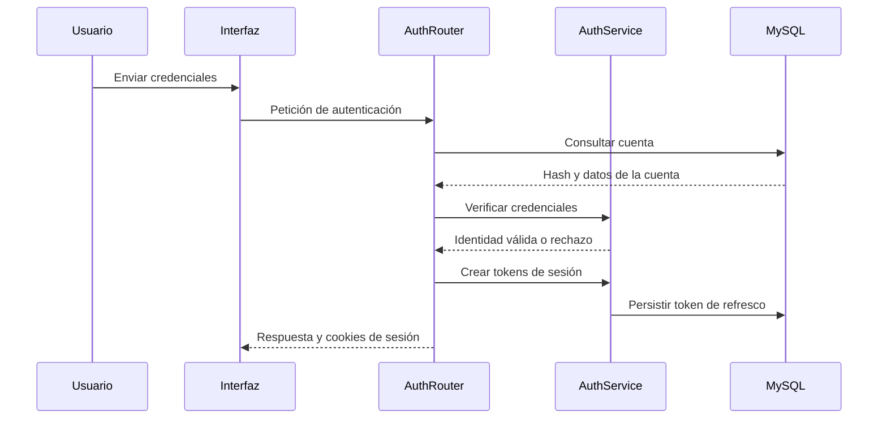
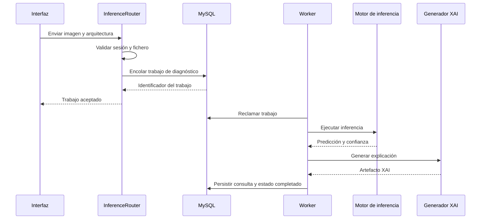
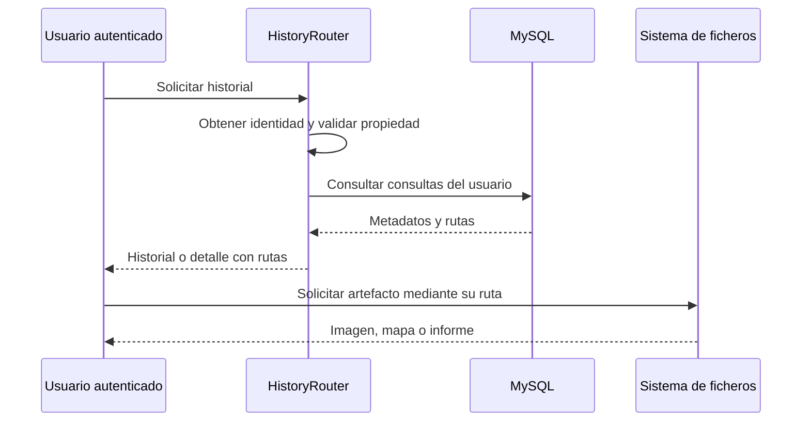
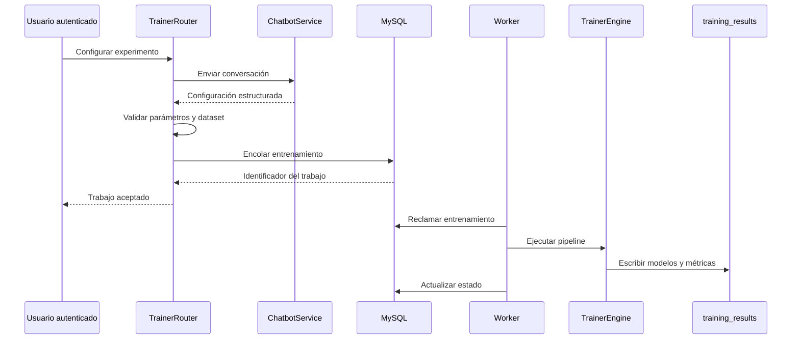
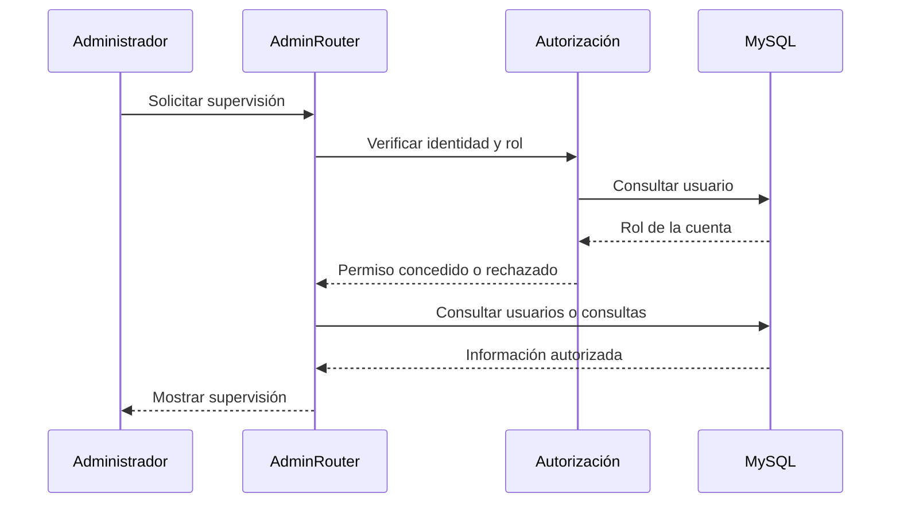
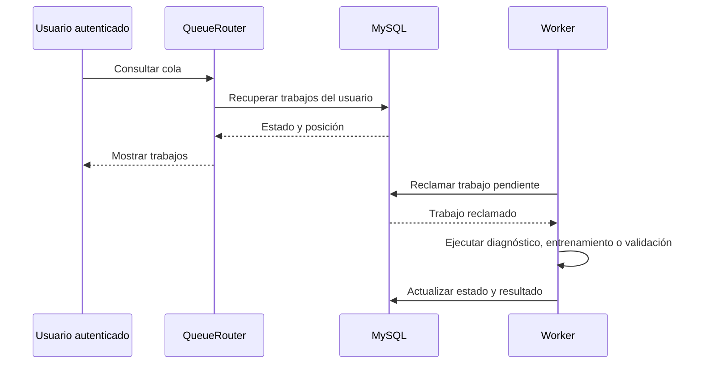

# Capítulo 20: Diseño de los casos de uso

El capítulo 12 define el comportamiento funcional de los casos de uso y el capítulo 14 muestra sus secuencias desde la perspectiva del análisis. Este capítulo no repite esas especificaciones. Su función es documentar cómo se materializan en la implementación: qué componentes colaboran, qué validaciones se aplican, cómo se persisten los datos y cómo se resuelven las operaciones asíncronas (Jacobson, Booch, & Rumbaugh, 1999; Larman, 2004).

La organización sigue los seis subsistemas de diseño del capítulo 17. Para cada subsistema se resume la correspondencia con los casos de uso, se indican las decisiones técnicas propias del diseño y se incluye un diagrama representativo de interacción entre componentes. Los flujos completos y sus variantes permanecen en el capítulo 12; las secuencias de análisis, en el capítulo 14; la arquitectura general, en el capítulo 17; y los mecanismos compartidos, en el capítulo 18.

## 20.1 SD-001: Acceso, identidad y gestión de sesiones

SD-001 materializa SS-001 y concentra la autenticación, la gestión de cuentas y el ciclo de vida de las sesiones. La especificación funcional de CU-001 a CU-004 se mantiene en el capítulo 12. En el diseño, estos casos se implementan mediante `routers/auth.py`, `services/auth_service.py`, la tabla `users`, la tabla `refresh_tokens` y los mecanismos transversales registrados en `main.py`.

| Casos de uso | Componentes principales | Decisiones de diseño |
|---|---|---|
| CU-001 Registrarse | `routers/auth.py`, `auth_service.py`, `users` | Validación de entradas, hash de contraseña, comprobación de unicidad del nombre de usuario y creación de la cuenta. |
| CU-002 Iniciar sesión | `routers/auth.py`, `auth_service.py`, `refresh_tokens` | Verificación de credenciales, emisión de tokens, cookies `HttpOnly` y `SameSite=Lax`, y límite de peticiones. |
| CU-003 Cerrar sesión | `routers/auth.py`, `auth_service.py`, `refresh_tokens` | Revocación del token de refresco y eliminación de las cookies de sesión. |
| CU-004 Cambiar idioma | `services/lang.py`, recursos JavaScript | Preferencia compartida entre cliente y servidor, con español como idioma de respaldo. |

El diseño separa la recepción HTTP de la gestión de credenciales. El router valida y traduce la petición, mientras que el servicio concentra el hash, la emisión, la rotación y la revocación de tokens. La autorización administrativa se resuelve en SD-005 mediante el rol obtenido desde la identidad establecida por SD-001.

## 20.2 SD-002: Diagnóstico asistido y resultados

SD-002 materializa SS-002 y cubre CU-005 a CU-010 y CU-037. El capítulo 12 describe el flujo clínico; aquí solo se fijan las decisiones técnicas que lo materializan.

| Casos de uso | Componentes principales | Decisiones de diseño |
|---|---|---|
| CU-005 a CU-007 | `routers/inference.py`, interfaz de diagnóstico | Validación de sesión, tipo MIME y tamaño de imagen, y selección de arquitectura. La validación del contenido real de la imagen permanece pendiente. |
| CU-008 | `routers/inference.py`, `job_queue`, `queue_worker.py` | La petición valida y encola el trabajo sin ejecutar la inferencia dentro del ciclo HTTP. |
| CU-009 y CU-010 | `ml_engine.py`, `xai_generator.py`, `consultations` | El resultado y los artefactos se generan en segundo plano y se recuperan desde la consulta persistida. |
| CU-037 | `pdf_generator.py`, `consultations` | El informe se genera a partir de los datos y artefactos de la consulta en curso, antes de insertar su fila persistida. |

El router conserva la imagen y crea un trabajo con la arquitectura, la ruta del fichero y el idioma. El worker ejecuta la inferencia, genera los mapas de explicabilidad y el informe, y registra las rutas en `consultations`. La interfaz consulta posteriormente el estado y muestra el resultado cuando el trabajo termina.

## 20.3 SD-003: Historial y gestión de consultas

SD-003 materializa SS-003 y cubre CU-011 a CU-014. El comportamiento de consulta, detalle, renombrado y eliminación se especifica en el capítulo 12. El diseño concentra estas operaciones en `routers/history.py` y en la tabla `consultations`.

| Casos de uso | Componentes principales | Decisiones de diseño |
|---|---|---|
| CU-011 y CU-012 | `routers/history.py`, `consultations` | Filtrado por `user_id` y recuperación de los artefactos referenciados. |
| CU-013 | `routers/history.py`, `consultations` | Actualización únicamente del nombre visible de la consulta propia. |
| CU-014 | `routers/history.py`, `consultations` | Comprobación de propiedad y eliminación de la fila de consulta. Los artefactos asociados pueden permanecer en el sistema de ficheros. |

El historial no vuelve a ejecutar el modelo. Recupera los metadatos y las rutas de los ficheros ya generados. La función de comprobación de propiedad se aplica antes de consultar, modificar o eliminar una consulta, con la excepción administrativa definida en el análisis. La eliminación actual afecta a la fila de `consultations`, pero no borra explícitamente la imagen, el mapa XAI ni el informe del sistema de ficheros. La descarga posterior utiliza las rutas estáticas montadas por la aplicación, que no aplican una comprobación de propiedad equivalente a la del router.

## 20.4 SD-004: Laboratorio de experimentación MLOps

SD-004 materializa SS-004 y cubre CU-015 a CU-030 y CU-039. El capítulo 12 define las interacciones del laboratorio y el capítulo 17 describe sus servicios. El diseño se limita a concretar la colaboración entre esos servicios y la persistencia híbrida.

| Casos de uso | Componentes principales | Decisiones de diseño |
|---|---|---|
| CU-015 a CU-017 | `routers/trainer.py`, `chatbot_service.py`, selección de datasets | La configuración se valida antes de crear una sesión. La restricción de la ruta al directorio permitido está prevista, pero pendiente de implementación. |
| CU-018 y CU-039 | `routers/trainer.py`, `job_queue`, `queue_worker.py` | El entrenamiento se encola. La limitación de trabajos simultáneos y pendientes corresponde a un comportamiento previsto, todavía no implementado. |
| CU-019 a CU-024 | `mlops_engine.py`, `training_results` | Las sesiones, resultados y comparativas se recuperan desde los artefactos disponibles. |
| CU-025 | `routers/trainer.py`, `mlops_engine.py`, `training_results` | El análisis XAI se ejecuta directamente mediante el servicio del laboratorio. |
| CU-026 y CU-027 | `routers/trainer.py`, `mlops_engine.py`, `queue_worker.py`, `training_results` | La validación externa se encola y sus resultados se recuperan desde los artefactos disponibles. |
| CU-028 a CU-030 | `pdf_generator_mlops.py`, `mlops_engine.py`, `training_results` | Los informes, renombrados y eliminaciones operan sobre la sesión y sus artefactos. |

La configuración conversacional y la ejecución del entrenamiento son responsabilidades separadas. El asistente devuelve una configuración estructurada, el router valida sus parámetros y el worker ejecuta el trabajo. Los resultados del laboratorio se conservan en `training_results`; la configuración de cada sesión incluye `user_id`, pero las carpetas no tienen una relación relacional con `users`, tal como se documenta en los capítulos 14, 17, 18 y 19.

## 20.5 SD-005: Supervisión y administración

SD-005 materializa SS-005 y cubre CU-031 a CU-033 y CU-038. Las operaciones de supervisión se restringen al rol de administrador y se implementan principalmente en `routers/admin.py`; la gestión de cuentas de CU-038 permanece prevista, pero no está implementada.

| Casos de uso | Componentes principales | Decisiones de diseño |
|---|---|---|
| CU-031 | `routers/admin.py`, `users`, `consultations` | Comprobación de rol antes de consultar el listado global. |
| CU-032 y CU-033 | `routers/admin.py`, `consultations`, `training_results` | Consulta supervisada de la actividad de una cuenta sin modificar sus resultados. |
| CU-038 | `routers/admin.py`, `users` | Gestión prevista de cuentas, con las limitaciones de persistencia documentadas; no está implementada en el prototipo actual. |

La función `_require_admin()` centraliza la comprobación del rol. SD-005 reutiliza la identidad de SD-001 y las estructuras de persistencia existentes, pero no sustituye la auditoría administrativa exigida por `RNF-006`, que permanece pendiente.

## 20.6 SD-006: Cola de trabajos y capacidades transversales

SD-006 materializa SS-006 y cubre CU-034 a CU-036. La cola compartida coordina diagnósticos, entrenamientos y validaciones externas. La consulta de trabajos, su cancelación y las preferencias de interfaz se mantienen separadas de los subsistemas que producen los trabajos.

| Casos de uso | Componentes principales | Decisiones de diseño |
|---|---|---|
| CU-034 | `routers/queue.py`, `job_queue` | Consulta filtrada por usuario y cálculo de posición de los trabajos pendientes. |
| CU-035 | `routers/queue.py`, `job_queue` | Cancelación condicional de trabajos que todavía están pendientes. |
| CU-036 | `services/lang.py`, JavaScript y recursos estáticos | Cambio de tema e idioma sin recargar ni perder el estado de navegación. |

`queue_worker.py` reclama los trabajos mediante una actualización condicional, ejecuta el flujo correspondiente y actualiza su estado. La cola no mantiene claves ajenas hacia los resultados que procesa: la relación con consultas y sesiones se conserva mediante el tipo y el contenido del trabajo. Esta decisión se describe con más detalle en los capítulos 17 y 19.

## 20.7 Cierre del diseño de los casos de uso

El capítulo 20 concreta la transición entre el comportamiento especificado y los componentes que lo implementan. El capítulo 12 sigue siendo la referencia principal de los casos de uso y el capítulo 14 la del comportamiento de análisis. Las tablas de este capítulo permiten localizar la decisión técnica asociada a cada grupo de casos sin duplicar sus flujos completos. Los capítulos 17, 18 y 23 completan la descripción de la arquitectura, el soporte y la construcción real.
