# Capítulo 20: Diseño de los casos de uso

El diseño de los casos de uso constituye la etapa de la parte de diseño en la que las interacciones descritas en el capítulo 12 dejan de ser especificaciones de comportamiento y se convierten en decisiones técnicas concretas de implementación. El análisis explica qué debe hacer el sistema desde la perspectiva del usuario, mientras que el diseño de los casos de uso determina cómo lo hace internamente: qué componentes participan, qué servicios invocan, qué validaciones aplican, qué operaciones de persistencia realizan y cómo se comunican con la interfaz. Este capítulo recoge esas determinaciones para cada uno de los casos de uso de vitalXAI, de modo que la transición del análisis al código quede documentada de forma inequívoca y que un futuro mantenedor pueda localizar con rapidez dónde y cómo se materializa cada interacción (Jacobson, Booch, & Rumbaugh, 1999; Larman, 2004).

El capítulo se organiza siguiendo la misma estructura de subsistemas de diseño definida en el capítulo 17. Cada subsistema de diseño (SD-001 a SD-006) agrupa los casos de uso que comparten una responsabilidad funcional común, de acuerdo con la correspondencia establecida entre los subsistemas de análisis y los casos de uso en los capítulos 13 y 15. Para cada subsistema se presentan tres elementos: el diagrama de casos de uso, que reproduce la estructura de interacciones del análisis; los casos de uso reales, que recogen las decisiones técnicas de diseño de cada interacción; y los diagramas de interacción entre objetos, que muestran cómo colaboran los componentes del sistema para llevar a cabo los flujos más significativos de cada subsistema. Esta estructura es coherente con la organización que el propio diseño adoptó para los subsistemas y facilita la lectura transversal de la parte de diseño de la memoria.

El contenido de este capítulo se apoya en dos fuentes complementarias. Por un lado, las especificaciones de los casos de uso del capítulo 12, que definen el comportamiento observable y las condiciones que deben cumplirse. Por otro lado, la arquitectura de los subsistemas de diseño del capítulo 17 y los mecanismos de soporte del capítulo 18, que fijan los componentes, los servicios y las infraestructuras disponibles para materializar ese comportamiento. El diseño de cada caso de uso no introduce funcionalidades nuevas ni contradice el análisis: concreta, con las decisiones técnicas del proyecto, aquello que el análisis ya declaró, y lo hace de forma coherente con la implementación descrita en los capítulos precedentes.

## 20.1 Subsistema de diseño SD-001: Acceso, identidad y gestión de sesiones

El subsistema SD-001 materializa el subsistema de análisis SS-001 y se ocupa de controlar el acceso a la plataforma y de gestionar la identidad de los usuarios registrados. Cubre el registro de nuevas cuentas, el inicio y el cierre de sesión, la renovación de credenciales y la identificación del usuario en las áreas privadas. Su responsabilidad no se limita a validar el formulario de acceso: establece la identidad que utilizarán el resto de los subsistemas para aplicar el aislamiento de datos entre cuentas y las comprobaciones de rol, por lo que constituye una condición transversal para el funcionamiento de SD-002, SD-003, SD-004, SD-005 y SD-006. Esta característica, ya señalada en el capítulo 17, explica que los demás subsistemas no reproduzcan la lógica de autenticación, sino que consuman la identidad que SD-001 establece.

El subsistema se apoya principalmente en `routers/auth.py`, que sirve las páginas de acceso y procesa los formularios recibidos desde la interfaz, y en `services/auth_service.py`, que concentra la lógica criptográfica y el ciclo de vida de las credenciales. Junto a ellos intervienen los mecanismos transversales registrados en `main.py`, como la protección CSRF, las cabeceras de seguridad y la limitación del endpoint de inicio de sesión. Los detalles de su arquitectura y de las decisiones de implementación se describen con profundidad en el capítulo 17; aquí se presentan, en los apartados siguientes, el diagrama de casos de uso del subsistema, los casos de uso reales con sus determinaciones técnicas y los diagramas de interacción entre objetos. Los casos de uso que agrupa son CU-001 a CU-004, tal y como se estableció en la especificación del capítulo 12 y en la correspondencia del capítulo 13.

### 20.1.1 Diagrama de casos de uso del subsistema

El diagrama de casos de uso de SD-001 recoge las cuatro interacciones que el subsistema pone a disposición de los actores y es el mismo que se definió en el análisis para el módulo de gestión del acceso y de la cuenta, adaptado aquí al ámbito del subsistema de diseño. Dos de las interacciones —la creación de la cuenta (CU-001) y el inicio de sesión (CU-002)— las realiza el visitante, que accede a la plataforma sin autenticarse; el cierre de sesión (CU-003) lo realiza el usuario autenticado; y el cambio del idioma de la interfaz (CU-004) está disponible tanto para el visitante como para el usuario autenticado, porque el idioma puede adaptarse desde el área pública y desde el área privada. El diagrama se representa a continuación.

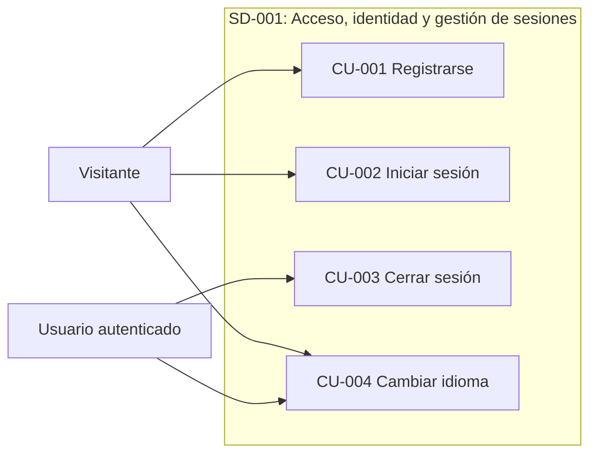
```mermaid
flowchart LR
    subgraph SD001["SD-001: Acceso, identidad y gestión de sesiones"]
        CU1["CU-001 Registrarse"]
        CU2["CU-002 Iniciar sesión"]
        CU3["CU-003 Cerrar sesión"]
        CU4["CU-004 Cambiar idioma"]
    end
    V["Visitante"] --> CU1
    V --> CU2
    V --> CU4
    U["Usuario autenticado"] --> CU3
    U --> CU4
```

*Figura 49 - Diagrama de casos de uso del subsistema SD-001*

El diagrama distingue dos actores, en coherencia con la definición de actores del sistema del capítulo 12 (Jacobson, Booch, & Rumbaugh, 1999; Cockburn, 2001). El visitante representa a toda persona que accede sin haber iniciado sesión, y sus interacciones se limitan al registro, al inicio de sesión y al cambio de idioma. El usuario autenticado representa a todos los perfiles con cuenta registrada, incluido el administrador, porque las operaciones de gobierno de este último se recogen en el subsistema SD-005 y no en este diagrama. Esta decisión, ya adoptada en el análisis, evita que el administrador aparezca como un actor diferenciado en un subsistema donde no desempeña ninguna operación específica, y mantiene la coherencia entre el ámbito de SD-001 y el ámbito de SD-005.

Los cuatro casos de uso se representan como interacciones directas e independientes del actor con el sistema. No existe una relación de inclusión entre ellos, porque ninguno incorpora pasos obligatorios definidos por otro caso de uso, ni una relación de extensión, porque ninguno amplía de forma opcional el flujo de otro. La creación de la cuenta y el inicio de sesión comparten la necesidad de una identidad, pero se modelan por separado: el registro crea la identidad y el acceso la valida, sin que el segundo dependa del primero en la misma sesión. Esta estructura, idéntica a la del análisis, se mantiene en el diseño porque el flujo real de la plataforma no introduce relaciones nuevas entre estos casos de uso, y porque cada uno de ellos se implementa como un flujo propio e independiente en el subsistema.

Desde la perspectiva del diseño, el diagrama refleja una característica relevante del subsistema SD-001: actúa como puerta de entrada al resto de la plataforma, pero sus casos de uso no invocan servicios de otros subsistemas. Cuando el visitante se registra o inicia sesión, el subsistema opera exclusivamente sobre la tabla de usuarios y sobre las credenciales de sesión; cuando el usuario autenticado cierra sesión, revoca sus credenciales y elimina las cookies. El resto de los subsistemas consumen la identidad resultante mediante el mecanismo común de identificación descrito en el capítulo 18, pero no participan en estos flujos. Esta separación mantiene la cohesión del subsistema y facilita que las decisiones técnicas de SD-001 se describan de forma aislada en los apartados siguientes, sin dependencias circulares con el resto de la plataforma.

### 20.1.2 Casos de uso reales del subsistema

Los casos de uso reales concretan cada interacción del diagrama en decisiones técnicas de implementación: qué componentes del subsistema intervienen, qué validaciones aplican, qué operaciones de persistencia realizan, qué respuesta devuelven al cliente y qué medidas de seguridad incorporan. Cada caso de uso real corresponde a un caso de uso del análisis y no añade funcionalidades nuevas, pero sí precisa determinaciones que el análisis dejaba abiertas, como el algoritmo de cifrado, el formato de las credenciales o los códigos de respuesta. Los cuatro casos de uso reales de SD-001 se describen a continuación.

#### CU-001 Registrarse

El registro se materializa en el endpoint `POST /api/register` del router `routers/auth.py`, que procesa los datos del formulario y traduce el flujo del análisis en una secuencia de validaciones y operaciones sobre la tabla `users`. El diseño mantiene la puerta de entrada autónoma del análisis: el alta no requiere la intervención de un administrador, y el proceso completo se resuelve en una única petición. Las decisiones técnicas del caso de uso real son las siguientes:

- **Validación de formato**: la función `_validate_register_inputs()` comprueba el nombre de usuario mediante una expresión regular de correo electrónico, exige una contraseña de al menos 8 caracteres y la presencia de nombre y apellidos. Ante cualquier incumplimiento, el sistema responde HTTP 400 con el código `validation_error` e indica el campo afectado, sin crear el registro.
- **Comprobación de unicidad**: antes de insertar, el sistema ejecuta una consulta de existencia sobre el nombre de usuario (`SELECT id FROM users WHERE username = %s`). Si el usuario ya está registrado, responde HTTP 400 con el código `user_exists` y abandona el proceso.
- **Cifrado de la contraseña**: la contraseña se convierte con `hash_password()` de `services/auth_service.py`, que aplica el algoritmo bcrypt con un salt generado en cada operación. La contraseña original no se transmite a ningún componente de persistencia tras completarse el hash, en coherencia con la postcondición del análisis de que nunca quede en texto plano.
- **Persistencia**: la cuenta se almacena mediante `INSERT INTO users (username, password_hash, first_name, last_name, role)`, que materializa la creación del registro con el rol indicado en el formulario.
- **Sesión tras el registro**: una vez creada la cuenta, el sistema genera el token de acceso y el token de refresco y los establece en las mismas cookies de sesión que el inicio de sesión, de modo que el visitante que acaba de registrarse accede directamente al panel. Esta determinación, que el análisis no fijaba —preveía redirigir al inicio de sesión—, se adopta en el diseño para eliminar un paso redundante al usuario que acaba de crear su cuenta.
- **Gestión de errores**: si la operación de persistencia falla, el sistema responde HTTP 500 con el código `server_error`, de modo que un fallo interno no se confunde con una condición de validación del formulario.

#### CU-002 Iniciar sesión

El inicio de sesión se materializa en el endpoint `POST /login`, protegido con la limitación `@limiter.limit("5/minute")` del mecanismo `slowapi`. El diseño conserva la protección descrita en el análisis: la verificación no distingue entre nombre de usuario y contraseña incorrectos, y el límite de peticiones bloquea temporalmente los intentos reiterados desde una misma dirección. Las decisiones técnicas del caso de uso real son las siguientes:

- **Verificación de credenciales**: el sistema recupera el registro mediante `SELECT id, password_hash FROM users WHERE username = %s` y comprueba la contraseña con `verify_password()`, que compara el valor introducido contra el hash almacenado con `bcrypt.checkpw`. Si la verificación falla, responde con una redirección a la página de inicio con un mensaje genérico que no revela qué parte de las credenciales era incorrecta.
- **Token de acceso**: `create_access_token()` de `services/auth_service.py` firma un JWT con el algoritmo HS256 que contiene el identificador del usuario (`sub`) y su fecha de expiración (`exp`), utilizando la clave `JWT_SECRET_KEY` del entorno y la duración `JWT_ACCESS_EXPIRE_MINUTES`.
- **Token de refresco**: `create_refresh_token()` genera un valor aleatorio mediante `secrets.token_urlsafe`, y en la tabla `refresh_tokens` solo se conserva su hash SHA-256 junto con el identificador del usuario, la fecha de expiración y el indicador de revocación. Esta decisión permite renovar la sesión sin guardar una credencial reutilizable en texto plano.
- **Cookies de sesión**: el token de acceso se establece en una cookie `HttpOnly` con `SameSite=Lax`, y el token de refresco en una cookie `HttpOnly` con `SameSite=Lax` y ruta restringida a `/api/token/refresh`. La restricción de ruta limita el envío del token de refresco al único endpoint que debe consumirlo.
- **Renovación de la sesión**: el endpoint `POST /api/token/refresh` ejecuta `rotate_refresh_token()`, que verifica el token actual, revoca el anterior y emite uno nuevo junto con un token de acceso renovado. El parámetro `REFRESH_ROTATION_GRACE_SECONDS` (60 segundos por defecto) tolera las peticiones concurrentes de renovación, y el uso de un token revocado fuera de ese periodo de gracia se interpreta como un posible robo: el servicio invalida todos los tokens del usuario.
- **Respuesta al cliente**: si las credenciales son válidas, el sistema redirige con HTTP 303 al panel de diagnóstico; el propio registro de la sesión se completa en el navegador mediante las cookies.

#### CU-003 Cerrar sesión

El cierre de sesión se materializa en el endpoint `GET /logout`, y su diseño refleja la doble naturaleza de las credenciales de sesión: el token de refresco se revoca de forma definitiva en la base de datos, mientras que el token de acceso se descarta del navegador y caduca por sí mismo. Las decisiones técnicas del caso de uso real son las siguientes:

- **Revocación del token de refresco**: si existe una cookie de refresco, el sistema ejecuta `revoke_refresh_token()`, que actualiza la fila correspondiente de `refresh_tokens` marcando el indicador de revocación. A partir de ese momento, el endpoint de renovación rechaza el token, por lo que la sesión no puede prolongarse.
- **Eliminación de cookies**: el sistema elimina del navegador tanto la cookie del token de acceso como la del token de refresco, con la ruta restringida correspondiente, mediante las operaciones de borrado de cookies de la respuesta.
- **Respuesta al cliente**: el sistema redirige con HTTP 303 a la página de inicio de sesión. El acceso a las áreas privadas queda bloqueado de inmediato porque el token de refresco ya no es válido y el token de acceso, aunque aún no haya expirado, no se conserva en el navegador.

#### CU-004 Cambiar el idioma de la interfaz

El cambio de idioma se materializa en el selector de idioma que está presente tanto en las páginas públicas (inicio de sesión y registro) como en las privadas (panel de diagnóstico y laboratorio de entrenamiento), y combina un mecanismo de cliente con un servicio de traducciones del lado del servidor. El diseño conserva las postcondiciones del análisis: la preferencia persiste durante la sesión y el cambio no interrumpe el estado de navegación. Las decisiones técnicas del caso de uso real son las siguientes:

- **Selección en el navegador**: el script `static/js/i18n.js`, mediante la función `changeLanguage()`, lee el idioma elegido en el selector, lo guarda en `localStorage['appLang']` y actualiza dinámicamente los textos de la interfaz marcados con `data-i18n`, sin recargar la página. Esta decisión hace que el cambio sea inmediato y preserve el estado de la vista actual.
- **Servicio de traducciones del servidor**: `services/lang.py` centraliza el diccionario de mensajes que genera el backend. La función `get_lang_from_cookie()` lee la cookie `appLang`, valida que el idioma esté dentro del conjunto permitido —español, inglés, chino e hindú— y utiliza el español como valor por defecto si la preferencia es inválida o está ausente.
- **Aplicación en los resultados generados**: los servicios que producen contenido traducible leen la misma cookie para alinear sus salidas con el idioma de la interfaz: las etiquetas de predicción del motor de diagnóstico, los títulos de los mapas de explicabilidad, los textos del informe PDF y los mensajes del asistente conversacional. De este modo, el idioma seleccionado por el actor se aplica de forma coherente en toda la plataforma.
- **Coherencia entre cliente y servidor**: el mecanismo separa la responsabilidad de la presentación, que pertenece al navegador, de la de los mensajes generados por el backend, que se resuelven con el diccionario de `services/lang.py`; ambos consultan la misma preferencia de idioma, lo que evita que la interfaz muestre un idioma distinto del que utiliza el sistema en sus respuestas.

### 20.1.3 Diagramas de interacción entre objetos

Los diagramas de interacción muestran cómo colaboran los componentes del subsistema para realizar cada caso de uso real. Siguiendo la notación de los diagramas de secuencia del UML (Larman, 2004), se representan los participantes reales del diseño —la interfaz del navegador, el router `routers/auth.py`, el servicio `services/auth_service.py` y la base de datos MySQL—, los mensajes que intercambian en el tiempo y las alternativas que se resuelven durante cada flujo. Las cajas de activación indican el periodo en que cada participante ejecuta una operación, y los bloques alternativos reflejan las decisiones condicionales descritas en los casos de uso reales. Los diagramas son fieles a la implementación: cada mensaje corresponde a una invocación real de los componentes, de modo que la secuencia puede contrastarse directamente con el código. La numeración automática de los mensajes facilita la correspondencia entre el diagrama y los pasos de cada flujo.

#### CU-001 Registrarse

El diagrama de la figura 50 muestra el flujo completo del registro. La interfaz envía los datos del formulario al router, que ejecuta la validación de formato y, según su resultado, responde con el error correspondiente o continúa con la comprobación de unicidad. Si el usuario no existe, el router encarga al servicio el cálculo del hash con bcrypt, inserta el registro en la tabla `users` y, a continuación, solicita la creación de los dos tokens de sesión; el servicio conserva en la base de datos solo el hash del token de refresco. El flujo culmina con la respuesta de éxito y el establecimiento de las dos cookies, lo que materializa la decisión de diseño de que el visitante quede autenticado al completar el registro. Las respuestas de error se mantienen diferenciadas: la validación de formato devuelve el campo afectado, mientras que la existencia previa devuelve la condición de duplicidad, lo que permite a la interfaz mostrar mensajes precisos sin revelar información sensible.

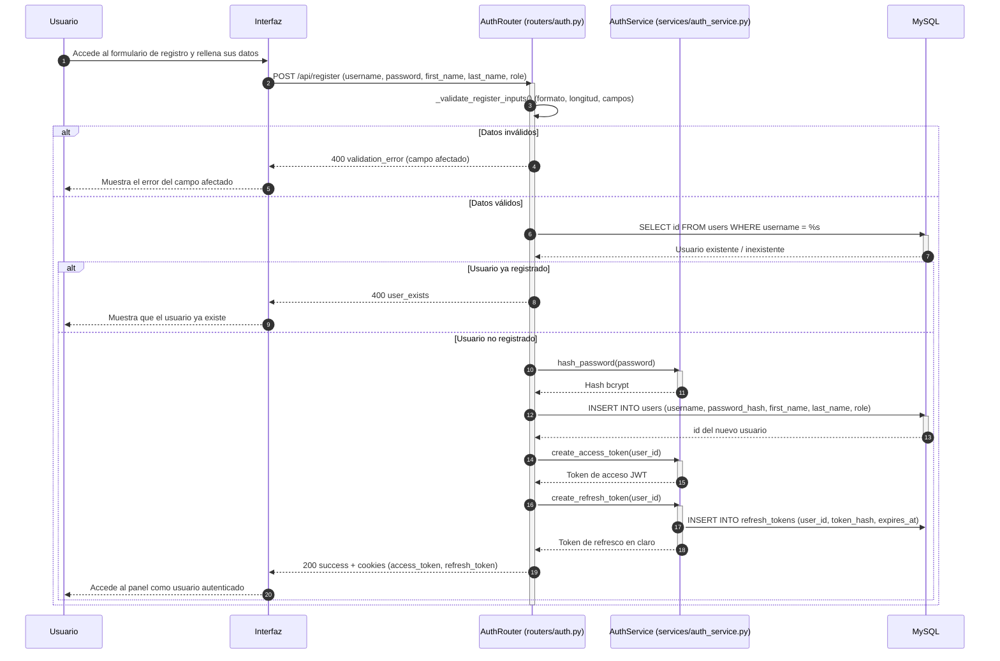
```mermaid
sequenceDiagram
    autonumber
    participant U as Usuario
    participant I as Interfaz
    participant R as AuthRouter (routers/auth.py)
    participant S as AuthService (services/auth_service.py)
    participant BD as MySQL

    U->>I: Accede al formulario de registro y rellena sus datos
    I->>R: POST /api/register (username, password, first_name, last_name, role)
    activate R
    R->>R: _validate_register_inputs() (formato, longitud, campos)
    alt Datos inválidos
        R-->>I: 400 validation_error (campo afectado)
        I-->>U: Muestra el error del campo afectado
    else Datos válidos
        R->>BD: SELECT id FROM users WHERE username = %s
        activate BD
        BD-->>R: Usuario existente / inexistente
        deactivate BD
        alt Usuario ya registrado
            R-->>I: 400 user_exists
            I-->>U: Muestra que el usuario ya existe
        else Usuario no registrado
            R->>S: hash_password(password)
            activate S
            S-->>R: Hash bcrypt
            deactivate S
            R->>BD: INSERT INTO users (username, password_hash, first_name, last_name, role)
            activate BD
            BD-->>R: id del nuevo usuario
            deactivate BD
            R->>S: create_access_token(user_id)
            activate S
            S-->>R: Token de acceso JWT
            deactivate S
            R->>S: create_refresh_token(user_id)
            activate S
            S->>BD: INSERT INTO refresh_tokens (user_id, token_hash, expires_at)
            S-->>R: Token de refresco en claro
            deactivate S
            R-->>I: 200 success + cookies (access_token, refresh_token)
            I-->>U: Accede al panel como usuario autenticado
        end
    end
    deactivate R
```

*Figura 50 - Diagrama de secuencia del CU-001 Registrarse*

#### CU-002 Iniciar sesión

El diagrama de la figura 51 muestra el inicio de sesión. El router recupera el registro del usuario, y las dos alternativas que se suceden —usuario inexistente y contraseña incorrecta— responden con el mismo mensaje genérico, sin revelar qué parte de las credenciales falló, en coherencia con el análisis. Cuando la verificación con `bcrypt.checkpw` es correcta, el servicio genera el token de acceso y el token de refresco, y el router establece las cookies y redirige al panel. La secuencia refleja la separación de responsabilidades: el router se ocupa de la orquestación y de la respuesta HTTP, mientras que el servicio concentra la verificación criptográfica y la generación de las credenciales. El límite de peticiones del endpoint, aplicado por `slowapi` antes de procesar la solicitud, no se representa en el diagrama porque es una condición transversal que actúa en el punto de entrada del flujo.

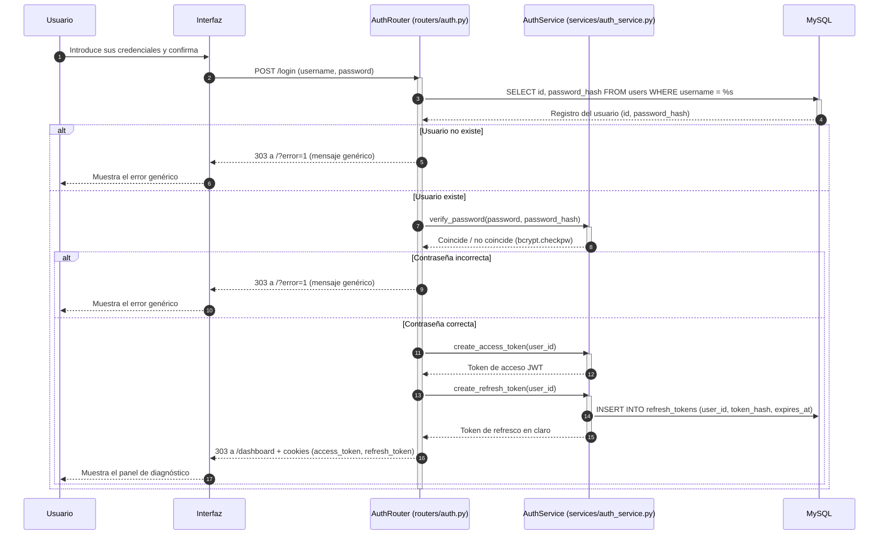
```mermaid
sequenceDiagram
    autonumber
    participant U as Usuario
    participant I as Interfaz
    participant R as AuthRouter (routers/auth.py)
    participant S as AuthService (services/auth_service.py)
    participant BD as MySQL

    U->>I: Introduce sus credenciales y confirma
    I->>R: POST /login (username, password)
    activate R
    R->>BD: SELECT id, password_hash FROM users WHERE username = %s
    activate BD
    BD-->>R: Registro del usuario (id, password_hash)
    deactivate BD
    alt Usuario no existe
        R-->>I: 303 a /?error=1 (mensaje genérico)
        I-->>U: Muestra el error genérico
    else Usuario existe
        R->>S: verify_password(password, password_hash)
        activate S
        S-->>R: Coincide / no coincide (bcrypt.checkpw)
        deactivate S
        alt Contraseña incorrecta
            R-->>I: 303 a /?error=1 (mensaje genérico)
            I-->>U: Muestra el error genérico
        else Contraseña correcta
            R->>S: create_access_token(user_id)
            activate S
            S-->>R: Token de acceso JWT
            deactivate S
            R->>S: create_refresh_token(user_id)
            activate S
            S->>BD: INSERT INTO refresh_tokens (user_id, token_hash, expires_at)
            S-->>R: Token de refresco en claro
            deactivate S
            R-->>I: 303 a /dashboard + cookies (access_token, refresh_token)
            I-->>U: Muestra el panel de diagnóstico
        end
    end
    deactivate R
```

*Figura 51 - Diagrama de secuencia del CU-002 Iniciar sesión*

El mecanismo de renovación de la sesión, que complementa al CU-002 y permite prolongar la sesión sin que el usuario vuelva a introducir sus credenciales, se muestra en la figura 52. Se activa cuando el token de acceso se acerca a su expiración: la interfaz envía el token de refresco al endpoint de rotación, y el servicio verifica su estado en la base de datos. Si el token está activo o fue revocado dentro del periodo de gracia, el servicio revoca el anterior, emite uno nuevo y lo devuelve; si fue revocado fuera del periodo de gracia, el sistema interpreta un posible robo de sesión y revoca todos los tokens del usuario, respondiendo la rotación como inválida. El diseño tolera así las renovaciones concurrentes sin tratar cada repetición como un ataque, pero invalida la sesión completa ante el uso real de una credencial revocada. Si la rotación es válida, el router emite un nuevo token de acceso y renueva las dos cookies; en caso contrario, responde con HTTP 401.

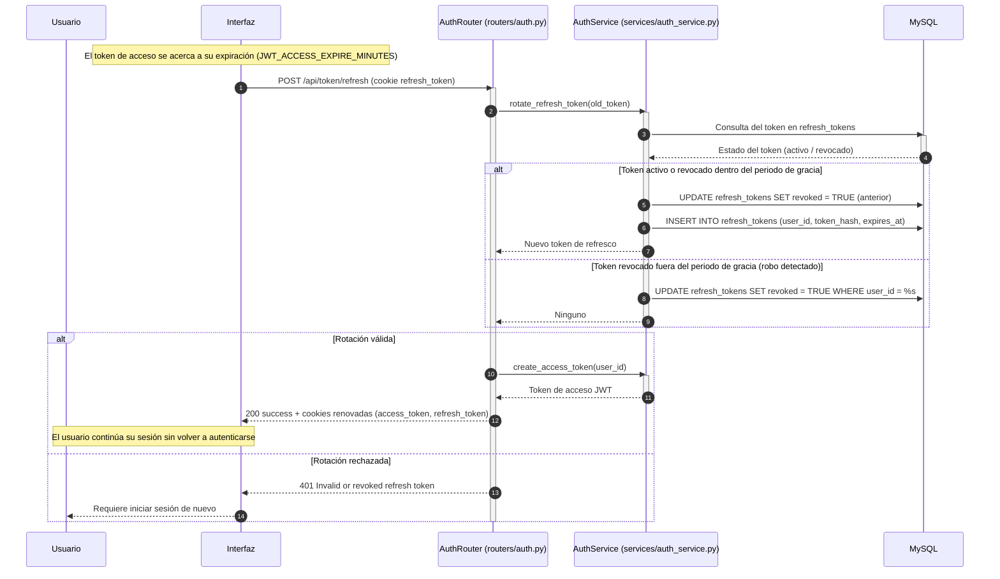
```mermaid
sequenceDiagram
    autonumber
    participant U as Usuario
    participant I as Interfaz
    participant R as AuthRouter (routers/auth.py)
    participant S as AuthService (services/auth_service.py)
    participant BD as MySQL

    Note over I: El token de acceso se acerca a su expiración (JWT_ACCESS_EXPIRE_MINUTES)
    I->>R: POST /api/token/refresh (cookie refresh_token)
    activate R
    R->>S: rotate_refresh_token(old_token)
    activate S
    S->>BD: Consulta del token en refresh_tokens
    activate BD
    BD-->>S: Estado del token (activo / revocado)
    deactivate BD
    alt Token activo o revocado dentro del periodo de gracia
        S->>BD: UPDATE refresh_tokens SET revoked = TRUE (anterior)
        S->>BD: INSERT INTO refresh_tokens (user_id, token_hash, expires_at)
        S-->>R: Nuevo token de refresco
    else Token revocado fuera del periodo de gracia (robo detectado)
        S->>BD: UPDATE refresh_tokens SET revoked = TRUE WHERE user_id = %s
        S-->>R: Ninguno
    end
    deactivate S
    alt Rotación válida
        R->>S: create_access_token(user_id)
        activate S
        S-->>R: Token de acceso JWT
        deactivate S
        R-->>I: 200 success + cookies renovadas (access_token, refresh_token)
        Note over U,I: El usuario continúa su sesión sin volver a autenticarse
    else Rotación rechazada
        R-->>I: 401 Invalid or revoked refresh token
        I-->>U: Requiere iniciar sesión de nuevo
    end
    deactivate R
```

*Figura 52 - Diagrama de secuencia de la renovación de la sesión*

#### CU-003 Cerrar sesión

El diagrama de la figura 53 muestra el cierre de sesión. El router solicita al servicio la revocación del token de refresco, que marca la fila correspondiente en la tabla `refresh_tokens`, y a continuación elimina las dos cookies de la respuesta y redirige a la página de inicio de sesión. La secuencia refleja la doble naturaleza de las credenciales: la revocación en la base de datos impide prolongar la sesión mediante la rotación, mientras que el borrado de las cookies descarta el token de acceso, que al ser un JWT autónomo no se puede revocar directamente y debe retirarse del navegador. La condición del diagrama cubre el caso en que no exista cookie de refresco —por ejemplo, una sesión sin rotación previa—, en cuyo caso la revocación se omite y la operación se limita al borrado de las cookies.

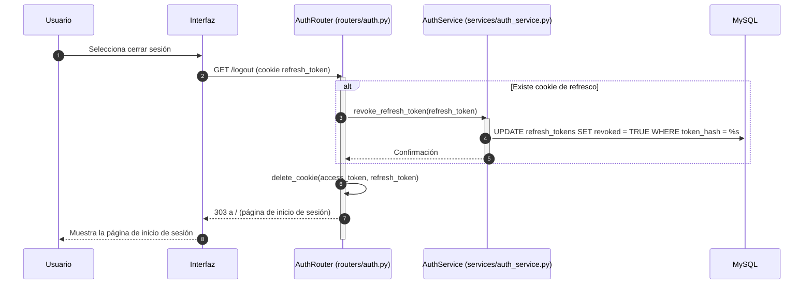
```mermaid
sequenceDiagram
    autonumber
    participant U as Usuario
    participant I as Interfaz
    participant R as AuthRouter (routers/auth.py)
    participant S as AuthService (services/auth_service.py)
    participant BD as MySQL

    U->>I: Selecciona cerrar sesión
    I->>R: GET /logout (cookie refresh_token)
    activate R
    alt Existe cookie de refresco
        R->>S: revoke_refresh_token(refresh_token)
        activate S
        S->>BD: UPDATE refresh_tokens SET revoked = TRUE WHERE token_hash = %s
        S-->>R: Confirmación
        deactivate S
    end
    R->>R: delete_cookie(access_token, refresh_token)
    R-->>I: 303 a / (página de inicio de sesión)
    I-->>U: Muestra la página de inicio de sesión
    deactivate R
```

*Figura 53 - Diagrama de secuencia del CU-003 Cerrar sesión*

#### CU-004 Cambiar el idioma de la interfaz

El diagrama de la figura 54 muestra el cambio de idioma. En el navegador, el script `i18n.js` lee la opción seleccionada, la guarda como preferencia y actualiza los textos de la interfaz sin recargar la página; este tramo se representa con auto-mensajes porque no interviene el servidor. En el tramo del servidor, los routers y servicios consultan al `LangService` el idioma aplicable mediante `get_lang_from_cookie()`, que valida la preferencia contra el conjunto permitido de idiomas y aplica el español por defecto cuando la preferencia es inválida o está ausente. La secuencia muestra la separación entre la presentación, que se resuelve en el navegador, y los mensajes generados por el backend, que se traducen con el diccionario centralizado de `services/lang.py`, de modo que las salidas del sistema —mensajes de error, etiquetas de predicción, títulos de los mapas de explicabilidad, informes PDF y mensajes del asistente— se mantienen alineadas con el idioma elegido por el actor.

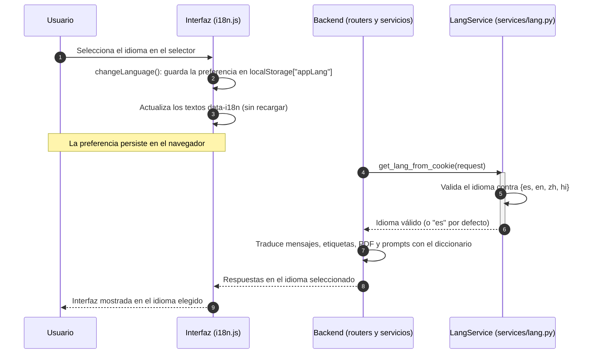
```mermaid
sequenceDiagram
    autonumber
    participant U as Usuario
    participant I as Interfaz (i18n.js)
    participant B as Backend (routers y servicios)
    participant L as LangService (services/lang.py)

    U->>I: Selecciona el idioma en el selector
    I->>I: changeLanguage(): guarda la preferencia en localStorage["appLang"]
    I->>I: Actualiza los textos data-i18n (sin recargar)
    Note over U,I: La preferencia persiste en el navegador
    B->>L: get_lang_from_cookie(request)
    activate L
    L->>L: Valida el idioma contra {es, en, zh, hi}
    L-->>B: Idioma válido (o "es" por defecto)
    deactivate L
    B->>B: Traduce mensajes, etiquetas, PDF y prompts con el diccionario
    B-->>I: Respuestas en el idioma seleccionado
    I-->>U: Interfaz mostrada en el idioma elegido
```

*Figura 54 - Diagrama de secuencia del CU-004 Cambiar el idioma de la interfaz*

## 20.2 Subsistema de diseño SD-002: Diagnóstico asistido y generación de resultados

El subsistema SD-002 corresponde al subsistema de análisis SS-002 y concentra el flujo clínico de la plataforma. Su función es recibir una imagen válida, asociarla al usuario autenticado, registrar una solicitud de diagnóstico, ejecutar la inferencia con la arquitectura seleccionada y conservar los artefactos que permiten consultar y justificar el resultado. Agrupa los casos de uso CU-005 a CU-010 y CU-037, que materializan el ciclo completo de una consulta clínica: el acceso al panel, la subida de la radiografía, la selección de la arquitectura, la solicitud del diagnóstico, la visualización del resultado y de los mapas de explicabilidad, y la generación del informe PDF. La gestión del historial de consultas (CU-011 a CU-014) no pertenece a este subsistema, sino a SD-003, que se describe en el apartado siguiente.

El subsistema se apoya en `routers/inference.py`, que actúa como fachada HTTP, y en un conjunto de servicios que se ejecutan fuera del ciclo de la petición: `services/ml_engine.py`, que prepara la imagen y produce la etiqueta y la confianza; `services/xai_generator.py`, que genera el mapa de explicabilidad adecuado al modelo; y `services/pdf_generator.py`, que construye el informe descargable. La ejecución de la inferencia se delega en la cola de trabajos y en su worker, que procesa el diagnóstico en segundo plano y persiste el resultado en la tabla `consultations`, de modo que la interfaz permanece operativa durante el análisis (RNF-020). El router, por tanto, no carga el modelo ni ejecuta la predicción: valida la petición, conserva la imagen y crea el registro de trabajo con un payload serializable que solo contiene el modelo, la ruta de la imagen y el idioma.

SD-002 participa en el sistema con tres dependencias claras. Se apoya en SD-001 para obtener la identidad del usuario a través del mecanismo común de identificación; utiliza la cola de trabajos del subsistema de ejecución asíncrona (SD-006) para procesar los diagnósticos sin bloquear la interfaz; y entrega a SD-003 los registros de `consultations` que este último consulta en el historial. Además, actúa como frontera de validación de ficheros: el tipo MIME y el tamaño se comprueban antes de escribir en disco, mientras que la validez científica de la imagen y la interpretación clínica del resultado quedan fuera del ámbito del subsistema, que no sustituye la valoración del profesional sanitario.

### 20.2.1 Diagrama de casos de uso del subsistema

El diagrama de casos de uso de SD-002 recoge las siete interacciones que el subsistema pone a disposición del usuario autenticado, y es una adaptación del diagrama del módulo de interfaz de diagnóstico asistido definido en el análisis (figura 4). Se conservan únicamente los casos de uso del flujo clínico y del informe (CU-005 a CU-010 y CU-037), porque la gestión del historial (CU-011 a CU-014) pertenece a SD-003 y se representa en su propio diagrama. El diagrama no dibuja relaciones de extensión entre estos casos de uso: la cadena de navegación por la que el informe se genera desde el detalle de una consulta cruza la frontera del subsistema —CU-037 extiende CU-012, que pertenece a SD-003—, por lo que esa relación se describe en el texto y se refleja en los diagramas de interacción de ambos subsistemas. El diagrama se representa a continuación.

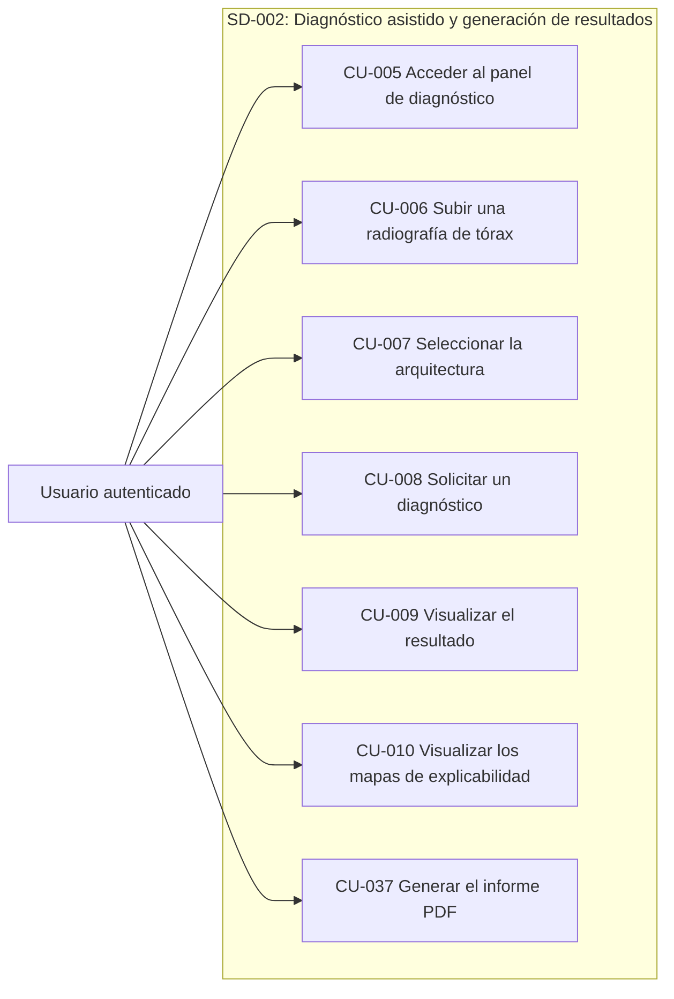
```mermaid
flowchart LR
    subgraph SD002["SD-002: Diagnóstico asistido y generación de resultados"]
        CU5["CU-005 Acceder al panel de diagnóstico"]
        CU6["CU-006 Subir una radiografía de tórax"]
        CU7["CU-007 Seleccionar la arquitectura"]
        CU8["CU-008 Solicitar un diagnóstico"]
        CU9["CU-009 Visualizar el resultado"]
        CU10["CU-010 Visualizar los mapas de explicabilidad"]
        CU37["CU-037 Generar el informe PDF"]
    end
    U["Usuario autenticado"] --> CU5
    U --> CU6
    U --> CU7
    U --> CU8
    U --> CU9
    U --> CU10
    U --> CU37
```

*Figura 55 - Diagrama de casos de uso del subsistema SD-002*

El diagrama distingue un único actor, el usuario autenticado, que reúne a todos los profesionales con cuenta registrada. El administrador no aparece como actor diferenciado porque sus operaciones de supervisión sobre las consultas se recogen en el subsistema SD-005. Los siete casos de uso se representan como interacciones directas e independientes del actor con el sistema. La subida de la imagen (CU-006), la selección de la arquitectura (CU-007) y la solicitud del diagnóstico (CU-008) forman la cadena de entrada del flujo clínico; la visualización del resultado (CU-009) y de los mapas de explicabilidad (CU-010) constituyen su salida; y el informe PDF (CU-037) su materialización documental. Los casos de uso CU-006, CU-007 y CU-008 se representan por separado, como en el análisis, aunque en la implementación se procesan en una única petición HTTP, tal y como se detalla en el apartado siguiente.

### 20.2.2 Casos de uso reales del subsistema

Los casos de uso reales de SD-002 concretan cada interacción del diagrama en decisiones técnicas de implementación. A diferencia de SD-001, cuyos flujos son síncronos, la mayor parte de este subsistema se organiza en torno al procesamiento asíncrono: la validación y el encolado se resuelven en el ciclo HTTP, mientras que la predicción, la generación de los mapas y del informe se ejecutan en el worker. Cada caso de uso real se describe a continuación, indicando los componentes que intervienen, las validaciones, las operaciones de persistencia y las respuestas al cliente.

#### CU-005 Acceder al panel de diagnóstico

El acceso al panel se materializa en el endpoint `GET /dashboard` del router `routers/auth.py`, que es la puerta de entrada al entorno clínico de la plataforma. El diseño aplica la condición transversal de SD-001: solo el usuario con una sesión válida alcanza el panel, y cualquier intento sin sesión se redirige al punto de entrada del sistema. Las decisiones técnicas del caso de uso real son las siguientes:

- **Verificación de la sesión**: el router obtiene el identificador del usuario mediante `get_user_id_from_token()` de SD-001, a partir de la cookie `access_token`. Si no hay sesión, responde con una redirección HTTP 303 a la página de inicio de sesión.
- **Carga del perfil**: con el identificador resuelto, se consultan el nombre y el rol del usuario en la tabla `users`, de modo que el panel se personaliza con el nombre completo y con el indicador de administrador cuando corresponde.
- **Control de caché**: la respuesta del panel incluye las cabeceras `Cache-Control: no-store`, que impiden que el navegador o los intermediarios sirvan la página privada desde caché tras un cierre de sesión.

#### CU-006 Subir una radiografía de tórax

La subida de la radiografía se materializa en la selección del archivo desde el panel de diagnóstico y en la validación que el router realiza al recibir el formulario. El diseño mantiene una doble frontera: la interfaz descarta de forma temprana los archivos claramente no válidos, y el router vuelve a comprobar el tipo y el tamaño antes de escribir nada en disco. Las decisiones técnicas del caso de uso real son las siguientes:

- **Selección del archivo**: la zona de carga del panel (`file-input`) permite adjuntar el fichero, y la interfaz habilita el envío únicamente cuando hay una imagen seleccionada.
- **Validación del tipo MIME**: el router comprueba que `file.content_type` pertenezca al conjunto permitido `{image/jpeg, image/png, image/jpg}`. Ante cualquier otro tipo, responde HTTP 400 con el mensaje de solo imágenes, sin escribir el fichero.
- **Validación del tamaño**: el router mide el archivo y rechaza con HTTP 400 los que superen los 10 MB, en coherencia con el límite declarado en el análisis.
- **Conservación de la imagen**: el fichero se guarda en el área `static/uploads` con un nombre basado en la fecha y hora de la recepción, lo que evita colisiones y no depende del nombre original del archivo.
- **Integración con la solicitud**: la imagen se envía en el mismo formulario que la solicitud del diagnóstico (CU-008), de modo que subida y solicitud se materializan en una única petición `POST /predict`.

#### CU-007 Seleccionar la arquitectura para el diagnóstico

La selección de la arquitectura se materializa en el selector de modelos del panel, que presenta las arquitecturas disponibles del proyecto —arquitecturas convolucionales como InceptionV3 o Xception y arquitecturas Transformer como DeiT, Swin y ViT—. El diseño reparte la responsabilidad de la selección entre la interfaz y el motor de aprendizaje, sin duplicar la lista de modelos en el router. Las decisiones técnicas del caso de uso real son las siguientes:

- **Elección en el panel**: el usuario elige la arquitectura en `model-selector` y el identificador del modelo viaja como campo del formulario de la solicitud (`model_name`).
- **Validación diferida**: el router no comprueba el modelo contra una lista, porque esa verificación pertenece al motor de inferencia: si los pesos de la arquitectura no existen, el worker marca el trabajo como fallido con un mensaje claro. Esta decisión evita mantener la lista de modelos en dos capas distintas.
- **Reutilización de modelos en memoria**: el motor conserva los modelos cargados en un diccionario global, de modo que la primera consulta con una arquitectura asume el coste de cargar los pesos, mientras que las posteriores reutilizan el modelo en memoria (RNF-019). Esta optimización pertenece al motor y no al router.

#### CU-008 Solicitar un diagnóstico

La solicitud del diagnóstico se materializa en el endpoint `POST /predict` de `routers/inference.py`, que traduce la petición del usuario en la creación de un trabajo de la cola. El diseño sigue el orden del análisis —validar, encolar y notificar—, pero traslada la ejecución de la inferencia al worker para que la interfaz no se bloquee. Las decisiones técnicas del caso de uso real son las siguientes:

- **Autenticación**: el router resuelve la identidad con SD-001 y responde HTTP 401 con el mensaje de no autenticado si no hay sesión válida.
- **Validación antes de encolar**: el tipo MIME y el tamaño se comprueban antes de crear el trabajo, de modo que una petición inválida no ocupa una posición en la cola y no consume recursos del worker.
- **Conservación de la imagen**: la imagen se guarda en `static/uploads` y la ruta resultante se incorpora al payload del trabajo.
- **Encolado**: se inserta un registro en `job_queue` con el tipo `diagnosis`, el identificador del usuario y un payload JSON serializable que solo contiene `model_name`, `image_path` y `lang`. Ni el modelo ni la imagen completa se serializan en la base de datos.
- **Posición en la cola**: el router calcula la posición del trabajo mediante la consulta de posición, que ordena los diagnósticos antes que el resto de tipos de trabajo.
- **Respuesta al cliente**: el sistema responde HTTP 200 con el estado `queued`, el identificador del trabajo, su posición y un mensaje localizado, de modo que la interfaz informa al usuario de que el diagnóstico ha sido encolado.

#### CU-009 Visualizar el resultado del diagnóstico

La visualización del resultado se materializa en la consulta periódica del estado del trabajo y en el render del panel cuando este pasa a completado. El diseño separa la obtención del estado, que se resuelve con el router de la cola, de la presentación del resultado, que se apoya en el registro persistido por el worker. Las decisiones técnicas del caso de uso real son las siguientes:

- **Consulta del estado**: la interfaz ejecuta un sondeo de `GET /api/queue/status` cada dos segundos, con un límite de intentos, que refleja la ejecución en segundo plano del diagnóstico. El router de la cola devuelve los últimos trabajos del usuario, su estado y su posición.
- **Presentación del resultado**: cuando el trabajo pasa a `completed`, el panel muestra la predicción (Neumonía o Normal), el nivel de confianza y el modelo empleado, y refresca el historial de consultas.
- **Persistencia sin reinferencia**: el resultado queda registrado por el worker en la tabla `consultations` con su etiqueta, su confianza y las rutas de los artefactos, de modo que las visualizaciones posteriores no repiten la inferencia.
- **Localización**: la etiqueta de la predicción se adapta al idioma de la sesión mediante el servicio de idioma, en coherencia con el CU-004 de SD-001.

#### CU-010 Visualizar los mapas de explicabilidad

La visualización de los mapas se materializa en la imagen explicativa que el worker genera junto con la predicción y que la interfaz muestra en el detalle de la consulta. El diseño separa la generación, que pertenece al motor de explicabilidad, de la entrega, que se resuelve con los recursos estáticos de la aplicación. Las decisiones técnicas del caso de uso real son las siguientes:

- **Generación del mapa**: `services/xai_generator.py` produce una figura con la radiografía original, el mapa de Saliency, el mapa de SmoothGrad y la superposición del Grad-CAM (para arquitecturas convolucionales) o del mapa de atención (para arquitecturas Transformer), en función de la arquitectura utilizada.
- **Conservación del artefacto**: la imagen se guarda en `static/results` con un nombre derivado del de la radiografía, y su ruta se persiste en la columna `xai_image_path` de la consulta.
- **Entrega al usuario**: la imagen se sirve como recurso estático y se muestra en el detalle de la consulta junto a la radiografía original, con la comprobación de propiedad que impone el historial: solo el usuario propietario accede a sus consultas y a sus artefactos (RF-005).
- **Inspección visual**: la interfaz permite ampliar la radiografía y el mapa en un visor, de modo que el profesional pueda inspeccionar con detalle las regiones que justifican la predicción.

#### CU-037 Generar el informe PDF del diagnóstico

El informe PDF se materializa durante el procesamiento del trabajo, mediante `services/pdf_generator.py`, que construye el documento descargable de la consulta. El diseño adelanta la generación del informe al momento del diagnóstico: cuando la consulta se completa, el documento ya existe, de modo que la descarga posterior no depende de una nueva operación del sistema. Las decisiones técnicas del caso de uso real son las siguientes:

- **Construcción del documento**: el generador produce un informe A4 con la fecha, el modelo utilizado, el diagnóstico, el nivel de confianza, la radiografía original y el mapa de explicabilidad, aplicando un color de diagnóstico acorde con el resultado.
- **Conservación del informe**: el PDF se guarda en `static/reports` con un nombre basado en la fecha, y su ruta se persiste en la columna `pdf_path` de la consulta.
- **Entrega al usuario**: el informe se sirve como recurso estático descargable desde el detalle de la consulta, de modo que el actor descarga el documento a su equipo tal y como declara el análisis.
- **Protección de la información**: el informe se trata como parte de la información protegida de la consulta: se genera exclusivamente a partir de los datos del usuario propietario y su acceso queda sujeto al control de propiedad del historial (RGPD).

### 20.2.3 Diagramas de interacción entre objetos

Los diagramas de interacción de SD-002 muestran cómo colaboran los componentes del subsistema para realizar los casos de uso reales. A diferencia de SD-001, cuyas interacciones son síncronas, la colaboración del diagnóstico se divide en dos planos: el ciclo de petición HTTP, en el que participan la interfaz, el router y la base de datos, y el procesamiento asíncrono, en el que el worker reclama el trabajo de la cola y orquesta el motor de predicción, el generador de mapas y el generador de informes. Esta división es deliberada: el worker no acepta órdenes directamente del navegador, sino que reclama condicionalmente los trabajos que se encuentran en estado `queued`, lo que impide el doble procesamiento y mantiene la interfaz desbloqueada durante la inferencia. Los diagramas se presentan a continuación, con la misma notación de secuencia del UML empleada en el 20.1.3.

#### CU-005 Acceder al panel de diagnóstico

El diagrama de la figura 56 muestra el acceso al panel. La interfaz solicita el panel y el router consulta a SD-001 la identidad contenida en la cookie de acceso. Si hay sesión válida, el router recupera el perfil del usuario y devuelve la vista del panel con el control de caché; si no la hay, redirige al punto de entrada del sistema. La secuencia refleja la condición transversal de la autenticación: el panel no se sirve en ningún caso sin identidad resuelta.

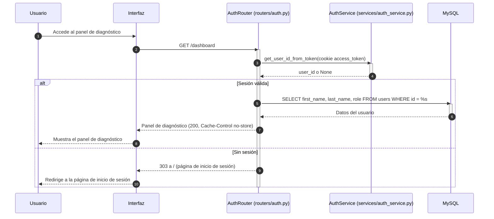
```mermaid
sequenceDiagram
    autonumber
    participant U as Usuario
    participant I as Interfaz
    participant R as AuthRouter (routers/auth.py)
    participant S as AuthService (services/auth_service.py)
    participant BD as MySQL

    U->>I: Accede al panel de diagnóstico
    I->>R: GET /dashboard
    activate R
    R->>S: get_user_id_from_token(cookie access_token)
    activate S
    S-->>R: user_id o None
    deactivate S
    alt Sesión válida
        R->>BD: SELECT first_name, last_name, role FROM users WHERE id = %s
        activate BD
        BD-->>R: Datos del usuario
        deactivate BD
        R-->>I: Panel de diagnóstico (200, Cache-Control no-store)
        I-->>U: Muestra el panel de diagnóstico
    else Sin sesión
        R-->>I: 303 a / (página de inicio de sesión)
        I-->>U: Redirige a la página de inicio de sesión
    end
    deactivate R
```

*Figura 56 - Diagrama de secuencia del CU-005 Acceder al panel de diagnóstico*

#### CU-008 Solicitar un diagnóstico

El diagrama de la figura 57 muestra la solicitud del diagnóstico, que materializa también la subida de la radiografía (CU-006) y la selección de la arquitectura (CU-007), porque ambas se procesan en la misma petición. La interfaz adjunta la imagen y el modelo seleccionado, y el router resuelve la identidad. A continuación se suceden las validaciones de la frontera: sin sesión responde 401, y ante un tipo o un tamaño no permitidos responde 400 sin tocar la cola. Solo un fichero válido se conserva en disco y se encola: el router inserta el trabajo de tipo `diagnosis`, calcula su posición y devuelve el estado `queued`. El diagrama deja fuera la ejecución de la inferencia, que corresponde al procesamiento asíncrono de la figura 58.

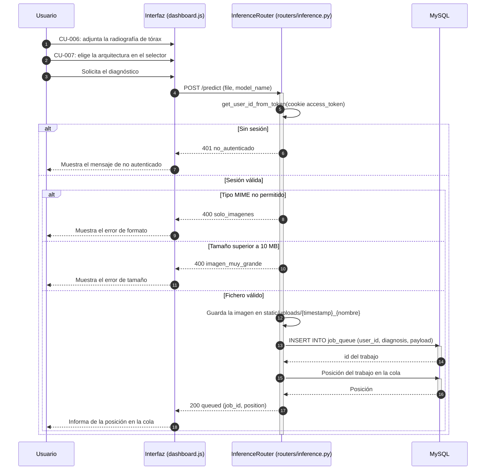
```mermaid
sequenceDiagram
    autonumber
    participant U as Usuario
    participant I as Interfaz (dashboard.js)
    participant R as InferenceRouter (routers/inference.py)
    participant BD as MySQL

    U->>I: CU-006: adjunta la radiografía de tórax
    U->>I: CU-007: elige la arquitectura en el selector
    U->>I: Solicita el diagnóstico
    I->>R: POST /predict (file, model_name)
    activate R
    R->>R: get_user_id_from_token(cookie access_token)
    alt Sin sesión
        R-->>I: 401 no_autenticado
        I-->>U: Muestra el mensaje de no autenticado
    else Sesión válida
        alt Tipo MIME no permitido
            R-->>I: 400 solo_imagenes
            I-->>U: Muestra el error de formato
        else Tamaño superior a 10 MB
            R-->>I: 400 imagen_muy_grande
            I-->>U: Muestra el error de tamaño
        else Fichero válido
            R->>R: Guarda la imagen en static/uploads/{timestamp}_{nombre}
            R->>BD: INSERT INTO job_queue (user_id, diagnosis, payload)
            activate BD
            BD-->>R: id del trabajo
            deactivate BD
            R->>BD: Posición del trabajo en la cola
            activate BD
            BD-->>R: Posición
            deactivate BD
            R-->>I: 200 queued (job_id, position)
            I-->>U: Informa de la posición en la cola
        end
    end
    deactivate R
```

*Figura 57 - Diagrama de secuencia del CU-008 Solicitar un diagnóstico*

#### Procesamiento asíncrono del diagnóstico

El diagrama de la figura 58 muestra la colaboración del worker con los servicios del subsistema. El bucle de la cola reclama el primer trabajo `queued`, con prioridad para los diagnósticos, y lo marca como `running` mediante una actualización condicional que solo afecta a una fila si el trabajo seguía en cola; de este modo, dos instancias no pueden procesar el mismo trabajo. A continuación el worker encarga al motor de predicción la inferencia, al generador de mapas la explicación visual y al generador de informes el documento PDF, y persiste el resultado en `consultations` con todas las rutas de los artefactos. Finalmente, marca el trabajo como `completed` con el resultado en formato JSON. Si cualquier paso falla, el trabajo pasa a `failed` con el mensaje de error limitado, de modo que un fallo del motor, de la imagen o del informe no se transforma en una consulta completada con datos ambiguos.

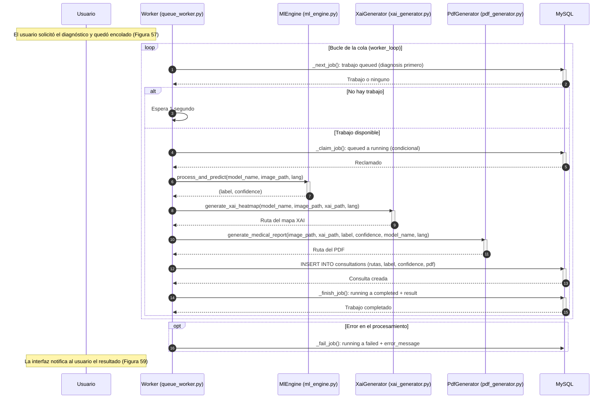
```mermaid
sequenceDiagram
    autonumber
    participant U as Usuario
    participant W as Worker (queue_worker.py)
    participant M as MlEngine (ml_engine.py)
    participant X as XaiGenerator (xai_generator.py)
    participant P as PdfGenerator (pdf_generator.py)
    participant BD as MySQL

    Note over U: El usuario solicitó el diagnóstico y quedó encolado (Figura 57)
    loop Bucle de la cola (worker_loop)
        W->>BD: _next_job(): trabajo queued (diagnosis primero)
        activate BD
        BD-->>W: Trabajo o ninguno
        deactivate BD
        alt No hay trabajo
            W->>W: Espera 1 segundo
        else Trabajo disponible
            W->>BD: _claim_job(): queued a running (condicional)
            activate BD
            BD-->>W: Reclamado
            deactivate BD
            W->>M: process_and_predict(model_name, image_path, lang)
            activate M
            M-->>W: (label, confidence)
            deactivate M
            W->>X: generate_xai_heatmap(model_name, image_path, xai_path, lang)
            activate X
            X-->>W: Ruta del mapa XAI
            deactivate X
            W->>P: generate_medical_report(image_path, xai_path, label, confidence, model_name, lang)
            activate P
            P-->>W: Ruta del PDF
            deactivate P
            W->>BD: INSERT INTO consultations (rutas, label, confidence, pdf)
            activate BD
            BD-->>W: Consulta creada
            deactivate BD
            W->>BD: _finish_job(): running a completed + result
            activate BD
            BD-->>W: Trabajo completado
            deactivate BD
        end
    end
    opt Error en el procesamiento
        W->>BD: _fail_job(): running a failed + error_message
    end
    Note over U: La interfaz notifica al usuario el resultado (Figura 59)
```

*Figura 58 - Diagrama de secuencia del procesamiento asíncrono del diagnóstico*

#### CU-009 y CU-010 Visualizar el resultado y los mapas de explicabilidad

El diagrama de la figura 59 muestra la visualización del resultado y de los mapas. La interfaz sondea el estado del trabajo con el router de la cola; cuando el trabajo pasa a `completed`, muestra la predicción, la confianza y el modelo (CU-009) y refresca el historial. Desde el detalle de la consulta, la interfaz solicita la radiografía original y el mapa de explicabilidad al almacenamiento estático (CU-010). Si el trabajo terminó en `failed`, la interfaz muestra el error recibido. La secuencia refleja que el resultado no se calcula en la visualización, sino que se recupera del trabajo completado y de los artefactos persistidos.

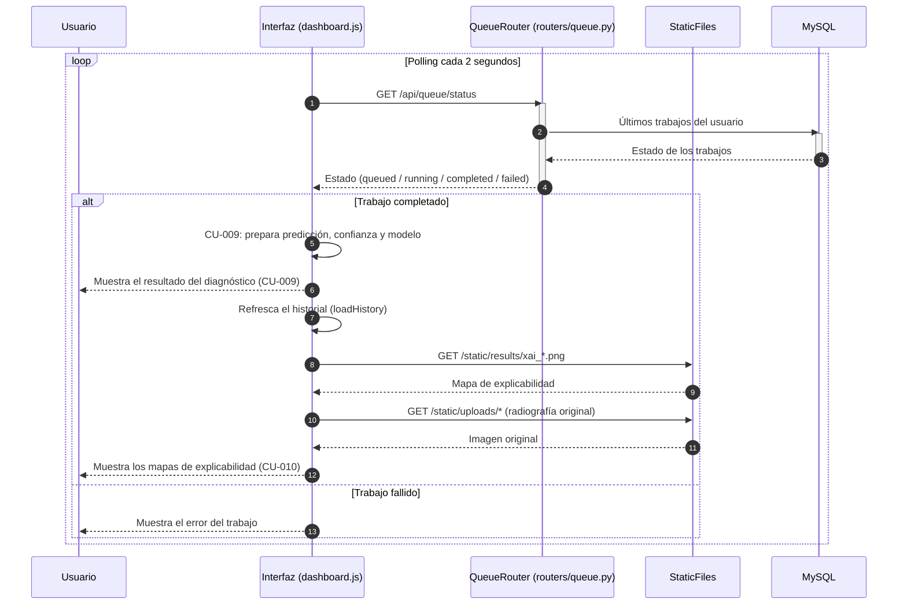
```mermaid
sequenceDiagram
    autonumber
    participant U as Usuario
    participant I as Interfaz (dashboard.js)
    participant Q as QueueRouter (routers/queue.py)
    participant F as StaticFiles
    participant BD as MySQL

    loop Polling cada 2 segundos
        I->>Q: GET /api/queue/status
        activate Q
        Q->>BD: Últimos trabajos del usuario
        activate BD
        BD-->>Q: Estado de los trabajos
        deactivate BD
        Q-->>I: Estado (queued / running / completed / failed)
        deactivate Q
        alt Trabajo completado
            I->>I: CU-009: prepara predicción, confianza y modelo
            I-->>U: Muestra el resultado del diagnóstico (CU-009)
            I->>I: Refresca el historial (loadHistory)
            I->>F: GET /static/results/xai_*.png
            F-->>I: Mapa de explicabilidad
            I->>F: GET /static/uploads/* (radiografía original)
            F-->>I: Imagen original
            I-->>U: Muestra los mapas de explicabilidad (CU-010)
        else Trabajo fallido
            I-->>U: Muestra el error del trabajo
        end
    end
```

*Figura 59 - Diagrama de secuencia de los CU-009 y CU-010 Visualizar el resultado y los mapas*

#### CU-037 Generar el informe PDF del diagnóstico

El diagrama de la figura 60 muestra la entrega del informe PDF. La generación del documento ya ocurrió durante el procesamiento asíncrono (figura 58), por lo que la interacción del actor se limita a recuperar la ruta del informe desde el historial y a descargar el recurso estático. La interfaz consulta la consulta en el router del historial, obtiene la ruta del PDF persistida y solicita el documento al almacenamiento estático, que lo entrega como archivo descargable. El diseño garantiza que la descarga siempre disponga del documento, porque el informe existe desde el momento en que la consulta se completa.

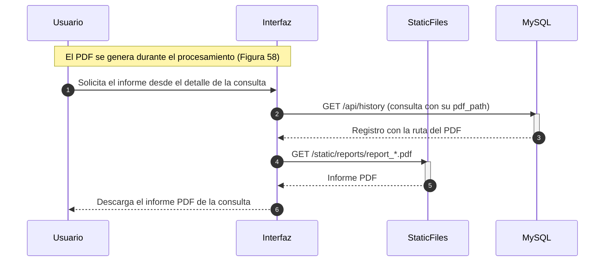
```mermaid
sequenceDiagram
    autonumber
    participant U as Usuario
    participant I as Interfaz
    participant F as StaticFiles
    participant BD as MySQL

    Note over U,I: El PDF se genera durante el procesamiento (Figura 58)
    U->>I: Solicita el informe desde el detalle de la consulta
    I->>BD: GET /api/history (consulta con su pdf_path)
    activate BD
    BD-->>I: Registro con la ruta del PDF
    deactivate BD
    I->>F: GET /static/reports/report_*.pdf
    activate F
    F-->>I: Informe PDF
    deactivate F
    I-->>U: Descarga el informe PDF de la consulta
```

*Figura 60 - Diagrama de secuencia del CU-037 Generar el informe PDF*

## 20.3 Subsistema de diseño SD-003: Historial y gestión de consultas

El subsistema SD-003 corresponde al subsistema de análisis SS-003 y proporciona la recuperación y la gestión de las consultas ya realizadas. Su entidad persistente principal es la tabla `consultations`, que almacena las rutas de los artefactos, la arquitectura utilizada, la predicción, la confianza, el nombre mostrado al usuario y la fecha de la operación. Agrupa los casos de uso CU-011 a CU-014: la consulta del historial, la visualización del detalle, el renombrado y la eliminación. La relación con SD-002 es de productor-consumidor de resultados: SD-002 crea el registro de `consultations` cuando finaliza un diagnóstico, y SD-003 ofrece sobre él operaciones de consulta y organización, sin modificar en ningún caso la predicción ni sus artefactos.

El subsistema se apoya en `routers/history.py`, que expone la consulta del listado y las operaciones de actualización y eliminación, y en la interfaz del historial integrada en el panel de diagnóstico, que utiliza JavaScript para mostrar los resultados, cambiar el nombre visible de una consulta y solicitar su eliminación. La entidad de persistencia y la no ejecución del modelo condicionan el diseño: el subsistema recupera desde MySQL los metadatos y devuelve las rutas de la imagen original, del mapa XAI y del informe PDF, de modo que la visualización de una consulta anterior no repite la inferencia. El nombre mostrado al usuario se actualiza sobre `patient_name`, que funciona como etiqueta de organización de la consulta y no como identificación clínica del paciente, y la eliminación se implementa actualmente como una eliminación física de la fila, por lo que el subsistema no realiza un borrado lógico ni conserva automáticamente una auditoría de cada eliminación.

### 20.3.1 Diagrama de casos de uso del subsistema

El diagrama de casos de uso de SD-003 recoge las cuatro interacciones que el subsistema pone a disposición del usuario autenticado, y es una adaptación del diagrama del módulo de interfaz de diagnóstico asistido definido en el análisis (figura 4), limitada a los casos de uso de la gestión del historial. El diagrama conserva las relaciones de extensión de la cadena de navegación que el análisis declaró para este bloque: el detalle (CU-012) se alcanza de forma opcional desde el listado (CU-011), y desde el detalle pueden ejecutarse, de forma opcional, el renombrado (CU-013) o la eliminación (CU-014). El informe PDF (CU-037) también extiende CU-012, pero pertenece a SD-002, que se ocupa de su generación, por lo que esa relación se materializa en la frontera entre subsistemas y no se dibuja aquí. El diagrama se representa a continuación.

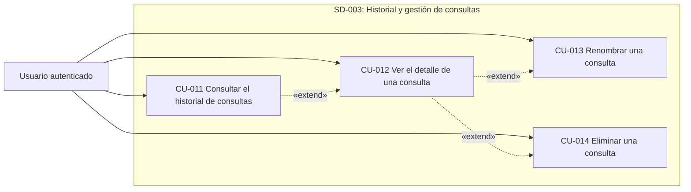
```mermaid
flowchart LR
    subgraph SD003["SD-003: Historial y gestión de consultas"]
        CU11["CU-011 Consultar el historial de consultas"]
        CU12["CU-012 Ver el detalle de una consulta"]
        CU13["CU-013 Renombrar una consulta"]
        CU14["CU-014 Eliminar una consulta"]
    end
    U["Usuario autenticado"] --> CU11
    U --> CU12
    U --> CU13
    U --> CU14
    CU11 -.->|"«extend»"| CU12
    CU12 -.->|"«extend»"| CU13
    CU12 -.->|"«extend»"| CU14
```

*Figura 61 - Diagrama de casos de uso del subsistema SD-003*

El diagrama distingue un único actor, el usuario autenticado, que reúne a todos los profesionales con cuenta registrada. El administrador no aparece como actor diferenciado, aunque las operaciones de este subsistema le afectan: la comprobación de propiedad contempla una excepción controlada para el rol administrativo, que permite supervisar consultas desde SD-005, pero esa excepción es una decisión de diseño del caso de uso real y no una interacción distinta del actor. Los cuatro casos de uso se representan como interacciones del actor con el sistema, con las relaciones de extensión que ordenan la navegación entre el listado, el detalle y las operaciones que se ejecutan desde este último.

### 20.3.2 Casos de uso reales del subsistema

Los casos de uso reales de SD-003 concretan cada interacción del diagrama en decisiones técnicas de implementación. A diferencia de SD-002, las operaciones de este subsistema son síncronas y no requieren la cola de trabajos: recuperan o modifican registros ya persistidos, sin volver a ejecutar el modelo. Cada caso de uso real se describe a continuación, indicando los componentes que intervienen, las comprobaciones de propiedad, las operaciones de persistencia y las respuestas al cliente.

#### CU-011 Consultar el historial de consultas

La consulta del historial se materializa en el endpoint `GET /api/history` de `routers/history.py`, que devuelve exclusivamente las consultas del usuario autenticado. El diseño impone el aislamiento de datos en la propia consulta de persistencia: el filtro por `user_id` se aplica en el servidor y no se confía en la interfaz. Las decisiones técnicas del caso de uso real son las siguientes:

- **Autenticación**: el router resuelve la identidad con SD-001 y responde HTTP 401 con el mensaje de no autenticado si no hay sesión válida.
- **Filtrado por propietario**: la consulta recupera las columnas del historial desde `consultations` filtrando por `WHERE user_id = %s`, de modo que ningún usuario puede recibir las consultas de otro (RF-005).
- **Ordenación**: el listado se ordena por fecha descendente, de modo que las consultas más recientes aparecen en primer lugar.
- **Formato de los datos**: las fechas se convierten a una representación textual antes de formar la respuesta JSON, de modo que el navegador no necesita conocer el tipo de fecha de MySQL.
- **Presentación en la interfaz**: la vista del historial agrupa las consultas por modelo y construye las tarjetas con la imagen, la fecha, la etiqueta y la confianza, enlazando cada tarjeta con el detalle de la consulta.
- **Sin reinferencia**: la consulta no ejecuta el modelo; recupera los metadatos y las rutas de los artefactos ya persistidos, lo que reduce el coste de acceso al historial.

#### CU-012 Ver el detalle de una consulta del historial

La visualización del detalle se materializa en la interfaz del panel de diagnóstico, que construye la vista de detalle a partir de los datos que ya recibió en la consulta del historial. El diseño evita un endpoint específico de detalle para el usuario normal: como el listado ya está filtrado por propietario, los datos del detalle provienen de una respuesta que el servidor restringió al usuario, y los artefactos se sirven mediante las rutas estáticas configuradas en la aplicación. Las decisiones técnicas del caso de uso real son las siguientes:

- **Origen de los datos**: la interfaz conserva en la tarjeta del historial el identificador, las rutas de la imagen y del mapa, la etiqueta, la confianza, el modelo, el nombre y la fecha; al abrir el detalle, presenta estos campos sin necesidad de una nueva petición al servidor.
- **Artefactos visuales**: la vista muestra la radiografía original y el mapa de explicabilidad servidos como recursos estáticos, junto con el resultado del diagnóstico, su nivel de confianza, el modelo empleado y los metadatos de la consulta.
- **Comprobación de propiedad implícita**: la propiedad queda garantizada por la cadena de datos: el detalle solo puede construirse a partir de una consulta que el servidor ya devolvió al usuario propietario.
- **Acciones desde el detalle**: desde la vista de detalle se ejecutan, de forma opcional, las operaciones de renombrado (CU-013), eliminación (CU-014) y descarga del informe PDF (CU-037, de SD-002), en coherencia con las relaciones de extensión del diagrama.

#### CU-013 Renombrar una consulta del historial

El renombrado se materializa en el endpoint `POST /api/history/update_name` de `routers/history.py`, precedido de la solicitud del nuevo nombre en la interfaz. El diseño antepone la comprobación de propiedad a la modificación y valida el nuevo nombre antes de enviarlo al servidor. Las decisiones técnicas del caso de uso real son las siguientes:

- **Solicitud del nombre**: la interfaz muestra un diálogo con el nombre actual de la consulta y recoge el nuevo valor.
- **Validación del nombre**: la interfaz rechaza el envío si el nuevo nombre está vacío o no ha cambiado, de modo que no se envían peticiones innecesarias.
- **Comprobación de propiedad**: el router invoca `_check_consultation_ownership()`, que verifica que la consulta existe y pertenece al usuario solicitante, con la excepción controlada del rol `admin` que permite la supervisión desde SD-005. La comprobación distingue tres resultados: consulta inexistente, consulta de otro usuario y propiedad confirmada.
- **Respuestas diferenciadas**: el sistema responde HTTP 404 cuando la consulta no existe y HTTP 403 cuando pertenece a otro usuario, de modo que la interfaz informa de la situación sin exponer detalles internos de la base de datos.
- **Actualización**: si la propiedad se confirma, el sistema ejecuta `UPDATE consultations SET patient_name = %s WHERE id = %s` y confirma la transacción, actualizando únicamente la etiqueta de organización de la consulta, sin tocar los datos técnicos de la inferencia.
- **Refresco de la vista**: la interfaz actualiza el nombre en la tarjeta del historial y en el detalle abierto, y recarga el listado para mantener la coherencia.

#### CU-014 Eliminar una consulta del historial

La eliminación se materializa en el endpoint `POST /api/history/delete` de `routers/history.py`, precedido de la confirmación del usuario en la interfaz. El diseño sigue el requisito del análisis de solicitar confirmación previa, en línea con el derecho de supresión del RGPD, y ejecuta la eliminación como un borrado físico de la fila. Las decisiones técnicas del caso de uso real son las siguientes:

- **Confirmación previa**: la interfaz solicita al usuario la confirmación de la eliminación antes de enviar la petición; si no se confirma, la operación se abandona y la consulta permanece intacta.
- **Comprobación de propiedad**: antes del borrado, el router invoca `_check_consultation_ownership()` con la misma lógica de los tres resultados —inexistente, ajena y propia— y con la excepción controlada del rol `admin`.
- **Respuestas diferenciadas**: el sistema responde HTTP 404 y HTTP 403 en los casos de inexistencia y falta de permisos, y HTTP 200 cuando la eliminación se confirma.
- **Borrado físico**: la eliminación se ejecuta con `DELETE FROM consultations WHERE id = %s` y se confirma la transacción solo después de que MySQL la acepte. El diseño no conserva automáticamente una auditoría de la eliminación, tal y como se declaró en el capítulo 17.
- **Refresco de la vista**: la interfaz cierra el detalle abierto y recarga el historial, de modo que la consulta eliminada desaparece del listado junto con el acceso a sus artefactos.

### 20.3.3 Diagramas de interacción entre objetos

Los diagramas de interacción de SD-003 muestran cómo colaboran los componentes del subsistema para realizar los casos de uso reales. A diferencia de SD-002, todas las interacciones de este subsistema son síncronas: no interviene la cola de trabajos, porque las operaciones recuperan o modifican registros ya persistidos. El control de propiedad constituye el elemento central de los diagramas de renombrado y eliminación, donde la comprobación se resuelve antes de cualquier modificación y condiciona la respuesta al cliente. Se emplea la misma notación de secuencia del UML utilizada en los apartados anteriores.

#### CU-011 Consultar el historial de consultas

El diagrama de la figura 62 muestra la consulta del historial. El usuario accede a su historial y la interfaz solicita el listado al router, que resuelve la identidad. Con sesión válida, el router recupera únicamente las consultas del usuario ordenadas por fecha descendente, formatea las fechas y devuelve el listado; la interfaz lo presenta agrupado por modelo. Si no hay sesión, el router responde 401 y la interfaz conduce al inicio de sesión. La secuencia refleja que el aislamiento de datos se aplica en la consulta de persistencia y no en la presentación.

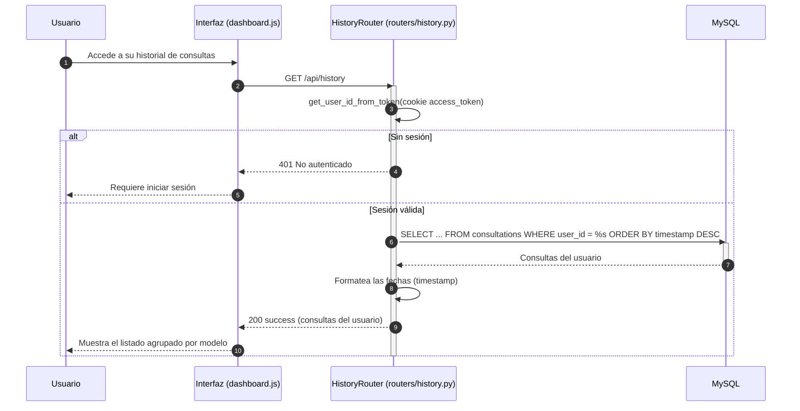
```mermaid
sequenceDiagram
    autonumber
    participant U as Usuario
    participant I as Interfaz (dashboard.js)
    participant H as HistoryRouter (routers/history.py)
    participant BD as MySQL

    U->>I: Accede a su historial de consultas
    I->>H: GET /api/history
    activate H
    H->>H: get_user_id_from_token(cookie access_token)
    alt Sin sesión
        H-->>I: 401 No autenticado
        I-->>U: Requiere iniciar sesión
    else Sesión válida
        H->>BD: SELECT ... FROM consultations WHERE user_id = %s ORDER BY timestamp DESC
        activate BD
        BD-->>H: Consultas del usuario
        deactivate BD
        H->>H: Formatea las fechas (timestamp)
        H-->>I: 200 success (consultas del usuario)
        I-->>U: Muestra el listado agrupado por modelo
    end
    deactivate H
```

*Figura 62 - Diagrama de secuencia del CU-011 Consultar el historial de consultas*

#### CU-012 Ver el detalle de una consulta del historial

El diagrama de la figura 63 muestra la visualización del detalle. El usuario selecciona una consulta del listado y la interfaz construye el detalle con los datos que ya recibió del historial, sin realizar una petición adicional al servidor. A continuación solicita al almacenamiento estático la radiografía original y el mapa de explicabilidad, y presenta la consulta completa al usuario. La secuencia refleja la decisión de diseño de no disponer de un endpoint de detalle para el usuario normal: la propiedad queda garantizada por la cadena de datos del listado, ya restringido al propietario.

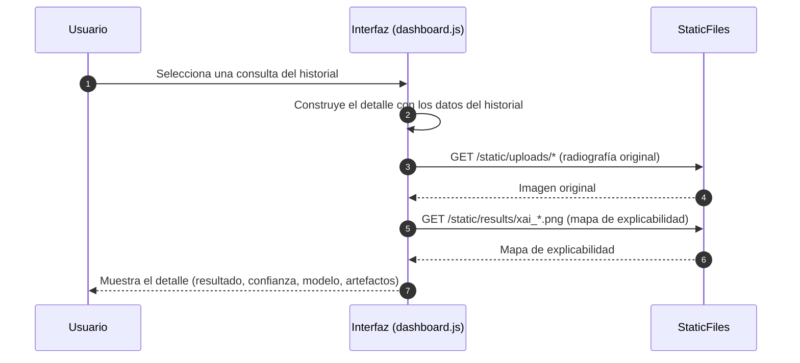
```mermaid
sequenceDiagram
    autonumber
    participant U as Usuario
    participant I as Interfaz (dashboard.js)
    participant F as StaticFiles

    U->>I: Selecciona una consulta del historial
    I->>I: Construye el detalle con los datos del historial
    I->>F: GET /static/uploads/* (radiografía original)
    F-->>I: Imagen original
    I->>F: GET /static/results/xai_*.png (mapa de explicabilidad)
    F-->>I: Mapa de explicabilidad
    I-->>U: Muestra el detalle (resultado, confianza, modelo, artefactos)
```

*Figura 63 - Diagrama de secuencia del CU-012 Ver el detalle de una consulta del historial*

#### CU-013 Renombrar una consulta del historial

El diagrama de la figura 64 muestra el renombrado. El usuario indica el nuevo nombre en el diálogo de la interfaz, que valida que no esté vacío y envía la petición al router. El router resuelve la identidad y comprueba la propiedad de la consulta mediante `_check_consultation_ownership()`. Según el resultado, responde 404 si la consulta no existe, 403 si pertenece a otro usuario, o ejecuta la actualización del nombre cuando la propiedad se confirma y devuelve éxito; la interfaz muestra el nuevo nombre. La secuencia muestra que la modificación queda condicionada a la comprobación previa de propiedad.

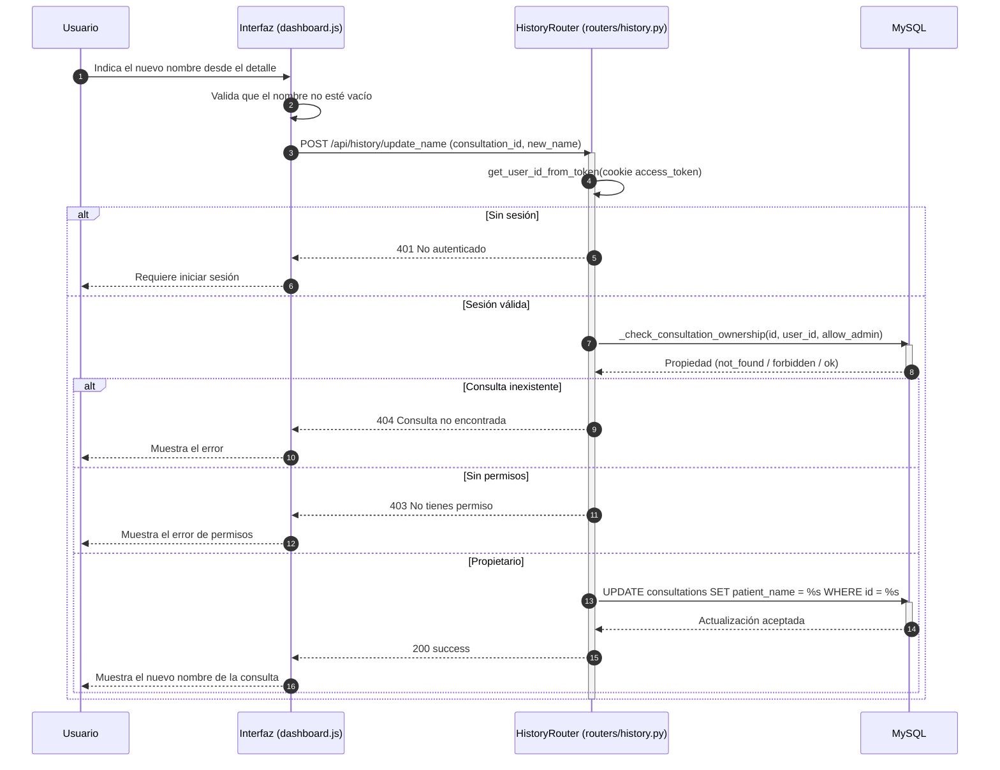
```mermaid
sequenceDiagram
    autonumber
    participant U as Usuario
    participant I as Interfaz (dashboard.js)
    participant H as HistoryRouter (routers/history.py)
    participant BD as MySQL

    U->>I: Indica el nuevo nombre desde el detalle
    I->>I: Valida que el nombre no esté vacío
    I->>H: POST /api/history/update_name (consultation_id, new_name)
    activate H
    H->>H: get_user_id_from_token(cookie access_token)
    alt Sin sesión
        H-->>I: 401 No autenticado
        I-->>U: Requiere iniciar sesión
    else Sesión válida
        H->>BD: _check_consultation_ownership(id, user_id, allow_admin)
        activate BD
        BD-->>H: Propiedad (not_found / forbidden / ok)
        deactivate BD
        alt Consulta inexistente
            H-->>I: 404 Consulta no encontrada
            I-->>U: Muestra el error
        else Sin permisos
            H-->>I: 403 No tienes permiso
            I-->>U: Muestra el error de permisos
        else Propietario
            H->>BD: UPDATE consultations SET patient_name = %s WHERE id = %s
            activate BD
            BD-->>H: Actualización aceptada
            deactivate BD
            H-->>I: 200 success
            I-->>U: Muestra el nuevo nombre de la consulta
        end
    end
    deactivate H
```

*Figura 64 - Diagrama de secuencia del CU-013 Renombrar una consulta del historial*

#### CU-014 Eliminar una consulta del historial

El diagrama de la figura 65 muestra la eliminación. El usuario solicita eliminar la consulta desde el detalle y la interfaz pide confirmación; únicamente tras la confirmación se envía la petición al router. El router resuelve la identidad y comprueba la propiedad; con propiedad confirmada, ejecuta el borrado físico y confirma la transacción, y la interfaz cierra el detalle y refresca el historial. La secuencia refleja tanto la confirmación previa del análisis como el control de propiedad previo a la destrucción del registro.

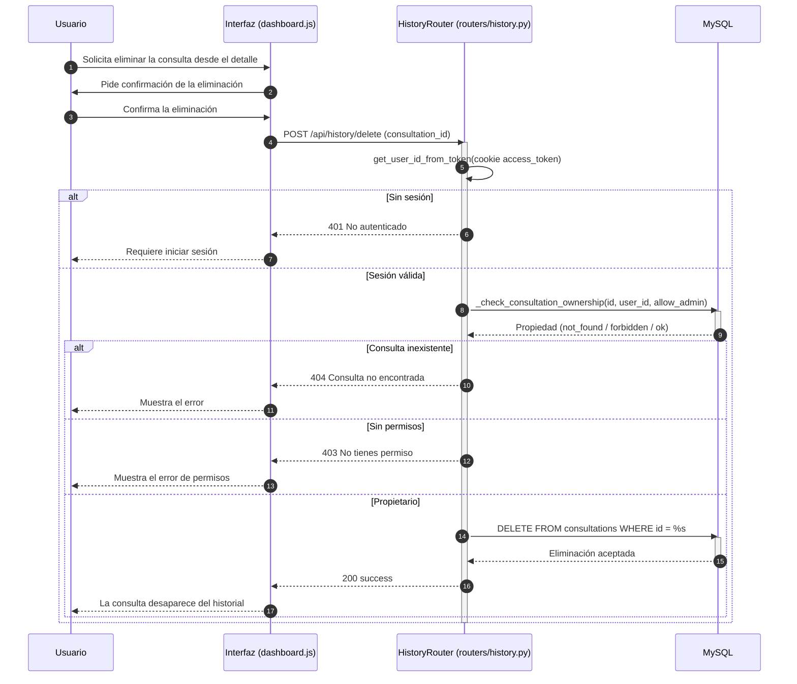
```mermaid
sequenceDiagram
    autonumber
    participant U as Usuario
    participant I as Interfaz (dashboard.js)
    participant H as HistoryRouter (routers/history.py)
    participant BD as MySQL

    U->>I: Solicita eliminar la consulta desde el detalle
    I->>U: Pide confirmación de la eliminación
    U->>I: Confirma la eliminación
    I->>H: POST /api/history/delete (consultation_id)
    activate H
    H->>H: get_user_id_from_token(cookie access_token)
    alt Sin sesión
        H-->>I: 401 No autenticado
        I-->>U: Requiere iniciar sesión
    else Sesión válida
        H->>BD: _check_consultation_ownership(id, user_id, allow_admin)
        activate BD
        BD-->>H: Propiedad (not_found / forbidden / ok)
        deactivate BD
        alt Consulta inexistente
            H-->>I: 404 Consulta no encontrada
            I-->>U: Muestra el error
        else Sin permisos
            H-->>I: 403 No tienes permiso
            I-->>U: Muestra el error de permisos
        else Propietario
            H->>BD: DELETE FROM consultations WHERE id = %s
            activate BD
            BD-->>H: Eliminación aceptada
            deactivate BD
            H-->>I: 200 success
            I-->>U: La consulta desaparece del historial
        end
    end
    deactivate H
```

*Figura 65 - Diagrama de secuencia del CU-014 Eliminar una consulta del historial*

## 20.4 Subsistema de diseño SD-004: Laboratorio de experimentación MLOps

El subsistema SD-004 corresponde al subsistema de análisis SS-004 y constituye el bloque de mayor complejidad funcional de la plataforma. Gestiona la configuración conversacional del experimento, la selección del dataset, el entrenamiento de los modelos, la ejecución de los análisis de explicabilidad, la comparación estadística, la validación externa, la consulta de resultados y la generación de informes. Agrupa los casos de uso CU-015 a CU-030 y CU-039, que materializan los diecisiete requisitos del laboratorio: la configuración y el lanzamiento de los experimentos, la consulta de las sesiones y de sus resultados, el análisis XAI, la comparación estadística, la validación externa, la generación de informes y la gestión de las sesiones.

El subsistema se apoya en `routers/trainer.py`, que actúa como fachada ligera, y en un conjunto de servicios especializados: `services/chatbot_service.py`, que resuelve la configuración conversacional del experimento mediante el asistente externo; `services/mlops_engine.py`, que organiza las sesiones del laboratorio y resuelve la lectura y escritura de los resultados en el directorio `training_results`; los scripts de entrenamiento de `pneumoniacnn-main/code`, que ejecutan el pipeline de preparación, entrenamiento, análisis XAI y comparación estadística; y `services/pdf_generator_mlops.py`, que genera los informes consolidados de la sesión. La ejecución de las tareas de larga duración se delega en la cola de trabajos y en su worker, de modo que el laboratorio conserva una interfaz interactiva aunque el entrenamiento tarde mucho más que una petición HTTP normal.

El diseño de SD-004 introduce dos decisiones que condicionan su arquitectura. En primer lugar, la persistencia es híbrida: MySQL conserva la cola de trabajos y el estado, mientras que el sistema de ficheros alberga los artefactos de cada sesión, de modo que el identificador de la sesión se conserva tanto en la fila del trabajo como en el directorio de resultados. En segundo lugar, existen dos canales de ejecución diferenciados: el entrenamiento y la validación externa se procesan a través de la cola de trabajos, mientras que la comparación estadística se programa con las tareas en segundo plano de FastAPI (`BackgroundTasks`). La regla central del subsistema es la propiedad de las sesiones: antes de mostrar resultados, eliminar o renombrar una sesión, el router invoca la comprobación de propiedad de `mlops_engine`, con la excepción controlada del administrador cuando la ruta lo permite.

### 20.4.1 Diagrama de casos de uso del subsistema

El diagrama de casos de uso de SD-004 recoge las diecisiete interacciones que el subsistema pone a disposición del usuario autenticado, y es una adaptación del diagrama del módulo de laboratorio de experimentación MLOps definido en el análisis (figura 5), limitada al ámbito del subsistema de diseño. El diagrama conserva las relaciones del análisis: la inclusión de la configuración conversacional en el lanzamiento del experimento (CU-018 incluye CU-016, porque la ejecución no comienza hasta que el router dispone de una configuración completa y válida), y las extensiones que ordenan la navegación entre la consulta de sesiones y las vistas de resultados, ranking, comparativa e informe. El diagrama se representa a continuación.

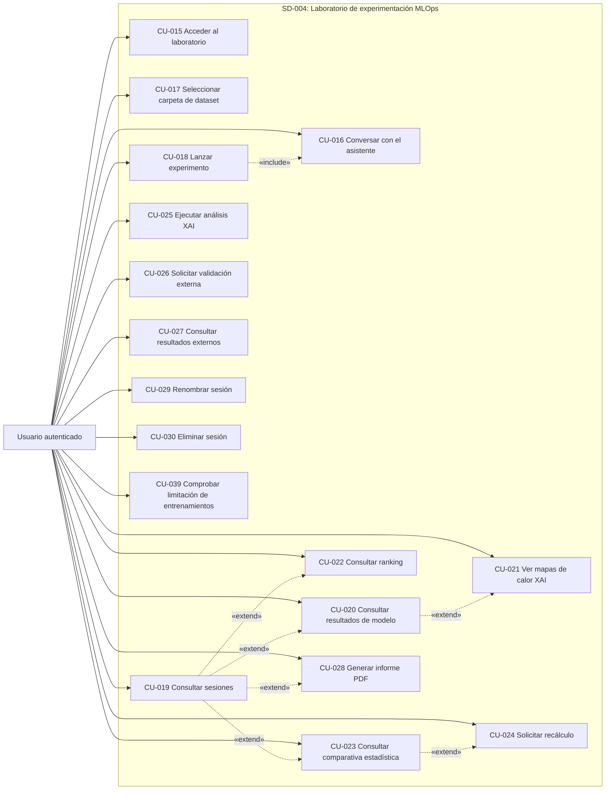
```mermaid
flowchart LR
    subgraph SD004["SD-004: Laboratorio de experimentación MLOps"]
        CU15["CU-015 Acceder al laboratorio"]
        CU16["CU-016 Conversar con el asistente"]
        CU17["CU-017 Seleccionar carpeta de dataset"]
        CU18["CU-018 Lanzar experimento"]
        CU19["CU-019 Consultar sesiones"]
        CU20["CU-020 Consultar resultados de modelo"]
        CU21["CU-021 Ver mapas de calor XAI"]
        CU22["CU-022 Consultar ranking"]
        CU23["CU-023 Consultar comparativa estadística"]
        CU24["CU-024 Solicitar recálculo"]
        CU25["CU-025 Ejecutar análisis XAI"]
        CU26["CU-026 Solicitar validación externa"]
        CU27["CU-027 Consultar resultados externos"]
        CU28["CU-028 Generar informe PDF"]
        CU29["CU-029 Renombrar sesión"]
        CU30["CU-030 Eliminar sesión"]
        CU39["CU-039 Comprobar limitación de entrenamientos"]
    end
    U["Usuario autenticado"] --> CU15
    U --> CU16
    U --> CU17
    U --> CU18
    U --> CU19
    U --> CU20
    U --> CU21
    U --> CU22
    U --> CU23
    U --> CU24
    U --> CU25
    U --> CU26
    U --> CU27
    U --> CU28
    U --> CU29
    U --> CU30
    U --> CU39
    CU18 -.->|"«include»"| CU16
    CU19 -.->|"«extend»"| CU20
    CU20 -.->|"«extend»"| CU21
    CU19 -.->|"«extend»"| CU22
    CU19 -.->|"«extend»"| CU23
    CU23 -.->|"«extend»"| CU24
    CU19 -.->|"«extend»"| CU28
```

*Figura 66 - Diagrama de casos de uso del subsistema SD-004*

El diagrama distingue un único actor, el usuario autenticado, que reúne a todos los profesionales con cuenta registrada. La estructura de los casos de uso refleja el ciclo de vida del laboratorio. La entrada se compone de CU-015 a CU-018: el acceso al laboratorio, la configuración conversacional con el asistente, la selección de la carpeta del dataset y el lanzamiento del experimento, que incorpora la configuración conversacional como paso obligatorio mediante la inclusión. La consulta se organiza desde las sesiones (CU-019), desde las que se accede de forma opcional a los resultados de un modelo (CU-020), al ranking (CU-022), a la comparativa estadística (CU-023) y al informe PDF (CU-028); desde los resultados de un modelo se alcanzan sus mapas de explicabilidad (CU-021), y desde la comparativa se solicita su recálculo (CU-024). El resto de operaciones —la ejecución del análisis XAI (CU-025), la validación externa (CU-026 y CU-027), el renombrado y la eliminación de sesiones (CU-029 y CU-030) y la comprobación de la limitación de entrenamientos (CU-039)— son interacciones directas e independientes del actor con el sistema.

### 20.4.2 Casos de uso reales del subsistema

Los casos de uso reales de SD-004 concretan cada interacción del diagrama en decisiones técnicas de implementación. El subsistema combina operaciones síncronas de configuración y consulta con operaciones asíncronas de ejecución, repartidas entre la cola de trabajos y las tareas en segundo plano. Para facilitar la lectura, los casos de uso reales se presentan agrupados en cuatro bloques: la entrada del laboratorio, la consulta de resultados, el análisis y la validación, y la gestión e informes.

**Bloque de entrada del laboratorio.**

#### CU-015 Acceder al laboratorio de entrenamiento

El acceso al laboratorio se materializa en el endpoint `GET /training` del router `routers/auth.py`, que aplica la misma política de sesión que el panel de diagnóstico. Las decisiones técnicas del caso de uso real son las siguientes:

- **Verificación de la sesión**: el router obtiene el identificador del usuario mediante `get_user_id_from_token()` de SD-001; sin sesión válida, responde con una redirección HTTP 303 a la página de inicio de sesión.
- **Carga del perfil**: con el identificador resuelto, se consultan el nombre y el rol del usuario en la tabla `users` para personalizar la vista del laboratorio.
- **Control de caché**: la respuesta incluye las cabeceras `Cache-Control: no-store`, de modo que la página del laboratorio no se sirve desde caché tras un cierre de sesión.

#### CU-016 Conversar con el asistente para configurar un experimento

La configuración conversacional se materializa en el endpoint `POST /api/chat`, que delega en `services/chatbot_service.py`. El diseño trata al proveedor del asistente como una frontera externa: los errores del proveedor no se confunden con los de persistencia o entrenamiento. Las decisiones técnicas del caso de uso real son las siguientes:

- **Comunicación con el asistente**: el servicio envía el mensaje del usuario al asistente externo (Groq) y devuelve una configuración estructurada del experimento, solicitando los parámetros que falten (arquitecturas, épocas, lote, tasa de aprendizaje).
- **Frontera externa**: el único componente que necesita la clave de la API del asistente es `chatbot_service.py`; los routers no la incluyen en las respuestas ni en los registros.
- **Localización de los prompts**: el servicio selecciona el prompt del asistente según el idioma de la sesión, en coherencia con el mecanismo de internacionalización de SD-001.
- **Condición del lanzamiento**: la configuración conversacional constituye el paso obligatorio que el lanzamiento del experimento (CU-018) incluye, de modo que la ejecución no comienza hasta que la configuración es completa y válida.

#### CU-017 Seleccionar la carpeta del dataset

La selección de la carpeta del dataset se materializa en el endpoint `GET /api/train/browse`, que delega en la exploración de `mlops_engine`. El diseño confina la selección dentro del directorio raíz permitido, evitando que la ruta escape del ámbito de datos del sistema. Las decisiones técnicas del caso de uso real son las siguientes:

- **Exploración del sistema de ficheros**: la función `browse_folder()` devuelve la ruta del dataset configurada mediante la variable de entorno `TFG_DEMO_DATASET` (o `TFG_DEMO_EXTERNAL_DATASET` para la validación externa) o, en su defecto, abre el selector de carpetas del sistema.
- **Selección confinada**: la ruta seleccionada se restringe al directorio permitido, de modo que el usuario no puede indicar una ruta arbitraria fuera del ámbito de datos.
- **Respuesta al cliente**: el router devuelve la ruta seleccionada para que la interfaz la inserte en la configuración del experimento, o responde HTTP 500 si la exploración no pudo completarse.

#### CU-018 Lanzar un experimento de entrenamiento

El lanzamiento del experimento se materializa en el endpoint `POST /api/train/start`, que crea la sesión de entrenamiento y encola su ejecución asíncrona. El diseño exige una configuración completa y válida antes de encolar, en coherencia con la inclusión de la configuración conversacional (CU-016). Las decisiones técnicas del caso de uso real son las siguientes:

- **Validación de la ruta del dataset**: el router comprueba que la ruta del dataset exista en el sistema de ficheros; en caso contrario, responde HTTP 400 con el mensaje de ruta inexistente y no crea la sesión.
- **Creación de la sesión**: `create_training_session()` crea el directorio de la sesión en `training_results` y escribe el `config.json` con la configuración del experimento, los modelos, la ruta del dataset y el identificador del usuario propietario.
- **Encolado del entrenamiento**: el router inserta un registro en `job_queue` con el tipo `training` y un payload JSON serializable que contiene el identificador de la sesión, los modelos, la ruta del dataset y los hiperparámetros; ni el modelo ni los datos se serializan en la base de datos.
- **Respuesta al cliente**: el sistema responde HTTP 200 con el estado `queued`, el identificador del trabajo y el de la sesión, de modo que la interfaz informa del encolado y comienza a consultar el estado.

#### CU-039 Comprobar la limitación de entrenamientos simultáneos y encolados

La limitación de los entrenamientos se materializa en el mecanismo de ejecución de la cola de trabajos, que procesa un único trabajo de entrenamiento cada vez y prioriza de forma diferenciada los tipos de trabajo. Las decisiones técnicas del caso de uso real son las siguientes:

- **Procesamiento secuencial**: el worker reclama el primer trabajo `queued` mediante una actualización condicional que solo tiene efecto si el trabajo seguía en cola, de modo que dos instancias no pueden ejecutar simultáneamente el mismo entrenamiento.
- **Prioridad de la cola**: la selección del siguiente trabajo ordena por tipo, de modo que el entrenamiento no compite por la misma prioridad que el diagnóstico; la interfaz de la cola refleja la posición de cada trabajo y los recuentos de pendientes.
- **Consulta del estado**: el endpoint de estado de la cola devuelve los trabajos del usuario con su estado y posición, de modo que el usuario puede comprobar el encolado y la progresión de sus experimentos.

**Bloque de consulta de resultados.**

#### CU-019 Consultar las sesiones de entrenamiento

La consulta de sesiones se materializa en el endpoint `GET /api/train/models`, que devuelve únicamente las sesiones del usuario autenticado. El diseño aplica el aislamiento de datos en el propio motor: la enumeración de las sesiones filtra por propiedad. Las decisiones técnicas del caso de uso real son las siguientes:

- **Enumeración de sesiones**: `get_trained_sessions()` lista los directorios de `training_results` que contienen al menos un modelo con resultados, en orden descendente, y filtra por el identificador del usuario mediante la configuración de cada sesión.
- **Aislamiento de datos**: cada usuario recibe únicamente sus propias sesiones, en coherencia con el requisito de aislamiento de datos entre cuentas (RF-005).
- **Respuesta al cliente**: el router devuelve la lista de sesiones con sus modelos, y la interfaz las muestra en el panel lateral del laboratorio con su fecha de creación.

#### CU-020 Consultar los resultados de un modelo de la sesión

La consulta de los resultados de un modelo se materializa en el endpoint `GET /api/train/results/{session_id}/{model_name}`, precedida de la comprobación de propiedad de la sesión. Las decisiones técnicas del caso de uso real son las siguientes:

- **Comprobación de propiedad**: el router invoca `_require_ownership()`, que delega en la verificación de `mlops_engine`; si la sesión no pertenece al usuario, responde HTTP 403 con el mensaje de permiso denegado.
- **Lectura de resultados**: `get_model_results_data()` lee las métricas de validación cruzada del `kfold_results.csv` del modelo, las métricas de calibración, las métricas XAI cuantitativas y las rutas de los artefactos visuales.
- **Respuestas diferenciadas**: el sistema responde HTTP 404 si el modelo no dispone de resultados y HTTP 200 con las métricas y las rutas de los artefactos cuando la consulta es correcta.
- **Servicio de artefactos**: las imágenes del modelo se sirven mediante las rutas estáticas del directorio `training_results`, sin un endpoint de cálculo adicional.

#### CU-021 Visualizar los mapas de calor de explicabilidad de un modelo

La visualización de los mapas de calor se materializa en la galería de imágenes que la consulta de resultados devuelve, correspondientes al análisis XAI cualitativo del modelo. Las decisiones técnicas del caso de uso real son las siguientes:

- **Artefactos de la sesión**: los mapas de calor se generan durante el entrenamiento o mediante la ejecución manual del análisis XAI, y se conservan en el directorio del modelo con el prefijo `xai_example_`.
- **Presentación**: la interfaz muestra la galería de mapas de calor sobre imágenes de ejemplo, servidos desde el almacenamiento estático de `training_results`.
- **Origen de los datos**: la visualización no repite el análisis; recupera los artefactos ya persistidos por el pipeline de explicabilidad.

#### CU-022 Consultar el ranking de modelos de la sesión

La consulta del ranking se materializa en el endpoint `GET /api/train/session/{session_id}/ranking`, precedida de la comprobación de propiedad. Las decisiones técnicas del caso de uso real son las siguientes:

- **Lectura del ranking**: `get_session_ranking_data()` lee el `session_ranking.csv`, que ordena los modelos por la media del AUC de la validación cruzada con su desviación típica, junto con la configuración de la sesión y el mapa de calor del test de Wilcoxon.
- **Respuestas diferenciadas**: el sistema responde HTTP 404 con el mensaje de sesión no comparada si la sesión aún no dispone de ranking, y HTTP 200 con el ranking, el heatmap y la configuración cuando existe.
- **Presentación**: la interfaz muestra la tabla de ranking con los mejores modelos y la matriz de significancia estadística.

#### CU-023 Consultar la comparativa estadística de la sesión

La consulta de la comparativa estadística se materializa en el mismo endpoint del ranking, que devuelve la matriz de significación junto con el ranking. Las decisiones técnicas del caso de uso real son las siguientes:

- **Matriz de significación**: la comparativa incluye los p-valores del test de Wilcoxon entre los modelos y, si la sesión dispone de validación externa, los p-valores del test de DeLong sobre las curvas ROC.
- **Artefacto visual**: el heatmap de significancia se sirve como imagen estática junto con los datos del ranking.
- **Condición de disponibilidad**: la comparativa solo existe cuando el pipeline de estadística se ha ejecutado sobre la sesión; en caso contrario, la consulta responde con la condición de sesión no comparada.

#### CU-024 Solicitar el recálculo de la comparativa estadística

El recálculo se materializa en el endpoint `POST /api/train/session/compare`, que programa la comparación estadística en segundo plano mediante las tareas de fondo de FastAPI, en lugar de la cola de trabajos. Esta decisión diferencia el canal de ejecución de la comparativa del canal del entrenamiento. Las decisiones técnicas del caso de uso real son las siguientes:

- **Programación asíncrona**: el router registra `run_statistical_comparison()` como tarea de fondo, de modo que el recálculo se ejecuta sin bloquear la petición y sin ocupar la cola de trabajos.
- **Regeneración de resultados**: la tarea ejecuta el script de estadística que regenera el ranking y la matriz de Wilcoxon, y registra la finalización mediante un marcador de estado en la sesión.
- **Consulta del estado**: la interfaz sondea el endpoint de estado del recálculo, que devuelve `running` o `completed`, y recarga la vista cuando la comparativa queda regenerada.

**Bloque de análisis y validación.**

#### CU-025 Ejecutar el análisis de explicabilidad de un modelo

La ejecución del análisis XAI se materializa en el endpoint `POST /api/train/run_eval`, que permite regenerar los artefactos de explicabilidad de un modelo. Las decisiones técnicas del caso de uso real son las siguientes:

- **Comprobación de propiedad y de ruta**: el router verifica la propiedad de la sesión y resuelve la ruta del dataset; si no existe, responde HTTP 400 con el mensaje de dataset no encontrado.
- **Ejecución del análisis**: el motor lanza los scripts de análisis XAI cualitativo y cuantitativo sobre el modelo, regenerando los mapas de calor y las métricas de fidelidad.
- **Respuesta al cliente**: el sistema responde HTTP 200 con un mensaje de generación completada, y la interfaz recarga la vista de resultados para mostrar los nuevos artefactos.

#### CU-026 Solicitar la validación externa de la sesión

La solicitud de validación externa se materializa en el endpoint `POST /api/train/session/external_validation`, que encola la evaluación sobre la cohorte externa. Las decisiones técnicas del caso de uso real son las siguientes:

- **Comprobaciones previas**: el router verifica la propiedad de la sesión y que la ruta del dataset externo exista; en caso contrario, responde HTTP 403 o HTTP 400 con el mensaje de ruta externa inválida.
- **Encolado**: se inserta un registro en `job_queue` con el tipo `external_validation` y un payload con el identificador de la sesión y la ruta del dataset externo.
- **Respuesta al cliente**: el sistema responde HTTP 200 con el estado `queued` y el identificador del trabajo, de modo que la interfaz informa del encolado de la validación.
- **Separación de la configuración**: la validación externa se ejecuta sobre los modelos disponibles de la sesión sin modificar la configuración original del experimento.

#### CU-027 Consultar los resultados de la validación externa

La consulta de los resultados externos se materializa en el endpoint `GET /api/train/session/{session_id}/external_results`, precedida de la comprobación de propiedad. Las decisiones técnicas del caso de uso real son las siguientes:

- **Lectura de resultados**: `get_external_results_data()` lee las métricas sobre la cohorte externa, la curva ROC y la matriz de significación de DeLong.
- **Respuestas diferenciadas**: el sistema responde HTTP 404 con el mensaje de resultados externos no disponibles si la validación aún no ha producido resultados, y HTTP 200 con las métricas, la ROC y la matriz de DeLong cuando existen.
- **Presentación**: la interfaz muestra las métricas de la validación externa junto con los artefactos visuales de la sesión.

**Bloque de gestión e informes.**

#### CU-028 Generar el informe PDF de la sesión

La generación del informe PDF se materializa en el endpoint `GET /api/train/session/{session_id}/report`, que delega en `services/pdf_generator_mlops.py`. El diseño separa el conocimiento del formato del informe del router: el generador recibe la información preparada por el motor y construye el documento. Las decisiones técnicas del caso de uso real son las siguientes:

- **Comprobación de propiedad**: el router verifica la propiedad de la sesión antes de generar el informe, respondiendo HTTP 403 ante una sesión ajena.
- **Construcción del documento**: `generate_pdf_report()` compone un informe consolidado con la configuración del experimento, el ranking de modelos con el heatmap de Wilcoxon, los resultados de la validación externa con la ROC y la matriz de DeLong, y el detalle técnico de cada modelo con sus métricas XAI y sus mapas de calor.
- **Conservación del informe**: el documento se guarda en el directorio de la sesión y se sirve como descarga mediante `FileResponse`.
- **Fase posterior**: el informe se genera cuando la sesión dispone de los datos necesarios; si la sesión no existe, el generador responde HTTP 404.

#### CU-029 Renombrar una sesión de entrenamiento

El renombrado se materializa en el endpoint `POST /api/train/session/rename`, precedido de la comprobación de propiedad y de la validación del nuevo nombre en el motor. Las decisiones técnicas del caso de uso real son las siguientes:

- **Comprobación de propiedad**: el router responde HTTP 403 con el mensaje de permiso de renombrado si la sesión no pertenece al usuario.
- **Sanitización del nombre**: `safe_rename()` valida el nuevo nombre —caracteres alfanuméricos, espacio, guion y guion bajo— y lo rechaza con HTTP 400 si es inválido o ya existe.
- **Renombrado en disco**: el motor ejecuta el renombrado del directorio de la sesión y devuelve el resultado al router, que lo refleja en la respuesta.
- **Refresco de la vista**: la interfaz actualiza el título de la sesión y recarga el panel lateral del laboratorio.

#### CU-030 Eliminar una sesión de entrenamiento

La eliminación se materializa en el endpoint `DELETE /api/train/session/{session_id}`, precedido de la confirmación del usuario y de la comprobación de propiedad. Las decisiones técnicas del caso de uso real son las siguientes:

- **Confirmación previa**: la interfaz solicita la confirmación de la eliminación antes de enviar la petición; si no se confirma, la operación se abandona.
- **Comprobación de propiedad**: el router responde HTTP 403 con el mensaje de permiso de eliminación ante una sesión ajena.
- **Eliminación de los resultados**: `delete_session()` elimina el directorio de la sesión y sus artefactos mediante el borrado recursivo del sistema de ficheros.
- **Refresco de la vista**: la interfaz oculta los paneles de la sesión y recarga el listado, de modo que la sesión desaparece del laboratorio junto con sus resultados.

### 20.4.3 Diagramas de interacción entre objetos

Los diagramas de interacción de SD-004 muestran cómo colaboran los componentes del subsistema para realizar los casos de uso reales. El subsistema combina dos canales de ejecución: la cola de trabajos, por la que transitan el entrenamiento y la validación externa, y las tareas en segundo plano, por las que se ejecuta la comparación estadística. Todos los diagramas reflejan la persistencia híbrida —MySQL para la cola y el sistema de ficheros para los resultados— y la regla de propiedad de las sesiones, que se aplica antes de consultar, modificar o eliminar cualquier sesión. Se emplea la misma notación de secuencia del UML utilizada en los apartados anteriores.

#### CU-015 Acceder al laboratorio de entrenamiento

El diagrama de la figura 67 muestra el acceso al laboratorio, cuya secuencia es equivalente a la del panel de diagnóstico: la interfaz solicita la página y el router consulta a SD-001 la identidad contenida en la cookie de acceso. Con sesión válida, recupera el perfil del usuario y devuelve la vista del laboratorio con el control de caché; sin sesión, redirige al punto de entrada del sistema.

```mermaid
sequenceDiagram
    autonumber
    participant U as Usuario
    participant I as Interfaz
    participant R as AuthRouter (routers/auth.py)
    participant S as AuthService (services/auth_service.py)
    participant BD as MySQL

    U->>I: Accede al laboratorio de entrenamiento
    I->>R: GET /training
    activate R
    R->>S: get_user_id_from_token(cookie access_token)
    activate S
    S-->>R: user_id o None
    deactivate S
    alt Sesión válida
        R->>BD: SELECT first_name, last_name, role FROM users WHERE id = %s
        activate BD
        BD-->>R: Datos del usuario
        deactivate BD
        R-->>I: Laboratorio MLOps (200, Cache-Control no-store)
        I-->>U: Muestra el laboratorio de entrenamiento
    else Sin sesión
        R-->>I: 303 a / (página de inicio de sesión)
        I-->>U: Redirige a la página de inicio de sesión
    end
    deactivate R
```

*Figura 67 - Diagrama de secuencia del CU-015 Acceder al laboratorio de entrenamiento*

#### CU-018 Lanzar un experimento de entrenamiento

El diagrama de la figura 68 muestra el lanzamiento de un experimento, que materializa también la configuración conversacional (CU-016) y la selección de la carpeta del dataset (CU-017). El usuario describe el experimento en lenguaje natural y el servicio de chat solicita la configuración estructurada al asistente externo; a continuación selecciona la carpeta del dataset mediante la exploración del motor. Cuando la configuración está completa, el router valida la ruta del dataset, crea la sesión con su configuración y encola el entrenamiento, respondiendo el estado `queued`. La secuencia refleja la inclusión de CU-016 en CU-018: el lanzamiento solo se produce con una configuración completa y válida.

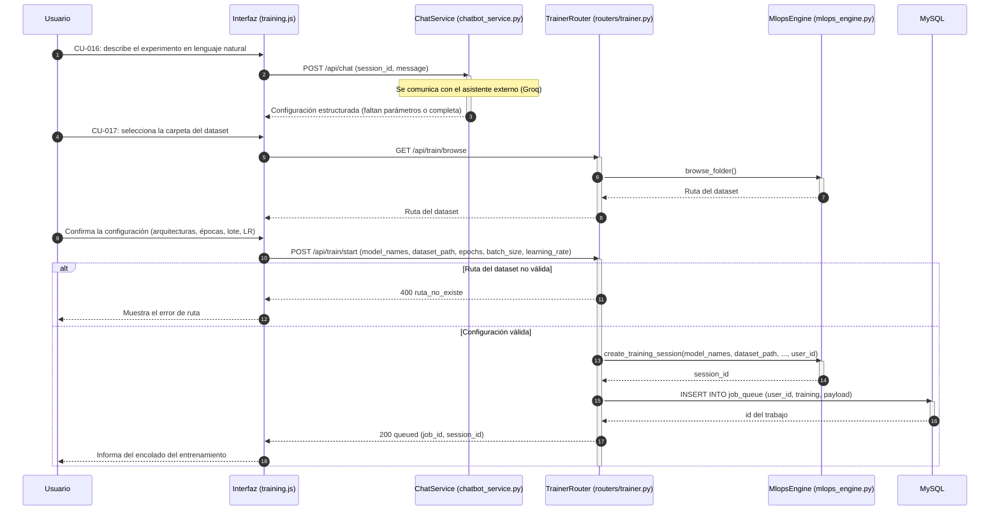
```mermaid
sequenceDiagram
    autonumber
    participant U as Usuario
    participant I as Interfaz (training.js)
    participant C as ChatService (chatbot_service.py)
    participant T as TrainerRouter (routers/trainer.py)
    participant M as MlopsEngine (mlops_engine.py)
    participant BD as MySQL

    U->>I: CU-016: describe el experimento en lenguaje natural
    I->>C: POST /api/chat (session_id, message)
    activate C
    Note over C: Se comunica con el asistente externo (Groq)
    C-->>I: Configuración estructurada (faltan parámetros o completa)
    deactivate C
    U->>I: CU-017: selecciona la carpeta del dataset
    I->>T: GET /api/train/browse
    activate T
    T->>M: browse_folder()
    activate M
    M-->>T: Ruta del dataset
    deactivate M
    T-->>I: Ruta del dataset
    deactivate T
    U->>I: Confirma la configuración (arquitecturas, épocas, lote, LR)
    I->>T: POST /api/train/start (model_names, dataset_path, epochs, batch_size, learning_rate)
    activate T
    alt Ruta del dataset no válida
        T-->>I: 400 ruta_no_existe
        I-->>U: Muestra el error de ruta
    else Configuración válida
        T->>M: create_training_session(model_names, dataset_path, ..., user_id)
        activate M
        M-->>T: session_id
        deactivate M
        T->>BD: INSERT INTO job_queue (user_id, training, payload)
        activate BD
        BD-->>T: id del trabajo
        deactivate BD
        T-->>I: 200 queued (job_id, session_id)
        I-->>U: Informa del encolado del entrenamiento
    end
    deactivate T
```

*Figura 68 - Diagrama de secuencia del CU-018 Lanzar un experimento de entrenamiento*

#### Procesamiento del entrenamiento

El diagrama de la figura 69 muestra el procesamiento asíncrono del entrenamiento. El worker reclama el trabajo de tipo `training` de la cola, lo marca como `running` y encarga al motor el entrenamiento completo. El motor lanza secuencialmente, para cada modelo de la sesión, los scripts de entrenamiento K-fold y de análisis XAI, y finalmente el script de estadística que genera el ranking y la matriz de Wilcoxon; los scripts escriben los artefactos en el directorio de la sesión. Al terminar, el worker marca el trabajo como `completed` con el resultado. Si cualquier paso falla, el trabajo pasa a `failed` con el mensaje de error, de modo que un fallo del entrenamiento no se confunde con un estado completado.

```mermaid
sequenceDiagram
    autonumber
    participant U as Usuario
    participant W as Worker (queue_worker.py)
    participant M as MlopsEngine (mlops_engine.py)
    participant S as Scripts MLOps (pneumoniacnn-main/code)
    participant FS as Sistema de ficheros (training_results)
    participant BD as MySQL

    Note over U: El experimento quedó encolado (Figura 68)
    loop Bucle de la cola
        W->>BD: _next_job(): trabajo queued (training)
        activate BD
        BD-->>W: Trabajo o ninguno
        deactivate BD
        alt No hay trabajo
            W->>W: Espera 1 segundo
        else Trabajo disponible
            W->>BD: _claim_job(): queued a running
            activate BD
            BD-->>W: Reclamado
            deactivate BD
            W->>M: run_training_queue(session_id, models, dataset_path, epochs, batch_size, lr)
            activate M
            loop Por cada modelo de la sesión
                M->>S: 1_train_kfold.py o 2_train_transformer_kfold.py
                M->>S: 6_xai_qualitative.py + 7_xai_quantitative.py
            end
            M->>S: 3_evaluate_statistics.py (ranking + Wilcoxon)
            S->>FS: Escribe CSV, PNG y config en training_results
            M-->>W: Sesión completada
            deactivate M
            W->>BD: _finish_job(): running a completed + result
            activate BD
            BD-->>W: Trabajo completado
            deactivate BD
        end
    end
    opt Error en el procesamiento
        W->>BD: _fail_job(): running a failed + error_message
    end
    Note over U: La interfaz detecta la finalización en los logs (Figura 70)
```

*Figura 69 - Diagrama de secuencia del procesamiento del entrenamiento*

#### CU-019, CU-020 y CU-022 Consultar sesiones y resultados

El diagrama de la figura 70 muestra la consulta de las sesiones y de los resultados de un modelo. El usuario consulta sus sesiones y el motor enumera los directorios de `training_results` filtrando por propiedad. Desde el listado, el usuario consulta los resultados de un modelo: el router comprueba la propiedad y el motor lee las métricas K-fold y los artefactos del modelo, devolviendo los datos para su presentación. La secuencia refleja que la consulta no ejecuta el modelo: lee los resultados ya persistidos durante el entrenamiento.

```mermaid
sequenceDiagram
    autonumber
    participant U as Usuario
    participant I as Interfaz (training.js)
    participant T as TrainerRouter (routers/trainer.py)
    participant M as MlopsEngine (mlops_engine.py)
    participant FS as Sistema de ficheros (training_results)

    U->>I: CU-019: consulta sus sesiones de entrenamiento
    I->>T: GET /api/train/models
    activate T
    T->>M: get_trained_sessions(user_id)
    activate M
    M->>FS: Lista las sesiones del usuario
    FS-->>M: Sesiones con sus modelos
    M-->>T: Sesiones del usuario
    deactivate M
    T-->>I: 200 success (sesiones)
    deactivate T
    I-->>U: Muestra el listado de sesiones
    U->>I: CU-020: consulta los resultados de un modelo
    I->>T: GET /api/train/results/{session_id}/{model_name}
    activate T
    alt Sesión ajena
        T-->>I: 403 no_permiso_sesion
        I-->>U: Muestra el error de permisos
    else Propietario
        T->>M: get_model_results_data(session_id, model_name)
        activate M
        M->>FS: Lee kfold_results.csv y artefactos
        FS-->>M: Métricas y artefactos
        M-->>T: Resultados del modelo
        deactivate M
        T-->>I: 200 success (métricas, calibración, XAI)
        I-->>U: Muestra la tabla K-fold y los artefactos
    end
    deactivate T
```

*Figura 70 - Diagrama de secuencia de los CU-019, CU-020 y CU-022 Consultar sesiones y resultados*

#### CU-023 y CU-024 Comparativa estadística y recálculo

El diagrama de la figura 71 muestra la consulta de la comparativa estadística y su recálculo. El usuario consulta el ranking de la sesión y el motor lee el ranking y el heatmap de Wilcoxon. Cuando solicita el recálculo, el router programa la comparación estadística como tarea de fondo en lugar de encolarla, y responde el inicio del recálculo; la interfaz sondea el estado hasta que la comparativa queda regenerada. La secuencia refleja el canal de ejecución diferenciado de la comparativa, distinto de la cola de trabajos del entrenamiento.

```mermaid
sequenceDiagram
    autonumber
    participant U as Usuario
    participant I as Interfaz (training.js)
    participant T as TrainerRouter (routers/trainer.py)
    participant M as MlopsEngine (mlops_engine.py)
    participant BT as BackgroundTasks
    participant FS as Sistema de ficheros

    U->>I: CU-023: consulta la comparativa estadística
    I->>T: GET /api/train/session/{id}/ranking
    activate T
    T->>M: get_session_ranking_data(session_id)
    activate M
    M->>FS: Lee session_ranking.csv y wilcoxon_heatmap.png
    FS-->>M: Ranking y heatmap
    M-->>T: Datos de la comparativa
    deactivate M
    T-->>I: 200 success (ranking, heatmap)
    deactivate T
    I-->>U: Muestra el ranking y la matriz de Wilcoxon
    U->>I: CU-024: solicita el recálculo de la comparativa
    I->>T: POST /api/train/session/compare
    activate T
    T->>BT: add_task(run_statistical_comparison, session_id)
    activate BT
    BT->>M: run_statistical_comparison(session_id)
    activate M
    M->>FS: 3_evaluate_statistics.py (regenera ranking y Wilcoxon)
    M-->>BT: Comparativa recalculada
    deactivate M
    deactivate BT
    T-->>I: 200 success (recalculo_iniciado)
    deactivate T
    loop Polling de estado (cada 2 segundos)
        I->>T: GET /api/train/session/{id}/recalc_status
        T-->>I: completed / running
    end
    I-->>U: Muestra la comparativa recalculada
```

*Figura 71 - Diagrama de secuencia de los CU-023 y CU-024 Comparativa estadística y recálculo*

#### CU-026 y CU-027 Validación externa

El diagrama de la figura 72 muestra la solicitud de la validación externa y la consulta de sus resultados. El usuario solicita la validación con la ruta del dataset externo; el router valida la propiedad y la ruta y encola el trabajo de tipo `external_validation`. El worker reclama el trabajo y el motor ejecuta la validación sobre los modelos disponibles, escribiendo las métricas, la curva ROC y la matriz de DeLong. Cuando la validación termina, el usuario consulta los resultados: el router comprueba la propiedad y el motor lee los artefactos de la validación externa. La secuencia refleja la separación de la validación externa respecto de la configuración original del experimento.

```mermaid
sequenceDiagram
    autonumber
    participant U as Usuario
    participant I as Interfaz (training.js)
    participant T as TrainerRouter (routers/trainer.py)
    participant M as MlopsEngine (mlops_engine.py)
    participant W as Worker (queue_worker.py)
    participant FS as Sistema de ficheros
    participant BD as MySQL

    U->>I: CU-026: solicita la validación externa de la sesión
    I->>T: POST /api/train/session/external_validation (session_id, dataset_path)
    activate T
    alt Ruta externa no válida
        T-->>I: 400 ruta_externa_invalida
        I-->>U: Muestra el error de ruta
    else Sesión propia y ruta válida
        T->>BD: INSERT INTO job_queue (user_id, external_validation, payload)
        activate BD
        BD-->>T: id del trabajo
        deactivate BD
        T-->>I: 200 queued (job_id)
        I-->>U: Informa del encolado
    end
    deactivate T
    W->>BD: _claim_job(): trabajo external_validation
    activate BD
    BD-->>W: Reclamado
    deactivate BD
    W->>M: run_external_validation(session_id, dataset_path)
    activate M
    M->>FS: 4_external_validation.py + 5_evaluate_delong.py
    FS-->>M: Métricas, ROC y matriz de DeLong
    M-->>W: Validación completada
    deactivate M
    W->>BD: _finish_job(): completed
    activate BD
    BD-->>W: Trabajo completado
    deactivate BD
    Note over U,I: CU-027: consulta de resultados externos
    U->>I: Consulta los resultados de la validación externa
    I->>T: GET /api/train/session/{id}/external_results
    activate T
    T->>M: get_external_results_data(session_id)
    activate M
    M->>FS: Lee métricas, ROC y DeLong
    FS-->>M: Resultados externos
    M-->>T: Métricas y curvas
    deactivate M
    T-->>I: 200 success (metrics, roc, delong)
    deactivate T
    I-->>U: Muestra métricas, ROC y DeLong
```

*Figura 72 - Diagrama de secuencia de los CU-026 y CU-027 Validación externa*

#### CU-028 Generar el informe PDF de la sesión

El diagrama de la figura 73 muestra la generación y descarga del informe PDF. El usuario solicita el informe de la sesión y el router verifica la propiedad; el generador de informes lee la configuración, el ranking, el heatmap de Wilcoxon, la validación externa y las métricas XAI de cada modelo desde el directorio de la sesión, compone el documento y lo escribe como artefacto. El router sirve el PDF como descarga. La secuencia refleja que el informe se genera bajo demanda, cuando la sesión dispone de los datos necesarios.

```mermaid
sequenceDiagram
    autonumber
    participant U as Usuario
    participant I as Interfaz (training.js)
    participant T as TrainerRouter (routers/trainer.py)
    participant P as PdfGeneratorMlops (pdf_generator_mlops.py)
    participant FS as Sistema de ficheros (training_results)

    U->>I: CU-028: solicita el informe PDF de la sesión
    I->>T: GET /api/train/session/{id}/report
    activate T
    T->>P: generate_pdf_report(session_id)
    activate P
    P->>FS: Lee config, ranking, Wilcoxon, validación externa y XAI
    FS-->>P: Datos de la sesión
    P->>FS: Escribe Informe_Completo_{session_id}.pdf
    P-->>T: Ruta del informe
    deactivate P
    T-->>I: FileResponse (PDF descargable)
    deactivate T
    I-->>U: Descarga el informe PDF de la sesión
```

*Figura 73 - Diagrama de secuencia del CU-028 Generar el informe PDF de la sesión*

#### CU-029 y CU-030 Renombrar y eliminar una sesión

El diagrama de la figura 74 muestra el renombrado y la eliminación de una sesión. Para renombrar, el usuario indica el nuevo nombre, el router comprueba la propiedad y el motor valida y ejecuta el renombrado del directorio. Para eliminar, la interfaz pide confirmación y, tras ella, el router comprueba la propiedad y el motor borra el directorio de la sesión y sus artefactos. La secuencia refleja que ambas operaciones quedan condicionadas a la propiedad de la sesión, que se resuelve antes de cualquier modificación del sistema de ficheros.

```mermaid
sequenceDiagram
    autonumber
    participant U as Usuario
    participant I as Interfaz (training.js)
    participant T as TrainerRouter (routers/trainer.py)
    participant M as MlopsEngine (mlops_engine.py)
    participant FS as Sistema de ficheros (training_results)

    U->>I: CU-029: renombra la sesión
    I->>T: POST /api/train/session/rename (old_name, new_name)
    activate T
    alt Sesión ajena
        T-->>I: 403 no_permiso_renombrar
        I-->>U: Muestra el error de permisos
    else Propietario
        T->>M: safe_rename(old_name, new_name)
        activate M
        alt Nombre inválido o duplicado
            M-->>T: 400
            T-->>I: 400
            I-->>U: Muestra el error
        else Renombrado
            M->>FS: os.rename (directorio de la sesión)
            M-->>T: 200
            deactivate M
            T-->>I: 200 success
            I-->>U: Muestra el nuevo nombre de la sesión
        end
    end
    deactivate T
    U->>I: CU-030: elimina la sesión
    I->>U: Pide confirmación de la eliminación
    U->>I: Confirma la eliminación
    I->>T: DELETE /api/train/session/{session_id}
    activate T
    alt Sesión ajena
        T-->>I: 403 no_permiso_eliminar
        I-->>U: Muestra el error de permisos
    else Propietario
        T->>M: delete_session(session_id)
        activate M
        M->>FS: shutil.rmtree (directorio de la sesión)
        M-->>T: 200
        deactivate M
        T-->>I: 200 success
        I-->>U: La sesión desaparece del laboratorio
    end
    deactivate T
```

*Figura 74 - Diagrama de secuencia de los CU-029 y CU-030 Renombrar y eliminar una sesión*

## 20.5 Subsistema de diseño SD-005: Supervisión y administración

El subsistema SD-005 deriva del subsistema de análisis SS-005 y reúne las operaciones que solo puede realizar un usuario con rol de administrador. Su objetivo es proporcionar una visión supervisada del uso de la plataforma sin mezclar las operaciones administrativas con las rutas que utiliza un usuario ordinario. Agrupa los casos de uso CU-031 a CU-033, que materializan la consulta del listado de usuarios, la consulta de las consultas de un usuario concreto y la visualización del detalle de una de esas consultas. El análisis asignó a SS-005 también la gestión de cuentas de usuario (CU-038), pero esa operación no se materializa en el diseño actual: la responsabilidad presente de SD-005 es de consulta y supervisión, tal y como se declaró en el capítulo 17, de modo que no se describen aquí casos de uso reales para una funcionalidad no implementada.

El subsistema se apoya en `routers/admin.py`, que centraliza la comprobación de permisos mediante `_require_admin()`. La función obtiene primero la identidad desde el token de acceso de SD-001 y consulta el rol en la tabla `users`, devolviendo en la práctica un resultado ternario: no hay identidad, existe identidad sin privilegios o existe identidad con rol de administrador. Cada endpoint interpreta ese resultado antes de abrir la consulta global correspondiente, de modo que una ruta administrativa nunca ejecuta una consulta de usuarios o de consultas antes de haber comprobado el permiso. El router diferencia así una petición no autenticada (HTTP 401), una petición autenticada sin permisos (HTTP 403) y una petición administrativa válida.

SD-005 no duplica la lógica de propiedad del historial ni del laboratorio. Su responsabilidad es establecer la autorización administrativa y coordinar las consultas globales; la lectura de los datos sigue utilizando las mismas tablas y servicios que el resto de la aplicación. La vista global combina además las dos fuentes de persistencia de la plataforma: los usuarios y el número de diagnósticos se obtienen mediante una consulta agregada sobre `users` y `consultations`, mientras que el número de sesiones del laboratorio se calcula inspeccionando las configuraciones disponibles en el directorio `training_results`. La protección del subsistema reutiliza la identidad de SD-001 y no implementa una segunda autenticación ni una gestión de tokens propia, y el registro de auditoría administrativa que el análisis contempla (RNF-006) debe considerarse una condición pendiente del modelo operativo, porque el subsistema no escribe actualmente una traza independiente en cada operación.

### 20.5.1 Diagrama de casos de uso del subsistema

El diagrama de casos de uso de SD-005 recoge las tres interacciones de supervisión que el subsistema pone a disposición del administrador, y es una adaptación del diagrama del módulo de supervisión y administración definido en el análisis (figura 6), limitada a los casos de uso que se materializan en el diseño. El diagrama conserva las relaciones de extensión de la cadena de navegación del análisis: desde el listado de usuarios (CU-031) se accede a las consultas de un usuario (CU-032), y desde ellas al detalle completo de una consulta (CU-033), de modo que el administrador puede profundizar progresivamente en la información que necesita. La gestión de cuentas (CU-038), que el análisis representaba como operación independiente, no se dibuja aquí por ser una condición pendiente del diseño. El diagrama se representa a continuación.

```mermaid
flowchart LR
    subgraph SD005["SD-005: Supervisión y administración"]
        CU31["CU-031 Consultar listado de usuarios"]
        CU32["CU-032 Consultar consultas de un usuario"]
        CU33["CU-033 Ver detalle de una consulta"]
    end
    A["Administrador"] --> CU31
    A --> CU32
    A --> CU33
    CU31 -.->|"«extend»"| CU32
    CU32 -.->|"«extend»"| CU33
```

*Figura 75 - Diagrama de casos de uso del subsistema SD-005*

El diagrama distingue un único actor, el administrador, que es un usuario autenticado con el rol de administración. Los tres casos de uso se encadenan mediante relaciones de extensión que reflejan la navegación del administrador desde el listado general hasta el caso concreto: partiendo de la visión global de las cuentas, puede descender a la actividad de una cuenta y, si lo necesita, al detalle de una consulta individual con su imagen, su resultado y sus metadatos. Esta progresión, idéntica a la del análisis, se conserva en el diseño porque las tres operaciones comparten la misma política de autorización administrativa y la misma frontera de consulta, sin operaciones de modificación general.

### 20.5.2 Casos de uso reales del subsistema

Los casos de uso reales de SD-005 concretan cada interacción del diagrama en decisiones técnicas de implementación. El elemento común de los tres es la comprobación de permisos que abre cada endpoint: ninguna consulta administrativa se ejecuta sin haber resuelto antes la identidad y el rol del solicitante. Cada caso de uso real se describe a continuación.

#### CU-031 Consultar el listado de usuarios

La consulta del listado se materializa en el endpoint `GET /api/admin/users`, que combina la información relacional de los usuarios con la información del sistema de ficheros sobre las sesiones del laboratorio. Las decisiones técnicas del caso de uso real son las siguientes:

- **Comprobación de permisos**: el router invoca `_require_admin()`, que resuelve la identidad con SD-001 y consulta el rol en la tabla `users`. Sin identidad responde HTTP 401, y con identidad sin rol de administrador responde HTTP 403; el listado solo se abre con rol administrativo.
- **Consulta agregada**: el router ejecuta una consulta que combina `users` con `consultations` mediante una unión izquierda, obteniendo el número de diagnósticos de cada usuario mediante un recuento distinto sobre las consultas, y ordena el resultado por nombre de usuario.
- **Conteo de sesiones del laboratorio**: el router inspecciona el directorio `training_results` y, a partir de las configuraciones de cada sesión, calcula el número de sesiones por usuario, incorporándolo a cada fila del listado. Esta decisión refleja la persistencia híbrida de la plataforma: la información relacional se consulta en MySQL y parte de los artefactos de las sesiones se conserva en el sistema de ficheros.
- **Respuesta al cliente**: el sistema responde HTTP 200 con el listado de usuarios, sus recuentos de diagnósticos y de sesiones del laboratorio, y la interfaz administrativa lo presenta como el punto de partida de la supervisión.

#### CU-032 Consultar las consultas de un usuario

La consulta de las consultas de un usuario se materializa en el endpoint `GET /api/admin/users/{user_id}/consultations`, que recupera la actividad clínica de una cuenta concreta junto con sus sesiones del laboratorio. El diseño conserva la granularidad de la interfaz administrativa: una ruta por cada nivel de supervisión. Las decisiones técnicas del caso de uso real son las siguientes:

- **Comprobación de permisos**: el router aplica la misma `_require_admin()` de CU-031, con las mismas respuestas HTTP 401 y 403.
- **Existencia del usuario objetivo**: antes de recuperar la actividad, el router comprueba que el usuario consultado exista; en caso contrario, responde HTTP 404 con el mensaje de usuario no encontrado.
- **Recuperación de las consultas**: el router selecciona las consultas del usuario desde `consultations`, filtradas por el identificador del usuario y ordenadas por fecha descendente, y formatea las fechas antes de formar la respuesta JSON.
- **Recuperación de las sesiones del laboratorio**: la misma operación recupera las sesiones de entrenamiento del usuario mediante `get_trained_sessions()` de `mlops_engine`, de modo que la vista administrativa ofrece el panorama completo de la actividad de la cuenta.
- **Respuesta al cliente**: el sistema responde HTTP 200 con las consultas y las sesiones del usuario, y la interfaz las muestra como el segundo nivel de la supervisión, desde el que se alcanza el detalle de una consulta.

#### CU-033 Ver el detalle de una consulta de un usuario

La visualización del detalle se materializa en el endpoint `GET /api/admin/consultations/{consultation_id}`, que recupera la consulta completa para la auditoría de un caso concreto. El diseño aprovecha la misma política de autorización administrativa, sin duplicar la comprobación de propiedad del historial: el administrador accede por su rol, no por ser propietario de la consulta. Las decisiones técnicas del caso de uso real son las siguientes:

- **Comprobación de permisos**: el router aplica `_require_admin()`, con las mismas respuestas HTTP 401 y 403 que el resto de las operaciones administrativas.
- **Recuperación de la consulta**: el router selecciona la consulta completa desde `consultations` por su identificador, incluidas las rutas de la imagen, del mapa XAI y del informe PDF, la predicción, la confianza, el nombre y la fecha.
- **Respuestas diferenciadas**: el sistema responde HTTP 404 si la consulta no existe y HTTP 200 con el detalle cuando existe, de modo que la interfaz distingue la ausencia del registro de un fallo de permisos.
- **Presentación del detalle**: la interfaz muestra el detalle con la radiografía original, el mapa de explicabilidad, el resultado, la confianza, el modelo y los metadatos, servidos mediante las rutas estáticas de la aplicación, completando así la cadena de supervisión desde el listado general hasta la consulta individual.

### 20.5.3 Diagramas de interacción entre objetos

Los diagramas de interacción de SD-005 muestran cómo colaboran los componentes del subsistema para realizar los casos de uso reales. Los tres comparten el mismo punto de partida: el router resuelve la identidad y el rol del solicitante mediante `_require_admin()` antes de abrir cualquier consulta global, de modo que las rutas administrativas no ejecutan operaciones de lectura sobre usuarios o consultas sin la autorización correspondiente. Se emplea la misma notación de secuencia del UML utilizada en los apartados anteriores.

#### CU-031 Consultar el listado de usuarios

El diagrama de la figura 76 muestra la consulta del listado de usuarios. La interfaz solicita el listado y el router comprueba la autorización, con las alternativas de ausencia de identidad (401) y de identidad sin privilegios (403). Con rol administrativo, el router consulta los usuarios con el recuento de diagnósticos en la base de datos, inspecciona el sistema de ficheros para contar las sesiones del laboratorio por usuario y devuelve el listado completo. La secuencia refleja la doble fuente de información de la vista global: MySQL para los datos relacionales y el sistema de ficheros para las sesiones.

```mermaid
sequenceDiagram
    autonumber
    participant A as Administrador
    participant I as Interfaz (admin.js)
    participant R as AdminRouter (routers/admin.py)
    participant FS as Sistema de ficheros (training_results)
    participant BD as MySQL

    A->>I: Accede al panel de administración
    I->>R: GET /api/admin/users
    activate R
    R->>R: _require_admin(): identidad + rol
    alt Sin identidad
        R-->>I: 401 No autenticado
        I-->>A: Requiere iniciar sesión
    else Usuario sin rol de administrador
        R-->>I: 403 Se requieren permisos de administrador
        I-->>A: Muestra el error de permisos
    else Administrador
        R->>BD: SELECT users + COUNT(consultations) (agregado)
        activate BD
        BD-->>R: Usuarios con número de diagnósticos
        deactivate BD
        R->>FS: Inspecciona config.json de training_results
        activate FS
        FS-->>R: Sesiones del laboratorio por usuario
        deactivate FS
        R-->>I: 200 success (usuarios con recuentos)
        I-->>A: Muestra el listado de usuarios
    end
    deactivate R
```

*Figura 76 - Diagrama de secuencia del CU-031 Consultar el listado de usuarios*

#### CU-032 Consultar las consultas de un usuario

El diagrama de la figura 77 muestra la consulta de las consultas de un usuario. El administrador selecciona un usuario del listado y el router comprueba la autorización. Con rol administrativo, comprueba que el usuario exista (404 en caso contrario) y recupera sus consultas desde la base de datos, además de sus sesiones del laboratorio mediante el motor MLOps. La secuencia refleja que SD-005 coordina la consulta global reutilizando los mismos servicios del resto de la aplicación, sin duplicar la lógica de acceso a los datos.

```mermaid
sequenceDiagram
    autonumber
    participant A as Administrador
    participant I as Interfaz (admin.js)
    participant R as AdminRouter (routers/admin.py)
    participant M as MlopsEngine (mlops_engine.py)
    participant FS as Sistema de ficheros (training_results)
    participant BD as MySQL

    A->>I: Selecciona un usuario del listado
    I->>R: GET /api/admin/users/{user_id}/consultations
    activate R
    R->>R: _require_admin(): identidad + rol
    alt Sin identidad
        R-->>I: 401 No autenticado
        I-->>A: Requiere iniciar sesión
    else Usuario sin rol de administrador
        R-->>I: 403 Se requieren permisos de administrador
        I-->>A: Muestra el error de permisos
    else Administrador
        R->>BD: SELECT id, username FROM users WHERE id = %s
        activate BD
        BD-->>R: Usuario objetivo / inexistente
        deactivate BD
        alt Usuario inexistente
            R-->>I: 404 Usuario no encontrado
            I-->>A: Muestra el error
        else Usuario existente
            R->>BD: SELECT consultas WHERE user_id = %s ORDER BY timestamp DESC
            activate BD
            BD-->>R: Consultas del usuario
            deactivate BD
            R->>M: get_trained_sessions(user_id)
            activate M
            M->>FS: Lista las sesiones del usuario
            FS-->>M: Sesiones del laboratorio
            M-->>R: Sesiones del usuario
            deactivate M
            R-->>I: 200 success (consultas + sesiones)
            I-->>A: Muestra las consultas y sesiones del usuario
        end
    end
    deactivate R
```

*Figura 77 - Diagrama de secuencia del CU-032 Consultar las consultas de un usuario*

#### CU-033 Ver el detalle de una consulta de un usuario

El diagrama de la figura 78 muestra la visualización del detalle de una consulta. El administrador selecciona una consulta de las del usuario y el router comprueba la autorización; con rol administrativo, recupera la consulta por su identificador (404 si no existe) y la devuelve a la interfaz, que carga la imagen y el mapa desde el almacenamiento estático. La secuencia refleja que el acceso administrativo se concede por el rol y no por la propiedad, sin duplicar la comprobación de propiedad del historial.

```mermaid
sequenceDiagram
    autonumber
    participant A as Administrador
    participant I as Interfaz (admin.js)
    participant R as AdminRouter (routers/admin.py)
    participant F as StaticFiles
    participant BD as MySQL

    A->>I: Selecciona una consulta de las del usuario
    I->>R: GET /api/admin/consultations/{consultation_id}
    activate R
    R->>R: _require_admin(): identidad + rol
    alt Sin identidad
        R-->>I: 401 No autenticado
        I-->>A: Requiere iniciar sesión
    else Usuario sin rol de administrador
        R-->>I: 403 Se requieren permisos de administrador
        I-->>A: Muestra el error de permisos
    else Administrador
        R->>BD: SELECT consulta WHERE id = %s
        activate BD
        BD-->>R: Consulta / inexistente
        deactivate BD
        alt Consulta inexistente
            R-->>I: 404 Consulta no encontrada
            I-->>A: Muestra el error
        else Consulta existente
            R-->>I: 200 success (detalle de la consulta)
            I->>F: GET /static/uploads/* + /static/results/xai_*
            F-->>I: Imagen original y mapa XAI
            I-->>A: Muestra el detalle de la consulta
        end
    end
    deactivate R
```

*Figura 78 - Diagrama de secuencia del CU-033 Ver el detalle de una consulta*

## 20.6 Subsistema de diseño SD-006: Cola de trabajos y capacidades transversales

El subsistema SD-006 materializa el subsistema de análisis SS-006 y reúne las capacidades que sirven de apoyo a varios flujos funcionales. Su núcleo es la cola persistente de trabajos, utilizada por los diagnósticos (SD-002) y por los entrenamientos y las validaciones externas (SD-004). Junto a la cola, el subsistema incluye las capacidades transversales de la interfaz: la consulta del estado de los trabajos, la cancelación de un trabajo pendiente y la alternancia del tema visual. Agrupa los casos de uso CU-034 a CU-036, disponibles para todo usuario autenticado con independencia del núcleo funcional en el que trabaje, y constituye el servicio común de ejecución asíncrona sobre el que se apoyan los subsistemas funcionales.

El subsistema se apoya en `routers/queue.py`, que expone la consulta del estado de los trabajos y la cancelación de un trabajo pendiente, y en `services/queue_worker.py`, que actúa como consumidor de la cola: al iniciar la aplicación restablece los trabajos que quedaron en estado `running`, selecciona el siguiente trabajo pendiente y lo reclama mediante una actualización condicionada a que siga en `queued`, para después ejecutar el flujo correspondiente en el executor y marcar el resultado como completado o fallido. El worker comparte la persistencia con los routers, pero no comparte con ellos el ciclo de petición: esta es la frontera que permite mantener disponible la interfaz durante las tareas de larga duración. La parte de internacionalización se concentra en `services/lang.py`, y los recursos JavaScript aplican el idioma y el tema visual en el navegador.

La cola define una máquina de estados compartida por los subsistemas que generan trabajos. El estado `queued` indica que la petición ha sido aceptada y espera procesamiento; `running` indica que el worker la ha reclamado; `completed` conserva un resultado; `failed` conserva el error; y `cancelled` identifica una cancelación solicitada por el usuario antes del inicio. No todos los estados se alcanzan desde todas las rutas: la cancelación solo opera sobre los trabajos en `queued`, y un trabajo en `running` no se interrumpe mediante una actualización administrativa. La cola aplica además una política de ordenación que prioriza los trabajos de diagnóstico frente a los de entrenamiento, de modo que la posición que observa el usuario se calcula desde el router y se adapta al tipo de trabajo.

### 20.6.1 Diagrama de casos de uso del subsistema

El diagrama de casos de uso de SD-006 recoge las tres interacciones transversales que el subsistema pone a disposición del usuario autenticado, y es una adaptación del diagrama del módulo de capacidades transversales definido en el análisis (figura 7), limitada al ámbito del subsistema de diseño. El diagrama no presenta relaciones de inclusión o extensión: la consulta de la cola, la cancelación de trabajos y el cambio de tema se ejecutan de forma autónoma, sin delegar pasos obligatorios en otros casos ni ampliar ningún flujo base. La cancelación de un trabajo (CU-035) se describe de forma coherente con la consulta de la cola (CU-034), porque es desde el panel de la cola donde el usuario identifica el trabajo que desea cancelar, aunque ambas operaciones se representan como casos de uso independientes. El diagrama se representa a continuación.

```mermaid
flowchart LR
    subgraph SD006["SD-006: Cola de trabajos y capacidades transversales"]
        CU34["CU-034 Consultar estado de la cola"]
        CU35["CU-035 Cancelar trabajo pendiente"]
        CU36["CU-036 Alternar tema visual"]
    end
    U["Usuario autenticado"] --> CU34
    U --> CU35
    U --> CU36
```

*Figura 79 - Diagrama de casos de uso del subsistema SD-006*

El diagrama distingue un único actor, el usuario autenticado, que reúne a todos los perfiles con cuenta registrada, incluido el administrador. Los tres casos de uso se representan como interacciones directas e independientes del actor con el sistema, en coherencia con la naturaleza transversal del subsistema: cualquiera de ellos puede ejecutarse desde cualquier núcleo funcional, sin relaciones de dependencia entre sí. El panel de la cola, que materializa la consulta del estado (CU-034), es el punto de partida natural de la cancelación (CU-035), pero el análisis mantiene ambas operaciones separadas porque la cancelación no forma parte obligatoria del flujo de consulta.

### 20.6.2 Casos de uso reales del subsistema

Los casos de uso reales de SD-006 concretan cada interacción del diagrama en decisiones técnicas de implementación. Los dos primeros se apoyan en el router de la cola y reflejan la máquina de estados del subsistema; el tercero se resuelve íntegramente en el navegador, sin intervención del servidor. Cada caso de uso real se describe a continuación.

#### CU-034 Consultar el estado de la cola de trabajos

La consulta del estado de la cola se materializa en el endpoint `GET /api/queue/status`, que devuelve los trabajos recientes del usuario autenticado y su estado. El diseño interpreta el payload de cada trabajo según su tipo, de modo que la interfaz muestra el nombre del modelo o el identificador de la sesión sin recibir el contenido interno completo del payload. Las decisiones técnicas del caso de uso real son las siguientes:

- **Autenticación**: el router resuelve la identidad con SD-001 y responde HTTP 401 si no hay sesión válida.
- **Filtrado por usuario**: la consulta recupera los últimos veinte trabajos del usuario, de modo que el panel solo refleja la actividad de la cuenta que lo consulta (RF-005).
- **Interpretación del payload**: el router deserializa el payload y expone los campos relevantes según el tipo: el nombre del modelo para los diagnósticos, el identificador de la sesión y los modelos para los entrenamientos, y el identificador de la sesión con los modelos leídos de su configuración para las validaciones externas. El payload completo no se envía al navegador.
- **Posición en la cola**: para los trabajos en `queued`, el router calcula su posición mediante la consulta de posición, que respeta la prioridad de la cola según el tipo de trabajo.
- **Respuesta al cliente**: el sistema responde HTTP 200 con los trabajos, su estado, el indicador de trabajos pendientes y el recuento de encolados; la interfaz actualiza el panel de forma periódica para reflejar la progresión de los diagnósticos, los entrenamientos y las validaciones externas.

#### CU-035 Cancelar un trabajo de la cola

La cancelación se materializa en el endpoint `DELETE /api/queue/cancel/{job_id}`, que aplica una actualización condicional sobre el trabajo. El diseño adopta una restricción deliberada: solo puede cancelarse un trabajo que pertenezca al usuario y que continúe en estado `queued`. Si el worker ya lo ha reclamado, la operación no lo interrumpe de forma abrupta, de modo que la cancelación no produce inconsistencias entre el estado persistido y el cálculo que ya se está ejecutando. Las decisiones técnicas del caso de uso real son las siguientes:

- **Autenticación y propiedad**: el router resuelve la identidad con SD-001 y condiciona la actualización al identificador del usuario, de modo que un trabajo ajeno no puede cancelarse.
- **Actualización condicional**: la cancelación ejecuta una actualización que exige que el trabajo continúe en `queued`; solo si la actualización afecta a una fila se considera cancelado el trabajo.
- **Respuestas diferenciadas**: si la actualización afectó a una fila, el sistema responde HTTP 200 con el trabajo cancelado; en caso contrario, responde HTTP 404 indicando que el trabajo no fue encontrado o ya no está en cola.
- **Alcance de la cancelación**: la operación cubre los trabajos pendientes de diagnóstico, entrenamiento y validación externa, pero no interrumpe los trabajos en ejecución. Esta decisión difiere del flujo del análisis, que preveía interrumpir los trabajos en ejecución cuando resultara técnicamente posible; el diseño actual documenta esa limitación y mantiene el estado `running` intacto.

#### CU-036 Alternar el tema visual de la interfaz

La alternancia del tema se materializa en el navegador, mediante los recursos JavaScript de la interfaz, sin intervención del servidor. El diseño trata el tema como una preferencia de presentación que se aplica de forma inmediata y persiste durante la navegación. Las decisiones técnicas del caso de uso real son las siguientes:

- **Cambio en el navegador**: la función `toggleTheme()` de los recursos JavaScript aplica o elimina la clase del tema oscuro en el elemento raíz de la página, de modo que el cambio se propaga a toda la interfaz sin recargar.
- **Persistencia de la preferencia**: el tema seleccionado se guarda en el almacenamiento local del navegador, de modo que se restaura en las sucesivas vistas del usuario.
- **Restauración automática**: al cargar la interfaz, la preferencia guardada se aplica y, en ausencia de preferencia, se respeta la configuración del sistema operativo del usuario mediante la consulta de preferencia de color.
- **Independencia del servidor**: la operación no requiere una nueva ruta ni una modificación de estado persistida en el servidor; se resuelve como un mecanismo transversal de presentación de la interfaz.

### 20.6.3 Diagramas de interacción entre objetos

Los diagramas de interacción de SD-006 muestran cómo colaboran los componentes del subsistema para realizar los casos de uso reales. Los dos primeros reflejan la máquina de estados de la cola y su frontera con el ciclo de petición, mientras que el tercero se resuelve íntegramente en el navegador. Se emplea la misma notación de secuencia del UML utilizada en los apartados anteriores.

#### CU-034 Consultar el estado de la cola de trabajos

El diagrama de la figura 80 muestra la consulta del estado de la cola. La interfaz consulta periódicamente el router de la cola, que recupera los últimos trabajos del usuario. Para los trabajos de validación externa, el router lee la configuración de la sesión en el sistema de ficheros para obtener los modelos; a continuación interpreta el payload según el tipo y calcula la posición de los trabajos encolados, devolviendo el estado al panel. La secuencia refleja que el panel se actualiza de forma periódica y que el payload completo de los trabajos no llega al navegador.

```mermaid
sequenceDiagram
    autonumber
    participant U as Usuario
    participant I as Interfaz (dashboard.js)
    participant Q as QueueRouter (routers/queue.py)
    participant FS as Sistema de ficheros (training_results)
    participant BD as MySQL

    U->>I: Accede al panel de la cola de trabajos
    loop Actualización periódica
        I->>Q: GET /api/queue/status
        activate Q
        Q->>BD: Últimos 20 trabajos del usuario
        activate BD
        BD-->>Q: Trabajos del usuario
        deactivate BD
        alt Trabajo external_validation
            Q->>FS: Lee config.json de la sesión (modelos)
            FS-->>Q: Modelos de la sesión
        end
        Q->>Q: Interpreta el payload por tipo (modelo o sesión)
        Q->>BD: Posición de los trabajos queued
        activate BD
        BD-->>Q: Posición
        deactivate BD
        Q-->>I: Estado de los trabajos (queued / running / completed / failed)
        deactivate Q
        I-->>U: Muestra el panel de la cola actualizado
    end
```

*Figura 80 - Diagrama de secuencia del CU-034 Consultar el estado de la cola de trabajos*

#### CU-035 Cancelar un trabajo de la cola

El diagrama de la figura 81 muestra la cancelación de un trabajo. El usuario solicita la cancelación desde el panel y el router resuelve la identidad; con sesión válida, ejecuta la actualización condicionada a que el trabajo pertenezca al usuario y continúe en `queued`. Si la actualización afecta a una fila, el trabajo queda cancelado y desaparece del panel; si no, el sistema responde 404 informando de que el trabajo ya no está en cola, lo que cubre los trabajos en ejecución y los finalizados. La secuencia refleja la restricción deliberada del diseño: un trabajo reclamado por el worker no se interrumpe.

```mermaid
sequenceDiagram
    autonumber
    participant U as Usuario
    participant I as Interfaz (dashboard.js)
    participant Q as QueueRouter (routers/queue.py)
    participant BD as MySQL

    U->>I: Solicita cancelar un trabajo del panel de la cola
    I->>Q: DELETE /api/queue/cancel/{job_id}
    activate Q
    Q->>Q: get_user_id_from_token (SD-001)
    alt Sin sesión
        Q-->>I: 401 No autenticado
        I-->>U: Requiere iniciar sesión
    else Sesión válida
        Q->>BD: UPDATE job_queue SET cancelled WHERE id AND user_id AND status = queued
        activate BD
        BD-->>Q: Fila afectada / ninguna
        deactivate BD
        alt Trabajo pendiente cancelado
            Q-->>I: 200 success (Trabajo cancelado)
            I-->>U: El trabajo desaparece del panel
        else Trabajo no pendiente (en ejecución o finalizado)
            Q-->>I: 404 Trabajo no encontrado o ya no está en cola
            I-->>U: Informa de que el trabajo no puede cancelarse
        end
    end
    deactivate Q
```

*Figura 81 - Diagrama de secuencia del CU-035 Cancelar un trabajo de la cola*

#### CU-036 Alternar el tema visual de la interfaz

El diagrama de la figura 82 muestra la alternancia del tema visual. El usuario activa el cambio y la interfaz aplica o elimina la clase del tema oscuro en el elemento raíz, guarda la preferencia en el almacenamiento local y presenta la interfaz con el tema seleccionado. La secuencia se resuelve íntegramente en el navegador: no interviene el servidor, de modo que el cambio es inmediato y no interrumpe la navegación ni el estado del trabajo en curso.

```mermaid
sequenceDiagram
    autonumber
    participant U as Usuario
    participant I as Interfaz (i18n.js)

    U->>I: Activa el cambio de tema
    I->>I: toggleTheme(): aplica o elimina la clase dark en <html>
    I->>I: Guarda la preferencia en localStorage["theme"]
    Note over U,I: El cambio se aplica de inmediato en toda la interfaz
    I-->>U: Interfaz mostrada con el tema seleccionado
```

*Figura 82 - Diagrama de secuencia del CU-036 Alternar el tema visual de la interfaz*
