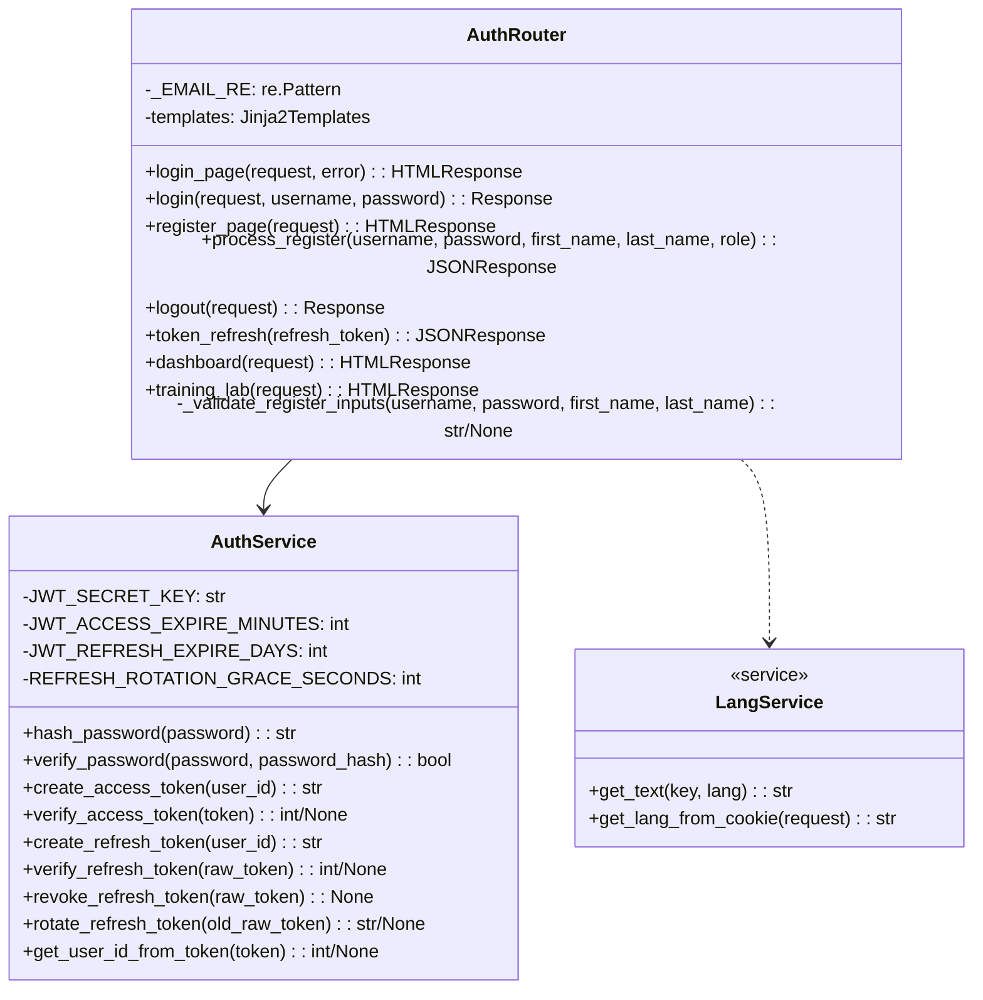
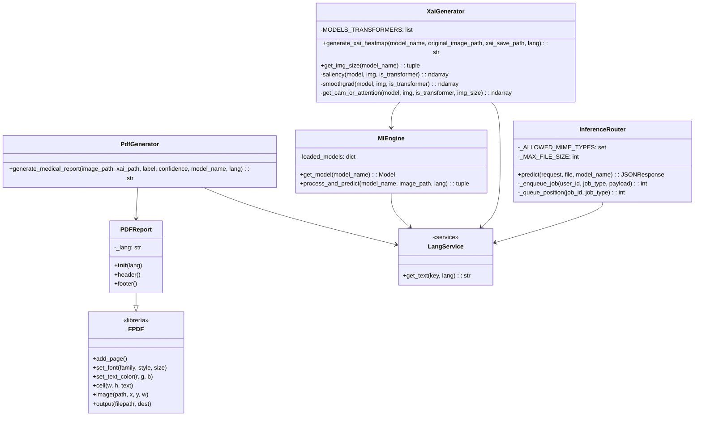
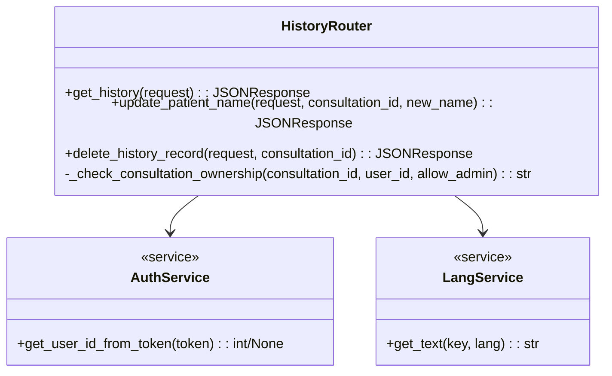
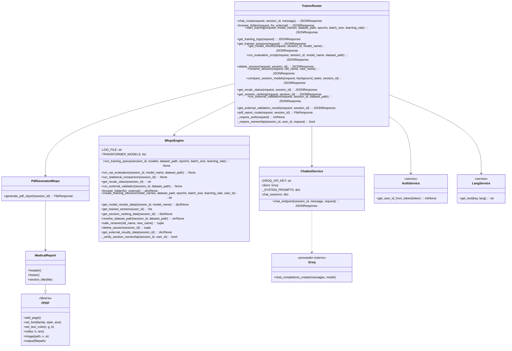
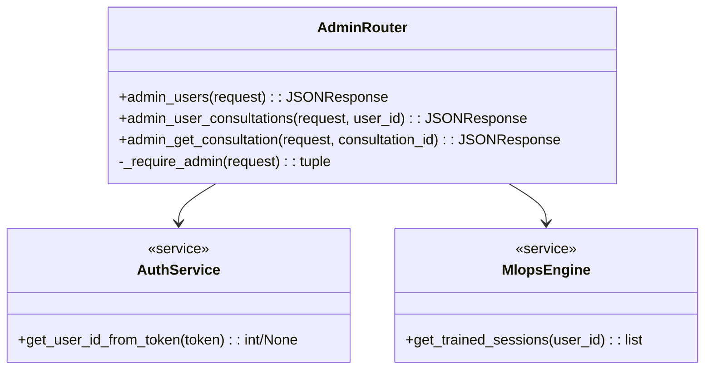
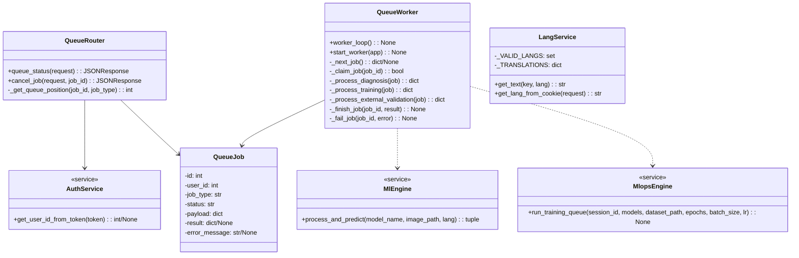
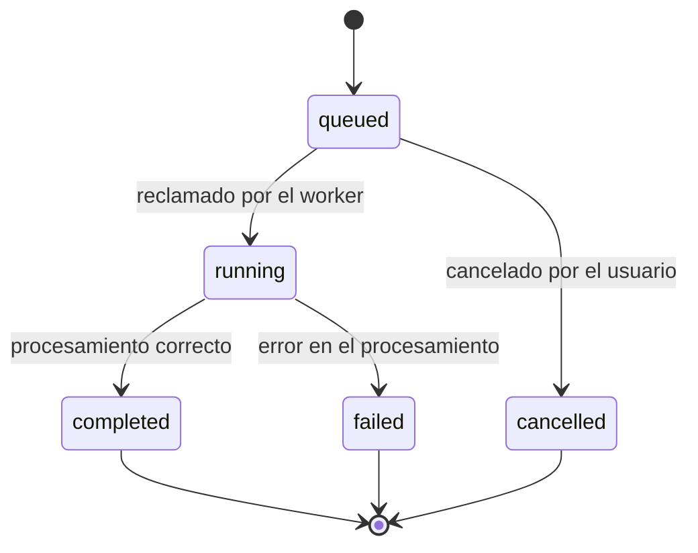

# Capítulo 21: Estructura de clases del diseño

Este capítulo traduce la arquitectura de vitalXAI a una vista estática orientada a la implementación. Para cada subsistema se indica qué componentes se han modelado, qué información manejan, qué operaciones ofrecen y con qué otros componentes colaboran. La vista complementa los diagramas de interacción del capítulo 20: aquellos describen el orden temporal de los mensajes, mientras que este capítulo fija la organización de las responsabilidades, los datos y las dependencias. El criterio sigue la separación habitual entre estructura y comportamiento en el modelado UML (Larman, 2004), pero las clases y operaciones descritas a continuación se han derivado de los módulos reales del proyecto.

El capítulo se organiza siguiendo la misma estructura de subsistemas de diseño del capítulo 17: cada apartado corresponde a un subsistema (SD-001 a SD-006) y agrupa las clases que materializan su responsabilidad. Para cada subsistema se presentan dos elementos: el diagrama de clases, que representa gráficamente las clases del subsistema con sus atributos, sus operaciones y sus relaciones, incluidas las clases abstractas, las herencias y las asociaciones cuando existen, y la especificación de las clases, que detalla cada clase mediante la ficha formal CL-NNNN con sus atributos, sus operaciones y sus comentarios. Para las clases más complejas se añade, cuando procede, un diagrama de transición de estados que permite comprender la funcionalidad soportada por dicha clase.

Las clases de diseño de vitalXAI se corresponden con los componentes reales del sistema descritos en el capítulo 17. Aunque la implementación está orientada a módulos funcionales, routers, servicios y worker, cada módulo se modela aquí como una clase de diseño que agrupa sus responsabilidades. La trazabilidad con el diseño de casos de uso se mantiene en cada ficha: las operaciones de cada clase materializan los mensajes que los diagramas de secuencia del capítulo 20 asignaron al componente correspondiente, y las asociaciones del modelo de clases reflejan las dependencias de colaboración entre routers y servicios.

## 21.1 Subsistema SD-001: Acceso, identidad y gestión de sesiones

El subsistema SD-001 materializa las responsabilidades de acceso, identidad y gestión de sesiones descritas en el capítulo 17 y agrupa dos clases de diseño propias. La clase `AuthRouter` se corresponde con el router `routers/auth.py` y actúa como fachada HTTP del subsistema: sirve las páginas de inicio de sesión y registro, procesa los formularios y gestiona las cookies de sesión. La clase `AuthService` se corresponde con el servicio `services/auth_service.py` y concentra la lógica criptográfica y el ciclo de vida de las credenciales: el hash de las contraseñas, la firma y verificación de los tokens de acceso, la gestión de los tokens de refresco y la rotación con detección de robo. El subsistema depende además del servicio de idioma `LangService`, que pertenece a SD-006 y proporciona los mensajes localizados que el router emplea en sus respuestas.

### 21.1.1 Diagrama de clases del subsistema

El modelo de clases de SD-001 se representa en la figura 83. El diagrama muestra las dos clases propias del subsistema, sus atributos y operaciones, y la dependencia hacia el servicio de idioma, que se representa como una clase de otro subsistema. La clase `AuthRouter` presenta la expresión regular de validación del correo electrónico, el motor de plantillas y las operaciones que sirven las páginas y procesan los formularios; la clase `AuthService` presenta los parámetros de configuración de las credenciales y las operaciones criptográficas y de gestión de tokens.

*Figura 83 - Diagrama de clases del subsistema SD-001*

El diagrama identifica la asociación principal del subsistema: la dependencia de `AuthRouter` hacia `AuthService`, que materializa la delegación de toda la lógica criptográfica y de tokens del router al servicio. Esta separación de responsabilidades, ya declarada en el capítulo 17, mantiene al router como una fachada ligera que orquesta las peticiones HTTP y delega en el servicio las operaciones que requieren configuración sensible. La dependencia punteada hacia `LangService` refleja que el router consume los mensajes localizados del servicio de idioma sin que este forme parte del subsistema. El modelo no presenta herencias ni clases abstractas: las dos clases son clases concretas de diseño, y la colaboración se expresa exclusivamente mediante asociaciones de dependencia.

Desde el punto de vista de la trazabilidad, las operaciones del modelo de clases se corresponden con los mensajes de los diagramas de secuencia del capítulo 20. Las operaciones `login()`, `process_register()`, `logout()` y `token_refresh()` de `AuthRouter` materializan los puntos de entrada de los CU-001, CU-002, CU-003 y de la renovación de la sesión. Las operaciones de `AuthService`, como `hash_password()`, `verify_password()`, `create_access_token()`, `create_refresh_token()`, `verify_refresh_token()`, `revoke_refresh_token()` y `rotate_refresh_token()`, implementan la gestión de credenciales.

### 21.1.2 Especificación de las clases

La definición de clases especifica cada clase del subsistema mediante una ficha formal que recoge su versión, autores, descripción, atributos, operaciones y comentarios. A continuación se definen las dos clases propias de SD-001.

#### CL-0001 AuthRouter

| Campo | Contenido |
|---|---|
| **Versión** | 1.0 |
| **Autores** | Luis Carmona Berdugo |
| **Descripción** | Clase de diseño correspondiente al módulo `routers/auth.py`. Actúa como fachada HTTP del subsistema de acceso: sirve las páginas de inicio de sesión, registro, panel de diagnóstico y laboratorio de entrenamiento; procesa los formularios de registro e inicio de sesión; gestiona el cierre de sesión y la renovación de credenciales, y establece las cookies de sesión en las respuestas. Valida los datos de entrada del registro y delega toda la lógica criptográfica en `AuthService`. |

**Atributos**

| Nombre | Tipo | Descripción |
|---|---|---|
| `_EMAIL_RE` | `re.Pattern` | Expresión regular privada que valida el formato del nombre de usuario como dirección de correo electrónico en el registro. |
| `templates` | `Jinja2Templates` | Motor de plantillas que compone las páginas HTML servidas por el router (inicio de sesión, registro, panel y laboratorio). |

**Operaciones**

| Nombre | Descripción |
|---|---|
| `login_page(request, error)` | Sirve la página de inicio de sesión, mostrando el error genérico cuando la autenticación previa falló. |
| `login(request, username, password)` | Procesa el formulario de inicio de sesión: verifica las credenciales mediante `AuthService`, establece las cookies de sesión y redirige al panel, o redirige al inicio con un mensaje genérico si la verificación falla. Aplica la limitación de cinco peticiones por minuto. |
| `register_page(request)` | Sirve el formulario de registro de nuevas cuentas. |
| `process_register(username, password, first_name, last_name, role)` | Procesa el formulario de registro: valida el formato de los campos, comprueba la unicidad del usuario, solicita el hash de la contraseña a `AuthService`, crea la cuenta y establece las cookies de sesión. |
| `logout(request)` | Cierra la sesión: revoca el token de refresco mediante `AuthService`, elimina las cookies y redirige a la página de inicio de sesión. |
| `token_refresh(refresh_token)` | Renueva la sesión: rota el token de refresco mediante `AuthService` y emite un nuevo token de acceso, actualizando las cookies. |
| `dashboard(request)` | Sirve el panel de diagnóstico del usuario autenticado, redirigiendo a la página de inicio si no existe sesión válida. |
| `training_lab(request)` | Sirve el laboratorio de entrenamiento del usuario autenticado, con la misma comprobación de sesión que el panel. |
| `_validate_register_inputs(username, password, first_name, last_name)` | Operación privada que valida el formato del correo electrónico, la longitud mínima de la contraseña y la presencia del nombre y los apellidos, devolviendo el campo inválido o `None`. |

**Comentarios**

La clase no mantiene estado de sesión propio: las credenciales se conservan en las cookies `HttpOnly` y `SameSite=Lax`, y la identidad se resuelve mediante `AuthService`. La operación `token_refresh()` cubre la renovación de credenciales descrita en el capítulo 17 y materializada en el apartado 20.1. El rol de administrador no se valida en esta clase, sino en las operaciones administrativas de SD-005. El registro actual recibe también un campo `role` desde el cliente, por lo que la asignación inicial del rol requiere una corrección en el servidor.

#### CL-0002 AuthService

| Campo | Contenido |
|---|---|
| **Versión** | 1.0 |
| **Autores** | Luis Carmona Berdugo |
| **Descripción** | Clase de diseño correspondiente al módulo `services/auth_service.py`. Concentra la lógica criptográfica y el ciclo de vida de las credenciales del subsistema: genera y verifica el hash de las contraseñas con bcrypt, firma y valida los tokens de acceso JWT, gestiona los tokens de refresco en la base de datos mediante su hash SHA-256 y aplica la rotación con detección de uso de credenciales revocadas. |

**Atributos**

| Nombre | Tipo | Descripción |
|---|---|---|
| `JWT_SECRET_KEY` | `str` | Clave secreta de firma de los tokens de acceso JWT, obtenida del entorno; se emite una advertencia cuando se utiliza la clave de desarrollo por defecto. |
| `JWT_ACCESS_EXPIRE_MINUTES` | `int` | Duración en minutos del token de acceso, configurada mediante variable de entorno. |
| `JWT_REFRESH_EXPIRE_DAYS` | `int` | Duración en días del token de refresco, configurada mediante variable de entorno. |
| `REFRESH_ROTATION_GRACE_SECONDS` | `int` | Periodo de gracia en segundos que tolera las renovaciones concurrentes del token de refresco sin interpretarlas como un robo. |

**Operaciones**

| Nombre | Descripción |
|---|---|
| `hash_password(password)` | Genera el hash bcrypt de la contraseña con un salt aleatorio en cada operación. |
| `verify_password(password, password_hash)` | Compara la contraseña introducida con el hash almacenado mediante `bcrypt.checkpw`. |
| `create_access_token(user_id)` | Firma un token de acceso JWT con el identificador del usuario y su fecha de expiración, usando la clave secreta del entorno. |
| `verify_access_token(token)` | Valida el token de acceso y devuelve el identificador del usuario, o `None` si el token es inválido o ha expirado. |
| `create_refresh_token(user_id)` | Genera un token de refresco aleatorio y persiste solo su hash SHA-256 en la tabla `refresh_tokens`, con la fecha de expiración y el indicador de revocación. |
| `verify_refresh_token(raw_token)` | Verifica el token de refresco: acepta el token activo, tolera el token revocado dentro del periodo de gracia y revoca todos los tokens del usuario si se detecta el uso de una credencial revocada fuera de él. |
| `revoke_refresh_token(raw_token)` | Marca como revocado el token de refresco en la base de datos. |
| `rotate_refresh_token(old_raw_token)` | Rota el token de refresco: verifica el token actual, revoca el anterior y emite uno nuevo; devuelve `None` si la rotación no es válida. |
| `get_user_id_from_token(token)` | Extrae el identificador del usuario de un token de acceso, devolviendo `None` si el token falta o no es válido; es el mecanismo común de identificación que consumen el resto de los subsistemas. |

**Comentarios**

La clase no conserva la contraseña original en ningún atributo: una vez completado el hash, la credencial no se transmite a ningún componente de persistencia. La configuración sensible permanece fuera del código y se obtiene del entorno en tiempo de ejecución. Las operaciones de verificación y rotación de tokens de refresco implementan la política de seguridad de sesiones descrita en el capítulo 17 y materializada en los diagramas de secuencia del capítulo 20.

## 21.2 Subsistema SD-002: Diagnóstico asistido y generación de resultados

El subsistema SD-002 materializa el flujo clínico de la plataforma y agrupa cinco clases de diseño propias. La clase `InferenceRouter` se corresponde con el router `routers/inference.py` y actúa como fachada HTTP del diagnóstico: valida la imagen recibida, la conserva en el área de cargas y encola el trabajo de diagnóstico. Las clases `MlEngine`, `XaiGenerator` y `PdfGenerator` se corresponden con los servicios `services/ml_engine.py`, `services/xai_generator.py` y `services/pdf_generator.py`, y concentran respectivamente la predicción, la generación de los mapas de explicabilidad y la construcción del informe PDF. La clase `PDFReport` es la clase concreta del generador de informes y hereda de `FPDF`, la clase de la librería `fpdf`; esta es la única herencia real del subsistema. El procesamiento de los trabajos encolados no pertenece a SD-002: lo ejecuta el worker de la cola de SD-006, que invoca las clases de predicción, explicabilidad e informe del presente subsistema.

### 21.2.1 Diagrama de clases del subsistema

El modelo de clases de SD-002 se representa en la figura 84. El diagrama muestra las cinco clases propias del subsistema con sus atributos y sus operaciones, la herencia de la clase `PDFReport` sobre la clase `FPDF` de la librería, y las dependencias hacia el servicio de idioma `LangService`, que pertenece a SD-006 y proporciona las etiquetas y los mensajes localizados. Las asociaciones entre las clases del subsistema reflejan la colaboración del flujo de diagnóstico: el generador de explicabilidad depende del motor de predicción para obtener el modelo cargado, y el generador de informes utiliza la clase concreta del documento PDF.

*Figura 84 - Diagrama de clases del subsistema SD-002*

El diagrama identifica la única herencia del subsistema: la clase `PDFReport` especializa la clase `FPDF` de la librería de generación de documentos, redefiniendo la cabecera y el pie de página del informe médico. La clase `FPDF` se representa como una clase externa de la librería, marcada con el estereotipo de librería y con las operaciones básicas de generación que el informe hereda y utiliza, como añadir páginas, configurar la fuente y el color, escribir celdas, insertar imágenes y producir el documento. El resto de las relaciones son asociaciones de dependencia. La dependencia de `XaiGenerator` hacia `MlEngine` refleja que la generación de los mapas de explicabilidad requiere el modelo cargado por el motor; las dependencias hacia `LangService` reflejan la localización de las etiquetas, los títulos y los mensajes; y la dependencia de `PdfGenerator` hacia `PDFReport` materializa la construcción del documento concreto. La clase `InferenceRouter` no presenta dependencias con el resto de las clases del subsistema porque su colaboración se limita al encolado del trabajo: el procesamiento de la predicción, de la explicabilidad y del informe lo orquesta el worker de SD-006, que invoca estas clases desde el ciclo asíncrono.

Desde el punto de vista de la trazabilidad, las operaciones del modelo de clases materializan los mensajes de los diagramas de secuencia del capítulo 20. La operación `predict()` de `InferenceRouter` implementa el CU-008 y las validaciones del CU-006; las operaciones de `MlEngine`, `XaiGenerator` y `PdfGenerator` materializan los pasos del procesamiento asíncrono descrito en el capítulo 20; y la operación `generate_medical_report()` de `PdfGenerator` materializa la generación del informe del CU-037.

### 21.2.2 Especificación de las clases

La definición de clases especifica cada clase del subsistema mediante la misma ficha formal utilizada en el apartado anterior. A continuación se definen las cinco clases propias de SD-002.

#### CL-0003 InferenceRouter

| Campo | Contenido |
|---|---|
| **Versión** | 1.0 |
| **Autores** | Luis Carmona Berdugo |
| **Descripción** | Clase de diseño correspondiente al módulo `routers/inference.py`. Actúa como fachada HTTP de la solicitud de diagnóstico: resuelve la identidad del usuario mediante `AuthService`, valida el tipo MIME y el tamaño de la imagen, la conserva en el área de cargas y crea el trabajo de diagnóstico en la cola con un payload serializable. No ejecuta la inferencia ni carga modelos. |

**Atributos**

| Nombre | Tipo | Descripción |
|---|---|---|
| `_ALLOWED_MIME_TYPES` | `set` | Conjunto de tipos MIME permitidos para la radiografía: `image/jpeg`, `image/jpg` e `image/png`. |
| `_MAX_FILE_SIZE` | `int` | Tamaño máximo de la imagen en bytes: 10 MB. |

**Operaciones**

| Nombre | Descripción |
|---|---|
| `predict(request, file, model_name)` | Procesa la solicitud de diagnóstico: autentica al usuario (401 sin sesión), valida el tipo MIME y el tamaño de la imagen (400 si no se permiten), guarda el fichero con un nombre basado en la fecha y el nombre recibido, encola el trabajo de tipo `diagnosis` y responde con el estado `queued`, el identificador y la posición. |
| `_enqueue_job(user_id, job_type, payload)` | Operación privada que inserta un trabajo en la tabla `job_queue` con el tipo y el payload indicados, devolviendo el identificador del trabajo creado. |
| `_queue_position(job_id, job_type)` | Operación privada que calcula la posición del trabajo en la cola, respetando la prioridad de los diagnósticos frente al resto de tipos. |

**Comentarios**

La validación del fichero se realiza antes de encolar, de modo que una petición inválida no ocupa una posición en la cola ni consume recursos del worker. El payload del trabajo contiene únicamente el modelo, la ruta de la imagen y el idioma; ni el modelo ni la imagen completa se serializan en la base de datos.

#### CL-0004 MlEngine

| Campo | Contenido |
|---|---|
| **Versión** | 1.0 |
| **Autores** | Luis Carmona Berdugo |
| **Descripción** | Clase de diseño correspondiente al módulo `services/ml_engine.py`. Concentra la inferencia del diagnóstico: carga y reutiliza los modelos de aprendizaje profundo en memoria, prepara la imagen recibida y produce la etiqueta de la predicción y su nivel de confianza. Combina arquitecturas convolucionales con arquitecturas Transformer, una familia de modelos basada en mecanismos de atención (Vaswani & al., 2017; Dosovitskiy & al., 2021), y localiza las etiquetas mediante el servicio de idioma. |

**Atributos**

| Nombre | Tipo | Descripción |
|---|---|---|
| `loaded_models` | `dict` | Diccionario global que conserva los modelos cargados en memoria, indexado por nombre de arquitectura, de modo que la primera consulta paga la carga de los pesos y las posteriores reutilizan el modelo. |

**Operaciones**

| Nombre | Descripción |
|---|---|
| `get_model(model_name)` | Carga el modelo de la arquitectura indicada y lo conserva en la caché de modelos; si el modelo ya está cargado, lo devuelve sin volver a leer los pesos. |
| `process_and_predict(model_name, image_path, lang)` | Preprocesa la imagen según la arquitectura, ejecuta la inferencia y devuelve la etiqueta de la predicción (Neumonía o Normal) y el nivel de confianza, localizados mediante `LangService`. |

**Comentarios**

La reutilización de los modelos en memoria implementa el requisito de tiempo de respuesta de la inferencia (RNF-019): la optimización pertenece al motor y no al router. Un modelo no reconocido falla antes de producir un resultado ambiguo, de modo que la validación de la arquitectura queda diferida al motor.

#### CL-0005 XaiGenerator

| Campo | Contenido |
|---|---|
| **Versión** | 1.0 |
| **Autores** | Luis Carmona Berdugo |
| **Descripción** | Clase de diseño correspondiente al módulo `services/xai_generator.py`. Genera la composición visual de explicabilidad adecuada a la arquitectura utilizada: aplica métodos basados en gradientes a las arquitecturas convolucionales y utiliza mapas de atención en las arquitecturas Transformer, y reúne la radiografía original con tres resultados superpuestos. La nomenclatura de estos métodos sigue la literatura de mapas de saliencia y atención (Simonyan, Vedaldi, & Zisserman, 2014; Smilkov & al., 2017; Selvaraju & al., 2017; Chefer, Gur, & Wolf, 2021). |

**Atributos**

| Nombre | Tipo | Descripción |
|---|---|---|
| `MODELS_TRANSFORMERS` | `list` | Lista de las arquitecturas Transformer del proyecto, utilizada para bifurcar el método de explicabilidad. |

**Operaciones**

| Nombre | Descripción |
|---|---|
| `generate_xai_heatmap(model_name, original_image_path, xai_save_path, lang)` | Genera la figura de explicabilidad, formada por la imagen original, Saliency, SmoothGrad y la superposición de Grad-CAM o atención, la guarda en la ruta indicada y devuelve dicha ruta. Estos nombres designan técnicas descritas en la bibliografía especializada (Simonyan, Vedaldi, & Zisserman, 2014; Smilkov & al., 2017; Selvaraju & al., 2017; Chefer, Gur, & Wolf, 2021). |
| `get_img_size(model_name)` | Devuelve el tamaño de entrada de la imagen según la arquitectura (299×299, 384×384 o 224×224). |
| `saliency(model, img, is_transformer)` | Operación privada que calcula el mapa de Saliency mediante los gradientes de la puntuación respecto a la imagen. |
| `smoothgrad(model, img, is_transformer)` | Operación privada que promedia los mapas de Saliency con ruido gaussiano y normaliza el resultado. |
| `get_cam_or_attention(model, img, is_transformer, img_size)` | Operación privada que calcula el Grad-CAM sobre la última capa convolucional para las arquitecturas convolucionales o el mapa de atención para las Transformer, con un fallback basado en gradientes. |

**Comentarios**

La generación de los mapas se realiza sobre el modelo cargado por `MlEngine`, de modo que la clase depende del motor de predicción. La figura resultante se sirve como recurso estático y su ruta se persiste en la consulta, sin repetir el cálculo en las visualizaciones posteriores. Las rutas estáticas no aplican una comprobación de propiedad equivalente a la del router, por lo que este acceso requiere protección adicional fuera del entorno de demostración.

#### CL-0006 PdfGenerator

| Campo | Contenido |
|---|---|
| **Versión** | 1.0 |
| **Autores** | Luis Carmona Berdugo |
| **Descripción** | Clase de diseño correspondiente al módulo `services/pdf_generator.py`. Construye el informe PDF del diagnóstico a partir de la imagen original, el mapa de explicabilidad, la etiqueta, la confianza y el modelo utilizado, empleando la clase concreta `PDFReport` y los textos localizados del servicio de idioma. |

**Atributos**

| Nombre | Tipo | Descripción |
|---|---|---|
| N/A | N/A | La clase no presenta atributos de estado propios: construye el informe a partir de los parámetros recibidos en la operación. |

**Operaciones**

| Nombre | Descripción |
|---|---|
| `generate_medical_report(image_path, xai_path, label, confidence, model_name, lang)` | Compone el informe A4 con la fecha, el modelo, el diagnóstico con su color según el resultado, la confianza y las dos imágenes (original y mapa), lo guarda en `static/reports` con un nombre basado en la fecha y devuelve la ruta del documento. |

**Comentarios**

La generación del informe se produce durante el procesamiento del diagnóstico, de modo que el documento está disponible cuando la consulta se completa y la descarga posterior no depende de una nueva operación del sistema. El informe se trata como parte de la información protegida de la consulta, aunque su ubicación bajo `static/reports` requiere controles adicionales si se utiliza fuera de la demostración.

#### CL-0007 PDFReport

| Campo | Contenido |
|---|---|
| **Versión** | 1.0 |
| **Autores** | Luis Carmona Berdugo |
| **Descripción** | Clase concreta del informe PDF de diagnóstico, correspondiente a la clase `PDFReport` del módulo `services/pdf_generator.py`. Especializa la clase `FPDF` de la librería `fpdf2` y redefine la cabecera y el pie de página del informe, además de conservar el idioma de los textos (FPDF2, 2024). |

**Atributos**

| Nombre | Tipo | Descripción |
|---|---|---|
| `_lang` | `str` | Idioma utilizado para localizar los textos del informe (cabecera, pie y etiquetas). |

**Operaciones**

| Nombre | Descripción |
|---|---|
| `__init__(lang)` | Inicializa el documento de la librería base y conserva el idioma para localizar los textos. |
| `header()` | Redefine la cabecera de cada página del informe con el título y el color corporativo. |
| `footer()` | Redefine el pie de página con el número de página. |

**Comentarios**

Esta clase constituye la herencia real del subsistema: su relación con `FPDF` se representa en el modelo de clases como una especialización. El generador de informes la instancia para componer el documento, de modo que el conocimiento del formato queda encapsulado en la clase y fuera del router.

## 21.3 Subsistema SD-003: Historial y gestión de consultas

El subsistema SD-003 materializa la recuperación y la gestión de las consultas ya realizadas y agrupa una única clase de diseño propia. La clase `HistoryRouter` se corresponde con el router `routers/history.py` y concentra las operaciones del historial: la consulta del listado, la actualización del nombre y la eliminación de una consulta, todas ellas precedidas de la comprobación de propiedad. El subsistema no dispone de clases de servicio propias, porque su lógica se limita a la recuperación de los registros persistidos por SD-002 y a la actualización de la etiqueta de organización; la comprobación de propiedad se resuelve dentro de la propia clase. `HistoryRouter` depende de `AuthService`, perteneciente a SD-001, para resolver la identidad del usuario, y de `LangService`, perteneciente a SD-006, para los mensajes localizados de las respuestas.

### 21.3.1 Diagrama de clases del subsistema

El modelo de clases de SD-003 se representa en la figura 85. El diagrama muestra la clase propia del subsistema con sus operaciones, y las dependencias hacia las clases `AuthService` y `LangService`, que pertenecen a otros subsistemas y se representan con las operaciones que el historial consume. El modelo no presenta herencias ni clases abstractas: la clase `HistoryRouter` es una clase concreta que orquesta las operaciones del historial y delega la identidad en el subsistema de acceso.

*Figura 85 - Diagrama de clases del subsistema SD-003*

El diagrama refleja la simplicidad estructural del subsistema: una sola clase concentra la consulta del listado, el renombrado y la eliminación, y la operación privada `_check_consultation_ownership()` que protege las dos operaciones de modificación. La dependencia hacia `AuthService` materializa el mecanismo común de identificación de SD-001, del que el historial obtiene el usuario para filtrar y comprobar la propiedad de las consultas. La dependencia hacia `LangService` localiza los mensajes de error y de respuesta. La relación de SD-003 con SD-002 es de productor-consumidor de datos y no se representa como una asociación entre clases: los registros de `consultations` que el historial lee son creados por el worker de SD-002, y la colaboración se produce a través de la persistencia compartida.

Desde el punto de vista de la trazabilidad, las operaciones del modelo de clases materializan los mensajes de los diagramas de secuencia del capítulo 20. La operación `get_history()` implementa el CU-011; la operación `update_patient_name()` implementa el CU-013; la operación `delete_history_record()` implementa el CU-014; y la operación privada `_check_consultation_ownership()` materializa la comprobación de propiedad que condiciona las respuestas HTTP 404 y 403 de los diagramas de secuencia.

### 21.3.2 Especificación de las clases

La definición de clases especifica la clase del subsistema mediante la misma ficha formal utilizada en los apartados anteriores. A continuación se define la clase propia de SD-003.

#### CL-0008 HistoryRouter

| Campo | Contenido |
|---|---|
| **Versión** | 1.0 |
| **Autores** | Luis Carmona Berdugo |
| **Descripción** | Clase de diseño correspondiente al módulo `routers/history.py`. Proporciona la recuperación y la gestión de las consultas de diagnóstico de un usuario: devuelve el listado del historial filtrado por el propietario, actualiza el nombre mostrado de una consulta y elimina una consulta de forma física, aplicando en las operaciones de modificación la comprobación de propiedad con la excepción controlada del administrador. |

**Atributos**

| Nombre | Tipo | Descripción |
|---|---|---|
| N/A | N/A | La clase no presenta atributos de estado propios: cada operación resuelve la identidad y accede a la persistencia a partir de los parámetros recibidos. |

**Operaciones**

| Nombre | Descripción |
|---|---|
| `get_history(request)` | Devuelve el listado de consultas del usuario autenticado, filtrado por `user_id` y ordenado por fecha descendente; responde HTTP 401 sin sesión y formatea las fechas antes de formar la respuesta. |
| `update_patient_name(request, consultation_id, new_name)` | Actualiza el nombre mostrado de una consulta: comprueba la propiedad, responde HTTP 404 si la consulta no existe y HTTP 403 si pertenece a otro usuario, y ejecuta la actualización del nombre cuando la propiedad se confirma. |
| `delete_history_record(request, consultation_id)` | Elimina de forma física una consulta: comprueba la propiedad, responde HTTP 404 o HTTP 403 en los casos de inexistencia o falta de permisos, y ejecuta el borrado cuando la propiedad se confirma. |
| `_check_consultation_ownership(consultation_id, user_id, allow_admin)` | Operación privada que comprueba que la consulta existe y pertenece al usuario solicitante, permitiendo la excepción del rol `admin`; devuelve `not_found`, `forbidden` u `ok`. |

**Comentarios**

La clase no vuelve a ejecutar el modelo para mostrar una consulta anterior: recupera los metadatos y las rutas de los artefactos ya persistidos. El nombre actualizado se aplica sobre la columna `patient_name`, que funciona como etiqueta de organización y no como identificación clínica del paciente. La eliminación es un borrado físico de la fila y no elimina explícitamente la imagen, el mapa XAI ni el informe; tampoco existe auditoría automática, tal y como se declaró en el capítulo 17.

## 21.4 Subsistema SD-004: Laboratorio de experimentación MLOps

El subsistema SD-004 materializa el laboratorio de experimentación MLOps y agrupa cinco clases de diseño propias. La clase `TrainerRouter` se corresponde con el router `routers/trainer.py` y actúa como fachada ligera del laboratorio: expone los endpoints de configuración, lanzamiento, consulta y gestión de las sesiones, y delega la lógica en los servicios. La clase `ChatbotService` se corresponde con `services/chatbot_service.py` y resuelve la configuración conversacional del experimento mediante el asistente externo. La clase `MlopsEngine` se corresponde con `services/mlops_engine.py` y concentra la organización de las sesiones, la ejecución de los pipelines de entrenamiento y la lectura de los resultados. Las clases `PdfGeneratorMlops` y `MedicalReport`, correspondientes a `services/pdf_generator_mlops.py`, generan el informe consolidado de la sesión; `MedicalReport` es la clase concreta que hereda de la librería `FPDF`, segunda herencia real del diseño de clases de vitalXAI. La limitación de entrenamientos de CU-039 se mantiene como capacidad prevista y no como operación implementada del router.

### 21.4.1 Diagrama de clases del subsistema

El modelo de clases de SD-004 se representa en la figura 86. El diagrama muestra las cinco clases propias del subsistema, la herencia de `MedicalReport` sobre la clase `FPDF` de la librería, la dependencia del servicio conversacional hacia el proveedor externo de inteligencia artificial, y las dependencias del router hacia las clases propias y hacia los servicios transversales `AuthService` y `LangService`. El router concentra las asociaciones del subsistema: delega la exploración, el entrenamiento y la consulta de resultados en `MlopsEngine`, la conversación en `ChatbotService` y la generación del informe en `PdfGeneratorMlops`.

*Figura 86 - Diagrama de clases del subsistema SD-004*

El diagrama identifica la herencia de `MedicalReport` sobre la clase `FPDF` de la librería de generación de documentos, que se representa con las operaciones básicas que el informe hereda y utiliza. El proveedor externo de inteligencia artificial se modela como una clase externa con el estereotipo de proveedor, con la operación de generación de respuestas que el servicio conversacional invoca; la clave de la API no forma parte de la interfaz de la clase, sino del atributo de configuración de `ChatbotService`. Las dependencias hacia `AuthService` y `LangService` reflejan los servicios transversales de SD-001 y SD-006 que el router consume. La clase `MlopsEngine` constituye el núcleo del subsistema: orquesta los scripts de entrenamiento, el análisis XAI y la comparación estadística, y organiza la lectura y escritura de los resultados en el sistema de ficheros, sin depender del servicio de idioma porque sus mensajes de registro son textos fijos del pipeline.

Desde el punto de vista de la trazabilidad, las operaciones del modelo de clases materializan los casos de uso reales del capítulo 20. Las operaciones de `TrainerRouter` exponen los endpoints de los CU-015 a CU-030; CU-039 se representa como capacidad prevista y pendiente de implementación. Las operaciones de `MlopsEngine` implementan los flujos del procesamiento del entrenamiento y de la validación externa; la operación `generate_pdf_report()` de `PdfGeneratorMlops` materializa el CU-028; y las operaciones de `ChatbotService` materializan la configuración conversacional del CU-016.

### 21.4.2 Especificación de las clases

La definición de clases especifica cada clase del subsistema mediante la misma ficha formal utilizada en los apartados anteriores. A continuación se definen las cinco clases propias de SD-004.

#### CL-0009 TrainerRouter

| Campo | Contenido |
|---|---|
| **Versión** | 1.0 |
| **Autores** | Luis Carmona Berdugo |
| **Descripción** | Clase de diseño correspondiente al módulo `routers/trainer.py`. Actúa como fachada ligera del laboratorio MLOps: expone los endpoints de conversación, exploración del dataset, lanzamiento de entrenamientos, consulta de logs, sesiones y resultados, ejecución del análisis XAI, comparativa estadística, validación externa, informes, renombrado y eliminación de sesiones. Comprueba la autenticación y la propiedad de las sesiones y delega la lógica en los servicios del subsistema. |

**Atributos**

| Nombre | Tipo | Descripción |
|---|---|---|
| N/A | N/A | La clase no presenta atributos de estado propios: reexporta constantes del motor para compatibilidad y delega el resto en los servicios. |

**Operaciones**

| Nombre | Descripción |
|---|---|
| `chat_route(request, session_id, message)` | Gestiona la conversación con el asistente de configuración, delegando en `ChatbotService`. |
| `browse_folder(request, for_external)` | Explora la carpeta del dataset de entrenamiento o de validación externa mediante `MlopsEngine`. |
| `start_training(request, model_names, dataset_path, epochs, batch_size, learning_rate)` | Lanza un experimento: valida la ruta del dataset, crea la sesión mediante `MlopsEngine` y encola el trabajo de tipo `training`. |
| `get_training_logs(request)` | Devuelve las últimas líneas del registro de entrenamiento. |
| `get_trained_sessions(request)` | Devuelve las sesiones de entrenamiento del usuario mediante `MlopsEngine`. |
| `get_model_results(request, session_id, model_name)` | Devuelve los resultados de un modelo de la sesión, con las métricas K-fold, la calibración y las métricas XAI. |
| `run_evaluation_script(request, session_id, model_name, dataset_path)` | Ejecuta el análisis XAI manual de un modelo mediante `MlopsEngine`. |
| `delete_session(request, session_id)` | Elimina una sesión y sus artefactos mediante `MlopsEngine`, tras comprobar la propiedad. |
| `rename_session(request, old_name, new_name)` | Renombra una sesión mediante `MlopsEngine`, tras comprobar la propiedad. |
| `compare_session_models(request, background_tasks, session_id)` | Programa el recálculo de la comparativa estadística como tarea en segundo plano. |
| `get_recalc_status(request, session_id)` | Devuelve el estado del recálculo de la comparativa (`running` o `completed`). |
| `get_session_ranking(request, session_id)` | Devuelve el ranking de modelos y el heatmap de Wilcoxon mediante `MlopsEngine`; el contraste se basa en el procedimiento descrito por Wilcoxon (Wilcoxon, 1945). |
| `run_external_validation(request, session_id, dataset_path)` | Encola la validación externa de la sesión con el tipo `external_validation`. |
| `get_external_validation_results(request, session_id)` | Devuelve las métricas, la curva ROC y la matriz de DeLong de la validación externa, cuyo contraste se fundamenta en DeLong, DeLong y Clarke-Pearson (1988). |
| `pdf_report_route(request, session_id)` | Genera y sirve el informe PDF de la sesión mediante `PdfGeneratorMlops`. |
| `_require_auth(request)` | Operación privada que resuelve la identidad del usuario mediante `AuthService`, devolviendo `None` sin sesión. |
| `_require_ownership(session_id, user_id, request)` | Operación privada que comprueba la propiedad de la sesión mediante `MlopsEngine`, con la excepción del rol `admin` cuando la ruta lo permite. |

**Comentarios**

La clase concentra un gran número de operaciones porque el laboratorio expone numerosos puntos de consulta y gestión; todas ellas mantienen la frontera de autorización: la comprobación de propiedad se resuelve antes de abrir cualquier operación sobre una sesión. Las operaciones de lanzamiento de entrenamiento y de validación externa encolan trabajos en la cola de SD-006.

#### CL-0010 ChatbotService

| Campo | Contenido |
|---|---|
| **Versión** | 1.0 |
| **Autores** | Luis Carmona Berdugo |
| **Descripción** | Clase de diseño correspondiente al módulo `services/chatbot_service.py`. Gestiona la configuración conversacional del experimento: recibe los mensajes del usuario en lenguaje natural, los envía al asistente externo y devuelve una configuración estructurada del entrenamiento, solicitando los parámetros que falten. Trata al proveedor de inteligencia artificial como una frontera externa y utiliza el cliente de Groq documentado por el proveedor (Groq, 2024). |

**Atributos**

| Nombre | Tipo | Descripción |
|---|---|---|
| `GROQ_API_KEY` | `str` | Clave de la API del proveedor del asistente, obtenida del entorno; el único atributo del subsistema que conserva la credencial del proveedor. |
| `client` | `Groq` | Cliente del proveedor externo, instanciado con la clave de la API; es `None` si la clave no está configurada. |
| `_SYSTEM_PROMPTS` | `dict` | Diccionario de prompts del sistema por idioma, que guían la configuración conversacional. |
| `chat_sessions` | `dict` | Diccionario que conserva el historial de mensajes de cada conversación, indexado por el identificador de la sesión de chat. |

**Operaciones**

| Nombre | Descripción |
|---|---|
| `chat_endpoint(session_id, message, request)` | Procesa un mensaje de la conversación: selecciona el prompt del sistema según el idioma, mantiene el historial de la sesión, solicita la configuración al proveedor externo y devuelve la respuesta con los parámetros de la configuración o la solicitud de los faltantes. |

**Comentarios**

La clase es el único componente del sistema que necesita la clave de la API del asistente; los routers no la incluyen en las respuestas ni en los registros. Los errores del proveedor externo se tratan como condiciones de la frontera y no se confunden con los errores de persistencia o de entrenamiento.

#### CL-0011 MlopsEngine

| Campo | Contenido |
|---|---|
| **Versión** | 1.0 |
| **Autores** | Luis Carmona Berdugo |
| **Descripción** | Clase de diseño correspondiente al módulo `services/mlops_engine.py`. Constituye el núcleo del laboratorio: organiza las sesiones de entrenamiento en el sistema de ficheros, orquesta la ejecución de los scripts del pipeline, incluidos el entrenamiento K-fold, el análisis XAI, la comparación estadística y la validación externa, y resuelve la lectura de los resultados y la comprobación de propiedad de las sesiones. La referencia a MLOps se utiliza aquí en el sentido de coordinación operativa del ciclo de entrenamiento y sus resultados (Kreuzberger, Kühl, & Hirschl, 2023). |

**Atributos**

| Nombre | Tipo | Descripción |
|---|---|---|
| `LOG_FILE` | `str` | Ruta del archivo de registro del entrenamiento, donde el motor escribe la progresión del pipeline. |
| `TRANSFORMER_MODELS` | `list` | Lista de las arquitecturas Transformer del proyecto, utilizada para bifurcar el script de entrenamiento. |

**Operaciones**

| Nombre | Descripción |
|---|---|
| `run_training_queue(session_id, models, dataset_path, epochs, batch_size, learning_rate)` | Orquesta el entrenamiento completo de la sesión: por cada modelo lanza el script de entrenamiento CNN o Transformer y los scripts de explicabilidad, y al finalizar ejecuta la comparación estadística que genera el ranking y la matriz de Wilcoxon (Wilcoxon, 1945). |
| `run_xai_evaluation(session_id, model_name, dataset_path)` | Ejecuta el análisis XAI cualitativo y cuantitativo de un modelo en modo manual. |
| `run_statistical_comparison(session_id)` | Regenera la comparativa estadística de la sesión, gestionando el marcador de estado del recálculo. |
| `get_recalc_status(session_id)` | Devuelve `completed` o `running` según el marcador de estado del recálculo. |
| `run_external_validation(session_id, dataset_path)` | Ejecuta la validación externa de la sesión y el test estadístico de DeLong sobre la cohorte independiente (DeLong, DeLong, & Clarke-Pearson, 1988). |
| `browse_folder(for_external)` | Devuelve la ruta del dataset configurada por entorno o abre el selector de carpetas; distingue el dataset de entrenamiento del de validación externa. |
| `create_training_session(model_names, dataset_path, epochs, batch_size, learning_rate, user_id)` | Crea el directorio de la sesión en `training_results` y escribe su configuración, con el identificador del usuario propietario; devuelve el identificador de la sesión. |
| `get_model_results_data(session_id, model_name)` | Lee las métricas K-fold, la calibración y las métricas XAI de un modelo, junto con las rutas de sus artefactos; devuelve `None` si el modelo no dispone de resultados. |
| `get_trained_sessions(user_id)` | Enumera las sesiones con resultados que pertenecen al usuario, en orden descendente, con sus modelos. |
| `get_session_ranking_data(session_id)` | Lee el ranking de modelos, el heatmap de Wilcoxon y la configuración de la sesión; devuelve `None` si no hay ranking. |
| `resolve_dataset_path(session_id, dataset_path)` | Devuelve la ruta del dataset indicada o la conservada en la sesión. |
| `safe_rename(old_name, new_name)` | Valida y sanitiza el nuevo nombre de la sesión y ejecuta el renombrado del directorio, devolviendo el estado y el contenido de la respuesta. |
| `delete_session(session_id)` | Elimina el directorio de la sesión y sus artefactos, devolviendo el estado y el contenido de la respuesta. |
| `get_external_results_data(session_id)` | Lee las métricas, la curva ROC y la matriz de DeLong de la validación externa; devuelve `None` si no existen resultados. |
| `_verify_session_ownership(session_id, user_id)` | Operación privada que comprueba que la configuración de la sesión contiene el identificador del usuario, como regla de propiedad del laboratorio. |

**Comentarios**

La clase combina la persistencia híbrida de la plataforma: coordina la escritura de los artefactos en el sistema de ficheros y conserva en MySQL únicamente los trabajos de la cola. La comprobación de propiedad de las sesiones se resuelve en esta clase, que la comparte con el router sin duplicarla. Los scripts del pipeline se invocan como procesos externos que leen la configuración desde variables de entorno.

#### CL-0012 PdfGeneratorMlops

| Campo | Contenido |
|---|---|
| **Versión** | 1.0 |
| **Autores** | Luis Carmona Berdugo |
| **Descripción** | Clase de diseño correspondiente al módulo `services/pdf_generator_mlops.py`. Construye el informe consolidado de una sesión de entrenamiento: recopila la configuración del experimento, el ranking con el heatmap de Wilcoxon, la validación externa con la curva ROC y la matriz de DeLong, y el detalle técnico de cada modelo con sus métricas XAI y sus mapas de calor, empleando la clase concreta `MedicalReport`. |

**Atributos**

| Nombre | Tipo | Descripción |
|---|---|---|
| N/A | N/A | La clase no presenta atributos de estado propios: compone el informe a partir de los artefactos persistidos en la sesión. |

**Operaciones**

| Nombre | Descripción |
|---|---|
| `generate_pdf_report(session_id)` | Compone el informe de la sesión, lo guarda en el directorio de la sesión con el nombre `Informe_Completo_{session_id}.pdf` y lo devuelve como descarga; responde HTTP 404 si la sesión no existe. |

**Comentarios**

La generación del informe separa el conocimiento del formato del router: el generador recibe la información preparada por el motor y construye el documento, de modo que el router no conoce el formato interno del informe. El informe se genera bajo demanda, cuando la sesión dispone de los datos necesarios.

#### CL-0013 MedicalReport

| Campo | Contenido |
|---|---|
| **Versión** | 1.0 |
| **Autores** | Luis Carmona Berdugo |
| **Descripción** | Clase concreta del informe MLOps, correspondiente a la clase `MedicalReport` del módulo `services/pdf_generator_mlops.py`. Especializa la clase `FPDF` de la librería de generación de documentos y redefine la cabecera corporativa, el pie de página y el formato de los títulos de sección del informe. |

**Atributos**

| Nombre | Tipo | Descripción |
|---|---|---|
| N/A | N/A | La clase hereda la estructura del documento de la clase base y no declara atributos propios. |

**Operaciones**

| Nombre | Descripción |
|---|---|
| `header()` | Redefine la cabecera de cada página del informe con el título corporativo y el encabezado del protocolo MLOps. |
| `footer()` | Redefine el pie de página con el número de página y la indicación de generación automática. |
| `section_title(title)` | Escribe un título de sección con el formato propio del informe. |

**Comentarios**

Esta clase constituye la segunda herencia real del diseño de clases de vitalXAI: su relación con `FPDF` se representa en el modelo de clases como una especialización. El generador de informes la instancia para componer el documento consolidado de la sesión.

## 21.5 Subsistema SD-005: Supervisión y administración

El subsistema SD-005 materializa las operaciones de supervisión y administración reservadas al rol de administrador y agrupa una única clase de diseño propia. La clase `AdminRouter` se corresponde con el router `routers/admin.py` y concentra las tres operaciones de consulta administrativa: el listado de usuarios, las consultas de un usuario concreto y el detalle de una consulta, todas ellas precedidas de la comprobación de la autorización administrativa. La gestión de cuentas de CU-038 está prevista, pero no está implementada en el router actual. El subsistema no dispone de clases de servicio propias, porque su responsabilidad es establecer la autorización y coordinar las consultas globales reutilizando los servicios existentes. `AdminRouter` depende de `AuthService`, perteneciente a SD-001, para resolver la identidad y consultar el rol, y de `MlopsEngine`, perteneciente a SD-004, para recuperar las sesiones del laboratorio de un usuario en la operación de consulta de su actividad.

### 21.5.1 Diagrama de clases del subsistema

El modelo de clases de SD-005 se representa en la figura 87. El diagrama muestra la clase propia del subsistema con sus operaciones, y las dependencias hacia las clases `AuthService` y `MlopsEngine`, pertenecientes a SD-001 y SD-004, representadas con las operaciones que la supervisión consume. El modelo no presenta herencias ni clases abstractas: la clase `AdminRouter` es una clase concreta que centraliza la comprobación de permisos y coordina las consultas globales.

*Figura 87 - Diagrama de clases del subsistema SD-005*

El diagrama refleja la simplicidad estructural del subsistema y su decisión de diseño central: la operación privada `_require_admin()` se antepone a todas las consultas administrativas, de modo que ninguna ruta ejecuta una operación de lectura sobre usuarios o consultas sin haber resuelto antes la identidad y el rol del solicitante. La dependencia hacia `AuthService` materializa el mecanismo de identificación de SD-001, del que el router obtiene el usuario y consulta su rol; la dependencia hacia `MlopsEngine` materializa la recuperación de las sesiones del laboratorio en la consulta de la actividad de un usuario. El subsistema no depende del servicio de idioma porque sus mensajes de autorización son textos fijos, y no duplica la lógica de propiedad del historial ni del laboratorio: accede a los datos con las mismas tablas y servicios que el resto de la aplicación.

Desde el punto de vista de la trazabilidad, las operaciones del modelo de clases materializan los mensajes de los diagramas de secuencia del capítulo 20. La operación `admin_users()` implementa el CU-031; la operación `admin_user_consultations()` implementa el CU-032; la operación `admin_get_consultation()` implementa el CU-033; y la operación privada `_require_admin()` materializa la comprobación de permisos que condiciona las respuestas HTTP 401 y 403 de los diagramas de secuencia.

### 21.5.2 Especificación de las clases

La definición de clases especifica la clase del subsistema mediante la misma ficha formal utilizada en los apartados anteriores. A continuación se define la clase propia de SD-005.

#### CL-0014 AdminRouter

| Campo | Contenido |
|---|---|
| **Versión** | 1.0 |
| **Autores** | Luis Carmona Berdugo |
| **Descripción** | Clase de diseño correspondiente al módulo `routers/admin.py`. Proporciona las operaciones de supervisión administrativa: el listado de usuarios con sus recuentos de diagnósticos y de sesiones del laboratorio, las consultas y las sesiones de un usuario concreto, y el detalle de una consulta. Centraliza la comprobación de la autorización administrativa en la operación privada `_require_admin()` y reutiliza los servicios existentes sin duplicar la lógica de propiedad. |

**Atributos**

| Nombre | Tipo | Descripción |
|---|---|---|
| N/A | N/A | La clase no presenta atributos de estado propios: cada operación resuelve la identidad y el rol y accede a la persistencia a partir de los parámetros recibidos. |

**Operaciones**

| Nombre | Descripción |
|---|---|
| `admin_users(request)` | Devuelve el listado de usuarios con el número de diagnósticos, obtenido mediante una consulta agregada sobre `users` y `consultations`, y con el número de sesiones del laboratorio, calculado inspeccionando las configuraciones del sistema de ficheros. |
| `admin_user_consultations(request, user_id)` | Devuelve las consultas de diagnóstico de un usuario concreto, ordenadas por fecha descendente, junto con sus sesiones de entrenamiento recuperadas mediante `MlopsEngine`; responde HTTP 404 si el usuario no existe. |
| `admin_get_consultation(request, consultation_id)` | Devuelve el detalle completo de una consulta por su identificador, con las rutas de los artefactos, la predicción, la confianza y los metadatos; responde HTTP 404 si la consulta no existe. |
| `_require_admin(request)` | Operación privada que resuelve la identidad mediante `AuthService` y consulta el rol en la tabla `users`, devolviendo una tupla con el identificador y un indicador de rol administrativo; distingue la ausencia de identidad, la identidad sin privilegios y la identidad administrativa. |

**Comentarios**

La clase mantiene la frontera entre el control de permisos y la representación de la información: no duplica la lógica de propiedad del historial ni del laboratorio, y la autorización administrativa se comprueba en el servidor, no se infiere de parámetros del navegador. La protección reutiliza la identidad de SD-001 sin una segunda autenticación, y la traza de auditoría administrativa permanece como condición pendiente, tal y como se declaró en el capítulo 17.

## 21.6 Subsistema SD-006: Cola de trabajos y capacidades transversales

El subsistema SD-006 materializa la cola persistente de trabajos y las capacidades transversales de la plataforma, y agrupa cuatro clases de diseño propias. La clase `QueueRouter` se corresponde con el router `routers/queue.py` y expone la consulta del estado de los trabajos y la cancelación de un trabajo pendiente. La clase `QueueWorker` se corresponde con el servicio `services/queue_worker.py` y actúa como consumidor de la cola: reclama los trabajos pendientes, ejecuta el flujo correspondiente en el executor y actualiza el estado del trabajo. La clase `LangService` se corresponde con el servicio `services/lang.py` y concentra la internacionalización de la plataforma. La clase `QueueJob` modela la entidad persistente de la cola, la fila de la tabla `job_queue`, que constituye la clase más compleja del subsistema por su máquina de estados, compartida por los subsistemas que generan trabajos.

### 21.6.1 Diagrama de clases del subsistema

El modelo de clases de SD-006 se representa en la figura 88. El diagrama muestra las cuatro clases propias del subsistema, la dependencia del router hacia el servicio de identidad de SD-001, y las dependencias del worker hacia las clases `MlEngine` y `MlopsEngine`, pertenecientes a SD-002 y SD-004, que representan los flujos que el worker ejecuta según el tipo de trabajo. La clase `QueueJob` se representa con los atributos de su estado persistido y aparece asociada tanto al router, que consulta y cancela los trabajos, como al worker, que los reclama y actualiza.

*Figura 88 - Diagrama de clases del subsistema SD-006*

El diagrama refleja la frontera entre el ciclo de petición y la ejecución asíncrona: el router y el worker comparten la persistencia de la cola, materializada en la clase `QueueJob`, pero no comparten el ciclo de petición. El worker despacha el trabajo según su tipo: para los diagnósticos invoca la clase `MlEngine` de SD-002, y para los entrenamientos y las validaciones externas invoca la clase `MlopsEngine` de SD-004; esas clases se representan con las operaciones que el worker utiliza. La clase `LangService` no presenta dependencias de colaboración en el diagrama porque sus consumidores pertenecen a otros subsistemas: el mecanismo de internacionalización se ofrece como un servicio transversal que cualquier router o servicio invoca. El modelo no presenta herencias ni clases abstractas.

Desde el punto de vista de la trazabilidad, las operaciones del modelo de clases materializan los mensajes de los diagramas de secuencia del capítulo 20. La operación `queue_status()` de `QueueRouter` implementa el CU-034; la operación `cancel_job()` implementa el CU-035; y las operaciones del worker materializan el procesamiento asíncrono que orquesta los flujos de SD-002 y SD-004. La clase `QueueJob` concentra la máquina de estados de la cola, que se describe en su definición.

### 21.6.2 Especificación de las clases

La definición de clases especifica cada clase del subsistema mediante la misma ficha formal utilizada en los apartados anteriores. Para la clase más compleja del subsistema, `QueueJob`, se añade el diagrama de transición de estados que permite comprender la funcionalidad soportada por la máquina de estados de la cola. A continuación se definen las cuatro clases propias de SD-006.

#### CL-0015 QueueRouter

| Campo | Contenido |
|---|---|
| **Versión** | 1.0 |
| **Autores** | Luis Carmona Berdugo |
| **Descripción** | Clase de diseño correspondiente al módulo `routers/queue.py`. Expone la consulta del estado de los trabajos de la cola y la cancelación de un trabajo pendiente: devuelve los trabajos recientes del usuario con su estado y su posición, interpreta el payload según el tipo de trabajo y aplica la cancelación mediante una actualización condicional. |

**Atributos**

| Nombre | Tipo | Descripción |
|---|---|---|
| N/A | N/A | La clase no presenta atributos de estado propios: cada operación resuelve la identidad y accede a la persistencia a partir de los parámetros recibidos. |

**Operaciones**

| Nombre | Descripción |
|---|---|
| `queue_status(request)` | Devuelve los últimos veinte trabajos del usuario con su estado, sus fechas y la posición de los trabajos encolados; interpreta el payload por tipo (modelo del diagnóstico, sesión y modelos del entrenamiento, o modelos de la validación externa leídos de su configuración) sin enviar el payload completo al navegador. |
| `cancel_job(request, job_id)` | Cancela un trabajo mediante una actualización condicionada a que pertenezca al usuario y continúe en `queued`; responde HTTP 200 si la actualización afectó a una fila y HTTP 404 si el trabajo no está en cola. |
| `_get_queue_position(job_id, job_type)` | Operación privada que calcula la posición de un trabajo encolado, respetando la prioridad de la cola según el tipo de trabajo. |

**Comentarios**

La cancelación solo opera sobre trabajos pendientes: un trabajo reclamado por el worker no se interrumpe, en coherencia con la máquina de estados de la cola. La consulta del estado filtra siempre por el usuario autenticado, aplicando el aislamiento de datos entre cuentas.

#### CL-0016 QueueWorker

| Campo | Contenido |
|---|---|
| **Versión** | 1.0 |
| **Autores** | Luis Carmona Berdugo |
| **Descripción** | Clase de diseño correspondiente al módulo `services/queue_worker.py`. Actúa como consumidor de la cola de trabajos: al iniciar la aplicación restablece los trabajos que quedaron en estado `running`, selecciona el siguiente trabajo pendiente, lo reclama mediante una actualización condicionada a que siga en `queued` y ejecuta el flujo correspondiente en el executor, marcando el resultado como completado o fallido. No comparte el ciclo de petición con los routers. |

**Atributos**

| Nombre | Tipo | Descripción |
|---|---|---|
| N/A | N/A | La clase no presenta atributos de estado propios: el bucle del worker opera sobre la persistencia de la cola y delega la ejecución en las clases de los subsistemas funcionales. |

**Operaciones**

| Nombre | Descripción |
|---|---|
| `worker_loop()` | Bucle infinito del worker: selecciona el siguiente trabajo pendiente, lo reclama y ejecuta el flujo correspondiente en el executor, esperando cuando la cola está vacía. |
| `start_worker(app)` | Restablece los trabajos en `running` a `queued` y crea la tarea asíncrona del bucle del worker, conservándola en el estado de la aplicación. |
| `_next_job()` | Operación privada que selecciona el primer trabajo `queued`, con prioridad para los diagnósticos frente a los entrenamientos. |
| `_claim_job(job_id)` | Operación privada que reclama un trabajo mediante una actualización condicionada a que siga en `queued`, devolviendo `True` solo si la actualización afectó a una fila. |
| `_process_diagnosis(job)` | Operación privada que procesa un trabajo de diagnóstico: invoca `MlEngine`, `XaiGenerator` y `PdfGenerator` de SD-002 y persiste la consulta con sus artefactos. |
| `_process_training(job)` | Operación privada que procesa un trabajo de entrenamiento, delegando en `MlopsEngine`. |
| `_process_external_validation(job)` | Operación privada que procesa una validación externa, delegando en `MlopsEngine`. |
| `_finish_job(job_id, result)` | Operación privada que marca el trabajo como `completed` con su resultado en formato JSON. |
| `_fail_job(job_id, error)` | Operación privada que marca el trabajo como `failed` con el mensaje de error limitado. |

**Comentarios**

La reclamación condicional evita que dos iteraciones del worker procesen el mismo registro, lo que introduce una garantía de consistencia útil si la ejecución evoluciona hacia más de un consumidor. Los flujos de procesamiento se ejecutan en el executor para no bloquear el bucle de eventos de la aplicación. Al arrancar, el worker devuelve a `queued` todos los trabajos que quedaron en `running`, pero no limpia automáticamente los artefactos parciales; la idempotencia completa exigida por RNF-029 queda, por tanto, pendiente de reforzar.

#### CL-0017 LangService

| Campo | Contenido |
|---|---|
| **Versión** | 1.0 |
| **Autores** | Luis Carmona Berdugo |
| **Descripción** | Clase de diseño correspondiente al módulo `services/lang.py`. Concentra la internacionalización de la plataforma: mantiene el diccionario de mensajes del backend en los cuatro idiomas soportados, obtiene el idioma seleccionado por el usuario y devuelve los textos de la interfaz y de las respuestas. No requiere un servicio externo ni una base de datos adicional. |

**Atributos**

| Nombre | Tipo | Descripción |
|---|---|---|
| `_VALID_LANGS` | `set` | Conjunto de los idiomas válidos de la plataforma: español, inglés, chino e hindi. |
| `_TRANSLATIONS` | `dict` | Diccionario de traducciones de los mensajes del backend, indexado por idioma y por clave de mensaje. |

**Operaciones**

| Nombre | Descripción |
|---|---|
| `get_text(key, lang)` | Devuelve el mensaje correspondiente a la clave en el idioma indicado, aplicando el español como valor por defecto cuando el idioma o la clave no están disponibles. |
| `get_lang_from_cookie(request)` | Lee la cookie de idioma de la petición, valida que pertenezca al conjunto permitido y devuelve el idioma aplicable, con el español como valor por defecto. |

**Comentarios**

La clase constituye el mecanismo transversal de presentación del idioma: los routers y los servicios de los subsistemas la invocan para localizar sus mensajes, las etiquetas de predicción, los títulos de los mapas de explicabilidad, los textos de los informes y los mensajes del asistente, en coherencia con el caso de uso CU-004.

#### CL-0018 QueueJob

| Campo | Contenido |
|---|---|
| **Versión** | 1.0 |
| **Autores** | Luis Carmona Berdugo |
| **Descripción** | Clase de diseño que modela la entidad persistente de la cola de trabajos, correspondiente a la fila de la tabla `job_queue`. Conserva el estado de cada tarea asíncrona, ya sea un diagnóstico, un entrenamiento o una validación externa, junto con el usuario propietario, el tipo, el payload serializable y el resultado o el error. Constituye la clase más compleja del subsistema por su máquina de estados, que determina las transiciones permitidas entre los estados de un trabajo. |

**Atributos**

| Nombre | Tipo | Descripción |
|---|---|---|
| `id` | `int` | Identificador del trabajo, asignado automáticamente por la persistencia. |
| `user_id` | `int` | Identificador del usuario propietario del trabajo, que condiciona la consulta y la cancelación. |
| `job_type` | `str` | Tipo del trabajo: `diagnosis`, `training` o `external_validation`. |
| `status` | `str` | Estado del trabajo en la máquina de estados: `queued`, `running`, `completed`, `failed` o `cancelled`. |
| `payload` | `dict` | Configuración serializable del trabajo, que contiene el modelo y la ruta de la imagen, o la sesión y los hiperparámetros. |
| `result` | `dict` | Resultado del trabajo cuando se completa, en formato JSON; `None` en el resto de los estados. |
| `error_message` | `str` | Mensaje de error cuando el trabajo falla, limitado en longitud; `None` en el resto de los estados. |

**Operaciones**

| Nombre | Descripción |
|---|---|
| N/A | La clase no expone operaciones propias: las transiciones de su estado las ejecutan el router (cancelación) y el worker (reclamación, finalización y fallo), de modo que el comportamiento de la máquina de estados se describe mediante el diagrama de transición de estados siguiente. |

El diagrama de transición de estados de la clase `QueueJob`, representado en la figura 89, describe la funcionalidad soportada por la máquina de estados de la cola. Un trabajo se crea en `queued`; desde ese estado solo puede pasar a `running`, cuando el worker lo reclama, o a `cancelled`, cuando el usuario lo cancela antes del inicio. Desde `running`, el trabajo pasa a `completed` si el procesamiento termina correctamente, o a `failed` si se produce un error. No existen transiciones desde `completed`, `failed` o `cancelled`: una vez alcanzado un estado final, el trabajo no vuelve a la cola.

*Figura 89 - Diagrama de transición de estados de la clase QueueJob*

**Comentarios**

La máquina de estados de la clase es compartida por los subsistemas que generan trabajos: SD-002 crea los diagnósticos, SD-004 crea los entrenamientos y las validaciones externas, y el worker de SD-006 aplica las transiciones. La cancelación solo opera sobre `queued`, y un trabajo en `running` no se interrumpe mediante una actualización administrativa, de modo que la reclamación condicional del worker mantiene la coherencia entre el estado persistido y la ejecución en curso.
