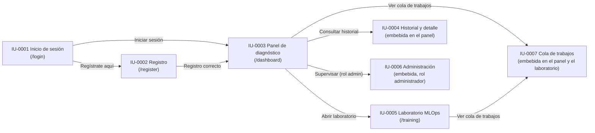
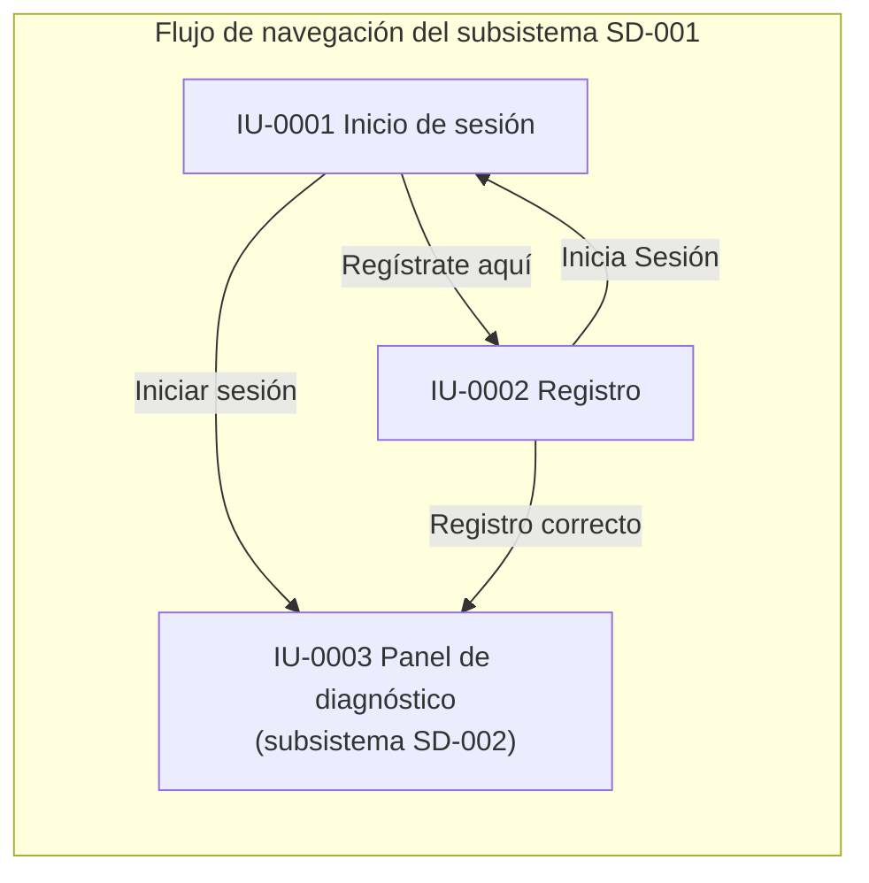
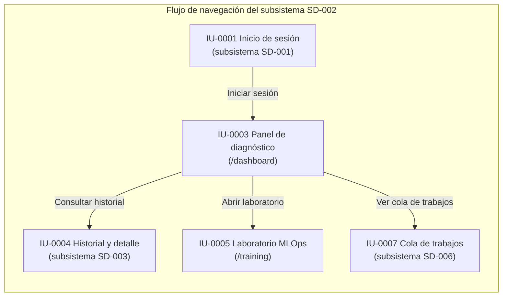
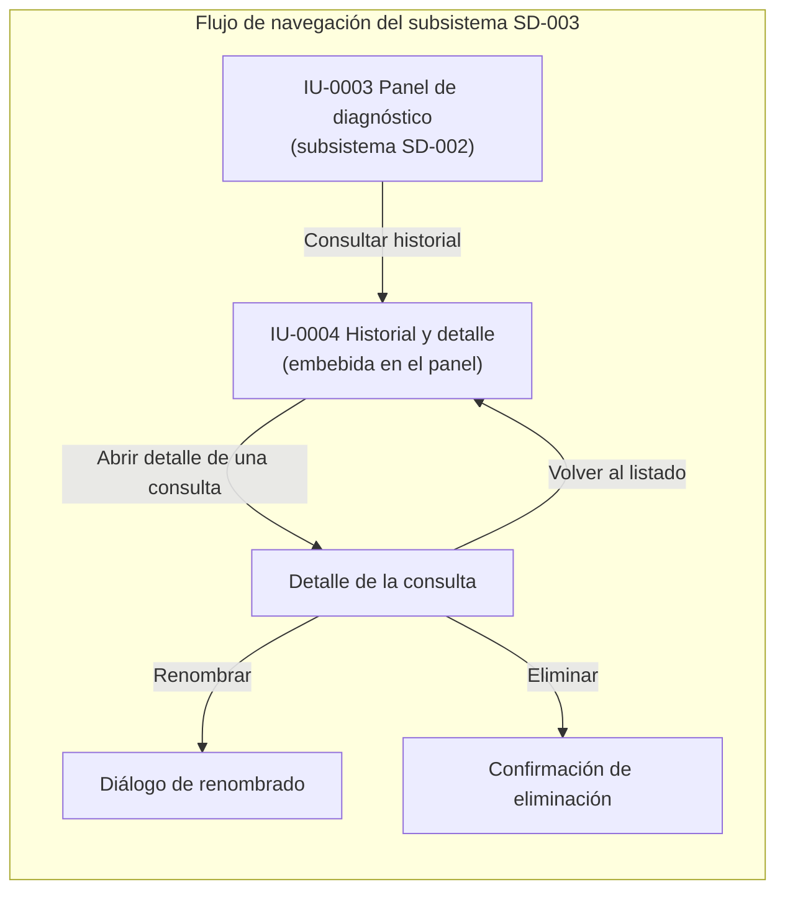
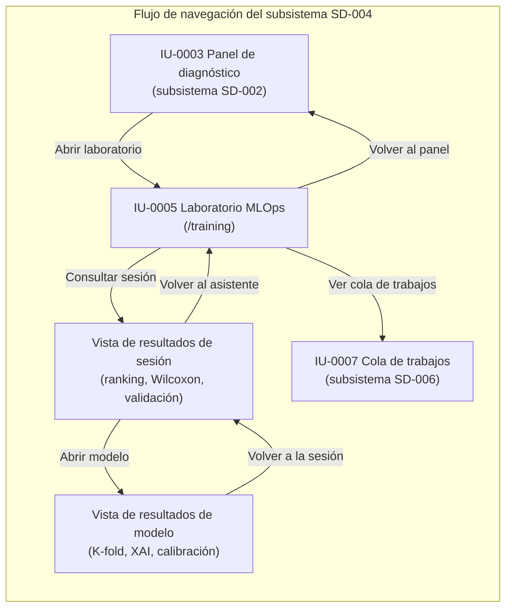
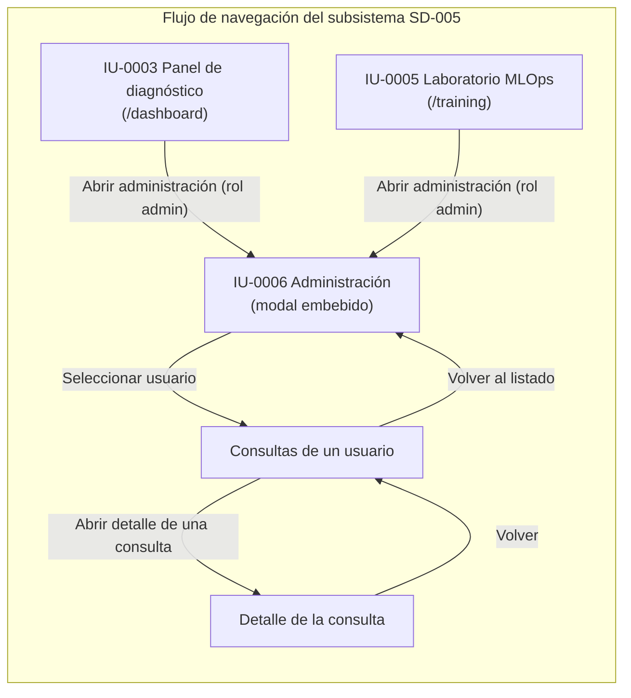
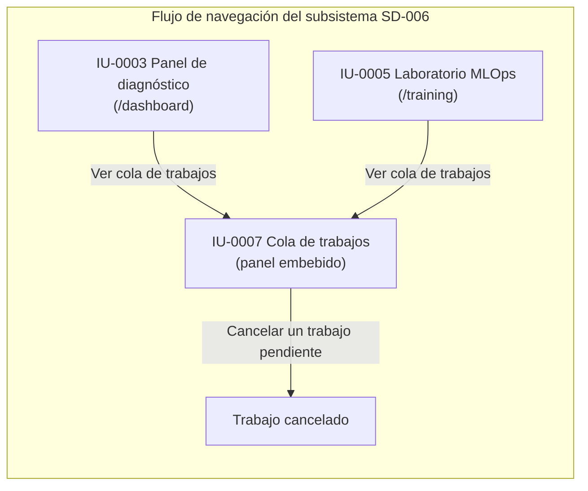

# Capítulo 22: Diseño de interfaces de los subsistemas

El diseño de interfaces constituye la etapa del diseño que concreta las ventanas del sistema y la navegación entre ellas, refinando la estructura de interfaz definida en el análisis. Mientras que el capítulo 20 determinó el comportamiento de los casos de uso y el capítulo 21 la estructura de las clases, este capítulo establece cómo se presenta esa funcionalidad al usuario: qué ventanas componen la aplicación, qué campos y acciones contiene cada una, cómo se navega entre ellas y qué informes se generan (Sharp, Rogers, & Preece, 2019). El diseño de interfaces aplica los principios de usabilidad que orientan la interacción del profesional sanitario con la plataforma: la claridad de las acciones, la consistencia entre ventanas y la adecuación de los mensajes de error al contexto (Nielsen, 1994).

El capítulo se organiza siguiendo la misma estructura de subsistemas de diseño del capítulo 17: cada apartado corresponde a un subsistema (SD-001 a SD-006) y describe las interfaces que materializan su responsabilidad. Para cada subsistema se presentan tres elementos, conforme a la guía de diseño de la memoria (punto 6): el flujo de navegación, que define la navegación definitiva entre las ventanas del subsistema; la especificación de las interfaces, que documenta cada ventana mediante la ficha formal de interfaz IU-NNNN con sus campos, sus botones y sus enlaces; y los informes del subsistema, que describen cada documento generado mediante la ficha formal IF-NNNN con sus datos y sus agrupaciones. Las ventanas de la aplicación corresponden a las plantillas reales del sistema: la página de inicio de sesión, el registro, el panel de diagnóstico y el laboratorio de entrenamiento, junto con las vistas que se integran en ellas.

El diagrama de la figura 90 representa la navegación global de la aplicación. El visitante entra por la página de inicio de sesión (IU-0001), desde la que accede al registro (IU-0002); una vez autenticado o registrado, el sistema conduce al panel de diagnóstico (IU-0003), que constituye el centro de la aplicación. Desde el panel se alcanzan las vistas integradas del historial y el detalle (IU-0004), la administración (IU-0006, solo para el rol administrador), la cola de trabajos (IU-0007) y el laboratorio de entrenamiento (IU-0005); desde el laboratorio también se alcanza la cola de trabajos.

*Figura 90 - Diagrama de navegación global de la aplicación*

La navegación global refleja la estructura funcional de la plataforma: las ventanas públicas de acceso y registro (SD-001) preceden al resto, y el panel de diagnóstico se sitúa como punto central desde el que se accede al laboratorio y a las vistas integradas. Las vistas del historial, la administración y la cola de trabajos no constituyen ventanas independientes de la aplicación, sino secciones y diálogos integrados en el panel de diagnóstico o en el laboratorio, que se describen en los apartados de sus subsistemas correspondientes.

## 22.1 Subsistema SD-001: Acceso, identidad y gestión de sesiones

El subsistema SD-001 materializa las interfaces de acceso de la plataforma: la página de inicio de sesión y la página de registro. Ambas constituyen las únicas ventanas públicas de la aplicación, accesibles sin autenticación, y comparten los mecanismos transversales de presentación: el selector de idioma y el cambio del tema visual. La página de inicio de sesión permite al visitante autenticarse con sus credenciales, y la página de registro permite crear una cuenta; en ambos casos, la autenticación correcta conduce al panel de diagnóstico del subsistema SD-002.

### 22.1.1 Flujo de navegación

El flujo de navegación del subsistema SD-001, representado en la figura 91, refleja la progresión del visitante hasta la entrada al área privada. El visitante llega a la página de inicio de sesión, desde la que puede desplazarse a la página de registro mediante el enlace correspondiente y volver a la página de inicio desde el registro. Tras completar el inicio de sesión o el registro, el sistema conduce al usuario al panel de diagnóstico, que pertenece a SD-002; la navegación entre SD-001 y SD-002 materializa la frontera entre el área pública y el área privada.

*Figura 91 - Flujo de navegación del subsistema SD-001*

El flujo no presenta rutas de navegación a otras ventanas del subsistema: las dos ventanas se enlazan mutuamente y ambas desembocan en el panel de diagnóstico. La página de inicio de sesión recibe el parámetro de error en la URL cuando una autenticación falla, de modo que muestra el mensaje genérico sin revelar qué parte de las credenciales era incorrecta, en coherencia con el CU-002 del análisis.

### 22.1.2 Especificación de las interfaces

La especificación de las interfaces documenta cada ventana del subsistema mediante la ficha formal de interfaz de la guía de diseño de la memoria (punto 6). Cada ficha reproduce los campos de la plantilla —descripción, campos y botones y enlaces—, de modo que el contenido de cada parte queda identificado y verificable. A continuación se especifican las dos interfaces propias de SD-001.

#### IU-0001 Inicio de sesión

| Campo | Contenido |
|---|---|
| **Descripción** | Ventana de acceso a la plataforma, correspondiente a la plantilla `login.html` (ruta `/`). Presenta el formulario de inicio de sesión con el nombre de usuario y la contraseña, el mensaje de error genérico, el selector de idioma y el cambio del tema visual. Ante una autenticación correcta, redirige al panel de diagnóstico; ante un fallo, muestra un mensaje genérico sin revelar la causa. |

**Campos**

| Nombre | Tipo de datos | Editable/Consulta | Oblig. | Descripción |
|---|---|---|---|---|
| `username` | Texto | Editable | Sí | Nombre de usuario o correo electrónico con el que se identifica la cuenta. |
| `password` | Contraseña | Editable | Sí | Contraseña de la cuenta; se introduce enmascarada. |

**Botones/Enlaces**

| Nombre | Tipo | Acción |
|---|---|---|
| Entrar al Sistema | Botón | Envía el formulario al endpoint `POST /login`; con credenciales válidas, el sistema establece las cookies de sesión y redirige al panel de diagnóstico; con credenciales inválidas, redirige a la página con el parámetro de error para mostrar el mensaje genérico. |
| Regístrate aquí | Enlace | Navega a la página de registro (`/register`). |
| Selector de idioma | Selector | Cambia el idioma de la interfaz, materializando el CU-004. |
| Botón de tema | Botón | Alterna el tema claro y oscuro de la interfaz, materializando el CU-036 de SD-006. |

**Comentarios**

La página constituye la puerta de entrada del sistema: todos los flujos privados comienzan en ella. El mensaje de error es genérico para no revelar si el fallo corresponde al nombre de usuario o a la contraseña, y el endpoint de acceso está limitado a cinco peticiones por minuto. La ventana se sirve sin almacenamiento de caché, de modo que no se reutiliza una sesión anterior.

#### IU-0002 Registro

| Campo | Contenido |
|---|---|
| **Descripción** | Ventana de creación de cuenta, correspondiente a la plantilla `register.html` (ruta `/register`). Presenta el formulario de registro con el nombre, el apellido, la especialidad, el nombre de usuario y la contraseña, junto con el selector de idioma y el cambio del tema visual. Envía los datos al endpoint de registro de forma asíncrona; ante un registro correcto muestra la confirmación y conduce al panel de diagnóstico, y ante un error muestra el mensaje correspondiente. |

**Campos**

| Nombre | Tipo de datos | Editable/Consulta | Oblig. | Descripción |
|---|---|---|---|---|
| `first_name` | Texto | Editable | Sí | Nombre del profesional. |
| `last_name` | Texto | Editable | Sí | Apellido del profesional. |
| `role` | Lista de selección | Editable | Sí | Especialidad del profesional: Médico Residente, Radiólogo Especialista, Médico de Familia o Neumólogo. |
| `username` | Texto | Editable | Sí | Nombre de usuario o correo electrónico con el que se identificará la cuenta. |
| `password` | Contraseña | Editable | Sí | Contraseña de la cuenta; el servidor exige una longitud mínima de ocho caracteres. |

**Botones/Enlaces**

| Nombre | Tipo | Acción |
|---|---|---|
| Registrarme | Botón | Envía el formulario al endpoint `POST /api/register` de forma asíncrona; ante un registro correcto muestra la confirmación y redirige al panel de diagnóstico, y ante un error muestra el mensaje del campo afectado o de la duplicidad. |
| Inicia Sesión | Enlace | Navega a la página de inicio de sesión (`/`). |
| Selector de idioma | Selector | Cambia el idioma de la interfaz, materializando el CU-004. |
| Botón de tema | Botón | Alterna el tema claro y oscuro de la interfaz, materializando el CU-036 de SD-006. |

**Comentarios**

La ventana mantiene la puerta de entrada autónoma del análisis: el alta no requiere la intervención de un administrador. La validación del formato del correo, de la longitud de la contraseña y de la unicidad del usuario se resuelve en el servidor, y la interfaz muestra los errores devueltos sin interrumpir la sesión de navegación. Tras el registro correcto, el sistema establece las cookies de sesión y el visitante queda autenticado, en coherencia con el CU-001 y con la decisión de diseño del capítulo 20.

### 22.1.3 Informes del subsistema

El subsistema SD-001 no genera informes: sus ventanas se limitan a la autenticación y a la creación de cuentas, y no producen documentos descargables. Los informes de la plataforma corresponden a los subsistemas funcionales que generan resultados: el informe PDF del diagnóstico, que se describe en el apartado de SD-002, y el informe consolidado de las sesiones de entrenamiento, que se describe en el apartado de SD-004. Por esta razón, no se definen fichas IF-NNNN para este subsistema.

## 22.2 Subsistema SD-002: Diagnóstico asistido y generación de resultados

El subsistema SD-002 materializa la interfaz clínica de la plataforma: el panel de diagnóstico, correspondiente a la plantilla `dashboard.html` (ruta `/dashboard`), que constituye el entorno central de la aplicación y sobre el que se realiza el ciclo completo de una consulta clínica. La ventana integra además las vistas del historial y el detalle de las consultas, la cola de trabajos y el panel de administración, que pertenecen a los subsistemas SD-003, SD-006 y SD-005, de modo que la ficha de interfaz se centra en las funciones de diagnóstico y se remite a los apartados correspondientes para el resto de las vistas. El subsistema genera además el informe PDF del diagnóstico (IF-0001), que se produce durante el procesamiento de la consulta.

### 22.2.1 Flujo de navegación

El flujo de navegación del subsistema SD-002, representado en la figura 92, sitúa el panel de diagnóstico como el punto central de la navegación del usuario autenticado. El usuario accede al panel tras el inicio de sesión o el registro, y desde él realiza el ciclo de diagnóstico sin abandonar la ventana: carga la radiografía, selecciona el modelo, solicita el análisis y visualiza el resultado y los mapas de explicabilidad en la misma vista. Desde el panel se alcanzan el historial y el detalle de las consultas (SD-003), el laboratorio de entrenamiento (SD-004) y la cola de trabajos (SD-006).

*Figura 92 - Flujo de navegación del subsistema SD-002*

El flujo refleja la naturaleza central del panel de diagnóstico: el ciclo clínico se resuelve en una única ventana, sin transiciones intermedias, y el resto de los subsistemas se alcanzan desde el panel mediante la barra lateral. La navegación hacia el historial y el detalle, hacia el laboratorio y hacia la cola de trabajos materializa las relaciones de colaboración entre SD-002 y los subsistemas SD-003, SD-004 y SD-006 descritas en el capítulo 17.

### 22.2.2 Especificación de las interfaces

La especificación de las interfaces documenta la ventana del subsistema mediante la ficha formal de interfaz de la guía de diseño de la memoria (punto 6), con los mismos campos de la plantilla utilizados en el apartado anterior. A continuación se especifica la interfaz propia de SD-002, centrada en las funciones de diagnóstico; las vistas integradas del historial, la cola y la administración se especifican en los apartados de sus subsistemas.

#### IU-0003 Panel de diagnóstico

| Campo | Contenido |
|---|---|
| **Descripción** | Ventana central de la aplicación, correspondiente a la plantilla `dashboard.html` (ruta `/dashboard`). Presenta el entorno de diagnóstico rápido: la zona de carga de la radiografía, el selector del modelo de inteligencia artificial, el área de conversación donde se muestra el resultado del análisis y los mapas de explicabilidad, y el visor de imágenes. Integra en su barra lateral la navegación al laboratorio, el historial de consultas, el panel de la cola de trabajos, el acceso a la administración (solo para el rol administrador) y el cierre de sesión. Solo es accesible para usuarios autenticados. |

**Campos**

| Nombre | Tipo de datos | Editable/Consulta | Oblig. | Descripción |
|---|---|---|---|---|
| `model-selector` | Lista de selección | Editable | Sí | Arquitectura de inteligencia artificial para el diagnóstico, entre las CNN Clásicas disponibles (DenseNet121, ResNet50, MobileNetV2, EfficientNetB0 y ConvNeXtTiny). |
| `file-input` | Archivo | Editable | Sí | Radiografía de tórax en formato JPEG o PNG, de hasta 10 MB, que se adjunta mediante la zona de carga. |
| Área de resultado | Contenido | Consulta | — | Zona de la ventana que muestra la imagen enviada, el resultado del diagnóstico (etiqueta y confianza), el modelo empleado y el mapa de explicabilidad generado. |

**Botones/Enlaces**

| Nombre | Tipo | Acción |
|---|---|---|
| Zona de carga | Botón | Permite seleccionar o arrastrar la radiografía de tórax; al adjuntarla habilita el envío. |
| Enviar | Botón | Envía la solicitud de diagnóstico al endpoint `POST /predict`, muestra la posición del trabajo en la cola y sondea su estado hasta que se completa. |
| Diagnóstico Rápido | Enlace | Recarga el panel de diagnóstico (`GET /dashboard`). |
| Laboratorio de Entrenamiento | Enlace | Navega al laboratorio de experimentación MLOps (`GET /training`), del subsistema SD-004. |
| Historial | Enlace | Muestra el listado de consultas del usuario en la barra lateral, correspondiente a SD-003. |
| Cerrar Sesión | Enlace | Cierra la sesión del usuario (`GET /logout`), del subsistema SD-001. |
| Selector de idioma | Selector | Cambia el idioma de la interfaz, materializando el CU-004. |
| Botón de tema | Botón | Alterna el tema claro y oscuro de la interfaz, materializando el CU-036 de SD-006. |

**Comentarios**

La ventana constituye el entorno de trabajo del profesional sanitario: el diagnóstico se solicita y se visualiza sin abandonar la vista, y la interfaz permanece operativa durante el procesamiento asíncrono mediante el sondeo del estado de la cola. La respuesta del sistema localiza las etiquetas según el idioma de la sesión. La ventana integra las vistas del historial, la cola y la administración, que se especifican en los apartados de SD-003, SD-006 y SD-005 respectivamente.

### 22.2.3 Informes del subsistema

La especificación de los informes documenta cada documento generado por el subsistema mediante la ficha formal de informe de la guía de diseño de la memoria (punto 6). Cada ficha reproduce los campos de la plantilla —descripción, módulo de interfaz, datos y resumen—, de modo que el contenido de cada parte queda identificado y verificable. A continuación se especifica el informe propio de SD-002.

#### IF-0001 Informe del diagnóstico

| Campo | Contenido |
|---|---|
| **Descripción** | Informe PDF de una consulta de diagnóstico, generado durante el procesamiento de la consulta mediante `services/pdf_generator.py`. Recoge la identificación de la consulta con la fecha y el modelo empleado, el diagnóstico con su nivel de confianza, la radiografía original y el mapa de explicabilidad, y se entrega como documento descargable desde el detalle de la consulta. |
| **Módulo de interfaz** | IU-0003 Panel de diagnóstico. |

**Datos**

| Campo | Ordenación | Tipo de datos | Descripción |
|---|---|---|---|
| Fecha | — | Fecha/hora | Fecha y hora de la consulta. |
| Modelo | — | Texto | Arquitectura de inteligencia artificial empleada en el diagnóstico. |
| Diagnóstico | — | Texto | Etiqueta de la predicción (Neumonía o Normal), con el color de diagnóstico acorde con el resultado. |
| Confianza | — | Numérico | Nivel de confianza de la predicción. |
| Radiografía original | — | Imagen | Radiografía de tórax enviada por el usuario. |
| Mapa de explicabilidad | — | Imagen | Mapa de calor XAI que justifica la predicción. |

**Resumen/Acumulado**

| Resumen | Campos del resumen | Descripción |
|---|---|---|
| — | — | No aplica: el informe corresponde a una consulta individual y no agrupa ni acumula datos de varias consultas. |

**Comentarios**

El informe se trata como parte de la información protegida de la consulta: se genera exclusivamente a partir de los datos del usuario propietario y su acceso queda sujeto al control de propiedad del historial. La generación del documento se adelanta al momento del diagnóstico, de modo que la descarga posterior no depende de una nueva operación del sistema.

## 22.3 Subsistema SD-003: Historial y gestión de consultas

El subsistema SD-003 materializa la interfaz del historial y el detalle de las consultas, integrada en el panel de diagnóstico. La vista del historial ocupa la barra lateral del panel, donde se muestran las consultas del usuario agrupadas por modelo, y la vista del detalle ocupa el área principal al abrir una consulta, donde se presentan los artefactos y los metadatos de la consulta junto con las acciones de renombrado y eliminación. Ambas vistas constituyen la interfaz IU-0004, correspondiente a las secciones del historial y del detalle de la plantilla `dashboard.html`, y materializan los casos de uso CU-011 a CU-014.

### 22.3.1 Flujo de navegación

El flujo de navegación del subsistema SD-003, representado en la figura 93, refleja la cadena de navegación del análisis: desde el panel de diagnóstico se accede al historial, desde el listado se abre el detalle de una consulta, y desde el detalle se ejecutan, de forma opcional, el renombrado o la eliminación, además de la vuelta al listado. La navegación entre el listado, el detalle y las operaciones de gestión reproduce las relaciones de extensión de los casos de uso del subsistema.

*Figura 93 - Flujo de navegación del subsistema SD-003*

El flujo refleja la progresión del usuario por el historial: el listado conduce al detalle de una consulta, y desde el detalle se alcanzan las operaciones opcionales de gestión. La navegación hacia el detalle y hacia las operaciones es de ida y vuelta: el usuario puede volver al listado o al panel en cualquier momento, sin que las acciones de gestión interrumpan la navegación principal.

### 22.3.2 Especificación de las interfaces

La especificación de las interfaces documenta la vista del subsistema mediante la ficha formal de interfaz de la guía de diseño de la memoria (punto 6), con los mismos campos de la plantilla utilizados en los apartados anteriores. A continuación se especifica la interfaz propia de SD-003.

#### IU-0004 Historial y detalle

| Campo | Contenido |
|---|---|
| **Descripción** | Vista integrada del historial y el detalle de las consultas, correspondiente a las secciones del historial y del detalle de la plantilla `dashboard.html`. La vista del historial ocupa la barra lateral del panel de diagnóstico y muestra las consultas del usuario agrupadas por modelo, con la imagen, la fecha, la etiqueta y la confianza de cada una. La vista del detalle ocupa el área principal al abrir una consulta y muestra la radiografía original, el mapa de explicabilidad, el diagnóstico, la confianza, el modelo, el nombre visible, la fecha y las acciones de renombrado y eliminación. |

**Campos**

| Nombre | Tipo de datos | Editable/Consulta | Oblig. | Descripción |
|---|---|---|---|---|
| Listado de consultas | Contenido | Consulta | — | Listado de las consultas del usuario, agrupado por modelo, con la imagen, la fecha, la etiqueta y la confianza de cada consulta. |
| `cd-original` | Imagen | Consulta | — | Radiografía original de la consulta seleccionada. |
| `cd-xai` | Imagen | Consulta | — | Mapa de explicabilidad XAI de la consulta seleccionada. |
| `cd-label` | Texto | Consulta | — | Etiqueta de la predicción (Neumonía o Normal) de la consulta. |
| `cd-confidence` | Numérico | Consulta | — | Nivel de confianza de la predicción. |
| `cd-model` | Texto | Consulta | — | Arquitectura del modelo empleado en la consulta. |
| `cd-patient` | Texto | Consulta | — | Nombre visible de la consulta, que funciona como etiqueta de organización y no como identificación clínica. |
| `cd-timestamp` | Fecha/hora | Consulta | — | Fecha de la consulta. |

**Botones/Enlaces**

| Nombre | Tipo | Acción |
|---|---|---|
| Tarjeta del historial | Enlace | Abre el detalle de la consulta seleccionada, materializando el CU-012. |
| Volver | Botón | Cierra el detalle y regresa al listado del historial. |
| Renombrar | Botón | Abre el diálogo para indicar el nuevo nombre visible de la consulta y lo actualiza, materializando el CU-013. |
| Eliminar | Botón | Solicita la confirmación de la eliminación y, si se confirma, elimina la consulta y sus artefactos, materializando el CU-014. |

**Comentarios**

La vista del historial solo muestra las consultas del usuario propietario, de modo que el acceso al detalle y a sus artefactos queda restringido al propietario mediante la cadena de datos del listado. La vista del detalle no requiere una petición adicional al servidor: se construye con los datos recibidos en el listado y las imágenes se sirven desde el almacenamiento estático. El informe del diagnóstico se descarga desde el detalle, aunque la generación del documento pertenece a SD-002.

### 22.3.3 Informes del subsistema

El subsistema SD-003 no genera informes propios: su responsabilidad es la recuperación y la gestión de las consultas ya realizadas, y no produce documentos descargables. El informe del diagnóstico de cada consulta (IF-0001) pertenece al subsistema SD-002, que lo genera durante el procesamiento, de modo que el historial únicamente conserva y sirve la ruta del documento ya generado. Por esta razón, no se definen fichas IF-NNNN para este subsistema.

## 22.4 Subsistema SD-004: Laboratorio de experimentación MLOps

El subsistema SD-004 materializa la interfaz del laboratorio de experimentación, correspondiente a la plantilla `training.html` (ruta `/training`). La ventana integra el asistente de configuración conversacional, la exploración de la carpeta del dataset, el listado de los experimentos guardados, la consola de entrenamiento, la vista de resultados de la sesión —con el ranking, la matriz de Wilcoxon y la validación externa— y la vista de resultados de un modelo, con las métricas de validación cruzada, la calibración y las métricas XAI. La ventana integra además la cola de trabajos y el acceso a la administración, pertenecientes a SD-006 y SD-005. El subsistema genera el informe consolidado de la sesión (IF-0002).

### 22.4.1 Flujo de navegación

El flujo de navegación del subsistema SD-004, representado en la figura 94, se organiza en torno al laboratorio como ventana principal. El usuario accede al laboratorio desde el panel de diagnóstico, y dentro de la ventana navega entre el asistente de configuración, la vista de resultados de la sesión y la vista de resultados de un modelo, además de la consola de entrenamiento que se muestra durante la ejecución. Desde el laboratorio se alcanzan la cola de trabajos y, en sentido inverso, el panel de diagnóstico.

*Figura 94 - Flujo de navegación del subsistema SD-004*

El flujo refleja la progresión del investigador por el laboratorio: desde el asistente de configuración se lanzan los experimentos, desde el listado de experimentos se consulta la sesión, y desde la vista de la sesión se desciende a los resultados de un modelo concreto. La navegación entre las vistas es de ida y vuelta, y el usuario puede volver al asistente o al panel en cualquier momento sin interrumpir el estado del laboratorio.

### 22.4.2 Especificación de las interfaces

La especificación de las interfaces documenta la ventana del subsistema mediante la ficha formal de interfaz de la guía de diseño de la memoria (punto 6), con los mismos campos de la plantilla utilizados en los apartados anteriores. A continuación se especifica la interfaz propia de SD-004.

#### IU-0005 Laboratorio de entrenamiento

| Campo | Contenido |
|---|---|
| **Descripción** | Ventana del laboratorio de experimentación MLOps, correspondiente a la plantilla `training.html` (ruta `/training`). Presenta el asistente de configuración conversacional, la exploración de la carpeta del dataset, el listado de los experimentos guardados, la consola del servidor de entrenamiento, la vista de resultados de la sesión (ranking por AUC, matriz de Wilcoxon, validación externa con curvas ROC y matriz de DeLong, y exploración de modelos) y la vista de resultados de un modelo (validación cruzada K-fold, calibración y métricas XAI). Solo es accesible para usuarios autenticados. |

**Campos**

| Nombre | Tipo de datos | Editable/Consulta | Oblig. | Descripción |
|---|---|---|---|---|
| `chat-input` | Texto | Editable | Sí | Mensaje en lenguaje natural dirigido al asistente de configuración del experimento. |
| Listado de experimentos | Contenido | Consulta | — | Listado de las sesiones de entrenamiento del usuario, con sus modelos, en la barra lateral. |
| `session-ranking-table` | Tabla | Consulta | — | Ranking de los modelos de la sesión por la media del AUC de la validación cruzada, con su desviación. |
| `session-heatmap-img` | Imagen | Consulta | — | Matriz de significancia estadística del test de Wilcoxon. |
| `external-ranking-table` | Tabla | Consulta | — | Rendimiento de la validación externa por modelo: exactitud, F1 y AUC. |
| `external-roc-img` | Imagen | Consulta | — | Curvas ROC de la validación externa. |
| `external-delong-img` | Imagen | Consulta | — | Matriz de significancia de DeLong. |
| `res-table-body` | Tabla | Consulta | — | Resultados de la validación cruzada K-fold de un modelo (exactitud, precisión, sensibilidad, F1 y AUC por pliegue). |
| `res-xai-table` | Tabla | Consulta | — | Métricas cuantitativas de explicabilidad del modelo (deletion, insertion, sparsity, entropy y stability por método). |
| `console-logs` | Contenido | Consulta | — | Registro de la ejecución del entrenamiento, actualizado durante el procesamiento. |

**Botones/Enlaces**

| Nombre | Tipo | Acción |
|---|---|---|
| Explorar Carpeta | Botón | Abre el explorador del dataset y inserta la ruta seleccionada en la conversación, materializando el CU-017. |
| Enviar | Botón | Envía el mensaje al asistente de configuración, materializando el CU-016; si la configuración está completa, lanza el entrenamiento (CU-018). |
| Actualizar | Botón | Refresca el listado de experimentos guardados. |
| Volver al Asistente | Botón | Oculta la vista de resultados de la sesión y regresa al asistente de configuración. |
| Renombrar | Botón | Cambia el nombre visible de la sesión, materializando el CU-029. |
| Reutilizar Configuración | Botón | Reutiliza la configuración de la sesión actual en una nueva conversación. |
| Validación Externa | Botón | Solicita la validación externa de la sesión, materializando el CU-026. |
| Generar Reporte PDF | Botón | Descarga el informe consolidado de la sesión, materializando el CU-028. |
| Recalcular Wilcoxon | Botón | Solicita el recálculo de la comparativa estadística de la sesión, materializando el CU-024. |
| Volver a la Sesión | Botón | Regresa desde los resultados de un modelo a la vista de la sesión. |
| Generar XAI y Métricas | Botón | Ejecuta el análisis de explicabilidad de un modelo, materializando el CU-025. |
| Diagnóstico Rápido | Enlace | Navega al panel de diagnóstico (`GET /dashboard`), del subsistema SD-002. |
| Cerrar Sesión | Enlace | Cierra la sesión del usuario (`GET /logout`), del subsistema SD-001. |
| Selector de idioma | Selector | Cambia el idioma de la interfaz, materializando el CU-004. |
| Botón de tema | Botón | Alterna el tema claro y oscuro de la interfaz, materializando el CU-036 de SD-006. |

**Comentarios**

La ventana constituye el entorno de experimentación del investigador: la configuración del experimento se resuelve por conversación, el entrenamiento se ejecuta de forma asíncrona y las vistas de resultados se consultan sin bloquear la interfaz. La consola de entrenamiento muestra la progresión de los trabajos y detecta la finalización o los errores del pipeline. La ventana integra la cola de trabajos (SD-006) y el acceso a la administración (SD-005).

### 22.4.3 Informes del subsistema

La especificación de los informes documenta el documento generado por el subsistema mediante la ficha formal de informe de la guía de diseño de la memoria (punto 6), con los mismos campos de la plantilla utilizados en el apartado de SD-002. A continuación se especifica el informe propio de SD-004.

#### IF-0002 Informe de la sesión de entrenamiento

| Campo | Contenido |
|---|---|
| **Descripción** | Informe PDF consolidado de una sesión de entrenamiento, generado bajo demanda mediante `services/pdf_generator_mlops.py`. Recoge la configuración del experimento, el ranking de modelos con la matriz de Wilcoxon, los resultados de la validación externa con las curvas ROC y la matriz de DeLong, y el detalle técnico de cada modelo con sus métricas de explicabilidad y sus mapas de calor. Se entrega como documento descargable desde la vista de la sesión. |
| **Módulo de interfaz** | IU-0005 Laboratorio de entrenamiento. |

**Datos**

| Campo | Ordenación | Tipo de datos | Descripción |
|---|---|---|---|
| ID de sesión | — | Texto | Identificador de la sesión de entrenamiento. |
| Fecha | — | Fecha/hora | Fecha de generación del informe. |
| Dataset | — | Texto | Ruta del dataset de entrenamiento de la sesión. |
| Modelos | — | Texto | Arquitecturas entrenadas en la sesión. |
| Hiperparámetros | — | Texto | Épocas, tamaño de lote y tasa de aprendizaje de la sesión. |
| Ranking | 1 | Tabla | Modelos ordenados por la media del AUC de la validación cruzada, con su desviación típica. |
| Matriz de Wilcoxon | — | Imagen | Matriz de significancia estadística entre los modelos. |
| Validación externa | — | Tabla | Exactitud, F1 y AUC de cada modelo sobre la cohorte externa. |
| Curvas ROC | — | Imagen | Curvas ROC de la validación externa. |
| Matriz de DeLong | — | Imagen | Matriz de comparación estadística de las curvas ROC. |
| Métricas XAI | — | Tabla | Métricas de fidelidad de la explicabilidad por modelo y método. |
| Mapas de calor XAI | — | Imagen | Mapas de explicabilidad de cada modelo sobre imágenes de ejemplo. |

**Resumen/Acumulado**

| Resumen | Campos del resumen | Descripción |
|---|---|---|
| Ranking de modelos | Modelo, Media AUC, Desviación | El informe agrupa los modelos por la media del AUC de la validación cruzada, con su desviación típica, en orden descendente de rendimiento. |

**Comentarios**

El informe se genera bajo demanda, cuando la sesión dispone de los datos necesarios, y separa el conocimiento del formato del router: el generador recibe la información preparada por el motor y compone el documento. El informe consolida el análisis estadístico de la sesión y se considera parte de los artefactos de experimentación del laboratorio.

## 22.5 Subsistema SD-005: Supervisión y administración

El subsistema SD-005 materializa la interfaz de administración, integrada en las ventanas del panel de diagnóstico y del laboratorio de entrenamiento mediante los diálogos de administración de las plantillas `dashboard.html` y `training.html`. La vista de administración es accesible únicamente para el usuario con rol de administrador y presenta el listado de usuarios con sus recuentos de actividad, las consultas de un usuario concreto junto con sus sesiones del laboratorio, y el detalle de una consulta seleccionada. Constituye la interfaz IU-0006 y materializa los casos de uso CU-031 a CU-033.

### 22.5.1 Flujo de navegación

El flujo de navegación del subsistema SD-005, representado en la figura 95, refleja la progresión del administrador desde el listado general hasta el caso concreto, en coherencia con las relaciones de extensión del análisis. Desde el panel de diagnóstico o el laboratorio, el administrador abre el diálogo de administración con el listado de usuarios; al seleccionar un usuario se muestran sus consultas y sus sesiones del laboratorio, y desde el listado de consultas se abre el detalle completo de una consulta, con la posibilidad de volver en cada paso.

*Figura 95 - Flujo de navegación del subsistema SD-005*

El flujo refleja la cadena de navegación de la supervisión: el listado de usuarios conduce a la actividad de una cuenta, y desde la actividad se desciende al detalle de una consulta individual. La navegación es de ida y vuelta en cada nivel, de modo que el administrador puede profundizar progresivamente en la información y regresar al nivel anterior sin perder el contexto de la supervisión. El acceso al diálogo de administración queda restringido al rol administrador, y su presencia en la barra lateral depende de la comprobación de rol que realiza el servidor.

### 22.5.2 Especificación de las interfaces

La especificación de las interfaces documenta la vista del subsistema mediante la ficha formal de interfaz de la guía de diseño de la memoria (punto 6), con los mismos campos de la plantilla utilizados en los apartados anteriores. A continuación se especifica la interfaz propia de SD-005.

#### IU-0006 Administración

| Campo | Contenido |
|---|---|
| **Descripción** | Vista de supervisión y administración, integrada mediante los diálogos de administración de las plantillas `dashboard.html` y `training.html`. Presenta el listado de usuarios con el número de diagnósticos y de sesiones del laboratorio de cada uno, las consultas de un usuario concreto junto con sus sesiones de entrenamiento, y el detalle de una consulta con su imagen, su mapa de explicabilidad, su resultado, su confianza y sus metadatos. Solo es accesible para el usuario con rol de administrador. |

**Campos**

| Nombre | Tipo de datos | Editable/Consulta | Oblig. | Descripción |
|---|---|---|---|---|
| `admin-users-list` | Contenido | Consulta | — | Listado de usuarios registrados con el número de diagnósticos y de sesiones del laboratorio de cada uno. |
| `admin-user-consultations-list` | Contenido | Consulta | — | Consultas de diagnóstico del usuario seleccionado, con sus sesiones de entrenamiento del laboratorio. |
| Detalle de consulta | Contenido | Consulta | — | Detalle completo de la consulta seleccionada: radiografía original, mapa de explicabilidad, diagnóstico, confianza, modelo, nombre y fecha. |

**Botones/Enlaces**

| Nombre | Tipo | Acción |
|---|---|---|
| Panel de Administración | Botón | Abre el diálogo de administración con el listado de usuarios; solo se muestra al usuario con rol administrador. |
| Usuario del listado | Enlace | Abre las consultas y las sesiones del laboratorio del usuario seleccionado, materializando el CU-032. |
| Consulta del listado | Enlace | Abre el detalle completo de la consulta seleccionada, materializando el CU-033. |
| Cerrar | Botón | Cierra el diálogo de administración y regresa a la ventana desde la que se abrió. |

**Comentarios**

La vista de administración reutiliza el detalle de la consulta del panel de diagnóstico para presentar la consulta supervisada, de modo que la interfaz administrativa no duplica la vista del historial. La autorización administrativa se comprueba en el servidor antes de servir los datos, y no se infiere de la interfaz. El acceso del administrador a los datos de otros usuarios constituye la excepción al aislamiento de datos, acotada a la función de supervisión.

### 22.5.3 Informes del subsistema

El subsistema SD-005 no genera informes: su responsabilidad es la consulta y la supervisión de la actividad de la plataforma, y no produce documentos descargables. Los informes de la plataforma corresponden a los subsistemas que generan resultados, SD-002 y SD-004, y el administrador puede consultarlos a través de las consultas y las sesiones que supervisa, sin generar informes propios. Por esta razón, no se definen fichas IF-NNNN para este subsistema.

## 22.6 Subsistema SD-006: Cola de trabajos y capacidades transversales

El subsistema SD-006 materializa la interfaz de la cola de trabajos, integrada como panel lateral en las ventanas del panel de diagnóstico y del laboratorio de entrenamiento. La vista de la cola muestra los trabajos asíncronos del usuario —diagnósticos, entrenamientos y validaciones externas— con su tipo, su estado y su posición, y permite cancelar los trabajos pendientes, materializando los casos de uso CU-034 y CU-035. Además del panel de la cola, el subsistema comprende los mecanismos transversales de presentación de la interfaz: el selector de idioma y el cambio del tema visual, que ya se describieron como acciones comunes en las fichas de interfaz de los subsistemas anteriores.

### 22.6.1 Flujo de navegación

El flujo de navegación del subsistema SD-006, representado en la figura 96, refleja el carácter transversal de la cola de trabajos: el panel se integra en el panel de diagnóstico y en el laboratorio de entrenamiento, de modo que el usuario puede consultar el estado de sus trabajos desde cualquiera de los dos núcleos funcionales sin abandonar su ventana. Desde el panel de la cola se ejecuta la cancelación de un trabajo pendiente, que elimina el trabajo del estado encolado.

*Figura 96 - Flujo de navegación del subsistema SD-006*

El flujo refleja la integración transversal del panel de la cola: no constituye una ventana independiente, sino una sección que se muestra en las ventanas de los subsistemas que generan trabajos. La actualización del panel es periódica, de modo que el estado de los trabajos se refleja sin necesidad de navegación adicional, y la cancelación de un trabajo pendiente se resuelve desde el propio panel, sin transiciones intermedias.

### 22.6.2 Especificación de las interfaces

La especificación de las interfaces documenta la vista del subsistema mediante la ficha formal de interfaz de la guía de diseño de la memoria (punto 6), con los mismos campos de la plantilla utilizados en los apartados anteriores. A continuación se especifica la interfaz propia de SD-006.

#### IU-0007 Cola de trabajos

| Campo | Contenido |
|---|---|
| **Descripción** | Panel lateral de la cola de trabajos, integrado en las ventanas del panel de diagnóstico (`dashboard.html`) y del laboratorio de entrenamiento (`training.html`). Muestra los trabajos asíncronos del usuario con su tipo (diagnóstico, entrenamiento o validación externa), su estado (encolado, en ejecución, completado o fallido) y la posición de los trabajos encolados, y permite cancelar los trabajos pendientes. El panel se actualiza de forma periódica, de modo que refleja la progresión de los trabajos sin recargar la ventana. |

**Campos**

| Nombre | Tipo de datos | Editable/Consulta | Oblig. | Descripción |
|---|---|---|---|---|
| `queue-items` | Contenido | Consulta | — | Listado de los trabajos del usuario con el tipo del trabajo, el estado (encolado, en ejecución, completado o fallido) y la posición de los trabajos encolados. |
| Estado del trabajo | Texto | Consulta | — | Indicación del estado del trabajo: en ejecución o la posición en la cola para los encolados. |

**Botones/Enlaces**

| Nombre | Tipo | Acción |
|---|---|---|
| Cancelar | Botón | Cancela un trabajo pendiente de la cola, tras la confirmación del usuario, mediante el endpoint `DELETE /api/queue/cancel/{job_id}`; solo se muestra para los trabajos en estado encolado, materializando el CU-035. |

**Comentarios**

El panel de la cola refleja la máquina de estados de los trabajos y solo ofrece la cancelación para los trabajos pendientes: un trabajo en ejecución no se interrumpe, en coherencia con el diseño de SD-006. La actualización periódica del panel permite al usuario conocer en qué momento estará disponible un resultado o si un trabajo ha fallado, materializando el CU-034. Los mecanismos transversales de idioma y de tema visual se integran en las cabeceras de las ventanas, tal y como se describió en las fichas de interfaz de los subsistemas anteriores.

### 22.6.3 Informes del subsistema

El subsistema SD-006 no genera informes: su responsabilidad es la ejecución asíncrona de los trabajos y las capacidades transversales de presentación, y no produce documentos descargables. Los informes de la plataforma corresponden a los subsistemas que generan resultados, SD-002 y SD-004, y la cola de trabajos únicamente refleja su estado de procesamiento. Por esta razón, no se definen fichas IF-NNNN para este subsistema.
