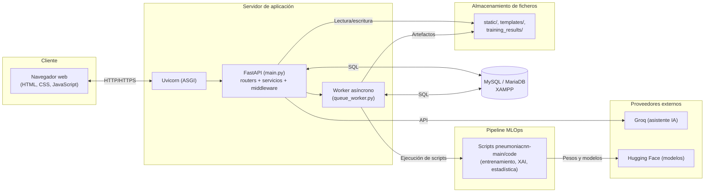
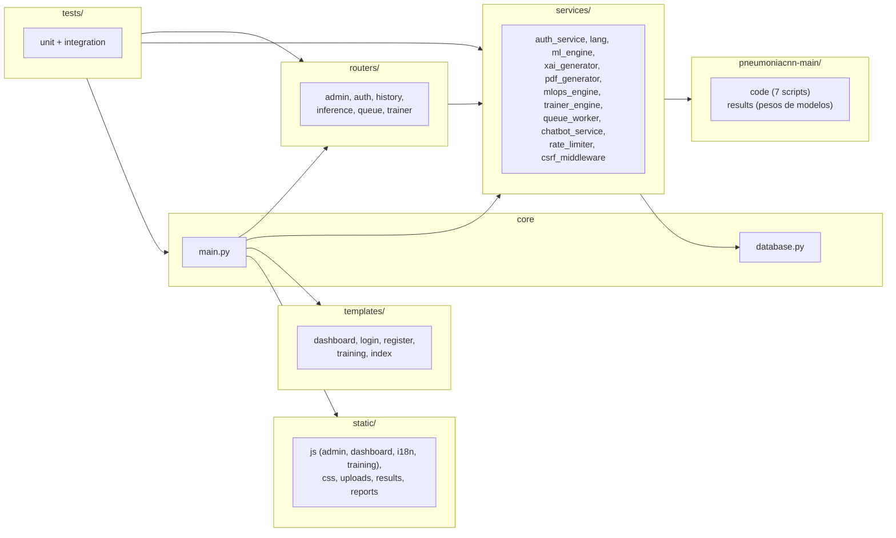
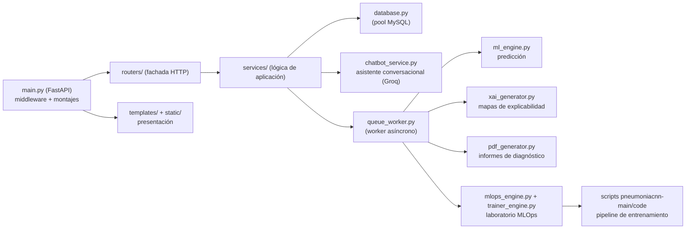

# Capítulo 23: Especificación de la construcción del sistema

La especificación de la construcción constituye la etapa final del diseño que determina cómo se materializa el sistema diseñado en un software ejecutable. Los capítulos anteriores definieron la arquitectura, los casos de uso, las clases y las interfaces; este capítulo concreta el entorno tecnológico en el que se construye la aplicación, los paquetes y componentes que la forman, el procedimiento de construcción y puesta en marcha, y la generación del esquema de la base de datos. La especificación cierra la parte de diseño de la memoria y establece la base sobre la que se definen posteriormente las pruebas y la implantación del sistema (Sharp, Rogers, & Preece, 2019).

El capítulo se organiza en cuatro apartados, conforme a la guía de diseño de la memoria (punto 7): el entorno tecnológico de construcción, que describe las herramientas, las dependencias y las restricciones del entorno; los paquetes y componentes de construcción, que representan la estructura del software y sus dependencias; el proceso de construcción, que especifica cómo se prepara el entorno y se lanza la aplicación; y la generación del esquema de base de datos, que describe cómo se materializa el modelo físico definido en el capítulo 19. El contenido se apoya en la arquitectura de soporte del capítulo 18, que establece los subsistemas de soporte sobre los que se asienta la construcción.

La construcción de vitalXAI no produce ejecutables compilados: la aplicación es un sistema Python interpretado, servido por un proceso ASGI y apoyado en un conjunto de dependencias declaradas. Por esta razón, el proceso de construcción consiste en preparar el entorno virtual, instalar las dependencias, configurar las variables de entorno y lanzar el servidor y el worker de la cola, sin una fase de compilación ni de generación de paquetes instalables. Esta naturaleza condiciona las especificaciones de los apartados siguientes, que se centran en la reproducibilidad del entorno y en la configuración necesaria para que la aplicación funcione.

## 23.1 Entorno tecnológico de construcción

El entorno de construcción de vitalXAI reúne las herramientas necesarias para ejecutar y mantener la aplicación. El sistema se construye sobre Python 3.11, que constituye el lenguaje principal y alberga tanto el servidor web como el motor de aprendizaje profundo, y emplea el framework FastAPI para la capa HTTP, servido por el servidor ASGI Uvicorn (FastAPI, 2024; Uvicorn, 2024). La presentación se compone con el motor de plantillas Jinja2 y los recursos estáticos HTML, CSS y JavaScript; el almacenamiento relacional se apoya en MySQL, accedido a través del conector oficial de Python, y en el entorno de desarrollo se ejecuta mediante MariaDB a través de XAMPP (Oracle, 2024). El aprendizaje profundo se apoya en TensorFlow y en la librería Transformers de Hugging Face para las arquitecturas Transformer (TensorFlow, 2024; Hugging Face, 2024), junto con OpenCV para el preprocesamiento de las imágenes y matplotlib para la generación de los mapas de explicabilidad. Las credenciales de sesión se gestionan con bcrypt y python-jose, la limitación de peticiones con slowapi, los informes PDF con FPDF (FPDF2, 2024) y la configuración conversacional con el cliente del proveedor Groq.

La gestión de las dependencias se resuelve mediante el archivo `requirements.txt`, que fija las versiones de las librerías de la aplicación, de modo que el entorno de construcción se reproduce de forma determinista. La instalación se realiza sobre un entorno virtual de Python, y las dependencias se organizan en tres grupos: las del servidor web (FastAPI, Uvicorn, Jinja2, slowapi, python-multipart, bcrypt, python-jose), las del aprendizaje automático y el análisis (TensorFlow, Keras, Transformers, OpenCV, matplotlib, pandas, scikit-learn, seaborn) y las de calidad y verificación (pytest, pytest-cov, ruff, mypy), tal y como se describen en el capítulo 18. El peso de estas dependencias condiciona el entorno: la carga de TensorFlow y de los modelos de aprendizaje requiere recursos de memoria y, en su caso, de cómputo acelerado por GPU.

La configuración sensible y operativa permanece fuera del código y se suministra mediante variables de entorno, que se cargan desde un archivo `.env` en el arranque de la aplicación. La tabla siguiente resume las variables de entorno del sistema, agrupadas por ámbito.

| Variable | Descripción |
|---|---|
| `JWT_SECRET_KEY` | Clave secreta de firma de los tokens de acceso; en producción debe configurarse y no usar la clave de desarrollo. |
| `JWT_ACCESS_EXPIRE_MINUTES` | Duración en minutos del token de acceso. |
| `JWT_REFRESH_EXPIRE_DAYS` | Duración en días del token de refresco. |
| `REFRESH_ROTATION_GRACE_SECONDS` | Periodo de gracia de la rotación del token de refresco. |
| `DB_HOST`, `DB_USER`, `DB_PASSWORD`, `DB_NAME` | Parámetros de conexión a MySQL (por defecto `localhost`, `root`, sin contraseña y base `tfg_pneumonia`). |
| `DB_POOL_SIZE` | Tamaño del pool de conexiones a la base de datos. |
| `GROQ_API_KEY` | Clave de la API del proveedor del asistente conversacional. |
| `TFG_DEMO_DATASET`, `TFG_DEMO_EXTERNAL_DATASET` | Rutas por defecto de los datasets de entrenamiento y de validación externa. |
| `TFG_SESSION_ID`, `TFG_MODEL_NAME`, `TFG_DATASET_DIR`, `TFG_EXTERNAL_DATASET_DIR`, `TFG_EPOCHS`, `TFG_BATCH_SIZE`, `TFG_LEARNING_RATE` | Variables de entorno que el pipeline MLOps transmite a los scripts de entrenamiento y de validación externa. |

El entorno impone además una serie de restricciones que condicionan la construcción y la ejecución. La aplicación requiere una instancia de MySQL accesible y con el esquema inicializable; en el entorno de desarrollo se utiliza XAMPP con el servicio de MariaDB activo, y el arranque de la aplicación crea las tablas si no existen. El motor de diagnóstico necesita los pesos de los modelos entrenados, que se conservan en el directorio `pneumoniacnn-main/results` y se cargan bajo demanda por la primera consulta con cada arquitectura; sin esos pesos, la solicitud de un diagnóstico falla en el procesamiento. El pipeline de experimentación MLOps requiere el directorio `pneumoniacnn-main/code` con los scripts de entrenamiento, análisis XAI, estadística y validación externa, que se invocan como procesos externos y escriben sus resultados en el directorio `training_results`. La generación de los mapas de explicabilidad emplea el backend no interactivo de matplotlib (`Agg`), que evita la dependencia de un entorno gráfico en el servidor.

El diagrama de despliegue de la figura 97 representa la disposición física de los componentes del sistema en su entorno de ejecución. El navegador del cliente accede al servidor de aplicación mediante HTTP; el servidor Uvicorn aloja la aplicación FastAPI, que orquesta los routers, los servicios y el middleware, atiende las consultas a la base de datos MySQL y sirve los recursos estáticos; el worker asíncrono comparte la persistencia con la aplicación y ejecuta los scripts del pipeline MLOps, que leen los modelos de Hugging Face y escriben los artefactos en el sistema de ficheros; la aplicación invoca además al proveedor externo Groq para el asistente conversacional.

*Figura 97 - Diagrama de despliegue del sistema*

El diagrama de despliegue refleja la separación entre el ciclo de petición y la ejecución asíncrona: la aplicación atiende las peticiones del navegador y encola los trabajos, mientras que el worker reclama y procesa los diagnósticos y los entrenamientos fuera del ciclo de petición. El almacenamiento de ficheros alberga las plantillas, los recursos estáticos, las imágenes subidas, los informes y los resultados de los entrenamientos, y se expone parcialmente al navegador mediante los montajes de recursos estáticos. Los proveedores externos —el asistente conversacional y el repositorio de modelos— se integran como fronteras del sistema, de modo que los fallos de esos servicios no se confunden con los de la aplicación. Los requisitos no funcionales con impacto sobre el entorno de construcción, como el tiempo de respuesta de la inferencia (RNF-019) o la ejecución sin bloqueo de la interfaz (RNF-020), se satisfacen mediante la reutilización de los modelos en memoria y la cola de trabajos, que no requieren componentes adicionales de construcción.

## 23.2 Paquetes y componentes de construcción

Los paquetes de construcción de vitalXAI se corresponden con las agrupaciones funcionales del código fuente, representadas en la figura 98. La estructura distingue la capa HTTP (`routers/`), la capa de servicios (`services/`), el núcleo de la aplicación (`core`), la presentación (`templates/` y `static/`), el pipeline de experimentación (`pneumoniacnn-main/`) y las pruebas (`tests/`). El diagrama de paquetes representa estas agrupaciones y las dependencias entre ellas, de modo que la construcción respeta la jerarquía de acoplamiento del sistema.

*Figura 98 - Diagrama de paquetes de construcción*

El diagrama refleja la dependencia principal del sistema: el núcleo de la aplicación compone la aplicación FastAPI a partir de los routers y los servicios, y monta los paquetes de presentación; los routers dependen de los servicios, que a su vez acceden a la persistencia relacional y al pipeline de experimentación. El paquete de pruebas depende de los routers, los servicios y el núcleo, de modo que su construcción no forma parte de la aplicación ejecutable. El paquete `pneumoniacnn-main/` constituye un componente externo al código de la aplicación: contiene los scripts del pipeline MLOps y los pesos de los modelos entrenados, y los servicios lo invocan como procesos externos, sin acoplamiento de importación.

La tabla siguiente especifica los componentes que forman cada paquete de construcción y su responsabilidad.

| Paquete | Componentes | Responsabilidad |
|---|---|---|
| `core` | `main.py`, `database.py` | Composición de la aplicación FastAPI, configuración de middleware y montajes, inicialización de la base de datos y pool de conexiones. |
| `routers/` | `admin.py`, `auth.py`, `history.py`, `inference.py`, `queue.py`, `trainer.py` | Capa HTTP: definición de los endpoints de la aplicación, autenticación, diagnóstico, historial, cola, laboratorio y administración. |
| `services/` | `auth_service.py`, `lang.py`, `ml_engine.py`, `xai_generator.py`, `pdf_generator.py`, `mlops_engine.py`, `trainer_engine.py`, `queue_worker.py`, `chatbot_service.py`, `rate_limiter.py`, `csrf_middleware.py` | Lógica de aplicación: criptografía y sesiones, internacionalización, predicción, explicabilidad, informes, laboratorio MLOps, worker de la cola, asistente conversacional, limitación y seguridad. |
| `templates/` | `login.html`, `register.html`, `dashboard.html`, `training.html`, `index.html` | Plantillas Jinja2 de las páginas de la aplicación. |
| `static/` | `js/admin.js`, `js/dashboard.js`, `js/i18n.js`, `js/training.js`, `css`, `uploads/`, `results/`, `reports/` | Recursos de presentación: scripts de la interfaz, estilos y directorios de artefactos generados. |
| `pneumoniacnn-main/` | `code/` (siete scripts), `results/` (pesos de modelos) | Pipeline MLOps: entrenamiento K-fold, entrenamiento Transformer, estadística, validación externa, test de DeLong y análisis XAI. |
| `tests/` | `unit/`, `integration/`, `conftest.py` | Pruebas unitarias e integración de la aplicación, con sus accesorios y mocks. |

La estructura de paquetes se corresponde con los subsistemas de soporte definidos en el capítulo 18. El paquete `core`, con la persistencia relacional, materializa el subsistema de soporte SSOP-001; los paquetes `templates/`, `static/` y el directorio `training_results/` materializan el almacenamiento de ficheros y recursos (SSOP-002); el paquete `core` con la integración de los proveedores externos y el entorno de ejecución materializa el subsistema SSOP-003; y el paquete `tests/` materializa la calidad y verificación (SSOP-004). Esta correspondencia mantiene la coherencia entre los paquetes de construcción y los subsistemas de soporte del diseño.

## 23.3 Proceso de construcción del software

El proceso de construcción de vitalXAI establece los pasos necesarios para preparar el entorno y lanzar la aplicación. Como se señaló en la introducción del capítulo, la construcción no incluye una fase de compilación ni de generación de ejecutables: consiste en preparar el entorno virtual, instalar las dependencias declaradas, configurar las variables de entorno, disponer de los artefactos externos y lanzar el servidor. El proceso se describe en la tabla siguiente, con el orden de ejecución y la finalidad de cada paso.

| Orden | Paso | Procedimiento |
|---|---|---|
| 1 | Preparar el entorno | Instalar Python 3.11 y crear un entorno virtual para el proyecto. |
| 2 | Instalar dependencias | Ejecutar `pip install -r requirements.txt` dentro del entorno virtual, lo que instala las versiones fijadas de las librerías de la aplicación. |
| 3 | Configurar el entorno | Crear el archivo `.env` con las variables de entorno del sistema (credenciales de MySQL, claves de sesión y del asistente, y rutas de los datasets). |
| 4 | Preparar la base de datos | Iniciar el servicio de MySQL (en el entorno de desarrollo, mediante XAMPP); la aplicación crea automáticamente las tablas del esquema en el arranque. |
| 5 | Verificar los artefactos | Comprobar que el directorio `pneumoniacnn-main/code` contiene los scripts del pipeline y que `pneumoniacnn-main/results` contiene los pesos de los modelos entrenados. |
| 6 | Lanzar la aplicación | Ejecutar `python main.py`, que inicia el servidor Uvicorn, inicializa la base de datos y arranca el worker de la cola. |

El proceso de construcción depende de dos familias de requisitos adicionales. En primer lugar, los artefactos del aprendizaje automático: los pesos de los modelos entrenados, conservados en `pneumoniacnn-main/results`, son necesarios para el diagnóstico, de modo que la primera consulta con cada arquitectura carga los pesos y las siguientes reutilizan el modelo en memoria. En segundo lugar, las variables de entorno del pipeline MLOps: los scripts de entrenamiento y de validación externa leen la configuración de cada trabajo desde las variables `TFG_*`, que el motor de experimentación establece al invocarlos, y escriben sus resultados en el directorio `training_results`. Sin estas condiciones, el entorno no dispone de la funcionalidad de diagnóstico ni de experimentación completa.

La figura 99 representa el diagrama de componentes del sistema, que detalla la colaboración entre los componentes construidos. La aplicación compone los routers, que delegan en los servicios; los servicios acceden a la persistencia, invocan al asistente externo y orquestan el worker; el worker procesa los diagnósticos con el motor de predicción, el generador de mapas y el generador de informes, y los entrenamientos con el motor MLOps, que ejecuta los scripts del pipeline; la aplicación sirve la presentación desde las plantillas y los recursos estáticos.

*Figura 99 - Diagrama de componentes del sistema*

La especificación detallada de los componentes del sistema se resume en la tabla siguiente, indicando qué requiere cada componente para su construcción y cómo se procede.

| Componente | Requiere | Procedimiento |
|---|---|---|
| Aplicación web (`main.py`) | FastAPI, Uvicorn y las dependencias del servidor | Se construye al instalar las dependencias; compone la aplicación, los routers, el middleware y los montajes. |
| Routers (`routers/`) | Los módulos de los routers y los servicios | Se incluyen en la aplicación mediante la composición de `main.py`; no requieren construcción adicional. |
| Servicios (`services/`) | Las librerías de seguridad, aprendizaje y generación | Se instalan con `requirements.txt`; los servicios se importan desde los routers y el worker. |
| Persistencia (`database.py`) | MySQL y el conector | Se requiere una instancia de MySQL accesible; el esquema se crea automáticamente en el arranque. |
| Worker (`queue_worker.py`) | Las librerías de la aplicación | Se arranca automáticamente en el ciclo de vida de la aplicación. |
| Motor de diagnóstico (`ml_engine.py`, `xai_generator.py`, `pdf_generator.py`) | TensorFlow, Transformers, OpenCV, matplotlib y FPDF | Se instalan con `requirements.txt`; requiere los pesos de los modelos para la predicción. |
| Laboratorio MLOps (`mlops_engine.py`, `trainer_engine.py`) | Los scripts del pipeline y los datasets | Requiere `pneumoniacnn-main/code` y las variables `TFG_*`; los scripts se invocan como procesos. |
| Presentación (`templates/`, `static/`) | Jinja2 y el navegador | Se sirven mediante los montajes de `main.py`; no requieren compilación. |
| Asistente conversacional (`chatbot_service.py`) | La librería del proveedor y la clave de la API | Se instala con `requirements.txt`; requiere `GROQ_API_KEY` configurada. |

La construcción de la aplicación queda así especificada de forma reproducible: con las dependencias instaladas, la configuración suministrada y los artefactos del aprendizaje automático disponibles, la ejecución de `main.py` produce el sistema en funcionamiento, con la base de datos inicializada y el worker de la cola activo.

## 23.4 Generación del esquema de base de datos

La generación del esquema de la base de datos materializa el modelo físico de datos definido en el capítulo 19 en las tablas del sistema. vitalXAI no conserva un script SQL externo de instalación: el esquema se define en el módulo `database.py` y se ejecuta en el arranque de la aplicación mediante la función `init_db()`, que se invoca en el ciclo de vida de la aplicación antes de iniciar el worker. La función utiliza sentencias `CREATE TABLE IF NOT EXISTS`, de modo que la base de datos se crea y se verifica automáticamente en cada arranque, sin necesidad de un procedimiento manual de instalación ni de un script de migración adicional.

La tabla siguiente especifica las tablas del esquema, generadas por `init_db()` a partir del modelo físico, con su propósito y sus columnas principales.

| Tabla | Propósito | Columnas principales |
|---|---|---|
| `users` | Cuentas de usuario de la plataforma y credenciales de acceso. | `id` (clave primaria), `username` (única), `password_hash`, `first_name`, `last_name`, `role`. |
| `consultations` | Consultas de diagnóstico realizadas por los usuarios, con sus rutas de artefactos y su resultado. | `id`, `user_id` (clave ajena a `users`), `model_name`, `original_image_path`, `xai_image_path`, `prediction_label`, `confidence_score`, `patient_name`, `pdf_path`, `timestamp`. |
| `training_jobs` | Registro histórico de los trabajos de entrenamiento, con su estado y su progreso. | `id`, `user_id` (clave ajena), `dataset_path`, `model_name`, `status`, `progress`, `metrics_json`, `started_at`, `finished_at`. |
| `job_queue` | Cola persistente de trabajos asíncronos: diagnósticos, entrenamientos y validaciones externas. | `id`, `user_id` (clave ajena), `job_type`, `status`, `payload` (JSON), `result` (JSON), `error_message`, `created_at`, `started_at`, `finished_at`. |
| `refresh_tokens` | Tokens de refresco de sesión, conservados mediante su hash y su estado de revocación. | `id`, `user_id` (clave ajena), `token_hash`, `expires_at`, `revoked`, `created_at`. |

Las relaciones entre las tablas se establecen mediante las claves ajenas definidas en las sentencias de creación. Las tablas `consultations`, `training_jobs`, `job_queue` y `refresh_tokens` referencian la tabla `users` a través de la columna `user_id`, de modo que cada registro de actividad pertenece a una cuenta. Las claves ajenas de `training_jobs`, `job_queue` y `refresh_tokens` se declaran con la política `ON DELETE CASCADE`, de modo que la eliminación de un usuario elimina sus trabajos y sus credenciales de sesión; la clave ajena de `consultations` se declara sin esa política, de modo que el borrado de una cuenta deja los registros de diagnóstico conservados, en coherencia con la gestión del historial descrita en el capítulo 17.

La generación del esquema mantiene la trazabilidad con el modelo físico del capítulo 19: las columnas y los tipos de datos de las sentencias de creación corresponden a las entidades y las atributos definidos en el modelo, con las adaptaciones necesarias para el motor MySQL. La sentencia `CREATE TABLE IF NOT EXISTS` garantiza la idempotencia de la inicialización: si la tabla ya existe, la ejecución no la altera ni elimina datos, de modo que el arranque de la aplicación puede repetirse sin riesgo para los datos persistidos. Cuando el modelo físico evolucione con nuevas tablas o columnas, la generación del esquema deberá actualizarse en `database.py` y registrarse en el registro de cambios de la base de datos, conforme a las prácticas de persistencia del proyecto.
