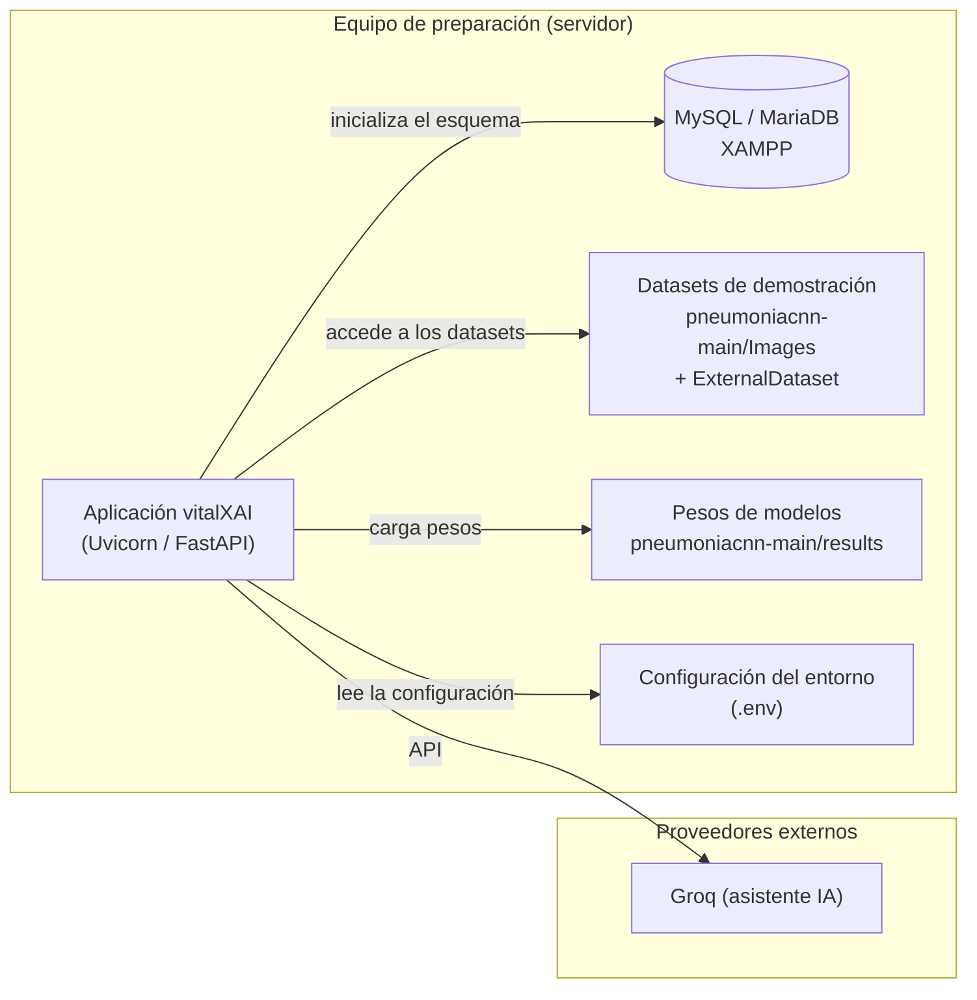
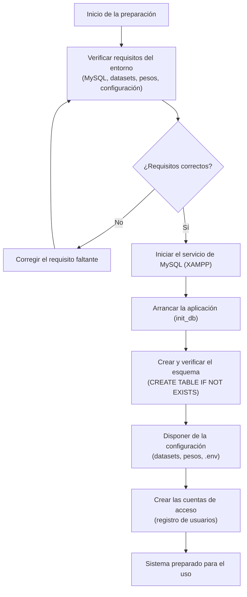

# Capítulo 24: Preparación inicial de los datos del sistema

La preparación inicial de los datos constituye la etapa del diseño que determina cómo se disponen los datos necesarios para que el sistema funcione por primera vez y cómo evoluciona su esquema de persistencia. El capítulo 23 definió el entorno y el proceso de construcción de la aplicación; este capítulo especifica la carga inicial de datos: qué información debe estar disponible antes del primer uso, en qué entorno se prepara y en qué orden se ejecutan los procedimientos que la materializan (Elmasri & Navathe, 2016). La especificación cierra el diseño de la persistencia y establece la base sobre la que se definen las pruebas y la implantación.

El capítulo se organiza en dos apartados, conforme a la guía de diseño de la memoria (punto 8): el entorno de preparación de los datos, que describe el entorno tecnológico en el que se dispone la carga inicial, y los procedimientos de preparación y evolución del esquema, que definen el proceso, el orden de lanzamiento de los procedimientos y el diseño detallado de cada uno. El contenido se apoya en el modelo físico de datos del capítulo 19 y en la guía de despliegue del sistema, que fija los requisitos operativos de la puesta en marcha.

La naturaleza de la carga inicial de vitalXAI condiciona su especificación. El sistema no dispone de un mecanismo de carga de datos semilla ni de un sistema de migraciones automáticas: el esquema relacional se crea y se verifica automáticamente en el arranque de la aplicación, y las cuentas de usuario se crean mediante el registro, sin datos de prueba precargados en la base de datos. La carga inicial de datos consiste, por tanto, en disponer del esquema inicializado, de los datos de demostración —los conjuntos de imágenes y los pesos de los modelos entrenados— y de la configuración del entorno que permite acceder a ellos. Los cambios futuros del esquema se gestionan de forma manual y se registran en el registro de cambios de la base de datos, sin un proceso de migración formal.

## 24.1 Entorno de preparación de los datos

El entorno de preparación de los datos de vitalXAI reúne los elementos necesarios para la puesta en marcha del sistema. La preparación se realiza sobre el mismo equipo que ejecuta la aplicación: el entorno de desarrollo y de demostración del proyecto, que aloja el servidor, la base de datos, los conjuntos de imágenes y los pesos de los modelos. La tabla siguiente resume los elementos del entorno y su papel en la carga inicial.

| Elemento | Papel en la carga inicial |
|---|---|
| MySQL (MariaDB en XAMPP) | Almacén relacional donde la aplicación crea y verifica el esquema en el arranque. |
| Datasets de demostración | Conjuntos de imágenes de entrenamiento y de validación externa, necesarios para el diagnóstico y la experimentación. |
| Pesos de los modelos | Pesos de las arquitecturas entrenadas, necesarios para ejecutar la inferencia del diagnóstico. |
| Configuración del entorno | Variables de entorno con las credenciales y las rutas de los datos, suministradas mediante el archivo `.env`. |

La base de datos relacional se prepara mediante el servicio de MySQL del entorno, que en el desarrollo se ejecuta a través de XAMPP. La aplicación no requiere un script de instalación del esquema: la función `init_db()` de `database.py`, invocada en el arranque, ejecuta las sentencias `CREATE TABLE IF NOT EXISTS` que materializan el modelo físico de datos definido en el capítulo 19, creando las tablas `users`, `consultations`, `training_jobs`, `job_queue` y `refresh_tokens` cuando no existen (Oracle, 2024). La verificación de la conexión se realiza al iniciar la aplicación, que informa de la imposibilidad de conectar si el servicio no está activo.

Los datos de demostración comprenden los conjuntos de imágenes y los pesos de los modelos. Los datasets se conservan en el directorio `pneumoniacnn-main/Images` (conjunto de entrenamiento y diagnóstico) y en `pneumoniacnn-main/ExternalDataset` (conjunto independiente para la validación externa), organizados en subcarpetas `NORMAL/` y `PNEUMONIA/`. Los pesos de los modelos entrenados se conservan en el directorio `pneumoniacnn-main/results`, con los archivos de pesos de cada arquitectura, y se cargan bajo demanda en la primera consulta de diagnóstico. La disponibilidad de estos artefactos es condición necesaria para el funcionamiento del diagnóstico y del laboratorio de experimentación.

La configuración del entorno se suministra mediante el archivo `.env`, que la aplicación carga en el arranque. La configuración incluye las credenciales de la base de datos (`DB_HOST`, `DB_USER`, `DB_PASSWORD`, `DB_NAME`, `DB_POOL_SIZE`), las claves de sesión (`JWT_SECRET_KEY` y los parámetros de expiración), la clave del asistente conversacional (`GROQ_API_KEY`) y las rutas de los datasets de demostración (`TFG_DEMO_DATASET` y `TFG_DEMO_EXTERNAL_DATASET`), que permiten lanzar los entrenamientos y la validación externa sin recurrir al selector de carpetas. Las cuentas de usuario no se precargan: se crean mediante el registro en la aplicación, de modo que la carga inicial de cuentas se realiza operativamente, conforme al flujo del subsistema de acceso.

El diagrama de despliegue de la figura 100 representa el entorno de preparación de los datos. La aplicación, en el arranque, inicializa el esquema en la base de datos MySQL, carga los pesos de los modelos bajo demanda, accede a los datasets de demostración para el diagnóstico y la experimentación, y lee la configuración del entorno; el asistente conversacional se integra como proveedor externo.

*Figura 100 - Diagrama de despliegue del entorno de preparación de los datos*

El diagrama refleja que la preparación inicial se resuelve en el equipo que aloja la aplicación, sin componentes de carga adicionales: la base de datos se inicializa desde la propia aplicación, y los datos de demostración y la configuración se disponen como artefactos del sistema de ficheros y variables de entorno. La verificación de los requisitos del entorno —el servicio de MySQL activo, la presencia de los datasets y de los pesos, y la configuración correcta— constituye el punto de partida de los procedimientos de preparación descritos en el apartado siguiente.

## 24.2 Procedimientos de preparación y evolución del esquema

Los procedimientos de preparación de los datos definen el proceso por el que el sistema queda disponible para su primer uso, el orden o la jerarquía de lanzamiento de cada procedimiento y el diseño detallado de cada uno. El proceso se representa mediante el diagrama de actividad de la figura 101, que refleja la secuencia de preparación: la verificación de los requisitos del entorno, la inicialización del esquema, la disposición de los datos de demostración y de la configuración, y la creación de las cuentas de acceso.

*Figura 101 - Diagrama de actividad del proceso de preparación inicial de los datos*

El diagrama de actividad refleja la jerarquía de lanzamiento de los procedimientos: la preparación comienza por la comprobación de los requisitos del entorno, que condiciona la corrección de los elementos faltantes; una vez verificados, se inicia el servicio de la base de datos y se arranca la aplicación, que crea y verifica el esquema; a continuación se dispone de los datos de demostración y de la configuración, y finalmente se crean las cuentas de acceso mediante el registro. Esta jerarquía garantiza que cada procedimiento cuenta con las condiciones del anterior antes de ejecutarse.

El diseño detallado de cada procedimiento que participa en la preparación inicial se especifica en la tabla siguiente, con su orden de lanzamiento, su descripción y la verificación de su resultado.

| Procedimiento | Orden | Descripción | Verificación |
|---|---|---|---|
| Verificación de requisitos | 1 | Comprobar que el servicio de MySQL está disponible, que existen los datasets y los pesos de los modelos y que la configuración del entorno es correcta. | El entorno informa de los requisitos faltantes y permite corregirlos antes de continuar. |
| Inicialización del esquema | 2 | Ejecutar la aplicación, que invoca `init_db()` y crea las tablas del esquema con `CREATE TABLE IF NOT EXISTS` cuando no existen. | El arranque informa de la conexión a la base de datos y de la verificación de las tablas. |
| Preparación de los datos de demostración | 3 | Disponer de los datasets de entrenamiento y de validación externa y de los pesos de los modelos en sus directorios correspondientes. | La solicitud de un diagnóstico carga los pesos del modelo; el laboratorio accede a las rutas de los datasets. |
| Configuración del entorno | 3 | Suministrar las variables de entorno del sistema mediante el archivo `.env`, con las credenciales, las claves y las rutas de los datasets. | La aplicación carga la configuración en el arranque y la utiliza en las operaciones de sesión, diagnóstico y experimentación. |
| Creación de cuentas | 4 | Crear las cuentas de acceso mediante el registro de usuarios en la aplicación, sin datos de prueba precargados. | El nuevo usuario inicia sesión y accede al panel de diagnóstico. |

Los procedimientos de preparación de los datos de demostración y de configuración se ejecutan en el mismo orden, ya que ambos deben estar completos antes del uso operativo del sistema; la tabla los ordena de forma conjunta en el paso tercero. La creación de cuentas constituye un procedimiento operativo y continuo, que no forma parte de una carga única sino del funcionamiento normal del subsistema de acceso.

La evolución del esquema de la base de datos se gestiona de forma manual, sin un sistema de migraciones automáticas. Cuando el modelo físico de datos cambia —por la incorporación de una tabla, una columna o una restricción—, la modificación se aplica actualizando las sentencias de creación de `database.py`, que en el siguiente arranque adapta el esquema a las tablas existentes mediante la política `CREATE TABLE IF NOT EXISTS`, y se registra en el registro de cambios de la base de datos del proyecto, con las sentencias SQL del cambio y las notas de reversión. Esta decisión, coherente con la simplicidad del esquema y con el estado del proyecto, evita la complejidad de un sistema de migraciones mientras la base de datos se encuentra en una fase estable; si el esquema evolucionara hacia cambios destructivos o una base de datos con datos persistidos críticos, la incorporación de un mecanismo de migraciones formal debería evaluarse conforme al registro de decisiones del proyecto.
