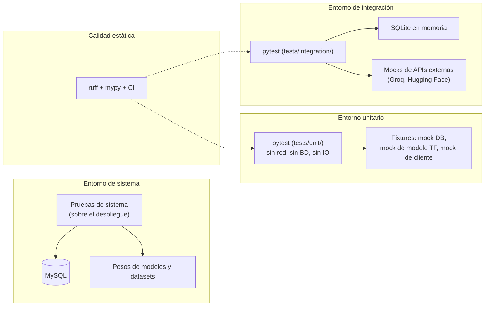

# Capítulo 25: Estrategia de verificación del sistema

La estrategia de verificación del sistema constituye la etapa del diseño que determina cómo se comprueba que el sistema construido se comporta conforme a lo especificado. El capítulo 16 definió el plan de pruebas de la plataforma desde la perspectiva del análisis, con las cinco categorías de verificación y sus criterios de éxito; este capítulo, conforme a la guía de diseño de la memoria (punto 9), especifica el entorno en el que se ejecutan las pruebas y la definición de los niveles de verificación, sin reproducir el detalle de cada prueba que ya documenta el capítulo 16. La estrategia distingue así el qué se verifica, que pertenece al plan de pruebas, del dónde y del cómo se verifica, que pertenece a este capítulo (Myers, Sandler, & Badgett, 2011).

El capítulo se organiza en dos apartados: los entornos de verificación, que describen el entorno tecnológico en el que se ejecutan las pruebas, las herramientas utilizadas, el origen de los datos de prueba y las restricciones operativas; y los niveles de verificación y criterios de aceptación, que definen los niveles de prueba, la naturaleza de las pruebas de integración y de sistema con una carga parecida a la de explotación, las validaciones funcionales y no funcionales que cubren las excepciones y los criterios que deben satisfacerse para aceptar cada nivel. El contenido se apoya en la guía de pruebas del proyecto, que fija los comandos, los niveles y el umbral de cobertura, y en el plan de pruebas del capítulo 16.

La verificación de vitalXAI combina la automatización con la verificación sobre el entorno real. Las pruebas unitarias y de integración se ejecutan de forma automatizada, integradas en el flujo de integración continua, y proporcionan una verificación repetible de la lógica de negocio y de los flujos críticos; las pruebas de rendimiento y de sistema se ejecutan sobre el despliegue de la plataforma, de modo que sus criterios se miden sobre el sistema real. Esta combinación, coherente con la metodología de desarrollo dirigida por pruebas del proyecto, garantiza que cualquier cambio posterior detecte las regresiones de forma inmediata y que la verificación final se realice en condiciones próximas a las de explotación.

## 25.1 Entornos de verificación

El entorno de verificación de vitalXAI se organiza en tres entornos que atienden a distintos niveles de aislamiento y de fidelidad con respecto al sistema real: el entorno unitario, el entorno de integración y el entorno de sistema. Cada entorno emplea sus propios dobles de prueba y su propio origen de datos, de modo que la verificación progresa desde el aislamiento total de los componentes hasta la ejecución sobre el despliegue real. La tabla siguiente resume los tres entornos y sus características.

| Entorno | Alcance | Aislamiento | Origen de los datos de prueba |
|---|---|---|---|
| Unitario | Verificación de componentes individuales (lógica de negocio, funciones puras, componentes aislados). | Sin red, sin base de datos y sin operaciones de entrada y salida; todos los servicios externos se sustituyen por dobles. | Fixtures de `tests/conftest.py`: base de datos simulada, modelo TensorFlow simulado y cliente externo simulado. |
| Integración | Verificación de la interacción entre capas (API y persistencia) y entre subsistemas. | Base de datos en memoria (SQLite) y servicios externos simulados. | Datos de siembra del directorio de integración y mocks de las APIs externas (Groq y Hugging Face). |
| Sistema | Verificación integral sobre el despliegue real de la plataforma. | Sin aislamiento: entorno real con la base de datos MySQL, los pesos de los modelos y los datasets. | Datos de demostración del entorno de despliegue (imágenes, pesos y cuentas). |

Las herramientas de verificación del proyecto se especifican conforme a la guía de pruebas. La batería automatizada se ejecuta con el marco de pruebas pytest, con la extensión de cobertura pytest-cov para medir la cobertura de los módulos de la aplicación y la extensión pytest-mock para la simulación de los servicios externos (pytest, 2024). La calidad estática se comprueba con ruff, que verifica el estilo y las reglas del código, y con mypy, que verifica los tipos de los módulos configurados (Ruff, 2024; Mypy, 2024). La verificación se integra en el flujo de integración continua, que ejecuta la batería de pruebas y las comprobaciones estáticas en cada integración.

El origen de los datos de prueba se resuelve mediante las fixtures y los datos de siembra del directorio de pruebas. Las fixtures del módulo `conftest.py` proporcionan la base de datos simulada, el modelo de TensorFlow simulado y el cliente externo simulado para las pruebas unitarias, de modo que la ejecución no depende de la red, de la base de datos ni de los pesos reales de los modelos. Las pruebas de integración utilizan una base de datos SQLite en memoria con datos de siembra y simulan las APIs externas, de modo que la verificación de los flujos entre subsistemas se centra en la colaboración de las capas internas. Los datos del entorno de sistema proceden del despliegue real: las imágenes de demostración, los pesos de los modelos y las cuentas de acceso, en coherencia con la preparación inicial de los datos del capítulo 24.

Las restricciones operativas del entorno de verificación son las siguientes. Los servicios externos —el proveedor del asistente conversacional, los modelos de Hugging Face y los modelos de TensorFlow— se simulan siempre en las pruebas unitarias y de integración, de modo que la batería automatizada es determinista y no depende de la disponibilidad de esos servicios. El umbral de cobertura del código está fijado en el setenta por ciento, con un valor actual superior a ese umbral, y la batería falla si no se alcanza. Las pruebas unitarias y de integración se ejecutan con los comandos definidos en la guía de pruebas del proyecto; las pruebas de rendimiento y de sistema se ejecutan manual o semiautomatizada sobre el despliegue, con la carga de trabajo parecida a la de explotación que se detalla en el apartado siguiente.

El diagrama de despliegue de la figura 102 representa el entorno de verificación del sistema. Las pruebas unitarias se ejecutan sobre las fixtures aisladas, las pruebas de integración sobre la base de datos en memoria con los servicios externos simulados, y las pruebas de sistema sobre el despliegue real con la base de datos MySQL y los artefactos del aprendizaje automático; las comprobaciones de calidad estática acompañan a la batería automatizada.

*Figura 102 - Diagrama de despliegue del entorno de verificación*

El diagrama refleja la progresión de la verificación por entornos: la batería automatizada parte del aislamiento total del entorno unitario, avanza a la interacción entre capas en el entorno de integración y culmina en la verificación sobre el despliegue real en el entorno de sistema. La calidad estática se aplica sobre la batería automatizada, de modo que el estilo y los tipos del código se verifican en cada integración. Los criterios de aceptación de cada nivel se definen en el apartado siguiente, completando la estrategia de verificación del sistema.

## 25.2 Niveles de verificación y criterios de aceptación

Los niveles de verificación definen la profundidad de la comprobación del sistema, en correspondencia con los entornos descritos en el apartado anterior. Cada nivel agrupa las verificaciones que se ejecutan en su entorno y establece los criterios que deben satisfacerse para aceptarlo, de modo que la superación de un nivel es condición para considerar verificada la parte del sistema que abarca. La definición de los niveles se mantiene coherente con el plan de pruebas del capítulo 16, que detalla las pruebas concretas de cada categoría; en este apartado se especifican los niveles, su alcance y sus criterios de aceptación, sin reproducir el detalle de cada prueba. Los tres niveles se presentan a continuación, con la tabla de criterios de aceptación de cada uno.

### 25.2.1 Nivel unitario

El nivel unitario verifica el comportamiento correcto de los componentes del sistema de manera aislada, en el entorno unitario, sin dependencia de la red, de la base de datos ni de los servicios externos, que se sustituyen por dobles de prueba. Cubre la lógica de negocio de mayor criticidad funcional: la gestión de cuentas y sesiones, la validación de las entradas, el motor de inferencia con modelos simulados, la generación de las explicaciones, la gestión del historial, el laboratorio de entrenamiento, la cola de trabajos, la internacionalización y el acceso a datos. La verificación unitaria recorre tanto los caminos normales como las excepciones —entradas inválidas, credenciales incorrectas, usuarios duplicados, tokens revocados, modelos ausentes, sesiones ajenas y trabajos no interrumpibles—, de modo que cada componente se comprueba en las condiciones esperadas y en sus desviaciones. Este nivel se corresponde con la categoría de verificación de componentes del capítulo 16.

| Criterio | Descripción |
|---|---|
| Batería unitaria superada | Todos los tests unitarios del directorio `tests/unit/` se ejecutan y superan sin fallos. |
| Cobertura de código | La cobertura de los módulos de la aplicación alcanza al menos el umbral del setenta por ciento. |
| Calidad estática | La verificación con ruff no reporta errores de estilo y la verificación con mypy no reporta errores de tipos en los módulos configurados. |
| Determinismo | La batería unitaria se ejecuta sin dependencia de la red, de la base de datos ni de los servicios externos. |
| Cobertura de excepciones | Los caminos alternativos y de error de los componentes verificados están cubiertos por las pruebas. |

La superación del nivel unitario se verifica en cada ciclo de desarrollo mediante los comandos de la guía de pruebas del proyecto, de modo que la calidad de los componentes se comprueba de forma continua y las regresiones se detectan de inmediato.

### 25.2.2 Nivel de integración

El nivel de integración verifica la colaboración entre las capas del sistema y entre los subsistemas, en el entorno de integración, superando el aislamiento del nivel unitario. Las pruebas ejercitan la interacción entre la API, la capa de negocio y la persistencia, sustituyendo la base de datos real por una instancia en memoria y los servicios externos por simulaciones, de modo que la verificación se centra en la colaboración interna sin depender del entorno de producción. Los flujos críticos se ejercitan con una carga de trabajo parecida a la de explotación: el flujo de acceso a la plataforma, el flujo de un diagnóstico desde la subida hasta el resultado, el aislamiento de datos entre usuarios, la supervisión administrativa y el lanzamiento de un experimento desde el asistente hasta la cola. La verificación de integración confirma que los subsistemas colaboran correctamente y que las condiciones de autorización y de aislamiento se respetan en los flujos combinados. Este nivel se corresponde con la categoría de verificación de flujos entre subsistemas del capítulo 16.

| Criterio | Descripción |
|---|---|
| Batería de integración superada | Todos los tests de integración del directorio `tests/integration/` se ejecutan y superan sin fallos. |
| Flujos críticos | Los flujos de extremo a extremo entre la API, la capa de negocio y la persistencia se verifican correctamente. |
| Aislamiento y autorización | Las condiciones de aislamiento de datos entre usuarios y de autorización administrativa se respetan en los flujos combinados. |
| Carga parecida a la de explotación | Los flujos se ejercitan con una carga de trabajo representativa del uso real de la plataforma. |
| Servicios externos simulados | La batería de integración no depende de la disponibilidad de los servicios externos, que se simulan en las pruebas. |

La superación del nivel de integración se verifica antes de la integración de los cambios en el flujo de trabajo del proyecto, de modo que la colaboración entre subsistemas queda confirmada antes de la verificación sobre el entorno real.

### 25.2.3 Nivel de sistema

El nivel de sistema verifica integralmente la plataforma sobre el despliegue real, en el entorno de sistema, sin aislamiento de la base de datos ni de los artefactos del aprendizaje automático. Las pruebas ejercitan los flujos completos de uso con la base de datos MySQL, los pesos de los modelos y los datasets del entorno de despliegue, con una carga de trabajo parecida a la de explotación. La verificación comprende las validaciones funcionales de los flujos completos —el diagnóstico asistido, la gestión del historial, el laboratorio de entrenamiento, la ejecución asíncrona, la supervisión administrativa y las capacidades transversales— y las validaciones no funcionales de rendimiento y capacidad de respuesta, de protección y control de acceso y de usabilidad, cubriendo las excepciones en ambos casos. Este nivel se corresponde con las categorías de protección, de rendimiento y de verificación integral de los flujos completos de uso del capítulo 16.

| Criterio | Descripción |
|---|---|
| Flujos completos | Los flujos de uso de la plataforma se realizan correctamente sobre el despliegue real: diagnóstico, historial, laboratorio, cola, administración y capacidades transversales. |
| Validaciones funcionales | El comportamiento de los flujos coincide con el especificado en los casos de uso, incluidos los escenarios alternativos y de error. |
| Seguridad | Los mecanismos de protección (CSRF, cabeceras de seguridad, limitación de peticiones y gestión de tokens) se verifican sobre el sistema real. |
| Rendimiento | Los tiempos de respuesta de la inferencia y la ejecución sin bloqueo de la interfaz satisfacen los umbrales definidos para el entorno de despliegue. |
| Artefactos | Los informes PDF del diagnóstico y de la sesión, y los mapas de explicabilidad, se generan correctamente y se entregan al usuario. |
| Carga de explotación | La verificación se realiza con una carga de trabajo parecida a la de explotación y cubre las excepciones previstas. |

La superación del nivel de sistema se verifica sobre el despliegue de la plataforma antes de su presentación, y constituye la confirmación final de que el sistema construido satisface los requisitos funcionales y no funcionales del análisis. Con la superación de los tres niveles, la estrategia de verificación del sistema queda completa y garantiza que las evoluciones futuras de la plataforma podrán incorporarse con un riesgo de regresión controlado y medible.
