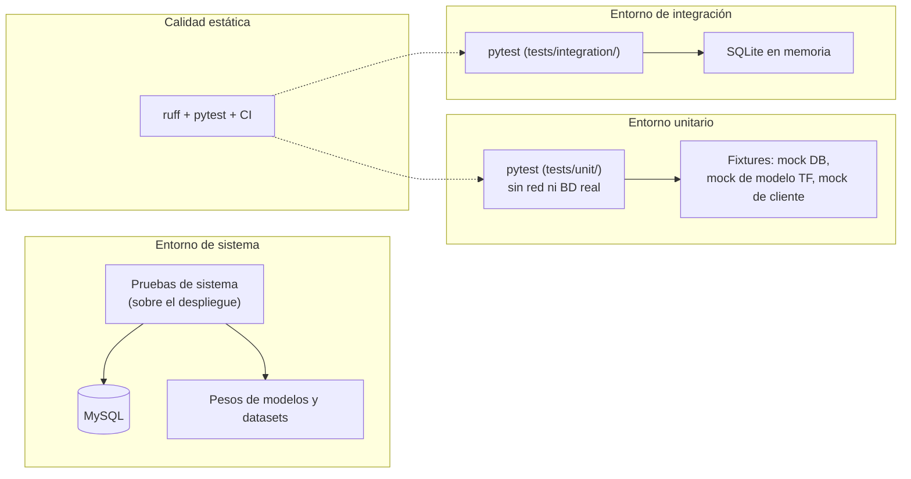

# Capítulo 25: Estrategia de verificación del sistema

Este capítulo define cómo se comprobará el comportamiento de vitalXAI una vez construido. El capítulo 16 ya establece qué pruebas deben realizarse y qué resultado permite superarlas; aquí se concretan los entornos, las herramientas y los niveles en los que se organizan esas comprobaciones, sin repetir el catálogo de pruebas. La separación entre el alcance del plan y la forma de ejecutarlo sigue la distinción habitual de la planificación de pruebas (Myers, Sandler, & Badgett, 2011).

El capítulo se organiza en dos apartados: los entornos de verificación, que describen el entorno tecnológico en el que se ejecutan las pruebas, las herramientas utilizadas, el origen de los datos de prueba y las restricciones operativas; y los niveles de verificación y criterios de aceptación, que definen los niveles de prueba, la naturaleza de las pruebas de integración y de sistema con una carga parecida a la de explotación, las validaciones funcionales y no funcionales que cubren las excepciones y los criterios que deben satisfacerse para aceptar cada nivel. El contenido se apoya en la guía de pruebas del proyecto, que fija los comandos, los niveles y el umbral de cobertura, y en el plan de pruebas del capítulo 16.

La verificación de vitalXAI combina pruebas automatizadas con comprobaciones sobre el entorno real. Las pruebas unitarias y la prueba de integración disponible se ejecutan mediante pytest y se incorporan al flujo de integración continua; las pruebas de rendimiento y de sistema se reservan para el despliegue de la plataforma, donde sus criterios pueden medirse sobre el sistema real. Esta combinación ayuda a detectar regresiones en la lógica de la aplicación y permite comprobar los flujos finales en condiciones próximas a las de explotación.

## 25.1 Entornos de verificación

El entorno de verificación de vitalXAI se organiza en tres entornos que atienden a distintos niveles de aislamiento y de fidelidad con respecto al sistema real: el entorno unitario, el entorno de integración y el entorno de sistema. Cada entorno emplea sus propios dobles de prueba y su propio origen de datos, de modo que la verificación progresa desde el aislamiento total de los componentes hasta la ejecución sobre el despliegue real. La tabla siguiente resume los tres entornos y sus características.

| Entorno | Alcance | Aislamiento | Origen de los datos de prueba |
|---|---|---|---|
| Unitario | Verificación de componentes individuales (lógica de negocio, funciones puras, componentes aislados). | Sin red ni base de datos real; las dependencias externas se sustituyen por dobles y las operaciones de ficheros se aíslan con mocks o archivos temporales. | Fixtures de `tests/conftest.py`: base de datos simulada y modelo TensorFlow simulado, junto con dobles definidos por cada prueba. |
| Integración | Verificación de la interacción entre capas (API y persistencia) y entre subsistemas. | Base de datos en memoria (SQLite); no requiere la base de datos MySQL. | Esquema y datos preparados por `tests/integration/conftest.py`; la cobertura actual se centra en los flujos de autenticación e historial. |
| Sistema | Verificación integral sobre el despliegue real de la plataforma. | Sin aislamiento: entorno real con la base de datos MySQL, los pesos de los modelos y los datasets. | Datos de demostración del entorno de despliegue (imágenes, pesos y cuentas). |

Las herramientas de verificación del proyecto se especifican conforme a la guía de pruebas. La batería automatizada se ejecuta con pytest y pytest-cov, que mide la cobertura de los módulos configurados; los dobles de prueba se construyen principalmente con `unittest.mock` y fixtures de pytest (pytest, 2024). La calidad estática se comprueba con ruff, que verifica el estilo y las reglas del código, mientras que mypy dispone de configuración para los módulos indicados, aunque no forma parte del flujo de CI actual (Ruff, 2024; Mypy, 2024). La integración continua ejecuta Ruff y la batería de pytest con el umbral de cobertura configurado.

El origen de los datos de prueba se resuelve mediante las fixtures y el esquema preparado en el directorio de pruebas. Las fixtures del módulo `conftest.py` proporcionan una base de datos simulada y un modelo de TensorFlow simulado para las pruebas unitarias, mientras que cada prueba sustituye las demás dependencias que necesita. La prueba de integración disponible utiliza una base de datos SQLite en memoria y datos creados durante el propio test; actualmente se centra en los flujos de autenticación e historial y no ejercita las APIs externas. Los datos del entorno de sistema proceden del despliegue real: las imágenes de demostración, los pesos de los modelos y las cuentas de acceso, en coherencia con la preparación inicial de los datos del capítulo 24.

Las restricciones operativas del entorno de verificación son las siguientes. Las pruebas unitarias sustituyen las dependencias costosas o externas cuando resulta necesario, de modo que no dependen de la disponibilidad de la red, de los pesos reales o de un proveedor conversacional. La prueba de integración utiliza SQLite en memoria y no reproduce todo el despliegue productivo. El umbral de cobertura está fijado en el setenta por ciento y la configuración de CI hace fallar la batería si no se alcanza. Las pruebas unitarias y de integración se ejecutan con los comandos definidos en el proyecto; las pruebas de rendimiento y de sistema se plantean manual o semiautomáticamente sobre el despliegue.

El diagrama de despliegue de la figura 102 representa el entorno de verificación del sistema. Las pruebas unitarias se ejecutan sobre las fixtures aisladas, la prueba de integración disponible sobre la base de datos en memoria y las pruebas de sistema sobre el despliegue real con MySQL y los artefactos del aprendizaje automático. Las comprobaciones de calidad estática acompañan a la batería automatizada.

*Figura 102 - Diagrama de despliegue del entorno de verificación*

El diagrama refleja la progresión prevista de la verificación por entornos: la batería automatizada parte del aislamiento del entorno unitario, pasa por la interacción entre capas en el entorno de integración y culmina en la comprobación sobre el despliegue real. Ruff acompaña a la batería en la integración continua; mypy queda configurado, pero no se ejecuta actualmente en ese flujo. Los criterios de aceptación de cada nivel se definen en el apartado siguiente.

## 25.2 Niveles de verificación y criterios de aceptación

Los niveles de verificación definen la profundidad de la comprobación del sistema, en correspondencia con los entornos descritos en el apartado anterior. Cada nivel agrupa las verificaciones que se ejecutan en su entorno y establece los criterios que deben satisfacerse para aceptarlo, de modo que la superación de un nivel es condición para considerar verificada la parte del sistema que abarca. La definición de los niveles se mantiene coherente con el plan de pruebas del capítulo 16, que detalla las pruebas concretas de cada categoría; en este apartado se especifican los niveles, su alcance y sus criterios de aceptación, sin reproducir el detalle de cada prueba. Los tres niveles se presentan a continuación, con la tabla de criterios de aceptación de cada uno.

### 25.2.1 Nivel unitario

El nivel unitario verifica el comportamiento de los componentes de forma aislada. Las pruebas no dependen de la red, de una base de datos real ni de los servicios externos, que se sustituyen por dobles cuando es necesario; sí pueden utilizar ficheros temporales para probar operaciones de entrada y salida. Cubre la gestión de cuentas y sesiones, la validación de entradas, el motor de inferencia con modelos simulados, la generación de explicaciones, el historial, el laboratorio, la cola, la internacionalización y el acceso a datos. También recorre caminos alternativos como entradas inválidas, credenciales incorrectas, usuarios duplicados, tokens revocados, modelos ausentes, sesiones ajenas y trabajos no interrumpibles. Este nivel se corresponde con la categoría de verificación de componentes del capítulo 16.

| Criterio | Descripción |
|---|---|
| Batería unitaria superada | Todos los tests unitarios del directorio `tests/unit/` se ejecutan y superan sin fallos. |
| Cobertura de código | La cobertura de los módulos de la aplicación alcanza al menos el umbral del setenta por ciento. |
| Calidad estática | La verificación con ruff no reporta errores de estilo y la verificación con mypy no reporta errores de tipos en los módulos configurados. |
| Determinismo | La batería unitaria se ejecuta sin dependencia de la red, de la base de datos ni de los servicios externos. |
| Cobertura de excepciones | Los caminos alternativos y de error de los componentes verificados están cubiertos por las pruebas. |

La superación del nivel unitario se comprueba cuando se ejecutan los comandos de pruebas del proyecto, y la integración continua repite esta comprobación en los eventos configurados del repositorio. Así se obtiene una detección temprana de regresiones en los componentes cubiertos.

### 25.2.2 Nivel de integración

El nivel de integración verifica la colaboración entre las capas del sistema y entre los subsistemas, en el entorno de integración, superando el aislamiento del nivel unitario. Su alcance previsto cubre la interacción entre la API, la lógica de aplicación y la persistencia mediante una base de datos en memoria. El plan incluye como flujos críticos el acceso a la plataforma, el diagnóstico desde la subida hasta el resultado, el aislamiento de datos entre usuarios, la supervisión administrativa y el lanzamiento de un experimento desde el asistente hasta la cola. En el estado actual del repositorio, la prueba de integración disponible cubre principalmente el acceso, el registro, el panel y el historial; el resto de los flujos requiere ampliar la cobertura antes de poder considerarse verificado. Este nivel se corresponde con la categoría de verificación de flujos entre subsistemas del capítulo 16.

| Criterio | Descripción |
|---|---|
| Batería de integración superada | Todos los tests de integración del directorio `tests/integration/` se ejecutan y superan sin fallos. |
| Flujos críticos | Los flujos de extremo a extremo entre la API, la capa de negocio y la persistencia se verifican correctamente. |
| Aislamiento y autorización | Las condiciones de aislamiento de datos entre usuarios y de autorización administrativa se respetan en los flujos combinados. |
| Carga concurrente | Se ejecutan operaciones de consulta y gestión del historial con diez usuarios autenticados concurrentes, sin superar el doble del tiempo medido con carga baja. |
| Dependencias externas | La prueba de integración disponible no depende de servicios externos; la cobertura de otros flujos que requieran simulaciones queda pendiente. |

La superación del nivel de integración se verifica antes de la integración de los cambios en el flujo de trabajo del proyecto, de modo que la colaboración entre subsistemas queda confirmada antes de la verificación sobre el entorno real.

### 25.2.3 Nivel de sistema

El nivel de sistema verifica integralmente la plataforma sobre el despliegue real, sin aislar la base de datos ni los artefactos del aprendizaje automático. Las pruebas previstas ejercitan los flujos completos con MySQL, los pesos de los modelos y los datasets del entorno de despliegue, utilizando una carga de trabajo parecida a la de explotación. Incluyen el diagnóstico asistido, el historial, el laboratorio, la ejecución asíncrona, la supervisión administrativa y las capacidades transversales, además de las comprobaciones no funcionales de rendimiento y de protección y control de acceso. La usabilidad se mantiene como criterio de aceptación, pero no existe una validación empírica con usuarios reales en el proyecto. Este nivel se corresponde con las categorías de protección, rendimiento y verificación integral de los flujos completos del capítulo 16.

| Criterio | Descripción |
|---|---|
| Flujos completos | Los flujos de uso de la plataforma se realizan correctamente sobre el despliegue real: diagnóstico, historial, laboratorio, cola, administración y capacidades transversales. |
| Validaciones funcionales | El comportamiento de los flujos coincide con el especificado en los casos de uso, incluidos los escenarios alternativos y de error. |
| Seguridad | Los mecanismos de protección (CSRF, cabeceras de seguridad, limitación de peticiones y gestión de tokens) se verifican sobre el sistema real. |
| Rendimiento | La petición de diagnóstico devuelve su identificador en menos de 2 segundos, la inferencia con el modelo ya cargado finaliza en menos de 15 segundos y la interfaz permanece operativa durante las tareas largas. La prueba de concurrencia utiliza diez usuarios autenticados y no permite superar el doble del tiempo medido con carga baja. |
| Usabilidad | Una persona que no participe en el desarrollo completa correctamente, sin asistencia del evaluador, los cuatro flujos principales, con una tasa de éxito del 100 %. |
| Adaptación visual | Las vistas principales se muestran sin pérdida de contenido ni desplazamiento horizontal no previsto en 1366 × 768 píxeles y 390 × 844 píxeles. |
| Artefactos | Los informes PDF del diagnóstico y de la sesión, y los mapas de explicabilidad, se generan correctamente y quedan disponibles según las rutas y operaciones implementadas. |
| Carga de explotación | La verificación se realiza con una carga de trabajo parecida a la de explotación y cubre las excepciones previstas. |

La superación del nivel de sistema se verifica sobre el despliegue de la plataforma antes de su presentación y confirma el comportamiento de los flujos y requisitos incluidos en el alcance de las pruebas. La comprobación de usabilidad se limita a una revisión estructurada y no equivale a una evaluación con usuarios reales, que no se realizó durante el proyecto. Los requisitos RNF-006, RNF-009 y RNF-017 permanecen pendientes de implementación y, por tanto, no pueden considerarse verificados en el prototipo actual.
