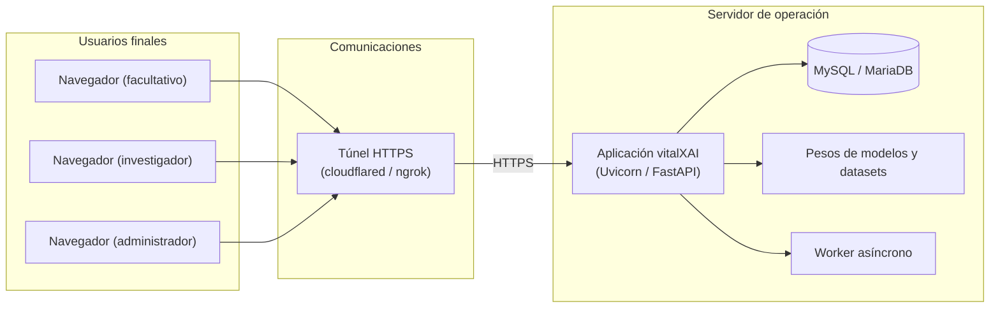

# Capítulo 26: Implantación del sistema

Este capítulo define las condiciones necesarias para poner vitalXAI en funcionamiento y para que sus usuarios puedan operar con ella. Parte de la construcción descrita en el capítulo 23 y de la preparación de datos del capítulo 24, y añade la documentación, la formación, la infraestructura y el acceso necesarios para la operación. La implantación se describe como una preparación para la demostración y no como una certificación de uso clínico (Sharp, Rogers, & Preece, 2019).

El capítulo se organiza en dos apartados: la documentación necesaria para la operación, que especifica el manual de usuario y sus características; y la implantación en el entorno de operación, que define las necesidades de formación, los requisitos de infraestructura e instalación y el proceso de puesta en marcha. El contenido se apoya en la guía de despliegue del proyecto y en los capítulos precedentes de diseño, de modo que la implantación mantiene la coherencia con la construcción y con la preparación de los datos.

La implantación de vitalXAI se orienta a dos escenarios de operación. El escenario principal es el despliegue de la plataforma en un equipo que aloja el servidor, la base de datos y los artefactos del aprendizaje automático, al que acceden los usuarios finales a través de la red; en la demostración del proyecto, el acceso se realiza mediante un túnel HTTPS que expone el servidor a través de una URL pública. La documentación y los requisitos de implantación se especifican para ambos escenarios, de modo que la operación del sistema queda cubierta tanto en el uso local como en el acceso remoto.

## 26.1 Documentación necesaria para la operación

Los entregables documentales comprometidos para el proyecto son la memoria del Trabajo Fin de Grado y el manual de usuario. La memoria recoge el análisis, el diseño, la implementación, las pruebas y las conclusiones. El manual de usuario proporciona las instrucciones necesarias para que los profesionales utilicen las funciones principales de la plataforma. La información técnica de explotación, administración, construcción y despliegue se mantiene distribuida en los capítulos de la memoria y en la guía interna de despliegue del proyecto, pero no se presenta como un manual independiente entregable.

| Entregable | Destinatarios | Contenido |
|---|---|---|
| Memoria del Trabajo Fin de Grado | Tutor, tribunal y personas interesadas en el proyecto. | Plan de proyecto, análisis, diseño, implementación, pruebas, resultados, limitaciones y conclusiones. |
| Manual de usuario | Profesionales de la plataforma: facultativos e investigadores. | Acceso y registro; diagnóstico asistido (subida de la radiografía, selección del modelo, solicitud del diagnóstico, visualización del resultado y de los mapas de explicabilidad, y generación del informe PDF); gestión del historial (listado, detalle, renombrado y eliminación); laboratorio de entrenamiento (configuración con el asistente, lanzamiento de experimentos, consulta de sesiones y resultados e informe de la sesión); y capacidades transversales (idioma, tema visual y cola de trabajos). |

El manual de usuario se elabora en formato digital, en el mismo formato de documentación del proyecto, y se organiza por rol y por flujo funcional. Incluye los pasos de cada operación, las condiciones que deben cumplirse, los resultados esperados y los escenarios alternativos y de error. La memoria constituye el segundo entregable documental y conserva la descripción técnica necesaria para comprender la arquitectura, la construcción, la preparación de los datos y la implantación.

La guía de despliegue del proyecto es un documento interno de apoyo. Recoge los requisitos operativos y el procedimiento de la demostración, pero no forma parte de los entregables comprometidos. La documentación de diseño de la memoria constituye la referencia técnica de la arquitectura, el diseño de casos de uso, de clases y de interfaces, y de la construcción y preparación de los datos.

## 26.2 Implantación en el entorno de operación

La implantación en el entorno de operación define las necesidades de formación de los usuarios, los requisitos de infraestructura e instalación y el proceso de puesta en marcha de la plataforma. Los requisitos se apoyan en los capítulos de construcción y de preparación de los datos: la implantación dispone el sistema sobre el entorno descrito en el capítulo 23 y aplica la preparación inicial definida en el capítulo 24, y añade las condiciones de formación y de acceso propias de la operación.

Las necesidades de formación se orientan a los usuarios previstos para la plataforma. El manual de usuario describe la operación clínica de los facultativos y el uso del laboratorio de entrenamiento por los investigadores. La información sobre administración y puesta en marcha se encuentra en los capítulos técnicos correspondientes y en la guía interna de despliegue. No se realizaron sesiones de formación ni evaluaciones con usuarios reales durante el proyecto; por tanto, el manual no constituye evidencia de usabilidad.

Los requisitos de infraestructura e instalación se especifican para el entorno de operación, atendiendo al software, al hardware y a las comunicaciones. En cuanto al software, el sistema requiere Python en su versión 3.11 o superior, el servicio de MySQL (en el entorno de desarrollo, MariaDB mediante XAMPP) y las dependencias declaradas en el archivo `requirements.txt` (FastAPI, 2024; Oracle, 2024). En cuanto al hardware, la plataforma requiere recursos de memoria y de cómputo suficientes para la carga de los modelos de TensorFlow y la ejecución del pipeline MLOps, además de espacio de almacenamiento para los datasets, los pesos de los modelos y los resultados de los entrenamientos; una GPU puede reducir el tiempo de los entrenamientos, aunque no forma parte de un requisito mínimo documentado (TensorFlow, 2024). En cuanto a las comunicaciones, la operación local accede al servidor mediante la dirección local del equipo, mientras que el acceso remoto de la demostración se expone mediante un túnel HTTPS que publica el servidor a través de una URL pública; en un despliegue de producción, la comunicación debe cifrarse mediante HTTPS con un certificado válido (IETF, 2018).

El diagrama de implantación de la figura 103 representa el escenario remoto de demostración. Los usuarios finales, el facultativo, el investigador y el administrador, acceden mediante su navegador a través del túnel HTTPS; el servidor de operación aloja la aplicación, la base de datos MySQL, los pesos de los modelos y los datasets, y el worker asíncrono. En el escenario local, el navegador accede directamente a la dirección local del servidor.

*Figura 103 - Diagrama de implantación del sistema en el entorno de operación*

El diagrama refleja la disposición de la demostración remota: los usuarios finales no acceden directamente al equipo que aloja el servidor, sino mediante el túnel HTTPS, de modo que los datos de la plataforma permanecen en el servidor de operación. El servidor agrupa la aplicación, la persistencia y los artefactos del aprendizaje automático, y el worker atiende las tareas asíncronas de la cola.

El proceso de implantación aplica los procedimientos definidos en los capítulos precedentes. Primero se construye el sistema conforme al capítulo 23: se prepara el entorno virtual y se instalan las dependencias. Después se prepara el entorno de datos conforme al capítulo 24: se verifican los requisitos, se inicia MySQL, se dispone el archivo `.env` junto con los datasets y los pesos, y se crean las cuentas de acceso. A continuación se ejecuta `main.py`, que inicializa el esquema y arranca el worker. Finalmente se establece el acceso local o remoto y se verifica el sistema conforme al capítulo 25. Con la infraestructura dispuesta y la documentación comprometida entregada, la plataforma queda preparada para su demostración.
