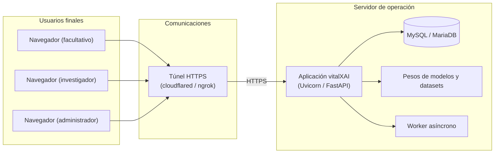

# Capítulo 26: Implantación del sistema

La implantación del sistema constituye la etapa final del diseño que determina cómo se pone en operación la plataforma y qué documentación se necesita para operar con ella. Los capítulos 23 y 24 especificaron la construcción del sistema y la preparación inicial de sus datos; este capítulo, conforme a la guía de diseño de la memoria (punto 10), define los requisitos de documentación necesarios para la operación y los requisitos de implantación en el entorno de trabajo, incluidas las necesidades de formación y la infraestructura de instalación. La especificación establece así las condiciones bajo las que el sistema pasa a estar disponible para sus usuarios finales (Sharp, Rogers, & Preece, 2019).

El capítulo se organiza en dos apartados: la documentación necesaria para la operación, que especifica los manuales requeridos y sus características; y la implantación en el entorno de operación, que define las necesidades de formación, los requisitos de infraestructura e instalación y el proceso de puesta en marcha. El contenido se apoya en la guía de despliegue del proyecto y en los capítulos precedentes de diseño, de modo que la implantación mantiene la coherencia con la construcción y con la preparación de los datos.

La implantación de vitalXAI se orienta a dos escenarios de operación. El escenario principal es el despliegue de la plataforma en un equipo que aloja el servidor, la base de datos y los artefactos del aprendizaje automático, al que acceden los usuarios finales a través de la red; en la demostración del proyecto, el acceso se realiza mediante un túnel HTTPS que expone el servidor a través de una URL pública. La documentación y los requisitos de implantación se especifican para ambos escenarios, de modo que la operación del sistema queda cubierta tanto en el uso local como en el acceso remoto.

## 26.1 Documentación necesaria para la operación

La operación de vitalXAI requiere tres manuales, dirigidos a los distintos roles que intervienen en el uso y el mantenimiento de la plataforma: el manual de usuario, el manual de explotación y administración, y el manual de despliegue e implantación. Cada manual define su destinatario, su contenido y sus características, de modo que toda la documentación necesaria para operar con el sistema queda especificada. La tabla siguiente resume los manuales requeridos.

| Manual | Destinatarios | Contenido |
|---|---|---|
| Manual de usuario | Profesionales de la plataforma: facultativos e investigadores. | Acceso y registro; diagnóstico asistido (subida de la radiografía, selección del modelo, solicitud del diagnóstico, visualización del resultado y de los mapas de explicabilidad, e informe PDF); gestión del historial (listado, detalle, renombrado y eliminación); laboratorio de entrenamiento (configuración con el asistente, lanzamiento de experimentos, consulta de sesiones y resultados e informe de la sesión); y capacidades transversales (idioma, tema visual y cola de trabajos). |
| Manual de explotación y administración | Administrador de la plataforma y responsable de la operación. | Supervisión de la plataforma (listado de usuarios, consultas de un usuario y detalle de una consulta); gestión operativa de la actividad; monitorización de la cola de trabajos; y resolución de incidencias operativas. |
| Manual de despliegue e implantación | Equipo técnico responsable de la puesta en marcha. | Entorno y construcción del sistema; preparación inicial de los datos; despliegue en el entorno de operación; configuración del acceso remoto mediante el túnel HTTPS; y procedimientos de verificación. Se apoya en la guía de despliegue del proyecto y en los capítulos 23 y 24. |

Las características de los manuales se especifican conforme a la guía de diseño de la memoria. Los documentos se elaboran en formato digital, en el mismo formato de documentación del proyecto —Markdown, convertible a PDF—, de modo que puedan revisarse, distribuirse y consultarse en cualquier entorno. La estructura de cada manual se organiza por rol y por flujo funcional, con secciones dedicadas a cada operación del sistema y a sus condiciones de error, de modo que el lector localiza con rapidez el procedimiento que necesita. El contenido combina la descripción de los pasos de cada operación, las condiciones que deben cumplirse y los resultados esperados, junto con los escenarios alternativos y de error. El control de versiones de los manuales se alinea con la gestión de versiones del proyecto, de modo que cada versión de la documentación corresponde a una versión del sistema y refleja sus cambios. Finalmente, la distribución se dirige a los destinatarios indicados en la tabla: el manual de usuario a los profesionales, el de explotación y administración al administrador y al responsable de operación, y el de despliegue e implantación al equipo técnico.

La documentación del sistema se completa con la guía de despliegue del proyecto, que recoge los requisitos operativos y el procedimiento de la demostración, y con la documentación de diseño de la memoria, que constituye la referencia técnica de la arquitectura, el diseño de casos de uso, de clases y de interfaces, y de la construcción y preparación de los datos. Estos documentos, junto con los tres manuales, conforman el conjunto de documentación necesario para operar con el sistema en su entorno de trabajo.

## 26.2 Implantación en el entorno de operación

La implantación en el entorno de operación define las necesidades de formación de los usuarios, los requisitos de infraestructura e instalación y el proceso de puesta en marcha de la plataforma. Los requisitos se apoyan en los capítulos de construcción y de preparación de los datos: la implantación dispone el sistema sobre el entorno descrito en el capítulo 23 y aplica la preparación inicial definida en el capítulo 24, y añade las condiciones de formación y de acceso propias de la operación.

Las necesidades de formación se orientan a los tres roles que operan con la plataforma. La formación de los facultativos se centra en la operación clínica: el diagnóstico asistido, desde la subida de la radiografía hasta el informe PDF, y la gestión del historial de consultas. La formación de los investigadores se centra en el laboratorio de entrenamiento: la configuración conversacional de los experimentos, el lanzamiento de los entrenamientos, la consulta de los resultados y la interpretación de las comparativas estadísticas. La formación del administrador se centra en la administración del sistema: la supervisión de los usuarios y de su actividad, la monitorización de la cola de trabajos y la resolución de las incidencias operativas. La formación se realiza mediante sesiones guiadas sobre la plataforma, apoyadas en el manual de usuario y en el manual de explotación y administración, de modo que cada rol aprende sobre el flujo real que va a utilizar.

Los requisitos de infraestructura e instalación se especifican para el entorno de operación, atendiendo al software, al hardware y a las comunicaciones. En cuanto al software, el sistema requiere Python en su versión 3.11 o superior, el servicio de MySQL (en el entorno de desarrollo, MariaDB mediante XAMPP) y las dependencias declaradas en el archivo `requirements.txt` (FastAPI, 2024; Oracle, 2024). En cuanto al hardware, la plataforma requiere recursos de memoria y de cómputo suficientes para la carga de los modelos de TensorFlow y la ejecución del pipeline MLOps, además de espacio de almacenamiento para los datasets, los pesos de los modelos y los resultados de los entrenamientos; la disponibilidad de una unidad de cómputo acelerado por GPU reduce de forma significativa el tiempo de los entrenamientos. En cuanto a las comunicaciones, la operación local accede al servidor mediante la dirección local del equipo, mientras que el acceso remoto de la demostración se expone mediante un túnel HTTPS que publica el servidor a través de una URL pública; en un despliegue de producción, la comunicación debe cifrarse con HTTPS mediante un certificado válido.

El diagrama de implantación de la figura 103 representa el sistema en su entorno de operación. Los usuarios finales —el facultativo, el investigador y el administrador— acceden mediante su navegador a través de las comunicaciones, que en el escenario de demostración se establecen mediante el túnel HTTPS; el servidor de operación aloja la aplicación, la base de datos MySQL, los pesos de los modelos y los datasets, y el worker asíncrono.

*Figura 103 - Diagrama de implantación del sistema en el entorno de operación*

El diagrama refleja la disposición de la implantación: los usuarios finales no acceden directamente al equipo que aloja el servidor, sino a través de la comunicación establecida, de modo que los datos de la plataforma permanecen en el servidor de operación. El servidor agrupa la aplicación, la persistencia y los artefactos del aprendizaje automático, y el worker atiende las tareas asíncronas de la cola.

El proceso de implantación se resuelve aplicando los procedimientos definidos en los capítulos precedentes. En primer lugar, se construye el sistema conforme al capítulo 23: se prepara el entorno virtual, se instalan las dependencias y se lanza la aplicación, que inicializa la base de datos y arranca el worker. A continuación, se dispone la preparación inicial de los datos conforme al capítulo 24: se verifican los requisitos del entorno, se inicializa el esquema, se disponen los datasets y los pesos de los modelos, se configura el entorno y se crean las cuentas de acceso. Finalmente, se establece el acceso a los usuarios finales, local o mediante el túnel, y se verifica el sistema conforme a la estrategia de verificación del capítulo 25. Con la formación de los roles completada y la infraestructura dispuesta, la plataforma queda implantada y operativa para sus usuarios.
