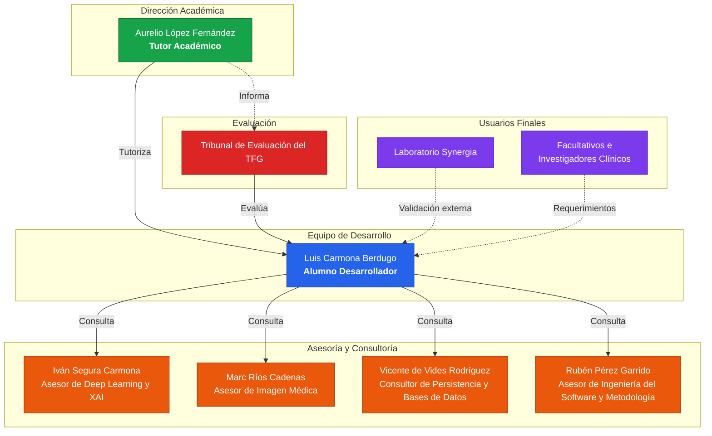

# Capítulo 3: Estructura organizativa y partes interesadas del proyecto

Este capítulo describe la estructura organizativa del proyecto y las personas e instituciones que participan en él. La organización de un proyecto de las características de este —un desarrollo unipersonal de carácter multidisciplinar— exige una definición clara de quién forma parte del proyecto, qué papel desempeña cada actor y cómo se relacionan entre sí. El capítulo se estructura en tres apartados. El apartado 3.1 presenta el organigrama del proyecto, que representa gráficamente la estructura organizativa y las relaciones entre los interesados. El apartado 3.2 identifica y caracteriza a cada una de las partes interesadas, describiendo su rol general en el proyecto. Por último, el apartado 3.3 detalla las responsabilidades y funciones de cada interesado a lo largo del ciclo de vida y presenta la matriz RACI, que asigna de forma explícita y sin ambigüedades el nivel de implicación de cada parte interesada en las principales fases y entregables.

## 3.1 Estructura organizativa del proyecto

El organigrama del proyecto, que representa la estructura organizativa de todos los interesados involucrados, se presenta en esta sección. El diagrama está compuesto por nueve nodos: Marc Ríos Cadenas, Iván Segura Carmona, Aurelio López Fernández, Luis Carmona Berdugo, el Consultor de Persistencia y Bases de Datos (Vicente de Vides Rodríguez), Rubén Pérez Garrido, el Tribunal de Evaluación del TFG, el Laboratorio Synergia y los facultativos e investigadores clínicos. Estos dos últimos actúan como entidades externas de validación y no están subordinados de manera jerárquica a ningún integrante del proyecto. Esta independencia estructural blinda el proyecto y garantiza una auditoría completamente objetiva de la plataforma.

*Figura 1 - Organigrama del proyecto*

## 3.2 Partes interesadas del proyecto

Realizar una identificación correcta de los interesados dentro de la planificación de cualquier proyecto es un paso fundamental porque permite saber quiénes son los afectados por el desarrollo, qué personas contribuyen a él y qué expectativas tienen depositadas en el resultado. En este proyecto, conviven distintos perfiles que van desde el alumno que lleva el peso técnico y documental, hasta investigadores del ámbito clínico que representan el usuario final del sistema. A continuación, se describen en detalle cada uno de los interesados junto con su rol general en el proyecto:

- **Luis Carmona Berdugo (Alumno Desarrollador)**: Asume la responsabilidad íntegra del proyecto. Ejecuta y orquesta el desarrollo en su doble dimensión: técnica y documental. Él construye el sistema.
- **Aurelio López Fernández (Tutor Académico)**: Dirige el rumbo de la investigación. Proporciona la brújula científica, metodológica y académica que garantiza la solvencia del Trabajo Fin de Grado.
- **Tribunal de Evaluación del TFG (Cliente / Evaluador)**: Ejerce como máxima autoridad formal. Este órgano audita el proyecto, califica el trabajo y certifica si el sistema cumple los requisitos académicos exigidos. Su veredicto determina la viabilidad del resultado entregado.
- **Vicente de Vides Rodríguez (Consultor de Persistencia y Bases de Datos, Rol Consultivo)**: Aporta su experiencia estructural. Resuelve consultas puntuales sobre el diseño, el modelado y la optimización de la persistencia de datos. (Asignación de especialista pendiente de confirmación).
- **Iván Segura Carmona (Asesor de Deep Learning y XAI)**: Domina el núcleo algorítmico. Su consultoría especializada arroja luz sobre el comportamiento de las redes neuronales, los mecanismos de explicabilidad y la correcta interpretación de los resultados del benchmarking.
- **Marc Ríos Cadenas (Asesor de Imagen Médica)**: Custodia la veracidad clínica del trabajo. Interviene de forma selectiva para asegurar que el contexto médico y radiológico del proyecto refleja la realidad hospitalaria.
- **Rubén Pérez Garrido (Asesor de Ingeniería del Software y Metodología)**: experto en ingeniería del software que ha colaborado en el desarrollo de [krill](https://github.com/rubpergar/krill), una herramienta y modelo de trabajo basado en especificaciones y guiado por pruebas (SDD/TDD) que estructura el proceso de desarrollo del proyecto, y que es consultado de manera puntual sobre la metodología de desarrollo y las prácticas de ingeniería aplicadas a la implementación.
- **Laboratorio Synergia (Usuario Externo / Validador)**: Representa el primer escalón de adopción. Las líneas de investigación de este equipo convergen con los objetivos de vitalXAI, convirtiéndolos en probadores empíricos de la herramienta.
- **Facultativos e investigadores clínicos (Usuarios Finales)**: Constituyen el objetivo último del despliegue. Este colectivo integraría el diagnóstico asistido en su rutina médica e investigadora diaria. Sus necesidades operativas dictan la utilidad real del sistema.

## 3.3 Responsabilidades, funciones y participación de las partes interesadas

Realizar una definición precisa de las responsabilidades y funciones de cada uno de los interesados es esencial para garantizar que el trabajo se ejecute de manera ordenada, sin solapamientos y con una asignación clara de las principales fases y entregables. Dado que este proyecto tiene un carácter multidisciplinar, esta definición es especialmente relevante ya que las aportaciones de cada uno de los interesados se realizan en fases distintas del ciclo de vida y desde ámbitos de conocimiento muy diferentes entre sí.

**Alumno Desarrollador (Luis Carmona Berdugo, LCB)**: Sobre él recae toda la responsabilidad principal e íntegra de la ejecución del proyecto. Desde un punto de vista científico, es la persona encargada de revisar y sintetizar el estado del arte en inteligencia artificial aplicada al diagnóstico por imagen médica, técnicas XAI y arquitecturas de deep learning, realizando una documentación de todos los hallazgos realizados. Desde el punto de vista técnico, es el encargado de diseñar la arquitectura del sistema, implementar todos los módulos de software, incluyendo los pipelines de entrenamiento para arquitecturas CNN y Transformer, los módulos de generación de explicaciones XAI y los scripts de validación externa y análisis estadístico, y también es el encargado de asegurar que los resultados sean válidos y reproducibles bajo las mismas condiciones. Tomando en cuenta el punto de vista metodológico, diseña y ejecuta el proceso de benchmarking, de manera que se garantice que las comparativas de rendimiento sean representativas en condiciones reales de uso. Desde el punto de vista de la documentación, es el encargado de elaborar toda la documentación del sistema con la calidad y profundidad exigidas para un proyecto de estas características. Por último, es el encargado de mantener la planificación del proyecto, gestionar los riesgos que puedan surgir y coordinar la comunicación con el tutor y los asesores tomando como referencia el prisma de la gestión.

**Tutor Académico (Aurelio López Fernández, ALF)**: Es el responsable de garantizar tanto el rigor académico como el científico del proyecto en todas sus fases. Revisa y proporciona una retroalimentación detallada sobre cada uno de los entregables, señalando errores, inconsistencias y áreas de mejora con el nivel de exigencia propio de un Trabajo Fin de Grado. Orienta al alumno en las decisiones estratégicas más relevantes y actúa como puente entre el perfil técnico del desarrollo y el dominio científico del sistema.

**Tribunal de Evaluación del TFG (T. TFG)**: La principal función de este interesado es la de evaluar el trabajo presentado con base en los criterios académicos establecidos por la universidad, que son el rigor científico, la calidad técnica, la coherencia documental y la capacidad de defensa oral del alumno. Aunque no participa de manera directa en el desarrollo, es el interesado con mayor influencia formal sobre el resultado del proyecto, ya que su valoración determinará la calificación final. Sus expectativas implícitas —claridad expositiva, aplicación de estándares de ingeniería y justificación de decisiones técnicas— se deberán tener en cuenta a lo largo de toda la documentación.

**Consultor de Persistencia y Bases de Datos (Vicente de Vides Rodríguez, VVR)**: Su intervención es puntual y solamente de carácter consultivo. Aporta su experiencia estructural: cuando lo necesita el estudiante, proporciona criterios técnicos acerca de la eficacia de las consultas, la consistencia del modelo de persistencia con los requerimientos del sistema y el diseño, el modelado y la optimización del esquema de datos. Siempre será el estudiante desarrollador quien tome la decisión definitiva sobre cómo se diseñará e implementará la base de datos.

**Asesor de Deep Learning y XAI (Iván Segura Carmona, ISC)**: Participa bajo un esquema puramente consultivo. Ejerce como experto de dominio. Resuelve dudas técnicas complejas acerca del funcionamiento interno de las arquitecturas algorítmicas de deep learning. Guía la correcta aplicación práctica de las técnicas de inteligencia artificial explicable. Aporta un criterio experto fundamental para interpretar correctamente los resultados del benchmarking. Analiza estas métricas desde la perspectiva estricta del rendimiento de modelos algorítmicos. La responsabilidad ejecutiva recae de nuevo sobre el alumno. El diseño arquitectónico, la implementación programada y la validación matemática de todas estas variantes algorítmicas pertenecen exclusivamente a las obligaciones del desarrollador.

**Asesor de Imagen Médica (Marc Ríos Cadenas, MRC)**: Interviene de manera selectiva ofreciendo un asesoramiento consultivo indispensable. Actúa como experto clínico de dominio. Garantiza que el contexto médico y radiológico del proyecto quede representado con absoluta fidelidad. Ofrece contexto sobre cómo los profesionales sanitarios examinan las radiografías de tórax durante el diagnóstico hospitalario de neumonías. Define los rasgos innegociables que debe poseer la herramienta para resultar verdaderamente efectiva en la trinchera clínica. El estudiante recibe este conocimiento y asume la responsabilidad de traducirlo. Aplica este contexto médico a decisiones algorítmicas específicas, impactando directamente en el diseño estructural y en la implementación de la plataforma.

**Asesor de Ingeniería del Software y Metodología (Rubén Pérez Garrido, RPG)**: Su participación es puntual y consultiva. Ha colaborado en el desarrollo de [krill](https://github.com/rubpergar/krill), una herramienta y modelo de trabajo basado en especificaciones y guiado por pruebas (SDD/TDD), que estructura el proceso de desarrollo del proyecto en el repositorio. Aporta criterios sobre la aplicación de la metodología, las prácticas de desarrollo guiado por pruebas y la calidad del proceso de ingeniería en las tareas de implementación. La ejecución concreta de dichas tareas y la aplicación de la metodología son responsabilidad del alumno.

**Laboratorio Synergia y Facultativos e investigadores clínicos (LS/FIC)**: Mantienen una posición externa al núcleo de programación. No participan de manera activa en el desarrollo diario del proyecto. Representan, sin embargo, las necesidades reales del usuario final. Sus requerimientos implícitos constituyen el único criterio válido para medir la utilidad empírica del sistema desarrollado. Las líneas de investigación del Laboratorio Synergia convergen de forma natural con los objetivos de esta herramienta. El diseño del ecosistema prioriza constantemente este perfil médico. Garantizamos así que la accesibilidad visual de las interfaces y la interpretabilidad matemática de la inteligencia artificial satisfagan las exigencias de la práctica clínica real.

La Matriz RACI es una herramienta estándar de gestión de proyectos que permite hacer explícito el nivel de implicación de cada uno de los interesados en las principales fases o entregables del proyecto. Su nombre es un acrónimo de los cuatro roles que contempla: Responsible (Responsable), Accountable (Aprobador), Consulted (Consultado) e Informed (Informado). La aplicación de esta matriz es especialmente relevante en proyectos multidisciplinares como el que se está desarrollando, ya que conviven perfiles técnicos, académicos y científicos que tienen diferentes niveles de implicación, y donde una definición imprecisa de los roles podría derivar en solapamientos o en entregables sin un responsable claro.

Cada uno de los cuatro roles tiene un significado preciso dentro del contexto de la gestión de proyectos. El rol R (Responsible) identifica a la persona que realiza físicamente el trabajo, es decir, quien produce el entregable o ejecuta la tarea; en el caso de este proyecto, este rol recaerá siempre sobre el alumno desarrollador. El rol A (Accountable) asigna a la persona que tiene la autoridad final sobre ese entregable y responde por su calidad frente al resto del proyecto; a diferencia del rol anterior, solo puede existir uno por tarea, lo que evita ambigüedades en la toma de decisiones. El rol C (Consulted) corresponde a quienes, sin ejecutar ni decidir, son consultados porque poseen un conocimiento especializado relevante para la tarea; su aportación se produce antes o durante la ejecución y tiene carácter bidireccional; en el caso de este proyecto, serían los asesores y el consultor. Por último, el rol I (Informed) designa a las personas que únicamente son notificadas del avance o resultado de una tarea sin tener intervención en ella.

A continuación, se presenta la Matriz RACI del proyecto, en la que las filas recogen las principales fases y entregables del ciclo de vida del proyecto, y las columnas representan los interesados identificados en el apartado anterior.

| Fase / Entregable | LCB | ALF | T. TFG | Consultor BD | ISC | MRC | RPG | LS/FIC |
|---|---|---|---|---|---|---|---|---|
| Revisión del estado del arte | R | A | I | - | C | C | - | - |
| Diseño de la arquitectura del sistema | R | A | I | C | - | - | - | - |
| Diseño e implementación de la base de datos | R | A | I | C | - | - | - | - |
| Implementación del pipeline de entrenamiento CNN y Transformer | R | A | I | - | C | - | C | - |
| Implementación del módulo XAI (cualitativo y cuantitativo) | R | A | I | - | C | C | C | - |
| Desarrollo de la interfaz web y chatbot conversacional | R | A | I | - | - | - | C | I |
| Seguridad y control de acceso | R | A | I | - | - | - | C | - |
| Pruebas y verificación del sistema | R | A | I | - | C | C | C | - |
| Laboratorio MLOps | R | A | I | - | C | - | C | - |
| Procesamiento asíncrono de tareas | R | A | I | - | - | - | C | - |
| Internacionalización de la plataforma | R | A | I | - | - | - | C | C |
| Panel de administración | R | A | I | - | - | - | C | - |
| Gestión de riesgos | R | A | I | - | - | - | C | - |
| Benchmarking y análisis de resultados | R | A | I | - | C | C | - | - |
| Validación del contexto clínico | R | A | I | - | - | C | - | - |
| Validación externa y tests estadísticos | R | A | I | - | C | - | - | - |
| Documentación del TFG | R | A | I | - | - | - | I | - |
| Defensa y evaluación final | R | C | A | - | - | - | - | - |

*Tabla 1 - Matriz RACI del proyecto*
