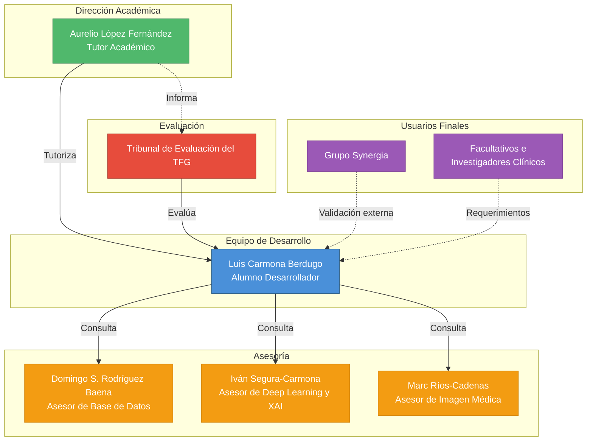

# Capítulo 3: Organización del proyecto

## 3.1 Diagrama de organización del proyecto

El organigrama del proyecto, que representa la estructura organizativa de todos los interesados involucrados, se presenta en esta sección. El diagrama se conformará de siete nodos que son Marc Ríos-Cadenas, Iván Segura-Carmona, Aurelio López Fernández, Luis Carmona Berdugo, Domingo S. Rodríguez Baena, el Tribunal de Evaluación del TFG y los usuarios finales. Estos últimos están simbolizados como el Grupo Synergia y los facultativos e investigadores clínicos. Estos últimos actúan como entidades externas de validación, sin estar subordinados de manera jerárquica a ningún integrante del proyecto.

*Ilustración 1 - Diagrama de organización del proyecto*

## 3.2 Identificación de los interesados

Realizar una identificación correcta de los interesados dentro de la planificación de cualquier proyecto es un paso fundamental porque permite saber quiénes son los afectados por el desarrollo, qué personas contribuyen a él y qué expectativas tienen depositadas en el resultado. En este proyecto, conviven distintos perfiles que van desde el alumno que lleva el peso técnico y documental, hasta investigadores del ámbito clínico que representan el usuario final del sistema. A continuación, se describen en detalle cada uno de los interesados junto con su rol general en el proyecto:

- **Luis Carmona Berdugo (Alumno Desarrollador)**: Es el responsable único de la ejecución del proyecto de manera íntegra en sus dos vertientes, tanto técnica como documental.
- **Aurelio López Fernández (Tutor Académico)**: se encarga de dar orientación científica, metodológica y académica del TFG.
- **Tribunal de Evaluación del TFG (Cliente / Evaluador)**: es el órgano encargado de realizar la evaluación y calificación del proyecto que se presente. Constituye el interesado de mayor peso formal del proyecto, ya que es quien determina el cumplimiento de los requisitos académicos exigidos y la calidad del resultado entregado.
- **Domingo S. Rodríguez Baena (Asesor de Base de Datos)**: experto en términos de base de datos que será consultado de manera puntual en cuestiones relativas al diseño y modelado.
- **Iván Segura-Carmona (Asesor de Deep Learning y XAI)**: experto de dominio que ha sido consultado de manera puntual sobre el comportamiento de los algoritmos de deep learning, las técnicas de inteligencia artificial explicable y la interpretación de los resultados de benchmarking.
- **Marc Ríos-Cadenas (Asesor de Imagen Médica)**: experto de dominio al que se le ha consultado de manera puntual para garantizar que el contexto clínico y radiológico del proyecto está correctamente representado.
- **Grupo Synergia (Usuario Externo / Validador)**: grupo de investigación cuyas líneas de trabajo se enmarcan en el ámbito de este proyecto y que representa uno de los perfiles de usuario final del sistema.
- **Facultativos e investigadores clínicos (Usuarios Finales)**: es el colectivo que se beneficiaría del sistema desarrollado para el diagnóstico asistido de neumonía en su práctica clínica e investigadora, y cuyas necesidades constituyen el criterio de utilidad real del sistema.

## 3.3 Responsabilidades y funciones de los interesados

Realizar una definición precisa de las responsabilidades y funciones de cada uno de los interesados es esencial para poder garantizar que el trabajo se ejecute de una manera ordenada, sin que haya solapamiento de tareas y que ninguna tarea esté sin asignar, además de que cada persona deberá conocer el alcance exacto de su contribución. Dado que este proyecto tiene un carácter multidisciplinar, esta definición es especialmente relevante ya que las aportaciones de cada uno de los interesados se realizan en fases distintas del ciclo de vida y desde ámbitos de conocimiento muy diferentes entre sí.

**Alumno Desarrollador (Luis Carmona Berdugo, LCB)**: sobre él recae toda la responsabilidad principal e íntegra de la ejecución del proyecto. Desde un punto de vista científico, es la persona encargada de revisar y sintetizar el estado del arte en inteligencia artificial aplicada al diagnóstico por imagen médica, técnicas XAI y arquitecturas de deep learning, realizando una documentación de todos los hallazgos realizados. Desde el punto de vista técnico, es el encargado de diseñar la arquitectura del sistema, implementar todos los módulos de software, incluyendo los pipelines de entrenamiento para arquitecturas CNN y Transformer, los módulos de generación de explicaciones XAI y los scripts de validación externa y análisis estadístico, y también es el encargado de asegurar que los resultados sean válidos y reproducibles bajo las mismas condiciones. Tomando en cuenta el punto de vista metodológico, diseña y ejecuta el proceso de benchmarking, de manera que se garantice que las comparativas de rendimiento sean representativas en condiciones reales de uso. Desde el punto de vista de la documentación, es el encargado de elaborar toda la documentación del sistema con la calidad y profundidad exigidas para un proyecto de estas características. Por último, es el encargado de mantener la planificación del proyecto, gestionar los riesgos que puedan surgir y coordinar la comunicación con el tutor y los asesores tomando como referencia el prisma de la gestión.

**Tutor Académico (Aurelio López Fernández, ALF)**: es el responsable de garantizar tanto el rigor académico como el científico del proyecto en todas sus fases. Revisa y proporciona una retroalimentación detallada sobre cada uno de los entregables, señalando errores, inconsistencias y áreas de mejora con el nivel de exigencia propio de un Trabajo Fin de Grado. Orienta al alumno en las decisiones estratégicas más relevantes y actúa como puente entre el perfil técnico del desarrollo y el dominio científico del sistema.

**Tribunal de Evaluación del TFG (T. TFG)**: La principal función de este interesado es la de evaluar el trabajo presentado con base en los criterios académicos establecidos por la universidad, que son el rigor científico, la calidad técnica, la coherencia documental y la capacidad de defensa oral del alumno. Aunque no participa de manera directa en el desarrollo, es el interesado con mayor influencia formal sobre el resultado del proyecto, ya que su valoración determinará la calificación final. Sus expectativas implícitas —claridad expositiva, aplicación de estándares de ingeniería y justificación de decisiones técnicas— se deberán tener en cuenta a lo largo de toda la documentación.

**Asesor de Base de Datos (Domingo S. Rodríguez Baena, DSRB)**: su intervención es puntual y solamente de carácter consultivo. Cuando lo necesita el estudiante, proporciona criterios técnicos acerca de la eficacia de las consultas, la consistencia del modelo de persistencia con los requerimientos del sistema y el diseño y modelado del esquema de datos. Siempre será el estudiante desarrollador quien tome la decisión definitiva sobre cómo se diseñará e implementará la base de datos.

**Asesor de Deep Learning y XAI (Iván Segura-Carmona, ISC)**: su participación es igualmente puntual y consultiva. Resuelve dudas técnicas sobre el funcionamiento interno de las arquitecturas de deep learning, la correcta aplicación de las técnicas de inteligencia artificial explicable y aporta criterios para que se realice una interpretación correcta de los resultados del benchmarking desde la perspectiva del análisis de rendimiento de modelos. El diseño, la implementación y la validación de todas estas variantes algorítmicas son responsabilidad exclusiva del alumno.

**Asesor de Imagen Médica (Marc Ríos-Cadenas, MRC)**: su participación es puntual y consultiva. Ofrece contexto acerca de cómo los profesionales sanitarios emplean realmente las radiografías de tórax en el diagnóstico de neumonía y qué rasgos debe tener la herramienta para ser efectiva en el ámbito clínico. El estudiante tiene la responsabilidad de aplicar ese contexto a decisiones específicas en términos tanto de diseño como de implementación.

**Grupo Synergia y Facultativos e investigadores clínicos (GS/FIC)**: No participan de manera activa en el desarrollo del proyecto, pero representan las necesidades reales del usuario final. Sus requerimientos implícitos constituyen el criterio de utilidad del sistema desarrollado, y su perfil ha sido tenido en cuenta a lo largo del diseño para garantizar tanto la accesibilidad como la interpretabilidad de la herramienta.

La Matriz RACI es una herramienta estándar de gestión de proyectos que permite asegurar de manera explícita y sin ambigüedades el nivel de implicación de cada uno de los interesados en cada fase o entregable del proyecto. Su nombre es un acrónimo de los cuatro roles que contempla: Responsible (Responsable), Accountable (Aprobador), Consulted (Consultado) e Informed (Informado). La aplicación de esta matriz es especialmente relevante en proyectos multidisciplinares como el que se está desarrollando, ya que conviven perfiles técnicos, académicos y científicos que tienen diferentes niveles de implicación, y donde una definición imprecisa de los roles podría derivar en solapamientos o en tareas sin un responsable claro.

Cada uno de los cuatro roles tiene un significado preciso dentro del contexto de la gestión de proyectos. El rol R (Responsible) identifica a la persona que realiza físicamente el trabajo, es decir, quien produce el entregable o ejecuta la tarea; en el caso de este proyecto, este rol recaerá siempre sobre el alumno desarrollador. El rol A (Accountable) asigna a la persona que tiene la autoridad final sobre ese entregable y responde por su calidad frente al resto del proyecto; a diferencia del rol anterior, solo puede existir uno por tarea, lo que evita ambigüedades en la toma de decisiones. El rol C (Consulted) corresponde a quienes, sin ejecutar ni decidir, son consultados porque poseen un conocimiento especializado relevante para la tarea; su aportación se produce antes o durante la ejecución y tiene carácter bidireccional; en el caso de este proyecto, serían los tres asesores. Por último, el rol I (Informed) designa a las personas que únicamente son notificadas del avance o resultado de una tarea sin tener intervención en ella.

A continuación, se presenta la Matriz RACI del proyecto, en la que las filas recogen las principales fases y entregables del ciclo de vida del proyecto, y las columnas representan los interesados identificados en el apartado anterior.

| Fase / Entregable | LCB | ALF | T. TFG | DSRB | ISC | MRC | GS/FIC |
|---|---|---|---|---|---|---|---|
| Revisión del estado del arte | R | A | I | - | C | C | - |
| Diseño de la arquitectura del sistema | R | A | I | C | - | - | - |
| Diseño e implementación de la base de datos | R | A | I | C | - | - | - |
| Implementación del pipeline de entrenamiento CNN y Transformer | R | A | I | - | C | - | - |
| Implementación del módulo XAI (cualitativo y cuantitativo) | R | A | I | - | C | C | - |
| Desarrollo de la interfaz web y chatbot conversacional | R | A | I | - | - | - | I |
| Benchmarking y análisis de resultados | R | A | I | - | C | - | - |
| Validación del contexto clínico | R | A | I | - | - | C | - |
| Validación externa y tests estadísticos | R | A | I | - | C | - | - |
| Documentación del TFG | R | A | I | - | - | - | - |
| Defensa y evaluación final | R | C | A | - | - | - | - |

*Tabla 1 - Matriz RACI del proyecto*
