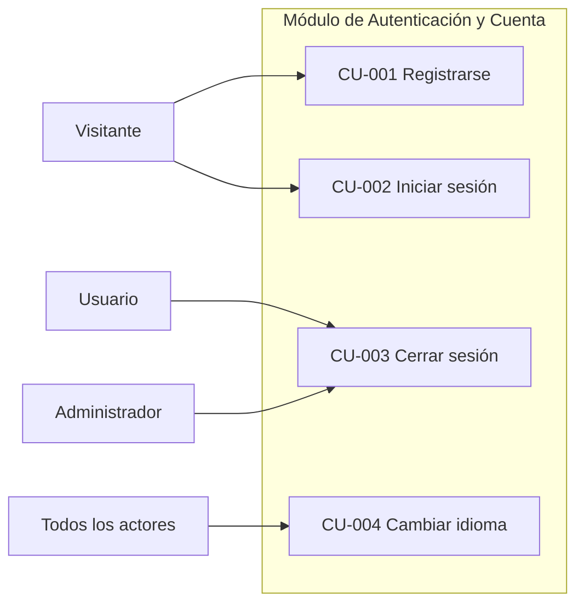
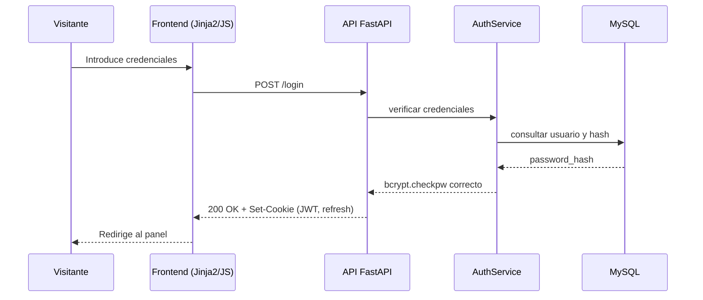
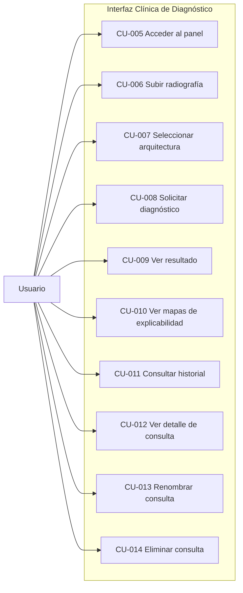
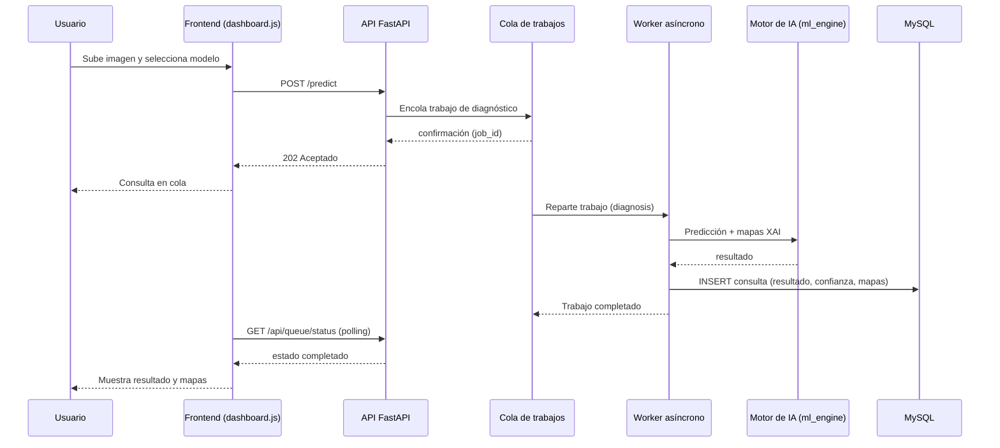
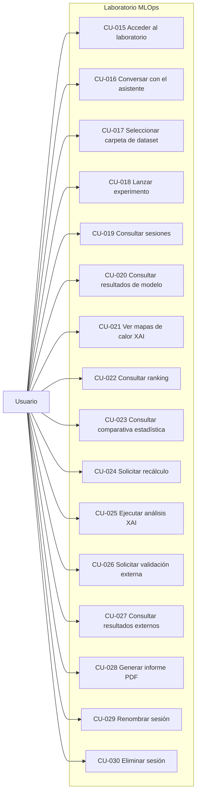
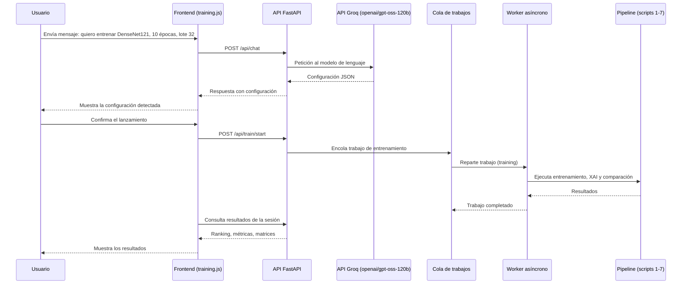
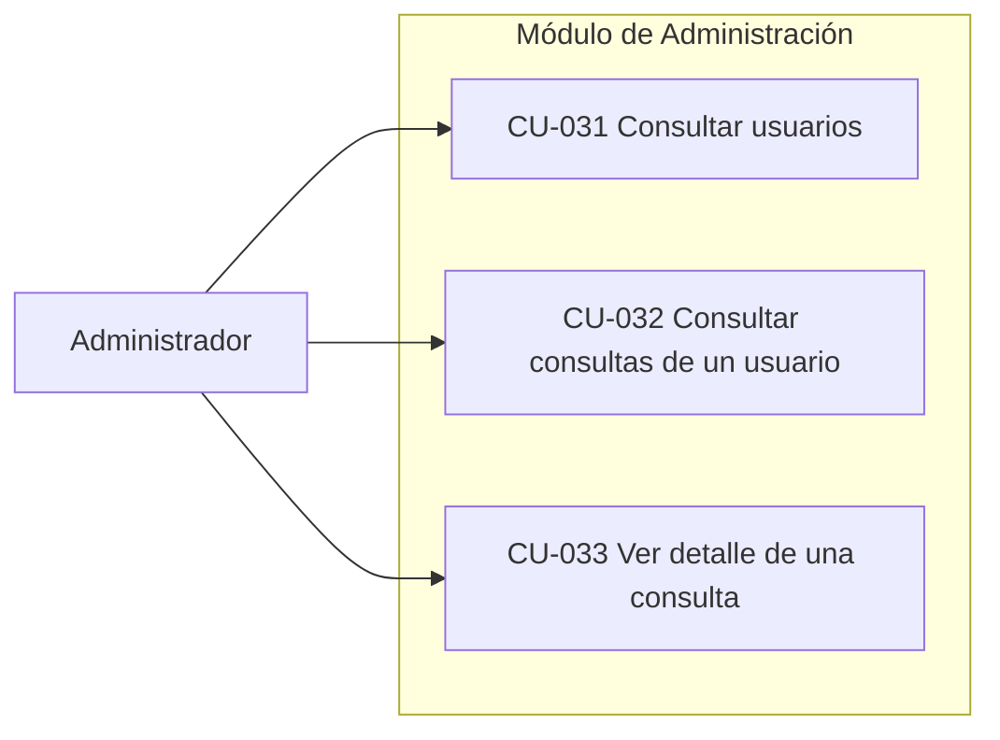
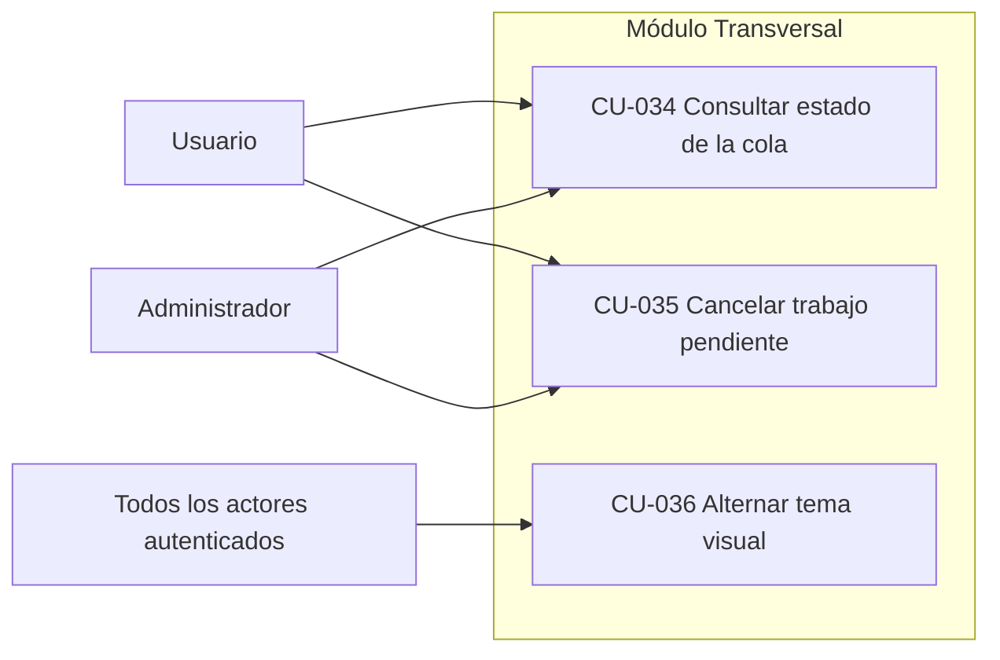

# Capítulo 12: Casos de uso del sistema

Un caso de uso describe una interacción concreta entre un actor y el sistema, con el objetivo de lograr un resultado de valor para ese actor (Jacobson, Booch, & Rumbaugh, 1999; Larman, 2004). Para entenderlo con un ejemplo: "el profesional sanitario sube una radiografía y obtiene un diagnóstico" es un caso de uso; "la base de datos guarda el registro" no lo es, porque se trata de un detalle interno que el usuario no inicia ni percibe. Los casos de uso constituyen el puente entre lo que el análisis afirma que el sistema debe hacer y la forma concreta en que el usuario lo realiza, y por ello se convierten en la base sobre la que se diseñan los subsistemas, se definen las pruebas y se valida que el sistema entregue lo prometido.

Este capítulo recoge todos los casos de uso de vitalXAI, organizados por módulos funcionales que se corresponden con los subsistemas identificados en el análisis: autenticación y cuenta, interfaz clínica de diagnóstico, laboratorio MLOps, administración y capacidades transversales. Para cada módulo se presenta el diagrama de casos de uso, la descripción detallada de cada caso con sus flujos normal y alternativo, y, para los flujos más representativos, el diagrama de interacción entre los componentes del sistema.

## 12.1 Actores y organización de los casos de uso

Un actor es todo aquello que interactúa con el sistema desde fuera de él: una persona o un sistema externo. En vitalXAI se han identificado cuatro actores. La Tabla 18 resume sus características.

| Actor | Descripción | Alcance de acceso |
|---|---|---|
| Visitante | Persona que accede a la plataforma sin haberse autenticado. | Funcionalidades públicas: registro, inicio de sesión y cambio de idioma. |
| Usuario | Persona autenticada (perfil clínico o investigador) que utiliza la interfaz de diagnóstico y el laboratorio MLOps. | Diagnóstico, historial, laboratorio y gestión de sus propias sesiones y consultas. |
| Administrador | Usuario con rol de administración responsable del gobierno de la plataforma. | Gestión de usuarios y supervisión de la actividad. |
| Sistema | Conjunto de servicios internos que actúan como actor secundario: cola de trabajos, motor de inteligencia artificial, asistente conversacional. | Ejecución de los procesos asíncronos y de los motores de cálculo. |

Los casos de uso se identifican de forma inequívoca mediante el código CU-XXX. Se organizan en cinco módulos: el módulo de autenticación y cuenta (CU-001 a CU-004), el módulo de la interfaz clínica de diagnóstico (CU-005 a CU-014), el módulo del laboratorio MLOps (CU-015 a CU-030), el módulo de administración (CU-031 a CU-033) y el módulo transversal (CU-034 a CU-036). Los diagramas de casos de uso que se presentan en este capítulo representan gráficamente los actores y los casos de uso de cada módulo, y se complementan con diagramas de interacción para los flujos más significativos.

## 12.2 Módulo de autenticación y cuenta

Este módulo agrupa los casos de uso relacionados con el control de acceso al sistema. Su propósito es garantizar que únicamente los usuarios registrados y autenticados puedan acceder a las funcionalidades privadas de la plataforma, y que cada usuario pueda operar únicamente con sus propios datos. La autenticación es un requisito transversal: ninguna de las funcionalidades de diagnóstico, laboratorio o administración puede utilizarse sin completar previamente este proceso.

*Figura 1 - Casos de uso del módulo de autenticación y cuenta*

**CU-001 — Registrarse.**

| Campo | Contenido |
|---|---|
| Actores | Visitante |
| Descripción | El visitante crea una cuenta en la plataforma proporcionando nombre de usuario, nombre, apellidos, correo electrónico y contraseña. El sistema valida los datos, cifra la contraseña y crea el registro, de modo que la contraseña nunca se almacena en texto plano. |
| Precondiciones | El visitante no está autenticado. El nombre de usuario y el correo no están ya registrados. |
| Flujo normal | 1. El visitante accede al formulario de registro. 2. Introduce sus datos. 3. El sistema valida el formato de los datos y la fortaleza de la contraseña. 4. El sistema comprueba que el nombre de usuario y el correo no existen previamente. 5. El sistema cifra la contraseña con bcrypt y crea el registro del usuario. 6. El sistema redirige al visitante a la página de inicio de sesión. |
| Flujo alternativo | 3a. Si algún dato es inválido o la contraseña no cumple los requisitos, el sistema muestra un mensaje de error y no crea el registro. 4a. Si el nombre de usuario o el correo ya existen, el sistema muestra un mensaje de error y no crea el registro. |
| Postcondiciones | El usuario queda registrado y puede iniciar sesión. |

**CU-002 — Iniciar sesión.**

| Campo | Contenido |
|---|---|
| Actores | Visitante |
| Descripción | El visitante introduce sus credenciales y el sistema, tras verificarlas, inicia una sesión segura y le otorga acceso a las áreas privadas de la plataforma. |
| Precondiciones | El visitante dispone de una cuenta registrada. |
| Flujo normal | 1. El visitante accede al formulario de inicio de sesión. 2. Introduce su nombre de usuario y contraseña. 3. El sistema verifica la contraseña contra el hash almacenado. 4. El sistema genera el token de acceso y el token de refresco, y los establece en cookies seguras. 5. El sistema redirige al usuario a su panel. |
| Flujo alternativo | 3a. Si las credenciales son incorrectas, el sistema muestra un error. 3b. Si se supera el límite de intentos permitidos, el sistema bloquea temporalmente las peticiones desde esa dirección. |
| Postcondiciones | La sesión queda iniciada y el usuario accede a las áreas privadas. |

**CU-003 — Cerrar sesión.**

| Campo | Contenido |
|---|---|
| Actores | Usuario, Administrador |
| Descripción | El usuario autenticado cierra su sesión de forma segura, revocando el token de refresco y eliminando las cookies de sesión, de modo que los intentos posteriores de acceder a áreas privadas sean rechazados. |
| Precondiciones | El usuario tiene una sesión iniciada. |
| Flujo normal | 1. El usuario pulsa la opción de cerrar sesión. 2. El sistema revoca el token de refresco asociado a la sesión. 3. El sistema limpia las cookies de sesión. 4. El sistema redirige al usuario a la página de inicio de sesión. |
| Postcondiciones | La sesión queda revocada y el acceso a áreas privadas queda bloqueado hasta un nuevo inicio de sesión. |

**CU-004 — Cambiar el idioma de la interfaz.**

| Campo | Contenido |
|---|---|
| Actores | Visitante, Usuario, Administrador |
| Descripción | El actor selecciona el idioma de la interfaz entre los disponibles (español, inglés, chino e hindú). El sistema guarda la preferencia y aplica las traducciones en la interfaz, en los informes generados y en el asistente conversacional. |
| Flujo normal | 1. El actor selecciona el idioma deseado en el selector de idioma. 2. El sistema guarda la preferencia. 3. El sistema aplica las traducciones correspondientes en toda la interfaz. |
| Postcondiciones | La interfaz se muestra en el idioma seleccionado. |

La interacción del caso de uso CU-002, por ser el punto de entrada a todo el sistema, se representa en la Figura 2.

*Figura 2 - Interacción del caso de uso CU-002 Iniciar sesión*

## 12.3 Interfaz clínica de diagnóstico

Este módulo agrupa los casos de uso de la interfaz clínica, el primer núcleo funcional del sistema. A través de ella, el usuario autenticado puede realizar un diagnóstico asistido de neumonía a partir de una radiografía de tórax, visualizar la explicación de la predicción y gestionar su historial de consultas. El diagnóstico se procesa de forma asíncrona mediante la cola de trabajos, de modo que la interfaz permanece operativa mientras el sistema analiza la imagen.

*Figura 3 - Casos de uso de la interfaz clínica de diagnóstico*

**CU-005 — Acceder al panel de diagnóstico.**

| Campo | Contenido |
|---|---|
| Actores | Usuario |
| Descripción | El usuario autenticado accede al panel de diagnóstico, desde el que puede realizar nuevas consultas y consultar su historial. |
| Precondiciones | El usuario tiene una sesión iniciada. |
| Flujo normal | 1. El usuario accede al panel de diagnóstico. 2. El sistema valida la sesión y carga el panel. |
| Postcondiciones | El panel de diagnóstico queda visible. |

**CU-006 — Subir una radiografía de tórax.**

| Campo | Contenido |
|---|---|
| Actores | Usuario |
| Descripción | El usuario selecciona una imagen de su equipo para ser analizada. El sistema valida el tipo de archivo (JPEG o PNG) y su tamaño (máximo 10 MB) y la almacena de forma temporal en el servidor. |
| Precondiciones | El usuario está en el panel de diagnóstico. |
| Flujo normal | 1. El usuario selecciona el archivo de imagen. 2. El sistema valida el formato y el tamaño. 3. El sistema almacena la imagen y la asocia a la consulta en curso. |
| Flujo alternativo | 2a. Si el formato o el tamaño no son válidos, el sistema muestra un error y rechaza la imagen. |
| Postcondiciones | La imagen queda disponible para el diagnóstico. |

**CU-007 — Seleccionar la arquitectura para el diagnóstico.**

| Campo | Contenido |
|---|---|
| Actores | Usuario |
| Descripción | El usuario elige, entre las arquitecturas de deep learning disponibles en la interfaz, el modelo con el que desea realizar el diagnóstico. |
| Precondiciones | El usuario está en el panel de diagnóstico. |
| Flujo normal | 1. El usuario despliega el selector de modelos. 2. Selecciona la arquitectura deseada. |
| Postcondiciones | El modelo queda seleccionado para la consulta. |

**CU-008 — Solicitar un diagnóstico.**

| Campo | Contenido |
|---|---|
| Actores | Usuario |
| Descripción | El usuario envía la petición de diagnóstico con la imagen y el modelo seleccionados. El sistema encola el trabajo de diagnóstico —que comprende la predicción, la generación de los mapas de explicabilidad y el registro de la consulta— y lo procesa en segundo plano, sin bloquear la interfaz. |
| Precondiciones | Hay una imagen subida y un modelo seleccionado. |
| Flujo normal | 1. El usuario envía la petición de diagnóstico. 2. El sistema valida la imagen y el modelo. 3. El sistema encola el trabajo de diagnóstico con prioridad alta. 4. El worker procesa el trabajo: carga el modelo, realiza la predicción, genera los mapas de explicabilidad y guarda la consulta. 5. El sistema notifica al usuario la finalización. |
| Flujo alternativo | 2a. Si la petición no es válida, el sistema muestra un error. 4a. Si el procesamiento falla, el trabajo pasa a estado fallido y se registra el error. |
| Postcondiciones | La consulta queda registrada en el historial con su resultado, su confianza y sus mapas de explicabilidad. |

**CU-009 — Visualizar el resultado del diagnóstico.**

| Campo | Contenido |
|---|---|
| Actores | Usuario |
| Descripción | Cuando el trabajo de diagnóstico finaliza, el sistema muestra el resultado de la consulta: la predicción (PNEUMONIA o NORMAL) junto con el nivel de confianza asociado y el modelo utilizado. |
| Precondiciones | La consulta ha sido procesada por el worker. |
| Flujo normal | 1. El usuario espera a que la consulta pase a estado completado. 2. El sistema muestra el resultado con su confianza y el modelo. |
| Postcondiciones | El resultado queda visible para el usuario. |

**CU-010 — Visualizar los mapas de explicabilidad.**

| Campo | Contenido |
|---|---|
| Actores | Usuario |
| Descripción | El usuario visualiza los mapas de calor generados por el sistema (Saliency Maps, SmoothGrad y Grad-CAM para arquitecturas convolucionales, o mapas de atención para arquitecturas Transformer) superpuestos sobre la radiografía original, lo que le permite comprobar qué regiones de la imagen sustentan la predicción. |
| Precondiciones | La consulta ha sido procesada y los mapas han sido generados. |
| Flujo normal | 1. El usuario selecciona la consulta completada. 2. El sistema muestra el mosaico con la radiografía original y los mapas de explicabilidad. |
| Postcondiciones | Los mapas quedan visibles para su inspección. |

**CU-011 — Consultar el historial de consultas.**

| Campo | Contenido |
|---|---|
| Actores | Usuario |
| Descripción | El usuario consulta el listado de sus consultas de diagnóstico, en el que se muestran la fecha, el modelo empleado, el resultado y la confianza de cada una. |
| Precondiciones | El usuario tiene una sesión iniciada. |
| Flujo normal | 1. El usuario accede a su historial. 2. El sistema recupera y muestra únicamente sus consultas. |
| Postcondiciones | El listado del historial queda visible. |

**CU-012 — Ver el detalle de una consulta del historial.**

| Campo | Contenido |
|---|---|
| Actores | Usuario |
| Descripción | El usuario abre el detalle de una consulta de su historial, que incluye la radiografía original, el resultado, la confianza, los mapas de explicabilidad y los metadatos asociados. |
| Precondiciones | La consulta pertenece al usuario. |
| Flujo normal | 1. El usuario selecciona una consulta del historial. 2. El sistema comprueba la propiedad de la consulta. 3. El sistema muestra el detalle. |
| Flujo alternativo | 2a. Si la consulta no pertenece al usuario, el sistema deniega el acceso. |
| Postcondiciones | El detalle de la consulta queda visible. |

**CU-013 — Renombrar una consulta del historial.**

| Campo | Contenido |
|---|---|
| Actores | Usuario |
| Descripción | El usuario modifica la etiqueta o nombre de una de sus consultas para identificarla mejor. |
| Precondiciones | La consulta pertenece al usuario. |
| Flujo normal | 1. El usuario indica el nuevo nombre de la consulta. 2. El sistema comprueba la propiedad. 3. El sistema actualiza el nombre. |
| Flujo alternativo | 2a. Si la consulta no pertenece al usuario, el sistema deniega el acceso. |
| Postcondiciones | La consulta queda renombrada. |

**CU-014 — Eliminar una consulta del historial.**

| Campo | Contenido |
|---|---|
| Actores | Usuario |
| Descripción | El usuario elimina una consulta de su historial. |
| Precondiciones | La consulta pertenece al usuario. |
| Flujo normal | 1. El usuario solicita la eliminación de la consulta. 2. El sistema comprueba la propiedad. 3. El sistema elimina el registro. |
| Flujo alternativo | 2a. Si la consulta no pertenece al usuario, el sistema deniega el acceso. |
| Postcondiciones | La consulta desaparece del historial del usuario. |

La interacción del caso de uso CU-008, núcleo del flujo de diagnóstico, se representa en la Figura 4.

*Figura 4 - Interacción del caso de uso CU-008 Solicitar un diagnóstico*

## 12.4 Laboratorio MLOps

Este módulo agrupa los casos de uso del laboratorio de entrenamiento, el segundo núcleo funcional del sistema. A través de él, el usuario puede configurar y lanzar experimentos de entrenamiento mediante un asistente conversacional, monitorizar la ejecución del pipeline y consultar los resultados comparativos y estadísticos. El laboratorio orquesta automáticamente la secuencia de entrenamiento, análisis de explicabilidad, comparación estadística y validación externa, de modo que el usuario no necesita escribir código en ningún momento.

*Figura 5 - Casos de uso del laboratorio MLOps*

**CU-015 — Acceder al laboratorio de entrenamiento.**

| Campo | Contenido |
|---|---|
| Actores | Usuario |
| Descripción | El usuario autenticado accede al laboratorio de entrenamiento, desde el que puede conversar con el asistente, lanzar experimentos y consultar sus sesiones. |
| Precondiciones | El usuario tiene una sesión iniciada. |
| Flujo normal | 1. El usuario accede al laboratorio. 2. El sistema valida la sesión y carga el entorno del laboratorio. |
| Postcondiciones | El laboratorio queda visible. |

**CU-016 — Conversar con el asistente para configurar un experimento.**

| Campo | Contenido |
|---|---|
| Actores | Usuario |
| Descripción | El usuario conversa en lenguaje natural con el asistente conversacional para definir los parámetros del experimento: ruta del dataset, arquitecturas a entrenar, número de épocas, tamaño de lote y tasa de aprendizaje. El asistente, basado en el modelo `openai/gpt-oss-120b` ejecutado a través de la API de Groq, interpreta las indicaciones y, cuando dispone de todos los parámetros, devuelve la configuración estructurada. |
| Precondiciones | El usuario está en el laboratorio. |
| Flujo normal | 1. El usuario envía un mensaje al asistente. 2. El sistema envía la petición al modelo de lenguaje con el prompt de sistema definido. 3. El modelo extrae los parámetros mencionados. 4. Si todos los parámetros están definidos, el asistente devuelve la configuración JSON. 5. El sistema rellena el panel de configuración con los valores obtenidos. |
| Flujo alternativo | 4a. Si faltan parámetros, el asistente pregunta por ellos y la conversación continúa hasta completarlos. 2a. Si el servicio del modelo no está disponible, el sistema informa del error. |
| Postcondiciones | La configuración del experimento queda disponible para su lanzamiento. |

**CU-017 — Seleccionar la carpeta del dataset.**

| Campo | Contenido |
|---|---|
| Actores | Usuario |
| Descripción | El usuario selecciona la carpeta del dataset que se empleará en el entrenamiento. La selección puede realizarse mediante el diálogo de exploración del servidor o mediante la ruta preconfigurada en el entorno. El mismo caso de uso cubre la selección del dataset externo para la validación. |
| Flujo normal | 1. El usuario solicita explorar la carpeta del dataset. 2. El sistema devuelve la ruta (preconfigurada o seleccionada). 3. El usuario confirma la ruta. |
| Postcondiciones | La ruta del dataset queda disponible para el experimento. |

**CU-018 — Lanzar un experimento de entrenamiento.**

| Campo | Contenido |
|---|---|
| Actores | Usuario |
| Descripción | El usuario lanza el experimento con la configuración definida. El sistema crea una sesión de entrenamiento y encola el trabajo. El pipeline ejecuta el entrenamiento de cada arquitectura (convalidación cruzada), el análisis de explicabilidad cualitativo y cuantitativo y, al finalizar todos los modelos, la comparación estadística con ranking y test de Wilcoxon. |
| Precondiciones | La configuración del experimento está completa. |
| Flujo normal | 1. El usuario envía la configuración. 2. El sistema crea la sesión y encola el entrenamiento. 3. El worker ejecuta el pipeline: entrenamiento, explicabilidad y comparación. 4. El sistema actualiza el estado de la sesión al finalizar. |
| Flujo alternativo | 3a. Si algún script falla, la sesión queda registrada con el error correspondiente. |
| Postcondiciones | La sesión de entrenamiento queda creada con sus resultados. |

**CU-019 — Consultar las sesiones de entrenamiento.**

| Campo | Contenido |
|---|---|
| Actores | Usuario |
| Descripción | El usuario consulta el listado de sus sesiones de entrenamiento con su estado y sus modelos. |
| Precondiciones | El usuario tiene una sesión iniciada. |
| Flujo normal | 1. El usuario accede al listado de sesiones. 2. El sistema recupera únicamente las sesiones del usuario. |
| Postcondiciones | El listado de sesiones queda visible. |

**CU-020 — Consultar los resultados de un modelo de la sesión.**

| Campo | Contenido |
|---|---|
| Actores | Usuario |
| Descripción | El usuario consulta los resultados cuantitativos de un modelo concreto de la sesión: las métricas de la validación cruzada, las métricas XAI cuantitativas (Deletion, Insertion, Sparsity, Entropy y Stability) y las métricas de calibración (Brier Score y ECE). |
| Precondiciones | La sesión dispone de resultados para el modelo. |
| Flujo normal | 1. El usuario selecciona un modelo de la sesión. 2. El sistema recupera y muestra las métricas del modelo. |
| Postcondiciones | Los resultados del modelo quedan visibles. |

**CU-021 — Visualizar los mapas de calor de explicabilidad de un modelo.**

| Campo | Contenido |
|---|---|
| Actores | Usuario |
| Descripción | El usuario visualiza la galería de mapas de calor de explicabilidad del modelo, generados por el análisis XAI cualitativo sobre imágenes de ejemplo. Estos mapas permiten inspeccionar visualmente si el modelo se fija en las regiones pulmonares relevantes. |
| Precondiciones | El modelo dispone de mapas de explicabilidad generados. |
| Flujo normal | 1. El usuario selecciona el modelo. 2. El sistema muestra la galería de imágenes XAI del modelo. |
| Postcondiciones | Los mapas de calor quedan visibles. |

**CU-022 — Consultar el ranking de modelos de la sesión.**

| Campo | Contenido |
|---|---|
| Actores | Usuario |
| Descripción | El usuario consulta el ranking global de los modelos de la sesión, ordenado por su AUC medio de la validación cruzada, junto con la matriz de calor de significación del test de Wilcoxon. |
| Precondiciones | La comparación estadística de la sesión se ha generado. |
| Flujo normal | 1. El usuario solicita el ranking de la sesión. 2. El sistema recupera el ranking y la matriz de significación. |
| Postcondiciones | El ranking y la matriz quedan visibles. |

**CU-023 — Consultar la comparativa estadística de la sesión.**

| Campo | Contenido |
|---|---|
| Actores | Usuario |
| Descripción | El usuario consulta la matriz de significación estadística que compara los modelos de la sesión, tanto la matriz de p-valores del test de Wilcoxon como, si la validación externa se ha ejecutado, la matriz del test de DeLong sobre las curvas ROC. |
| Precondiciones | La comparación estadística de la sesión se ha generado. |
| Flujo normal | 1. El usuario accede a la vista de comparativa de la sesión. 2. El sistema muestra la matriz de significación correspondiente. |
| Postcondiciones | La comparativa queda visible. |

**CU-024 — Solicitar el recálculo de la comparativa estadística.**

| Campo | Contenido |
|---|---|
| Actores | Usuario |
| Descripción | El usuario solicita el recálculo de la comparativa estadística de la sesión (ranking y test de Wilcoxon). El sistema ejecuta el recálculo en segundo plano y notifica al usuario cuando finaliza. |
| Precondiciones | La sesión dispone de resultados de sus modelos. |
| Flujo normal | 1. El usuario solicita el recálculo. 2. El sistema lanza el proceso en segundo plano. 3. El sistema actualiza el estado cuando el recálculo finaliza. |
| Postcondiciones | La comparativa estadística de la sesión queda actualizada. |

**CU-025 — Ejecutar el análisis de explicabilidad de un modelo.**

| Campo | Contenido |
|---|---|
| Actores | Usuario |
| Descripción | El usuario solicita la ejecución manual del análisis de explicabilidad (cualitativo y cuantitativo) de un modelo de la sesión, regenerando los mapas y las métricas XAI del modelo. |
| Precondiciones | El modelo pertenece a una sesión del usuario. |
| Flujo normal | 1. El usuario solicita generar el análisis XAI del modelo. 2. El sistema ejecuta los scripts de explicabilidad en segundo plano. 3. El sistema notifica al usuario al finalizar. |
| Postcondiciones | Los mapas y métricas XAI del modelo quedan regenerados. |

**CU-026 — Solicitar la validación externa de la sesión.**

| Campo | Contenido |
|---|---|
| Actores | Usuario |
| Descripción | El usuario solicita la validación externa de la sesión sobre el dataset externo de pacientes adultos. El sistema encola el trabajo, que evalúa los modelos congelados y aplica el test de DeLong para comparar sus curvas ROC. |
| Precondiciones | La sesión dispone de modelos entrenados y de un dataset externo disponible. |
| Flujo normal | 1. El usuario solicita la validación externa. 2. El sistema encola el trabajo de validación externa. 3. El worker evalúa los modelos y aplica el test de DeLong. 4. El sistema notifica la finalización. |
| Postcondiciones | Los resultados de la validación externa quedan disponibles. |

**CU-027 — Consultar los resultados de la validación externa.**

| Campo | Contenido |
|---|---|
| Actores | Usuario |
| Descripción | El usuario consulta los resultados de la validación externa de la sesión: las métricas sobre la cohorte externa, las curvas ROC de los modelos y la matriz de significación del test de DeLong. |
| Precondiciones | La validación externa de la sesión se ha ejecutado. |
| Flujo normal | 1. El usuario accede a los resultados externos de la sesión. 2. El sistema muestra las métricas, las curvas ROC y la matriz de DeLong. |
| Postcondiciones | Los resultados externos quedan visibles. |

**CU-028 — Generar el informe PDF de la sesión.**

| Campo | Contenido |
|---|---|
| Actores | Usuario |
| Descripción | El usuario genera y descarga el informe PDF consolidado de la sesión, que recoge la configuración del experimento, el ranking, la matriz de Wilcoxon, los resultados de la validación externa con su matriz de DeLong y las métricas de explicabilidad y calibración por modelo. |
| Precondiciones | La sesión pertenece al usuario y dispone de resultados. |
| Flujo normal | 1. El usuario solicita el informe de la sesión. 2. El sistema genera el documento PDF. 3. El sistema lo descarga al equipo del usuario. |
| Postcondiciones | El usuario dispone del informe PDF de la sesión. |

**CU-029 — Renombrar una sesión de entrenamiento.**

| Campo | Contenido |
|---|---|
| Actores | Usuario |
| Descripción | El usuario modifica el nombre de una de sus sesiones de entrenamiento para identificarla mejor. |
| Precondiciones | La sesión pertenece al usuario. |
| Flujo normal | 1. El usuario indica el nuevo nombre de la sesión. 2. El sistema comprueba la propiedad. 3. El sistema actualiza el nombre. |
| Flujo alternativo | 2a. Si la sesión no pertenece al usuario, el sistema deniega el acceso. |
| Postcondiciones | La sesión queda renombrada. |

**CU-030 — Eliminar una sesión de entrenamiento.**

| Campo | Contenido |
|---|---|
| Actores | Usuario |
| Descripción | El usuario elimina una de sus sesiones de entrenamiento y sus resultados asociados. |
| Precondiciones | La sesión pertenece al usuario. |
| Flujo normal | 1. El usuario solicita la eliminación de la sesión. 2. El sistema comprueba la propiedad. 3. El sistema elimina la sesión y sus artefactos. |
| Flujo alternativo | 2a. Si la sesión no pertenece al usuario, el sistema deniega el acceso. |
| Postcondiciones | La sesión desaparece del laboratorio del usuario. |

La interacción de los casos de uso CU-016 y CU-018, que representan el flujo de configuración y lanzamiento de un experimento, se representa en la Figura 6.

*Figura 6 - Interacción de los casos de uso CU-016 y CU-018*

## 12.5 Módulo de administración

Este módulo agrupa los casos de uso del panel de administración, destinados al administrador de la plataforma. Su propósito es permitir el gobierno del sistema: la gestión y supervisión de las cuentas de usuario y de la actividad registrada.

*Figura 7 - Casos de uso del módulo de administración*

**CU-031 — Consultar el listado de usuarios.**

| Campo | Contenido |
|---|---|
| Actores | Administrador |
| Descripción | El administrador consulta el listado de usuarios registrados en la plataforma. |
| Precondiciones | El administrador tiene una sesión iniciada con rol de administración. |
| Flujo normal | 1. El administrador accede al panel de administración. 2. El sistema recupera y muestra el listado de usuarios. |
| Flujo alternativo | 1a. Si el usuario no tiene rol de administración, el sistema deniega el acceso. |
| Postcondiciones | El listado de usuarios queda visible. |

**CU-032 — Consultar las consultas de un usuario.**

| Campo | Contenido |
|---|---|
| Actores | Administrador |
| Descripción | El administrador consulta el historial de consultas de diagnóstico de un usuario concreto de la plataforma. |
| Precondiciones | El administrador tiene una sesión iniciada con rol de administración. |
| Flujo normal | 1. El administrador selecciona un usuario. 2. El sistema recupera y muestra las consultas de ese usuario. |
| Postcondiciones | El listado de consultas del usuario queda visible. |

**CU-033 — Ver el detalle de una consulta de un usuario.**

| Campo | Contenido |
|---|---|
| Actores | Administrador |
| Descripción | El administrador consulta el detalle completo de una consulta de diagnóstico de un usuario, incluidos la imagen, el resultado, la confianza y los metadatos. |
| Precondiciones | El administrador tiene una sesión iniciada con rol de administración. |
| Flujo normal | 1. El administrador selecciona una consulta de un usuario. 2. El sistema recupera y muestra el detalle de la consulta. |
| Postcondiciones | El detalle de la consulta queda visible. |

## 12.6 Módulo transversal

Este módulo agrupa los casos de uso que no pertenecen a un ámbito funcional concreto, sino que afectan a toda la plataforma: la consulta y cancelación de los trabajos de la cola, que cubren los diagnósticos, los entrenamientos y las validaciones externas, y la personalización del tema visual de la interfaz.

*Figura 8 - Casos de uso del módulo transversal*

**CU-034 — Consultar el estado de la cola de trabajos.**

| Campo | Contenido |
|---|---|
| Actores | Usuario, Administrador |
| Descripción | El usuario consulta el panel de la cola de trabajos, que muestra en tiempo real el estado de los trabajos pendientes, en ejecución, completados o fallidos. El panel cubre los diagnósticos, los entrenamientos y las validaciones externas, e incluye el detalle de cada trabajo al posicionar el cursor sobre él. |
| Flujo normal | 1. El usuario observa el panel de la cola. 2. El sistema actualiza el estado de los trabajos de forma periódica. |
| Postcondiciones | El usuario conoce el estado de sus trabajos. |

**CU-035 — Cancelar un trabajo pendiente de la cola.**

| Campo | Contenido |
|---|---|
| Actores | Usuario, Administrador |
| Descripción | El usuario cancela un trabajo que se encuentra pendiente en la cola (un diagnóstico, un entrenamiento o una validación externa). El sistema elimina el trabajo de la cola, de modo que no llegue a ejecutarse. |
| Precondiciones | El trabajo se encuentra en estado pendiente. |
| Flujo normal | 1. El usuario solicita la cancelación del trabajo. 2. El sistema comprueba que el trabajo está pendiente. 3. El sistema cancela el trabajo y lo elimina de la cola. |
| Flujo alternativo | 2a. Si el trabajo ya está en ejecución o ha finalizado, el sistema informa de que no es cancelable. |
| Postcondiciones | El trabajo no se ejecuta. |

**CU-036 — Alternar el tema visual (claro/oscuro).**

| Campo | Contenido |
|---|---|
| Actores | Usuario, Administrador |
| Descripción | El usuario alterna entre el tema claro y el tema oscuro de la interfaz, según su preferencia visual. |
| Flujo normal | 1. El usuario activa el cambio de tema. 2. El sistema aplica el tema seleccionado en toda la interfaz. |
| Postcondiciones | La interfaz se muestra con el tema seleccionado. |

## 12.7 Conclusión del capítulo

Los treinta y seis casos de uso descritos en este capítulo cubren, de forma exhaustiva, las interacciones que los actores pueden realizar con vitalXAI, desde la creación de la cuenta hasta la validación estadística de los modelos y la administración de la plataforma. Cada caso de uso especifica los flujos normal y alternativo, de modo que sirve como base para el diseño de los subsistemas, la definición de los requisitos funcionales y la elaboración de las pruebas de sistema que se presentan en los capítulos siguientes de la memoria. La correspondencia entre los casos de uso y las funcionalidades reales de la plataforma garantiza que la especificación describe el sistema tal y como se ha implementado, sin añadir capacidades inexistentes ni omitir las existentes.

---

## Referencias del capítulo

Jacobson, I., Booch, G., & Rumbaugh, J. (1999). *The Unified Software Development Process*. Addison-Wesley.

Larman, C. (2004). *Applying UML and Patterns: An Introduction to Object-Oriented Analysis and Design and Iterative Development* (3rd ed.). Prentice Hall.

